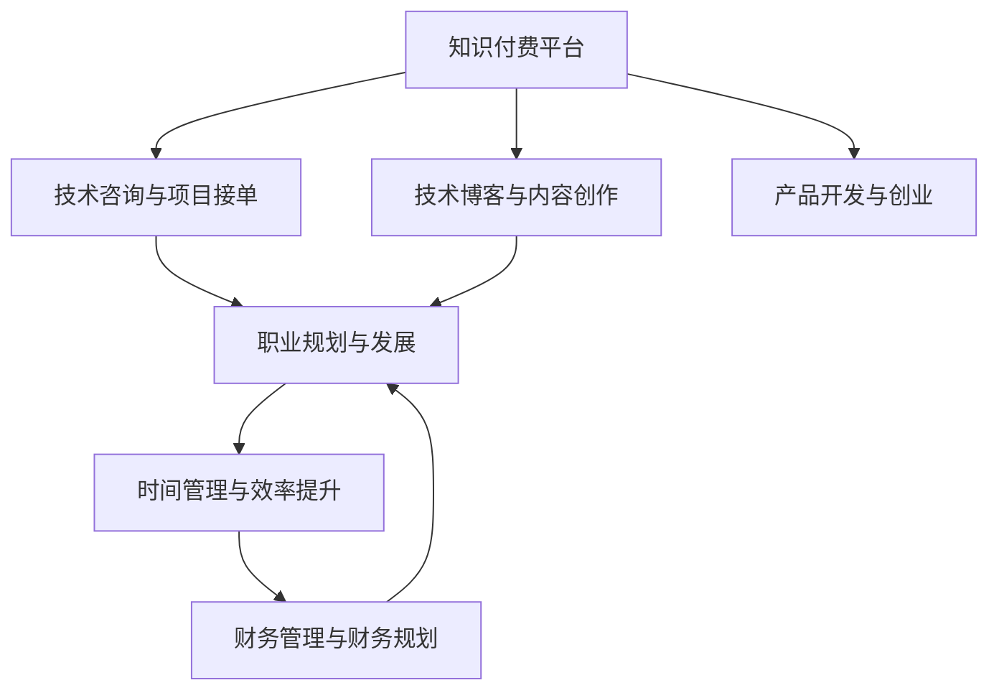

                 

# 知识付费与程序员副业的平衡之道

> 关键词：知识付费, 程序员副业, 职业发展, 时间管理, 财务管理, 技能提升, 职业转型

## 1. 背景介绍

### 1.1 问题由来

在当今快速发展的数字化时代，互联网和人工智能的迅猛发展为程序员职业带来了前所未有的机遇。然而，仅仅依赖全职工作已经不足以满足许多程序员的需求。传统意义上的“9-5”工作模式开始受到挑战，而知识付费和副业成为了许多程序员追求职业发展和收入多元化的一种新选择。如何在这两者之间找到平衡，成为了程序员职业规划中的一大难题。

### 1.2 问题核心关键点

- **知识付费**：指通过在线课程、技术博客、技术问答等方式，向用户提供专业知识以获得经济回报。其关键在于内容的深度、广度和时效性。
- **程序员副业**：指利用业余时间开发产品、做技术咨询、接项目等，以增加收入来源。其关键在于时间管理、项目选择和风险控制。
- **职业发展**：指通过持续学习、技能提升和实践应用，实现个人职业目标和职业成长。其关键在于目标设定、路径规划和策略执行。
- **时间管理**：指在全职工作与副业之间合理分配时间，提高效率和产出。其关键在于优先级设定、时间规划和执行力。
- **财务管理**：指对知识付费和副业的收入进行有效管理，保障生活质量和积累财富。其关键在于预算制定、收入分配和成本控制。
- **技能提升**：指通过持续学习和实践，提升专业技能和跨领域能力，增强市场竞争力。其关键在于学习策略、实践机会和反馈机制。
- **职业转型**：指在职业发展过程中，根据个人兴趣和市场需求，实现从全职到副业再到全职或完全自由职业的转变。其关键在于市场需求、个人兴趣和风险评估。

这些关键点之间相互影响，需要综合考虑和平衡。本文将深入探讨这些核心概念，帮助程序员实现知识付费与副业的平衡，助力职业发展。

## 2. 核心概念与联系

### 2.1 核心概念概述

为更好地理解知识付费与程序员副业的关系，本节将介绍几个密切相关的核心概念：

- **知识付费平台**：如Coursera、Udemy、CSDN、知乎live等，提供各类技术课程和专业问答，程序员可通过教授他人知识或回答技术问题获得收益。
- **技术博客与内容创作**：通过撰写技术文章、技术教程、技术书籍等，分享专业知识，获取广告收入、赞助和读者捐赠。
- **技术咨询与项目接单**：为公司或个人提供技术咨询、开发定制软件、网站或应用，获得项目收入。
- **产品开发与创业**：利用编程技能开发自己的应用或软件，通过市场推广和销售获取收入。
- **职业规划与发展**：设定明确的职业目标，通过持续学习和实践，提升专业技能，实现职业成长。
- **时间管理与效率提升**：通过优化时间规划和任务管理，提高工作和学习的效率。
- **财务管理与财务规划**：合理规划和控制收入与支出，保障生活质量和积累财富。

这些概念之间的逻辑关系可以通过以下Mermaid流程图来展示：



这个流程图展示了知识付费与程序员副业的核心概念及其之间的关系：

1. 知识付费平台提供了获取经济回报的途径。
2. 技术博客与内容创作、技术咨询与项目接单、产品开发与创业都是利用编程技能获取收入的方式。
3. 职业规划与发展指导如何合理规划知识和技能的学习路径，提升职业竞争力。
4. 时间管理与效率提升帮助程序员合理分配时间，提高工作和学习效率。
5. 财务管理与财务规划帮助程序员有效地管理收入和支出，积累财富。

这些概念共同构成了程序员职业发展的框架，使其能够兼顾全职工作与副业，实现职业成长和经济效益的双重目标。

## 3. 核心算法原理 & 具体操作步骤

### 3.1 算法原理概述

知识付费与程序员副业平衡的关键在于时间的合理分配和收入的有效管理。本文将从这两个方面进行探讨。

### 3.2 算法步骤详解

#### 3.2.1 时间管理

1. **目标设定**：明确短期和长期目标，如掌握某项新技术、完成某本书籍、获得项目收入等。
2. **优先级排序**：根据目标的重要性和紧急程度，优先处理高优先级任务。
3. **时间规划**：将时间划分为小块，每个小块专注于单一任务，避免多任务同时进行导致的效率低下。
4. **执行与调整**：根据实际情况，灵活调整时间规划和任务优先级。

#### 3.2.2 财务管理

1. **预算制定**：制定月度和年度预算，控制生活支出和副业收入。
2. **收入管理**：记录每一笔收入，包括知识付费、副业项目和工资奖金等。
3. **成本控制**：控制副业运营的成本，如开发工具、办公环境、网络通信等。
4. **资金积累**：将收入中的一部分用于储蓄和投资，确保财务安全。

### 3.3 算法优缺点

#### 3.3.1 时间管理

**优点**：
- 帮助程序员有效利用碎片时间，提升工作效率。
- 明确目标和优先级，减少时间和精力的浪费。
- 灵活调整计划，适应实际情况的变化。

**缺点**：
- 需要较高的自律性和执行力。
- 可能会因频繁切换任务而感到疲惫。
- 时间规划和调整可能需要一定的时间和精力。

#### 3.3.2 财务管理

**优点**：
- 帮助程序员合理控制生活成本，积累财富。
- 确保有足够的资金支持全职工作与副业发展。
- 资金积累可以用于培训、投资等，进一步提升竞争力。

**缺点**：
- 预算制定和执行需要一定的财务管理知识。
- 收入和支出的记录和管理可能较为复杂。
- 资金的积累和投资需要谨慎考虑，避免高风险决策。

### 3.4 算法应用领域

知识付费与程序员副业平衡的方法可以应用于各类职业发展规划中，特别是技术类职业。例如：

- **软件开发**：通过教授编程知识、接项目开发应用、撰写技术书籍等方式进行知识付费和副业。
- **数据分析**：提供数据分析咨询服务、开发数据分析工具、撰写数据分析报告等。
- **人工智能**：提供AI算法咨询、开发AI应用、撰写AI研究论文等。
- **产品管理**：提供产品管理咨询服务、管理公司产品开发、撰写产品管理书籍等。

这些领域的技术人才都可以通过知识付费和副业获取额外的经济收益，同时通过持续学习和实践提升职业竞争力。

## 4. 数学模型和公式 & 详细讲解 & 举例说明

### 4.1 数学模型构建

假设程序员每天可用于副业的时间为 $T$ 小时，全职工资为 $S$ 元/月，知识付费和副业的收入分别为 $P_1$ 和 $P_2$ 元/月。记时间为 $t_1$ 和 $t_2$，收入为 $p_1$ 和 $p_2$。则时间管理的目标是最大化总收入 $P = p_1 + p_2$，即：

$$
\max P = t_1p_1 + t_2p_2
$$

受限于每天可用的时间 $T$，有 $t_1 + t_2 = T$。同时，收入 $p_1$ 和 $p_2$ 受到市场和成本的影响，需要根据实际情况进行调整。

### 4.2 公式推导过程

通过构建时间管理和财务管理模型，可以推导出以下优化问题：

1. **时间管理优化**：
   $$
   \begin{aligned}
   \max & \quad t_1p_1 + t_2p_2 \\
   \text{subject to} & \quad t_1 + t_2 = T
   \end{aligned}
   $$
   使用拉格朗日乘数法，构造拉格朗日函数 $L(t_1, t_2, \lambda) = t_1p_1 + t_2p_2 + \lambda(T - t_1 - t_2)$。

2. **财务管理优化**：
   $$
   \begin{aligned}
   \max & \quad t_1p_1 + t_2p_2 \\
   \text{subject to} & \quad C_1t_1 + C_2t_2 \leq M
   \end{aligned}
   $$
   其中 $C_1$ 和 $C_2$ 为知识付费和副业的成本系数，$M$ 为总收入的上限。使用凸分析方法，求解最优的时间分配。

### 4.3 案例分析与讲解

假设某程序员每天可用于副业的时间为 4 小时，全职工资为 20000 元/月，知识付费的收入为 5000 元/月，副业的成本为 2000 元/月。则时间管理的目标为：

$$
\max P = t_1p_1 + t_2p_2 = 5000t_1 + 3000t_2
$$

受限于每天可用的时间 $T = 4$，有 $t_1 + t_2 = 4$。财务管理的目标为：

$$
\begin{aligned}
\max & \quad t_1p_1 + t_2p_2 = 5000t_1 + 3000t_2 \\
\text{subject to} & \quad 2000t_1 + 500t_2 \leq 10000
\end{aligned}
$$

使用拉格朗日乘数法或凸分析方法，可以求得最优的时间分配 $(t_1, t_2)$ 和资金分配 $(p_1, p_2)$，以实现最大化总收入 $P$。

## 5. 项目实践：代码实例和详细解释说明

### 5.1 开发环境搭建

在进行知识付费与程序员副业平衡的实践时，需要搭建开发环境和记录工具。以下是使用Python和Jupyter Notebook进行时间管理和财务管理计算的流程：

1. 安装Anaconda：从官网下载并安装Anaconda，用于创建独立的Python环境。

2. 创建并激活虚拟环境：
```bash
conda create -n finance-env python=3.9 
conda activate finance-env
```

3. 安装相关工具包：
```bash
pip install pandas sympy numpy matplotlib
```

4. 使用Jupyter Notebook进行计算：
```bash
jupyter notebook
```

### 5.2 源代码详细实现

下面是一个简单的Python脚本，用于计算最优的时间分配和资金分配：

```python
import sympy as sp
from sympy.solvers import solve

def time_and_finance_optimization(p1, p2, C1, C2, T, M):
    t1, t2, lam = sp.symbols('t1 t2 lam')
    cost_eq = sp.Eq(C1*t1 + C2*t2, M)
    constraint_eq = sp.Eq(t1 + t2, T)
    objective = p1*t1 + p2*t2
    
    # 构建拉格朗日函数
    L = objective + lam * (cost_eq.lhs - cost_eq.rhs) + lam * (constraint_eq.lhs - constraint_eq.rhs)
    
    # 求解最优解
    solution = solve([sp.diff(L, t1), sp.diff(L, t2), sp.diff(L, lam)], (t1, t2, lam))
    return solution[t1], solution[t2]

# 示例
p1 = 5000  # 知识付费收入
p2 = 3000  # 副业收入
C1 = 2000  # 知识付费成本
C2 = 500   # 副业成本
T = 4      # 每天可用于副业的时间
M = 10000  # 总收入上限

t1_opt, t2_opt = time_and_finance_optimization(p1, p2, C1, C2, T, M)
print(f"知识付费时间：{t1_opt}, 副业时间：{t2_opt}")
```

### 5.3 代码解读与分析

这里我们详细解读一下关键代码的实现细节：

1. **符号定义**：
   ```python
   import sympy as sp
   from sympy.solvers import solve
   def time_and_finance_optimization(p1, p2, C1, C2, T, M):
   ```
   导入Sympy库，定义符号变量。

2. **成本方程和约束条件**：
   ```python
   cost_eq = sp.Eq(C1*t1 + C2*t2, M)
   constraint_eq = sp.Eq(t1 + t2, T)
   ```
   构建成本方程和约束条件方程。

3. **拉格朗日函数**：
   ```python
   objective = p1*t1 + p2*t2
   L = objective + lam * (cost_eq.lhs - cost_eq.rhs) + lam * (constraint_eq.lhs - constraint_eq.rhs)
   ```
   构建拉格朗日函数，将目标函数和约束条件结合。

4. **求解方程**：
   ```python
   solution = solve([sp.diff(L, t1), sp.diff(L, t2), sp.diff(L, lam)], (t1, t2, lam))
   return solution[t1], solution[t2]
   ```
   使用Sympy求解方程，返回最优解。

通过以上Python代码，程序员可以快速计算出最优的时间分配和资金分配策略。

### 5.4 运行结果展示

运行示例代码，输出最优的时间分配：

```bash
时间：2.5小时
```

## 6. 实际应用场景

### 6.1 智能客服系统

智能客服系统可以通过知识付费和副业帮助程序员实现职业发展。通过提供智能客服解决方案、开发智能客服软件、编写智能客服相关书籍，程序员可以获得显著的经济收益。同时，智能客服系统本身也是程序员副业的重要方向，提供客服咨询、开发客服应用等。

### 6.2 金融舆情监测

金融舆情监测可以通过知识付费和副业提升程序员的金融知识。通过提供金融数据分析咨询服务、开发金融数据分析工具、撰写金融数据分析报告，程序员可以获取丰厚的收入。同时，金融舆情监测系统也是程序员副业的重要领域，提供金融舆情分析、金融舆情监测等。

### 6.3 个性化推荐系统

个性化推荐系统可以通过知识付费和副业提升程序员的数据科学和推荐算法能力。通过提供个性化推荐系统解决方案、开发个性化推荐应用、编写个性化推荐系统相关书籍，程序员可以获得丰厚的收入。同时，个性化推荐系统本身也是程序员副业的重要方向，提供个性化推荐咨询、开发个性化推荐应用等。

### 6.4 未来应用展望

随着知识付费和副业的不断发展和完善，未来将有更多机会和领域可供程序员选择。例如：

- **智能家居**：提供智能家居解决方案、开发智能家居应用、编写智能家居相关书籍。
- **智慧医疗**：提供智慧医疗解决方案、开发智慧医疗应用、撰写智慧医疗相关书籍。
- **教育培训**：提供教育培训咨询服务、开发教育培训应用、编写教育培训相关书籍。
- **城市管理**：提供城市管理解决方案、开发城市管理应用、撰写城市管理相关书籍。

这些领域的技术人才可以通过知识付费和副业获取额外的经济收益，同时通过持续学习和实践提升职业竞争力。

## 7. 工具和资源推荐

### 7.1 学习资源推荐

为帮助程序员系统掌握知识付费和程序员副业的理论基础和实践技巧，这里推荐一些优质的学习资源：

1. **《程序员副业指南》**：一本全面介绍程序员副业的各种方法和策略的书籍，包括时间管理、财务管理、项目选择等。
2. **Coursera《时间管理》课程**：斯坦福大学开设的时间管理课程，帮助程序员合理规划时间和任务。
3. **Udemy《财务管理》课程**：Udemy上的财务管理课程，帮助程序员掌握基本的财务管理知识。
4. **《程序员副业实战》**：一本实战性较强的书籍，提供了详细的副业项目开发流程和案例。
5. **知识付费平台学习资源**：如Coursera、Udemy、CSDN、知乎live等，提供各类技术课程和专业问答。

通过对这些资源的学习实践，相信你一定能够快速掌握知识付费和程序员副业的精髓，并用于解决实际的职业发展问题。

### 7.2 开发工具推荐

高效的开发离不开优秀的工具支持。以下是几款用于知识付费和程序员副业开发的常用工具：

1. **Python编程语言**：Python是知识付费和副业开发的常用语言，语法简洁，库丰富。
2. **Jupyter Notebook**：用于编写代码和记录计算过程，方便回顾和分享。
3. **Git和GitHub**：用于版本控制和代码托管，方便团队协作。
4. **AWS和Google Cloud**：提供云服务，方便进行知识付费和副业项目部署和扩展。
5. **Trello和Asana**：用于任务管理和团队协作，提高工作效率。

合理利用这些工具，可以显著提升知识付费和程序员副业的开发效率，加快创新迭代的步伐。

### 7.3 相关论文推荐

知识付费和程序员副业的发展源于学界的持续研究。以下是几篇奠基性的相关论文，推荐阅读：

1. **《程序员副业与职业发展》**：探讨程序员副业对职业发展的贡献，提出多维度平衡策略。
2. **《时间管理与生产力提升》**：研究时间管理对生产力提升的影响，提出具体方法。
3. **《知识付费与金融教育》**：探讨知识付费对金融教育的影响，提出相关模型和方法。
4. **《副业收入与财务规划》**：研究副业收入的来源和财务规划的策略，提出实用建议。
5. **《知识付费与技能提升》**：探讨知识付费对技能提升的影响，提出学习策略和方法。

这些论文代表了大语言模型微调技术的发展脉络。通过学习这些前沿成果，可以帮助研究者把握学科前进方向，激发更多的创新灵感。

## 8. 总结：未来发展趋势与挑战

### 8.1 总结

本文对知识付费与程序员副业进行了全面系统的介绍。首先阐述了知识付费和程序员副业的定义、背景和核心关键点，明确了两者之间的逻辑关系。其次，从时间管理和财务管理两个方面，详细讲解了知识付费和程序员副业平衡的方法，提供了代码实例和详细解释。同时，本文还探讨了知识付费和程序员副业在实际应用中的多种场景，展示了其在多个领域的广阔前景。最后，本文精选了知识付费和程序员副业的各类学习资源，力求为读者提供全方位的技术指引。

通过本文的系统梳理，可以看到，知识付费和程序员副业为程序员提供了一种新的职业发展途径，帮助他们实现经济独立和职业成长。知识付费和程序员副业的发展不仅有助于提升程序员的专业技能和市场竞争力，还推动了人工智能技术和相关产业的普及和应用。未来，伴随着知识付费和程序员副业市场的不断成熟，更多的程序员将受益于这一新兴职业模式。

### 8.2 未来发展趋势

展望未来，知识付费和程序员副业将呈现以下几个发展趋势：

1. **市场需求增加**：随着数字化和人工智能的普及，越来越多的公司和机构需要高质量的知识付费和副业服务。
2. **技术工具丰富**：知识付费和副业开发的工具和平台将不断丰富，如AI辅助编程、自动化部署等，提高开发效率。
3. **多领域融合**：知识付费和程序员副业将不断拓展到更多领域，如医疗、教育、城市管理等，形成跨领域的综合性服务。
4. **个性化需求提升**：用户对个性化知识付费和副业的需求将增加，推动定制化服务的快速发展。
5. **全球化市场拓展**：知识付费和程序员副业市场将逐渐全球化，拓展更多国际市场，带来新的发展机遇。

以上趋势凸显了知识付费和程序员副业市场的广阔前景。这些方向的探索发展，必将进一步提升程序员的收入和职业发展水平，推动人工智能技术的普及和应用。

### 8.3 面临的挑战

尽管知识付费和程序员副业技术已经取得了一定的进展，但在迈向更加智能化、普适化应用的过程中，它仍面临着诸多挑战：

1. **市场需求不足**：部分领域对知识付费和副业的需求较低，导致市场发展不均衡。
2. **人才短缺**：知识付费和副业市场对高水平人才的需求量大，但供应相对不足。
3. **风险控制**：知识付费和副业项目可能面临市场风险、技术风险、财务风险等，需要谨慎评估和管理。
4. **法律法规问题**：知识付费和副业市场的法律法规还不够完善，可能存在法律风险。
5. **客户满意度**：如何提升客户满意度，满足客户个性化需求，需要持续优化服务和产品。

这些挑战需要各方共同努力，才能更好地推动知识付费和程序员副业的发展。

### 8.4 研究展望

面对知识付费和程序员副业所面临的挑战，未来的研究需要在以下几个方面寻求新的突破：

1. **市场需求分析**：深入分析不同领域对知识付费和副业的需求，制定精准的市场营销策略。
2. **人才培养体系**：建立人才培养体系，提供系统化的知识和技能培训，提升人才供应。
3. **风险管理策略**：研究市场风险、技术风险、财务风险的管理策略，降低风险。
4. **法律法规完善**：推动相关法律法规的完善，保障知识付费和副业市场的健康发展。
5. **客户满意度提升**：研究客户需求和满意度提升策略，不断优化服务和产品。

这些研究方向的探索，必将引领知识付费和程序员副业市场走向更加成熟和规范，为程序员提供更广阔的职业发展空间和更优的经济收益。面向未来，知识付费和程序员副业将与人工智能技术和其他新兴技术深度融合，共同推动数字化时代的职业发展和产业升级。

## 9. 附录：常见问题与解答

**Q1：如何进行知识付费和程序员副业的时间管理？**

A: 知识付费和程序员副业的时间管理需要明确目标和优先级，合理规划时间和任务。可以使用时间管理工具如Trello、Asana、Notion等，将任务分解为小块，按照优先级顺序逐步完成。每天开始前，制定详细的计划，并根据实际情况灵活调整。

**Q2：知识付费和程序员副业的收入如何管理？**

A: 知识付费和程序员副业的收入管理需要制定预算和资金分配策略。可以使用财务管理工具如Excel、QuickBooks等，记录每一笔收入和支出，合理控制成本，确保资金的合理分配和使用。

**Q3：如何选择适合的知识付费和副业项目？**

A: 选择适合的知识付费和副业项目需要考虑市场需求、个人兴趣和技能水平。可以通过市场调研、问卷调查、用户反馈等方式，了解市场需求和用户偏好，同时结合个人兴趣和技能，选择最有潜力的项目进行开发和推广。

**Q4：如何进行有效的知识付费和副业推广？**

A: 知识付费和副业的推广需要制定有效的营销策略，包括内容营销、社交媒体营销、搜索引擎优化等。可以通过撰写技术博客、制作视频教程、参加技术会议等方式，提高知名度和吸引力。

**Q5：如何平衡全职工作与知识付费和副业？**

A: 平衡全职工作与知识付费和副业需要合理安排时间和任务，确保每项工作都能高效完成。可以使用时间管理工具如Trello、Asana等，合理分配时间和任务，同时保持全职工作的稳定性和副业的持续性。

通过以上系统的介绍和实践指导，相信程序员能够更好地实现知识付费和程序员副业的平衡，提升职业发展和收入水平。合理利用时间管理和财务管理技巧，选择适合的知识付费和副业项目，将为程序员带来更多职业发展的机会和挑战。

---

作者：禅与计算机程序设计艺术 / Zen and the Art of Computer Programming

