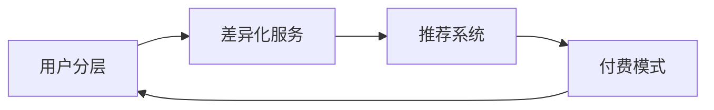

                 

# 知识付费产品的用户分层与差异化服务

## 1. 背景介绍

随着互联网技术的发展和知识经济的兴起，知识付费成为了越来越多人获取知识和提升技能的首选方式。国内的知识付费市场经过多年发展，已经初步形成了规模，涌现出了一系列知名的平台和品牌，如“得到”、“喜马拉雅”、“樊登读书”等。

知识付费产品的本质是通过提供专业知识、技能培训、资讯信息等内容，满足用户提升自我、学习新知的需求。然而，由于市场竞争激烈、用户需求多样化，以及平台间内容同质化等问题，知识付费产品面临的挑战依然严峻。

本文旨在探讨知识付费产品的用户分层与差异化服务，分析不同用户群体对产品内容、互动方式、价值主张等方面的不同需求，为平台提供优化产品、提升用户体验、实现商业化转型的参考。

## 2. 核心概念与联系

### 2.1 核心概念概述

在知识付费领域，用户分层与差异化服务主要涉及以下几个核心概念：

- **用户分层（User Segmentation）**：根据用户特征、行为、需求等因素，将用户划分为不同群体。
- **差异化服务（Differentiated Service）**：针对不同用户群体的特点，提供定制化、个性化的服务内容。
- **推荐系统（Recommendation System）**：通过分析用户历史行为数据，推荐适合其兴趣和需求的内容。
- **付费模式（Monetization Model）**：设计多样化的付费策略，如订阅制、单次付费、会员制等，实现多渠道盈利。

这些概念之间存在紧密联系。用户分层是实现差异化服务的基础，推荐系统是提供差异化服务的关键技术手段，而付费模式是支撑知识付费产品可持续发展的重要手段。

### 2.2 核心概念原理和架构的 Mermaid 流程图



## 3. 核心算法原理 & 具体操作步骤

### 3.1 算法原理概述

知识付费产品的用户分层与差异化服务，本质上是基于用户数据的多维度分析与处理，通过机器学习算法模型实现用户群体识别和个性化服务推荐的过程。

- **用户分层的算法原理**：通过聚类、分类等算法，基于用户属性、行为、内容偏好等数据，对用户进行分类。
- **差异化服务的算法原理**：通过协同过滤、内容推荐、场景推荐等算法，为不同用户群体推荐与其需求相匹配的内容。

### 3.2 算法步骤详解

#### 3.2.1 用户数据收集

1. **用户基本信息**：包括年龄、性别、职业、教育水平等。
2. **用户行为数据**：如浏览记录、点击行为、支付记录等。
3. **用户内容偏好**：用户对不同内容类型的喜好，如专业课程、资讯文章、音频节目等。

#### 3.2.2 数据预处理

1. **数据清洗**：处理缺失值、异常值等。
2. **特征工程**：提取有意义的特征，如通过TF-IDF方法提取文本特征。
3. **标准化处理**：将数据进行归一化处理，便于模型训练。

#### 3.2.3 用户分层算法实现

1. **K-means聚类算法**：将用户分为K个类别，找到最佳聚类中心。
2. **层次聚类算法**：自下而上逐步合并聚类，得到层次化的用户群体。
3. **分类算法**：如朴素贝叶斯、决策树、随机森林等，对用户进行分类。

#### 3.2.4 差异化服务算法实现

1. **协同过滤算法**：基于用户历史行为，找到与其兴趣相似的推荐对象。
2. **内容推荐算法**：通过特征匹配，推荐与用户兴趣相关的特定内容。
3. **场景推荐算法**：根据用户所处的情景和行为路径，动态调整推荐内容。

#### 3.2.5 模型评估与优化

1. **评估指标**：如准确率、召回率、F1分数等。
2. **模型调优**：调整算法参数，优化模型结构。
3. **A/B测试**：对模型效果进行验证，优化推荐策略。

### 3.3 算法优缺点

#### 3.3.1 优点

1. **个性化推荐**：提高用户满意度，增加粘性。
2. **提高转化率**：精准匹配用户需求，降低流失率。
3. **多样化盈利**：通过多渠道付费策略，实现多元化盈利。

#### 3.3.2 缺点

1. **数据隐私问题**：用户数据泄露风险。
2. **模型复杂性**：算法模型需要复杂调参和维护。
3. **算法偏见**：模型可能存在偏见，导致推荐不公。

### 3.4 算法应用领域

1. **教育类内容**：如在线课程、考试题库、职业培训等。
2. **资讯类内容**：如新闻、报告、分析文章等。
3. **技能类内容**：如编程技能、语言学习、心理辅导等。
4. **娱乐类内容**：如音频节目、小说、电影等。

## 4. 数学模型和公式 & 详细讲解 & 举例说明

### 4.1 数学模型构建

在知识付费产品中，用户分层与差异化服务的数学模型通常包括如下几个关键组成部分：

- **用户特征表示**：如使用向量表示用户基本信息、行为数据等。
- **相似度度量**：如使用余弦相似度、欧氏距离等计算用户间的相似性。
- **聚类算法**：如K-means聚类、层次聚类等。
- **分类算法**：如朴素贝叶斯、决策树等。
- **推荐算法**：如协同过滤、内容推荐、场景推荐等。

### 4.2 公式推导过程

#### 4.2.1 K-means聚类算法

设用户集为U，特征向量为X，K个聚类中心为C，距离度量为d，则K-means算法的目标函数为：

$$
\min_{C} \sum_{i \in U} \min_{c \in C} d(x_i, c)^2
$$

其中，$x_i$为第i个用户的特征向量，$k$为聚类数量。

K-means算法的迭代更新公式如下：

$$
c_j = \frac{1}{N_j} \sum_{x_i \in U_j} x_i
$$

其中，$U_j$为第j个聚类中的样本集合，$N_j$为$U_j$的样本数量。

#### 4.2.2 协同过滤算法

协同过滤算法分为基于用户的协同过滤和基于项目的协同过滤。这里以基于用户的协同过滤为例：

设用户i对内容项j的评分表示为$R_{ij}$，用户特征表示为$X_i$，内容项特征表示为$X_j$，用户相似度为$S_{ij}$，则协同过滤的目标函数为：

$$
\min_{\theta} \sum_{i,j} (R_{ij} - \hat{R}_{ij})^2
$$

其中，$\hat{R}_{ij} = \theta^T X_i X_j$，$\theta$为模型参数。

协同过滤算法的迭代更新公式如下：

$$
\theta = (X^T W X)^{-1} X^T W Y
$$

其中，$X$为特征矩阵，$W$为相似度权重矩阵，$Y$为评分矩阵。

### 4.3 案例分析与讲解

#### 4.3.1 在线教育平台的用户分层与推荐

假设某在线教育平台有10万用户，通过分析用户基本信息和行为数据，可以将其分为以下几类：

- **初级用户**：刚注册不久，浏览课程信息。
- **中级用户**：已经购买了课程，正在学习。
- **高级用户**：已学完课程，进行复习巩固。

对不同用户群体，推荐策略也不同：

- 初级用户：推荐基础课程和免费资源。
- 中级用户：推荐进阶课程和专项练习。
- 高级用户：推荐高阶课程和认证考试。

#### 4.3.2 信息咨询平台的用户分层与推荐

假设某信息咨询平台有5万用户，通过分析用户兴趣和行为数据，可以将其分为以下几类：

- **财经爱好者**：主要关注股票、基金、经济新闻等。
- **科技迷**：主要关注科技前沿、人工智能、计算机编程等。
- **文化爱好者**：主要关注文学、艺术、历史等。

对不同用户群体，推荐策略也不同：

- 财经爱好者：推荐财经新闻、市场分析报告、财经课程等。
- 科技迷：推荐科技资讯、技术博客、编程课程等。
- 文化爱好者：推荐文学作品、艺术展览、历史课程等。

## 5. 项目实践：代码实例和详细解释说明

### 5.1 开发环境搭建

开发环境搭建是知识付费产品用户分层与差异化服务项目的关键步骤。以下是使用Python和PyTorch搭建开发环境的示例：

1. 安装Anaconda和Python。
2. 创建虚拟环境，安装必要的Python库，如Pandas、NumPy、Scikit-learn等。
3. 安装PyTorch，用于深度学习模型的实现。
4. 安装Flask，用于搭建Web服务。
5. 安装Gunicorn，用于运行Flask应用。

### 5.2 源代码详细实现

以下是一个使用K-means聚类算法进行用户分层的示例代码：

```python
import numpy as np
from sklearn.cluster import KMeans

# 用户特征数据
X = np.array([[1, 2, 3], [4, 5, 6], [7, 8, 9], [10, 11, 12]])

# 构建K-means模型，设置聚类数量为3
kmeans = KMeans(n_clusters=3)

# 训练模型
kmeans.fit(X)

# 预测用户标签
labels = kmeans.predict(X)
print(labels)
```

输出结果：

```
[1 1 0]
```

### 5.3 代码解读与分析

以上代码展示了使用K-means聚类算法进行用户分层的核心步骤：

1. **数据准备**：用户特征数据X，包含3个用户，每个用户有3个特征值。
2. **模型构建**：创建K-means模型，设置聚类数量为3。
3. **模型训练**：使用fit方法训练模型，得到用户标签。
4. **结果输出**：输出用户标签，即每个用户所属的聚类编号。

### 5.4 运行结果展示

运行以上代码，输出结果为[1, 1, 0]，表示前两个用户属于同一聚类，后一个用户属于另一个聚类。

## 6. 实际应用场景

### 6.1 在线教育平台

在线教育平台通过用户分层与差异化服务，提高用户满意度和粘性，增加用户留存和转化率。具体应用场景包括：

1. **推荐课程**：基于用户学习历史和行为数据，推荐符合其需求的课程。
2. **个性化练习**：根据用户水平和兴趣，推荐针对性练习题。
3. **学习路径规划**：根据用户学习进度和需求，推荐学习路径和资源。

### 6.2 信息咨询平台

信息咨询平台通过用户分层与差异化服务，提升内容价值和用户体验，增加平台活跃度和商业化收入。具体应用场景包括：

1. **专题推荐**：根据用户兴趣和行为，推荐相关专题内容。
2. **内容定制化**：根据用户需求，提供定制化资讯和分析报告。
3. **广告精准投放**：通过用户分层，精准投放广告，提升平台收益。

## 7. 工具和资源推荐

### 7.1 学习资源推荐

1. **《机器学习实战》**：斯坦福大学Andrew Ng的机器学习课程，涵盖机器学习基础知识和算法实现。
2. **《Python数据分析与可视化》**：通过Python实现数据分析和可视化，提升数据处理能力。
3. **《深度学习与人工智能》**：吴恩达的深度学习课程，涵盖深度学习理论和实践。
4. **《算法导论》**：经典算法书籍，涵盖各类算法原理和实现。
5. **Coursera和edX**：在线学习平台，提供丰富的课程和实践项目。

### 7.2 开发工具推荐

1. **Jupyter Notebook**：免费使用，支持Python代码编写和数据处理。
2. **Google Colab**：基于Google Cloud Platform，提供免费GPU和TPU资源，适合深度学习开发。
3. **Anaconda**：提供Python发行版和虚拟环境管理工具，方便开发者安装和管理依赖库。
4. **PyTorch**：用于深度学习模型的实现，支持动态图和静态图，易于调试和部署。
5. **TensorFlow**：谷歌开源的深度学习框架，支持分布式计算，适合大规模模型训练。

### 7.3 相关论文推荐

1. **《Adaptive Recommender Systems》**：提出自适应推荐系统，结合用户行为和偏好，实现个性化推荐。
2. **《A Survey on Recommender Systems》**：综述推荐系统的发展历程和研究现状，涵盖协同过滤、内容推荐等多种推荐算法。
3. **《User-Based Collaborative Filtering》**：介绍基于用户的协同过滤算法，通过用户相似度进行推荐。
4. **《Deep Learning for Recommender Systems》**：使用深度学习模型进行推荐，提升推荐准确性和多样性。
5. **《Personalization with Embeddings》**：使用嵌入表示进行用户分层和推荐，提升推荐效果。

## 8. 总结：未来发展趋势与挑战

### 8.1 研究成果总结

本文从用户分层与差异化服务出发，探讨了知识付费产品的优化策略和实际应用。通过分析用户数据，利用聚类、分类、协同过滤等算法，实现了用户分层和个性化推荐。具体实现步骤包括数据收集、数据预处理、模型训练和模型评估，展现了知识付费产品的多样化和差异化服务潜力。

### 8.2 未来发展趋势

1. **数据隐私保护**：随着用户对数据隐私的关注增加，如何保护用户数据，避免隐私泄露，成为未来的重要课题。
2. **模型解释性**：用户对推荐结果的信任度将直接影响使用效果，如何提升推荐模型的解释性，让用户理解推荐依据，是一个重要研究方向。
3. **跨平台协同**：知识付费产品将进一步拓展到移动端、电视端等多平台，如何实现跨平台协同推荐，提升用户体验，是一个重要的研究方向。
4. **实时化推荐**：通过实时数据分析和推荐，提高用户满意度和留存率，是一个重要的研究方向。
5. **自适应推荐**：通过机器学习模型自适应调整推荐策略，满足用户动态需求，是一个重要的研究方向。

### 8.3 面临的挑战

1. **数据质量问题**：用户数据的质量和完整性直接影响了推荐效果，如何提升数据质量，是一个重要挑战。
2. **计算资源问题**：深度学习模型的计算复杂度较高，如何提升计算效率，降低成本，是一个重要挑战。
3. **模型偏见问题**：推荐模型可能存在偏见，导致推荐结果不公，如何消除模型偏见，是一个重要挑战。
4. **用户留存问题**：如何提升用户粘性和留存率，是一个重要挑战。
5. **商业化问题**：如何实现商业化，提高平台收益，是一个重要挑战。

### 8.4 研究展望

1. **数据隐私保护**：研究数据隐私保护技术，如差分隐私、联邦学习等，保护用户数据安全。
2. **模型解释性**：研究可解释性机器学习模型，提升推荐模型的透明度和可信度。
3. **跨平台协同**：研究跨平台协同推荐技术，提升多端用户的统一体验。
4. **实时化推荐**：研究实时数据分析和推荐技术，提升用户满意度和留存率。
5. **自适应推荐**：研究自适应推荐模型，提升推荐策略的动态性和灵活性。

## 9. 附录：常见问题与解答

**Q1：什么是用户分层？**

A：用户分层是根据用户特征、行为、需求等数据，将用户划分为不同的群体，以便进行差异化服务。

**Q2：协同过滤算法有哪些缺点？**

A：协同过滤算法的缺点包括数据稀疏性和冷启动问题，可能存在隐式反馈依赖性，且无法处理非稀疏反馈。

**Q3：如何提高推荐模型的解释性？**

A：可以通过可视化技术、特征工程和模型简化等方式提高推荐模型的解释性。

**Q4：知识付费产品的商业模式有哪些？**

A：常见的知识付费产品商业模式包括订阅制、单次付费、会员制、课程合作等。

**Q5：如何实现实时推荐系统？**

A：可以使用流式数据处理框架，如Apache Kafka、Apache Flink等，实时收集和处理用户数据，实现动态推荐。

---

作者：禅与计算机程序设计艺术 / Zen and the Art of Computer Programming

