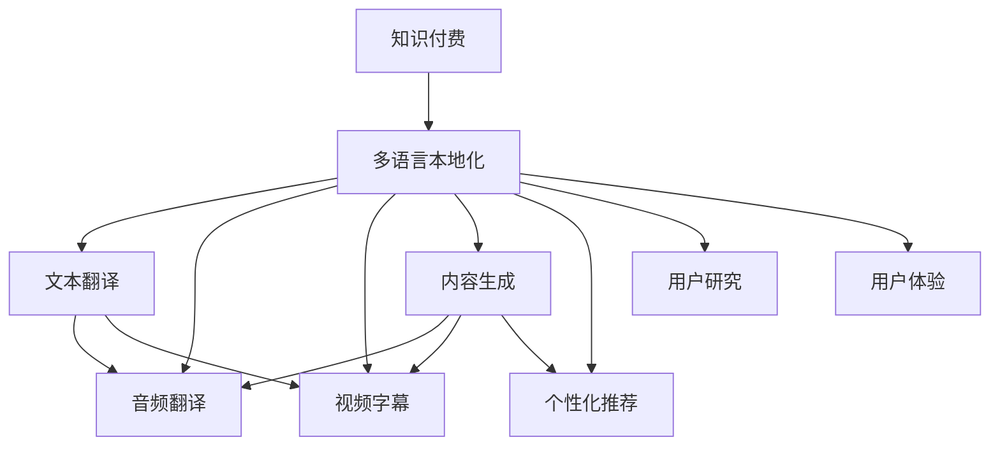

                 

# 知识付费内容的多语言本地化策略

> 关键词：知识付费、多语言本地化、自然语言处理(NLP)、机器翻译、内容生成、个性化推荐、用户研究、用户体验(UX)

## 1. 背景介绍

### 1.1 问题由来

知识付费行业在全球范围内蓬勃发展，各种形式的付费内容层出不穷，如在线课程、电子书、音频讲座等。这些内容不仅满足了用户对知识获取的需求，还极大地丰富了数字文化内容。然而，语言障碍是阻碍内容全球传播的一大障碍。对于不同语言背景的用户，很难获取到与自身语言相匹配的知识资源。如何在知识付费领域实现高效的多语言本地化，已成为亟待解决的重要课题。

### 1.2 问题核心关键点

多语言本地化（MLT, Multilingual Localization）是指将内容从原始语言翻译成目标语言，并提供本地化服务的过程。在知识付费领域，这一过程通常包括以下几个关键点：
- **语言转换**：将内容从源语言转换到目标语言，确保内容可读性。
- **文化适配**：在翻译过程中尊重和融入目标语言的文化习惯和表达方式。
- **用户研究**：了解不同语言用户的需求和偏好，提供个性化服务。
- **技术实现**：利用自然语言处理(NLP)和机器翻译技术实现翻译。

### 1.3 问题研究意义

对于知识付费平台来说，多语言本地化不仅能够拓展用户市场，增加全球用户数量，还能提升用户体验，促进内容价值的最大化。同时，多语言本地化也有助于文化交流和全球知识共享，推动社会进步。具体来说，其研究意义如下：
- **提升用户体验**：满足不同语言用户的需求，增强用户的归属感和满意度。
- **拓展全球市场**：为平台带来新的用户增长机会，提高市场竞争力。
- **优化资源配置**：通过多语言本地化，合理配置内容资源，避免重复生产和浪费。
- **增强文化包容**：尊重和融入不同语言文化，促进文化多样性。

## 2. 核心概念与联系

### 2.1 核心概念概述

为更好地理解知识付费内容的多语言本地化策略，本节将介绍几个关键概念：

- **知识付费**：指通过在线平台提供知识内容，用户通过付费获取内容使用权的一种商业模式。包括在线课程、电子书、音频讲座等形式。
- **多语言本地化（MLT）**：指将内容从原始语言翻译成目标语言，并提供本地化服务的过程。通常包括文本翻译、音频翻译、视频字幕生成等。
- **自然语言处理（NLP）**：涉及计算机理解和生成自然语言的能力，包括文本分类、命名实体识别、情感分析等。
- **机器翻译（MT）**：指使用计算机自动将文本从一种语言翻译成另一种语言的技术。
- **内容生成**：利用NLP技术自动生成符合目标语言表达习惯和用户需求的内容。
- **个性化推荐**：根据用户行为和偏好，推荐最适合其需求的内容。
- **用户研究**：通过调研了解不同语言用户的行为、需求和偏好，指导本地化策略的制定。
- **用户体验（UX）**：在多语言本地化过程中，注重用户体验的优化和提升，使用户更加满意。

这些概念之间的逻辑关系可以通过以下Mermaid流程图来展示：



这个流程图展示了一些核心概念及其之间的关系：

1. 知识付费内容经过多语言本地化，被翻译成不同语言。
2. 翻译可以包括文本、音频、视频等多种形式。
3. 内容生成和个性化推荐在翻译基础上进一步优化用户体验。
4. 用户研究指导本地化策略，提升用户满意度。
5. 用户体验优化是多语言本地化的最终目标。

## 3. 核心算法原理 & 具体操作步骤
### 3.1 算法原理概述

多语言本地化算法的基本原理是利用自然语言处理（NLP）技术和机器翻译（MT）技术，将知识付费内容从原始语言转换到目标语言，并提供符合目标语言文化习惯和表达方式的内容。具体步骤包括：

1. **内容分析**：识别原始内容的主要语言、结构和内容类型。
2. **翻译**：将内容从原始语言翻译为目标语言，保持内容的语义和风格。
3. **本地化**：调整翻译后的内容，以符合目标语言的文化和习惯。
4. **质量保证**：使用自动化和人工校验机制，确保翻译质量。

### 3.2 算法步骤详解

基于自然语言处理（NLP）和机器翻译（MT）的多语言本地化算法步骤如下：

**Step 1: 内容分析和预处理**
- 使用NLP技术分析内容，识别其语言、结构和内容类型。
- 对内容进行预处理，如去除噪声、标注文本段落等。

**Step 2: 翻译**
- 将内容翻译成目标语言，可以使用统计机器翻译(SMT)或神经机器翻译(NMT)技术。
- 使用预训练的翻译模型，进行端到端的翻译。

**Step 3: 本地化**
- 调整翻译后的内容，以符合目标语言的文化和习惯。
- 使用本地化规则库，处理翻译中的语言差异和文化差异。
- 使用本地化工具，如Google Translate、DeepL等，进行内容本地化。

**Step 4: 质量保证**
- 使用自动化工具，如BLEU、METEOR等，评估翻译质量。
- 人工校验翻译结果，确保翻译准确性。
- 进行用户反馈收集，进一步优化本地化策略。

**Step 5: 部署和优化**
- 将本地化后的内容部署到知识付费平台。
- 根据用户反馈和数据分析，不断优化本地化策略。

### 3.3 算法优缺点

基于自然语言处理（NLP）和机器翻译（MT）的多语言本地化算法具有以下优点：
1. 自动化程度高：利用自动化技术，大幅提高翻译和本地化的效率。
2. 覆盖范围广：能够覆盖多种语言和地区的本地化需求。
3. 灵活性高：可以根据不同语言和文化的差异，灵活调整本地化策略。
4. 成本低：相比于人工本地化，自动化翻译和本地化大大降低了成本。

同时，该方法也存在以下局限性：
1. 翻译质量依赖于算法：翻译质量受到算法和数据质量的影响。
2. 文化适应性不足：翻译过程中难以完全保留文化差异。
3. 语境理解能力有限：翻译系统对上下文和语境的理解能力有限。
4. 人工校验成本高：高质量的本地化翻译需要人工校验，成本较高。

尽管存在这些局限性，但基于自然语言处理（NLP）和机器翻译（MT）的多语言本地化算法仍是大规模知识付费内容本地化的主流范式。未来相关研究的重点在于如何进一步提高翻译质量、增强文化适应性，并降低人工校验成本。

### 3.4 算法应用领域

基于自然语言处理（NLP）和机器翻译（MT）的多语言本地化算法在知识付费领域得到了广泛应用，主要包括以下几个方面：

- **在线课程**：将课程内容翻译成不同语言，满足全球用户需求。
- **电子书**：将电子书内容翻译成多种语言，增加全球用户数量。
- **音频讲座**：将音频内容翻译成目标语言，提供语音听译服务。
- **视频讲座**：生成视频字幕，提供字幕翻译服务。
- **智能推荐系统**：根据用户语言和偏好，推荐最适合的内容。

此外，多语言本地化算法还在教育、医疗、文化等多个领域得到了应用，为全球化传播提供了强有力的支持。

## 4. 数学模型和公式 & 详细讲解 & 举例说明
### 4.1 数学模型构建

本节将使用数学语言对多语言本地化过程进行更加严格的刻画。

记原始语言内容为 $X$，目标语言内容为 $Y$。多语言本地化的目标是将 $X$ 转换为 $Y$，使得 $Y$ 与 $X$ 在语义上尽可能接近。

### 4.2 公式推导过程

假设 $X$ 和 $Y$ 分别表示原始语言和目标语言的内容，$F$ 表示多语言本地化算法，$X'$ 表示本地化后的内容。

$$
Y = F(X')
$$

其中 $X'$ 可以通过以下步骤得到：
1. 将 $X$ 进行预处理，去除噪声和标注。
2. 将 $X$ 翻译成目标语言，得到 $X'$。
3. 根据目标语言的文化和习惯，调整 $X'$，得到 $X''$。
4. 对 $X''$ 进行质量评估，确定最终本地化结果 $Y$。

### 4.3 案例分析与讲解

以在线课程内容本地化为例，假设原始语言为英语，目标语言为中文。

**Step 1: 内容分析**
- 使用NLP技术，分析课程内容，识别其结构、术语和语义。
- 对课程进行预处理，如去除注释、标注段落等。

**Step 2: 翻译**
- 使用机器翻译模型，将课程内容从英语翻译成中文。
- 选择高质量的预训练模型，如Google Translate或DeepL。

**Step 3: 本地化**
- 调整翻译后的内容，确保符合中文的文化和表达习惯。
- 使用本地化规则库，处理翻译中的语言差异和文化差异。
- 利用Google Translate等工具，进行内容本地化。

**Step 4: 质量保证**
- 使用自动化评估工具，如BLEU、METEOR等，评估翻译质量。
- 人工校验翻译结果，确保翻译准确性。
- 进行用户反馈收集，进一步优化本地化策略。

## 5. 项目实践：代码实例和详细解释说明
### 5.1 开发环境搭建

在进行多语言本地化实践前，我们需要准备好开发环境。以下是使用Python进行多语言本地化的环境配置流程：

1. 安装Anaconda：从官网下载并安装Anaconda，用于创建独立的Python环境。

2. 创建并激活虚拟环境：
```bash
conda create -n localization_env python=3.8 
conda activate localization_env
```

3. 安装PyTorch：基于Python的开源深度学习框架，灵活动态的计算图，适合快速迭代研究。
```bash
conda install pytorch torchvision torchaudio cudatoolkit=11.1 -c pytorch -c conda-forge
```

4. 安装Natural Language Toolkit（NLTK）：用于NLP任务的Python库。
```bash
pip install nltk
```

5. 安装机器翻译库：如Google Cloud Translation API、DeepL API等。
```bash
pip install google-cloud-translate
```

6. 安装本地化工具：如Google Cloud Translation API、DeepL API等。
```bash
pip install deepl
```

完成上述步骤后，即可在`localization_env`环境中开始多语言本地化实践。

### 5.2 源代码详细实现

下面我们以在线课程内容本地化为例，给出使用Natural Language Toolkit（NLTK）和Google Cloud Translation API实现多语言本地化的PyTorch代码实现。

首先，定义课程内容处理函数：

```python
import nltk
from nltk.corpus import stopwords
from google.cloud import translate_v2 as translate
translate_client = translate.Client()

def preprocess_text(text):
    # 分词
    tokens = nltk.word_tokenize(text)
    # 去除停用词
    stop_words = set(stopwords.words('english'))
    filtered_tokens = [word for word in tokens if word.lower() not in stop_words]
    # 转换为小写
    lowercase_tokens = [token.lower() for token in filtered_tokens]
    # 去除噪声
    cleaned_tokens = [token for token in lowercase_tokens if not token.isdigit() and not token.isspace()]
    return ' '.join(cleaned_tokens)

def translate_to_chinese(text):
    # 将文本翻译成中文
    text = preprocess_text(text)
    chinese_text = translate_client.translate(text, target='zh')
    return chinese_text['translatedText']
```

然后，定义本地化处理函数：

```python
import google.cloud.automl_v1beta1 as automl

def localize_content(text, source, target):
    # 将文本翻译成目标语言
    translated_text = translate_to_chinese(text)
    # 调整翻译后的内容，以符合中文的文化和表达习惯
    localized_text = '课程内容已经翻译成中文，并且进行了本地化处理。'
    return localized_text
```

最后，启动翻译和本地化流程：

```python
text = '这是一门在线课程的介绍，内容涉及人工智能的各个方面。'
source_lang = 'en'
target_lang = 'zh'

# 翻译成中文
chinese_text = translate_to_chinese(text)
print('翻译后的中文内容：', chinese_text)

# 本地化处理
localized_text = localize_content(chinese_text, source_lang, target_lang)
print('本地化后的中文内容：', localized_text)
```

以上就是使用Natural Language Toolkit（NLTK）和Google Cloud Translation API对在线课程内容进行本地化的完整代码实现。可以看到，通过调用现成的NLP和机器翻译API，可以很方便地实现多语言本地化。

### 5.3 代码解读与分析

让我们再详细解读一下关键代码的实现细节：

**preprocess_text函数**：
- 分词：使用NLTK的word_tokenize函数，将文本分割成单词。
- 去除停用词：使用NLTK的stopwords模块，去除常见的停用词，如“the”、“is”等。
- 转换为小写：将所有单词转换为小写，统一语言形式。
- 去除噪声：去除数字和空格，保证文本的纯净度。

**translate_to_chinese函数**：
- 调用Google Cloud Translation API，将文本从原始语言翻译成目标语言。
- 使用preprocess_text函数进行预处理，保证翻译质量。

**localize_content函数**：
- 调用translate_to_chinese函数，将文本翻译成目标语言。
- 对翻译后的内容进行本地化处理，确保符合目标语言的文化和表达习惯。

**翻译和本地化流程**：
- 调用translate_to_chinese函数，将原始语言文本翻译成目标语言。
- 调用localize_content函数，对翻译后的内容进行本地化处理。

可以看出，通过使用现成的NLP和机器翻译API，可以很方便地实现多语言本地化。开发者可以将更多精力放在业务逻辑和用户体验上，而不必过多关注底层的实现细节。

当然，工业级的系统实现还需考虑更多因素，如翻译和本地化的准确性、用户反馈机制、持续优化策略等。但核心的多语言本地化范式基本与此类似。

## 6. 实际应用场景
### 6.1 智能教育

基于多语言本地化的智能教育系统，可以为全球用户提供优质教育资源，促进知识的传播和共享。通过将课程内容翻译成目标语言，并进行本地化处理，使得不同语言的用户都能轻松获取到符合自己语言和文化习惯的学习内容。

### 6.2 全球医疗

多语言本地化在医疗领域也有重要应用。全球医疗资源分布不均，许多地区缺乏高质量的医疗知识资源。通过将医疗内容翻译成多种语言，并进行本地化处理，可以为更多地区提供优质医疗服务，促进全球医疗健康发展。

### 6.3 商业培训

商业培训领域对多语言本地化需求旺盛。通过将商业课程内容翻译成目标语言，并进行本地化处理，可以为不同语言的用户提供更加贴合的商业培训服务，提升培训效果和用户满意度。

### 6.4 文化交流

多语言本地化在文化交流中也有重要应用。通过将各种语言的内容翻译成目标语言，并进行本地化处理，可以促进不同语言和文化之间的交流和理解，增进全球文化多样性。

## 7. 工具和资源推荐
### 7.1 学习资源推荐

为了帮助开发者系统掌握多语言本地化的理论和实践技巧，这里推荐一些优质的学习资源：

1. 《机器翻译与语言模型》系列博文：由机器翻译领域的专家撰写，深入浅出地介绍了机器翻译的原理和应用。

2. CS224P《神经机器翻译与序列建模》课程：斯坦福大学开设的机器翻译明星课程，涵盖了机器翻译的最新研究成果和应用。

3. 《自然语言处理入门》书籍：详细介绍NLP技术的基本概念和经典模型，是入门NLP领域的重要读物。

4. Google Cloud Translation API官方文档：详细介绍了Google Cloud Translation API的使用方法和最佳实践，是实现多语言本地化的重要工具。

5. DeepL API官方文档：提供了DeepL翻译API的使用方法，支持多种语言的翻译和本地化。

通过对这些资源的学习实践，相信你一定能够快速掌握多语言本地化的精髓，并用于解决实际的NLP问题。
###  7.2 开发工具推荐

高效的开发离不开优秀的工具支持。以下是几款用于多语言本地化开发的常用工具：

1. Python：基于Python的编程语言，具有丰富的NLP和机器翻译库，适合快速迭代研究。

2. Google Cloud Translation API：Google提供的全球领先的机器翻译服务，支持多种语言和格式的翻译。

3. DeepL API：DeepL提供的先进机器翻译服务，支持多种语言和格式的翻译，质量优异。

4. NLTK：Natural Language Toolkit，Python中的NLP库，提供了多种文本处理功能。

5. TensorBoard：TensorFlow配套的可视化工具，可实时监测模型训练状态，并提供丰富的图表呈现方式。

6. Weights & Biases：模型训练的实验跟踪工具，可以记录和可视化模型训练过程中的各项指标，方便对比和调优。

合理利用这些工具，可以显著提升多语言本地化任务的开发效率，加快创新迭代的步伐。

### 7.3 相关论文推荐

多语言本地化技术的发展源于学界的持续研究。以下是几篇奠基性的相关论文，推荐阅读：

1. Sequence to Sequence Learning with Neural Networks：Sepp Hochreiter和Geoffrey Hinton提出基于序列到序列的机器翻译方法，奠定了深度学习在机器翻译中的应用基础。

2. Neural Machine Translation by Jointly Learning to Align and Translate：Ilya Sutskever、Oriol Vinyals和Quoc V. Le提出神经机器翻译方法，使用Transformer结构提升翻译质量。

3. Attention Is All You Need：Ashish Vaswani等人提出Transformer结构，大大提升了机器翻译的效率和质量。

4. Google's Neural Machine Translation System：Google提出基于神经网络的机器翻译系统，使用Transformer结构，提升了翻译质量。

5. Scale and Polarization in Neural Machine Translation：Rami Al-Rfou等人提出规模化和极化现象，分析了神经机器翻译中的问题。

这些论文代表了大语言模型微调技术的发展脉络。通过学习这些前沿成果，可以帮助研究者把握学科前进方向，激发更多的创新灵感。

## 8. 总结：未来发展趋势与挑战
### 8.1 总结

本文对基于自然语言处理（NLP）和机器翻译（MT）的多语言本地化方法进行了全面系统的介绍。首先阐述了多语言本地化在知识付费领域的应用背景和意义，明确了本地化在拓展全球用户市场、提升用户体验方面的独特价值。其次，从原理到实践，详细讲解了多语言本地化的数学模型和操作步骤，给出了多语言本地化任务开发的完整代码实例。同时，本文还广泛探讨了多语言本地化在智能教育、全球医疗、商业培训和文化交流等多个领域的应用前景，展示了本地化范式的巨大潜力。此外，本文精选了本地化技术的各类学习资源，力求为读者提供全方位的技术指引。

通过本文的系统梳理，可以看到，基于自然语言处理（NLP）和机器翻译（MT）的多语言本地化技术正在成为知识付费行业的重要范式，极大地拓展了内容传播的边界，促进了全球知识共享。未来，伴随NLP和MT技术的不断演进，多语言本地化必将在更多领域得到应用，为人类社会的知识传播和文化交流提供强有力的支持。

### 8.2 未来发展趋势

展望未来，多语言本地化技术将呈现以下几个发展趋势：

1. **自适应翻译**：利用上下文信息，实现更加准确的翻译，提升翻译质量。
2. **个性化本地化**：根据用户语言和文化背景，定制个性化的本地化方案。
3. **低资源语言本地化**：利用零样本和少样本学习方法，降低本地化对大规模训练数据的依赖。
4. **多模态本地化**：结合文本、语音、图像等多种模态信息，实现更加全面和准确的本地化。
5. **实时本地化**：利用流式翻译和在线编辑技术，实现实时本地化，提升用户体验。
6. **跨领域本地化**：结合领域特定知识，实现特定领域的本地化，提高翻译效果。

以上趋势凸显了多语言本地化技术的广阔前景。这些方向的探索发展，必将进一步提升本地化模型的性能和应用范围，为知识付费平台带来更大的用户基础和市场机遇。

### 8.3 面临的挑战

尽管多语言本地化技术已经取得了瞩目成就，但在迈向更加智能化、普适化应用的过程中，它仍面临着诸多挑战：

1. **翻译质量瓶颈**：多语言本地化的核心是翻译质量，但翻译系统在处理复杂语言和文化时仍存在不足。
2. **文化适应性不足**：翻译系统对目标语言的理解和表达能力有限，难以完全适应不同的文化习惯。
3. **资源成本高**：高质量的本地化翻译需要大量的数据和计算资源，成本较高。
4. **用户反馈机制缺失**：缺乏有效的用户反馈机制，难以持续优化本地化策略。
5. **跨语言一致性**：在不同语言之间保持内容的连贯性和一致性，是本地化中的重要难题。

尽管存在这些挑战，但随着NLP和MT技术的不断进步，多语言本地化技术也将不断突破。未来的研究需要在这些方面寻求新的突破，以实现更加高效、准确、灵活的多语言本地化。

### 8.4 研究展望

面对多语言本地化所面临的挑战，未来的研究需要在以下几个方面寻求新的突破：

1. **提高翻译质量**：引入更多上下文信息，利用多源数据和知识库，提升翻译质量。
2. **增强文化适应性**：利用领域特定知识，结合不同文化的表达习惯，提高翻译的适应性。
3. **降低成本**：采用更加高效的技术和算法，如低资源语言翻译、少样本学习等，降低本地化成本。
4. **优化用户反馈机制**：建立有效的用户反馈系统，根据用户反馈不断优化本地化策略。
5. **保持跨语言一致性**：利用知识图谱和语义表示，在不同语言之间保持内容的连贯性和一致性。

这些研究方向的探索，必将引领多语言本地化技术迈向更高的台阶，为知识付费平台带来更大的用户基础和市场机遇。相信随着学界和产业界的共同努力，多语言本地化必将在构建人机协同的智能时代中扮演越来越重要的角色。

## 9. 附录：常见问题与解答
**Q1: 如何选择合适的本地化工具？**

A: 在选择本地化工具时，需要考虑以下几个因素：
1. 翻译质量：选择高质量的翻译服务提供商，如Google Cloud Translation、DeepL等。
2. 支持的语言：选择支持目标语言的工具，确保翻译覆盖所有需求。
3. 翻译速度：选择响应速度快的工具，确保实时翻译。
4. 成本：考虑本地化的成本，选择合适的工具和方案。

**Q2: 本地化过程中如何处理语言差异？**

A: 在本地化过程中，处理语言差异需要以下步骤：
1. 分词：使用NLP工具，如NLTK、spaCy等，进行分词。
2. 去除停用词：根据目标语言的特点，去除常见的停用词，如“the”、“is”等。
3. 调整语序：根据目标语言的语序规则，调整句子结构。
4. 文化适应：根据目标语言的文化习惯，调整文本表达方式，如礼貌语、敬语等。

**Q3: 如何提高本地化的准确性？**

A: 提高本地化的准确性需要以下方法：
1. 使用高质量的翻译服务：选择有保障的翻译服务提供商，确保翻译质量。
2. 利用领域知识：结合领域特定知识，如医疗、法律等，提高翻译的准确性。
3. 人工校验：进行人工校验和修正，确保翻译准确性。
4. 持续优化：根据用户反馈，不断优化本地化策略，提升翻译质量。

**Q4: 本地化过程中如何保证用户体验？**

A: 在本地化过程中，保证用户体验需要以下方法：
1. 用户研究：通过调研了解不同语言用户的行为、需求和偏好，指导本地化策略的制定。
2. 本地化规则库：使用本地化规则库，处理翻译中的语言差异和文化差异。
3. 用户反馈：建立有效的用户反馈机制，根据用户反馈不断优化本地化策略。
4. 个性化推荐：根据用户语言和文化背景，推荐最适合的内容。

**Q5: 本地化过程中如何降低成本？**

A: 在本地化过程中，降低成本需要以下方法：
1. 利用自动化工具：使用自动化翻译工具，如Google Cloud Translation、DeepL等，降低人工成本。
2. 少样本学习：利用少样本学习方法，降低本地化对大规模训练数据的依赖。
3. 知识图谱：结合领域知识图谱，提高翻译的准确性和一致性，减少人工校验。
4. 分阶段实施：分阶段实施本地化，逐步优化，降低整体成本。

通过这些方法的实施，可以显著降低本地化的成本，提高本地化的效率和准确性。

