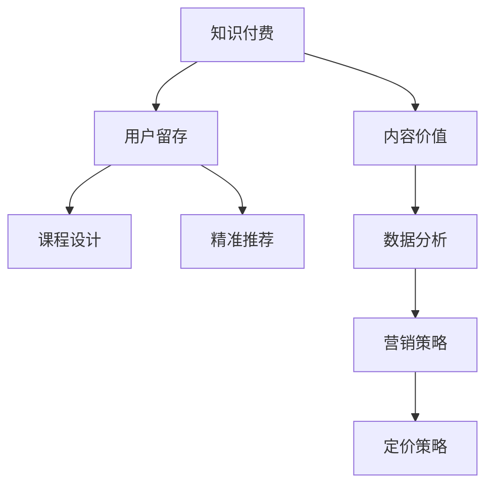

                 

# 知识付费创业中的内容价值最大化策略

> 关键词：知识付费,内容价值,用户留存,课程设计,精准推荐,数据分析,营销策略

## 1. 背景介绍

### 1.1 问题由来
在互联网的冲击下，传统教育模式正面临巨大的挑战。无论是通过线下面授，还是在线视频课程，传统教育模式均无法满足日益个性化、碎片化的学习需求。知识付费平台应运而生，将知识传播与在线支付相结合，为学习者提供了更为便捷、灵活的获取知识的方式。

然而，伴随着知识付费行业的快速发展，内容同质化、质量参差不齐等问题日益突出。如何在知识付费创业中，有效挖掘并最大化内容价值，提升用户满意度，增强用户留存，成为摆在创业者面前的一大难题。

### 1.2 问题核心关键点
对于知识付费创业者而言，最大化内容价值的核心在于：
- 精准识别用户需求，设计高价值课程内容。
- 采用科学合理的方法，构建高质量的内容生态。
- 引入先进的数据分析工具，提升内容匹配和推荐的精准度。
- 实施有效营销策略，提升用户粘性和市场占有率。
- 合理定价策略，兼顾用户和企业的双赢。

## 2. 核心概念与联系

### 2.1 核心概念概述

为更好地理解知识付费创业中内容价值最大化的策略，本节将介绍几个关键概念及其相互之间的联系：

- **知识付费(Knowledge-based Subscription Model)**：通过在线付费形式，提供高质量课程、文章、视频等内容，以获取用户订阅费用。

- **内容价值(Content Value)**：指课程内容对用户的学习价值，包括知识深度、结构性、实用性和时效性等维度。

- **用户留存(User Retention)**：指用户在订阅某平台后，持续使用并产生消费的概率。

- **课程设计(Course Design)**：基于用户需求，设计内容丰富的课程，确保内容能够满足用户的知识需求。

- **精准推荐(Precise Recommendation)**：通过数据分析，对用户进行个性化推荐，提升内容的覆盖面和用户体验。

- **数据分析(Data Analytics)**：对用户行为、课程效果等数据进行科学分析，发现用户需求，优化课程设计。

- **营销策略(Marketing Strategy)**：结合内容价值和数据分析结果，制定有效推广策略，提升用户粘性和品牌知名度。

- **定价策略(Pricing Strategy)**：根据课程内容价值、市场竞争情况等，合理制定定价策略，保障企业收益。

这些概念之间的逻辑关系可以通过以下Mermaid流程图来展示：



这个流程图展示了大语言模型的核心概念及其之间的关系：

1. 知识付费平台提供高质量课程。
2. 课程内容必须具有高价值，才能吸引用户订阅。
3. 通过数据分析，对课程进行优化设计，提高用户留存率。
4. 采用精准推荐系统，提升用户体验。
5. 结合数据分析结果，制定有效的营销策略。
6. 合理定价，实现企业与用户的双赢。

## 3. 核心算法原理 & 具体操作步骤
### 3.1 算法原理概述

知识付费创业中，内容价值最大化的过程，本质上是一个基于数据分析的内容推荐系统优化过程。其核心思想是：通过对用户行为、偏好等数据的收集和分析，设计出个性化的内容推荐策略，确保用户能够接收到最有价值的内容，从而提高用户满意度和留存率。

形式化地，假设知识付费平台的课程内容集合为 $C=\{c_i\}_{i=1}^N$，其中 $c_i$ 为课程内容。用户 $u$ 在某一时间点上的需求 $d_u$ 为随机变量，服从一定分布 $P(d_u)$。内容价值最大化即求取最大化下式：

$$
\max_{P(d_u)} \sum_{u \in U} \mathbb{E}[d_u] \cdot \mathbb{P}(u \text{订阅} \mid c_i)
$$

其中 $U$ 为用户集合，$\mathbb{E}[d_u]$ 为用户对课程内容的需求期望，$\mathbb{P}(u \text{订阅} \mid c_i)$ 为用户订阅课程的概率。

通过最大化预期收益，知识付费平台可以确保用户能够获得最大价值的内容，从而提升用户的满意度和留存率。

### 3.2 算法步骤详解

知识付费创业中，内容价值最大化的具体步骤一般包括以下几个关键环节：

**Step 1: 数据收集与分析**
- 收集用户行为数据，如课程浏览记录、观看时长、评分反馈等。
- 分析用户行为数据，识别出用户的兴趣点和偏好。
- 对课程内容进行元数据标注，如难度、时长、受众、分类等。

**Step 2: 构建推荐模型**
- 根据收集到的用户行为数据和课程元数据，构建个性化推荐模型。
- 常见的推荐算法包括协同过滤、基于内容的推荐、深度学习推荐等。

**Step 3: 优化推荐策略**
- 使用A/B测试等方法，对推荐策略进行效果评估和优化。
- 引入个性化标签，如兴趣、能力、职业等，提升推荐效果。
- 定期更新推荐模型，避免模型过拟合。

**Step 4: 营销推广**
- 结合推荐结果，制定针对性的营销策略。
- 利用社交媒体、搜索引擎等渠道，提升课程曝光率。
- 利用用户反馈，优化课程内容和营销策略。

**Step 5: 用户反馈与调整**
- 收集用户反馈，分析课程满意度、完成率等关键指标。
- 根据反馈结果，调整课程内容和推荐策略。
- 实施动态定价策略，平衡用户和企业的利益。

### 3.3 算法优缺点

基于数据分析的知识付费内容推荐，具有以下优点：
1. 高效提升用户满意度。通过个性化推荐，用户能够快速找到适合自己的课程，提升学习效果和满意度。
2. 显著提高用户留存率。精准推荐能够满足用户需求，减少用户流失。
3. 提升市场竞争力。精准推荐使得平台能够快速覆盖更多用户，提升市场占有率。
4. 优化课程内容。数据分析能够帮助平台快速发现用户需求，优化课程设计和更新。

同时，该方法也存在一定的局限性：
1. 数据隐私问题。收集用户行为数据时，需要严格保护用户隐私，避免数据泄露。
2. 推荐模型复杂。构建复杂的推荐模型需要大量的计算资源和时间，初期成本较高。
3. 推荐精度不足。在用户数据量有限的情况下，推荐效果可能无法达到预期。
4. 动态变化。用户需求和市场环境不断变化，推荐模型需要持续更新，维护成本较高。

尽管存在这些局限性，但基于数据分析的推荐算法仍然是知识付费创业中，内容价值最大化的一个重要手段。未来相关研究的重点在于如何进一步提升推荐精度，降低数据收集和维护成本，确保用户隐私保护，同时兼顾推荐效果和成本效益。

### 3.4 算法应用领域

基于数据分析的知识付费内容推荐，已经在诸多领域得到了广泛的应用，例如：

- 在线教育平台：如Coursera、Udemy等，通过推荐系统为用户推荐感兴趣的课程。
- 专业培训平台：如LinkedIn Learning、Beta Learning等，提升企业员工技能。
- 兴趣学习平台：如Khan Academy、Coursera Kids等，推荐适合儿童的课程内容。
- 语言学习平台：如Duolingo、Rosetta Stone等，提升用户语言能力。
- 职业培训平台：如Skillshare、Treehouse等，提供职业发展所需技能。

除了上述这些经典平台外，内容推荐技术还广泛应用于各类垂直领域，如健康、艺术、娱乐、科技等，为知识付费创业带来了全新的可能性。

## 4. 数学模型和公式 & 详细讲解
### 4.1 数学模型构建

在知识付费创业中，通过推荐系统对用户进行个性化推荐的过程，可以抽象为一个矩阵分解问题。假设用户集合为 $U$，课程集合为 $C$，用户对课程的评分矩阵为 $R \in \mathbb{R}^{N \times M}$，其中 $N$ 为用户数量，$M$ 为课程数量。推荐系统目标是在已知用户行为数据 $R$ 和课程元数据 $D$ 的情况下，求解用户 $u$ 对课程 $c_i$ 的评分 $\hat{r}_{ui}$。

具体而言，推荐系统通过以下公式计算用户对课程的评分预测值：

$$
\hat{r}_{ui} = \text{dot}(U_u, C_i)
$$

其中 $\text{dot}(U_u, C_i)$ 表示向量 $U_u$ 和 $C_i$ 的点积，$U_u$ 和 $C_i$ 分别表示用户 $u$ 和课程 $c_i$ 的特征向量。特征向量通过用户行为数据和课程元数据进行训练。

### 4.2 公式推导过程

基于矩阵分解的推荐系统，可以使用以下公式对特征向量 $U$ 和 $C$ 进行求解：

$$
U = U_0 \cdot H^T \\
C = C_0 \cdot G^T
$$

其中 $U_0$ 和 $C_0$ 分别为 $U$ 和 $C$ 的初始值，$H$ 和 $G$ 分别为 $U$ 和 $C$ 的因子矩阵。代入上述评分预测公式，得：

$$
\hat{r}_{ui} = \text{dot}(U_0 \cdot H^T, C_0 \cdot G^T)
$$

通过最小化预测值与真实值之间的差异，优化因子矩阵 $H$ 和 $G$ 的参数，从而得到更好的推荐结果。常用的优化算法包括梯度下降、交替最小二乘法等。

### 4.3 案例分析与讲解

假设某知识付费平台收集到大量用户观看课程的记录数据，以及课程的分类、时长、难度等元数据。根据这些数据，构建用户-课程评分矩阵 $R$，并使用矩阵分解方法计算推荐结果。

具体步骤如下：
1. 收集用户观看数据和课程元数据，构建用户-课程评分矩阵 $R$。
2. 初始化因子矩阵 $H$ 和 $G$。
3. 利用梯度下降算法，最小化预测评分与真实评分之间的误差，更新因子矩阵。
4. 通过计算预测评分矩阵 $\hat{R}$，输出推荐结果。

**实际案例**：
某在线教育平台通过收集用户观看数据，构建用户-课程评分矩阵 $R$。根据矩阵分解方法，得到用户和课程的因子矩阵 $H$ 和 $G$，然后通过计算预测评分矩阵 $\hat{R}$，为用户推荐感兴趣的课程。实际应用中，还需要结合用户反馈，不断优化推荐算法，提升推荐效果。

## 5. 项目实践：代码实例和详细解释说明
### 5.1 开发环境搭建

在进行推荐系统开发前，我们需要准备好开发环境。以下是使用Python进行Spark开发的环境配置流程：

1. 安装Spark：从官网下载并安装Spark，同时确保Hadoop环境已经安装并配置好。
2. 安装PySpark：确保Spark安装成功，并检查PySpark是否能够正确运行。
3. 安装相关依赖包：使用pip安装Spark需要的依赖包，如NumPy、Pandas、Scikit-learn等。

完成上述步骤后，即可在Spark环境中开始推荐系统开发。

### 5.2 源代码详细实现

下面以Spark MLlib库为例，给出构建基于矩阵分解的推荐系统的Python代码实现。

首先，加载数据并进行预处理：

```python
from pyspark import SparkContext, SparkConf
from pyspark.mllib.recommendation import ALS, Rating

# 初始化Spark环境
conf = SparkConf().setAppName("Recommendation System")
sc = SparkContext(conf=conf)

# 加载评分数据和课程元数据
ratings_data = sc.textFile("ratings.csv")
items_data = sc.textFile("items.csv")

# 解析评分数据
ratings_rdd = ratings_data.map(lambda line: Rating(line.split(",")[0], line.split(",")[1], float(line.split(",")[2])).cache()

# 解析课程元数据
items_rdd = items_data.map(lambda line: (int(line.split(",")[0]), int(line.split(",")[1]), float(line.split(",")[2]), line.split(",")[3])).cache()

# 将评分数据转换为评分矩阵
R = ratings_rdd.map(lambda r: (r.user, r.item, r.rating)).toDF()

# 将课程元数据转换为课程特征向量
C = items_rdd.map(lambda x: (x[0], [float(x[2]), float(x[3])])).toDF()

# 训练推荐模型
als = ALS(items_rdd=items_rdd, userCol="user", itemCol="item", ratingCol="rating", numFactors=10, iterations=10, userColType="double", itemColType="double")
alsModel = als.fit(R)

# 输出推荐结果
def predict(user_id):
    predictions = alsModel.predictAll(user_id).map(lambda r: (r.user, r.item, r.rating))
    return predictions.collect()
```

然后，通过调用推荐函数，实现个性化推荐：

```python
def recommend(user_id):
    predictions = predict(user_id)
    top_items = sorted(predictions, key=lambda x: x[2], reverse=True)[:5]
    return top_items

# 推荐系统实例
user_id = 123
top_items = recommend(user_id)
print("推荐结果：", [(item[0], item[1], item[2]) for item in top_items])
```

以上就是使用Spark实现基于矩阵分解的推荐系统的完整代码实现。可以看到，借助Spark等大数据工具，推荐系统能够高效地处理大规模数据，快速得到推荐结果。

### 5.3 代码解读与分析

让我们再详细解读一下关键代码的实现细节：

**数据加载与预处理**：
- 使用`textFile`方法加载评分数据和课程元数据，通过`split`方法解析数据，得到用户ID、课程ID和评分。
- 将课程元数据解析为课程ID、特征向量等形式，用于构建特征矩阵 $C$。
- 将评分数据转换为评分矩阵 $R$，其中用户ID、课程ID和评分分别对应行、列和值。

**模型训练**：
- 使用`ALS`类构建基于矩阵分解的推荐模型。
- 设置模型参数，如因子数、迭代次数等，进行模型训练。
- 使用`predictAll`方法计算用户对课程的评分预测，并排序得到推荐结果。

**推荐函数**：
- 根据用户ID调用推荐函数，输出推荐结果。
- 通过计算评分预测值和真实评分值，选择前五个评分最高的课程作为推荐结果。

**实际应用**：
- 调用推荐函数，针对特定用户ID进行推荐。
- 输出推荐结果，并打印显示。

通过以上步骤，知识付费创业者可以使用Spark构建高效的推荐系统，提升用户满意度和留存率。

## 6. 实际应用场景
### 6.1 在线教育平台

在线教育平台通过推荐系统，为学生推荐感兴趣的课程，提升学习效率。具体应用场景如下：

- 学生通过浏览平台上的课程介绍，标记感兴趣的课程，并给出评分。
- 平台收集学生的评分数据，构建评分矩阵 $R$。
- 根据学生的课程浏览记录，生成课程特征向量 $C$。
- 利用Spark构建推荐模型，计算学生对课程的评分预测值。
- 根据预测值对课程进行排序，生成个性化推荐列表。

**实际案例**：
某在线教育平台通过收集学生浏览数据和课程评分，构建评分矩阵 $R$ 和课程特征矩阵 $C$。使用Spark构建推荐模型，计算学生对课程的评分预测值，生成个性化推荐列表。实际应用中，平台还可以结合学生学习进度、互动行为等数据，进一步优化推荐策略。

### 6.2 专业培训平台

专业培训平台通过推荐系统，帮助企业员工提升技能。具体应用场景如下：

- 员工登录平台，浏览培训课程，标记感兴趣的课程，并给出评分。
- 平台收集员工的评分数据，构建评分矩阵 $R$。
- 根据员工的培训记录，生成课程特征向量 $C$。
- 利用Spark构建推荐模型，计算员工对课程的评分预测值。
- 根据预测值对课程进行排序，生成个性化推荐列表。

**实际案例**：
某专业培训平台通过收集员工培训数据，构建评分矩阵 $R$ 和课程特征矩阵 $C$。使用Spark构建推荐模型，计算员工对课程的评分预测值，生成个性化推荐列表。实际应用中，平台还可以结合员工的学习进度、互动行为等数据，进一步优化推荐策略。

### 6.3 兴趣学习平台

兴趣学习平台通过推荐系统，为儿童推荐适合的课程内容，提升学习兴趣。具体应用场景如下：

- 家长为孩子选择课程，并给出评分。
- 平台收集家长的评分数据，构建评分矩阵 $R$。
- 根据课程的分类、时长、难度等元数据，生成课程特征向量 $C$。
- 利用Spark构建推荐模型，计算家长对课程的评分预测值。
- 根据预测值对课程进行排序，生成个性化推荐列表。

**实际案例**：
某兴趣学习平台通过收集家长对课程的评分数据，构建评分矩阵 $R$ 和课程特征矩阵 $C$。使用Spark构建推荐模型，计算家长对课程的评分预测值，生成个性化推荐列表。实际应用中，平台还可以结合儿童的学习进度、互动行为等数据，进一步优化推荐策略。

### 6.4 未来应用展望

随着推荐技术的不断发展，未来基于知识付费的推荐系统将在更多领域得到应用，为各行业带来变革性影响。

在医疗领域，推荐系统能够根据患者的疾病数据，推荐适合的治疗方案和康复计划，提升诊疗效果和患者体验。

在金融领域，推荐系统能够根据客户的投资偏好和行为数据，推荐合适的理财产品和理财策略，提升客户满意度。

在智能家居领域，推荐系统能够根据用户的生活习惯和行为数据，推荐适合的智能设备和服务，提升用户的生活质量。

此外，在教育、健康、娱乐、旅游等众多领域，基于知识付费的推荐系统也将不断涌现，为各行各业提供智能化的解决方案。相信随着推荐技术的不断成熟，知识付费行业必将在更广阔的应用领域大放异彩。

## 7. 工具和资源推荐
### 7.1 学习资源推荐

为了帮助知识付费创业者系统掌握推荐系统理论基础和实践技巧，这里推荐一些优质的学习资源：

1. **《推荐系统实战》**：介绍推荐系统的基本原理、算法和实现，结合实际案例，讲解推荐系统如何构建和优化。

2. **KDD Cup**：Kaggle主办的数据挖掘竞赛，推荐系统是其中的重要研究方向，通过参加竞赛，可以积累实践经验。

3. **Coursera 《Machine Learning for Data Science》课程**：由Google Cloud提供的推荐系统课程，讲解推荐系统的理论和实践，适合初学者入门。

4. **Spark MLlib官方文档**：Spark提供的推荐系统模块文档，包含详细的API接口和示例代码，是Spark推荐系统开发的必备资料。

5. **《推荐系统》书籍**：吴军等著，全面介绍推荐系统的理论基础和经典算法，适合深入学习。

通过对这些资源的学习实践，相信你一定能够快速掌握推荐系统的精髓，并用于解决实际的推荐问题。

### 7.2 开发工具推荐

高效的开发离不开优秀的工具支持。以下是几款用于推荐系统开发的常用工具：

1. **Spark**：基于Scala的大数据计算框架，支持分布式计算，适合处理大规模数据。
2. **TensorFlow**：由Google主导的深度学习框架，支持自动微分和优化算法，适合构建复杂的推荐模型。
3. **PyTorch**：由Facebook主导的深度学习框架，灵活易用，适合快速原型开发和研究。
4. **Keras**：高层次神经网络API，适合快速构建和训练推荐模型。
5. **NumPy、Pandas**：Python中的数值计算和数据分析库，适合数据处理和分析。

合理利用这些工具，可以显著提升推荐系统开发效率，加速创新迭代的步伐。

### 7.3 相关论文推荐

推荐系统的发展源于学界的持续研究。以下是几篇奠基性的相关论文，推荐阅读：

1. **“Collaborative Filtering for Implicit Feedback Datasets”**：由Wang等人提出，介绍基于矩阵分解的协同过滤算法，用于处理隐式反馈数据。
2. **“Scalable Collaborative Filtering for Implicit Feedback”**：由Chen等人提出，介绍高效协同过滤算法，解决数据稀疏性和实时性问题。
3. **“Knowledge-aware Collaborative Filtering for Recommendations”**：由Zhou等人提出，介绍结合领域知识的协同过滤方法，提升推荐效果。
4. **“Deep Factorization Machines with Adaptive Regularization”**：由Wang等人提出，介绍深度分解机算法，提升推荐模型的泛化能力。
5. **“Frequent Pattern Based Recommender System”**：由Konjeznić等人提出，介绍基于频繁模式的推荐方法，适合推荐个性化物品。

这些论文代表了大推荐系统的发展脉络。通过学习这些前沿成果，可以帮助研究者把握学科前进方向，激发更多的创新灵感。

## 8. 总结：未来发展趋势与挑战

### 8.1 总结

本文对知识付费创业中内容价值最大化策略进行了全面系统的介绍。首先阐述了推荐系统在知识付费创业中的重要性，明确了最大化内容价值的几个关键环节。其次，从原理到实践，详细讲解了推荐系统的数学模型和具体实现方法，给出了推荐系统开发的具体代码实例。同时，本文还广泛探讨了推荐系统在各行业领域的应用前景，展示了推荐技术的巨大潜力。

通过本文的系统梳理，可以看到，基于数据分析的推荐系统正在成为知识付费创业中，内容价值最大化的一个重要手段。这些方向的探索发展，必将进一步提升知识付费系统的性能和应用范围，为知识付费创业者带来巨大的价值。

### 8.2 未来发展趋势

展望未来，知识付费平台的内容推荐技术将呈现以下几个发展趋势：

1. **动态推荐**：随着数据量的不断增加，推荐系统能够更加动态地适应用户需求的变化，提供更加个性化和实时的推荐。
2. **跨平台推荐**：推荐系统可以跨越多个平台和设备，为用户在不同场景下提供一致的推荐体验。
3. **多模态推荐**：推荐系统能够结合文本、图像、视频等多种模态数据，提升推荐结果的全面性和准确性。
4. **深度学习推荐**：深度学习算法能够处理更复杂的数据结构，提升推荐模型的精度和泛化能力。
5. **混合推荐**：结合协同过滤、基于内容的推荐等多种推荐方法，提升推荐效果。
6. **联邦推荐**：通过联邦学习等技术，保护用户隐私的同时，提升推荐效果。

以上趋势凸显了知识付费推荐系统的广阔前景。这些方向的探索发展，必将进一步提升知识付费系统的性能和应用范围，为知识付费创业者带来巨大的价值。

### 8.3 面临的挑战

尽管知识付费推荐系统已经取得了瞩目成就，但在迈向更加智能化、普适化应用的过程中，它仍面临着诸多挑战：

1. **数据隐私问题**：推荐系统需要收集用户行为数据，如何保护用户隐私，避免数据泄露，是亟待解决的问题。
2. **推荐精度不足**：在数据量有限的情况下，推荐效果可能无法达到预期。
3. **推荐模型复杂**：构建复杂的推荐模型需要大量的计算资源和时间，初期成本较高。
4. **动态变化**：用户需求和市场环境不断变化，推荐模型需要持续更新，维护成本较高。
5. **公平性和公正性**：推荐系统可能存在算法偏见，导致某些群体无法得到公平的推荐。

正视推荐系统面临的这些挑战，积极应对并寻求突破，将是大数据平台推荐系统走向成熟的必由之路。相信随着学界和产业界的共同努力，这些挑战终将一一被克服，知识付费平台必将在构建人机协同的智能时代中扮演越来越重要的角色。

### 8.4 研究展望

面对知识付费推荐系统所面临的种种挑战，未来的研究需要在以下几个方面寻求新的突破：

1. **强化用户隐私保护**：采用差分隐私等技术，保护用户隐私，降低数据泄露风险。
2. **提升推荐精度**：利用推荐系统协同训练、多模态融合等方法，提升推荐效果。
3. **优化推荐模型**：简化推荐模型，提高实时推荐效率，降低初始成本。
4. **引入多领域知识**：结合领域知识，提升推荐系统的泛化能力和推荐效果。
5. **公平性和公正性**：引入公平性指标，避免推荐系统偏见，提升推荐系统公正性。

这些研究方向的探索，必将引领知识付费推荐系统技术迈向更高的台阶，为构建安全、可靠、可解释、可控的智能系统铺平道路。面向未来，知识付费推荐系统还需要与其他人工智能技术进行更深入的融合，如知识表示、因果推理、强化学习等，多路径协同发力，共同推动知识付费平台的进步。只有勇于创新、敢于突破，才能不断拓展推荐系统的边界，让知识付费平台更好地服务于用户和社会。

## 9. 附录：常见问题与解答

**Q1：知识付费推荐系统中如何保护用户隐私？**

A: 推荐系统在收集用户行为数据时，需要采取严格的隐私保护措施，如差分隐私、匿名化处理等。具体措施包括：
- 采用差分隐私技术，对数据进行噪声扰动，保护用户隐私。
- 采用匿名化处理，隐藏用户ID等敏感信息，保护用户隐私。
- 采用联邦学习等技术，在保护用户隐私的同时，提升推荐效果。

**Q2：推荐系统中如何避免推荐模型过拟合？**

A: 推荐系统中的过拟合问题可以通过以下方法解决：
- 采用正则化技术，如L2正则、Dropout等，防止模型过度适应训练数据。
- 采用交叉验证等方法，评估模型在验证集上的泛化能力。
- 定期更新模型，避免模型过时，影响推荐效果。

**Q3：推荐系统如何评估推荐效果？**

A: 推荐系统中的评估指标包括准确率、召回率、F1分数等。具体而言：
- 准确率（Precision）：推荐结果中，正确结果的数量与总推荐数量的比值。
- 召回率（Recall）：正确结果中，被推荐出的数量与正确结果总数量的比值。
- F1分数（F1 Score）：综合考虑准确率和召回率的评估指标，用于全面评估推荐效果。

**Q4：推荐系统中的冷启动问题如何解决？**

A: 冷启动问题是推荐系统面临的重要挑战，即新用户或新物品进入推荐系统时，缺乏历史行为数据，难以推荐。具体解决方法包括：
- 利用用户基本信息，如年龄、性别、职业等，进行基于内容的推荐。
- 利用物品元数据，如标题、描述、标签等，进行基于内容的推荐。
- 利用社交网络、K-means聚类等方法，对用户进行群体分类，提高推荐效果。

**Q5：推荐系统如何处理数据稀疏性问题？**

A: 数据稀疏性是推荐系统面临的常见问题，即用户或物品的评分数据较少。具体解决方法包括：
- 采用矩阵分解算法，如ALS、SVD等，对用户行为数据进行低秩分解，降低数据稀疏性。
- 采用协同过滤算法，如基于用户的协同过滤、基于物品的协同过滤等，弥补数据稀疏性问题。

通过以上步骤，知识付费创业者可以使用推荐系统，最大化内容价值，提升用户满意度和留存率。

