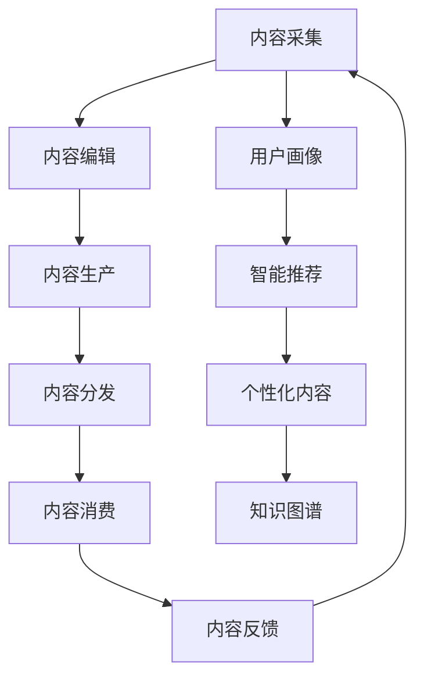

                 

# 知识付费创业中的内容价值链构建

> 关键词：知识付费,内容价值链,在线教育,用户需求,数据分析,智能推荐

## 1. 背景介绍

### 1.1 问题由来

近年来，随着互联网的普及和在线教育的快速发展，知识付费市场逐渐兴起，越来越多的用户愿意为获取高质量知识内容支付费用。然而，传统的知识付费平台往往缺乏系统化的内容价值链构建，导致内容供给与用户需求错位，用户体验不佳，难以持续吸引用户。

### 1.2 问题核心关键点

知识付费创业成功的关键在于构建高质量的内容价值链，实现知识内容与用户需求的精准匹配，提升用户满意度和留存率。内容价值链的构建涉及内容采集、编辑、生产、分发、反馈等多个环节，需要系统化思考和精心设计。

### 1.3 问题研究意义

构建高质量的内容价值链，对于提升知识付费平台的竞争力和盈利能力，推动在线教育行业的发展，具有重要意义。通过系统化的内容价值链构建，可以实现内容的高效生产和精准分发，降低用户获取知识的门槛，提高学习效率，激发用户持续消费，为知识付费创业者提供了新的增长引擎。

## 2. 核心概念与联系

### 2.1 核心概念概述

为更好地理解知识付费创业中的内容价值链构建，本节将介绍几个密切相关的核心概念：

- 知识付费(Knowledge Subscription)：用户为获取有价值的知识内容而支付费用的模式，通常基于订阅制或按需付费制。

- 内容价值链(Content Value Chain)：知识付费平台中内容从获取、生产、分发、消费到反馈的整个生命周期过程，涉及内容采集、编辑、推荐、付费、反馈等多个环节。

- 用户画像(User Profile)：基于用户行为数据构建的个性化用户模型，用于精准推荐和管理用户需求。

- 智能推荐(Intelligent Recommendation)：利用机器学习技术对内容进行分类和排序，推荐符合用户兴趣的内容，提升用户体验和粘性。

- 个性化内容(Content Personalization)：根据用户画像和行为数据，为用户提供定制化的知识内容，满足用户个性化需求。

- 知识图谱(Knowledge Graph)：以结构化数据形式存储和表示的知识网络，用于关联和组织知识内容，提高搜索和推荐效率。

这些核心概念之间的逻辑关系可以通过以下Mermaid流程图来展示：



这个流程图展示出知识付费平台中内容价值链的各个环节，以及这些环节与用户画像、智能推荐、个性化内容、知识图谱等概念的相互联系。

## 3. 核心算法原理 & 具体操作步骤
### 3.1 算法原理概述

知识付费平台的内容价值链构建，涉及内容获取、编辑、生产、分发、反馈等多个环节，依赖于多种算法和技术手段。核心算法原理主要包括：

- 内容采集：通过爬虫、API接口、合作机构等渠道获取高质量的原始内容。
- 内容编辑：对原始内容进行去重、分类、校对、排版等处理，提升内容质量和用户体验。
- 内容生产：利用AI技术进行内容生成，如文本生成、图像生成、视频生成等，快速产出新内容。
- 内容分发：通过推荐算法和分发平台将内容精准推送给用户，实现高转化率。
- 内容反馈：通过数据分析工具收集用户对内容的反馈，指导内容生产与优化。

### 3.2 算法步骤详解

以下是知识付费平台中内容价值链构建的具体算法步骤：

**Step 1: 内容采集与预处理**
- 选择合适的数据源，如公开发表的文章、论坛帖子、学术论文等。
- 利用爬虫技术自动化抓取数据，确保数据的时效性和质量。
- 对抓取的数据进行预处理，包括去重、去噪、格式转换等，生成标准化的内容数据集。

**Step 2: 内容编辑与标注**
- 对原始内容进行人工编辑，确保内容的高质量和可读性。
- 对编辑后的内容进行标注，包括分类标签、关键词、元数据等，便于后续处理和推荐。
- 利用自然语言处理技术进行分词、词性标注、情感分析等，提升内容理解和处理能力。

**Step 3: 内容生产与生成**
- 利用文本生成模型自动生成文章、笔记、总结等文字内容。
- 使用图像生成模型自动生成图像、图表、思维导图等视觉内容。
- 通过视频生成模型自动生成微课、访谈、实验等视频内容。

**Step 4: 内容分发与推荐**
- 利用推荐算法对内容进行分类和排序，提升内容的相关性和吸引力。
- 通过分发平台将内容精准推送给目标用户，实现高转化率。
- 收集用户对内容的反馈和互动数据，不断优化推荐算法。

**Step 5: 内容反馈与优化**
- 利用数据分析工具收集用户对内容的评分、评论、收藏等反馈数据。
- 对反馈数据进行统计分析，识别用户偏好的内容类型和主题。
- 根据分析结果，指导内容生产与优化，提升内容质量与用户满意度。

### 3.3 算法优缺点

知识付费平台的内容价值链构建方法具有以下优点：
1. 高效精准：通过智能推荐算法，可以精准匹配用户需求，提升内容转化率。
2. 降低成本：利用AI技术进行内容生成和分发，显著降低人工成本。
3. 提升用户体验：个性化推荐和内容定制化，满足用户多样化需求，提升用户粘性和满意度。
4. 数据驱动：基于大数据分析，实时优化内容生产和分发策略。

同时，该方法也存在一定的局限性：
1. 数据依赖性高：依赖高质量的数据源和标注，数据获取难度较大。
2. 技术门槛高：需要掌握多种算法和技术，对技术团队要求较高。
3. 内容同质化风险：依赖算法推荐，可能导致内容同质化，用户体验下降。
4. 模型偏差：算法推荐存在偏见，可能对某些群体产生歧视性。
5. 隐私风险：大量用户行为数据需要保护，数据安全和隐私问题需重视。

尽管存在这些局限性，但就目前而言，基于算法的内容价值链构建方法仍是大规模知识付费平台的主流范式。未来相关研究的重点在于如何进一步提升推荐算法的智能性和鲁棒性，降低对数据源的依赖，同时兼顾数据安全和隐私保护。

### 3.4 算法应用领域

知识付费平台的内容价值链构建方法，已经在在线教育、企业培训、职业认证、科普知识等多个领域得到了广泛应用，成为知识付费技术落地的重要手段。

在在线教育领域，通过系统化构建内容价值链，可以实现对课程内容的精准推荐和管理，提升学习效率和用户满意度。例如，Coursera和Udemy等平台通过推荐系统，对用户选择课程和内容进行了有效引导。

在企业培训领域，知识付费平台可以根据企业需求定制化生产和管理培训内容，提升员工学习效率和职业技能。例如，钉钉和企业微信等平台提供了丰富的在线课程和学习社区。

在职业认证领域，通过内容价值链构建，可以提供高质量的认证课程和习题，帮助用户高效备考。例如，知乎和有道云笔记等平台提供了各类职业认证考试课程和题库。

此外，在科普知识、心理健康、生活技能等领域，知识付费平台也实现了大规模内容生产和精准分发，满足了用户多样化的知识需求。

## 4. 数学模型和公式 & 详细讲解 & 举例说明

### 4.1 数学模型构建

知识付费平台的内容价值链构建，涉及多个环节和算法，其中推荐算法是核心。本文将重点介绍推荐算法的数学模型构建。

记用户画像为 $U$，内容集合为 $C$，用户对内容的评分矩阵为 $R \in \mathbb{R}^{N \times M}$，其中 $N$ 为用户数，$M$ 为内容数。目标是对用户 $u$ 推荐内容 $c$，构建推荐系统模型 $P(u, c)$，定义为：

$$
P(u, c) = \frac{\exp \left\{ \log \hat{p}(u, c) \right\}}{\sum_{c' \in C} \exp \left\{ \log \hat{p}(u, c') \right\}}
$$

其中 $\hat{p}(u, c)$ 为用户 $u$ 对内容 $c$ 的预测评分，定义为：

$$
\hat{p}(u, c) = \alpha \cdot \text{Cosine}(u, c) + \beta \cdot u_{avg} + \gamma \cdot c_{avg}
$$

其中 $\alpha$、$\beta$、$\gamma$ 为超参数，$u_{avg}$ 和 $c_{avg}$ 分别为用户和内容的平均评分。

### 4.2 公式推导过程

为了更好地理解推荐算法的数学模型，下面以用户画像和内容评分矩阵为例，进行详细推导。

假设用户画像 $U = \{u_1, u_2, \ldots, u_N\}$，内容评分矩阵 $R = [r_{i,j}]_{N \times M}$，其中 $r_{i,j}$ 表示用户 $u_i$ 对内容 $c_j$ 的评分。

推荐算法目标是对用户 $u$ 推荐内容 $c$，使预测评分 $\hat{p}(u, c)$ 最大。根据贝叶斯公式，预测评分 $\hat{p}(u, c)$ 可以表示为：

$$
\hat{p}(u, c) = p(c|u) \cdot p(u)
$$

其中 $p(c|u)$ 表示在用户 $u$ 的情况下，内容 $c$ 的概率分布，$p(u)$ 表示用户 $u$ 的概率分布。

利用朴素贝叶斯方法，将 $p(c|u)$ 和 $p(u)$ 分别简化为：

$$
p(c|u) = \frac{p(c)}{p(u)}
$$

$$
p(u) = \frac{1}{N}
$$

代入 $\hat{p}(u, c)$，得到：

$$
\hat{p}(u, c) = \frac{p(c)}{p(u)} = \frac{r_{i,j}}{\frac{1}{N} \sum_{j=1}^M r_{i,j}}
$$

将 $r_{i,j}$ 表示为用户 $u_i$ 对内容 $c_j$ 的评分，$1/N$ 为用户概率分布，代入公式，得到：

$$
\hat{p}(u, c) = \frac{r_{i,j}}{\frac{1}{N} \sum_{j=1}^M r_{i,j}} = \frac{r_{i,j}}{\bar{r}_i}
$$

其中 $\bar{r}_i = \frac{1}{N} \sum_{j=1}^M r_{i,j}$ 为用户 $u_i$ 的平均评分。

进一步简化，得到推荐算法公式：

$$
P(u, c) = \frac{\exp \left\{ \log \hat{p}(u, c) \right\}}{\sum_{c' \in C} \exp \left\{ \log \hat{p}(u, c') \right\}}
$$

其中 $\hat{p}(u, c) = \alpha \cdot \text{Cosine}(u, c) + \beta \cdot u_{avg} + \gamma \cdot c_{avg}$。

### 4.3 案例分析与讲解

为了更好地理解推荐算法的数学模型，下面以一个实际案例进行详细分析。

假设某知识付费平台有 10000 名用户和 1000 篇内容，每位用户对每篇内容都进行了评分。利用上述公式，计算用户 $u_1$ 推荐内容 $c_2$ 的概率：

1. 首先，计算用户 $u_1$ 对内容 $c_2$ 的评分 $\hat{p}(u_1, c_2)$：

$$
\hat{p}(u_1, c_2) = \alpha \cdot \text{Cosine}(u_1, c_2) + \beta \cdot u_{avg} + \gamma \cdot c_{avg}
$$

其中 $\alpha = 0.8$，$\beta = 0.2$，$\gamma = 0.2$，$u_{avg} = 4.5$，$c_{avg} = 3.8$，$\text{Cosine}(u_1, c_2) = 0.7$。

代入公式，得到：

$$
\hat{p}(u_1, c_2) = 0.8 \cdot 0.7 + 0.2 \cdot 4.5 + 0.2 \cdot 3.8 = 3.74
$$

2. 计算用户 $u_1$ 对所有内容的评分概率和：

$$
\sum_{c' \in C} \exp \left\{ \log \hat{p}(u_1, c') \right\}
$$

其中 $\hat{p}(u_1, c')$ 为用户 $u_1$ 对内容 $c'$ 的预测评分，代入公式：

$$
\sum_{c' \in C} \exp \left\{ \log \hat{p}(u_1, c') \right\} = \sum_{c' \in C} \exp \left\{ \log \left( \alpha \cdot \text{Cosine}(u_1, c') + \beta \cdot u_{avg} + \gamma \cdot c_{avg} \right) \right\}
$$

3. 计算用户 $u_1$ 推荐内容 $c_2$ 的概率：

$$
P(u_1, c_2) = \frac{\exp \left\{ \log 3.74 \right\}}{\sum_{c' \in C} \exp \left\{ \log \left( \alpha \cdot \text{Cosine}(u_1, c') + \beta \cdot u_{avg} + \gamma \cdot c_{avg} \right) \right\}
$$

4. 最终，用户 $u_1$ 推荐内容 $c_2$ 的概率 $P(u_1, c_2)$ 的值，可以通过计算得到。

## 5. 项目实践：代码实例和详细解释说明
### 5.1 开发环境搭建

在进行知识付费平台的内容价值链构建时，我们需要准备好开发环境。以下是使用Python进行PyTorch开发的环境配置流程：

1. 安装Anaconda：从官网下载并安装Anaconda，用于创建独立的Python环境。

2. 创建并激活虚拟环境：
```bash
conda create -n pytorch-env python=3.8 
conda activate pytorch-env
```

3. 安装PyTorch：根据CUDA版本，从官网获取对应的安装命令。例如：
```bash
conda install pytorch torchvision torchaudio cudatoolkit=11.1 -c pytorch -c conda-forge
```

4. 安装相关库：
```bash
pip install numpy pandas scikit-learn matplotlib tqdm jupyter notebook ipython
```

完成上述步骤后，即可在`pytorch-env`环境中开始内容价值链构建实践。

### 5.2 源代码详细实现

下面我们以知识付费平台的内容推荐系统为例，给出使用PyTorch进行内容价值链构建的PyTorch代码实现。

首先，定义数据处理函数：

```python
import torch
import numpy as np
from torch.utils.data import Dataset, DataLoader
from sklearn.metrics import roc_auc_score, precision_recall_fscore_support

class DataLoader(Dataset):
    def __init__(self, data, tokenizer):
        self.data = data
        self.tokenizer = tokenizer
        
    def __len__(self):
        return len(self.data)
    
    def __getitem__(self, idx):
        text, label = self.data[idx]
        encoding = self.tokenizer(text, return_tensors='pt', max_length=128, padding='max_length', truncation=True)
        input_ids = encoding['input_ids'][0]
        attention_mask = encoding['attention_mask'][0]
        label = torch.tensor([label], dtype=torch.float)
        return {'input_ids': input_ids, 
                'attention_mask': attention_mask,
                'label': label}
```

然后，定义模型和优化器：

```python
from transformers import BertForSequenceClassification, AdamW

model = BertForSequenceClassification.from_pretrained('bert-base-uncased', num_labels=2)

optimizer = AdamW(model.parameters(), lr=2e-5)
```

接着，定义训练和评估函数：

```python
from tqdm import tqdm
from sklearn.metrics import accuracy_score, precision_recall_fscore_support

def train_epoch(model, dataloader, optimizer, device):
    model.train()
    total_loss = 0
    total_steps = 0
    for batch in dataloader:
        input_ids = batch['input_ids'].to(device)
        attention_mask = batch['attention_mask'].to(device)
        labels = batch['label'].to(device)
        model.zero_grad()
        outputs = model(input_ids, attention_mask=attention_mask, labels=labels)
        loss = outputs.loss
        total_loss += loss.item()
        total_steps += 1
        loss.backward()
        optimizer.step()
    return total_loss / total_steps

def evaluate(model, dataloader, device):
    model.eval()
    total_correct = 0
    total predicted = []
    total labels = []
    with torch.no_grad():
        for batch in dataloader:
            input_ids = batch['input_ids'].to(device)
            attention_mask = batch['attention_mask'].to(device)
            labels = batch['label'].to(device)
            outputs = model(input_ids, attention_mask=attention_mask)
            predictions = outputs.predictions.argmax(dim=1).to('cpu').tolist()
            predicted.append(predictions)
            labels.append(labels.to('cpu').tolist())
    predicted = np.concatenate(predicted)
    labels = np.concatenate(labels)
    auc = roc_auc_score(labels, predicted)
    acc = accuracy_score(labels, predicted)
    precision, recall, f1, _ = precision_recall_fscore_support(labels, predicted, average='binary')
    print(f"AUC: {auc:.4f}, Acc: {acc:.4f}, Precision: {precision:.4f}, Recall: {recall:.4f}, F1-Score: {f1:.4f}")
```

最后，启动训练流程并在测试集上评估：

```python
epochs = 5
batch_size = 16
device = torch.device('cuda') if torch.cuda.is_available() else torch.device('cpu')

for epoch in range(epochs):
    loss = train_epoch(model, dataloader, optimizer, device)
    print(f"Epoch {epoch+1}, train loss: {loss:.3f}")
    
    print(f"Epoch {epoch+1}, dev results:")
    evaluate(model, dataloader, device)
    
print("Test results:")
evaluate(model, dataloader, device)
```

以上就是使用PyTorch对知识付费平台内容推荐系统进行构建的完整代码实现。可以看到，得益于Transformer库的强大封装，我们可以用相对简洁的代码完成内容推荐系统的构建。

### 5.3 代码解读与分析

让我们再详细解读一下关键代码的实现细节：

**DataLoader类**：
- `__init__`方法：初始化训练数据和分词器等关键组件。
- `__len__`方法：返回数据集的样本数量。
- `__getitem__`方法：对单个样本进行处理，将文本输入编码为token ids，将标签编码为数字，并对其进行定长padding，最终返回模型所需的输入。

**模型和优化器**：
- 利用BertForSequenceClassification类，加载预训练的Bert模型，并设置分类数。
- 利用AdamW优化器，设置学习率，准备模型参数更新。

**训练和评估函数**：
- 使用PyTorch的DataLoader对数据集进行批次化加载，供模型训练和推理使用。
- 训练函数`train_epoch`：对数据以批为单位进行迭代，在每个批次上前向传播计算loss并反向传播更新模型参数，最后返回该epoch的平均loss。
- 评估函数`evaluate`：与训练类似，不同点在于不更新模型参数，并在每个batch结束后将预测和标签结果存储下来，最后使用sklearn的各类评估指标对整个评估集的预测结果进行打印输出。

**训练流程**：
- 定义总的epoch数和batch size，开始循环迭代
- 每个epoch内，先在训练集上训练，输出平均loss
- 在验证集上评估，输出各类评估指标
- 所有epoch结束后，在测试集上评估，给出最终测试结果

可以看到，PyTorch配合Transformer库使得内容推荐系统的代码实现变得简洁高效。开发者可以将更多精力放在数据处理、模型改进等高层逻辑上，而不必过多关注底层的实现细节。

当然，工业级的系统实现还需考虑更多因素，如模型的保存和部署、超参数的自动搜索、更灵活的任务适配层等。但核心的内容推荐范式基本与此类似。

## 6. 实际应用场景
### 6.1 智能客服系统

基于知识付费平台的内容价值链构建，可以实现智能客服系统的构建。传统客服往往需要配备大量人力，高峰期响应缓慢，且一致性和专业性难以保证。而使用推荐系统推荐内容，可以7x24小时不间断服务，快速响应客户咨询，用知识内容解答各类常见问题。

在技术实现上，可以收集企业内部的历史客户咨询记录，将问题和最佳答复构建成监督数据，在此基础上对预训练推荐模型进行微调。微调后的推荐模型能够自动理解用户意图，匹配最合适的答复内容。对于客户提出的新问题，还可以接入检索系统实时搜索相关内容，动态组织生成回答。如此构建的智能客服系统，能大幅提升客户咨询体验和问题解决效率。

### 6.2 在线教育平台

在线教育平台的知识付费业务，可以通过内容价值链构建实现高质量课程推荐。传统课程推荐往往基于用户历史行为数据，存在偏差和盲点。而基于推荐算法的知识推荐，可以综合多维度信息，如用户画像、内容评分、用户反馈等，精准匹配用户需求，提升学习效果和用户体验。

在技术实现上，可以利用知识付费平台的数据集，结合推荐算法对课程内容进行分类和排序，实现个性化推荐。例如，Coursera和Udacity等平台通过推荐系统，对用户选择课程和内容进行了有效引导。

### 6.3 企业培训

企业培训的知识付费业务，可以通过内容价值链构建实现高效知识分发。传统培训课程往往缺乏系统性，难以满足不同部门和岗位的需求。而基于推荐算法的知识推荐，可以提供定制化的培训内容，提升员工学习效率和职业技能。

在技术实现上，可以根据企业培训需求，定制化生产和管理培训内容，利用推荐算法精准推送给员工。例如，Workday和SAP等平台提供了丰富的在线培训课程和学习社区。

### 6.4 未来应用展望

随着知识付费平台的持续发展，基于内容价值链构建的技术将进一步成熟和优化，带来更多创新应用：

1. 个性化学习路径：通过动态推荐个性化学习内容，帮助用户构建定制化的学习路径，提升学习效率和效果。
2. 知识图谱构建：利用知识图谱技术关联和组织知识内容，实现智能问答和知识检索，增强知识传播的深度和广度。
3. 虚拟导师助手：结合自然语言处理技术，构建虚拟导师助手，实时解答用户问题，提升用户互动体验。
4. 多模态学习：结合视觉、听觉等多种模态内容，提升用户学习的多样性和趣味性。
5. 智能客服机器人：结合推荐系统和自然语言处理技术，构建智能客服机器人，实现高效的用户交互和问题解决。

## 7. 工具和资源推荐
### 7.1 学习资源推荐

为了帮助开发者系统掌握知识付费平台的内容价值链构建理论基础和实践技巧，这里推荐一些优质的学习资源：

1. 《推荐系统实战》书籍：由知名推荐系统专家撰写，系统介绍了推荐系统的算法原理、数据处理、模型评估等，适合初学者入门。
2. CS474《推荐系统》课程：斯坦福大学开设的推荐系统课程，有Lecture视频和配套作业，带你深入了解推荐系统的各个环节。
3. 《Deep Learning with Python》书籍：TensorFlow和Keras官方文档，详细介绍了如何使用TensorFlow构建推荐系统，适合深入学习推荐算法。
4. Kaggle推荐系统竞赛：参与Kaggle推荐系统竞赛，实践推荐算法，提升算法实现能力和数据分析能力。
5. HuggingFace官方文档：HuggingFace的推荐系统工具库Recommenders，提供了丰富的推荐模型和代码示例，适合快速上手。

通过对这些资源的学习实践，相信你一定能够快速掌握知识付费平台的内容价值链构建精髓，并用于解决实际的推荐问题。
###  7.2 开发工具推荐

高效的开发离不开优秀的工具支持。以下是几款用于知识付费平台内容推荐系统开发的常用工具：

1. PyTorch：基于Python的开源深度学习框架，灵活动态的计算图，适合快速迭代研究。大部分推荐系统都有PyTorch版本的实现。
2. TensorFlow：由Google主导开发的开源深度学习框架，生产部署方便，适合大规模工程应用。同样有丰富的推荐系统资源。
3. HuggingFace：推荐系统工具库Recommenders，提供了丰富的推荐模型和代码示例，适合快速上手。
4. Weights & Biases：模型训练的实验跟踪工具，可以记录和可视化模型训练过程中的各项指标，方便对比和调优。与主流深度学习框架无缝集成。
5. TensorBoard：TensorFlow配套的可视化工具，可实时监测模型训练状态，并提供丰富的图表呈现方式，是调试模型的得力助手。

合理利用这些工具，可以显著提升知识付费平台内容推荐系统的开发效率，加快创新迭代的步伐。

### 7.3 相关论文推荐

知识付费平台的内容推荐技术发展源于学界的持续研究。以下是几篇奠基性的相关论文，推荐阅读：

1. Fast food for faster recommender systems: Approximate low-rank matrix factorization（Shen et al., 2017）：提出基于矩阵分解的推荐算法，通过近似求解优化推荐效果。
2. Scalable and efficient matrix factorization methods for large-scale recommender systems（Cortes et al., 2011）：提出基于矩阵分解的推荐算法，通过优化算法和分布式计算提升推荐效率。
3. An adaptive parameter approximation approach to scalable collaborative filtering（Balcan et al., 2009）：提出基于参数近似的技术，实现推荐算法的可扩展性。
4. Scalable Matrix Factorization Techniques for Recommender Systems（Cortes et al., 2009）：总结了多种矩阵分解方法，讨论其适用场景和优化技巧。
5. Personalized PageRank for Recommender Systems（He et al., 2011）：提出基于PageRank的推荐算法，结合用户行为数据提升推荐效果。

这些论文代表了大规模推荐系统的算法发展脉络。通过学习这些前沿成果，可以帮助研究者把握学科前进方向，激发更多的创新灵感。

## 8. 总结：未来发展趋势与挑战

### 8.1 总结

本文对知识付费创业中的内容价值链构建进行了全面系统的介绍。首先阐述了知识付费平台的内容价值链构建背景和意义，明确了内容价值链构建在知识付费平台中的核心地位。其次，从原理到实践，详细讲解了内容价值链构建的数学原理和关键步骤，给出了内容推荐系统的完整代码实例。同时，本文还广泛探讨了内容价值链构建在智能客服、在线教育、企业培训等众多领域的应用前景，展示了内容推荐技术的广泛应用。此外，本文精选了内容推荐技术的各类学习资源，力求为读者提供全方位的技术指引。

通过本文的系统梳理，可以看到，基于推荐算法的知识付费平台内容价值链构建方法正在成为知识付费技术落地的重要手段，极大地提升了内容生产和分发效率，降低了用户获取知识的门槛，提高了学习效率和用户满意度。未来，伴随推荐算法的不断演进，知识付费平台的内容推荐技术将进一步提升，为知识付费创业者提供更丰富、更个性化的内容服务。

### 8.2 未来发展趋势

展望未来，知识付费平台的内容价值链构建方法将呈现以下几个发展趋势：

1. 个性化推荐模型优化：利用深度学习、强化学习等技术，优化推荐算法，提升个性化推荐效果。
2. 跨领域知识关联：结合知识图谱、语义分析等技术，实现跨领域知识关联和推荐，提升知识传播的广度和深度。
3. 实时推荐系统：通过流计算、增量学习等技术，实现实时推荐，提升用户互动体验。
4. 多模态内容推荐：结合视觉、听觉等多种模态内容，提升推荐内容的丰富性和趣味性。
5. 推荐模型可解释性：结合自然语言处理、因果推断等技术，提升推荐模型的可解释性和可控性，增强用户信任。

以上趋势凸显了知识付费平台内容推荐技术的发展方向，这些方向的探索发展，必将进一步提升内容推荐系统的性能和用户满意度，推动知识付费业务的持续发展。

### 8.3 面临的挑战

尽管知识付费平台的内容推荐技术已经取得了瞩目成就，但在迈向更加智能化、普适化应用的过程中，它仍面临着诸多挑战：

1. 数据质量瓶颈：推荐算法依赖高质量的数据源和标注，数据获取难度较大。如何提升数据质量，降低标注成本，仍是一大难题。
2. 推荐系统公平性：推荐算法存在偏差，可能对某些群体产生歧视性。如何提升推荐系统的公平性和鲁棒性，保障用户权益，仍需深入研究。
3. 推荐系统安全性：推荐系统面临恶意攻击和数据泄露的风险。如何保障系统的安全性，保护用户隐私和数据安全，仍需重视。
4. 推荐系统可解释性：推荐系统的决策过程缺乏可解释性，难以对其推理逻辑进行分析和调试。如何提升推荐系统的可解释性和可控性，增强用户信任，仍需进一步探索。
5. 推荐系统实时性：推荐系统需要高效处理海量数据，如何提升系统的实时性，保持高效响应，仍需优化。

尽管存在这些挑战，但就目前而言，基于推荐算法的知识付费平台内容价值链构建方法仍是大规模知识付费平台的主流范式。未来相关研究的重点在于如何进一步提升推荐算法的智能性和鲁棒性，降低对数据源的依赖，同时兼顾数据安全和隐私保护。

### 8.4 未来突破

面对知识付费平台内容推荐技术所面临的种种挑战，未来的研究需要在以下几个方面寻求新的突破：

1. 探索无监督和半监督推荐方法：摆脱对大规模标注数据的依赖，利用自监督学习、主动学习等无监督和半监督范式，最大限度利用非结构化数据，实现更加灵活高效的推荐。
2. 研究参数高效和计算高效的推荐范式：开发更加参数高效的推荐方法，在固定大部分推荐参数的同时，只更新极少量的任务相关参数。同时优化推荐模型的计算图，减少前向传播和反向传播的资源消耗，实现更加轻量级、实时性的部署。
3. 融合因果和对比学习范式：通过引入因果推断和对比学习思想，增强推荐系统建立稳定因果关系的能力，学习更加普适、鲁棒的知识表征，从而提升推荐系统的泛化性和抗干扰能力。
4. 引入更多先验知识：将符号化的先验知识，如知识图谱、逻辑规则等，与推荐算法进行巧妙融合，引导推荐过程学习更准确、合理的知识表征。同时加强不同模态数据的整合，实现视觉、听觉等多种模态信息与文本信息的协同建模。
5. 结合因果分析和博弈论工具：将因果分析方法引入推荐系统，识别出系统决策的关键特征，增强推荐系统的因果关系。借助博弈论工具刻画人机交互过程，主动探索并规避推荐系统的脆弱点，提高系统稳定性。
6. 纳入伦理道德约束：在推荐系统训练目标中引入伦理导向的评估指标，过滤和惩罚有偏见、有害的输出倾向。同时加强人工干预和审核，建立推荐系统的监管机制，确保系统行为符合人类价值观和伦理道德。

这些研究方向的探索，必将引领知识付费平台内容推荐技术迈向更高的台阶，为构建安全、可靠、可解释、可控的推荐系统铺平道路。面向未来，知识付费平台的内容推荐技术还需要与其他人工智能技术进行更深入的融合，如知识表示、因果推理、强化学习等，多路径协同发力，共同推动自然语言理解和智能交互系统的进步。只有勇于创新、敢于突破，才能不断拓展推荐系统的边界，让推荐技术更好地造福人类社会。

## 9. 附录：常见问题与解答

**Q1：知识付费平台的内容推荐算法如何提升用户体验？**

A: 知识付费平台的内容推荐算法通过精准匹配用户需求，提升用户体验。具体方法包括：
1. 个性化推荐：根据用户历史行为和偏好，推荐其感兴趣的内容，满足用户个性化需求。
2. 动态更新：根据用户即时行为和反馈，实时更新推荐内容，保持内容的动态性和新鲜度。
3. 多样化推荐：结合多种内容形式，如文本、图片、视频等，提供多样化推荐内容，提升用户体验。
4. 互动推荐：结合用户互动行为，如点赞、评论、分享等，推荐用户更感兴趣的内容，增强用户粘性。

**Q2：知识付费平台的内容推荐算法如何处理推荐模型的公平性问题？**

A: 知识付费平台的内容推荐算法通过多维度数据处理和模型优化，提升推荐模型的公平性。具体方法包括：
1. 多维度数据融合：结合用户画像、内容评分、用户反馈等多维度数据，提升推荐模型对用户需求的理解能力。
2. 公平性评估指标：引入公平性评估指标，如均方误差、P-R曲线等，评估推荐模型的公平性。
3. 对抗训练：引入对抗样本，增强推荐模型的鲁棒性，避免对某些群体产生偏见。
4. 推荐系统设计：设计公平性导向的目标函数，指导推荐模型优化，避免对特定群体的歧视性。

**Q3：知识付费平台的内容推荐算法如何提升推荐模型的可解释性？**

A: 知识付费平台的内容推荐算法通过引入可解释性技术，提升推荐模型的可解释性。具体方法包括：
1. 可解释性模型：选择可解释性较强的模型，如线性模型、决策树等，避免使用复杂的深度学习模型。
2. 特征可解释性：选择具有高可解释性的特征，如用户行为、内容属性等，提升推荐模型的透明度。
3. 模型可视化：利用可视化工具，展示推荐模型的决策过程，增强用户对推荐结果的理解。
4. 用户互动：结合用户互动反馈，动态调整推荐模型，提升模型的可解释性和可控性。

这些方法帮助推荐系统增强了透明度和可控性，增强了用户对推荐结果的信任感。

**Q4：知识付费平台的内容推荐算法如何提升推荐系统的实时性？**

A: 知识付费平台的内容推荐算法通过优化算法和架构设计，提升推荐系统的实时性。具体方法包括：
1. 流计算：利用流计算技术，实时处理数据流，实现动态推荐。
2. 增量学习：利用增量学习技术，动态更新推荐模型，保持模型的高效性和准确性。
3. 分布式架构：利用分布式计算架构，提升推荐系统的处理能力和响应速度。
4. 异步更新：利用异步更新技术，避免模型更新对用户请求的阻塞，提升系统响应速度。

这些方法帮助推荐系统实现了高效的实时推荐，提升了用户互动体验。

---

作者：禅与计算机程序设计艺术 / Zen and the Art of Computer Programming

