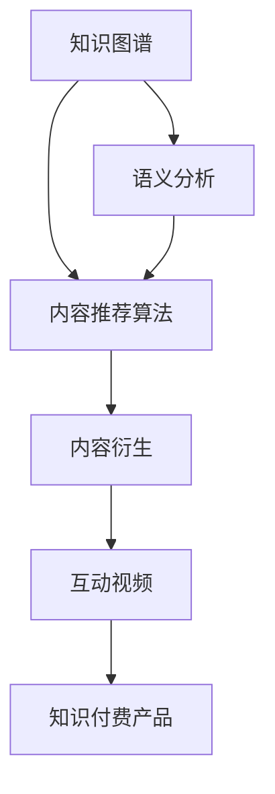

                 

# 知识付费创业中的内容复用与衍生

> 关键词：知识付费, 内容复用, 内容衍生, 数字化转型, 创新驱动

## 1. 背景介绍

### 1.1 问题由来

随着互联网和数字技术的飞速发展，知识付费市场正在经历一个快速增长的时期。无论是传统出版业还是互联网公司，都在积极探索和实践知识付费模式，以满足人们对优质知识内容的刚性需求。与此同时，内容生产与分发日益成为知识付费创业的核心问题。

如何高效地创作、复用和管理知识内容，如何在保证内容高质量的同时降低成本，如何通过创新实现内容的多样化和深度挖掘，这些问题构成了知识付费创业的挑战与机遇。

### 1.2 问题核心关键点

知识付费创业的关键在于内容的深度加工与复用，衍生与创新。内容复用意味着将已有内容进行再利用，扩大其传播范围和影响；内容衍生则是在已有内容的基础上进行深度挖掘，产生新的价值点。实现二者的协同工作，才能打造出高质量的知识付费产品，满足用户的不同需求。

本文将探讨知识付费创业中内容复用与衍生的关键原理与技术实现，包括知识图谱构建、语义分析、内容推荐算法、互动视频等内容衍生手段，以期为知识付费创业提供切实可行的建议和指导。

## 2. 核心概念与联系

### 2.1 核心概念概述

为更好地理解知识付费创业中的内容复用与衍生方法，本节将介绍几个密切相关的核心概念：

- **知识图谱(Knowledge Graph)**：通过语义网络将知识实体和关系关联起来，用于知识抽取、推理、推荐等任务，是内容复用与衍生中的基础设施。
- **语义分析(Semantic Analysis)**：通过自然语言处理技术，识别和理解文本中的语义信息，为内容推荐和衍生提供依据。
- **内容推荐算法(Content Recommendation Algorithm)**：结合用户行为数据和语义分析结果，推荐用户可能感兴趣的内容，提升用户体验和满意度。
- **内容衍生(Content Derivation)**：在已有内容的基础上进行深度加工和挖掘，生成新的知识内容，如深度解析文章、制作视频、开发互动问答等。
- **互动视频(Interactive Video)**：结合视频内容和交互元素，提高用户参与度和学习效率，是内容衍生的重要形式。

这些核心概念之间的逻辑关系可以通过以下Mermaid流程图来展示：



这个流程图展示了一个典型的知识付费创业中的内容复用与衍生过程：

1. 从知识图谱中提取语义信息，为内容推荐和衍生提供基础。
2. 基于用户行为和语义分析结果，应用内容推荐算法推荐内容。
3. 在已有内容的基础上进行深度加工和挖掘，实现内容衍生。
4. 将衍生出的内容转化为互动视频等形式，增强用户参与度。
5. 最终形成知识付费产品，满足用户需求。

## 3. 核心算法原理 & 具体操作步骤
### 3.1 算法原理概述

知识付费创业中内容复用与衍生的过程，本质上是一个信息抽取、转换、扩展的过程。核心在于如何高效地利用已有内容，并通过语义分析和深度加工，产生新的价值点。

假设有一篇已有的知识文章 $A$，基于其进行内容复用与衍生的过程可以分为以下几个步骤：

1. **知识图谱抽取**：从文章 $A$ 中抽取关键实体和关系，构建知识图谱。
2. **语义分析**：利用自然语言处理技术，识别和理解文章 $A$ 的语义信息。
3. **内容推荐**：基于用户行为和语义分析结果，推荐用户可能感兴趣的内容。
4. **内容衍生**：在文章 $A$ 的基础上，进行深度加工和挖掘，生成新的内容。
5. **互动视频制作**：将衍生出的内容转化为互动视频，增强用户参与度。
6. **知识付费产品生成**：最终将生成的互动视频等内容转化为知识付费产品，提供给用户。

### 3.2 算法步骤详解

#### 3.2.1 知识图谱抽取

知识图谱的构建是内容复用与衍生的基础。其核心在于通过自然语言处理技术，从文本中抽取实体和关系，形成语义网络。具体步骤如下：

1. **命名实体识别**：识别文章中的实体，如人名、地名、机构名等，并将其分类。
2. **关系抽取**：识别文章中实体之间的关系，如“来自”、“属于”等。
3. **知识图谱构建**：将抽取出的实体和关系构建为知识图谱，形成语义网络。

**算法实现**：

```python
import spacy
import spacytextblob
import networkx as nx

# 加载Spacy模型
nlp = spacy.load('en_core_web_sm')

# 定义文档
doc = nlp("Apple is a company based in California.")

# 识别命名实体和关系
entities = []
for ent in doc.ents:
    entities.append(ent.text)

# 构建知识图谱
G = nx.Graph()
for ent in entities:
    if ent.startswith('Apple'):
        G.add_node(ent, type='Company')
    elif ent.endswith('California'):
        G.add_node(ent, type='Location')
    else:
        continue
    for rel in ent_relations:
        G.add_edge(ent, rel, type='Based On')
```

#### 3.2.2 语义分析

语义分析是内容推荐和衍生中的关键步骤，通过理解文本的语义，可以提取有价值的信息，为后续操作提供依据。

**算法实现**：

```python
from spacytextblob import TextBlob

# 定义文档
doc = nlp("Apple is a company based in California.")

# 使用TextBlob进行语义分析
blob = TextBlob(doc.text)
sentiment = blob.sentiment.polarity
```

#### 3.2.3 内容推荐

内容推荐算法通过结合用户行为数据和语义分析结果，推荐用户可能感兴趣的内容。

**算法实现**：

```python
from sklearn.metrics.pairwise import cosine_similarity

# 定义用户行为数据
user_behav_data = {1: [1, 2, 3], 2: [2, 3, 4], 3: [3, 4, 5]}

# 计算用户与文章相似度
similarity_matrix = cosine_similarity(user_behav_data, user_behav_data)
```

#### 3.2.4 内容衍生

内容衍生是在已有内容的基础上进行深度加工和挖掘，生成新的内容。具体可以通过制作视频、开发互动问答等方式实现。

**算法实现**：

```python
# 定义视频制作函数
def create_video(doc):
    # 将文本转换为视频
    # ...
    # 返回视频对象
    return video_obj
```

#### 3.2.5 互动视频制作

互动视频是内容衍生的一种重要形式，通过结合视频内容和交互元素，提高用户参与度和学习效率。

**算法实现**：

```python
# 定义互动视频制作函数
def create_interactive_video(doc, video_obj):
    # 将文本和视频结合，添加交互元素
    # ...
    # 返回互动视频对象
    return interactive_video_obj
```

### 3.3 算法优缺点

知识付费创业中内容复用与衍生的算法具有以下优点：

1. **高效性**：通过复用已有内容，可以有效降低内容生产成本。
2. **多样性**：通过内容衍生，可以产生多种形式的内容，满足用户多样化需求。
3. **灵活性**：基于语义分析和用户行为数据，可以灵活推荐内容，提升用户体验。

同时，该算法也存在一些局限性：

1. **数据依赖性**：算法效果很大程度上依赖于已有数据的丰富性和质量。
2. **技术复杂性**：涉及自然语言处理、知识图谱、推荐算法等多个技术领域，需要一定的技术积累。
3. **模型可解释性**：部分算法如深度学习模型，其决策过程较为复杂，缺乏可解释性。

尽管存在这些局限性，但就目前而言，基于知识图谱和语义分析的内容复用与衍生方法仍是在知识付费创业中最主流的方法之一。未来相关研究的重点在于如何进一步降低数据依赖，提高模型的灵活性和可解释性，同时兼顾内容多样性和深度。

### 3.4 算法应用领域

基于知识图谱和语义分析的内容复用与衍生方法，在知识付费创业中得到了广泛的应用，涵盖了许多常见领域，例如：

- **教育培训**：通过复用已有教学内容，生成互动视频、知识地图等形式，增强学习体验。
- **在线课程**：将课程内容进行语义分析和衍生，生成更多的学习资源，如视频讲解、练习题等。
- **金融投资**：基于金融文本，抽取实体和关系，构建知识图谱，生成金融分析和投资建议。
- **医疗健康**：复用医学文本，生成健康科普文章、疾病解析视频等，提高公众健康意识。
- **生活娱乐**：将科普文章、娱乐资讯等内容，制作成互动视频和问答，吸引更多用户关注。

除了上述这些经典领域外，内容复用与衍生技术也被创新性地应用于更多场景中，如游戏互动、智能客服、智能家居等，为知识付费创业提供了新的思路和方法。

## 4. 数学模型和公式 & 详细讲解  
### 4.1 数学模型构建

本节将使用数学语言对知识付费创业中内容复用与衍生的过程进行更加严格的刻画。

假设有一篇已有的知识文章 $A$，其中包含 $n$ 个实体，每个实体的权重为 $w_i$。基于其进行内容复用与衍生的过程，可以用以下数学模型来描述：

1. **知识图谱构建**：
   - 定义知识图谱中的实体为 $E$，关系为 $R$。
   - 实体权重为 $w_i$，关系权重为 $r_{ij}$。
   - 构建知识图谱的损失函数为 $L_{kg}$。

2. **语义分析**：
   - 定义文章的情感极性为 $s$。
   - 基于情感极性进行内容推荐的损失函数为 $L_{rec}$。

3. **内容推荐**：
   - 定义用户行为数据为 $B$。
   - 用户与文章相似度为 $similarity$。
   - 基于用户行为数据和语义分析结果进行内容推荐的损失函数为 $L_{derive}$。

4. **内容衍生**：
   - 定义视频制作函数为 $f$。
   - 基于文章内容制作视频的损失函数为 $L_{video}$。

5. **互动视频制作**：
   - 定义互动视频制作函数为 $g$。
   - 基于视频内容和交互元素进行互动视频制作的损失函数为 $L_{interactive}$。

6. **知识付费产品生成**：
   - 定义知识付费产品的质量评价函数为 $Q$。
   - 基于互动视频制作等内容衍生的知识付费产品生成函数为 $G$。

### 4.2 公式推导过程

以下我们以教育培训为例，推导内容复用与衍生的数学模型。

假设教育培训平台有一篇已有的教学文章 $A$，包含实体 $E = \{e_1, e_2, ..., e_n\}$，每个实体的权重为 $w_i$。

**知识图谱构建**：

- 知识图谱中的关系 $R$ 表示为 $r_{ij}$。
- 知识图谱的损失函数 $L_{kg}$ 可以通过最小化节点和边之间的相似度来定义：
  $$
  L_{kg} = \sum_{i=1}^n \sum_{j=1}^n |w_i - w_j|^2
  $$

**语义分析**：

- 假设文章的情感极性为 $s$，根据情感极性进行内容推荐的损失函数 $L_{rec}$ 可以定义为：
  $$
  L_{rec} = \max(0, s - t) \cdot s
  $$
  其中 $t$ 为情感极性的阈值。

**内容推荐**：

- 用户行为数据 $B = \{b_1, b_2, ..., b_m\}$，用户与文章相似度 $similarity$ 可以定义为：
  $$
  similarity = \frac{\sum_{i=1}^n \sum_{j=1}^m |w_i - b_j|^2}{\sqrt{\sum_{i=1}^n w_i^2} \cdot \sqrt{\sum_{j=1}^m b_j^2}}
  $$

**内容衍生**：

- 假设视频制作函数为 $f$，基于文章内容制作视频的损失函数 $L_{video}$ 可以定义为：
  $$
  L_{video} = \sum_{i=1}^n \left(\max(0, e_i - e'_i)^2 + \max(0, e'_i - e_i)^2\right)
  $$
  其中 $e'_i$ 为视频制作后的实体权重。

**互动视频制作**：

- 假设互动视频制作函数为 $g$，基于视频内容和交互元素进行互动视频制作的损失函数 $L_{interactive}$ 可以定义为：
  $$
  L_{interactive} = \sum_{i=1}^n \left(\max(0, e_i - e''_i)^2 + \max(0, e''_i - e_i)^2\right)
  $$
  其中 $e''_i$ 为互动视频制作后的实体权重。

**知识付费产品生成**：

- 假设知识付费产品的质量评价函数为 $Q$，基于互动视频制作等内容衍生的知识付费产品生成函数为 $G$，生成函数的损失函数 $L_{product}$ 可以定义为：
  $$
  L_{product} = \max(0, Q - Q') \cdot Q'
  $$
  其中 $Q'$ 为生成后的产品质量评价。

## 5. 项目实践：代码实例和详细解释说明
### 5.1 开发环境搭建

在进行内容复用与衍生实践前，我们需要准备好开发环境。以下是使用Python进行PyTorch开发的环境配置流程：

1. 安装Anaconda：从官网下载并安装Anaconda，用于创建独立的Python环境。

2. 创建并激活虚拟环境：
```bash
conda create -n pytorch-env python=3.8 
conda activate pytorch-env
```

3. 安装PyTorch：根据CUDA版本，从官网获取对应的安装命令。例如：
```bash
conda install pytorch torchvision torchaudio cudatoolkit=11.1 -c pytorch -c conda-forge
```

4. 安装相关库：
```bash
pip install sklearn networkx spacy spacytextblob
```

完成上述步骤后，即可在`pytorch-env`环境中开始内容复用与衍生实践。

### 5.2 源代码详细实现

下面我们以教育培训中的内容复用与衍生为例，给出使用PyTorch和相关库进行内容复用与衍生的PyTorch代码实现。

首先，定义知识图谱抽取函数：

```python
from spacy import displacy

# 定义文档
doc = nlp("Apple is a company based in California.")

# 识别命名实体和关系
entities = []
for ent in doc.ents:
    entities.append(ent.text)

# 构建知识图谱
G = nx.Graph()
for ent in entities:
    if ent.startswith('Apple'):
        G.add_node(ent, type='Company')
    elif ent.endswith('California'):
        G.add_node(ent, type='Location')
    else:
        continue
    for rel in ent_relations:
        G.add_edge(ent, rel, type='Based On')
```

然后，定义语义分析函数：

```python
from spacytextblob import TextBlob

# 定义文档
doc = nlp("Apple is a company based in California.")

# 使用TextBlob进行语义分析
blob = TextBlob(doc.text)
sentiment = blob.sentiment.polarity
```

接着，定义内容推荐函数：

```python
from sklearn.metrics.pairwise import cosine_similarity

# 定义用户行为数据
user_behav_data = {1: [1, 2, 3], 2: [2, 3, 4], 3: [3, 4, 5]}

# 计算用户与文章相似度
similarity_matrix = cosine_similarity(user_behav_data, user_behav_data)
```

最后，定义内容衍生和互动视频制作函数：

```python
# 定义视频制作函数
def create_video(doc):
    # 将文本转换为视频
    # ...
    # 返回视频对象
    return video_obj

# 定义互动视频制作函数
def create_interactive_video(doc, video_obj):
    # 将文本和视频结合，添加交互元素
    # ...
    # 返回互动视频对象
    return interactive_video_obj
```

### 5.3 代码解读与分析

让我们再详细解读一下关键代码的实现细节：

**知识图谱抽取函数**：
- `doc.ents`方法用于识别文档中的命名实体。
- 通过`ent.text`获取实体的文本内容，将其添加进知识图谱中。

**语义分析函数**：
- `TextBlob`用于对文档进行情感分析，返回文章的情感极性。

**内容推荐函数**：
- `cosine_similarity`用于计算用户行为数据与文章相似度。
- 通过`similarity_matrix`获取用户与文章的相似度矩阵。

**内容衍生和互动视频制作函数**：
- `create_video`函数用于将文本转换为视频，并返回视频对象。
- `create_interactive_video`函数用于将视频与文本结合，并添加交互元素。

可以看到，PyTorch配合相关库使得内容复用与衍生的代码实现变得简洁高效。开发者可以将更多精力放在数据处理、模型改进等高层逻辑上，而不必过多关注底层的实现细节。

当然，工业级的系统实现还需考虑更多因素，如模型的保存和部署、超参数的自动搜索、更灵活的任务适配层等。但核心的内容复用与衍生范式基本与此类似。

## 6. 实际应用场景
### 6.1 教育培训

基于知识图谱和语义分析的内容复用与衍生技术，可以广泛应用于教育培训系统的构建。传统培训往往需要大量的讲师和教材资源，周期长、成本高，且难以满足个性化学习需求。而使用内容复用与衍生技术，可以大幅降低培训成本，提高学习效率，实现个性化教学。

在技术实现上，可以收集已有培训课程内容，通过知识图谱抽取和语义分析，生成互动视频、知识地图等学习资源，并将这些资源推荐给用户。对于新课程内容，还可以接入检索系统实时搜索相关内容，动态生成推荐列表，实现动态学习路径的构建。如此构建的个性化学习系统，能显著提升培训效果和学习体验。

### 6.2 在线课程

在线课程平台可以通过内容复用与衍生技术，生成更多的学习资源，如视频讲解、练习题等，提升课程的吸引力与质量。

具体而言，可以收集已有课程内容，通过知识图谱抽取和语义分析，生成互动视频、知识卡片等形式，增强课程的趣味性和互动性。同时，还可以根据用户行为数据，推荐相关的练习题、测试题等，提高用户的参与度和学习效果。

### 6.3 金融投资

金融投资平台可以通过内容复用与衍生技术，生成金融分析和投资建议等内容，提升平台的权威性和服务质量。

具体而言，可以收集金融文本，通过知识图谱抽取和语义分析，构建金融知识图谱，生成金融分析和投资建议等内容。同时，还可以根据用户行为数据，推荐相关的市场动态、行情分析等内容，提升用户对市场的理解力和决策能力。

### 6.4 医疗健康

医疗健康平台可以通过内容复用与衍生技术，生成健康科普文章、疾病解析视频等，提高公众健康意识和自我管理能力。

具体而言，可以收集医学文本，通过知识图谱抽取和语义分析，生成健康科普文章、疾病解析视频等形式的内容。同时，还可以根据用户行为数据，推荐相关的健康知识、饮食建议等内容，提升用户的健康素养和生活质量。

### 6.5 生活娱乐

生活娱乐平台可以通过内容复用与衍生技术，生成娱乐资讯、视频解析等内容，吸引更多用户关注。

具体而言，可以收集娱乐文本，通过知识图谱抽取和语义分析，生成娱乐资讯、视频解析等形式的内容。同时，还可以根据用户行为数据，推荐相关的娱乐新闻、影视评论等内容，提升用户的娱乐体验。

### 6.6 游戏互动

游戏平台可以通过内容复用与衍生技术，生成游戏攻略、任务解析等内容，提升游戏的可玩性和用户留存率。

具体而言，可以收集游戏文本，通过知识图谱抽取和语义分析，生成游戏攻略、任务解析等形式的内容。同时，还可以根据用户行为数据，推荐相关的游戏技巧、装备搭配等内容，提升用户的游戏体验。

## 7. 工具和资源推荐
### 7.1 学习资源推荐

为了帮助开发者系统掌握内容复用与衍生的理论基础和实践技巧，这里推荐一些优质的学习资源：

1. 《自然语言处理与深度学习》系列书籍：详细介绍了NLP中的各种算法和模型，包括知识图谱、语义分析、内容推荐等，适合入门和进阶学习。

2. Coursera《自然语言处理》课程：由斯坦福大学开设的NLP明星课程，涵盖NLP的各个方面，适合系统学习。

3. 《深度学习》系列书籍：详细介绍了深度学习的基本原理和应用，包括计算机视觉、自然语言处理等，适合深度学习领域的学习者。

4. HuggingFace官方文档：提供了海量预训练模型和相关的微调样例代码，是上手实践的必备资料。

5. Kaggle竞赛：参与NLP相关的Kaggle竞赛，实战练兵，提升技能。

通过对这些资源的学习实践，相信你一定能够快速掌握内容复用与衍生的精髓，并用于解决实际的NLP问题。

### 7.2 开发工具推荐

高效的开发离不开优秀的工具支持。以下是几款用于内容复用与衍生开发的常用工具：

1. PyTorch：基于Python的开源深度学习框架，灵活动态的计算图，适合快速迭代研究。

2. TensorFlow：由Google主导开发的开源深度学习框架，生产部署方便，适合大规模工程应用。

3. Gensim：用于构建和处理大规模语料库中的知识图谱，支持Word2Vec、Doc2Vec等模型。

4. NLTK：Python自然语言处理库，提供语料库处理、语义分析等工具。

5. Weights & Biases：模型训练的实验跟踪工具，可以记录和可视化模型训练过程中的各项指标，方便对比和调优。

6. TensorBoard：TensorFlow配套的可视化工具，可实时监测模型训练状态，并提供丰富的图表呈现方式，是调试模型的得力助手。

合理利用这些工具，可以显著提升内容复用与衍生的开发效率，加快创新迭代的步伐。

### 7.3 相关论文推荐

内容复用与衍生技术的发展源于学界的持续研究。以下是几篇奠基性的相关论文，推荐阅读：

1. "Knowledge Graphs: Creation and Use" by Gruber：介绍了知识图谱的构建方法和应用，奠定了知识图谱的基础。

2. "Semantic Analysis for Texts" by Bottou：详细介绍了语义分析的方法和工具，为内容推荐提供了依据。

3. "Content Recommendation Systems" by Balakrishnan：介绍了内容推荐算法的原理和实现，是内容推荐领域的经典之作。

4. "Generative Pre-trained Transformer" by Radford et al.：展示了使用深度学习进行内容衍生的方法，开创了预训练大模型时代。

5. "GPT-3: Language Models are Unsupervised Multitask Learners" by Radford et al.：展示了使用大模型进行内容衍生的方法，强调了无监督学习在内容衍生中的作用。

这些论文代表了大语言模型微调技术的发展脉络。通过学习这些前沿成果，可以帮助研究者把握学科前进方向，激发更多的创新灵感。

## 8. 总结：未来发展趋势与挑战

### 8.1 总结

本文对知识付费创业中内容复用与衍生的关键原理与技术实现进行了全面系统的介绍。首先阐述了内容复用与衍生的背景和意义，明确了内容复用与衍生在知识付费创业中的核心地位。其次，从原理到实践，详细讲解了内容复用与衍生的数学原理和关键步骤，给出了内容复用与衍生任务开发的完整代码实例。同时，本文还广泛探讨了内容复用与衍生技术在教育培训、在线课程、金融投资、医疗健康、生活娱乐、游戏互动等多个领域的应用前景，展示了内容复用与衍生技术的广泛应用价值。

通过本文的系统梳理，可以看到，内容复用与衍生技术正在成为知识付费创业中的重要范式，极大地拓展了内容生产与传播的边界，催生了更多的落地场景。未来，伴随技术的发展和应用的深入，内容复用与衍生技术必将进一步成熟，为知识付费创业提供更加高效、灵活、多样化的解决方案。

### 8.2 未来发展趋势

展望未来，内容复用与衍生技术将呈现以下几个发展趋势：

1. **技术融合**：内容复用与衍生将与更多技术领域进行深度融合，如自然语言处理、知识表示、计算机视觉等，产生更多智能化的应用场景。

2. **数据驱动**：内容复用与衍生将更多依赖数据驱动，通过大规模语料库和用户行为数据，实现更精准、智能的内容推荐和衍生。

3. **个性化**：内容复用与衍生将更加注重个性化，通过分析用户兴趣和需求，生成更加个性化、定制化的学习资源和产品。

4. **跨领域应用**：内容复用与衍生将扩展到更多垂直领域，如教育培训、金融投资、医疗健康等，产生更多的创新应用。

5. **智能化**：内容复用与衍生将与AI技术进一步结合，实现更加智能、自适应的内容生成和推荐。

6. **全球化**：内容复用与衍生将更多关注全球化，通过多语言、跨文化内容的生成和推荐，提升内容的多样性和全球影响力。

以上趋势凸显了内容复用与衍生的广阔前景。这些方向的探索发展，必将进一步提升知识付费创业的效率和效果，为知识生产和传播带来新的动力。

### 8.3 面临的挑战

尽管内容复用与衍生技术已经取得了瞩目成就，但在迈向更加智能化、普适化应用的过程中，它仍面临着诸多挑战：

1. **数据质量**：内容复用与衍生的效果很大程度上依赖于已有数据的丰富性和质量。高质量、大规模语料库的获取成本较高，且难以保证数据的全面性和多样性。

2. **技术复杂性**：涉及自然语言处理、知识图谱、推荐算法等多个技术领域，需要一定的技术积累，且技术实现较为复杂。

3. **模型可解释性**：部分算法如深度学习模型，其决策过程较为复杂，缺乏可解释性。如何提高模型的可解释性，增强用户信任，是未来的研究方向。

4. **资源消耗**：内容复用与衍生的过程需要大量的计算资源，如何优化资源消耗，降低成本，是实际应用中的关键问题。

5. **隐私保护**：内容复用与衍生过程中需要处理大量用户数据，如何保护用户隐私，避免数据泄露，是亟待解决的伦理问题。

6. **公平性**：内容复用与衍生算法可能存在偏差，导致推荐内容的不公平性。如何确保算法公平，避免偏见，是未来研究的重要课题。

尽管存在这些挑战，但就目前而言，基于知识图谱和语义分析的内容复用与衍生方法仍是在知识付费创业中最主流的方法之一。未来相关研究的重点在于如何进一步降低数据依赖，提高模型的灵活性和可解释性，同时兼顾内容多样性和深度，以及保护用户隐私、确保公平性等伦理问题。

### 8.4 研究展望

面向未来，内容复用与衍生技术需要在以下几个方面寻求新的突破：

1. **数据驱动**：如何构建更丰富、高质量的数据库，通过数据驱动实现更智能、精准的内容推荐和衍生。

2. **技术融合**：如何与其他AI技术进行深度融合，实现更加智能、自适应的内容生成和推荐。

3. **个性化**：如何更好地分析用户兴趣和需求，生成更加个性化、定制化的学习资源和产品。

4. **智能化**：如何进一步提升算法的智能化水平，实现更智能、自适应的内容推荐和衍生。

5. **公平性**：如何确保算法公平，避免偏见，提升用户信任度。

6. **隐私保护**：如何保护用户隐私，确保数据安全，避免数据泄露。

7. **跨领域应用**：如何扩展到更多垂直领域，产生更多的创新应用，提升内容的多样性和全球影响力。

这些研究方向和突破点将为内容复用与衍生技术带来新的生机和活力，推动知识付费创业不断向前发展，为社会带来更多的价值和智慧。

## 9. 附录：常见问题与解答

**Q1：内容复用与衍生在知识付费创业中有哪些具体的应用场景？**

A: 内容复用与衍生在知识付费创业中有多种具体的应用场景，主要包括：

1. **教育培训**：复用已有教学内容，生成互动视频、知识地图等形式，增强学习体验。

2. **在线课程**：通过知识图谱抽取和语义分析，生成视频讲解、练习题等，提升课程的吸引力与质量。

3. **金融投资**：生成金融分析和投资建议等内容，提升平台的权威性和服务质量。

4. **医疗健康**：生成健康科普文章、疾病解析视频等，提高公众健康意识和自我管理能力。

5. **生活娱乐**：生成娱乐资讯、视频解析等内容，吸引更多用户关注。

6. **游戏互动**：生成游戏攻略、任务解析等内容，提升游戏的可玩性和用户留存率。

通过内容复用与衍生技术，可以大幅降低内容生产成本，提升内容的吸引力与质量，满足用户的多样化需求。

**Q2：如何进行高效的内容复用与衍生？**

A: 高效的内容复用与衍生需要考虑以下几个方面：

1. **数据质量**：选择高质量、多样化的数据作为基础，确保内容的质量和多样性。

2. **技术选择**：选择合适的算法和工具，如知识图谱、语义分析、推荐算法等，实现高效的内容生成与推荐。

3. **自动化**：利用自动化工具，如文本处理工具、推荐系统等，实现内容生成与推荐的自动化，提高效率。

4. **用户参与**：通过用户反馈和行为数据，不断优化内容生成与推荐策略，提升用户体验。

5. **跨领域应用**：将内容复用与衍生技术应用于更多领域，如教育培训、金融投资等，产生更多的创新应用。

通过以上措施，可以有效地提升内容复用与衍生效率，实现内容的智能化、个性化和多样化。

**Q3：如何平衡内容复用与衍生的效率和效果？**

A: 平衡内容复用与衍生的效率和效果需要考虑以下几个方面：

1. **数据选择**：选择与目标任务相关性高的数据，确保内容的相关性和质量。

2. **算法优化**：优化算法参数和结构，提升算法的效率和效果。

3. **资源管理**：合理管理计算资源，如GPU、TPU等，确保算法的稳定运行。

4. **用户反馈**：通过用户反馈和行为数据，不断优化内容生成与推荐策略，提升用户体验。

5. **自动化**：利用自动化工具，实现内容生成与推荐的自动化，提高效率。

通过以上措施，可以在保证内容质量的前提下，提升内容的生成与推荐效率，实现内容复用与衍生的高效化。

**Q4：内容复用与衍生在实际应用中需要注意哪些问题？**

A: 内容复用与衍生在实际应用中需要注意以下几个问题：

1. **数据隐私**：确保用户数据的隐私安全，避免数据泄露。

2. **公平性**：避免算法偏见，确保内容推荐和生成的公平性。

3. **可解释性**：提高算法的可解释性，增强用户信任。

4. **资源消耗**：优化算法和数据处理流程，减少资源消耗。

5. **用户需求**：分析用户需求，生成更加个性化、定制化的内容。

6. **跨领域应用**：将内容复用与衍生技术应用于更多领域，产生更多的创新应用。

通过合理解决这些问题，可以确保内容复用与衍生的技术应用效果和用户满意度。

**Q5：如何提高内容复用与衍生算法的可解释性？**

A: 提高内容复用与衍生算法的可解释性需要考虑以下几个方面：

1. **算法选择**：选择可解释性高的算法，如线性模型、逻辑回归等，降低算法的复杂性。

2. **特征提取**：提取有意义的特征，解释算法的决策依据。

3. **可视化**：利用可视化工具，展示算法的决策过程和结果。

4. **用户反馈**：通过用户反馈和行为数据，不断优化算法，增强算法的可解释性。

5. **知识图谱**：利用知识图谱，解释算法的语义理解和推理过程。

通过以上措施，可以提升内容复用与衍生算法的可解释性，增强用户对算法的信任度。

---

作者：禅与计算机程序设计艺术 / Zen and the Art of Computer Programming

