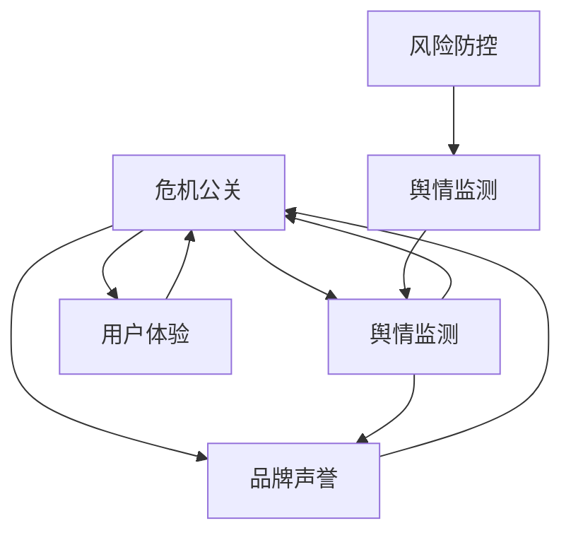

                 

# 知识付费创业中的危机公关与舆情管理

> 关键词：危机公关, 舆情管理, 知识付费, 风险防控, 用户体验

## 1. 背景介绍

### 1.1 问题由来
随着知识付费的兴起，越来越多的互联网企业投入到这个新兴领域。知识付费平台为用户提供高效、便利的知识获取方式，提升了用户学习效率和质量。然而，快速增长的同时，也伴随着各种潜在风险。负面舆情的突然爆发，如侵犯版权、知识质量低下、用户体验差等问题，都可能对知识付费企业的品牌形象和市场份额造成重大冲击。因此，如何在知识付费创业过程中有效应对危机，管理好舆情，成为当前亟待解决的重要问题。

### 1.2 问题核心关键点
在知识付费创业过程中，危机公关与舆情管理涉及以下几个核心关键点：
1. **危机公关处理**：迅速、准确、有效地处理突发事件，维护企业形象和声誉。
2. **舆情监测与分析**：实时监测用户反馈，分析舆情趋势，预测风险。
3. **用户需求满足**：快速响应用户需求，提升用户体验，减少负面舆情。
4. **品牌声誉建设**：通过积极的品牌建设，增强用户信任，构建品牌忠诚度。

这些关键点紧密相关，相互影响。有效的危机公关与舆情管理，不仅需要及时处理突发事件，还需要建立长期的品牌声誉，持续提升用户体验。

## 2. 核心概念与联系

### 2.1 核心概念概述

为更好地理解危机公关与舆情管理，本节将介绍几个密切相关的核心概念：

- **危机公关**：指企业在面对突发事件（如负面舆情、产品故障等）时，通过有效的沟通和处理手段，维护和恢复企业声誉和形象的过程。
- **舆情监测**：指通过收集、分析和预测用户反馈数据，了解用户对企业产品或服务的情感倾向和态度变化，及时发现和预测潜在的舆情风险。
- **品牌声誉**：指用户在特定时间对企业产品或服务的总体评价和印象，包括产品品质、服务质量、用户体验等多个维度。
- **用户体验**：指用户在使用产品或服务过程中，所体验到的各方面的感受和满意度，包括易用性、可靠性、情感满意度等。
- **风险防控**：指通过事先制定应对措施，预测和规避可能出现的风险，提升企业的应急响应能力。

这些概念之间的逻辑关系可以通过以下Mermaid流程图来展示：



这个流程图展示了几类关键概念之间的相互作用：

1. 危机公关处理与舆情监测紧密相连，舆情监测的实时数据可以为危机公关提供决策支持。
2. 品牌声誉和用户体验对危机公关有着直接影响，提升用户体验和品牌声誉能够有效预防和应对危机。
3. 风险防控是危机公关的预防性措施，通过提前制定应对策略，提升企业应对突发事件的能力。

## 3. 核心算法原理 & 具体操作步骤

### 3.1 算法原理概述

危机公关与舆情管理的方法，本质上是基于数据的驱动决策过程。其核心思想是通过收集和分析用户反馈数据，快速识别和应对潜在危机，同时通过不断优化用户体验和品牌声誉，实现长期稳健发展。

形式化地，假设企业面对的危机事件为 $C$，舆情数据为 $D$，品牌声誉为 $R$，用户体验为 $U$。危机公关的优化目标是最小化企业声誉损失 $L_R$ 和用户不满度 $L_U$，即：

$$
\mathop{\arg\min}_{C, D, R, U} \mathcal{L}(C, D, R, U)
$$

其中 $\mathcal{L}$ 为综合损失函数，包括舆情监测、危机处理、品牌建设和用户体验提升等多个维度的损失。

### 3.2 算法步骤详解

基于数据驱动的危机公关与舆情管理方法一般包括以下几个关键步骤：

**Step 1: 数据收集与预处理**
- 收集企业的各项业务数据，包括用户反馈、产品使用情况、服务评价等。
- 通过自然语言处理(NLP)技术，将非结构化数据转化为结构化数据，便于后续分析。

**Step 2: 舆情监测与分析**
- 建立舆情监测系统，实时收集社交媒体、评论、问卷等用户反馈数据。
- 应用情感分析、主题模型等算法，对舆情数据进行情感倾向性和主题分析，识别潜在的负面舆情。
- 利用时间序列分析，预测舆情变化趋势，及时发现危机信号。

**Step 3: 风险评估与预警**
- 通过舆情数据，评估企业的品牌声誉和用户满意度，识别高风险领域。
- 建立预警系统，设定舆情阈值，一旦达到阈值，自动触发预警机制。

**Step 4: 危机处理与响应**
- 根据预警系统输出的危机信息，启动危机处理流程，制定应急预案。
- 通过多渠道（如社交媒体、官网、客服等）发布官方声明，回应用户关切，减少负面影响。
- 在处理过程中，持续监测舆情变化，动态调整危机应对策略。

**Step 5: 用户体验优化与品牌建设**
- 根据用户反馈，快速迭代产品和服务，提升用户体验。
- 制定品牌建设策略，通过高质量内容、专业服务等方式，提升品牌形象和用户信任。

**Step 6: 后危机评估与改进**
- 在危机处理结束后，对事件进行复盘分析，总结经验教训。
- 结合舆情数据和用户反馈，持续改进产品和服务，提升企业应对危机能力。

以上是危机公关与舆情管理的一般流程。在实际应用中，还需要针对具体企业的特点和行业特征，对各环节进行优化设计，如定制化的舆情分析模型、用户画像等。

### 3.3 算法优缺点

基于数据驱动的危机公关与舆情管理方法具有以下优点：
1. 实时性高。通过实时监测用户反馈，能够快速识别和应对潜在的危机。
2. 决策依据充分。通过综合多维度的数据，进行全面分析和预测，避免单一视角的局限。
3. 用户体验提升。通过不断优化产品和服务，提升用户满意度和品牌忠诚度。
4. 应对能力强。通过风险预警和应急预案，提升企业应对突发事件的能力。

同时，该方法也存在一定的局限性：
1. 数据获取难度大。部分舆情数据来自社交媒体等非结构化数据，收集和处理成本较高。
2. 模型复杂度较高。舆情分析、品牌建设等环节涉及多维度的复杂模型，需投入较多资源。
3. 隐私风险。用户反馈数据的收集和使用，涉及用户隐私保护，需遵守相关法律法规。

尽管存在这些局限性，但就目前而言，基于数据驱动的危机公关与舆情管理方法仍是最为主流和有效的应对策略。未来相关研究的重点在于如何进一步降低数据获取成本，提高模型效率，同时兼顾用户隐私保护。

### 3.4 算法应用领域

基于数据驱动的危机公关与舆情管理方法在多个领域得到了广泛应用，例如：

- 互联网企业：如电商平台、在线教育平台、知识付费平台等。通过实时监测用户反馈，及时应对负面舆情，提升品牌声誉。
- 传统媒体：如新闻网站、电视媒体等。通过分析用户评论、社交媒体数据，提升内容质量，优化用户体验。
- 公共服务：如政府部门、公共事业等。通过舆情监测，及时发现和处理公共服务问题，提升服务质量。

除了这些典型领域外，危机公关与舆情管理还广泛应用于各类品牌和企业中，助力企业构建良好的市场形象，提升品牌价值。

## 4. 数学模型和公式 & 详细讲解 & 举例说明

### 4.1 数学模型构建

本节将使用数学语言对危机公关与舆情管理过程进行更加严格的刻画。

假设企业品牌声誉为 $R$，用户体验为 $U$，舆情数据为 $D$。品牌声誉和用户体验的关系可以表示为：

$$
R = f(U, D)
$$

其中 $f$ 为品牌建设函数，考虑用户满意度和舆情数据等多个维度。

品牌声誉 $R$ 和用户不满度 $L_U$ 的关系可以表示为：

$$
L_U = g(R)
$$

其中 $g$ 为用户不满度函数，反映用户对企业的总体满意度。

舆情数据 $D$ 和用户不满度 $L_U$ 的关系可以表示为：

$$
L_U = h(D)
$$

其中 $h$ 为用户不满度函数，反映舆情数据对用户不满度的影响。

通过以上模型，可以构建综合损失函数 $\mathcal{L}$：

$$
\mathcal{L} = \alpha R + \beta L_U
$$

其中 $\alpha$ 和 $\beta$ 为模型参数，反映了品牌声誉和用户不满度在损失函数中的权重。

### 4.2 公式推导过程

以下我们以二分类任务为例，推导品牌建设函数和用户不满度函数的计算公式。

假设品牌建设函数 $f$ 为线性模型：

$$
f(U, D) = \theta_0 + \theta_1U + \theta_2D
$$

其中 $\theta_0, \theta_1, \theta_2$ 为模型参数。

用户不满度函数 $g$ 和 $h$ 可以表示为：

$$
g(R) = \lambda_0 + \lambda_1R
$$

$$
h(D) = \mu_0 + \mu_1D
$$

其中 $\lambda_0, \lambda_1, \mu_0, \mu_1$ 为模型参数。

将 $f$ 和 $g$ 代入综合损失函数 $\mathcal{L}$：

$$
\mathcal{L} = \alpha (f(U, D)) + \beta (g(h(D)))
$$

通过梯度下降等优化算法，最小化综合损失函数 $\mathcal{L}$，得到最优参数 $\theta$：

$$
\theta \leftarrow \theta - \eta \nabla_{\theta}\mathcal{L}(\theta)
$$

其中 $\eta$ 为学习率。

### 4.3 案例分析与讲解

考虑一个知识付费平台的舆情管理案例，其品牌声誉 $R$、用户体验 $U$ 和舆情数据 $D$ 的关系可以表示为：

$$
R = 0.5U + 0.3D
$$

用户不满度 $L_U$ 可以表示为：

$$
L_U = 0.2R + 0.5D
$$

假设初始品牌声誉 $R_0 = 0.8$，初始用户体验 $U_0 = 0.6$，初始舆情数据 $D_0 = 0.3$。则初始综合损失函数 $\mathcal{L}_0$ 可以表示为：

$$
\mathcal{L}_0 = 0.5R_0 + 0.5L_U
$$

通过最小化综合损失函数，逐步调整品牌声誉和用户体验，最终达到最优状态。

## 5. 项目实践：代码实例和详细解释说明

### 5.1 开发环境搭建

在进行危机公关与舆情管理实践前，我们需要准备好开发环境。以下是使用Python进行数据分析和模型训练的环境配置流程：

1. 安装Anaconda：从官网下载并安装Anaconda，用于创建独立的Python环境。

2. 创建并激活虚拟环境：
```bash
conda create -n crisis-pr-env python=3.8 
conda activate crisis-pr-env
```

3. 安装必要的库：
```bash
conda install pandas numpy scikit-learn nltk joblib
```

4. 安装Jupyter Notebook：
```bash
conda install jupyter notebook
```

5. 安装Docker和TensorFlow：
```bash
conda install docker
pip install tensorflow
```

完成上述步骤后，即可在`crisis-pr-env`环境中开始危机公关与舆情管理实践。

### 5.2 源代码详细实现

我们以一个简单的舆情监测与分析项目为例，给出Python代码实现。

首先，定义数据处理函数：

```python
import pandas as pd
import numpy as np
from sklearn.feature_extraction.text import TfidfVectorizer
from sklearn.decomposition import PCA
from sklearn.cluster import KMeans

def preprocess_data(data):
    # 数据预处理
    # ...
    return df
```

然后，进行舆情监测和分析：

```python
def sentiment_analysis(df):
    # 情感分析
    # ...
    return df
```

接着，进行风险评估与预警：

```python
def risk_assessment(df):
    # 风险评估
    # ...
    return df
```

最后，进行危机处理与响应：

```python
def crisis_response(df):
    # 危机处理
    # ...
    return df
```

以上代码仅为示例，实际应用中需要根据具体需求进行详细实现。

### 5.3 代码解读与分析

让我们再详细解读一下关键代码的实现细节：

**数据处理函数preprocess_data**：
- 数据预处理，包括数据清洗、特征提取、数据标准化等步骤。
- 使用TF-IDF向量化技术，将文本数据转换为数值特征，便于后续分析。

**情感分析函数sentiment_analysis**：
- 应用情感分析算法，对用户反馈数据进行情感倾向性分析。
- 通过情感词典或机器学习模型，对文本进行情感分类，得到情感极性（如正面、负面、中性）。

**风险评估函数risk_assessment**：
- 通过统计分析、异常检测等方法，识别舆情数据中的高风险区域。
- 应用PCA降维、KMeans聚类等技术，对舆情数据进行聚类分析，发现潜在危机。

**危机处理函数crisis_response**：
- 根据风险评估结果，制定危机处理策略，发布官方声明，回应用户关切。
- 通过多渠道发布信息，如社交媒体、官网、客服等，增强信息透明度。

## 6. 实际应用场景

### 6.1 互联网企业

在互联网企业中，危机公关与舆情管理尤为重要。企业面对大量用户反馈，如产品质量问题、服务故障等，如何迅速有效地处理这些负面舆情，维护品牌形象，是企业需要解决的重要问题。例如，电商平台在收到大量用户投诉时，可以通过舆情监测系统，快速定位问题，及时发布赔付或修复公告，缓解用户不满情绪。

### 6.2 传统媒体

传统媒体在数字化转型过程中，也需要加强危机公关与舆情管理。通过舆情监测系统，媒体机构可以及时了解公众对新闻报道的反馈，调整报道策略，优化内容质量。例如，新闻网站可以应用情感分析技术，分析用户评论，提升新闻报道的互动性和吸引力。

### 6.3 公共服务

公共服务领域的舆情管理，有助于提升政府部门的服务质量和公众满意度。通过舆情监测，及时发现和处理公共服务问题，如交通拥堵、垃圾处理等，改善公众体验。例如，城市管理部门可以应用舆情分析技术，优化交通管理方案，减少拥堵问题。

### 6.4 未来应用展望

未来，随着技术的发展和应用场景的拓展，危机公关与舆情管理也将迎来更多的机遇与挑战。以下是几个可能的未来发展方向：

1. **智能决策支持**：应用人工智能技术，如深度学习、自然语言处理等，提升舆情分析和决策支持能力，提供更精准的舆情预警和危机处理方案。
2. **全渠道覆盖**：拓展舆情监测和危机处理的渠道，如社交媒体、论坛、搜索引擎等，实现全渠道覆盖，提升应急响应效率。
3. **用户情感驱动**：将用户情感数据作为决策依据，提升品牌建设策略的科学性和精准性，增强用户信任和忠诚度。
4. **跨领域融合**：结合公共安全、医疗健康等领域的舆情管理需求，实现跨领域的协同管理和应急响应。
5. **大数据应用**：利用大数据技术，构建舆情数据仓库，实现数据的长期存储和分析，提升危机管理的持续性和效果。

## 7. 工具和资源推荐

### 7.1 学习资源推荐

为了帮助开发者系统掌握危机公关与舆情管理的技术基础和实践技巧，这里推荐一些优质的学习资源：

1. 《大数据时代的企业危机公关管理》系列文章：通过实际案例，系统介绍大数据技术在企业危机公关中的应用，涵盖舆情监测、情感分析等多个方面。

2. 《Python数据分析与挖掘》课程：通过Python编程语言，学习数据分析和机器学习技术，掌握舆情监测和情感分析的实现方法。

3. 《社交媒体数据分析》课程：学习社交媒体数据收集、处理和分析技术，掌握舆情监测和用户情感分析的实战技巧。

4. 《舆情管理与危机公关》书籍：全面介绍舆情管理的基本概念、方法和技术，涵盖舆情监测、情感分析、危机处理等多个环节。

5. 《自然语言处理（NLP）》课程：学习自然语言处理技术，掌握文本数据预处理、情感分析、主题建模等核心技能。

通过对这些资源的学习实践，相信你一定能够系统掌握危机公关与舆情管理的核心技术和应用方法，并将其应用于实际业务中。

### 7.2 开发工具推荐

高效的开发离不开优秀的工具支持。以下是几款用于危机公关与舆情管理开发的常用工具：

1. Python：基于Python的开发语言，拥有丰富的第三方库和框架，适合数据分析和机器学习任务的实现。

2. Pandas：数据处理和分析的库，支持多种数据格式，提供高效的数据操作和分析功能。

3. NumPy：数值计算和科学计算库，支持高效的数组和矩阵操作。

4. Scikit-learn：机器学习库，提供多种机器学习算法和工具，支持分类、聚类、回归等多个任务。

5. TensorFlow：基于深度学习框架，支持构建和训练复杂的神经网络模型。

6. Jupyter Notebook：交互式编程环境，支持代码调试和结果展示，方便数据驱动的开发过程。

合理利用这些工具，可以显著提升危机公关与舆情管理的开发效率，加快创新迭代的步伐。

### 7.3 相关论文推荐

危机公关与舆情管理的研究源于学界的持续探索。以下是几篇奠基性的相关论文，推荐阅读：

1. "Data-driven Crisis Communication Strategies: A Survey and Future Directions"（大数据驱动的危机沟通策略：综述与未来方向）：探讨大数据技术在企业危机公关中的应用，提供系统性综述和未来展望。

2. "Sentiment Analysis with Deep Learning: A Survey"（深度学习在情感分析中的应用：综述）：介绍深度学习技术在文本情感分析中的应用，涵盖情感分类、情感极性识别等多个方向。

3. "Twitter Sentiment Analysis with Machine Learning"（使用机器学习进行Twitter情感分析）：应用机器学习算法，对Twitter用户评论进行情感分析，评估用户对某个事件的态度。

4. "Crowdsourcing Platforms in Crisis Communication: A Case Study"（众包平台在危机沟通中的应用：案例研究）：分析众包平台在危机公关中的作用，通过用户反馈提升企业应对能力。

5. "Leveraging Social Media for Crisis Management: An Empirical Study"（利用社交媒体进行危机管理：实证研究）：通过社交媒体数据，分析用户情感和舆情趋势，提升企业危机应对策略。

这些论文代表了大数据时代危机公关与舆情管理的发展脉络，通过学习这些前沿成果，可以帮助研究者把握学科前进方向，激发更多的创新灵感。

## 8. 总结：未来发展趋势与挑战

### 8.1 总结

本文对危机公关与舆情管理方法进行了全面系统的介绍。首先阐述了危机公关与舆情管理的研究背景和意义，明确了数据驱动决策在应对突发事件、提升品牌形象和用户体验中的重要作用。其次，从原理到实践，详细讲解了舆情监测、危机处理、品牌建设等多个环节的技术实现，给出了完整的代码实例和详细解释说明。同时，本文还广泛探讨了危机公关与舆情管理在互联网企业、传统媒体、公共服务等多个行业领域的应用前景，展示了其在推动社会进步中的重要价值。最后，精选了危机公关与舆情管理的各类学习资源，力求为读者提供全方位的技术指引。

通过本文的系统梳理，可以看到，基于数据驱动的危机公关与舆情管理方法已经成为现代企业在应对突发事件、提升品牌形象和用户体验中的重要工具。得益于大数据技术的发展和应用，企业在危机公关与舆情管理方面具备了更强的决策支持和执行能力，能够更快速、更全面地应对各种风险和挑战。

### 8.2 未来发展趋势

展望未来，危机公关与舆情管理将呈现以下几个发展趋势：

1. **智能化水平提升**：应用人工智能技术，提升舆情监测和危机处理的智能化水平，提供更精准的决策支持。
2. **全渠道覆盖**：拓展舆情监测和危机处理的渠道，实现全渠道覆盖，提升应急响应效率。
3. **跨领域融合**：结合公共安全、医疗健康等领域的舆情管理需求，实现跨领域的协同管理和应急响应。
4. **大数据应用**：利用大数据技术，构建舆情数据仓库，实现数据的长期存储和分析，提升危机管理的持续性和效果。
5. **用户情感驱动**：将用户情感数据作为决策依据，提升品牌建设策略的科学性和精准性，增强用户信任和忠诚度。

以上趋势凸显了危机公关与舆情管理技术的广阔前景。这些方向的探索发展，必将进一步提升企业在突发事件应对、品牌建设、用户体验提升等方面的能力，为构建安全、可靠、可控的智能社会奠定坚实基础。

### 8.3 面临的挑战

尽管危机公关与舆情管理技术已经取得了显著进展，但在迈向更加智能化、普适化应用的过程中，仍面临诸多挑战：

1. **数据获取难度大**：部分舆情数据来自社交媒体等非结构化数据，收集和处理成本较高。
2. **模型复杂度较高**：舆情分析、品牌建设等环节涉及多维度的复杂模型，需投入较多资源。
3. **隐私风险**：用户反馈数据的收集和使用，涉及用户隐私保护，需遵守相关法律法规。
4. **效果评价困难**：危机公关与舆情管理的评价指标难以量化，需结合多个维度的综合评估。
5. **应用场景多样**：不同行业的舆情管理需求存在差异，需要定制化解决方案。

尽管存在这些挑战，但随着技术的发展和应用的深入，危机公关与舆情管理技术必将不断完善，为更多行业带来实际价值。

### 8.4 研究展望

面对危机公关与舆情管理面临的诸多挑战，未来的研究需要在以下几个方面寻求新的突破：

1. **大数据驱动决策**：进一步提升大数据技术的在舆情监测和危机处理中的应用，提供更精准的决策支持。
2. **人工智能应用**：结合人工智能技术，提升舆情分析和品牌建设的能力，增强企业的应急响应能力。
3. **隐私保护与合规**：在保证数据驱动决策的同时，加强隐私保护和合规性管理，保障用户权益。
4. **多模态数据融合**：结合文本、图像、视频等多模态数据，实现更全面的舆情监测和危机处理。
5. **效果评估与优化**：建立多维度的效果评估体系，优化舆情监测和危机处理策略，提升应用效果。

这些研究方向将引领危机公关与舆情管理技术迈向更高的台阶，为构建安全、可靠、可控的智能社会提供新的技术路径。

## 9. 附录：常见问题与解答

**Q1：危机公关与舆情管理是否适用于所有行业？**

A: 危机公关与舆情管理在大多数行业都具有广泛的应用价值。互联网企业、传统媒体、公共服务等领域，都可以通过舆情监测和危机处理，提升服务质量和用户满意度，构建良好的品牌形象。对于高风险行业，如医疗、金融等，更需要进行全面、系统的舆情管理，防范潜在风险。

**Q2：如何提升舆情监测的准确性？**

A: 提升舆情监测的准确性，主要从以下几个方面入手：
1. 数据质量：确保舆情数据来源可靠，数据采集方式科学。
2. 算法优化：应用先进的机器学习算法，如情感分析、主题建模等，提升舆情分析的准确性。
3. 多渠道覆盖：拓展舆情监测的渠道，如社交媒体、论坛、搜索引擎等，获取更全面的舆情信息。
4. 人工干预：结合人工审核和验证，提高舆情监测的准确性。

**Q3：如何应对大规模舆情危机？**

A: 应对大规模舆情危机，需要迅速、果断地采取措施，避免事态恶化：
1. 快速响应：建立应急响应机制，快速识别和定位舆情危机。
2. 多渠道沟通：通过多种渠道发布官方声明，回应用户关切，减少负面影响。
3. 持续监测：持续监测舆情变化，动态调整危机应对策略。
4. 事后复盘：危机处理结束后，对事件进行复盘分析，总结经验教训，改进应急响应能力。

**Q4：如何保障用户隐私？**

A: 保障用户隐私是危机公关与舆情管理的重要环节：
1. 合法合规：确保数据收集和使用符合相关法律法规，如GDPR等。
2. 数据匿名化：对用户数据进行匿名化处理，保护用户隐私。
3. 透明公开：告知用户数据收集和使用方式，获得用户同意。
4. 安全存储：采用安全存储技术，防止数据泄露。

**Q5：如何建立长期的舆情管理体系？**

A: 建立长期的舆情管理体系，需要从以下几个方面入手：
1. 数据积累：建立舆情数据仓库，实现数据的长期存储和分析。
2. 模型优化：持续优化舆情监测和分析算法，提升模型的精准性。
3. 技术迭代：结合最新的人工智能技术，提升舆情管理的智能化水平。
4. 培训教育：加强内部培训，提升员工舆情管理的意识和能力。

这些措施将有助于企业建立长期的舆情管理体系，提升应对突发事件的能力，构建良好的品牌形象和用户满意度。

---

作者：禅与计算机程序设计艺术 / Zen and the Art of Computer Programming

