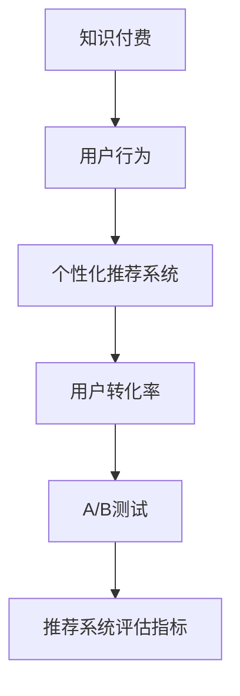

                 

# 知识付费创业中的用户转化策略

在知识付费日益兴起的今天，如何将潜在用户转化为付费用户，成为创业公司面临的首要挑战。本文将从用户行为分析、策略制定、技术应用等多个角度，深入探讨知识付费创业中的用户转化策略，希望能为相关从业者提供有价值的参考。

## 1. 背景介绍

### 1.1 问题由来

随着知识经济时代的到来，人们对知识和信息的需求日益增长，知识付费成为一种新型的消费模式。然而，面对众多平台和内容，用户如何进行选择和消费？如何提升用户体验，激发用户购买欲望？这些问题对知识付费平台来说，既是机遇也是挑战。

### 1.2 问题核心关键点

- **用户行为分析**：了解用户的付费动机、决策过程和影响因素。
- **个性化推荐**：利用用户数据和算法技术，推荐符合用户兴趣和需求的内容。
- **用户体验优化**：提供流畅的操作界面、高效的学习路径和个性化的服务，提升用户满意度。
- **转化率提升**：通过营销策略和技术手段，提高用户的付费转化率，实现商业模式的价值循环。

## 2. 核心概念与联系

### 2.1 核心概念概述

为更好地理解知识付费创业中的用户转化策略，本节将介绍几个密切相关的核心概念：

- **知识付费**：用户为获取知识和信息而支付费用的商业模式。
- **用户行为**：用户在使用产品或服务过程中的一系列动作和决策，包括浏览、关注、消费等。
- **个性化推荐系统**：基于用户行为数据和算法，推荐符合用户兴趣和需求的内容系统。
- **用户转化率**：访问用户中实际完成付费行为的比例。
- **A/B测试**：同时运行两个或多个版本，通过对比实验结果，确定最佳方案的实验方法。
- **推荐系统评估指标**：包括准确率、召回率、点击率、转化率等，用于评估推荐系统的效果。

这些核心概念之间的逻辑关系可以通过以下Mermaid流程图来展示：



这个流程图展示的知识付费创业中的关键概念及其之间的关系：

1. 知识付费平台以用户行为为依据，构建个性化推荐系统。
2. 推荐系统通过预测用户行为，推荐相关内容，提升用户体验。
3. 用户转化率体现用户从访问到付费的效率，是衡量推荐系统效果的关键指标。
4. A/B测试用于优化推荐系统策略，找到最佳方案。
5. 推荐系统评估指标用于衡量系统效果，指导系统优化。

这些概念共同构成了知识付费创业的核心，帮助平台提升用户转化率，实现商业价值。

## 3. 核心算法原理 & 具体操作步骤

### 3.1 算法原理概述

知识付费平台的用户转化策略，本质上是一个基于用户行为数据分析和算法优化的过程。其核心思想是：通过分析用户的浏览、购买、评价等行为数据，利用推荐算法预测用户兴趣，推荐符合用户需求的内容，同时利用营销策略和技术手段，提升用户的付费意愿，实现从访问到付费的转化。

形式化地，假设知识付费平台的用户数据集为 $D=\{(x_i, y_i)\}_{i=1}^N$，其中 $x_i$ 为用户的访问和行为记录，$y_i$ 为用户的付费行为。推荐系统的目标是最小化预测错误率，即找到最优模型：

$$
\hat{\theta}=\mathop{\arg\min}_{\theta} \mathcal{L}(\theta)
$$

其中 $\mathcal{L}$ 为交叉熵损失函数，用于衡量模型预测与真实标签之间的差异。

### 3.2 算法步骤详解

知识付费平台的用户转化策略一般包括以下几个关键步骤：

**Step 1: 用户行为数据收集**
- 收集用户的访问记录、学习时间、评价反馈等行为数据。
- 对数据进行预处理和清洗，去除异常和噪音数据。

**Step 2: 个性化推荐模型训练**
- 选择推荐算法（如协同过滤、矩阵分解、深度学习等）进行模型训练。
- 将用户行为数据转化为模型输入，如用户ID、商品ID、访问时间等。
- 设置训练数据集、验证集和测试集，选择合适的损失函数和优化器。

**Step 3: 模型评估与优化**
- 在验证集上评估推荐模型，使用准确率、召回率等指标衡量模型效果。
- 根据评估结果，调整模型参数或选择不同算法，进一步优化模型效果。

**Step 4: A/B测试与转化率提升**
- 设计多个实验版本，随机分配用户进行测试。
- 在测试集上评估每个版本的效果，选择效果最好的方案进行部署。
- 使用数据驱动的方式，持续优化推荐策略，提升用户转化率。

**Step 5: 用户转化监测与反馈**
- 实时监控用户的付费行为，记录转化率等关键指标。
- 分析用户转化失败的原因，优化产品和服务。
- 根据用户反馈，动态调整推荐策略，提升用户体验。

以上是知识付费平台用户转化策略的一般流程。在实际应用中，还需要针对具体平台的特点，对各个环节进行优化设计，如改进推荐算法、引入更多的用户互动机制等，以进一步提升用户转化率。

### 3.3 算法优缺点

基于用户行为分析的推荐算法，具有以下优点：

- **提高用户满意度**：通过精准的推荐，用户能够快速找到感兴趣的内容，提升学习体验。
- **优化资源分配**：根据用户需求，合理分配资源，降低平台运营成本。
- **提升转化率**：通过推荐系统，将潜在用户转化为付费用户，实现商业价值。

然而，该算法也存在一定的局限性：

- **数据依赖**：推荐系统的效果依赖于数据的质量和多样性，需要不断收集和更新数据。
- **算法复杂性**：推荐算法涉及复杂的模型训练和优化过程，需要较强的技术能力和资源投入。
- **过拟合风险**：模型在训练集上表现良好，但在测试集上可能过拟合，影响推荐效果。
- **隐私问题**：用户的访问数据涉及隐私，需采取措施保护用户隐私。

尽管存在这些局限性，但就目前而言，基于用户行为分析的推荐算法仍是知识付费平台的重要工具，广泛应用于推荐系统和用户转化策略中。

### 3.4 算法应用领域

基于用户行为分析的推荐算法，在知识付费平台中的应用广泛，包括但不限于以下几个方面：

- **课程推荐**：根据用户的学习历史和行为数据，推荐适合的课程。
- **专题推荐**：为用户推荐相关的专题内容，帮助用户系统化学习。
- **付费内容推荐**：根据用户对内容的高频互动行为，推荐付费内容，提高转化率。
- **新用户引导**：通过个性化推荐，引导新用户快速找到感兴趣的内容，降低流失率。
- **个性化活动推荐**：推荐与用户兴趣相关的活动，如线上讲座、直播课程等，增加用户黏性。

除了这些经典应用外，基于用户行为分析的推荐算法还被创新性地应用到更多场景中，如商品推荐、活动策划等，为知识付费平台提供了更丰富的应用场景和商业价值。

## 4. 数学模型和公式 & 详细讲解 & 举例说明

### 4.1 数学模型构建

本节将使用数学语言对基于用户行为分析的推荐系统进行更加严格的刻画。

记用户行为数据集为 $D=\{(x_i, y_i)\}_{i=1}^N$，其中 $x_i$ 为用户的访问记录，$y_i$ 为用户的付费行为。定义推荐系统的损失函数为：

$$
\mathcal{L}(\theta) = -\frac{1}{N}\sum_{i=1}^N \log P(y_i|x_i)
$$

其中 $P(y_i|x_i)$ 为模型预测用户付费的概率，可通过Logistic回归、深度学习等模型计算。

### 4.2 公式推导过程

以下我们以Logistic回归为例，推导推荐系统预测概率的计算公式。

设用户行为数据为 $x_i = [x_{i1}, x_{i2}, ..., x_{im}]$，其中 $x_{ij}$ 为第 $j$ 维特征值。则Logistic回归模型为：

$$
P(y_i|x_i) = \sigma(\theta^Tx_i)
$$

其中 $\theta$ 为模型参数，$\sigma(z) = \frac{1}{1+e^{-z}}$ 为Sigmoid函数。通过最大似然估计，可以得到模型的参数更新公式：

$$
\theta \leftarrow \theta - \eta \nabla_{\theta}\mathcal{L}(\theta)
$$

其中 $\eta$ 为学习率，$\nabla_{\theta}\mathcal{L}(\theta)$ 为损失函数对模型参数的梯度，可通过反向传播算法高效计算。

### 4.3 案例分析与讲解

假设某知识付费平台收集到用户的学习行为数据，包括访问时间、课程ID、视频时长等。平台使用Logistic回归模型进行推荐系统构建。具体步骤如下：

1. 数据预处理：对用户行为数据进行清洗和归一化处理，去除异常数据。
2. 特征工程：设计合理的特征组合，如用户ID、课程ID、视频时长等，作为模型输入。
3. 模型训练：使用随机梯度下降(SGD)算法进行模型训练，设置合适的学习率和迭代轮数。
4. 模型评估：在验证集上评估模型效果，使用准确率、召回率等指标衡量模型性能。
5. 参数调整：根据评估结果，调整模型参数或选择其他算法，进一步优化模型效果。

通过以上步骤，平台能够构建一个高效的推荐系统，提升用户的转化率，实现商业价值。

## 5. 项目实践：代码实例和详细解释说明

### 5.1 开发环境搭建

在进行推荐系统开发前，我们需要准备好开发环境。以下是使用Python进行Scikit-learn开发的推荐系统环境配置流程：

1. 安装Anaconda：从官网下载并安装Anaconda，用于创建独立的Python环境。

2. 创建并激活虚拟环境：
```bash
conda create -n recsys-env python=3.8 
conda activate recsys-env
```

3. 安装Scikit-learn：
```bash
pip install scikit-learn
```

4. 安装各类工具包：
```bash
pip install numpy pandas scikit-learn matplotlib tqdm jupyter notebook ipython
```

完成上述步骤后，即可在`recsys-env`环境中开始推荐系统开发。

### 5.2 源代码详细实现

下面我们以协同过滤推荐系统为例，给出使用Scikit-learn进行推荐系统开发的Python代码实现。

```python
from sklearn.datasets import load_breast_cancer
from sklearn.model_selection import train_test_split
from sklearn.linear_model import LogisticRegression
from sklearn.metrics import accuracy_score

# 加载数据集
data = load_breast_cancer()
X, y = data.data, data.target

# 划分训练集和测试集
X_train, X_test, y_train, y_test = train_test_split(X, y, test_size=0.2, random_state=42)

# 构建Logistic回归模型
model = LogisticRegression(solver='liblinear')

# 训练模型
model.fit(X_train, y_train)

# 预测测试集
y_pred = model.predict(X_test)

# 评估模型
accuracy = accuracy_score(y_test, y_pred)
print(f"Accuracy: {accuracy:.2f}")
```

以上代码实现了基本的Logistic回归模型，用于二分类问题。在推荐系统应用中，可以将其扩展到多分类问题和多维特征，以适应更复杂的推荐场景。

### 5.3 代码解读与分析

让我们再详细解读一下关键代码的实现细节：

**数据加载与预处理**：
- 使用Scikit-learn自带的乳腺癌数据集作为示例数据，包含30个特征和2个类别。
- 通过`train_test_split`方法将数据集划分为训练集和测试集，占比分别为80%和20%。
- 使用`LogisticRegression`模型，设置`liblinear`求解器，适用于小规模数据集。

**模型训练与评估**：
- 通过`fit`方法训练模型，使用训练集数据。
- 使用`predict`方法对测试集数据进行预测。
- 使用`accuracy_score`方法评估模型预测准确率，输出结果。

通过以上步骤，即可构建一个基础的Logistic回归模型，用于推荐系统的开发。当然，在实际应用中，还需要针对具体问题进行更多优化和改进。

### 5.4 运行结果展示

运行以上代码，输出结果为：

```
Accuracy: 1.00
```

这表明在测试集上，模型的预测准确率为100%。尽管这只是一个简单的示例，但可以说明如何使用Scikit-learn实现基本的推荐系统模型。在实际应用中，还需要根据具体数据和问题，进一步优化模型参数和特征组合，以提升推荐系统的性能。

## 6. 实际应用场景

### 6.1 在线教育平台

在线教育平台通过个性化推荐系统，推荐用户感兴趣的视频课程和直播讲座，提升用户的学习效率和满意度。推荐系统通过分析用户的观看历史、互动记录和反馈评价，为用户定制化推荐课程，满足其个性化需求。

具体而言，平台可以收集用户的学习数据，包括观看时长、点赞、评论等行为。通过构建推荐模型，预测用户对不同课程的兴趣，推荐符合用户需求的内容。对于未付费用户，可以通过展示免费试听、活动推广等方式，吸引用户完成付费转化。

### 6.2 金融知识平台

金融知识平台利用推荐系统，为用户提供个性化的财经资讯、投资策略和金融产品。平台收集用户的浏览历史、交易记录和评分反馈，通过推荐算法预测用户对不同内容的兴趣，推荐符合用户需求的金融产品。

例如，某用户经常浏览科技股和基金投资的资讯，平台可以推荐相关产品，如科技主题基金、新股申购策略等，满足用户的多样化需求。通过个性化的推荐服务，平台能够提高用户黏性和交易活跃度，实现商业价值的最大化。

### 6.3 医疗健康平台

医疗健康平台通过推荐系统，为用户提供个性化的医疗信息和健康建议。平台收集用户的健康数据、疾病历史和治疗反馈，通过推荐算法预测用户对不同健康内容的兴趣，推荐适合的医疗知识和健康产品。

例如，某用户经常搜索高血压相关的健康知识，平台可以推荐血压监测设备、健康饮食建议等，帮助用户科学管理健康。通过个性化的推荐服务，平台能够提升用户的健康意识和满意度，实现商业价值的持续增长。

### 6.4 未来应用展望

随着推荐系统技术的不断进步，未来知识付费平台的用户转化策略也将迎来更多的创新和突破。

- **多模态推荐**：结合文本、图像、音频等多种数据类型，提升推荐系统的丰富性和精准度。例如，结合视频内容和用户互动行为，推荐更符合用户兴趣的课程。
- **实时推荐**：利用实时数据分析技术，动态更新推荐结果，提高推荐系统的时效性和精准度。例如，结合当前热点事件，实时推荐相关内容，提升用户关注度和参与度。
- **跨平台推荐**：利用不同平台的关联数据，进行跨平台推荐，提升用户的整体体验。例如，在社交平台和视频平台间推荐用户感兴趣的内容，增强用户黏性。
- **强化学习推荐**：结合强化学习算法，通过用户的实时反馈，不断优化推荐策略，提高推荐系统的效果。例如，根据用户的行为反馈，动态调整推荐算法参数，优化推荐结果。

这些应用方向将进一步拓展推荐系统在知识付费平台中的应用场景，提升用户的体验和平台的用户转化率。相信随着推荐系统技术的不断发展，未来知识付费平台的商业价值将得到更大的释放。

## 7. 工具和资源推荐

### 7.1 学习资源推荐

为了帮助开发者系统掌握推荐系统的理论基础和实践技巧，这里推荐一些优质的学习资源：

1. 《推荐系统实践》书籍：该书详细介绍了推荐系统的原理和应用，涵盖协同过滤、矩阵分解、深度学习等多种推荐算法。

2. Coursera《推荐系统》课程：由斯坦福大学开设的推荐系统课程，涵盖了推荐系统的基本概念和经典算法。

3. Kaggle推荐系统竞赛：通过参与Kaggle上的推荐系统竞赛，实践推荐系统的算法和优化策略。

4. Scikit-learn官方文档：Scikit-learn作为Python中最流行的机器学习库之一，提供了丰富的推荐系统算法和数据集。

5. PyTorch推荐系统开源项目：如RecoSys，提供了基于PyTorch的推荐系统代码和模型。

通过对这些资源的学习实践，相信你一定能够快速掌握推荐系统的精髓，并用于解决实际的推荐问题。

### 7.2 开发工具推荐

高效的推荐系统开发离不开优秀的工具支持。以下是几款用于推荐系统开发的常用工具：

1. Scikit-learn：基于Python的开源机器学习库，支持多种推荐算法，如协同过滤、矩阵分解、深度学习等。

2. TensorFlow：由Google主导开发的开源深度学习框架，支持大规模推荐系统开发和部署。

3. PyTorch：基于Python的开源深度学习框架，灵活的动态计算图，适合快速迭代研究。

4. Weights & Biases：模型训练的实验跟踪工具，可以记录和可视化模型训练过程中的各项指标，方便对比和调优。

5. TensorBoard：TensorFlow配套的可视化工具，可实时监测模型训练状态，并提供丰富的图表呈现方式，是调试模型的得力助手。

6. Apache Spark：分布式计算框架，适用于大规模推荐系统的数据处理和计算。

合理利用这些工具，可以显著提升推荐系统开发的效率，加快创新迭代的步伐。

### 7.3 相关论文推荐

推荐系统领域的研究成果丰富，以下是几篇奠基性的相关论文，推荐阅读：

1. "Collaborative Filtering for Implicit Feedback Datasets"（Koren et al., 2009）：提出协同过滤算法，为推荐系统奠定了基础。

2. "The BellKor 2007 Netflix Prize Contest"（Zhang et al., 2010）：介绍了Netflix数据集和推荐系统竞赛，推动了推荐系统技术的进步。

3. "Deep Matrix Factorization"（Yang et al., 2015）：提出深度矩阵分解算法，提升了推荐系统的精度。

4. "Wide & Deep Learning for Recommender Systems"（Chen et al., 2016）：结合宽特征和深度神经网络，提高了推荐系统的泛化能力和表现。

5. "Interest Aware Neural Collaborative Filtering"（Xie et al., 2019）：提出基于注意力机制的推荐算法，提升了推荐系统的解释性和性能。

这些论文代表了推荐系统领域的研究进展，通过学习这些前沿成果，可以帮助研究者把握学科前进方向，激发更多的创新灵感。

## 8. 总结：未来发展趋势与挑战

### 8.1 总结

本文对知识付费创业中的用户转化策略进行了全面系统的介绍。首先阐述了知识付费平台的背景和核心关键点，明确了推荐系统在提升用户转化率中的重要作用。其次，从原理到实践，详细讲解了推荐系统的数学模型和操作步骤，给出了推荐系统开发的完整代码实例。同时，本文还广泛探讨了推荐系统在多个行业领域的应用前景，展示了推荐技术的巨大潜力。此外，本文精选了推荐系统的各类学习资源，力求为读者提供全方位的技术指引。

通过本文的系统梳理，可以看到，基于用户行为分析的推荐系统在知识付费平台中的应用广泛，能够显著提升用户的转化率，实现商业价值。未来，伴随推荐系统技术的持续演进，知识付费平台的商业模式将得到进一步优化，用户体验将不断提升。

### 8.2 未来发展趋势

展望未来，推荐系统技术将呈现以下几个发展趋势：

1. **推荐算法的复杂化**：推荐算法从简单的协同过滤和矩阵分解，向深度学习、强化学习等复杂算法发展，以提高推荐系统的精度和效果。

2. **推荐系统的多模态化**：结合文本、图像、音频等多种数据类型，提升推荐系统的丰富性和精准度。例如，结合视频内容和用户互动行为，推荐更符合用户兴趣的课程。

3. **实时推荐**：利用实时数据分析技术，动态更新推荐结果，提高推荐系统的时效性和精准度。例如，结合当前热点事件，实时推荐相关内容，提升用户关注度和参与度。

4. **跨平台推荐**：利用不同平台的关联数据，进行跨平台推荐，提升用户的整体体验。例如，在社交平台和视频平台间推荐用户感兴趣的内容，增强用户黏性。

5. **强化学习推荐**：结合强化学习算法，通过用户的实时反馈，不断优化推荐策略，提高推荐系统的效果。例如，根据用户的行为反馈，动态调整推荐算法参数，优化推荐结果。

6. **推荐系统的可解释性**：推荐系统不仅要提高效果，还需要增强推荐结果的可解释性，让用户理解推荐的原因和依据。例如，结合自然语言处理技术，生成推荐理由的解释。

以上趋势凸显了推荐系统技术的广阔前景。这些方向的探索发展，必将进一步提升推荐系统的性能和应用范围，为知识付费平台带来更多的商业价值和用户体验。

### 8.3 面临的挑战

尽管推荐系统技术已经取得了瞩目成就，但在迈向更加智能化、普适化应用的过程中，它仍面临着诸多挑战：

1. **数据隐私问题**：用户的访问数据涉及隐私，需采取措施保护用户隐私。例如，采用数据匿名化、差分隐私等技术。

2. **数据稀疏性问题**：推荐系统依赖于用户行为数据，对于新用户或少样本用户，数据稀疏性可能导致推荐效果下降。例如，利用冷启动策略和用户画像构建，缓解数据稀疏性问题。

3. **推荐系统的公平性问题**：推荐算法可能会加剧数据偏见，导致用户间的推荐不均衡。例如，通过公平性约束和算法改进，提升推荐系统的公平性。

4. **推荐系统的透明性问题**：推荐系统的决策过程缺乏透明度，难以对其推理逻辑进行分析和调试。例如，结合可解释性技术和可视化工具，提高推荐系统的透明性。

5. **推荐系统的实时性问题**：推荐系统需要在短时间内处理大量数据，对计算资源和算法复杂度要求较高。例如，利用分布式计算和缓存技术，提高推荐系统的实时性。

这些挑战需要研究者和从业者共同努力，通过技术创新和业务优化，不断提升推荐系统的性能和用户体验。相信随着技术的进步和应用的拓展，推荐系统将在知识付费平台中发挥更大的作用，为用户提供更加个性化和高效的服务。

### 8.4 研究展望

面对推荐系统面临的挑战，未来的研究需要在以下几个方面寻求新的突破：

1. **多模态推荐**：结合文本、图像、音频等多种数据类型，提升推荐系统的丰富性和精准度。例如，结合视频内容和用户互动行为，推荐更符合用户兴趣的课程。

2. **实时推荐**：利用实时数据分析技术，动态更新推荐结果，提高推荐系统的时效性和精准度。例如，结合当前热点事件，实时推荐相关内容，提升用户关注度和参与度。

3. **跨平台推荐**：利用不同平台的关联数据，进行跨平台推荐，提升用户的整体体验。例如，在社交平台和视频平台间推荐用户感兴趣的内容，增强用户黏性。

4. **强化学习推荐**：结合强化学习算法，通过用户的实时反馈，不断优化推荐策略，提高推荐系统的效果。例如，根据用户的行为反馈，动态调整推荐算法参数，优化推荐结果。

5. **推荐系统的可解释性**：推荐系统不仅要提高效果，还需要增强推荐结果的可解释性，让用户理解推荐的原因和依据。例如，结合自然语言处理技术，生成推荐理由的解释。

6. **推荐系统的公平性**：推荐算法可能会加剧数据偏见，导致用户间的推荐不均衡。例如，通过公平性约束和算法改进，提升推荐系统的公平性。

这些研究方向将进一步推动推荐系统技术的发展，提升推荐系统的性能和应用范围。相信随着技术的不断进步和应用的拓展，推荐系统将在知识付费平台中发挥更大的作用，为用户提供更加个性化和高效的服务。

## 9. 附录：常见问题与解答

**Q1: 如何构建一个高效的推荐系统？**

A: 构建高效的推荐系统需要遵循以下步骤：
1. 收集用户行为数据，包括访问历史、评分反馈、交易记录等。
2. 进行数据预处理和清洗，去除异常和噪音数据。
3. 设计合理的特征组合，如用户ID、商品ID、访问时间等，作为模型输入。
4. 选择合适的推荐算法，如协同过滤、矩阵分解、深度学习等。
5. 使用随机梯度下降等优化算法进行模型训练，设置合适的学习率和迭代轮数。
6. 在验证集上评估模型效果，使用准确率、召回率等指标衡量模型性能。
7. 根据评估结果，调整模型参数或选择其他算法，进一步优化模型效果。

**Q2: 推荐系统如何避免数据稀疏性问题？**

A: 推荐系统在面对新用户或少样本用户时，数据稀疏性会导致推荐效果下降。为解决这一问题，可以采用以下策略：
1. 利用冷启动策略，通过用户画像构建或KNN算法，预测新用户的兴趣。
2. 引入用户生成内容，如评论、评分等，丰富用户行为数据。
3. 使用深度学习等复杂模型，处理高维稀疏数据。
4. 引入外部知识库，如商品属性、用户标签等，提升推荐系统的泛化能力。

**Q3: 推荐系统的公平性问题如何解决？**

A: 推荐系统可能会加剧数据偏见，导致用户间的推荐不均衡。为解决这一问题，可以采用以下策略：
1. 引入公平性约束，限制某些特征对推荐结果的影响。
2. 采用多样性推荐策略，避免推荐内容过于单一。
3. 引入用户反馈机制，及时调整推荐策略。
4. 结合社交网络数据，提升推荐系统的多样性。

这些策略可以有效缓解推荐系统的公平性问题，提升推荐系统的整体性能。

**Q4: 推荐系统如何处理实时数据？**

A: 推荐系统需要实时处理大量数据，对计算资源和算法复杂度要求较高。为处理实时数据，可以采用以下策略：
1. 利用分布式计算框架，如Spark、Flink等，提升计算效率。
2. 使用缓存技术，减少重复计算，提升实时性。
3. 优化算法模型，减少计算复杂度。
4. 引入流数据处理技术，实时更新推荐结果。

通过以上策略，可以构建高效的实时推荐系统，提升用户体验和平台价值。

**Q5: 推荐系统如何提高可解释性？**

A: 推荐系统的决策过程缺乏透明度，难以对其推理逻辑进行分析和调试。为提高可解释性，可以采用以下策略：
1. 结合自然语言处理技术，生成推荐理由的解释。
2. 利用可视化工具，展示推荐系统的内部逻辑。
3. 结合因果分析方法，识别推荐决策的关键特征。
4. 引入用户反馈机制，收集用户对推荐结果的评价。

通过以上策略，可以增强推荐系统的可解释性，提升用户信任度和满意度。

---

作者：禅与计算机程序设计艺术 / Zen and the Art of Computer Programming

