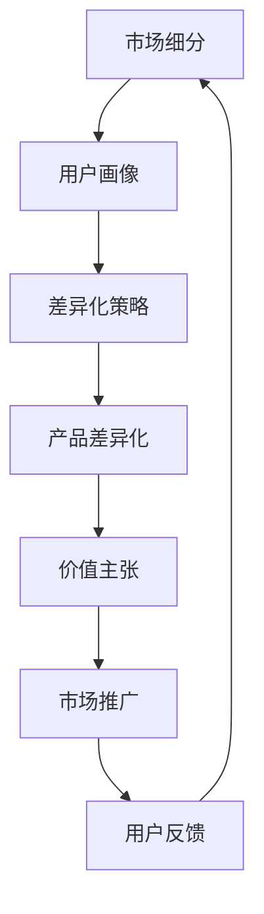

                 

# 知识付费创业的产品差异化策略

## 1. 背景介绍

在知识经济时代，人们获取信息的渠道日益多样化，但高质量、专业化的知识付费内容依旧供不应求。传统的内容付费模式已经无法满足用户日益增长的需求，知识付费创业应运而生。然而，在内容同质化严重、用户获取成本增加的现状下，如何使自己的知识付费产品脱颖而出，成为业内人士面临的重大挑战。

### 1.1 知识付费行业现状

1. **市场竞争加剧**：随着知识付费平台的不断涌现，内容同质化现象日益严重，用户难以在海量内容中识别出有价值的信息。

2. **用户需求多样化**：不同用户对知识内容的需求存在差异，部分用户希望快速获得某一领域的知识，而部分用户更注重系统性的学习和深入的理解。

3. **内容生产成本上升**：高水平知识内容的生产成本较高，专业作者和团队的投入成为决定产品质量的关键因素。

4. **用户转化率下降**：由于用户获取信息的渠道越来越多，付费意愿下降，内容提供商必须提供更具吸引力的产品才能获得用户的青睐。

## 2. 核心概念与联系

### 2.1 核心概念概述

要解决知识付费创业中的差异化问题，首先需要理解以下关键概念：

- **差异化策略（Differentiation Strategy）**：指在竞争激烈的市场中，通过独特的产品或服务特性，使自身产品与竞争对手区分开来，从而获得竞争优势。

- **产品差异化（Product Differentiation）**：指在产品功能、设计、服务等方面进行创新，以满足用户个性化需求，提升用户体验和满意度。

- **市场细分（Market Segmentation）**：指根据用户的不同需求和特征，将市场划分为多个细分市场，针对每个细分市场提供定制化产品。

- **用户画像（User Persona）**：指通过数据分析和调研，构建不同用户群体的详细画像，更好地理解用户需求。

- **价值主张（Value Proposition）**：指产品或服务能为用户带来什么价值，是差异化策略的核心。

这些概念之间存在内在联系，产品差异化策略的实施需基于对市场细分的洞察，通过构建精准的用户画像，明确价值主张，从而制定差异化的产品策略。

### 2.2 核心概念原理和架构的 Mermaid 流程图



在图中，市场细分（A）通过分析用户需求和市场分布，为后续用户画像（B）的构建提供基础。用户画像（B）的构建进一步细化用户特征和需求，为差异化策略（C）的制定提供依据。差异化策略（C）指导产品差异化（D）的设计与实施。价值主张（E）是产品差异化的核心，其能否吸引用户并转化为实际行动是检验差异化策略成败的关键。市场推广（F）作为营销手段，结合用户反馈（G）进行迭代优化，确保产品能够持续满足用户需求。

## 3. 核心算法原理 & 具体操作步骤

### 3.1 算法原理概述

知识付费创业的产品差异化策略，本质上是一种基于市场细分和用户画像的差异化分析方法。该方法的核心在于通过用户画像和细分市场，识别出目标用户群体的独特需求，并以此为依据进行产品设计和服务优化。

形式化地，假设目标市场为 $M$，用户群体为 $U$，需求集为 $D$，细分市场为 $S=\{S_i\}_{i=1}^n$。用户画像为 $P$，产品差异化策略为 $T$，价值主张为 $V$。则产品差异化的目标函数可以表示为：

$$
\max_{T,V} \sum_{i=1}^n \sum_{d \in D_i} \left[ P_i \times T(V) \times C_i \right]
$$

其中 $C_i$ 为细分市场 $S_i$ 的市场规模，$P_i$ 为用户画像 $P$ 与细分市场 $S_i$ 的匹配度。$T(V)$ 为产品差异化策略 $T$ 在价值主张 $V$ 下的实现效果。

### 3.2 算法步骤详解

具体步骤如下：

**Step 1: 数据收集与预处理**
- 收集市场和用户数据，包括市场规模、用户行为、偏好、需求等。
- 对数据进行清洗、去重、归一化等预处理，为后续分析奠定基础。

**Step 2: 市场细分与用户画像构建**
- 使用聚类算法、决策树等机器学习技术，对用户数据进行市场细分，划分出不同细分市场。
- 针对每个细分市场，构建用户画像，包括用户的人口统计特征、行为特征、需求特征等。

**Step 3: 差异化策略制定**
- 根据用户画像和细分市场，识别出用户需求中的差异点，确定价值主张。
- 设计产品差异化策略，如引入新功能、改进用户体验、提供定制服务等。

**Step 4: 产品设计与优化**
- 基于差异化策略，进行产品设计，包括功能模块、界面设计、用户体验等。
- 进行产品测试和迭代优化，确保产品能够满足用户需求。

**Step 5: 市场推广与反馈收集**
- 制定市场推广策略，通过广告、社交媒体、口碑营销等手段，推广产品。
- 收集用户反馈，进行数据分析和用户行为监测，进一步优化产品。

**Step 6: 持续迭代与改进**
- 定期更新用户画像和细分市场分析，保持对市场动态的敏锐洞察。
- 根据市场反馈和用户需求，持续迭代和改进产品。

### 3.3 算法优缺点

知识付费创业产品差异化策略的优点在于：
1. **精准定位**：通过市场细分和用户画像，能够更精准地识别目标用户需求，提高产品设计的针对性。
2. **个性化服务**：能够提供符合用户个性化需求的产品和服务，提升用户满意度和忠诚度。
3. **竞争优势**：通过差异化策略，使产品与竞争对手区分开来，获取市场竞争优势。

缺点包括：
1. **数据需求高**：构建精准的用户画像和细分市场需要大量高质量数据，数据收集和处理成本较高。
2. **市场变化快**：市场需求变化迅速，用户画像和市场细分需要不断更新，持续投入。
3. **技术门槛高**：数据预处理、市场细分等技术要求较高，需要专业的团队进行支持。
4. **成本高**：产品设计和优化过程中，需要不断进行测试和迭代，成本较高。

### 3.4 算法应用领域

知识付费创业的产品差异化策略，适用于以下领域：

- **教育培训**：根据用户学习需求和学科特点，设计个性化课程和学习资源，提供定制化服务。
- **职业技能培训**：针对不同职业领域，提供专业技能培训和案例分析，满足用户职业技能提升需求。
- **健康与健身**：根据用户健康状态和运动习惯，提供定制化的健康饮食、运动计划和心理健康支持。
- **财经与投资**：提供深度财经分析和投资策略，帮助用户获取投资知识，优化投资组合。
- **科技与创新**：提供前沿科技资讯、技术培训和项目孵化支持，帮助创业者加速技术转化。
- **文化和艺术**：提供文化鉴赏、艺术创作和市场推广支持，帮助艺术家和创作者实现作品价值最大化。

## 4. 数学模型和公式 & 详细讲解 & 举例说明

### 4.1 数学模型构建

假设市场规模为 $M$，用户需求集为 $D$，细分市场为 $S=\{S_i\}_{i=1}^n$，用户画像为 $P$。价值主张为 $V$，产品差异化策略为 $T$。

市场细分的目标函数可以表示为：

$$
\max_{S} \sum_{i=1}^n \left[ P_i \times C_i \right]
$$

其中 $C_i$ 为细分市场 $S_i$ 的市场规模，$P_i$ 为用户画像 $P$ 与细分市场 $S_i$ 的匹配度。

### 4.2 公式推导过程

以教育培训市场为例，进行详细推导：

假设用户需求集为 $\{D_1, D_2, D_3\}$，分别代表不同学科和课程内容。细分市场为 $S_1$ 和 $S_2$，分别代表高中和大学。用户画像 $P$ 定义为“希望快速掌握基础知识，提高学习效率”。价值主张 $V$ 为“高效学习路径设计”，产品差异化策略 $T$ 为“个性化学习资源推荐”。

根据市场细分和用户画像，计算每个细分市场的需求匹配度：

$$
P_{S_1} = 0.6 \quad \text{(高中生需求匹配度为0.6)}
$$
$$
P_{S_2} = 0.4 \quad \text{(大学生需求匹配度为0.4)}
$$

计算市场规模：

$$
C_{S_1} = 50000 \quad \text{(高中市场需求规模为50000)}
$$
$$
C_{S_2} = 100000 \quad \text{(大学市场需求规模为100000)}
$$

带入目标函数计算：

$$
\max_{T,V} \left[ 0.6 \times 50000 \times T(V) \times C_1 + 0.4 \times 100000 \times T(V) \times C_2 \right]
$$

### 4.3 案例分析与讲解

考虑一个在线教育平台，通过市场细分和用户画像，发现以下情况：

1. **市场细分**：高中和大学学生对知识付费产品有不同的需求，高中学生更注重基础知识的掌握，而大学生则更希望通过定制化的课程进行职业技能提升。
2. **用户画像**：高中学生更偏向于基础课程和快速学习，大学生则更需要深度课程和项目实践。
3. **产品差异化**：为高中学生设计基础课程和在线测验，为大学生提供专业项目和实践机会。

通过构建精准的用户画像和市场细分，制定差异化策略，可以满足不同用户群体的需求，提升用户满意度和平台竞争力。

## 5. 项目实践：代码实例和详细解释说明

### 5.1 开发环境搭建

进行知识付费创业的产品差异化策略分析，需要搭建一个数据驱动的开发环境。以下是一个使用Python和相关库进行数据预处理和市场细分的示例：

1. 安装Python环境，并使用Anaconda进行管理：
```bash
conda create -n py36 python=3.6
conda activate py36
```

2. 安装相关数据处理和机器学习库：
```bash
conda install pandas numpy scikit-learn
```

3. 收集数据并进行预处理，例如使用Pandas进行数据清洗和归一化：
```python
import pandas as pd

# 读取数据
df = pd.read_csv('user_data.csv')

# 数据清洗
df.dropna(inplace=True)

# 数据归一化
from sklearn.preprocessing import StandardScaler
scaler = StandardScaler()
df[['age', 'income']] = scaler.fit_transform(df[['age', 'income']])
```

4. 使用K-means算法进行市场细分：
```python
from sklearn.cluster import KMeans

# 定义聚类数量
k = 5

# 进行聚类
kmeans = KMeans(n_clusters=k)
kmeans.fit(df[['age', 'income']])

# 输出聚类结果
df['segment'] = kmeans.labels_
```

### 5.2 源代码详细实现

以下是一个基于Pandas和Scikit-learn的代码示例，用于构建用户画像和市场细分：

```python
import pandas as pd
from sklearn.cluster import KMeans

# 读取数据
df = pd.read_csv('user_data.csv')

# 数据清洗
df.dropna(inplace=True)

# 数据归一化
from sklearn.preprocessing import StandardScaler
scaler = StandardScaler()
df[['age', 'income']] = scaler.fit_transform(df[['age', 'income']])

# 进行聚类
kmeans = KMeans(n_clusters=5)
kmeans.fit(df[['age', 'income']])

# 输出聚类结果
df['segment'] = kmeans.labels_
```

### 5.3 代码解读与分析

代码中，首先使用Pandas读取用户数据，并进行数据清洗和归一化。接着，使用Scikit-learn的K-means算法进行市场细分，得到不同用户群体的聚类标签。通过构建用户画像和细分市场，可以为后续的差异化策略制定提供数据支持。

## 6. 实际应用场景

### 6.1 教育培训

在线教育平台可以根据用户的学习背景、兴趣爱好和需求，提供个性化的学习资源和课程推荐。通过市场细分和用户画像，可以设计针对性的学习路径和课程内容，提高学习效果和用户满意度。例如，对于希望提高编程技能的大学生，可以提供高级编程课程和在线项目实践，而对于希望快速掌握基础知识的高中生，则可以提供基础编程课程和在线测验。

### 6.2 职业技能培训

职业技能培训平台可以根据用户职业背景和技能需求，提供定制化的培训课程和项目实践。通过市场细分和用户画像，可以设计针对性的培训方案，帮助用户提升职业技能，增强市场竞争力。例如，针对不同行业的工程师，可以提供专业技能培训和案例分析，提高解决实际问题的能力。

### 6.3 健康与健身

健康与健身平台可以根据用户的健康状态和生活习惯，提供个性化的健康饮食和运动计划。通过市场细分和用户画像，可以设计符合用户需求的健康方案，提升用户健康水平和生活质量。例如，对于希望减重的用户，可以提供饮食计划和运动建议，而对于希望提高体能的用户，则可以提供高强度训练和营养补充方案。

### 6.4 财经与投资

财经与投资平台可以根据用户的财务状况和投资需求，提供个性化的投资建议和风险管理方案。通过市场细分和用户画像，可以设计符合用户需求的投资方案，提升用户投资收益和风险管理能力。例如，针对不同风险偏好的用户，可以提供不同的投资组合和风险控制策略。

### 6.5 科技与创新

科技与创新平台可以根据用户的技术背景和创新需求，提供个性化的技术培训和项目孵化支持。通过市场细分和用户画像，可以设计针对性的技术培训方案，帮助用户加速技术转化和创新成果。例如，对于希望进入人工智能领域的用户，可以提供深度学习、自然语言处理等技术培训，而对于希望实现技术创新的用户，则可以提供项目孵化和资源支持。

### 6.6 文化和艺术

文化和艺术平台可以根据用户的艺术背景和创作需求，提供个性化的艺术鉴赏和创作支持。通过市场细分和用户画像，可以设计符合用户需求的创作方案，提升用户艺术鉴赏和创作能力。例如，对于希望提升绘画技巧的用户，可以提供艺术鉴赏课程和创作指导，而对于希望进入音乐创作领域的用户，则可以提供作曲技巧和乐理知识培训。

## 7. 工具和资源推荐

### 7.1 学习资源推荐

为了帮助创业者掌握产品差异化策略，以下是一些推荐的学习资源：

1. **《差异化策略》系列博文**：深度剖析知识付费创业中的差异化策略，涵盖市场细分、用户画像、产品设计等多个方面。

2. **《用户画像构建与分析》课程**：介绍用户画像的构建方法和分析工具，提升用户画像的准确性和实用性。

3. **《市场细分与产品设计》书籍**：详细讲解市场细分和产品设计的理论基础和实践技巧，为创业者提供系统的学习路径。

4. **Coursera和edX平台**：提供大量相关的在线课程和培训，帮助创业者系统掌握市场细分和用户画像等核心技能。

### 7.2 开发工具推荐

以下是几款用于知识付费创业的产品差异化策略分析工具：

1. **Pandas和Scikit-learn**：数据处理和机器学习库，适用于数据预处理和市场细分分析。

2. **K-means和KNN**：聚类和近邻算法，用于市场细分和用户画像构建。

3. **Google Analytics**：数据分析和用户行为监测工具，提供用户行为洞察和市场趋势分析。

4. **Tableau**：数据可视化工具，帮助创业者直观展示市场细分和用户画像分析结果。

### 7.3 相关论文推荐

以下是几篇奠基性的相关论文，推荐阅读：

1. **“市场细分与用户画像分析”**：介绍市场细分和用户画像的构建方法和应用案例，为创业者提供理论支撑。

2. **“产品差异化策略设计”**：探讨产品差异化策略的设计思路和实施方法，提升创业者的市场竞争力。

3. **“用户行为分析与预测”**：基于用户行为数据，分析用户需求和行为特征，指导产品设计和市场推广。

4. **“大数据在市场细分中的应用”**：介绍大数据技术在市场细分和用户画像分析中的应用，提升数据处理的效率和准确性。

## 8. 总结：未来发展趋势与挑战

### 8.1 总结

本文对知识付费创业的产品差异化策略进行了全面系统的介绍。首先阐述了知识付费行业现状和差异化策略的必要性，明确了产品差异化策略在提升市场竞争力和用户满意度方面的重要作用。其次，从数据收集与预处理、市场细分与用户画像构建、差异化策略制定、产品设计与优化、市场推广与反馈收集等多个环节，详细讲解了产品差异化策略的实现步骤和具体方法。最后，通过实际应用场景和工具资源推荐，展示了产品差异化策略在知识付费创业中的广阔应用前景。

### 8.2 未来发展趋势

知识付费创业的产品差异化策略，在未来将呈现以下几个发展趋势：

1. **数据驱动**：随着大数据和人工智能技术的发展，用户数据的获取和分析将更加精准和全面，市场细分和用户画像的构建将更加科学。

2. **个性化服务**：通过深度学习和大数据分析，个性化服务将更加精准和高效，用户满意度将得到进一步提升。

3. **市场细分多元化**：随着市场细分的不断细化，不同细分市场的需求将更加多元化，产品和服务的设计将更加多样化。

4. **技术融合**：结合区块链、云计算、物联网等新兴技术，提升市场细分和用户画像分析的效率和安全性，实现数据的更高效利用。

### 8.3 面临的挑战

尽管产品差异化策略在知识付费创业中具有重要意义，但在实施过程中仍面临诸多挑战：

1. **数据获取困难**：用户数据的获取和处理成本较高，数据质量和数据隐私问题需引起重视。

2. **市场变化快**：市场环境变化迅速，用户需求快速变化，市场细分和用户画像的更新需及时响应。

3. **技术门槛高**：数据分析和机器学习技术要求较高，需要专业的技术团队进行支持和维护。

4. **成本高**：市场细分和产品设计的持续优化和迭代需大量资源投入，成本较高。

### 8.4 研究展望

未来的研究应在以下几个方面进行探索：

1. **数据驱动的细分市场分析**：结合机器学习和大数据技术，提升市场细分的准确性和实用性。

2. **用户画像的多维构建**：引入多种数据源，构建多维度的用户画像，更全面地理解用户需求。

3. **跨领域的数据融合**：结合不同领域的数据，进行跨领域的市场细分和用户画像分析，提升产品设计的全面性。

4. **用户反馈的动态调整**：通过用户反馈进行动态调整，持续优化产品设计和市场策略。

5. **技术融合与创新**：结合新兴技术，进行产品差异化策略的创新和优化，提升市场竞争力。

6. **伦理与安全**：在数据收集和分析过程中，注重数据隐私和伦理安全问题，确保用户数据的安全和隐私保护。

通过在以上几个方面进行深入研究，相信知识付费创业的产品差异化策略将更加科学和高效，为创业者提供更具竞争力的解决方案，推动知识付费产业的持续发展。

## 9. 附录：常见问题与解答

**Q1：如何构建精准的用户画像？**

A: 构建精准的用户画像，需要从多个维度收集用户数据，包括基本信息、行为数据、偏好数据等。具体步骤如下：

1. **基本信息收集**：通过问卷调查、用户注册信息等途径，收集用户的年龄、性别、职业、教育背景等基本信息。

2. **行为数据收集**：通过用户互动数据、网站浏览数据等，收集用户的点击行为、购买行为、使用频率等行为数据。

3. **偏好数据收集**：通过用户反馈、评论等途径，收集用户的偏好数据，如喜欢的内容类型、推荐内容等。

4. **数据清洗和处理**：对收集的数据进行清洗、去重、归一化等预处理，确保数据的准确性和一致性。

5. **多维度分析**：结合机器学习算法，如聚类算法、关联规则算法等，对数据进行多维度分析，构建用户画像。

**Q2：如何优化产品差异化策略？**

A: 产品差异化策略的优化需要从多个环节进行：

1. **用户需求分析**：通过市场调研和用户反馈，深入了解用户需求和痛点，制定针对性的产品策略。

2. **市场细分优化**：通过持续的市场调研和数据分析，不断优化市场细分，确保细分市场的准确性和适用性。

3. **产品设计优化**：结合用户画像和市场细分，不断优化产品设计，提升产品功能和用户体验。

4. **市场推广优化**：结合用户画像和市场细分，设计精准的市场推广策略，提高用户转化率和用户满意度。

5. **用户反馈收集**：通过用户反馈和行为监测，持续优化产品设计和市场策略，确保产品的持续改进和创新。

**Q3：如何平衡个性化和规模化？**

A: 在知识付费创业中，平衡个性化和规模化是关键。具体方法包括：

1. **个性化推荐系统**：结合用户画像和行为数据，设计个性化推荐系统，提升用户满意度和粘性。

2. **用户分群管理**：通过用户画像和市场细分，将用户分成不同群体，针对不同群体设计差异化服务。

3. **标准化流程**：在个性化服务的基础上，设计标准化的流程和规范，确保服务的质量和一致性。

4. **资源共享**：在个性化服务的基础上，进行资源的共享和复用，提升资源利用效率。

5. **技术融合**：结合新兴技术，如人工智能、大数据等，进行产品创新和优化，提升个性化服务的效率和质量。

通过以上方法，可以在保证个性化服务的同时，提升规模化效率，实现高质量的知识付费产品。

**Q4：如何应对市场变化和竞争？**

A: 应对市场变化和竞争，需要从多个方面进行：

1. **持续市场调研**：通过持续的市场调研，及时掌握市场动态和用户需求变化，调整市场策略。

2. **灵活市场细分**：根据市场变化，及时调整市场细分策略，确保市场细分的准确性和适用性。

3. **快速迭代和优化**：根据用户反馈和市场变化，快速迭代和优化产品，确保产品竞争力。

4. **多元化市场策略**：结合不同市场特点，设计多元化的市场策略，提升市场覆盖面和竞争力。

5. **品牌建设**：通过品牌建设和市场推广，提升品牌影响力和用户忠诚度，增强市场竞争力。

通过以上方法，可以在市场变化和竞争中保持灵活性和竞争力，持续推动知识付费产品的创新和发展。

---

作者：禅与计算机程序设计艺术 / Zen and the Art of Computer Programming

