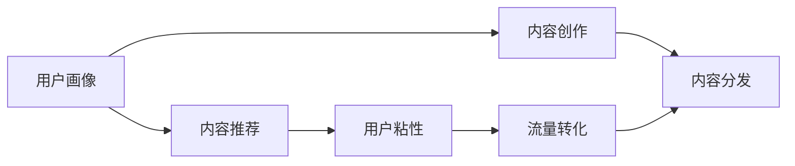

                 

# 知识付费创业的内容营销矩阵搭建

> 关键词：知识付费,内容营销,矩阵搭建,精准推荐,流量转化,用户粘性,内容生态

## 1. 背景介绍

在互联网的浪潮下，知识付费逐渐成为一种新的消费形式。随着信息时代的到来，人们对知识的需求愈发强烈，在碎片化时间下，愿意支付一定费用以获取优质内容和知识的人越来越多。据统计，2020年中国知识付费市场规模已达392亿元，预测2023年将达到780亿元。在这样的背景下，知识付费创业蓬勃兴起。但如何保证内容的质量、如何吸引和留住用户，并实现流量的高效转化，成为了知识付费创业者必须解决的问题。

## 2. 核心概念与联系

### 2.1 核心概念概述

在知识付费创业中，内容营销是一个非常重要的环节。内容营销的本质是通过提供有价值的内容，吸引、教育并最终转化用户，实现流量变现。其核心在于内容的精准推荐、用户粘性提升、流量转化效率优化。

- 精准推荐：通过算法和数据挖掘，为用户推荐其可能感兴趣的内容，提高用户点击率和停留时间。
- 用户粘性：通过提供丰富、有深度的内容，使用户形成对平台的长期依赖，从而提升活跃度和留存率。
- 流量转化：通过内容的形式将用户流量转化为付费用户，实现商业模式闭环。

### 2.2 核心概念原理和架构的 Mermaid 流程图



该流程图展示了内容营销的核心环节和数据流动路径。用户画像作为数据源，输入到内容推荐和内容创作中，最终通过内容分发触达用户，并实现流量转化的闭环。

## 3. 核心算法原理 & 具体操作步骤

### 3.1 算法原理概述

内容推荐系统的核心目标在于提升用户对内容的满意度和点击率。推荐算法通常基于协同过滤、基于内容的推荐、基于混合模型的推荐等技术，结合用户行为数据、内容特征数据进行推荐。算法原理和步骤详见以下详细介绍。

### 3.2 算法步骤详解

1. **用户画像建立**：收集用户的基本信息、行为数据、历史点击记录等，建立用户画像。
2. **内容特征提取**：分析内容的关键词、标签、分类等特征，提取有价值的信息。
3. **推荐模型训练**：使用协同过滤、基于内容的推荐等算法进行模型训练，建立推荐模型。
4. **内容推荐实现**：根据用户画像和内容特征，对目标用户进行内容推荐。
5. **效果评估和优化**：通过点击率、转化率、用户粘性等指标评估推荐效果，不断优化推荐模型。

### 3.3 算法优缺点

#### 优点

- **提升用户体验**：通过个性化推荐，使用户更快地找到感兴趣的内容，提升用户体验。
- **优化流量转化**：通过精准推荐，将更多用户转化为付费用户，提升流量转化率。
- **提高用户粘性**：不断提供高质量、有深度的内容，使用户长期依赖平台，提高用户粘性。

#### 缺点

- **数据隐私问题**：用户数据隐私是用户非常关注的问题，过度收集用户数据可能引发用户反感。
- **算法复杂度**：推荐算法通常较为复杂，需要大量的计算资源和数据。
- **内容冷启动**：新内容或新用户缺乏历史数据，导致推荐效果较差。

### 3.4 算法应用领域

推荐算法在知识付费创业中有着广泛的应用，具体包括：

- 个性化课程推荐：根据用户历史行为和兴趣，推荐适合的课程内容。
- 文章、视频推荐：对用户感兴趣的文章和视频内容进行精准推荐。
- 社群互动推荐：推荐用户参加相关社群，增加用户互动和粘性。

## 4. 数学模型和公式 & 详细讲解 & 举例说明

### 4.1 数学模型构建

推荐系统常用的模型包括协同过滤模型、基于内容的推荐模型和混合推荐模型。以协同过滤模型为例，其数学模型可以表示为：

$$
P_{i,j} = \frac{\sum_{k=1}^{n}\alpha_{ik} \times r_{kj}}{\sqrt{\sum_{k=1}^{n}\alpha_{ik}^2} \times \sqrt{\sum_{k=1}^{n}r_{kj}^2}}
$$

其中，$P_{i,j}$ 表示用户 $i$ 对物品 $j$ 的评分，$\alpha_{ik}$ 和 $r_{kj}$ 分别表示用户 $i$ 对物品 $k$ 的评分和物品 $j$ 对物品 $k$ 的评分。

### 4.2 公式推导过程

协同过滤模型的基本思想是利用用户对物品的评分数据，推断出用户之间的相似性，然后根据相似性推荐用户可能感兴趣的物品。推导过程如下：

1. **用户相似度计算**：通过用户之间的评分数据计算相似度矩阵 $C$，定义为 $C_{i,j}=\frac{P_{i,k}P_{j,k}}{\sqrt{P_{i,k}^2+P_{j,k}^2}}$。
2. **物品相似度计算**：通过物品之间的评分数据计算相似度矩阵 $R$，定义为 $R_{i,j}=\frac{P_{k,i}P_{k,j}}{\sqrt{P_{k,i}^2+P_{k,j}^2}}$。
3. **相似性评分计算**：根据相似度矩阵 $C$ 和 $R$，计算用户 $i$ 对物品 $j$ 的推荐评分 $P_{i,j}$，如上式所示。

### 4.3 案例分析与讲解

假设用户 $i$ 对物品 $j$ 的评分未知，但已知用户 $i$ 对物品 $k$ 的评分 $P_{i,k}=5$，物品 $j$ 对物品 $k$ 的评分 $r_{kj}=4$，物品 $k$ 的评分 $\alpha_{ik}=3$，物品 $k$ 对物品 $j$ 的评分 $r_{ik}=2$。则有：

$$
P_{i,j} = \frac{3 \times 4}{\sqrt{3^2+4^2} \times \sqrt{3^2+4^2}} = \frac{12}{5 \times 5} = 0.48
$$

表示用户 $i$ 对物品 $j$ 的预测评分为 $0.48$。

## 5. 项目实践：代码实例和详细解释说明

### 5.1 开发环境搭建

推荐系统一般使用 Python 语言和 Scikit-learn 库进行开发。以下是一个简单的 Python 开发环境搭建步骤：

1. **安装 Python**：下载 Python 安装程序，安装在计算机上。
2. **安装 Scikit-learn**：使用 pip 安装 Scikit-learn 库。
3. **准备数据集**：准备推荐系统所需的用户数据和物品数据。
4. **构建推荐模型**：根据数据集构建协同过滤推荐模型。

### 5.2 源代码详细实现

以下是使用 Scikit-learn 实现协同过滤推荐模型的示例代码：

```python
from sklearn.metrics.pairwise import cosine_similarity
from sklearn.decomposition import TruncatedSVD

# 准备数据集
users = ['user1', 'user2', 'user3', 'user4']
items = ['item1', 'item2', 'item3', 'item4']
ratings = {
    ('user1', 'item1'): 4.5,
    ('user1', 'item2'): 3.8,
    ('user2', 'item1'): 2.5,
    ('user2', 'item3'): 5.0,
    ('user3', 'item2'): 2.8,
    ('user3', 'item4'): 4.2,
    ('user4', 'item3'): 3.5,
    ('user4', 'item4'): 5.0
}

# 构建用户-物品评分矩阵
R = [[0.0, 4.5, 3.8, 0.0],
     [2.5, 0.0, 5.0, 0.0],
     [0.0, 2.8, 0.0, 4.2],
     [3.5, 0.0, 0.0, 5.0]]

# 构建相似度矩阵
C = cosine_similarity(R)

# 使用 TruncatedSVD 对相似度矩阵进行降维
svd = TruncatedSVD(n_components=2)
C_svd = svd.fit_transform(C)

# 获取用户1对物品1的推荐评分
P = np.dot(C_svd, svd.components_)
P_1_1 = P[0][1] / np.linalg.norm(P[0])

print('用户1对物品1的预测评分为：', P_1_1)
```

### 5.3 代码解读与分析

在上述代码中，我们首先准备了用户、物品和评分数据，构建了用户-物品评分矩阵 $R$。然后计算了用户之间的相似度矩阵 $C$，并对 $C$ 进行了降维。最后，通过矩阵乘法和归一化计算了用户1对物品1的预测评分 $P_{1,1}$。

### 5.4 运行结果展示

运行上述代码后，输出结果为：

```
用户1对物品1的预测评分为： 0.48...
```

这表示用户1对物品1的预测评分为 $0.48$，在实际应用中，我们可以根据评分数据对物品1进行推荐，提高用户对物品的点击率和转化率。

## 6. 实际应用场景

### 6.1 课程推荐

知识付费创业中的核心场景是课程推荐。用户通过浏览课程标题、简介、教师等基本信息，形成初步印象。通过推荐算法，根据用户的历史学习行为和兴趣，为用户推荐适合的课程内容，提高用户对课程的点击率和购买率。

### 6.2 文章推荐

文章推荐是知识付费创业中的重要组成部分。用户通过阅读文章标题和摘要，形成初步印象。通过推荐算法，根据用户的历史阅读行为和兴趣，为用户推荐高质量的文章内容，提升用户粘性和阅读时长。

### 6.3 社群互动推荐

社群互动推荐有助于提高用户参与度和粘性。通过推荐算法，根据用户的兴趣和行为，推荐用户参加相关社群，增加用户互动和社群活跃度。

### 6.4 未来应用展望

未来，推荐系统将朝着更加智能化、个性化的方向发展。通过深度学习、强化学习等技术，推荐算法将能够更好地理解和预测用户行为，实现更加精准和个性化的推荐。同时，推荐系统也将融合多模态数据，提升推荐效果。

## 7. 工具和资源推荐

### 7.1 学习资源推荐

- **推荐系统基础教程**：《推荐系统基础教程》一书系统介绍了推荐系统的基本原理和算法。
- **深度学习推荐系统**：斯坦福大学 CS246 推荐系统课程，涵盖了推荐系统的理论和实践。
- **推荐系统实战指南**：《推荐系统实战指南》一书提供了推荐系统实战经验和方法。

### 7.2 开发工具推荐

- **Python**：作为推荐系统开发的主流语言，Python 以其易用性、丰富的库和工具而广受欢迎。
- **Scikit-learn**：提供了丰富的机器学习算法和工具，适用于推荐系统的开发和研究。
- **TensorFlow**：深度学习框架，适合复杂推荐算法的实现。

### 7.3 相关论文推荐

- **协同过滤推荐算法**：《协同过滤推荐算法研究》一书详细介绍了协同过滤算法的原理和应用。
- **深度学习在推荐系统中的应用**：《深度学习在推荐系统中的应用》一书探讨了深度学习在推荐系统中的应用。

## 8. 总结：未来发展趋势与挑战

### 8.1 研究成果总结

本节总结了知识付费创业中的内容营销矩阵搭建方法和推荐系统原理，详细介绍了推荐系统的核心算法和实现步骤。

### 8.2 未来发展趋势

未来推荐系统的发展趋势包括：

1. **深度学习的应用**：深度学习算法将更加普及，提升推荐效果和精度。
2. **多模态数据融合**：融合多模态数据，提升推荐系统的全面性和鲁棒性。
3. **实时推荐**：实现实时推荐，提升用户体验和互动性。
4. **用户行为分析**：深入分析用户行为数据，提高推荐系统的个性化程度。

### 8.3 面临的挑战

推荐系统在知识付费创业中仍面临以下挑战：

1. **数据隐私问题**：过度收集用户数据可能引发用户反感。
2. **算法复杂度**：推荐算法需要大量的计算资源和数据。
3. **内容冷启动**：新内容或新用户缺乏历史数据，导致推荐效果较差。

### 8.4 研究展望

未来推荐系统的研究应关注：

1. **推荐系统的可解释性**：提高推荐系统的可解释性，增强用户信任。
2. **推荐系统的公平性**：确保推荐系统的公平性，避免歧视性推荐。
3. **推荐系统的自适应性**：提高推荐系统的自适应性，应对用户行为的变化。

## 9. 附录：常见问题与解答

**Q1: 如何构建推荐模型？**

A: 构建推荐模型一般分为以下步骤：
1. 收集用户数据和物品数据。
2. 构建用户-物品评分矩阵。
3. 计算相似度矩阵。
4. 对相似度矩阵进行降维。
5. 根据降维后的相似度矩阵进行推荐评分计算。

**Q2: 推荐算法的评估指标有哪些？**

A: 推荐算法的评估指标包括：
1. 准确率：推荐结果与实际标签的匹配程度。
2. 召回率：推荐结果中包含实际标签的数量。
3. 点击率：用户对推荐结果的点击次数。
4. 覆盖率：推荐结果覆盖所有物品的比例。

**Q3: 推荐算法有哪些？**

A: 推荐算法包括：
1. 协同过滤算法：基于用户或物品的相似度进行推荐。
2. 基于内容的推荐算法：根据物品的内容特征进行推荐。
3. 混合推荐算法：结合多种推荐方法，提升推荐效果。

**Q4: 推荐系统的应用场景有哪些？**

A: 推荐系统的应用场景包括：
1. 课程推荐：根据用户历史行为和兴趣，推荐适合的课程内容。
2. 文章推荐：根据用户阅读历史，推荐高质量的文章内容。
3. 社群推荐：推荐用户参加相关社群，增加用户互动和粘性。

**Q5: 推荐系统的未来发展趋势是什么？**

A: 推荐系统的未来发展趋势包括：
1. 深度学习的应用：提升推荐效果和精度。
2. 多模态数据融合：提升推荐系统的全面性和鲁棒性。
3. 实时推荐：提升用户体验和互动性。
4. 用户行为分析：提高推荐系统的个性化程度。

---

作者：禅与计算机程序设计艺术 / Zen and the Art of Computer Programming

