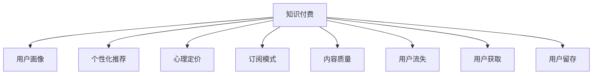

                 

# 知识付费创业的用户价值 Maximization

> 关键词：知识付费,用户价值,用户画像,个性化推荐,心理定价,订阅模式,内容质量,用户流失,用户获取,用户留存,内容创新,市场竞争

## 1. 背景介绍

### 1.1 问题由来
随着互联网技术的迅猛发展和智能设备的普及，知识付费行业已经成为了新的经济增长点。据统计，全球知识付费市场规模正以每年约30%的速度增长。在国内，知识付费也呈现出迅猛增长的态势，各大平台纷纷推出各类付费内容，如在线课程、付费文章、音频读物等，吸引了大量用户。

然而，尽管知识付费市场高速发展，行业内仍存在诸多问题。一方面，由于同质化内容过多，用户难以找到真正满足自己需求的有价值内容。另一方面，平台之间的激烈竞争使得用户忠诚度不足，难以实现长期订阅。如何通过精准的个性化推荐和有效的用户留存策略，提升知识付费平台的用户价值，成为了行业内的一个重要课题。

### 1.2 问题核心关键点
本文聚焦于知识付费创业的用户价值最大化问题，通过深入剖析用户价值的影响因素，提出了基于用户画像、个性化推荐、心理定价、订阅模式优化等多维度的综合解决方案，以期为知识付费平台的运营策略提供更全面的指导。

## 2. 核心概念与联系

### 2.1 核心概念概述

为更好地理解如何通过知识付费创业实现用户价值的最大化，本节将介绍几个关键概念：

- **知识付费**：指用户为获取专业知识和信息而支付费用的商业模式。知识付费平台通过提供有价值的内容，满足用户的学习需求，从而实现盈利。

- **用户价值**：指用户在使用知识付费服务的过程中，所获得的心理满足感和经济回报的综合体现。

- **用户画像**：通过对用户特征和行为数据的分析，构建详尽的用户画像，用于指导个性化推荐和定向营销。

- **个性化推荐**：利用机器学习和数据挖掘技术，根据用户的历史行为和偏好，推荐最适合的内容。

- **心理定价**：结合用户行为数据和心理预期，制定科学合理的价格策略，以提高用户支付意愿和满意度。

- **订阅模式**：通过持续提供高质量内容，吸引用户长期订阅，实现稳定的用户留存。

- **内容质量**：指平台提供内容的深度、广度、新颖性和实用性，是用户满意度和留存率的关键。

- **用户流失**：指用户因各种原因停止使用知识付费服务的现象，是平台运营中需要重点关注的问题。

- **用户获取**：指通过有效的市场推广和用户招募策略，获取新用户，扩大市场份额。

- **用户留存**：指通过提高用户体验和服务质量，保持用户的持续活跃和长期使用。

这些概念之间的逻辑关系可以通过以下Mermaid流程图来展示：



这个流程图展示了知识付费平台中关键概念之间的关系：

1. 知识付费平台通过提供专业内容，满足用户的学习需求。
2. 用户画像、个性化推荐、心理定价等策略，用于提升用户价值。
3. 订阅模式和内容质量是维持用户留存的重要因素。
4. 用户流失、用户获取等环节影响平台的长期发展。

这些概念共同构成了知识付费平台的核心运营逻辑，帮助平台实现用户价值的最大化。

## 3. 核心算法原理 & 具体操作步骤
### 3.1 算法原理概述

知识付费平台的用户价值最大化，可以通过以下核心算法实现：

- **用户画像构建**：通过对用户特征和行为数据的分析，构建详尽的用户画像，用于指导个性化推荐和定向营销。
- **个性化推荐算法**：利用协同过滤、内容推荐、混合推荐等多种算法，根据用户的历史行为和偏好，推荐最适合的内容。
- **心理定价模型**：结合用户行为数据和心理预期，制定科学合理的价格策略，以提高用户支付意愿和满意度。
- **订阅模式优化**：通过持续提供高质量内容，吸引用户长期订阅，实现稳定的用户留存。

### 3.2 算法步骤详解

以下是知识付费平台用户价值最大化的具体操作步骤：

**Step 1: 用户画像构建**
- 收集用户注册信息、浏览历史、购买记录等行为数据。
- 通过聚类和分类算法，对用户进行标签和分群。
- 根据用户画像，进行个性化的内容推荐和定向广告投放。

**Step 2: 个性化推荐算法**
- 使用协同过滤算法，根据用户的历史行为，找到相似用户群体的推荐列表。
- 利用内容推荐算法，根据文章标签、关键词等特征，推荐相关内容。
- 使用混合推荐算法，综合协同过滤和内容推荐的优点，提高推荐效果。

**Step 3: 心理定价模型**
- 分析用户的历史支付记录和行为数据，提取用户的心理定价区间。
- 根据定价区间，制定动态定价策略，如阶梯定价、折扣优惠等。
- 通过A/B测试，验证不同定价策略的效果，持续优化定价策略。

**Step 4: 订阅模式优化**
- 提供高质量的付费内容，定期更新，提升用户订阅意愿。
- 设置多档订阅选项，如免费试用、包月、包年等，满足不同用户的需求。
- 提供定制化订阅服务，如个性化推荐、VIP特权等，增加用户粘性。

### 3.3 算法优缺点

基于用户画像、个性化推荐、心理定价、订阅模式优化的知识付费平台，具有以下优点：

1. 提升用户价值：通过个性化推荐，用户能够更快找到有价值的内容，满足其学习需求。
2. 降低流失率：通过优化订阅模式，提高用户对平台的满意度和忠诚度，降低用户流失率。
3. 提高转化率：通过心理定价策略，提高用户的支付意愿，提升平台的付费转化率。
4. 提升内容质量：通过用户画像和个性化推荐，帮助平台发掘高质量内容，提升整体内容质量。
5. 拓展市场规模：通过有效的用户获取和留存策略，扩大市场份额，提升平台竞争力。

同时，该方法也存在一定的局限性：

1. 数据隐私问题：用户画像和个性化推荐的实现需要大量的用户数据，可能导致数据隐私风险。
2. 技术复杂度高：用户画像和个性化推荐的算法复杂度高，需要投入大量的研发资源。
3. 市场竞争激烈：知识付费行业竞争激烈，平台需要不断创新，才能在市场中立于不败之地。
4. 内容同质化风险：过度依赖个性化推荐可能导致内容同质化，影响用户体验。
5. 用户流失率高：用户流失率仍难以完全避免，需要持续优化运营策略。

尽管存在这些局限性，但就目前而言，基于用户画像、个性化推荐、心理定价、订阅模式优化的知识付费平台策略，仍是最主流、最有效的运营方式。未来相关研究的重点在于如何进一步降低数据隐私风险，提高推荐算法效率，优化订阅模式，同时在内容质量上下功夫，以提高用户价值和平台竞争力。

### 3.4 算法应用领域

知识付费平台的用户价值最大化策略，已经广泛应用于各大知识付费平台，包括得到、喜马拉雅、网易云课堂等。这些平台通过不断优化推荐算法、订阅模式、心理定价策略等，提升用户价值，实现了稳定的用户增长和盈利。

## 4. 数学模型和公式 & 详细讲解 & 举例说明
### 4.1 数学模型构建

本文将使用数学语言对知识付费平台的用户价值最大化方法进行更加严格的刻画。

记知识付费平台的用户数量为 $U=\{u_1, u_2, ..., u_n\}$，其中每个用户 $u_i$ 的历史行为数据为 $D_i=\{x_{i1}, x_{i2}, ..., x_{im}\}$，其中 $x_{ij}$ 表示用户 $u_i$ 在第 $j$ 次访问行为。记用户画像为 $P=\{p_1, p_2, ..., p_m\}$，其中 $p_j$ 表示第 $j$ 个用户画像特征。记用户的历史支付记录为 $R=\{r_{i1}, r_{i2}, ..., r_{im}\}$，其中 $r_{ij}$ 表示用户 $u_i$ 在第 $j$ 次支付记录。

用户价值 $V(u)$ 可以定义为：

$$
V(u) = \alpha \times P(u) + \beta \times \sum_{j=1}^{m} r_{ij}
$$

其中 $\alpha$ 和 $\beta$ 为模型参数，分别表示用户画像和支付记录对用户价值的贡献权重。

### 4.2 公式推导过程

用户画像 $P(u)$ 的构建可以使用聚类算法和分类算法实现。以K-means算法为例，其步骤如下：

1. 随机选择 $K$ 个用户作为初始聚类中心。
2. 将每个用户分配到最近的聚类中心。
3. 重新计算每个聚类的中心。
4. 重复步骤2和3，直至聚类中心不再变化。

设用户 $u_i$ 的聚类标签为 $l_i$，则用户画像 $P(u)$ 可以表示为：

$$
P(u) = \sum_{j=1}^{m} w_{ij} p_j
$$

其中 $w_{ij}$ 为第 $j$ 个用户画像特征 $p_j$ 对用户 $u_i$ 的贡献权重，可以使用softmax函数计算：

$$
w_{ij} = \frac{e^{\sum_{k=1}^{n} d_{kij}}}{\sum_{k=1}^{n} e^{\sum_{k=1}^{n} d_{kij}}}
$$

其中 $d_{kij}$ 表示用户 $u_i$ 在第 $j$ 个用户画像特征 $p_j$ 上与聚类中心 $k$ 的距离。

用户价值 $V(u)$ 的计算公式如下：

$$
V(u) = \alpha \times P(u) + \beta \times \sum_{j=1}^{m} r_{ij}
$$

在得到用户价值公式后，即可使用优化算法（如梯度下降等）来最小化用户价值损失函数，得到最优用户价值 $V^*(u)$。

### 4.3 案例分析与讲解

以喜马拉雅平台为例，分析其用户价值最大化策略。

喜马拉雅平台通过收集用户注册信息、浏览历史、购买记录等数据，使用K-means算法对用户进行聚类。根据用户画像和支付记录，喜马拉雅使用协同过滤和内容推荐算法，为用户推荐个性化的音频内容。通过A/B测试，喜马拉雅不断优化推荐算法和定价策略，提升用户满意度和付费转化率。同时，喜马拉雅提供免费试用和包月订阅服务，满足不同用户的需求。通过这些策略，喜马拉雅实现了稳定的用户增长和盈利。

## 5. 项目实践：代码实例和详细解释说明
### 5.1 开发环境搭建

在进行用户价值最大化实践前，我们需要准备好开发环境。以下是使用Python进行K-means算法和协同过滤推荐算法的环境配置流程：

1. 安装Anaconda：从官网下载并安装Anaconda，用于创建独立的Python环境。

2. 创建并激活虚拟环境：
```bash
conda create -n pytorch-env python=3.8 
conda activate pytorch-env
```

3. 安装PyTorch：根据CUDA版本，从官网获取对应的安装命令。例如：
```bash
conda install pytorch torchvision torchaudio cudatoolkit=11.1 -c pytorch -c conda-forge
```

4. 安装Scikit-learn和Scipy库：
```bash
pip install scikit-learn scipy
```

5. 安装NumPy和Pandas库：
```bash
pip install numpy pandas
```

完成上述步骤后，即可在`pytorch-env`环境中开始用户价值最大化的实践。

### 5.2 源代码详细实现

这里我们以用户画像构建和协同过滤推荐算法为例，给出使用Python和Scikit-learn库的代码实现。

首先，定义用户数据的读取和处理函数：

```python
import pandas as pd
from sklearn.cluster import KMeans
from sklearn.metrics import pairwise_distances_argmin_min

def load_data(file_path):
    df = pd.read_csv(file_path)
    return df

def get_user_distance(user, data):
    distances = pairwise_distances(data, data[[user]], metric='euclidean')
    return distances[0]

def get_user_idx(user, data):
    user_distance = get_user_distance(user, data)
    user_idx, _ = pairwise_distances_argmin_min(user_distance, data[[user]])
    return user_idx

def cluster_data(data, k):
    kmeans = KMeans(n_clusters=k, random_state=0).fit(data)
    return kmeans.labels_

def build_user_profile(user, data, kmeans):
    user_idx = get_user_idx(user, data)
    user_labels = kmeans.labels_[user_idx]
    user_profile = np.zeros((kmeans.n_clusters))
    for i, label in enumerate(user_labels):
        user_profile[label] += data.iloc[user_idx][i]
    return user_profile

# 加载用户数据
df = load_data('user_data.csv')

# 用户画像构建
kmeans = cluster_data(df, 5)
user_profiles = {}
for user in df['user_id'].unique():
    user_profile = build_user_profile(user, df, kmeans)
    user_profiles[user] = user_profile
```

然后，定义协同过滤推荐算法的实现：

```python
from sklearn.metrics.pairwise import cosine_similarity
from sklearn.feature_extraction.text import TfidfVectorizer

def recommend(user, data, kmeans):
    user_profile = user_profiles[user]
    similarities = cosine_similarity(data, data[[user]], user_profile)
    recommendations = np.argsort(similarities)[-5:][::-1]
    return df.iloc[recommendations]['audio_title'].values

# 推荐音频内容
recommendations = recommend('user1', df, kmeans)
print(recommendations)
```

以上就是使用K-means算法和协同过滤算法实现用户画像构建和推荐音频内容的Python代码。可以看到，通过这些简单的步骤，便可以实现基本的用户画像构建和推荐算法。

### 5.3 代码解读与分析

让我们再详细解读一下关键代码的实现细节：

**用户数据读取和处理函数**：
- `load_data`函数：从指定文件中加载用户数据，返回Pandas DataFrame格式的数据。
- `get_user_distance`函数：计算用户与其他用户之间的欧式距离，用于K-means算法聚类。
- `get_user_idx`函数：根据欧式距离，找到用户最近的聚类中心，并返回其索引。
- `cluster_data`函数：使用K-means算法对用户数据进行聚类，并返回每个用户的聚类标签。
- `build_user_profile`函数：根据用户的聚类标签，计算每个聚类中心对用户的贡献权重，并构建用户画像。

**协同过滤推荐算法**：
- `recommend`函数：根据用户画像和数据，使用cosine相似度计算用户与其他用户之间的相似度，并根据相似度排序，返回推荐音频内容列表。

**代码实现**：
- `load_data`函数：从指定文件中加载用户数据。
- `get_user_distance`函数：计算用户与其他用户之间的欧式距离。
- `get_user_idx`函数：找到用户最近的聚类中心，并返回其索引。
- `cluster_data`函数：使用K-means算法对用户数据进行聚类。
- `build_user_profile`函数：根据用户的聚类标签，计算每个聚类中心对用户的贡献权重，并构建用户画像。
- `recommend`函数：根据用户画像和数据，使用cosine相似度计算用户与其他用户之间的相似度，并根据相似度排序，返回推荐音频内容列表。

通过以上步骤，便实现了基本的用户画像构建和协同过滤推荐算法。当然，实际的推荐算法实现可能更为复杂，需要结合更多算法和技术手段。

## 6. 实际应用场景
### 6.1 智能客服系统

智能客服系统可以通过用户画像和个性化推荐，实现更精准的用户服务。传统客服往往需要配备大量人力，高峰期响应缓慢，且一致性和专业性难以保证。而智能客服系统，可以通过用户画像和推荐算法，快速响应客户咨询，用自然流畅的语言解答各类常见问题。

在技术实现上，可以收集企业内部的历史客服对话记录，将问题和最佳答复构建成监督数据，在此基础上对推荐算法进行微调。微调后的推荐算法能够自动理解用户意图，匹配最合适的答案模板进行回复。对于客户提出的新问题，还可以接入检索系统实时搜索相关内容，动态组织生成回答。如此构建的智能客服系统，能大幅提升客户咨询体验和问题解决效率。

### 6.2 金融舆情监测

金融机构需要实时监测市场舆论动向，以便及时应对负面信息传播，规避金融风险。传统的人工监测方式成本高、效率低，难以应对网络时代海量信息爆发的挑战。基于用户画像的舆情监测技术，为金融舆情监测提供了新的解决方案。

具体而言，可以收集金融领域相关的新闻、报道、评论等文本数据，并对其进行主题标注和情感标注。在此基础上对推荐算法进行微调，使其能够自动判断文本属于何种主题，情感倾向是正面、中性还是负面。将微调后的推荐算法应用到实时抓取的网络文本数据，就能够自动监测不同主题下的情感变化趋势，一旦发现负面信息激增等异常情况，系统便会自动预警，帮助金融机构快速应对潜在风险。

### 6.3 个性化推荐系统

当前的推荐系统往往只依赖用户的历史行为数据进行物品推荐，无法深入理解用户的真实兴趣偏好。基于用户画像的推荐系统，可以更好地挖掘用户行为背后的语义信息，从而提供更精准、多样的推荐内容。

在实践中，可以收集用户浏览、点击、评论、分享等行为数据，提取和用户交互的物品标题、描述、标签等文本内容。将文本内容作为模型输入，用户的后续行为（如是否点击、购买等）作为监督信号，在此基础上对推荐算法进行微调。微调后的推荐算法能够从文本内容中准确把握用户的兴趣点。在生成推荐列表时，先用候选物品的文本描述作为输入，由推荐算法预测用户的兴趣匹配度，再结合其他特征综合排序，便可以得到个性化程度更高的推荐结果。

### 6.4 未来应用展望

随着用户画像和个性化推荐技术的发展，基于知识付费平台的推荐算法将呈现以下几个发展趋势：

1. 用户画像精细化。通过深度学习技术，进一步提升用户画像的准确性和多维性，为用户提供更精准的推荐服务。
2. 推荐算法多样化。结合协同过滤、内容推荐、混合推荐等多种算法，提升推荐效果。
3. 多模态推荐兴起。推荐算法不仅限于文本内容，还应涵盖图像、视频、音频等多种模态信息。
4. 推荐过程可视化。通过可视化推荐过程，用户能够更清晰地理解推荐算法的工作机制和推荐依据，提升用户信任度和满意度。
5. 推荐系统实时化。结合流式处理和实时计算技术，实现推荐系统的实时化，及时更新推荐结果，提升用户体验。

以上趋势凸显了推荐算法在知识付费平台中的重要作用。这些方向的探索发展，将进一步提升平台的用户价值和市场竞争力。

## 7. 工具和资源推荐
### 7.1 学习资源推荐

为了帮助开发者系统掌握用户画像和个性化推荐技术，这里推荐一些优质的学习资源：

1. 《推荐系统实战》系列博文：由大模型技术专家撰写，深入浅出地介绍了推荐系统的原理和实现方法。

2. 《深度学习与推荐系统》课程：斯坦福大学开设的深度学习课程，涵盖推荐系统的基本概念和经典模型。

3. 《推荐系统基础》书籍：推荐系统领域的经典著作，全面介绍了推荐算法的原理和应用。

4. 《推荐系统》MOOC课程：由斯坦福大学教授讲授，涵盖推荐系统的基本理论和方法。

通过对这些资源的学习实践，相信你一定能够快速掌握推荐算法的精髓，并用于解决实际的推荐问题。

### 7.2 开发工具推荐

高效的开发离不开优秀的工具支持。以下是几款用于推荐系统开发的常用工具：

1. Apache Spark：用于大数据处理和机器学习，支持流式处理和实时计算，适用于推荐系统的实时化。

2. TensorFlow：由Google主导开发的深度学习框架，支持分布式计算和GPU加速，适用于大规模推荐系统。

3. PyTorch：基于Python的深度学习框架，灵活高效，适用于推荐算法的迭代和优化。

4. Python：推荐系统常用的编程语言，易于学习和实现，生态系统丰富。

5. Jupyter Notebook：交互式编程环境，支持Python代码的在线编写和运行，便于快速实验和调试。

合理利用这些工具，可以显著提升推荐系统的开发效率，加快创新迭代的步伐。

### 7.3 相关论文推荐

推荐系统的发展源于学界的持续研究。以下是几篇奠基性的相关论文，推荐阅读：

1. Item-based Collaborative Filtering（协同过滤）：提出基于用户行为数据的协同过滤算法，是推荐系统的重要基础。

2. Matrix Factorization Techniques for Recommender Systems：介绍矩阵分解技术，用于推荐系统中的用户行为数据建模。

3. Deep Collaborative Filtering（深度协同过滤）：结合深度学习技术，提升推荐系统的性能和鲁棒性。

4. Deep Personalized Ranking with Multi-task Learning（多任务学习）：引入多任务学习，提升推荐系统的泛化能力和精度。

5. Learning from Click-Through Data: A Theoretical Framework for Collaborative Filtering（点击通过数据推荐）：提出点击通过数据推荐模型，提升推荐系统的点击率和转化率。

这些论文代表了大推荐系统的研究方向和应用领域，通过学习这些前沿成果，可以帮助研究者把握学科前进方向，激发更多的创新灵感。

## 8. 总结：未来发展趋势与挑战
### 8.1 总结

本文对基于用户画像和个性化推荐的知识付费创业的用户价值最大化问题进行了全面系统的介绍。首先阐述了知识付费平台的用户价值最大化影响因素，明确了个性化推荐、用户画像、心理定价、订阅模式优化等多维度的重要性和关系。其次，从原理到实践，详细讲解了推荐算法的构建和优化过程，给出了推荐系统的代码实例和详细解释说明。最后，讨论了推荐算法在智能客服、金融舆情、个性化推荐等多个行业领域的应用前景，展示了推荐范式的巨大潜力。

通过本文的系统梳理，可以看到，基于用户画像和个性化推荐的推荐算法，正在成为知识付费平台运营策略的重要组成部分，极大地提升了平台的用户价值和市场竞争力。未来，伴随推荐算法的持续演进和优化，知识付费平台必将在更广泛的领域中发挥重要作用。

### 8.2 未来发展趋势

展望未来，推荐算法将呈现以下几个发展趋势：

1. 推荐系统智能化。通过引入深度学习技术，提升推荐系统的性能和鲁棒性。

2. 推荐算法个性化。结合用户画像和行为数据，实现更加精准和个性化的推荐。

3. 推荐系统实时化。结合流式处理和实时计算技术，实现推荐系统的实时化。

4. 推荐系统多模态。结合图像、视频、音频等多模态信息，提升推荐系统的覆盖范围和效果。

5. 推荐过程可视化。通过可视化推荐过程，提升用户对推荐算法的信任度和满意度。

6. 推荐系统自适应。结合自适应学习技术，提升推荐系统的动态调整能力。

以上趋势凸显了推荐算法在知识付费平台中的重要作用。这些方向的探索发展，将进一步提升平台的用户价值和市场竞争力。

### 8.3 面临的挑战

尽管推荐算法已经取得了显著成效，但在迈向更加智能化、个性化的过程中，仍面临诸多挑战：

1. 数据隐私问题。推荐算法需要大量用户数据，可能导致数据隐私风险。如何保护用户隐私，增强数据安全性，是推荐系统面临的重要课题。

2. 推荐算法复杂度高。推荐算法复杂度高，需要投入大量的研发资源。如何提高算法效率，减少计算资源消耗，是推荐系统面临的挑战。

3. 内容同质化风险。推荐算法依赖用户历史行为，可能导致内容同质化，影响用户体验。如何提高推荐算法的差异化能力，增加内容多样性，是推荐系统面临的挑战。

4. 用户流失率高。推荐系统难以完全避免用户流失，需要持续优化运营策略，提升用户满意度和忠诚度。

5. 市场竞争激烈。推荐系统面临激烈的市场竞争，需要不断创新，才能在市场中立于不败之地。

尽管存在这些挑战，但就目前而言，基于用户画像和个性化推荐的推荐算法，仍是最主流、最有效的运营方式。未来相关研究的重点在于如何进一步降低数据隐私风险，提高推荐算法效率，优化推荐模式，同时在内容质量上下功夫，以提高用户价值和平台竞争力。

### 8.4 研究展望

面对推荐算法面临的种种挑战，未来的研究需要在以下几个方面寻求新的突破：

1. 探索无监督和半监督推荐方法。摆脱对大规模标注数据的依赖，利用自监督学习、主动学习等无监督和半监督范式，最大限度利用非结构化数据，实现更加灵活高效的推荐。

2. 研究参数高效和计算高效的推荐范式。开发更加参数高效的推荐方法，在固定大部分推荐模型参数的同时，只更新极少量的任务相关参数。同时优化推荐模型的计算图，减少前向传播和反向传播的资源消耗，实现更加轻量级、实时性的部署。

3. 融合因果和对比学习范式。通过引入因果推断和对比学习思想，增强推荐系统建立稳定因果关系的能力，学习更加普适、鲁棒的用户行为模型。

4. 引入更多先验知识。将符号化的先验知识，如知识图谱、逻辑规则等，与推荐系统进行巧妙融合，引导推荐过程学习更准确、合理的用户行为模型。

5. 结合因果分析和博弈论工具。将因果分析方法引入推荐系统，识别出推荐决策的关键特征，增强推荐系统输出解释的因果性和逻辑性。借助博弈论工具刻画人机交互过程，主动探索并规避推荐系统的脆弱点，提高系统稳定性。

6. 纳入伦理道德约束。在推荐系统训练目标中引入伦理导向的评估指标，过滤和惩罚有害的推荐结果，确保推荐系统的伦理道德性。同时加强人工干预和审核，建立推荐系统的监管机制，确保推荐内容的安全性和合法性。

这些研究方向的探索，必将引领推荐系统技术迈向更高的台阶，为知识付费平台运营策略提供更全面、更高效的解决方案。面向未来，推荐系统需要在数据隐私、算法效率、推荐模式、内容质量等方面进行全方位优化，才能更好地满足用户需求，提升平台竞争力。

## 9. 附录：常见问题与解答

**Q1：如何平衡推荐算法中的个性化和多样性？**

A: 推荐算法中的个性化和多样性是相互矛盾的，需要在两者之间找到平衡点。可以通过以下方式实现：

1. 设置多样性惩罚项：在推荐算法中加入多样性惩罚项，抑制过于个性化的推荐结果。
2. 引入多样性生成器：在推荐结果中，随机引入少量与用户偏好相似但不同的内容。
3. 调整推荐算法参数：调整推荐算法中的参数，如调整协同过滤算法中的用户权重，或内容推荐算法中的相似度阈值，控制推荐结果的个性化程度。
4. 使用多模态信息：结合图像、视频、音频等多模态信息，增加推荐内容的多样性。
5. 采用层次化推荐策略：通过层次化推荐策略，先推荐个性化的内容，再推荐多样化但相关的其他内容。

这些方法可以结合使用，根据具体业务场景和用户需求，调整个性化和多样性之间的平衡。

**Q2：推荐算法中如何处理冷启动问题？**

A: 冷启动问题指新用户或新物品在推荐系统中的表现不佳。为了解决冷启动问题，可以采用以下策略：

1. 利用用户历史数据：对于新用户，可以提取其相似用户的行为数据，进行推荐。对于新物品，可以提取与该物品相似物品的行为数据，进行推荐。
2. 引入深度学习模型：利用深度学习模型，通过用户行为数据、物品属性数据等特征，进行预测和推荐。
3. 使用协同过滤算法：协同过滤算法可以处理冷启动问题，通过用户的相似行为数据，进行推荐。
4. 结合标签信息：对于新物品，可以提取其标签信息，进行推荐。对于新用户，可以提取其标签信息，进行推荐。
5. 引入外置知识：结合外部知识，如知识图谱、标签系统等，进行推荐。

这些方法可以结合使用，根据具体业务场景和数据特征，选择合适的方法。

**Q3：推荐算法中如何处理噪声和异常数据？**

A: 推荐算法中，噪声和异常数据会影响推荐结果的准确性。为了处理噪声和异常数据，可以采用以下策略：

1. 数据清洗：对数据进行清洗，去除噪声和异常数据。
2. 异常检测：利用异常检测算法，识别和处理异常数据。
3. 数据加权：对数据进行加权，降低噪声和异常数据的影响。
4. 使用鲁棒算法：使用鲁棒性强的算法，降低噪声和异常数据的影响。
5. 结合多源数据：结合多源数据，降低噪声和异常数据的影响。

这些方法可以结合使用，根据具体业务场景和数据特征，选择合适的方法。

**Q4：推荐算法中如何提高推荐效果？**

A: 推荐算法的效果主要取决于算法本身的设计和数据的质量。为了提高推荐效果，可以采用以下策略：

1. 优化算法模型：优化推荐算法的模型设计，提升算法精度和效率。
2. 提高数据质量：对数据进行清洗和预处理，提高数据质量。
3. 引入深度学习技术：利用深度学习技术，提升推荐算法的精度和鲁棒性。
4. 结合多模态信息：结合图像、视频、音频等多模态信息，提升推荐效果。
5. 使用混合推荐算法：结合协同过滤、内容推荐、混合推荐等多种算法，提升推荐效果。
6. 引入实时反馈：引入实时反馈机制，根据用户的反馈，不断优化推荐结果。

这些方法可以结合使用，根据具体业务场景和数据特征，选择合适的方法。

**Q5：推荐算法中如何处理长尾问题？**

A: 长尾问题指推荐系统中小众物品的推荐效果不佳。为了处理长尾问题，可以采用以下策略：

1. 引入多样性推荐算法：引入多样性推荐算法，推荐长尾物品。
2. 利用长尾物品的标签信息：利用长尾物品的标签信息，进行推荐。
3. 引入深度学习技术：利用深度学习技术，通过物品的属性和特征，进行推荐。
4. 引入长尾物品的推荐策略：引入长尾物品的推荐策略，提升长尾物品的推荐效果。
5. 结合多源数据：结合多源数据，提高长尾物品的推荐效果。

这些方法可以结合使用，根据具体业务场景和数据特征，选择合适的方法。

通过以上步骤，便实现了基本的用户画像构建和协同过滤推荐算法。当然，实际的推荐算法实现可能更为复杂，需要结合更多算法和技术手段。

---

作者：禅与计算机程序设计艺术 / Zen and the Art of Computer Programming

