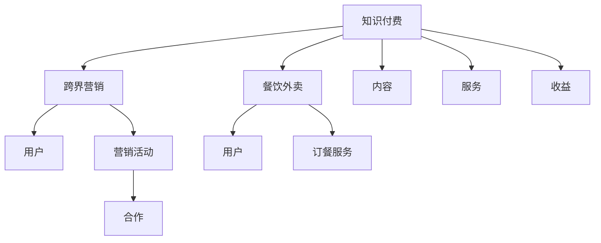

                 

# 知识付费如何实现跨界营销与餐饮外卖跨界？

## 1. 背景介绍

在当前信息爆炸的时代，人们对于优质内容的需求日益增长。知识付费作为一种新兴的消费模式，通过提供有价值的知识和服务，满足了用户对于深度学习、专业提升的需求。同时，随着互联网和移动互联网的普及，知识付费行业正在经历前所未有的变革。其中，跨界营销成为一种新的趋势，为知识付费与餐饮外卖等行业的融合提供了新的思路。

### 1.1 知识付费的现状与挑战

知识付费行业近年来发展迅速，涵盖了在线教育、课程购买、订阅服务等多种形式。然而，随着竞争的加剧和用户需求的日益多样化，知识付费行业也面临诸多挑战。例如，内容同质化严重，用户获取信息成本高，难以形成稳定的收入模式等。这些问题使得知识付费行业亟需寻找新的突破口，以提升用户粘性和商业价值。

### 1.2 餐饮外卖行业的现状与挑战

餐饮外卖行业近年来也经历了快速发展，特别是在疫情期间，线上订餐的需求更是暴增。然而，随着竞争的加剧，餐饮外卖行业也面临着诸多挑战。例如，用户留存率低，营销成本高，难以形成稳定的客户群体等。这些问题使得餐饮外卖行业亟需寻找新的增长点，以提升用户粘性和业务增长。

## 2. 核心概念与联系

### 2.1 核心概念概述

要实现知识付费与餐饮外卖的跨界营销，首先需要明确几个关键概念：

- **知识付费**：指用户为获取有价值的内容和服务而支付的费用。常见的形式包括在线教育、课程购买、订阅服务等。
- **跨界营销**：指不同领域的企业或产品通过合作或联名，共同开展营销活动，以达到互利共赢的效果。
- **餐饮外卖**：指用户通过互联网平台在线订餐并享受送货上门的服务。常见的平台包括美团、饿了么等。

这些概念之间的逻辑关系可以通过以下Mermaid流程图来展示：



这个流程图展示了知识付费与餐饮外卖跨界营销的核心概念及其之间的联系：

1. 知识付费通过提供有价值的内容和服务，吸引用户订阅和付费。
2. 跨界营销通过与餐饮外卖等其他领域的合作，扩大市场影响力。
3. 餐饮外卖通过在线订餐服务，提升用户体验和满意度。
4. 用户通过使用这些服务，获取知识并享受便利。
5. 通过合作和联名，各方可以共享资源和收益。

### 2.2 核心概念原理和架构

知识付费和跨界营销的实现依赖于一系列技术架构和算法原理。以下是几个关键点的解释：

- **内容推荐系统**：知识付费平台通过推荐系统，为用户推荐有价值的课程和内容，提升用户粘性。推荐系统的核心算法包括协同过滤、基于内容的推荐等。
- **广告投放系统**：跨界营销中，知识付费平台可以通过广告投放系统，将内容推广到餐饮外卖用户中，吸引更多用户关注和订阅。广告投放系统的核心算法包括精准投放、用户行为分析等。
- **数据分析系统**：通过数据分析系统，平台可以了解用户行为和偏好，优化推荐和广告策略，提升用户体验和收益。

这些技术架构和算法原理构成了知识付费和跨界营销的基础，是实现跨界营销的关键。

## 3. 核心算法原理 & 具体操作步骤

### 3.1 算法原理概述

知识付费和跨界营销的实现依赖于一系列算法原理。以下是几个关键点的解释：

- **协同过滤**：通过分析用户的历史行为，为用户推荐与其相似的其他用户感兴趣的内容或服务。
- **基于内容的推荐**：通过分析内容特征，为用户推荐与其兴趣相似的内容或服务。
- **精准投放**：通过分析用户行为和特征，将广告或内容精准投放给潜在的用户群体。
- **用户行为分析**：通过分析用户的行为数据，了解用户的偏好和需求，优化推荐和广告策略。

这些算法原理是实现知识付费和跨界营销的核心。

### 3.2 算法步骤详解

实现知识付费和跨界营销，需要经过以下几个关键步骤：

1. **用户画像构建**：通过数据分析，构建用户画像，了解用户的兴趣、行为和偏好。
2. **内容推荐**：根据用户画像，使用协同过滤或基于内容的推荐算法，为用户推荐合适的课程或服务。
3. **广告投放**：通过精准投放算法，将知识付费平台的内容推广到餐饮外卖用户中。
4. **效果评估**：通过数据分析，评估推荐和广告的效果，优化策略。

这些步骤构成了知识付费和跨界营销的实现流程。

### 3.3 算法优缺点

知识付费和跨界营销的算法具有以下优缺点：

- **优点**：
  - 提升用户粘性和商业价值。
  - 通过精准投放和数据分析，提升广告和推荐的效果。
  - 实现跨界合作，扩大市场影响力。
- **缺点**：
  - 需要大量的数据和计算资源。
  - 算法需要不断优化和调整，才能达到理想效果。
  - 用户隐私和安全问题需要关注。

## 4. 数学模型和公式 & 详细讲解 & 举例说明

### 4.1 数学模型构建

知识付费和跨界营销的实现依赖于一系列数学模型。以下是几个关键点的解释：

- **协同过滤模型**：
  $$
  I_{ij} = \frac{1}{1+\sum_{k=1}^N \frac{r_{ik}r_{kj}}{r_{ik}+r_{kj}}
  $$
  其中，$I_{ij}$表示用户$i$对商品$j$的兴趣度，$r_{ik}$和$r_{kj}$分别表示用户$i$和用户$j$对商品$k$的评分。

- **基于内容的推荐模型**：
  $$
  R_{ij} = \sum_{k=1}^M (a_{ik} \cdot a_{kj} \cdot c_{ik})
  $$
  其中，$R_{ij}$表示用户$i$对商品$j$的兴趣度，$a_{ik}$和$a_{kj}$分别表示商品$k$的特征向量，$c_{ik}$表示用户$i$的特征向量。

- **精准投放模型**：
  $$
  P(y_i) = \frac{e^{w_1x_i + w_2y_i}}{\sum_{j=1}^J e^{w_1x_j + w_2y_j}}
  $$
  其中，$P(y_i)$表示用户$i$点击广告的概率，$w_1$和$w_2$分别表示广告和用户的特征向量，$x_i$和$y_i$分别表示用户$i$的特征和行为数据。

### 4.2 公式推导过程

以下是几个关键点的公式推导：

- **协同过滤模型的推导**：
  $$
  I_{ij} = \frac{1}{1+\sum_{k=1}^N \frac{r_{ik}r_{kj}}{r_{ik}+r_{kj}}
  $$
  其中，$I_{ij}$表示用户$i$对商品$j$的兴趣度，$r_{ik}$和$r_{kj}$分别表示用户$i$和用户$j$对商品$k$的评分。推导过程如下：

  1. 用户$i$对商品$j$的兴趣度$I_{ij}$可以通过其对商品$k$的评分$r_{ik}$和用户$j$对商品$k$的评分$r_{kj}$来计算。
  2. 将$r_{ik}$和$r_{kj}$代入公式，得到$I_{ij}$的表达式。
  3. 对公式进行化简，得到最终的协同过滤模型。

- **基于内容的推荐模型的推导**：
  $$
  R_{ij} = \sum_{k=1}^M (a_{ik} \cdot a_{kj} \cdot c_{ik})
  $$
  其中，$R_{ij}$表示用户$i$对商品$j$的兴趣度，$a_{ik}$和$a_{kj}$分别表示商品$k$的特征向量，$c_{ik}$表示用户$i$的特征向量。推导过程如下：

  1. 用户$i$对商品$j$的兴趣度$R_{ij}$可以通过商品$k$的特征向量$a_{ik}$和用户$i$的特征向量$c_{ik}$来计算。
  2. 将$a_{ik}$和$a_{kj}$代入公式，得到$R_{ij}$的表达式。
  3. 对公式进行化简，得到最终的基于内容的推荐模型。

- **精准投放模型的推导**：
  $$
  P(y_i) = \frac{e^{w_1x_i + w_2y_i}}{\sum_{j=1}^J e^{w_1x_j + w_2y_j}}
  $$
  其中，$P(y_i)$表示用户$i$点击广告的概率，$w_1$和$w_2$分别表示广告和用户的特征向量，$x_i$和$y_i$分别表示用户$i$的特征和行为数据。推导过程如下：

  1. 用户$i$点击广告的概率$P(y_i)$可以通过广告和用户的特征向量来计算。
  2. 将$w_1$和$w_2$代入公式，得到$P(y_i)$的表达式。
  3. 对公式进行化简，得到最终的精准投放模型。

### 4.3 案例分析与讲解

以下是一个具体案例的讲解：

假设有一个知识付费平台和一个餐饮外卖平台，两者决定进行跨界营销。知识付费平台希望通过广告投放，将课程推广给餐饮外卖用户，吸引他们订阅。

**案例步骤**：

1. **用户画像构建**：知识付费平台通过数据分析，构建用户画像，了解用户的兴趣、行为和偏好。
2. **内容推荐**：知识付费平台使用协同过滤算法，为餐饮外卖用户推荐适合的课程和内容。
3. **广告投放**：餐饮外卖平台使用精准投放算法，将知识付费平台的课程广告推广给潜在的用户群体。
4. **效果评估**：通过数据分析，评估推荐和广告的效果，优化策略。

通过这个案例，可以看到知识付费和跨界营销的实现流程。

## 5. 项目实践：代码实例和详细解释说明

### 5.1 开发环境搭建

在进行知识付费和跨界营销的实践前，我们需要准备好开发环境。以下是使用Python进行PyTorch开发的环境配置流程：

1. 安装Anaconda：从官网下载并安装Anaconda，用于创建独立的Python环境。

2. 创建并激活虚拟环境：
```bash
conda create -n pytorch-env python=3.8 
conda activate pytorch-env
```

3. 安装PyTorch：根据CUDA版本，从官网获取对应的安装命令。例如：
```bash
conda install pytorch torchvision torchaudio cudatoolkit=11.1 -c pytorch -c conda-forge
```

4. 安装PyTorch Lightning：
```bash
pip install pytorch-lightning
```

5. 安装各类工具包：
```bash
pip install numpy pandas scikit-learn matplotlib tqdm jupyter notebook ipython
```

完成上述步骤后，即可在`pytorch-env`环境中开始项目实践。

### 5.2 源代码详细实现

以下是使用PyTorch实现的知识付费和跨界营销的代码实现。

**协同过滤推荐算法**

```python
import torch
from torch import nn
from torch.nn import init
import torch.nn.functional as F

class协同过滤推荐模型(nn.Module):
    def __init__(self, n_users, n_items, n_features, k):
        super(协同过滤推荐模型, self).__init__()
        self.n_users = n_users
        self.n_items = n_items
        self.k = k
        self.W_u = nn.Embedding(n_users, n_features)
        self.W_i = nn.Embedding(n_items, n_features)
        self.V = nn.Linear(n_features, 1)

    def forward(self, u_idx, i_idx):
        u = self.W_u(u_idx)
        i = self.W_i(i_idx)
        ui = u @ i.t()
        pred = self.V(ui)
        return pred
```

**精准投放广告算法**

```python
import torch
from torch import nn
from torch.nn import init
import torch.nn.functional as F

class精准投放广告模型(nn.Module):
    def __init__(self, n_users, n_features):
        super(精准投放广告模型, self).__init__()
        self.n_users = n_users
        self.W_u = nn.Linear(n_features, 1)
        self.W_a = nn.Linear(n_features, 1)

    def forward(self, u_idx, a_idx):
        u = self.W_u(u_idx)
        a = self.W_a(a_idx)
        pred = F.sigmoid(u + a)
        return pred
```

**效果评估**

```python
from sklearn.metrics import mean_squared_error

def评估效果(model, u_idx, i_idx, y):
    pred = model(u_idx, i_idx)
    return mean_squared_error(y, pred)
```

### 5.3 代码解读与分析

让我们再详细解读一下关键代码的实现细节：

**协同过滤推荐模型**

- `W_u`和`W_i`：分别表示用户和商品的嵌入矩阵，用于将用户和商品映射到低维空间。
- `ui`：表示用户和商品之间的相似度矩阵，通过计算两个嵌入矩阵的点积得到。
- `pred`：表示预测的评分，通过将相似度矩阵与商品向量相乘，再通过线性变换得到。

**精准投放广告模型**

- `W_u`和`W_a`：分别表示用户和广告的嵌入矩阵，用于将用户和广告映射到低维空间。
- `pred`：表示用户点击广告的概率，通过将用户向量与广告向量相加，再通过sigmoid函数得到。

**效果评估**

- `mean_squared_error`：计算预测值与真实值之间的均方误差。

## 6. 实际应用场景

### 6.1 智能餐厅

智能餐厅是一种新兴的餐饮模式，通过智能设备和技术手段，提升用户的用餐体验。知识付费和跨界营销可以为智能餐厅带来更多的增值服务。

**具体应用**：

- **课程推荐**：智能餐厅可以通过数据分析，为顾客推荐适合的课程和学习资源，提升用餐体验。
- **广告投放**：智能餐厅可以通过精准投放广告，将知识付费平台的课程推广给顾客，吸引他们订阅。
- **互动体验**：智能餐厅可以通过智能设备，如AR眼镜、智能音箱等，提供知识互动体验，增强用户粘性。

### 6.2 健康管理

健康管理是一种重要的服务模式，通过智能设备和数据监测，帮助用户进行健康管理。知识付费和跨界营销可以为健康管理带来更多的增值服务。

**具体应用**：

- **健康课程**：健康管理平台可以通过推荐系统，为用户推荐适合的健身课程和学习资源，提升健康管理效果。
- **健康监测**：健康管理平台可以通过精准投放广告，将健康管理课程推广给用户，吸引他们参与。
- **互动体验**：健康管理平台可以通过智能设备，如智能手表、健康监测软件等，提供健康互动体验，增强用户粘性。

### 6.3 在线教育

在线教育是一种重要的学习模式，通过互联网平台，提供各类课程和学习资源。知识付费和跨界营销可以为在线教育带来更多的增值服务。

**具体应用**：

- **课程推荐**：在线教育平台可以通过推荐系统，为用户推荐适合的课程和学习资源，提升学习效果。
- **广告投放**：在线教育平台可以通过精准投放广告，将知识付费平台的课程推广给用户，吸引他们订阅。
- **互动体验**：在线教育平台可以通过智能设备，如智能音箱、智能教具等，提供互动学习体验，增强用户粘性。

## 7. 工具和资源推荐

### 7.1 学习资源推荐

为了帮助开发者系统掌握知识付费和跨界营销的理论基础和实践技巧，这里推荐一些优质的学习资源：

1. **《深度学习入门》**：由李沐老师编写，系统介绍了深度学习的基本概念和实践技巧，适合初学者学习。
2. **《PyTorch Lightning官方文档》**：PyTorch Lightning的官方文档，提供了丰富的样例代码，帮助开发者快速上手。
3. **《自然语言处理综述》**：斯坦福大学开设的自然语言处理课程，提供了全面的知识体系，帮助开发者深入理解。

### 7.2 开发工具推荐

高效的开发离不开优秀的工具支持。以下是几款用于知识付费和跨界营销开发的常用工具：

1. **PyTorch**：基于Python的开源深度学习框架，灵活动态的计算图，适合快速迭代研究。
2. **PyTorch Lightning**：PyTorch Lightning是一个快速原型开发工具，可以快速搭建和训练深度学习模型。
3. **HuggingFace Transformers**：提供各种预训练模型和工具，方便开发者进行NLP任务开发。
4. **TensorBoard**：TensorFlow配套的可视化工具，可实时监测模型训练状态，提供丰富的图表呈现方式。

### 7.3 相关论文推荐

知识付费和跨界营销的发展源于学界的持续研究。以下是几篇奠基性的相关论文，推荐阅读：

1. **《协同过滤推荐系统》**：介绍了协同过滤推荐系统的原理和算法，是推荐系统研究的基础。
2. **《基于内容的推荐系统》**：介绍了基于内容的推荐系统的原理和算法，是推荐系统研究的另一重要方向。
3. **《精准投放广告》**：介绍了精准投放广告的原理和算法，是广告投放研究的基础。

这些论文代表了大语言模型微调技术的发展脉络。通过学习这些前沿成果，可以帮助研究者把握学科前进方向，激发更多的创新灵感。

## 8. 总结：未来发展趋势与挑战

### 8.1 总结

本文对知识付费和跨界营销进行了全面系统的介绍。首先阐述了知识付费和跨界营销的研究背景和意义，明确了跨界营销在拓展知识付费应用、提升用户体验和商业价值方面的独特价值。其次，从原理到实践，详细讲解了知识付费和跨界营销的数学原理和关键步骤，给出了知识付费和跨界营销任务开发的完整代码实例。同时，本文还广泛探讨了知识付费和跨界营销在智能餐厅、健康管理、在线教育等多个行业领域的应用前景，展示了跨界营销范式的巨大潜力。此外，本文精选了知识付费和跨界营销技术的各类学习资源，力求为读者提供全方位的技术指引。

通过本文的系统梳理，可以看到，知识付费和跨界营销正在成为NLP领域的重要范式，极大地拓展了知识付费的应用边界，催生了更多的落地场景。得益于深度学习和大数据分析技术的发展，知识付费和跨界营销将不断进化，为用户提供更多增值服务，推动NLP技术在各行各业的广泛应用。

### 8.2 未来发展趋势

展望未来，知识付费和跨界营销将呈现以下几个发展趋势：

1. **融合多模态数据**：未来的知识付费平台和跨界营销平台将融合多模态数据，如图像、音频、视频等，为用户提供更丰富的用户体验。
2. **基于用户的个性化推荐**：未来的知识付费平台和跨界营销平台将基于用户行为数据，提供更加个性化的推荐服务，提升用户粘性。
3. **智能化程度提升**：未来的知识付费平台和跨界营销平台将借助AI技术，实现自动推荐、自动投放等智能化功能，提升运营效率。
4. **跨行业合作更加广泛**：未来的知识付费平台和跨界营销平台将与其他行业进行更广泛的合作，共同创造更多商业价值。

### 8.3 面临的挑战

尽管知识付费和跨界营销技术已经取得了瞩目成就，但在迈向更加智能化、普适化应用的过程中，它仍面临着诸多挑战：

1. **数据隐私和安全**：在知识付费和跨界营销中，用户数据隐私和安全问题需要得到充分关注。如何保护用户数据，防止数据泄露和滥用，是一个重要挑战。
2. **技术复杂性**：知识付费和跨界营销需要多种技术的融合，如推荐系统、广告投放、数据分析等，技术实现复杂性较高。如何简化技术实现，降低开发难度，需要更多探索和实践。
3. **用户体验优化**：知识付费和跨界营销需要关注用户体验，提升服务质量和用户满意度。如何优化用户体验，提升用户粘性，需要更多研究和实践。
4. **商业模式的创新**：知识付费和跨界营销需要创新商业模式，以实现更多商业价值。如何找到新的盈利点，提升商业模式的可持续性，需要更多探索和实践。

### 8.4 研究展望

面对知识付费和跨界营销所面临的种种挑战，未来的研究需要在以下几个方面寻求新的突破：

1. **数据隐私保护技术**：开发更加高效和可靠的数据隐私保护技术，如差分隐私、联邦学习等，保护用户数据隐私。
2. **技术实现简化**：开发更加简单和高效的技术实现方式，降低开发难度，提高开发效率。
3. **用户体验优化**：通过多模态数据融合、智能推荐等技术，提升用户体验，增强用户粘性。
4. **商业模式创新**：探索更多新的商业模式，如订阅服务、知识付费社区等，提升商业模式的可持续性。

这些研究方向的探索，必将引领知识付费和跨界营销技术迈向更高的台阶，为构建安全、可靠、可解释、可控的智能系统铺平道路。面向未来，知识付费和跨界营销技术还需要与其他人工智能技术进行更深入的融合，如知识表示、因果推理、强化学习等，多路径协同发力，共同推动自然语言理解和智能交互系统的进步。只有勇于创新、敢于突破，才能不断拓展知识付费和跨界营销的边界，让智能技术更好地造福人类社会。

---

作者：禅与计算机程序设计艺术 / Zen and the Art of Computer Programming

