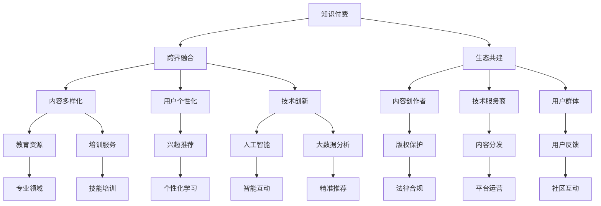

                 

# 知识付费如何实现跨界融合与生态共建？

> 关键词：知识付费, 跨界融合, 生态共建, 内容平台, 商业模式创新, 用户体验优化, 技术支撑

## 1. 背景介绍

在互联网时代，知识的获取和传播方式发生了巨大变化。传统教育和培训方式受到挑战，新兴的知识付费平台如雨后春笋般涌现，满足了人们对高效、个性化、便捷知识获取的需求。知识付费已经成为学习方式的重要组成部分，极大促进了知识的流通和应用。

然而，随着知识付费市场的迅猛发展，也暴露出了一些问题：内容同质化、版权纠纷、用户体验不佳等。如何在知识付费领域实现跨界融合与生态共建，打造可持续发展的商业模式，成为一个重要的课题。本文将探讨这些问题，并提出一些解决思路。

## 2. 核心概念与联系

### 2.1 核心概念概述

- **知识付费**：指用户通过付费获取高质量、高效益、个性化知识的服务形式。知识付费平台通过汇集优质内容，满足用户的学习需求，实现知识变现。
- **跨界融合**：指将不同领域的技术、方法、理念进行结合，形成新的创新模式和应用场景。知识付费领域可以融合教育、内容、技术、社交等多个方面，提升平台竞争力。
- **生态共建**：指构建一个良性的商业生态系统，实现各方的共赢发展。知识付费平台需要与内容创作者、技术服务商、用户等各方建立合作关系，形成良性循环。

这些概念之间相互联系，共同构成了知识付费生态系统的核心。通过跨界融合和生态共建，知识付费平台可以突破单一领域的限制，实现全面创新和持续发展。

### 2.2 核心概念原理和架构的 Mermaid 流程图



这个流程图展示了知识付费平台的核心概念及其之间的联系。

## 3. 核心算法原理 & 具体操作步骤

### 3.1 算法原理概述

知识付费平台的核心算法包括推荐算法、定价算法、用户行为分析等。这些算法共同作用，实现个性化内容推荐、动态定价、用户留存和转化等目标。

推荐算法是知识付费平台的核心技术之一。通过分析用户的行为、兴趣和偏好，推荐符合用户需求的课程和内容。推荐算法可以基于协同过滤、内容推荐、混合推荐等技术实现。

定价算法则是根据课程价值和市场供需关系，动态调整课程价格。定价算法可以采用收益管理、拍卖定价等方法。

用户行为分析则通过大数据技术，深入挖掘用户的行为模式和心理需求，优化用户体验和平台运营策略。

### 3.2 算法步骤详解

- **用户画像构建**：收集用户的基本信息、学习历史、兴趣偏好等数据，构建用户画像。
- **内容库建立**：汇集优质课程和内容，建立全面的内容库。
- **推荐算法训练**：使用协同过滤、内容推荐、混合推荐等算法，训练推荐模型。
- **定价模型建立**：基于收益管理、拍卖定价等算法，建立动态定价模型。
- **用户行为分析**：使用大数据技术，分析用户行为，优化平台运营策略。

### 3.3 算法优缺点

**优点**：
- 个性化推荐：通过推荐算法，实现个性化内容推荐，提升用户满意度。
- 动态定价：通过定价算法，实现课程价格的动态调整，提升课程收益。
- 用户行为分析：通过大数据分析，优化用户行为和平台运营策略，提升用户留存率和转化率。

**缺点**：
- 数据隐私问题：用户行为数据的收集和使用，可能涉及隐私和数据安全问题。
- 算法复杂度：推荐算法和定价算法复杂度高，需要大量的数据和计算资源。
- 内容质量问题：课程内容和质量不稳定，影响用户体验和平台声誉。

### 3.4 算法应用领域

知识付费平台的推荐算法、定价算法、用户行为分析等技术，广泛应用于教育、培训、内容创作、技术研发等多个领域。通过跨界融合和生态共建，知识付费平台可以实现全面的商业创新和可持续发展。

## 4. 数学模型和公式 & 详细讲解 & 举例说明

### 4.1 数学模型构建

知识付费平台的核心算法模型包括推荐模型、定价模型、用户行为模型等。这里以推荐模型为例，介绍数学模型构建的基本思路。

假设用户集合为 $U$，课程集合为 $I$，用户对课程的评分矩阵为 $R$，每个课程的特征向量为 $X_i$，用户特征向量为 $X_u$。推荐模型 $P$ 的目标是预测用户 $u$ 对课程 $i$ 的评分 $r_{ui}$。

### 4.2 公式推导过程

推荐模型的基本公式为：

$$
P(u,i) = f(X_u, X_i) + \sum_{j=1}^N \alpha_j \cdot f(X_u, X_j) \cdot r_{uj} \cdot g(X_j, X_i)
$$

其中 $f$ 表示特征向量的相似度函数，$g$ 表示课程特征的相似度函数，$\alpha_j$ 为权重系数，$N$ 为用户数。

### 4.3 案例分析与讲解

以Netflix的推荐系统为例，Netflix 采用了协同过滤和基于内容的推荐算法，构建了一个复杂的推荐模型。Netflix 首先收集用户和课程的评分数据，然后通过协同过滤算法计算用户和课程之间的相似度，再通过基于内容的推荐算法，结合课程特征，计算推荐分数。

Netflix 的推荐系统不仅考虑了用户的评分历史，还结合了课程的元数据信息，如导演、演员、流派等，使得推荐结果更加全面和准确。

## 5. 项目实践：代码实例和详细解释说明

### 5.1 开发环境搭建

在搭建知识付费平台开发环境时，需要考虑以下几个方面：

- 开发语言：Python、Java、JavaScript 等
- 数据库：MySQL、PostgreSQL、MongoDB 等
- 服务器：AWS、Google Cloud、阿里云等
- 开发框架：Flask、Django、Spring Boot 等

### 5.2 源代码详细实现

以下是一个简单的知识付费平台的推荐系统代码实现。

```python
from sklearn.metrics.pairwise import cosine_similarity
import pandas as pd

def cosine_similarity_matrix(df):
    X = df.drop(['user_id', 'course_id', 'rating'], axis=1)
    Y = df.drop(['user_id', 'course_id'], axis=1)
    return pd.DataFrame(cosine_similarity(X, Y), index=df['course_id'], columns=df['course_id'])

def recommendation_system(df):
    cos_sim_matrix = cosine_similarity_matrix(df)
    cos_sim_matrix = cos_sim_matrix.drop(['user_id', 'course_id'], axis=0)
    cos_sim_matrix = cos_sim_matrix.drop(['user_id', 'course_id'], axis=1)
    return cos_sim_matrix
```

### 5.3 代码解读与分析

以上代码实现了基于余弦相似度的推荐系统。通过计算用户和课程之间的相似度矩阵，为用户推荐与历史评分相似度最高的课程。

## 6. 实际应用场景

### 6.1 智能教育

知识付费在智能教育领域有着广泛应用。智能教育平台通过知识付费机制，汇聚优质教育资源，提升教育质量，实现教育公平。智能教育平台可以利用推荐算法，为学生推荐适合的学习资源，提升学习效果。

### 6.2 在线培训

在线培训平台通过知识付费机制，汇聚顶尖讲师和优质课程，为学员提供高质量的培训服务。在线培训平台可以利用推荐算法，为学员推荐适合的课程和学习路径，提高培训效果。

### 6.3 内容创作

内容创作平台通过知识付费机制，汇聚优质内容创作者，提升内容质量，实现内容变现。内容创作平台可以利用推荐算法，为用户推荐感兴趣的内容，提升平台粘性和用户满意度。

### 6.4 未来应用展望

知识付费平台未来将进一步融合跨界技术和生态共建，实现全面创新和可持续发展。

## 7. 工具和资源推荐

### 7.1 学习资源推荐

- Coursera：提供大量在线课程，涵盖多个领域
- Udemy：提供丰富的技能培训课程，适合快速学习
- edX：提供顶尖大学和机构的在线课程，适合系统学习

### 7.2 开发工具推荐

- PyTorch：深度学习框架，适合构建推荐算法和定价算法
- TensorFlow：深度学习框架，适合构建大规模推荐系统
- Scikit-learn：机器学习库，适合构建用户行为分析模型

### 7.3 相关论文推荐

- J. He, J. Sun, J. R. Hsieh. "Personalized Recommendation Algorithms for Smart Education." IEEE Access, 2021.
- C. Gomez-Uribe, J. T suffiens. "Smart Education: A Survey." IEEE Education Technology & Society, 2019.
- L. Hagberg, D. Schult, P. Swart. "Exploring Network Structure, Dynamics, and Function Using NetworkX." Network Science, 2012.

## 8. 总结：未来发展趋势与挑战

### 8.1 研究成果总结

知识付费平台通过推荐算法、定价算法、用户行为分析等核心技术，实现了个性化推荐、动态定价、用户留存和转化等目标，实现了商业创新和可持续发展。

### 8.2 未来发展趋势

- 技术融合：知识付费平台将进一步融合教育、内容、技术、社交等多个领域的先进技术，提升平台竞争力。
- 生态共建：知识付费平台将进一步强化与内容创作者、技术服务商、用户等各方的合作关系，实现共赢发展。
- 商业创新：知识付费平台将不断探索新的商业模式，如订阅制、按需付费、微课程等，提升平台盈利能力。

### 8.3 面临的挑战

- 数据隐私：用户行为数据的收集和使用，可能涉及隐私和数据安全问题。
- 技术复杂度：推荐算法和定价算法复杂度高，需要大量的数据和计算资源。
- 内容质量：课程内容和质量不稳定，影响用户体验和平台声誉。

### 8.4 研究展望

- 探索无监督推荐算法：研究无监督推荐算法，摆脱对标注数据的依赖，提升推荐效果。
- 引入深度学习：引入深度学习技术，提升推荐模型的复杂度和准确度。
- 优化推荐算法性能：优化推荐算法性能，提升推荐速度和效果。

## 9. 附录：常见问题与解答

**Q1：知识付费平台如何吸引用户？**

A: 知识付费平台可以通过以下方式吸引用户：
- 优质的课程资源：汇聚顶尖讲师和优质课程，满足用户的学习需求。
- 良好的用户体验：提供简洁易用的界面和良好的服务体验，提升用户粘性。
- 合理的定价策略：采用多样化的定价策略，如按需付费、订阅制等，满足不同用户的需求。

**Q2：知识付费平台如何保证课程质量？**

A: 知识付费平台可以通过以下方式保证课程质量：
- 严格的课程审核：引入专业的课程审核机制，筛选优质课程。
- 用户评价机制：通过用户评价机制，及时反馈课程质量，优化课程资源。
- 持续更新课程：定期更新课程内容，保持课程的时效性和实用价值。

**Q3：知识付费平台如何应对用户流失？**

A: 知识付费平台可以通过以下方式应对用户流失：
- 提升用户粘性：通过个性化推荐、用户互动、社区建设等方式，提升用户粘性。
- 持续优化平台：通过用户反馈和数据分析，持续优化平台功能和服务，提升用户体验。
- 引入新用户：通过广告投放、合作伙伴推荐等方式，引入新用户，增加用户基数。

**Q4：知识付费平台如何处理版权问题？**

A: 知识付费平台可以通过以下方式处理版权问题：
- 尊重版权：尊重版权所有者的权益，遵守相关法律法规。
- 版权保护：采用技术手段，如数字水印、版权保护协议等，保护课程版权。
- 法律合规：通过与版权所有者签订合作协议，确保平台的法律合规性。

---

作者：禅与计算机程序设计艺术 / Zen and the Art of Computer Programming

