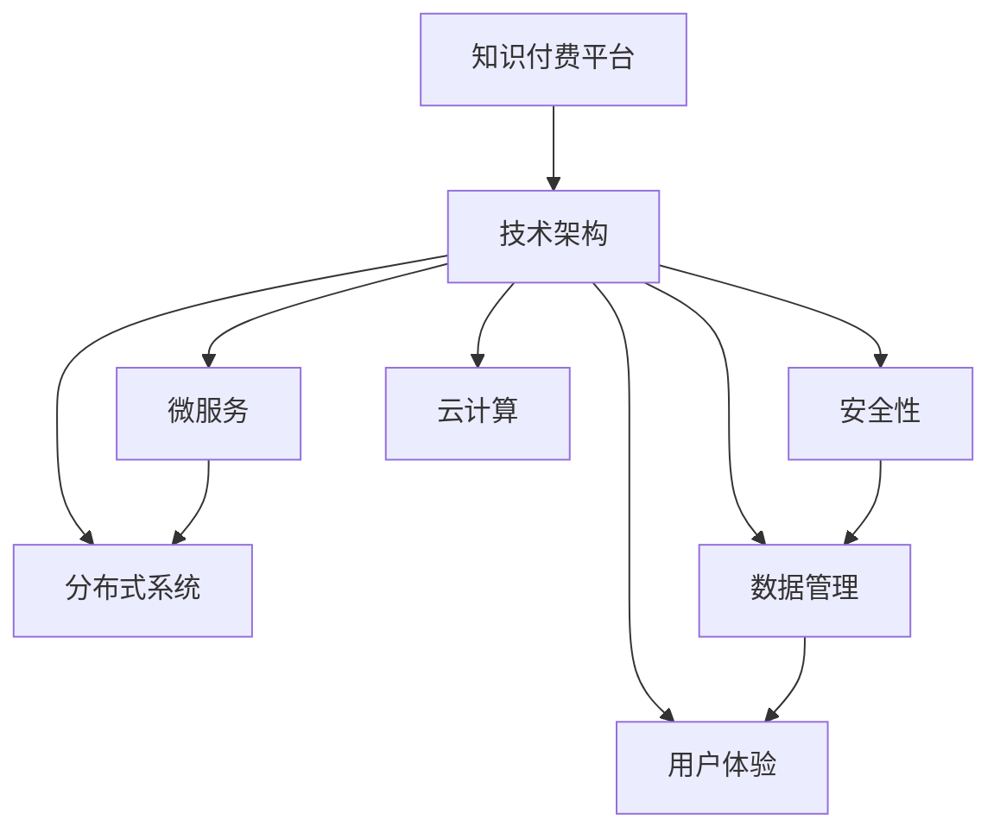

                 

# 知识付费平台的技术架构设计

> 关键词：知识付费平台, 技术架构, 系统设计, 微服务, 分布式系统, 安全性, 数据管理, 用户体验, 云计算

## 1. 背景介绍

### 1.1 问题由来

知识付费平台已成为内容创作者和知识消费者之间的重要连接桥梁。它不仅提供了高质量的内容资源，还改变了信息获取方式，提升了知识传播效率。然而，随着平台用户基数的快速增长，系统架构的复杂度也不断提升，如何构建高效、稳定、可扩展的技术架构，满足日益增长的业务需求，成为知识付费平台面临的核心挑战。

### 1.2 问题核心关键点

知识付费平台的核心挑战包括：
- 确保数据安全与隐私保护。
- 实现高并发用户访问与低延迟响应。
- 支撑大规模内容分发与存储。
- 提升用户体验与互动性。
- 应对未来业务拓展与技术创新。

### 1.3 问题研究意义

优化知识付费平台的技术架构，不仅能提高平台的性能和稳定性，还能提升用户体验和内容服务质量，最终促进行业的良性发展。本文旨在从系统设计、微服务、分布式系统、安全性、数据管理、用户体验和云计算等多个维度，深入探讨知识付费平台的技术架构设计。

## 2. 核心概念与联系

### 2.1 核心概念概述

为更好地理解知识付费平台的技术架构，本节将介绍几个密切相关的核心概念：

- **知识付费平台(Knowledge Paywalls Platform)**：一种提供知识共享、在线教育等付费内容服务的平台。通过吸引用户订阅或单次购买，获取收入。

- **技术架构(Technology Architecture)**：设计构建软件系统时，所采用的技术解决方案、组件和框架的集合。

- **微服务(Microservices)**：将系统拆分为一系列独立、自成一体的服务模块，每个服务模块独立部署、管理，便于横向扩展和快速迭代。

- **分布式系统(Distributed Systems)**：由多个独立、自治的计算机节点组成的系统，通过网络相互通信，实现资源共享和数据协同。

- **安全性(Security)**：通过技术手段，保护系统、数据和用户隐私，防止非法访问和恶意攻击。

- **数据管理(Data Management)**：对数据的采集、存储、处理和分析进行管理和优化，确保数据质量和可用性。

- **用户体验(User Experience)**：通过技术手段提升用户交互体验，提升用户满意度和平台粘性。

- **云计算(Cloud Computing)**：基于互联网的计算资源和应用程序服务，通过云服务提供商提供弹性计算资源，支撑大规模应用部署。

这些核心概念之间的逻辑关系可以通过以下Mermaid流程图来展示：



这个流程图展示了几类核心概念及其之间的联系：

1. 知识付费平台通过技术架构实现各种功能。
2. 技术架构包含微服务、分布式系统等组件。
3. 安全性、数据管理和用户体验，是技术架构中的重要组成部分。
4. 云计算为技术架构提供弹性计算资源支撑。

## 3. 核心算法原理 & 具体操作步骤
### 3.1 算法原理概述

知识付费平台的技术架构设计，主要涉及系统架构的构建、组件间的协作、数据流管理、系统扩展、安全防护等方面。核心算法原理包括但不限于：

- 分布式系统理论：设计分布式系统的核心，确保系统的高可用性、扩展性和容错性。
- 微服务架构设计：将系统拆分为独立服务，通过服务间通信实现功能协同。
- 安全性设计：采用多种技术手段，防止非法访问、数据泄露等安全问题。
- 数据管理策略：设计高效的数据存储和处理机制，保障数据质量和安全。
- 用户体验优化：通过界面设计、交互逻辑等提升用户体验，增加用户粘性。
- 云计算应用：利用云服务提供弹性计算资源，支撑大规模系统部署。

### 3.2 算法步骤详解

知识付费平台的技术架构设计主要包括以下几个关键步骤：

**Step 1: 需求分析与功能定义**

- 根据平台业务需求，明确平台的主要功能模块，如用户管理、内容管理、支付管理等。
- 制定功能规格，明确各模块的输入输出、数据流向、业务逻辑等。

**Step 2: 系统架构设计**

- 设计架构蓝图，确定系统层级、组件关系、数据流向等。
- 选择适合的架构模式，如微服务架构、事件驱动架构等。
- 定义关键组件，如负载均衡器、数据库、缓存等。

**Step 3: 组件拆分与微服务设计**

- 将系统功能拆分为独立的服务模块，每个模块负责特定功能。
- 设计服务间通信机制，如RESTful API、消息队列等。
- 确定服务的版本和兼容性策略。

**Step 4: 分布式系统设计**

- 设计分布式系统，包括集群管理、负载均衡、故障恢复等机制。
- 选择合适的分布式存储解决方案，如NoSQL数据库、对象存储等。
- 设计分布式事务处理机制，确保数据一致性。

**Step 5: 安全性设计**

- 设计身份认证和授权机制，确保用户身份安全。
- 采用加密技术保护数据传输和存储，防止数据泄露。
- 设计防护策略，防止SQL注入、XSS等常见攻击。

**Step 6: 数据管理设计**

- 设计数据存储和访问机制，如数据库、缓存、分布式文件系统等。
- 采用数据分片、索引等技术，优化数据访问性能。
- 设计数据备份和恢复机制，确保数据安全。

**Step 7: 用户体验设计**

- 设计友好的用户界面，提升用户体验。
- 优化交互流程，减少用户操作复杂度。
- 设计快速响应的交互机制，提升用户满意度。

**Step 8: 云计算应用设计**

- 选择合适的云服务提供商，如AWS、阿里云、腾讯云等。
- 设计云资源配置策略，实现弹性计算资源按需扩展。
- 优化云资源使用效率，降低云服务成本。

### 3.3 算法优缺点

知识付费平台技术架构设计的主要优点包括：

- 灵活性高：通过微服务拆分，系统能够快速迭代，快速响应业务需求变化。
- 扩展性好：分布式系统设计能够支撑系统的高并发、大规模扩展。
- 容错性强：设计了完善的故障恢复和容错机制，确保系统的可靠性。
- 安全性高：全面的安全性设计能够防止非法访问和数据泄露。
- 数据管理便捷：高效的数据管理策略能够保障数据质量和可用性。
- 用户体验良好：通过优化用户体验，提升用户粘性和满意度。
- 成本效益高：利用云计算资源，实现弹性资源扩展和成本优化。

同时，这种架构也存在一些缺点：

- 复杂度高：系统设计复杂，组件间依赖关系多，维护难度大。
- 通信开销高：服务间通信机制会增加系统开销，影响性能。
- 数据一致性挑战：分布式环境下，确保数据一致性较为困难。
- 部署难度大：需要精细化的部署策略和工具支持。
- 安全风险高：需要设计全面的安全防护策略，防止安全漏洞。

## 4. 数学模型和公式 & 详细讲解 & 举例说明

### 4.1 数学模型构建

在知识付费平台的设计中，数学模型主要用于数据处理和算法优化。以下以数据流管理为例，构建数学模型。

设知识付费平台的数据流由$N$个节点组成，节点$i$处理的数据量为$D_i$，数据流速为$v_i$。设节点$i$向节点$j$传输数据量为$T_{ij}$。构建数学模型如下：

- **数据流模型**：
$$
D_{total} = \sum_{i=1}^N D_i
$$
其中$D_{total}$为总数据量。

- **传输速率模型**：
$$
v_{total} = \sum_{i=1}^N v_i
$$
其中$v_{total}$为总传输速率。

- **数据流速度模型**：
$$
D_j = \sum_{i=1}^N T_{ij}
$$
其中$D_j$为节点$j$接收的总数据量。

### 4.2 公式推导过程

通过上述数学模型，可以推导出知识付费平台的数据流优化策略：

1. **数据平衡策略**：
   - 设计负载均衡机制，使得各节点处理的数据量尽量均衡。
   - 通过优化节点$i$的传输速率$v_i$，确保总传输速率$v_{total}$满足需求。

2. **传输效率优化**：
   - 通过减少数据传输量$T_{ij}$，提升数据流速度。
   - 采用数据压缩、分片传输等技术，提高传输效率。

3. **故障容忍策略**：
   - 设计多节点备份机制，确保数据流在高故障率下的可靠性。
   - 采用冗余传输策略，确保数据流在部分节点故障时的稳定性。

### 4.3 案例分析与讲解

以用户访问记录的数据流管理为例，分析其数据流优化策略：

1. **用户访问数据流**：
   - 用户在知识付费平台上浏览、购买、评论等行为，产生大量访问记录。
   - 数据流由前端节点、服务器节点和数据库节点组成。

2. **数据流优化策略**：
   - 前端节点负责收集用户访问数据，传输速率$v_f$由用户数量和访问频率决定。
   - 服务器节点负责数据处理和存储，通过负载均衡，使不同节点处理的数据量$D_s$尽量均衡。
   - 数据库节点负责数据的最终存储，确保数据一致性和高可用性。

3. **案例分析**：
   - 通过负载均衡机制，设计前端节点和服务器的集群管理策略，确保数据流处理的高效性。
   - 采用多节点备份和冗余传输策略，提高数据流的故障容忍性。
   - 通过数据压缩和分片传输技术，优化数据传输效率。

## 5. 项目实践：代码实例和详细解释说明
### 5.1 开发环境搭建

在进行知识付费平台的技术架构设计实践前，我们需要准备好开发环境。以下是使用Python进行Django开发的环境配置流程：

1. 安装Anaconda：从官网下载并安装Anaconda，用于创建独立的Python环境。

2. 创建并激活虚拟环境：
```bash
conda create -n django-env python=3.8 
conda activate django-env
```

3. 安装Django：
```bash
pip install django
```

4. 安装数据库：
```bash
pip install mysqlclient
```

5. 安装其他必要的Python包：
```bash
pip install numpy pandas scikit-learn
```

6. 安装MySQL：
```bash
sudo apt-get install mysql-server
```

7. 安装Redis：
```bash
sudo apt-get install redis-server
```

完成上述步骤后，即可在`django-env`环境中开始开发实践。

### 5.2 源代码详细实现

下面我们以用户管理模块为例，给出使用Django进行知识付费平台开发的Python代码实现。

首先，定义用户模型：

```python
from django.db import models
from django.contrib.auth.models import AbstractUser

class User(AbstractUser):
    class Meta:
        db_table = 'user'
```

然后，定义用户管理相关的视图和控制器：

```python
from django.shortcuts import render, redirect
from django.contrib.auth.decorators import login_required
from django.contrib.auth import authenticate, login, logout

@login_required
def profile(request):
    return render(request, 'profile.html')

@login_required
def logout_view(request):
    logout(request)
    return redirect('login')

@login_required
def account_info(request):
    return render(request, 'account_info.html')

@login_required
def change_password(request):
    user = request.user
    new_password = request.POST.get('new_password')
    user.set_password(new_password)
    user.save()
    return redirect('profile')
```

最后，定义用户管理相关的模板：

```html
<!-- profile.html -->
<html>
<head>
    <title>User Profile</title>
</head>
<body>
    <h1>User Profile</h1>
    <p>Name: {{ user.username }}</p>
    <p>Email: {{ user.email }}</p>
    <p>Profile URL: <a href="">{{ user.username }}'s Profile</a></p>
</body>
</html>

<!-- account_info.html -->
<html>
<head>
    <title>Account Information</title>
</head>
<body>
    <h1>Account Information</h1>
    <form method="post">
        
        {{ form.as_p }}
        <button type="submit">Save</button>
    </form>
</body>
</html>
```

### 5.3 代码解读与分析

让我们再详细解读一下关键代码的实现细节：

**User模型**：
- 继承Django的内置`AbstractUser`模型，实现用户模型。
- 设置数据库表名为`user`。

**视图函数**：
- `profile`函数：用户访问个人资料页面。
- `logout_view`函数：用户注销。
- `account_info`函数：用户修改个人信息。
- `change_password`函数：用户修改密码。

**模板**：
- `profile.html`：用户个人资料页面，显示用户名、邮箱等基本信息。
- `account_info.html`：用户修改个人信息页面，包含表单。

**代码解读**：
- 用户模型通过继承`AbstractUser`实现，简化了用户模型的定义。
- 视图函数通过装饰器@login_required，确保只有登录用户才能访问相关页面。
- 表单数据通过Django的表单类实现，自动生成HTML表单，提高了开发效率。
- 模板使用Django的模板引擎，通过模板标签和语法，实现数据渲染和动态生成页面。

## 6. 实际应用场景
### 6.1 智能推荐系统

基于用户行为数据，智能推荐系统能够推荐用户感兴趣的内容，提升用户粘性和平台收益。知识付费平台可以利用用户历史浏览记录、购买行为、互动评论等数据，构建用户画像，实现个性化推荐。

具体实现步骤如下：
1. 收集用户行为数据，建立用户画像。
2. 设计推荐算法，如协同过滤、内容推荐等。
3. 在推荐引擎中应用算法，生成个性化推荐列表。

### 6.2 内容审核系统

为了保证内容质量，知识付费平台需要设计内容审核系统，确保上传内容不包含违法违规信息。系统设计包括内容审核规则、审核流程、审核结果展示等模块。

具体实现步骤如下：
1. 设计内容审核规则，如敏感词过滤、色情内容检测等。
2. 实现自动审核机制，通过NLP技术进行内容审核。
3. 设计人工审核机制，对自动审核结果进行复核。
4. 展示审核结果，对违规内容进行处置。

### 6.3 营销活动系统

营销活动系统通过设计各种优惠活动、折扣促销等，吸引新用户注册，提升用户留存率。知识付费平台可以利用用户行为数据，设计精准的营销活动，提升用户互动性和平台收益。

具体实现步骤如下：
1. 收集用户行为数据，分析用户兴趣点。
2. 设计营销活动规则，如限时折扣、限时免费等。
3. 在活动平台中实现营销活动，展示活动信息。
4. 对活动效果进行统计分析，优化活动设计。

### 6.4 未来应用展望

随着知识付费平台业务的发展和技术的演进，其技术架构也将不断优化。未来，知识付费平台的技术架构将呈现以下几个发展趋势：

1. 微服务架构：通过进一步拆分服务模块，实现更细粒度的功能复用和组件独立性。
2. 分布式系统：通过更多的分布式存储和计算资源，实现更高并发、更大规模的系统部署。
3. 安全性提升：引入更多的安全技术和防护措施，确保平台安全稳定运行。
4. 用户体验优化：通过更智能的推荐系统和交互设计，提升用户体验和平台粘性。
5. 云计算融合：利用云计算的弹性资源和丰富服务，支撑平台的高效扩展和稳定运行。

## 7. 工具和资源推荐
### 7.1 学习资源推荐

为了帮助开发者系统掌握知识付费平台的技术架构设计，这里推荐一些优质的学习资源：

1. 《Django Web开发实战》书籍：深入浅出地介绍了Django开发实战技巧，涵盖系统设计、微服务、安全性等多个方面。
2. 《微服务架构设计与实现》课程：系统讲解微服务架构设计，结合实践案例，帮助开发者理解微服务架构的核心思想。
3. 《分布式系统原理与实践》课程：深入讲解分布式系统设计原理，结合实际应用场景，提供系统设计的实用方法。
4. 《安全开发实战》课程：系统讲解安全开发技术，结合实践案例，帮助开发者提升安全性设计和防护能力。
5. 《数据管理与分析实战》课程：系统讲解数据管理和分析技术，结合实际应用场景，提供数据处理和分析的实用方法。

通过对这些资源的学习实践，相信你一定能够快速掌握知识付费平台的技术架构设计，并用于解决实际的业务问题。

### 7.2 开发工具推荐

高效的开发离不开优秀的工具支持。以下是几款用于知识付费平台开发常用的工具：

1. Django：基于Python的开源Web框架，提供强大的路由、模板、表单等功能，适合快速开发。
2. Redis：高性能的内存数据库，适用于缓存、消息队列等场景。
3. Apache Kafka：分布式消息队列，适用于大规模数据流处理。
4. Elasticsearch：高性能的全文搜索引擎，适用于大数据搜索和分析。
5. MySQL：高可靠性的关系型数据库，适用于结构化数据存储。
6. AWS、阿里云、腾讯云：主流的云服务提供商，提供丰富的计算、存储和网络服务。

合理利用这些工具，可以显著提升知识付费平台开发效率，加快创新迭代的步伐。

### 7.3 相关论文推荐

知识付费平台技术架构的研究源于学界的持续研究。以下是几篇奠基性的相关论文，推荐阅读：

1. "Microservice Architecture: A Design Pattern for Resilient Cloud Applications"：介绍微服务架构设计的基本原理和应用场景。
2. "Designing Distributed Systems with Data-Driven Principles"：深入讲解分布式系统设计的基本原则和设计模式。
3. "Security for Designing and Building Web Applications"：系统讲解Web应用的安全性设计和防护措施。
4. "Big Data: Concepts and Technologies for Analyzing Big Data"：深入讲解大数据存储和分析的基本概念和技术。
5. "Cloud Computing: Concepts, Technology and Architecture"：深入讲解云计算的基本概念和技术架构。

这些论文代表了大数据技术架构设计的发展脉络。通过学习这些前沿成果，可以帮助研究者把握学科前进方向，激发更多的创新灵感。

## 8. 总结：未来发展趋势与挑战
### 8.1 总结

本文对知识付费平台的技术架构设计进行了全面系统的介绍。首先阐述了知识付费平台的核心挑战，明确了技术架构设计的重要性和紧迫性。其次，从系统设计、微服务、分布式系统、安全性、数据管理、用户体验和云计算等多个维度，详细讲解了知识付费平台的技术架构设计。

通过本文的系统梳理，可以看到，知识付费平台的技术架构设计涉及多个技术层面，从功能模块划分到数据流优化，从分布式系统设计到安全性防护，都需要精心设计和优化。只有在各个环节进行全面优化，才能构建高效、稳定、可扩展的知识付费平台。

### 8.2 未来发展趋势

展望未来，知识付费平台的技术架构将呈现以下几个发展趋势：

1. 微服务架构：通过进一步拆分服务模块，实现更细粒度的功能复用和组件独立性。
2. 分布式系统：通过更多的分布式存储和计算资源，实现更高并发、更大规模的系统部署。
3. 安全性提升：引入更多的安全技术和防护措施，确保平台安全稳定运行。
4. 用户体验优化：通过更智能的推荐系统和交互设计，提升用户体验和平台粘性。
5. 云计算融合：利用云计算的弹性资源和丰富服务，支撑平台的高效扩展和稳定运行。

### 8.3 面临的挑战

尽管知识付费平台技术架构设计已经取得了一定进展，但在迈向更加智能化、普适化应用的过程中，仍面临诸多挑战：

1. 系统复杂度高：随着功能模块的增加和组件的复杂性，系统维护难度增加。
2. 性能瓶颈多：在大并发和高负载下，系统性能可能存在瓶颈。
3. 数据一致性挑战：在分布式系统中，确保数据一致性较为困难。
4. 安全性风险高：需要设计全面的安全防护策略，防止安全漏洞。
5. 用户体验瓶颈：如何提升用户体验，提升用户粘性，仍需深入探索。
6. 成本效益问题：需要优化云资源使用效率，降低云服务成本。

### 8.4 研究展望

面对知识付费平台技术架构设计所面临的挑战，未来的研究需要在以下几个方面寻求新的突破：

1. 微服务拆分策略优化：设计更细粒度、更灵活的微服务拆分策略，提高系统复用性和扩展性。
2. 分布式系统优化：优化分布式系统设计，提高数据一致性和高可用性。
3. 安全性设计提升：引入更多先进的安全技术和防护措施，提升平台安全性。
4. 用户体验优化：结合最新的人机交互技术和设计理念，提升用户体验和平台粘性。
5. 云资源优化：优化云资源使用策略，实现弹性计算资源的高效利用。

这些研究方向的探索，必将引领知识付费平台技术架构设计迈向更高的台阶，为构建安全、可靠、高效的知识付费平台提供更强大的技术支撑。

## 9. 附录：常见问题与解答

**Q1：知识付费平台如何设计高效的数据存储和访问机制？**

A: 知识付费平台的数据存储和访问机制设计主要包括以下几个方面：
1. 设计数据库模型，确保数据结构合理，支持高效查询。
2. 采用数据分片、索引等技术，优化数据访问性能。
3. 设计数据缓存机制，减少数据库访问次数，提升系统响应速度。
4. 设计数据备份和恢复机制，确保数据安全。

**Q2：如何设计知识付费平台的推荐系统？**

A: 知识付费平台的推荐系统设计主要包括以下几个步骤：
1. 收集用户行为数据，建立用户画像。
2. 设计推荐算法，如协同过滤、内容推荐等。
3. 在推荐引擎中应用算法，生成个性化推荐列表。
4. 对推荐效果进行评估和优化，提升推荐准确性。

**Q3：知识付费平台如何设计安全性措施？**

A: 知识付费平台的安全性设计主要包括以下几个方面：
1. 设计身份认证和授权机制，确保用户身份安全。
2. 采用加密技术保护数据传输和存储，防止数据泄露。
3. 设计防护策略，防止SQL注入、XSS等常见攻击。
4. 设计异常监测和应急处理机制，确保系统安全稳定运行。

**Q4：知识付费平台如何设计分布式系统？**

A: 知识付费平台的分布式系统设计主要包括以下几个步骤：
1. 设计集群管理机制，确保分布式系统的稳定性和可靠性。
2. 采用分布式存储解决方案，如NoSQL数据库、对象存储等。
3. 设计分布式事务处理机制，确保数据一致性。
4. 设计高可用性和容错机制，确保系统的高可靠性。

**Q5：知识付费平台如何设计用户界面和交互逻辑？**

A: 知识付费平台的用户界面和交互逻辑设计主要包括以下几个方面：
1. 设计友好的用户界面，提升用户体验。
2. 优化交互流程，减少用户操作复杂度。
3. 设计快速响应的交互机制，提升用户满意度。
4. 设计个性化推荐和内容适配机制，提升用户粘性。

这些关键问题的答案，能够帮助开发者更好地理解知识付费平台的技术架构设计，并用于解决实际的业务问题。

---

作者：禅与计算机程序设计艺术 / Zen and the Art of Computer Programming

