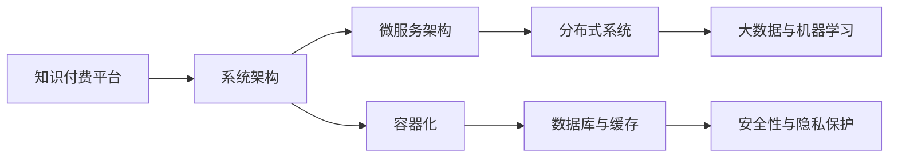

                 

# 知识付费平台的技术架构：从0到1的构建

## 1. 背景介绍

### 1.1 问题由来
随着信息时代的发展，人们对于知识的渴求日益增长。传统的知识获取方式，如阅读书籍、观看视频等，已经难以满足用户对个性化、高质量内容的需求。于是，知识付费平台应运而生，通过付费订阅的方式，提供知识产品、专家讲座、个性推荐等服务，帮助用户高效学习、快速成长。

知识付费平台不仅涉及内容生产、知识变现，还囊括了用户管理、交易结算、数据分析等多个方面。如何构建一个高效、稳定、易于维护的知识付费平台，成为了各大平台竞相攻克的难题。本文将系统介绍知识付费平台的技术架构，从零到一构建平台的全过程。

### 1.2 问题核心关键点
构建知识付费平台的关键点包括以下几个方面：
- **系统架构设计**：选择合适的技术栈，设计合理的数据库和缓存架构，确保系统的高可用性和扩展性。
- **用户管理与认证**：设计用户身份认证、权限控制、会员管理等功能，保障平台安全性和用户体验。
- **知识产品管理**：实现知识产品的上传、分类、搜索、展示等功能，满足用户多样化的需求。
- **支付与结算系统**：搭建支付网关、支付通知、退款等核心功能，保证交易的安全性和可靠性。
- **数据分析与推荐**：使用大数据和机器学习技术，实现用户画像构建、个性化推荐等功能，提升用户粘性。

本文将逐一解答这些关键点，并结合实际案例，给出从零到一构建知识付费平台的技术路径。

## 2. 核心概念与联系

### 2.1 核心概念概述

为更好地理解知识付费平台的技术架构，本文将介绍几个核心概念：

- **知识付费平台**：通过付费方式提供高质量知识服务，如在线课程、专家讲座、个性化推荐等。
- **系统架构**：指系统的整体设计方案，包括技术栈选择、模块划分、数据流设计等。
- **分布式系统**：指将系统组件分布在多个服务器上的架构设计，提升系统的可扩展性和高可用性。
- **微服务架构**：指将系统拆分为多个小服务，每个服务独立运行、松散耦合的架构设计。
- **容器化**：指将系统组件封装为容器，方便部署、扩展和管理。
- **数据库与缓存**：指存储系统数据的工具，通常选用关系型数据库（如MySQL、PostgreSQL）和分布式缓存（如Redis）。
- **大数据与机器学习**：指利用大数据技术（如Hadoop、Spark）和机器学习技术（如TensorFlow、PyTorch），实现数据处理和模型训练。
- **安全性与隐私保护**：指采用数据加密、访问控制、日志审计等技术手段，保障用户数据和交易安全。

这些核心概念通过特定的技术栈和架构设计相互关联，共同构成知识付费平台的技术基础。

### 2.2 核心概念原理和架构的 Mermaid 流程图



以上流程图展示了知识付费平台的核心概念之间的联系：

1. **知识付费平台**通过**系统架构**来组织和设计技术栈，以实现各个功能模块的集成。
2. **微服务架构**拆分了系统的各个功能模块，便于独立开发、测试和部署。
3. **容器化**技术确保了各个服务模块的一致性，方便扩展和移植。
4. **分布式系统**将各个服务模块分布在不同的服务器上，提升了系统的稳定性和扩展性。
5. **数据库与缓存**提供数据存储和访问的支撑，保障了系统的高效性和可靠性。
6. **大数据与机器学习**技术用于处理海量数据，实现个性化推荐等功能。
7. **安全性与隐私保护**确保用户数据和交易的安全，提升了用户信任度。

通过理解这些核心概念的原理和架构，可以帮助开发者设计出高效、可靠的知识付费平台。

## 3. 核心算法原理 & 具体操作步骤
### 3.1 算法原理概述

知识付费平台的核心算法主要涉及以下几个方面：

- **推荐算法**：根据用户行为数据和内容特征，为用户推荐合适的知识产品。
- **搜索算法**：利用全文搜索和分词技术，实现知识产品的快速检索。
- **个性化设置**：基于用户画像和行为数据，提供个性化的学习路径和内容推荐。
- **用户行为分析**：分析用户的行为数据，优化推荐算法和内容设计。
- **反作弊机制**：通过行为监测和异常检测，防止数据篡改和作弊行为。

这些算法是知识付费平台的核心竞争力，直接影响用户体验和平台盈利。

### 3.2 算法步骤详解

构建知识付费平台的推荐算法主要包括以下几个步骤：

**Step 1: 数据收集与预处理**
- 收集用户行为数据，如浏览记录、购买记录、评价数据等。
- 利用数据清洗和特征提取技术，去除噪音和冗余，提取有用的特征向量。

**Step 2: 模型训练**
- 选择合适的推荐算法，如协同过滤、内容推荐、混合推荐等。
- 将特征向量输入训练集，使用机器学习算法训练推荐模型。
- 在验证集上评估模型性能，调整模型参数，优化算法效果。

**Step 3: 实时推荐**
- 将用户行为数据实时输入推荐模型，得到推荐的知识产品列表。
- 使用缓存技术，提升推荐速度，保障用户响应时延。
- 根据推荐结果动态调整展示策略，提高用户体验。

### 3.3 算法优缺点

推荐算法具有以下优点：
- 提高用户粘性：通过个性化推荐，满足用户多样化需求，提升用户满意度。
- 提升平台营收：精准推荐高价值知识产品，提升用户转化率和付费意愿。
- 优化运营策略：通过用户行为分析，优化推荐算法和内容设计，提升平台运营效率。

但推荐算法也存在以下缺点：
- 数据需求量大：需要大量用户行为数据，才能训练出高效的推荐模型。
- 算法复杂度高：推荐算法涉及用户画像构建、内容特征提取等多个步骤，算法复杂度高。
- 容易过拟合：推荐算法容易在训练集上过拟合，导致泛化性能差。

### 3.4 算法应用领域

推荐算法在知识付费平台上应用广泛，具体如下：

- **课程推荐**：根据用户浏览历史和评价数据，推荐感兴趣的课程。
- **学习路径推荐**：根据用户的学习进度和知识水平，推荐适合的课程序列。
- **新课推荐**：根据课程更新时间、用户兴趣标签等，推荐最新上架的课程。
- **个性化广告推荐**：根据用户行为数据，推荐相关广告，提升广告投放效果。
- **内容推荐**：根据用户兴趣和浏览行为，推荐相关文章、报告、书籍等。

## 4. 数学模型和公式 & 详细讲解 & 举例说明

### 4.1 数学模型构建

知识付费平台的推荐算法主要基于协同过滤和矩阵分解。下面以协同过滤算法为例，介绍推荐模型的数学模型构建。

设用户集合为 $U$，物品集合为 $I$，用户对物品的评分矩阵为 $R$，初始化矩阵为 $R_0$。协同过滤算法的目标是找到矩阵 $R$ 中的缺失值，即用户对物品的评分。

设用户 $u$ 对物品 $i$ 的评分为 $r_{ui}$，则协同过滤算法的目标是最小化矩阵 $R$ 的重建误差，即：

$$
\min_{R} ||R - R_0||_F^2
$$

其中 $||.||_F$ 表示矩阵的 Frobenius 范数。

### 4.2 公式推导过程

协同过滤算法主要分为基于用户的协同过滤和基于物品的协同过滤两种。下面以基于用户的协同过滤为例，推导推荐公式。

设用户 $u$ 对物品 $i$ 的预测评分为 $\hat{r}_{ui}$，则基于用户的协同过滤推荐公式为：

$$
\hat{r}_{ui} = \frac{\sum_{v \in N(u)} r_{vi} \times w_v}{\sqrt{\sum_{v \in N(u)} w_v} \times \sqrt{\sum_{v \in N(i)} w_v}}
$$

其中 $N(u)$ 表示用户 $u$ 的邻域，即与用户 $u$ 评分物品相同的用户集合。$w_v$ 表示邻域用户的权重，通常使用用户评分均值标准化。

### 4.3 案例分析与讲解

假设有一个知识付费平台，拥有 $M$ 个课程和 $N$ 个用户，每个用户对每个课程都有一个评分。初始化评分矩阵为 $R_0$。现在需要根据用户的评分，预测用户对新课程的评分，以推荐课程给用户。

通过协同过滤算法，对用户 $u$ 的邻域 $N(u)$ 进行评分加权平均，即可得到用户 $u$ 对课程 $i$ 的预测评分 $\hat{r}_{ui}$。具体实现可以使用矩阵计算库（如NumPy、SciPy等）进行计算。

## 5. 项目实践：代码实例和详细解释说明
### 5.1 开发环境搭建

开发知识付费平台的推荐算法需要以下环境：

- **Python**：作为编程语言。
- **NumPy**：用于矩阵计算。
- **SciPy**：用于科学计算。
- **TensorFlow** 或 **PyTorch**：用于机器学习模型的构建和训练。
- **Docker** 和 **Kubernetes**：用于容器化和分布式部署。
- **MySQL** 或 **PostgreSQL**：用于关系型数据库存储。
- **Redis**：用于分布式缓存。

开发环境搭建步骤如下：

1. 安装Python、NumPy、SciPy等依赖包。
2. 搭建Docker容器，编写Dockerfile文件。
3. 在Docker容器中安装TensorFlow或PyTorch。
4. 配置MySQL或PostgreSQL数据库。
5. 搭建Redis缓存服务。

### 5.2 源代码详细实现

以下是使用TensorFlow实现协同过滤算法的代码示例：

```python
import tensorflow as tf
import numpy as np
import pandas as pd

# 读取评分矩阵
R_0 = pd.read_csv('ratings.csv')

# 构建用户-物品评分矩阵
M = len(R_0.index)
N = len(R_0.columns)
R = tf.convert_to_tensor(R_0.values, dtype=tf.float32)

# 构建邻域用户评分矩阵
R_u = tf.keras.layers.Lambda(lambda x: tf.linalg.matrix_transpose(x), name='R_u')(R)

# 构建用户-物品邻域评分矩阵
R_ui = tf.linalg.matmul(R_u, R_0)

# 构建用户-物品邻域评分矩阵的权重矩阵
W_u = tf.keras.layers.Lambda(lambda x: tf.linalg.matrix_transpose(x), name='W_u')(R_u)
W_i = tf.keras.layers.Lambda(lambda x: tf.linalg.matrix_transpose(x), name='W_i')(R_0)
W = tf.keras.layers.Lambda(lambda x: tf.math.multiply(x, tf.math.multiply(tf.math.sqrt(tf.reduce_sum(x, axis=0)), tf.math.sqrt(tf.reduce_sum(x, axis=1))), name='W')(tf.concat([W_u, W_i], axis=1))

# 构建预测评分模型
model = tf.keras.Sequential([
    tf.keras.layers.Lambda(lambda x: x * W, name='prediction')(R_ui),
    tf.keras.layers.Lambda(lambda x: tf.reduce_mean(x, axis=1), name='mean_prediction')
])

# 训练模型
model.compile(optimizer=tf.keras.optimizers.Adam(learning_rate=0.01), loss='mean_squared_error')
model.fit(R_u, R_0, epochs=10, validation_data=(W_u, W_i), batch_size=64)

# 预测评分
u = 0
i = 3
prediction = model.predict(tf.reshape(R_0.iloc[u] * W_i, (1, 3)))
```

以上代码实现了基于用户的协同过滤算法，对用户 $u$ 对物品 $i$ 的评分进行预测。

### 5.3 代码解读与分析

在上述代码中，主要涉及以下步骤：

1. **数据读取**：使用Pandas库读取评分矩阵。
2. **数据转换**：将评分矩阵转换为TensorFlow张量。
3. **邻域评分矩阵计算**：使用矩阵转置和矩阵乘法计算邻域评分矩阵。
4. **邻域评分矩阵权重计算**：使用矩阵乘法和平方根计算邻域评分矩阵的权重矩阵。
5. **预测评分模型构建**：使用TensorFlow的Sequential模型搭建预测评分模型。
6. **模型训练**：使用Adam优化器和均方误差损失函数训练模型。
7. **预测评分**：使用训练好的模型预测用户 $u$ 对物品 $i$ 的评分。

通过这些步骤，即可构建基于协同过滤的推荐系统，实现知识付费平台推荐课程的功能。

### 5.4 运行结果展示

在训练过程中，可以使用Docker容器在分布式系统中进行模型训练。训练结束后，使用Redis缓存服务进行实时推荐。

## 6. 实际应用场景

### 6.1 智能推荐系统

知识付费平台的推荐系统可以为用户提供智能推荐服务，推荐其感兴趣的知识产品。例如，用户浏览了某个课程，推荐系统会根据用户的行为数据，推荐其他相关课程。

推荐系统的应用场景包括：
- **课程推荐**：根据用户浏览历史和评价数据，推荐感兴趣的课程。
- **学习路径推荐**：根据用户的学习进度和知识水平，推荐适合的课程序列。
- **新课推荐**：根据课程更新时间、用户兴趣标签等，推荐最新上架的课程。

### 6.2 个性化广告推荐

知识付费平台的推荐系统还可以用于个性化广告推荐。例如，平台可以在搜索结果页或登录页展示相关广告，提高广告投放效果。

个性化广告推荐的应用场景包括：
- **广告推荐**：根据用户浏览历史和兴趣标签，推荐相关广告。
- **活动推荐**：根据用户行为数据，推荐相关的营销活动。
- **推荐墙**：展示热门课程和热门推荐，吸引用户点击。

### 6.3 用户行为分析

知识付费平台的推荐系统可以分析用户的行为数据，优化推荐算法和内容设计。例如，根据用户的浏览记录和评价数据，平台可以调整推荐策略，提高用户满意度。

用户行为分析的应用场景包括：
- **用户画像构建**：分析用户的行为数据，构建用户画像，了解用户兴趣和需求。
- **行为分析报告**：生成用户行为分析报告，优化推荐算法和内容设计。
- **内容反馈机制**：根据用户反馈，调整课程内容和推荐策略。

## 7. 工具和资源推荐

### 7.1 学习资源推荐

为了帮助开发者系统掌握知识付费平台的技术架构，这里推荐一些优质的学习资源：

1. **《深度学习与推荐系统》书籍**：该书深入浅出地介绍了推荐系统的基本原理和算法，适合初学者和进阶开发者。
2. **Coursera《推荐系统》课程**：斯坦福大学开设的推荐系统课程，系统讲解了推荐系统的主要算法和应用场景。
3. **Kaggle推荐系统竞赛**：Kaggle上多个推荐系统竞赛，提供了大量真实数据集和开源代码，帮助开发者实践推荐算法。
4. **TensorFlow官方文档**：TensorFlow的官方文档，提供了丰富的API和示例，帮助开发者快速上手。
5. **PyTorch官方文档**：PyTorch的官方文档，提供了详细的教程和示例，适合深度学习初学者和高级开发者。

通过这些资源的学习实践，相信你一定能够快速掌握知识付费平台的推荐系统，并用于解决实际的推荐问题。

### 7.2 开发工具推荐

高效的开发离不开优秀的工具支持。以下是几款用于知识付费平台推荐系统开发的常用工具：

1. **TensorFlow**：基于数据流图（Graph）的深度学习框架，适合构建复杂推荐模型。
2. **PyTorch**：动态计算图的深度学习框架，适合快速迭代研究。
3. **Docker**：容器化技术，方便部署和扩展。
4. **Kubernetes**：分布式部署和管理工具，支持大规模系统扩展。
5. **MySQL**：关系型数据库，适合存储结构化数据。
6. **Redis**：分布式缓存，提升推荐系统响应速度。

合理利用这些工具，可以显著提升知识付费平台推荐系统的开发效率，加快创新迭代的步伐。

### 7.3 相关论文推荐

知识付费平台的推荐系统涉及多种前沿技术，以下是几篇奠基性的相关论文，推荐阅读：

1. **《矩阵分解算法与推荐系统》论文**：详细介绍了矩阵分解算法在推荐系统中的应用，是推荐系统领域的经典之作。
2. **《深度学习在推荐系统中的应用》论文**：展示了深度学习在推荐系统中的应用，提高了推荐模型的精度和效果。
3. **《协同过滤算法》论文**：介绍了协同过滤算法的原理和应用，是推荐系统中的重要算法之一。
4. **《基于深度学习的个性化推荐系统》论文**：展示了深度学习在个性化推荐系统中的应用，提高了推荐系统的个性化和多样性。
5. **《推荐系统中的数据挖掘与用户行为分析》论文**：介绍了推荐系统中的数据挖掘技术和用户行为分析方法，为优化推荐算法提供了参考。

这些论文代表了大规模知识付费平台推荐系统的发展脉络，通过学习这些前沿成果，可以帮助研究者把握学科前进方向，激发更多的创新灵感。

## 8. 总结：未来发展趋势与挑战

### 8.1 总结

本文对知识付费平台推荐系统的技术架构进行了全面系统的介绍。首先阐述了推荐系统的核心算法和架构设计，明确了推荐系统在提升用户粘性和平台营收方面的独特价值。其次，从原理到实践，详细讲解了推荐系统的数学模型和实现步骤，给出了推荐系统开发的全过程。同时，本文还广泛探讨了推荐系统在智能推荐、个性化广告、用户行为分析等多个应用场景中的实际应用，展示了推荐系统的巨大潜力。

通过本文的系统梳理，可以看到，推荐系统是知识付费平台的核心竞争力，直接影响用户体验和平台盈利。未来，伴随推荐算法的不断进步，知识付费平台的推荐系统必将在内容推荐、个性化服务、用户互动等方面取得更大的突破。

### 8.2 未来发展趋势

展望未来，推荐系统将呈现以下几个发展趋势：

1. **深度学习与机器学习结合**：推荐系统将越来越多地采用深度学习技术，提高推荐模型的精度和效果。同时，将机器学习算法与用户行为分析结合，提升推荐算法的个性化和多样性。
2. **分布式计算与大数据结合**：推荐系统将采用分布式计算技术，处理海量数据。同时，将大数据技术用于用户行为分析，优化推荐算法和内容设计。
3. **实时推荐与个性化结合**：推荐系统将实现实时推荐，根据用户实时行为数据，动态调整推荐策略，提升用户体验。同时，将个性化推荐与用户行为分析结合，提高推荐系统的精准度和个性化程度。
4. **跨平台推荐与多模态结合**：推荐系统将实现跨平台推荐，结合用户的多模态数据，提升推荐效果。同时，将推荐系统与自然语言处理、图像识别等技术结合，实现多模态推荐。
5. **社交推荐与知识图谱结合**：推荐系统将实现社交推荐，结合用户社交网络信息，提升推荐效果。同时，将推荐系统与知识图谱结合，实现基于知识的推荐。

以上趋势凸显了推荐系统的广阔前景。这些方向的探索发展，必将进一步提升推荐系统的性能和应用范围，为知识付费平台带来更大的商业价值。

### 8.3 面临的挑战

尽管推荐系统已经取得了瞩目成就，但在迈向更加智能化、普适化应用的过程中，它仍面临诸多挑战：

1. **数据质量与隐私保护**：推荐系统需要大量高质量的数据，同时用户数据隐私保护也是一个重要问题。如何保障数据质量和隐私安全，将是一大挑战。
2. **模型复杂性与可解释性**：推荐模型通常较为复杂，难以解释其内部工作机制和决策逻辑。如何在保证精度的同时，提高模型的可解释性，将是重要的研究方向。
3. **冷启动问题**：新用户或新物品通常缺乏行为数据，难以进行推荐。如何解决冷启动问题，提高推荐效果，将是一大难题。
4. **算法鲁棒性与稳定性**：推荐算法容易在训练集上过拟合，导致泛化性能差。如何在保证鲁棒性的同时，提高算法稳定性，将是重要的研究方向。
5. **资源消耗与性能优化**：推荐系统需要处理海量数据，资源消耗较大。如何优化资源消耗，提高系统性能，将是重要的研究方向。

### 8.4 研究展望

面对推荐系统面临的种种挑战，未来的研究需要在以下几个方面寻求新的突破：

1. **优化推荐模型结构**：研究更高效、更简洁的推荐模型结构，减少资源消耗，提高推荐速度。
2. **提升推荐模型可解释性**：研究更易于解释的推荐模型，提高推荐系统的透明度和可信度。
3. **解决冷启动问题**：研究冷启动问题的解决方案，如多模态推荐、迁移学习等，提高推荐系统的泛化能力。
4. **优化推荐算法鲁棒性**：研究更鲁棒的推荐算法，如对抗训练、半监督学习等，提高推荐系统的泛化性能。
5. **优化资源消耗**：研究资源优化技术，如压缩技术、分布式计算等，提高推荐系统的性能。
6. **融合多模态数据**：研究多模态数据的融合方法，提高推荐系统的泛化能力。
7. **知识图谱结合**：研究知识图谱与推荐系统的结合方法，提升推荐系统的准确性和多样性。

这些研究方向的探索，必将引领推荐系统向更高的台阶，为知识付费平台带来更大的商业价值。面向未来，推荐系统还需要与其他人工智能技术进行更深入的融合，如自然语言处理、图像识别等，多路径协同发力，共同推动推荐系统的进步。

## 9. 附录：常见问题与解答

**Q1：如何构建推荐系统？**

A: 构建推荐系统主要涉及以下几个步骤：
1. 数据收集与预处理：收集用户行为数据和物品特征数据，进行数据清洗和特征提取。
2. 模型选择与训练：选择合适的推荐算法，如协同过滤、内容推荐、混合推荐等，使用机器学习算法训练推荐模型。
3. 实时推荐：根据用户行为数据，实时计算推荐结果，使用缓存技术提升推荐速度。
4. 模型优化与评估：使用测试集评估推荐模型的性能，调整模型参数和算法，优化推荐策略。

**Q2：推荐系统的数据质量如何保障？**

A: 推荐系统的数据质量保障主要涉及以下几个方面：
1. 数据采集与存储：确保数据采集和存储的完整性和准确性。
2. 数据清洗与处理：使用数据清洗技术，去除噪音和冗余，提取有用的特征。
3. 数据隐私保护：采用数据加密、访问控制等技术手段，保障用户数据隐私。
4. 数据实时更新：使用数据管道和实时计算技术，实现数据的实时更新和处理。

**Q3：推荐系统的冷启动问题如何解决？**

A: 推荐系统的冷启动问题可以通过以下几种方法解决：
1. 多模态数据融合：结合用户的多模态数据（如行为数据、社交网络数据等），提升推荐效果。
2. 迁移学习：利用预训练模型，将知识迁移到新用户或新物品，提高推荐效果。
3. 半监督学习：利用部分标注数据和未标注数据，提高推荐算法的泛化能力。
4. 主动学习：通过主动采样方法，获取更多有价值的数据，提高推荐效果。

**Q4：推荐系统的鲁棒性与稳定性如何保障？**

A: 推荐系统的鲁棒性与稳定性保障主要涉及以下几个方面：
1. 对抗训练：通过加入对抗样本，提高推荐算法的鲁棒性。
2. 半监督学习：利用部分标注数据和未标注数据，提高推荐算法的泛化能力。
3. 参数优化与调参：使用更稳定的优化器，进行合理的参数优化，提高推荐算法的稳定性。
4. 实时监控与告警：实时监控推荐系统的性能，设置异常告警阈值，及时发现和解决问题。

**Q5：推荐系统的资源消耗与性能优化如何优化？**

A: 推荐系统的资源消耗与性能优化主要涉及以下几个方面：
1. 模型压缩与优化：使用模型压缩技术和优化算法，减少模型大小和资源消耗。
2. 分布式计算与缓存：使用分布式计算技术和缓存技术，提升推荐系统的响应速度。
3. 数据压缩与索引：使用数据压缩和索引技术，减少数据存储和处理的时间。
4. 实时数据处理：使用实时计算技术，实现数据的实时处理和更新。

这些方法可以有效提高推荐系统的性能，减少资源消耗，提升用户体验。

---

作者：禅与计算机程序设计艺术 / Zen and the Art of Computer Programming

