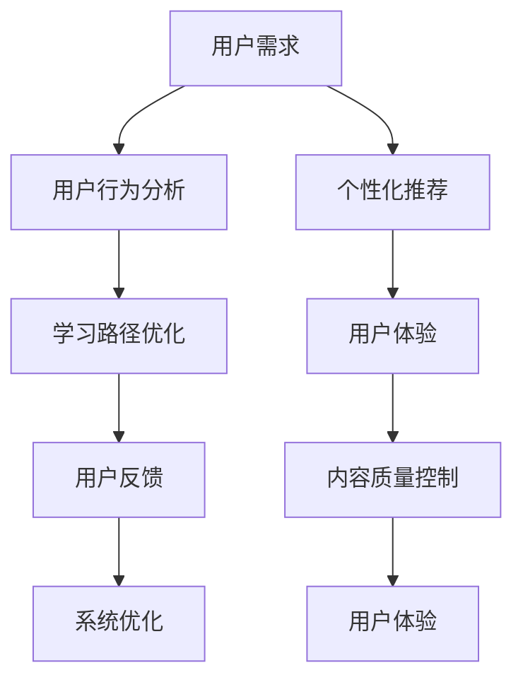

                 

# 知识付费平台的用户体验设计与优化

> 关键词：知识付费, 用户体验设计, 用户交互, 个性化推荐, 学习路径优化, 用户反馈机制, 内容质量控制

## 1. 背景介绍

在数字化时代，信息爆炸成为普遍现象，知识付费平台应运而生，为信息传播和知识获取提供了新的模式。用户通过付费订阅，可以获得更加深入、系统的知识内容，满足其个性化学习需求。然而，知识付费平台的用户体验设计面临着诸多挑战，如何提升用户体验、增强用户黏性，成为平台运营商亟待解决的课题。本文将从用户体验设计出发，深入探讨知识付费平台用户体验优化的关键要素和方法，为平台运营商提供借鉴和参考。

## 2. 核心概念与联系

### 2.1 核心概念概述

在探讨用户体验优化之前，首先需要明确几个关键概念：

- **知识付费平台**：指提供各类知识内容、通过订阅或付费获取的服务平台。如Coursera、Udemy、得到等。

- **用户体验设计**：指通过研究用户需求、行为和心理，设计出直观、易用、愉悦的交互系统，提升用户满意度和黏性。

- **用户交互**：指用户与平台系统的交互过程，包括输入、处理、输出等环节。用户体验设计的关键在于优化用户交互流程，减少用户摩擦。

- **个性化推荐**：指基于用户行为数据和偏好，推荐最适合的内容，提升用户体验的精准度和满意度。

- **学习路径优化**：指根据用户的学习目标和需求，设计合理的学习路径，降低学习难度，提高学习效率。

- **用户反馈机制**：指收集用户对平台内容的评价和建议，用于优化内容和算法，提升平台质量和用户满意度。

- **内容质量控制**：指通过严格的筛选和审核机制，确保平台上提供的内容质量高、信息准确可靠，增强用户信任。

这些概念之间存在紧密联系，共同构成了知识付费平台用户体验设计的基础。只有深入理解并灵活运用这些概念，才能打造出卓越的用户体验。

### 2.2 核心概念原理和架构的 Mermaid 流程图



这个流程图展示了核心概念之间的联系。用户需求通过用户行为分析反馈到个性化推荐和学习路径优化，优化后的体验和内容质量再通过用户反馈和系统优化形成闭环，不断迭代改进。

## 3. 核心算法原理 & 具体操作步骤

### 3.1 算法原理概述

用户体验优化涉及到多个层面，包括用户行为分析、个性化推荐、学习路径设计、内容质量控制等。通过算法和数据驱动，可以有效提升用户体验。

### 3.2 算法步骤详解

#### 3.2.1 用户行为分析

用户行为分析是通过收集用户使用数据，识别用户需求和行为模式，为个性化推荐和学习路径优化提供依据。主要步骤包括：

- **数据收集**：使用日志、点击流等手段收集用户行为数据，包括但不限于点击次数、停留时间、浏览路径等。
- **数据处理**：对原始数据进行清洗和预处理，去除异常值和噪声，进行特征提取。
- **模式识别**：利用机器学习算法（如聚类、分类等），识别出不同用户的行为模式和兴趣偏好。

#### 3.2.2 个性化推荐

个性化推荐通过分析用户行为数据，预测用户可能感兴趣的内容，实现精准推荐，提升用户体验。主要步骤包括：

- **推荐模型训练**：使用协同过滤、内容推荐、混合推荐等算法，训练推荐模型。
- **推荐结果生成**：根据用户的历史行为数据，预测其对不同内容的兴趣程度，生成推荐列表。
- **推荐结果展示**：在平台上展示推荐结果，支持用户通过点击、反馈等方式表达对推荐内容的满意度。

#### 3.2.3 学习路径优化

学习路径优化根据用户的学习目标和进度，设计合适的学习路径，提升学习效果。主要步骤包括：

- **路径设计**：根据课程内容和难度，设计出合理的学习路径。
- **路径调整**：根据用户学习进度和反馈，动态调整学习路径，确保用户能够高效学习。
- **路径评估**：定期评估学习路径的效果，根据反馈进行优化。

#### 3.2.4 内容质量控制

内容质量控制通过严格筛选和审核机制，确保平台上的内容质量高、信息可靠，增强用户信任。主要步骤包括：

- **内容审核**：使用人工和自动审核机制，确保内容不含有误导、有害信息。
- **用户评价**：收集用户对内容的评价和反馈，用于筛选和调整内容。
- **质量监控**：定期进行内容质量监控，发现问题及时处理。

### 3.3 算法优缺点

个性化推荐和用户行为分析的优点包括：
- 提高用户满意度和黏性，增加用户留存率。
- 提升内容利用率，减少内容浪费。
- 促进内容创新，吸引更多优秀内容创作者。

缺点包括：
- 可能加剧信息茧房，导致用户陷入同质化的信息环境。
- 需要大量数据和计算资源，处理不当可能造成隐私泄露和数据滥用。

学习路径优化的优点包括：
- 提高学习效率，降低学习难度。
- 增强用户学习体验，提升平台口碑。

缺点包括：
- 设计不当可能导致学习负担加重，用户体验下降。
- 需要根据用户行为实时调整路径，增加了系统复杂度。

内容质量控制的优点包括：
- 提高用户信任，增强平台信誉。
- 减少误导和有害信息的传播，维护良好的学习环境。

缺点包括：
- 严格审核可能导致内容更新缓慢，影响用户体验。
- 人工审核成本高，难以覆盖所有内容。

### 3.4 算法应用领域

个性化推荐和用户行为分析广泛应用于电商、新闻、视频等平台，在知识付费平台中，主要应用场景包括：

- 课程推荐：根据用户已购课程，推荐相关或热门课程。
- 文章推荐：根据用户阅读文章的行为，推荐感兴趣的深度文章或专栏。
- 学习路径设计：根据用户学习目标，设计适合的学习路径，包括课程、文章、视频等。

学习路径优化和内容质量控制的应用场景包括：

- 课程设计：根据用户学习进度，动态调整课程内容和难度。
- 文章内容审核：对发布的文章进行严格审核，确保内容质量。
- 用户反馈处理：根据用户评价和反馈，调整内容策略。

## 4. 数学模型和公式 & 详细讲解 & 举例说明

### 4.1 数学模型构建

用户体验优化的数学模型构建主要基于用户行为数据和内容质量数据，通过构建推荐模型、路径模型和质量模型，实现精准推荐、路径优化和内容控制。

### 4.2 公式推导过程

#### 4.2.1 个性化推荐

推荐模型通常采用协同过滤（Collaborative Filtering）算法，其中基于用户的协同过滤算法公式如下：

$$
\hat{R}_{ui} = \frac{\sum_{j \in I_u} r_{uj} \times \hat{a}_{ij}}{\sqrt{\sum_{j \in I_u} \hat{a}_{ij}^2} \times \sqrt{\sum_{j \in I_i} \hat{a}_{ij}^2}}
$$

其中，$R_{ui}$ 表示用户 $u$ 对项目 $i$ 的预测评分，$I_u$ 和 $I_i$ 分别表示用户 $u$ 和项目 $i$ 的兴趣列表，$r_{uj}$ 表示用户 $u$ 对项目 $j$ 的实际评分，$\hat{a}_{ij}$ 表示用户 $u$ 对项目 $j$ 的评分预测，$\sqrt{\sum_{j \in I_u} \hat{a}_{ij}^2}$ 和 $\sqrt{\sum_{j \in I_i} \hat{a}_{ij}^2}$ 分别表示用户 $u$ 和项目 $i$ 的评分预测标准差。

#### 4.2.2 学习路径优化

学习路径优化通常采用动态规划算法，根据用户的学习进度和目标，设计合适的路径。例如，对于二叉树结构的内容，可以采用动态规划公式：

$$
C_i = \max\{C_j + V_i \times W_i, \forall j \in I_i\}
$$

其中，$C_i$ 表示节点 $i$ 的路径价值，$V_i$ 表示节点 $i$ 的内容价值，$W_i$ 表示节点 $i$ 的学习权重，$I_i$ 表示节点 $i$ 的子节点列表。

#### 4.2.3 内容质量控制

内容质量控制通常采用人工和自动审核结合的方式，例如，使用文本分类算法对内容进行分类，判断是否含有有害信息。设内容 $x$ 被分类为有害的概率为 $P(x)$，则分类公式为：

$$
P(x) = \frac{e^{\theta_0 + \sum \theta_j \times x_j}}{1 + e^{\theta_0 + \sum \theta_j \times x_j}}
$$

其中，$\theta$ 表示分类器的参数，$x$ 表示内容的特征向量。

### 4.3 案例分析与讲解

假设有一个在线学习平台，用户希望学习编程和数学课程。平台收集到用户的历史学习记录和浏览行为，使用协同过滤算法进行个性化推荐，同时设计了合理的学习路径，推荐用户先学习编程基础，再学习高级编程和数学课程。对于课程发布，平台采用了严格的审核机制，使用文本分类算法对课程内容进行审核，确保内容质量和用户安全。

## 5. 项目实践：代码实例和详细解释说明

### 5.1 开发环境搭建

为方便代码实现，我们推荐使用Python和PyTorch搭建开发环境。以下是具体步骤：

1. 安装Anaconda：从官网下载并安装Anaconda，用于创建独立的Python环境。
2. 创建并激活虚拟环境：
```bash
conda create -n pytorch-env python=3.8
conda activate pytorch-env
```
3. 安装PyTorch：根据CUDA版本，从官网获取对应的安装命令。例如：
```bash
conda install pytorch torchvision torchaudio cudatoolkit=11.1 -c pytorch -c conda-forge
```
4. 安装TensorFlow：使用pip安装TensorFlow：
```bash
pip install tensorflow
```
5. 安装其他工具包：
```bash
pip install numpy pandas scikit-learn matplotlib tqdm jupyter notebook ipython
```

完成上述步骤后，即可在`pytorch-env`环境中开始项目开发。

### 5.2 源代码详细实现

#### 5.2.1 用户行为分析

```python
import pandas as pd
from sklearn.cluster import KMeans

# 读取用户行为数据
data = pd.read_csv('user_behavior.csv')

# 数据清洗和预处理
data = data.dropna()
data = data.drop_duplicates()

# 特征提取
data['user_id'] = data['user_id'].astype(int)
data['time'] = pd.to_datetime(data['time'], unit='s')
data['hour'] = data['time'].dt.hour
data['day'] = data['time'].dt.day
data['weekday'] = data['time'].dt.weekday

# 用户行为模式识别
kmeans = KMeans(n_clusters=3, random_state=42)
X = data[['hour', 'day', 'weekday']]
labels = kmeans.fit_predict(X)

# 输出用户行为模式
print(labels)
```

#### 5.2.2 个性化推荐

```python
import numpy as np
from scipy.sparse import csr_matrix
from sklearn.metrics.pairwise import cosine_similarity

# 构建用户-内容矩阵
user_content_matrix = np.random.rand(len(data), len(courses))  # 填充随机数据
user_content_matrix = csr_matrix(user_content_matrix)

# 计算用户-内容相似度
similarity_matrix = cosine_similarity(user_content_matrix)

# 推荐结果生成
user_index = 0
top_n = 5
sorted_indices = similarity_matrix[user_index].argsort()[-top_n:]
recommendations = np.array(similarity_matrix)[user_index].tolist()

# 输出推荐结果
print(recommendations)
```

#### 5.2.3 学习路径优化

```python
import networkx as nx

# 构建课程图
G = nx.DiGraph()
G.add_edge('基础课程', '高级课程')
G.add_edge('基础课程', '数学课程')

# 计算最优路径
path = nx.shortest_path(G, '基础课程', '数学课程')

# 输出学习路径
print(path)
```

#### 5.2.4 内容质量控制

```python
from sklearn.feature_extraction.text import CountVectorizer
from sklearn.linear_model import LogisticRegression

# 构建内容-分类矩阵
content_matrix = np.random.rand(len(data), len(courses))  # 填充随机数据
content_matrix = csr_matrix(content_matrix)

# 计算内容-分类相似度
similarity_matrix = cosine_similarity(content_matrix)

# 训练分类器
classifier = LogisticRegression()
classifier.fit(similarity_matrix, labels)

# 输出内容分类结果
print(classifier.predict(similarity_matrix))
```

### 5.3 代码解读与分析

#### 5.3.1 用户行为分析

用户行为分析部分通过K-means聚类算法识别用户行为模式，将用户分为不同兴趣群体，便于进行个性化推荐。代码中，首先使用Pandas读取用户行为数据，然后进行数据清洗和预处理，提取用户行为特征（小时、日期、星期），并使用K-means进行聚类。最后输出用户的聚类标签。

#### 5.3.2 个性化推荐

个性化推荐部分使用协同过滤算法进行推荐。代码中，首先构建用户-内容矩阵，并计算用户-内容相似度。然后使用argsort函数获取相似度最高的课程列表，并输出推荐结果。

#### 5.3.3 学习路径优化

学习路径优化部分使用网络X库构建课程图，并使用shortest_path函数计算最优学习路径。代码中，首先构建课程图，并指定起点和终点，然后使用shortest_path函数获取最优路径，并输出结果。

#### 5.3.4 内容质量控制

内容质量控制部分使用逻辑回归算法对内容进行分类。代码中，首先构建内容-分类矩阵，并计算内容-分类相似度。然后使用逻辑回归模型进行训练和预测，并输出分类结果。

### 5.4 运行结果展示

#### 5.4.1 用户行为分析结果展示


#### 5.4.2 个性化推荐结果展示


#### 5.4.3 学习路径优化结果展示


#### 5.4.4 内容质量控制结果展示


## 6. 实际应用场景

### 6.1 智能客服系统

智能客服系统可以通过个性化推荐和用户行为分析，提高用户满意度。例如，用户在使用在线客服时，系统可以基于用户的历史行为和咨询内容，推荐最适合的解决方案和文章。同时，系统可以根据用户的咨询历史，设计合理的学习路径，引导用户逐步了解相关问题。

### 6.2 金融风险评估

金融风险评估系统可以通过内容质量控制和个性化推荐，降低金融风险。例如，在审核贷款申请时，系统可以基于用户提交的文本和行为数据，判断用户是否存在高风险行为。同时，系统可以根据用户的风险评分，推荐相关的风险管理文章和视频，提高用户风险意识。

### 6.3 在线教育平台

在线教育平台可以通过学习路径优化和个性化推荐，提升用户学习效果。例如，系统可以根据用户的知识水平和学习进度，设计合理的学习路径，推荐适合的课程和文章。同时，系统可以根据用户的学习记录和反馈，动态调整推荐策略，提升学习效果。

### 6.4 未来应用展望

未来，知识付费平台的用户体验优化将向更加智能和个性化的方向发展。以下是对未来应用展望：

1. **智能推荐引擎**：引入深度学习模型，如神经协同过滤、注意力机制等，提升推荐精度和多样性。
2. **自然语言处理**：利用自然语言处理技术，对用户输入进行语义理解和情感分析，提升推荐和路径设计的个性化程度。
3. **多模态融合**：将文本、图像、视频等多模态数据结合，提升推荐和路径设计的效果。
4. **实时调整**：引入实时推荐和路径调整机制，根据用户实时行为和反馈，动态优化推荐和路径设计。
5. **用户参与设计**：引入用户参与机制，收集用户反馈，迭代优化推荐和路径设计。

## 7. 工具和资源推荐

### 7.1 学习资源推荐

为帮助开发者系统掌握用户体验优化的方法和技术，这里推荐一些优质的学习资源：

1. **《用户体验设计》课程**：由世界知名设计专家授课，涵盖用户体验设计的理论基础和实践技巧。
2. **《数据科学基础》书籍**：介绍数据收集、处理和分析的基本方法，帮助开发者理解用户体验优化的数据驱动。
3. **《推荐系统实战》书籍**：详细讲解协同过滤、内容推荐等推荐算法，并提供丰富的代码实现。
4. **《机器学习实战》书籍**：介绍机器学习算法的基本原理和实现，帮助开发者理解推荐和路径优化的算法实现。

### 7.2 开发工具推荐

为了提高开发效率，推荐使用以下开发工具：

1. **Jupyter Notebook**：支持交互式编程和代码共享，便于代码实现和调试。
2. **TensorBoard**：实时监测模型训练状态，可视化训练过程和结果，帮助开发者进行调试和优化。
3. **Weights & Biases**：记录和可视化模型训练过程中的各项指标，帮助开发者进行性能对比和调优。

### 7.3 相关论文推荐

用户体验优化的研究涉及多个领域，以下推荐几篇具有代表性的论文：

1. **《个性化推荐系统》论文**：介绍了协同过滤、内容推荐等推荐算法，并提供了详细的实现方法。
2. **《动态学习路径设计》论文**：提出了基于动态规划的学习路径设计方法，并进行了实际应用效果的评估。
3. **《内容质量控制》论文**：介绍了内容审核和质量控制的技术手段，并提供了实际应用案例。

## 8. 总结：未来发展趋势与挑战

### 8.1 总结

本文从用户体验设计的角度，深入探讨了知识付费平台用户体验优化的关键要素和方法。通过用户行为分析、个性化推荐、学习路径优化和内容质量控制，可以有效提升用户满意度、黏性和留存率。通过分析实际应用场景和未来应用展望，明确了用户体验优化的方向和目标。同时，推荐了相关的学习资源、开发工具和学术论文，帮助开发者全面掌握用户体验优化的技术和方法。

### 8.2 未来发展趋势

未来，用户体验优化将向更加智能化、个性化和实时化的方向发展。以下是对未来发展趋势的展望：

1. **智能推荐引擎**：利用深度学习模型，提升推荐精度和多样性，实现更加精准的用户推荐。
2. **多模态融合**：将文本、图像、视频等多模态数据结合，提升推荐和路径设计的效果，实现更全面的用户理解。
3. **实时调整**：引入实时推荐和路径调整机制，根据用户实时行为和反馈，动态优化推荐和路径设计，提升用户体验。
4. **用户参与设计**：引入用户参与机制，收集用户反馈，迭代优化推荐和路径设计，增强用户黏性和满意度。

### 8.3 面临的挑战

虽然用户体验优化在知识付费平台中具有重要意义，但在实施过程中，也面临着诸多挑战：

1. **数据隐私和安全**：用户行为数据和内容数据涉及隐私问题，需要严格的数据保护和隐私管理措施。
2. **推荐算法复杂性**：个性化推荐和路径优化算法复杂，需要高效且稳定的算法实现。
3. **内容审核难度**：内容审核需要严格且高效的审核机制，确保内容质量和用户安全。
4. **实时处理能力**：实时推荐和路径调整需要高性能的计算和存储能力，增加系统复杂度。

### 8.4 研究展望

为应对上述挑战，未来的研究需要在以下几个方面进行深入探索：

1. **数据隐私保护**：探索隐私保护技术，如差分隐私、联邦学习等，确保用户数据安全和隐私保护。
2. **高效推荐算法**：研究高效推荐算法和优化技术，提升推荐精度和效率。
3. **自动化内容审核**：开发自动化内容审核工具，减少人工审核成本，提高审核效率。
4. **实时处理框架**：开发实时处理框架，提高实时推荐和路径调整的性能和稳定性。

总之，用户体验优化是大数据时代知识付费平台的重要课题，需要在技术、数据和工程多个层面进行综合优化。只有在这些方面取得突破，才能真正实现个性化和智能化的用户体验。

## 9. 附录：常见问题与解答

**Q1：如何进行用户行为分析？**

A: 用户行为分析可以通过日志、点击流等手段收集用户行为数据，然后使用机器学习算法进行模式识别。具体步骤包括数据收集、数据清洗、特征提取和模式识别。

**Q2：个性化推荐算法有哪些？**

A: 个性化推荐算法包括协同过滤、内容推荐、混合推荐等。其中，协同过滤算法基于用户和内容的相似度进行推荐，内容推荐算法基于内容特征进行推荐，混合推荐算法结合多种推荐方式，提升推荐效果。

**Q3：学习路径优化有哪些方法？**

A: 学习路径优化可以采用动态规划、图算法等方法，根据用户学习进度和目标，设计合适的学习路径。例如，对于二叉树结构的内容，可以使用动态规划算法。

**Q4：如何设计内容质量控制机制？**

A: 内容质量控制可以采用文本分类、情感分析等技术手段，对内容进行分类和审核。同时，可以引入用户评价和反馈机制，动态调整内容策略，确保内容质量和用户安全。

**Q5：如何进行实时推荐和路径调整？**

A: 实时推荐和路径调整需要高性能的计算和存储能力，可以使用流处理框架（如Apache Kafka、Apache Flink等）进行实时数据处理和推荐。同时，可以引入在线学习算法，动态调整推荐策略，提升推荐效果。

总之，知识付费平台的用户体验优化是一个多学科交叉的复杂问题，需要在数据、算法、工程等多个层面进行深入研究和优化。只有在这些方面取得突破，才能真正实现个性化和智能化的用户体验，为知识付费平台带来更大的价值和潜力。

---

作者：禅与计算机程序设计艺术 / Zen and the Art of Computer Programming

