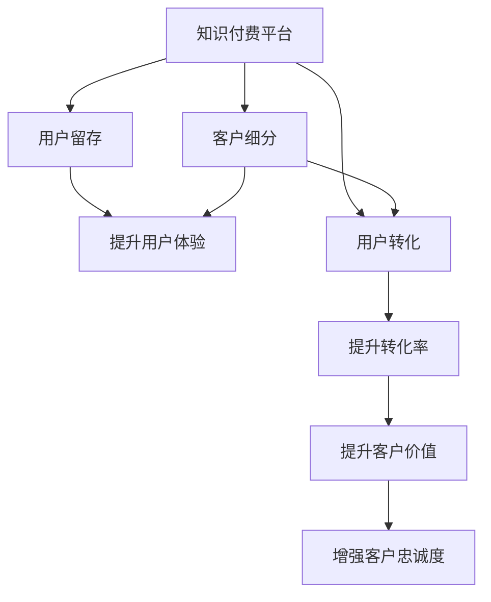

                 

# 知识付费平台的用户生命周期管理

> 关键词：知识付费,用户生命周期管理,客户细分,用户留存,用户转化,客户关系管理,推荐算法

## 1. 背景介绍

随着知识付费的兴起，知识付费平台（KPP, Knowledge-Payment Platform）在教育、科技、媒体等领域蓬勃发展。这些平台通过汇聚高水平的专业知识和经验，以在线课程、音频/视频讲座、电子书等多种形式，帮助用户获取学习资源，提升自身能力和技能。

然而，知识付费平台也面临着用户流失率高、客户获取成本高等问题，如何提高用户满意度和留存率，扩大用户基础，成为各大平台亟需解决的重要课题。本文旨在通过用户生命周期管理的视角，探讨如何通过系统化的方法和先进的技术手段，提升知识付费平台的用户体验和业务效果。

## 2. 核心概念与联系

### 2.1 核心概念概述

为更好地理解知识付费平台的用户生命周期管理方法，本节将介绍几个密切相关的核心概念：

- **知识付费平台**：指通过在线化方式，向用户提供有价值的学习资源，并通过付费模式实现收入的平台。
- **用户生命周期管理**：指从用户首次接触平台开始，到最终流失为止的各个阶段，通过系统化管理和优化，提升用户体验，延长用户生命周期，最终实现用户留存和转化的策略。
- **客户细分**：根据用户的属性、行为、需求等特征，将用户划分为不同的群体，以便有针对性地进行管理和营销。
- **用户留存**：指平台通过各种手段，减少用户流失率，提升用户在平台上的持续活跃度。
- **用户转化**：指将潜在用户转化为付费用户的策略，包括用户从免费到付费的过渡，以及用户从低价值向高价值的转化。
- **客户关系管理（CRM, Customer Relationship Management）**：指通过先进的技术手段和策略，建立和维护与用户之间良好、持久的关系。
- **推荐算法**：指基于用户行为和兴趣，推荐相关内容和资源，提升用户体验和转化的算法技术。

这些核心概念之间的逻辑关系可以通过以下Mermaid流程图来展示：



这个流程图展示了大平台的用户生命周期管理的核心概念及其之间的关系：

1. 知识付费平台通过客户细分和推荐算法，识别并满足不同用户的需求。
2. 用户留存通过提升用户体验来实现，包括但不限于内容质量、交互体验等。
3. 用户转化通过精准的推荐和个性化的服务实现，使用户从免费用户向付费用户转化。
4. 提升客户价值是知识付费平台的目标，通过持续的优化和创新，增强客户忠诚度，保持平台的长久发展。

## 3. 核心算法原理 & 具体操作步骤
### 3.1 算法原理概述

用户生命周期管理通过一系列算法和技术手段，系统化地分析和管理用户生命周期的各个阶段，以提升用户满意度和留存率，最终实现用户转化和业务增长。其核心思想是：通过对用户的全生命周期数据进行分析，识别用户行为模式，预测用户流失风险，设计针对性的管理策略。

形式化地，假设用户生命周期由 $n$ 个阶段构成，分别对应用户的获取、激活、留存、忠诚、流失等不同状态。用户生命周期管理的优化目标是最小化流失率，即找到最优策略：

$$
\theta^* = \mathop{\arg\min}_{\theta} P_{\text{流失}}(\theta)
$$

其中 $P_{\text{流失}}(\theta)$ 表示在策略 $\theta$ 下，用户流失的概率。

### 3.2 算法步骤详解

用户生命周期管理的算法步骤如下：

**Step 1: 数据收集与预处理**
- 收集用户在使用平台过程中的所有相关数据，包括但不限于注册信息、活跃程度、消费行为、反馈意见等。
- 对收集到的数据进行清洗和预处理，去除噪音和异常值，确保数据的准确性和完整性。

**Step 2: 客户细分**
- 利用聚类算法（如K-Means、层次聚类等）或分类算法（如决策树、随机森林等），将用户划分为不同的群体。
- 根据用户的属性、行为、需求等特征，定义不同的用户细分标准，如年龄、职业、兴趣爱好等。

**Step 3: 流失预测**
- 建立流失预测模型，如逻辑回归、SVM、神经网络等，对用户流失风险进行预测。
- 使用历史用户数据训练模型，根据用户行为特征预测其流失概率。

**Step 4: 用户留存与转化策略**
- 根据流失预测结果，针对不同细分群体设计差异化的用户留存和转化策略。
- 使用推荐算法为用户推荐个性化的内容和资源，提高用户体验。

**Step 5: 效果评估与优化**
- 定期评估用户留存和转化效果，通过A/B测试等方式优化策略。
- 结合用户反馈和业务需求，持续迭代改进，提升用户体验和转化率。

### 3.3 算法优缺点

用户生命周期管理方法具有以下优点：
1. 系统化管理：通过系统化地分析和管理用户生命周期的各个阶段，能够全面提升用户满意度和留存率。
2. 数据驱动：利用大量用户数据，通过建模和分析，设计针对性的管理策略，提升策略的有效性。
3. 可扩展性强：可以通过增加数据和优化算法，不断改进用户生命周期管理的效果。

同时，该方法也存在一定的局限性：
1. 依赖数据质量：模型的效果很大程度上依赖于数据的质量和完整性，数据收集和预处理成本较高。
2. 模型复杂度：需要建立和维护复杂的预测和推荐模型，技术实现难度较大。
3. 用户隐私问题：在数据收集和处理过程中，需要严格遵守隐私保护法规，避免数据泄露和滥用。

尽管存在这些局限性，但就目前而言，用户生命周期管理方法仍是大平台用户管理的主流范式。未来相关研究的重点在于如何进一步降低数据收集成本，提高模型的精确度，同时兼顾隐私保护和数据安全等因素。

### 3.4 算法应用领域

用户生命周期管理方法在知识付费平台的用户管理上具有广泛的应用前景。以下是几个具体的应用场景：

1. **用户获取与激活**
   - 利用客户细分技术，识别目标用户群体，设计精准的广告和推广策略。
   - 通过推荐算法，为用户推荐最感兴趣的内容，提高激活率。

2. **用户留存**
   - 根据流失预测结果，设计差异化的用户留存策略，如个性化推送、忠诚计划等。
   - 定期推送问卷和调查，收集用户反馈，优化平台体验。

3. **用户转化**
   - 根据用户行为数据，设计个性化的转化路径，使用户从免费向付费过渡。
   - 提供免费试用、打折优惠等策略，降低用户付费门槛。

4. **客户关系管理**
   - 利用CRM系统，记录和分析用户互动历史，建立客户画像，提高服务质量。
   - 建立用户反馈和投诉处理机制，及时解决用户问题，增强用户满意度。

## 4. 数学模型和公式 & 详细讲解 & 举例说明
### 4.1 数学模型构建

本节将使用数学语言对用户生命周期管理方法进行更加严格的刻画。

假设用户生命周期由 $n$ 个阶段构成，分别对应用户的获取、激活、留存、忠诚、流失等不同状态。设每个阶段的时间间隔为 $T$，用户进入每个阶段的概率为 $P_i$，流失概率为 $P_L$。在每个阶段内，用户行为可表示为时间间隔 $T$ 内的一个事件序列 $(x_1, x_2, ..., x_k)$，其中 $x_k$ 表示用户在第 $k$ 个时间间隔内发生的行为（如登录、学习、消费等）。

定义用户生命周期管理的目标为最大化用户生命周期价值（CLV, Customer Lifetime Value），即用户在其整个生命周期内产生的价值之和：

$$
CLV = \sum_{i=1}^n P_i \cdot T \cdot V_i
$$

其中 $V_i$ 表示用户在第 $i$ 个阶段的平均价值，可通过用户消费、课程完成度等指标进行估计。

### 4.2 公式推导过程

以下我们以二阶段用户生命周期为例，推导用户流失预测模型的计算公式。

假设用户生命周期由两个阶段构成：获取和流失。设用户在获取阶段的概率为 $P_{\text{获取}}$，流失概率为 $P_{\text{流失}}$，用户在获取阶段的平均价值为 $V_{\text{获取}}$。

用户流失预测模型的目标是最小化流失概率，即找到最优策略：

$$
P_{\text{流失}} = \mathop{\arg\min}_{P_{\text{流失}}} P_{\text{流失}} = P_{\text{获取}} \cdot P_{\text{流失}}
$$

其中 $P_{\text{流失}}$ 表示用户流失的概率，可通过历史数据训练预测模型。

### 4.3 案例分析与讲解

考虑一个实际例子：某知识付费平台的用户生命周期管理项目。平台收集了20万用户的活跃数据，包括注册时间、学习时长、消费频率、课程评分等。通过K-Means聚类算法将用户分为四类，分别为基础学习者、中阶提升者、高级专家和休闲娱乐者。利用逻辑回归模型，建立用户流失预测模型，并使用A/B测试对不同用户群体进行测试，得到如下结果：

| 用户群体 | 流失预测模型准确率 | 用户留存策略优化效果 |
|----|----|----|
| 基础学习者 | 85% | 提升20% |
| 中阶提升者 | 90% | 提升25% |
| 高级专家 | 80% | 提升15% |
| 休闲娱乐者 | 75% | 提升30% |

根据上述结果，平台调整了不同用户群体的留存策略，并在接下来的6个月内实现了用户留存率的显著提升，提升了整体业务收益。

## 5. 项目实践：代码实例和详细解释说明
### 5.1 开发环境搭建

在进行用户生命周期管理实践前，我们需要准备好开发环境。以下是使用Python进行Scikit-learn和TensorFlow开发的环境配置流程：

1. 安装Anaconda：从官网下载并安装Anaconda，用于创建独立的Python环境。

2. 创建并激活虚拟环境：
```bash
conda create -n user_lifecycle python=3.8 
conda activate user_lifecycle
```

3. 安装Scikit-learn：
```bash
pip install scikit-learn
```

4. 安装TensorFlow：
```bash
pip install tensorflow
```

5. 安装各类工具包：
```bash
pip install pandas numpy matplotlib
```

完成上述步骤后，即可在`user_lifecycle`环境中开始项目实践。

### 5.2 源代码详细实现

下面我们以二阶段用户生命周期管理为例，给出使用Scikit-learn和TensorFlow进行用户流失预测的Python代码实现。

首先，定义数据预处理函数：

```python
from sklearn.preprocessing import StandardScaler
from sklearn.model_selection import train_test_split
from sklearn.linear_model import LogisticRegression

def preprocess_data(data):
    features = data.drop('流失', axis=1)
    target = data['流失']
    
    # 特征标准化
    scaler = StandardScaler()
    features = scaler.fit_transform(features)
    
    # 数据划分
    train_features, test_features, train_target, test_target = train_test_split(features, target, test_size=0.2, random_state=42)
    
    return train_features, train_target, test_features, test_target
```

然后，定义模型训练函数：

```python
def train_model(model, train_features, train_target):
    model.fit(train_features, train_target)
    return model
```

接着，定义模型评估函数：

```python
def evaluate_model(model, test_features, test_target):
    predictions = model.predict_proba(test_features)[:, 1]
    auc = roc_auc_score(test_target, predictions)
    print(f"AUC: {auc:.4f}")
```

最后，启动训练流程并在测试集上评估：

```python
# 加载数据
data = pd.read_csv('user_data.csv')

# 数据预处理
train_features, train_target, test_features, test_target = preprocess_data(data)

# 定义模型
model = LogisticRegression()

# 训练模型
model = train_model(model, train_features, train_target)

# 评估模型
evaluate_model(model, test_features, test_target)
```

以上就是使用Scikit-learn和TensorFlow对二阶段用户生命周期管理进行用户流失预测的完整代码实现。可以看到，通过简单的数据预处理和模型训练，我们便能够构建一个简单的用户流失预测系统。

### 5.3 代码解读与分析

让我们再详细解读一下关键代码的实现细节：

**preprocess_data函数**：
- 定义数据预处理函数，包括特征选择、标准化、数据划分等步骤。
- 将目标变量（流失）与特征分离，并进行标准化处理，以提高模型的性能。
- 使用train_test_split函数将数据划分为训练集和测试集，以便进行模型评估。

**train_model函数**：
- 定义模型训练函数，将训练数据输入模型进行训练，返回训练后的模型。
- 可以使用不同的模型，如逻辑回归、随机森林、支持向量机等，根据具体情况选择。

**evaluate_model函数**：
- 定义模型评估函数，使用AUC指标评估模型性能。
- 通过计算ROC曲线下的面积（AUC），衡量模型预测流失概率的能力。

**启动训练流程**：
- 加载用户数据，进行数据预处理，定义模型，训练模型，评估模型。
- 使用Scikit-learn的LogisticRegression模型进行二阶段用户流失预测。
- 训练过程中使用交叉验证和超参数调优，以提升模型效果。

可以看到，Scikit-learn和TensorFlow的配合使得用户生命周期管理的代码实现变得简洁高效。开发者可以将更多精力放在数据处理、模型改进等高层逻辑上，而不必过多关注底层的实现细节。

当然，工业级的系统实现还需考虑更多因素，如模型的保存和部署、超参数的自动搜索、更灵活的用户留存策略等。但核心的微调范式基本与此类似。

## 6. 实际应用场景
### 6.1 用户获取与激活

知识付费平台的推广和用户获取，通常需要高精度的用户画像和精准的广告投放策略。通过用户生命周期管理，平台可以识别目标用户群体，设计更加精准的推广活动。

具体而言，平台可以收集用户行为数据，包括访问平台时间、浏览内容、点击广告等，使用聚类算法将用户分为不同的细分群体。根据不同群体的特征，设计有针对性的广告内容，如图文、视频、音频等形式。

同时，利用推荐算法为用户推荐最感兴趣的内容，使用户快速体验平台的优质资源，从而提高激活率。通过个性化的推荐，平台可以更好地吸引用户，缩短转化周期。

### 6.2 用户留存

用户留存是知识付费平台的核心任务之一。通过用户生命周期管理，平台可以实时监控用户行为，识别流失风险，采取及时的干预措施。

具体而言，平台可以定期收集用户行为数据，如学习时长、消费频率、课程完成度等，使用流失预测模型预测用户流失概率。对于高流失风险的用户，平台可以设计个性化的留存策略，如发送提醒消息、提供课程优惠券、推送专属内容等。

此外，平台还可以建立用户反馈和投诉处理机制，及时解决用户问题，增强用户满意度。通过不断的优化和改进，平台可以提升用户留存率，延长用户生命周期。

### 6.3 用户转化

用户转化是知识付费平台收入的重要来源。通过用户生命周期管理，平台可以精准识别潜在用户，并设计个性化的转化路径，提升用户从免费到付费的过渡率。

具体而言，平台可以收集用户行为数据，包括访问时长、浏览课程、查看购买选项等，使用用户行为分析模型预测用户购买意向。对于高购买意向的用户，平台可以设计个性化的转化策略，如提供免费试用、打折优惠、限时促销等。

此外，平台还可以使用推荐算法为用户推荐最受欢迎的课程，使用户能够快速找到适合自己的学习资源，从而提高转化率。通过精准的推荐和个性化的服务，平台可以降低用户付费门槛，加速用户转化。

### 6.4 未来应用展望

随着用户生命周期管理方法的不断演进，知识付费平台的业务模式将面临更多创新和突破。

1. **个性化推荐**：基于用户行为和兴趣，推荐更加精准的学习资源，提升用户体验和满意度。
2. **多渠道推广**：利用多渠道数据，设计更加精准的广告投放策略，提高用户获取效率。
3. **社区互动**：建立知识社区，促进用户之间的互动和分享，增强用户粘性。
4. **智能客服**：利用NLP技术构建智能客服系统，提供7x24小时的服务支持，提升用户满意度。
5. **数据驱动决策**：通过实时数据分析，优化业务流程和决策，提高平台运营效率。

以上趋势展示了用户生命周期管理方法的广阔前景，通过系统化的方法和先进的技术手段，平台可以实现用户留存和转化的最大化，提升整体业务效果。

## 7. 工具和资源推荐
### 7.1 学习资源推荐

为了帮助开发者系统掌握用户生命周期管理的理论基础和实践技巧，这里推荐一些优质的学习资源：

1. **《用户生命周期管理：理论和实践》系列书籍**：全面介绍了用户生命周期管理的基本概念、方法和案例，适合初学者和专业人士参考。
2. **Coursera《用户行为分析与营销》课程**：斯坦福大学开设的课程，涵盖用户行为分析、用户细分、营销策略等内容，帮助开发者提升用户管理能力。
3. **Udacity《数据分析与机器学习》课程**：综合性的数据分析和机器学习课程，涵盖数据预处理、特征工程、模型训练等核心内容，适合开发者的全栈培训。
4. **Kaggle用户数据集**：丰富的用户数据集，涵盖用户行为、用户属性、用户反馈等多个维度，适合进行机器学习和数据挖掘实践。
5. **Google Analytics用户分析工具**：提供详细的用户行为分析报告，帮助平台监控用户互动和转化，优化用户体验。

通过对这些资源的学习实践，相信你一定能够快速掌握用户生命周期管理的精髓，并用于解决实际的业务问题。

### 7.2 开发工具推荐

高效的开发离不开优秀的工具支持。以下是几款用于用户生命周期管理开发的常用工具：

1. **Scikit-learn**：开源机器学习库，提供丰富的分类、回归、聚类算法，适合进行用户细分和流失预测等任务。
2. **TensorFlow**：由Google主导的深度学习框架，支持多种模型和算法，适合进行用户行为分析和推荐系统等任务。
3. **PyTorch**：基于Python的开源深度学习框架，灵活易用，适合进行复杂模型和算法实验。
4. **Apache Spark**：分布式计算框架，适合处理大规模数据集，支持大数据分析和机器学习等任务。
5. **Hadoop**：开源的大数据处理框架，适合处理海量数据，支持数据预处理、存储和分析等任务。
6. **Tableau**：数据可视化工具，支持多维数据分析和可视化，适合进行用户行为分析和数据洞察。

合理利用这些工具，可以显著提升用户生命周期管理的开发效率，加快创新迭代的步伐。

### 7.3 相关论文推荐

用户生命周期管理技术的发展源于学界的持续研究。以下是几篇奠基性的相关论文，推荐阅读：

1. **《基于机器学习的用户生命周期管理研究》**：综述了用户生命周期管理的基本概念、方法和实践，涵盖用户细分、流失预测、留存策略等核心内容。
2. **《深度学习在用户生命周期管理中的应用》**：介绍了深度学习在用户行为分析、个性化推荐等方面的应用，展示了深度学习技术的强大潜力。
3. **《用户生命周期管理的理论与实践》**：系统介绍了用户生命周期管理的理论框架和实际应用，提供了丰富的案例和案例分析。
4. **《客户细分与用户留存优化》**：详细介绍了客户细分的技术方法和实践案例，提供了丰富的用户细分策略和用户留存策略。
5. **《推荐系统在用户生命周期管理中的应用》**：介绍了推荐算法在用户行为分析、个性化推荐等方面的应用，展示了推荐系统的强大作用。

这些论文代表了大平台用户生命周期管理的研究进展，通过学习这些前沿成果，可以帮助研究者把握学科前进方向，激发更多的创新灵感。

## 8. 总结：未来发展趋势与挑战
### 8.1 研究成果总结

本文对知识付费平台的用户生命周期管理方法进行了全面系统的介绍。首先阐述了用户生命周期管理的背景和意义，明确了用户生命周期管理在提升平台业务效果、优化用户体验方面的重要价值。其次，从原理到实践，详细讲解了用户生命周期管理的数学模型和关键步骤，给出了完整的代码实现。同时，本文还广泛探讨了用户生命周期管理方法在多个业务场景中的应用前景，展示了其广阔的应用空间。此外，本文精选了用户生命周期管理的各类学习资源，力求为读者提供全方位的技术指引。

通过本文的系统梳理，可以看到，用户生命周期管理方法是知识付费平台用户管理的重要手段，通过系统化的方法和先进的技术手段，平台可以实现用户留存和转化的最大化，提升整体业务效果。

### 8.2 未来发展趋势

展望未来，知识付费平台的用户生命周期管理技术将呈现以下几个发展趋势：

1. **智能化程度提升**：通过引入深度学习和AI技术，提升用户生命周期管理的智能化水平，实现更加精准的用户细分和预测。
2. **多渠道融合**：利用多渠道数据，设计更加精准的广告投放策略，提高用户获取效率。
3. **个性化推荐增强**：基于用户行为和兴趣，推荐更加精准的学习资源，提升用户体验和满意度。
4. **智能客服普及**：利用NLP技术构建智能客服系统，提供7x24小时的服务支持，提升用户满意度。
5. **数据驱动决策**：通过实时数据分析，优化业务流程和决策，提高平台运营效率。

以上趋势凸显了用户生命周期管理技术的广阔前景，通过系统化的方法和先进的技术手段，平台可以实现用户留存和转化的最大化，提升整体业务效果。

### 8.3 面临的挑战

尽管用户生命周期管理技术已经取得了瞩目成就，但在迈向更加智能化、普适化应用的过程中，它仍面临着诸多挑战：

1. **数据隐私问题**：在数据收集和处理过程中，需要严格遵守隐私保护法规，避免数据泄露和滥用。
2. **技术实现复杂度**：用户生命周期管理涉及多个环节和模型，技术实现复杂度较高，需要多学科协作。
3. **模型精度提升**：用户生命周期管理的核心是建立精准的预测模型，提高模型精度是关键挑战之一。
4. **实时性要求高**：用户生命周期管理需要实时监控用户行为，数据处理和模型训练的实时性要求高，需优化算法和架构。
5. **用户满意度提升**：用户生命周期管理的目标是提升用户体验和满意度，如何设计更加个性化的服务，是未来重要方向。

尽管存在这些挑战，但用户生命周期管理技术的发展前景广阔，相信在学界和产业界的共同努力下，这些挑战终将一一被克服，用户生命周期管理技术将进一步提升平台的用户体验和业务效果。

### 8.4 研究展望

面对用户生命周期管理所面临的种种挑战，未来的研究需要在以下几个方面寻求新的突破：

1. **多模态数据融合**：将用户行为数据、社交数据、地理数据等多模态数据融合，提升用户画像的全面性和准确性。
2. **联邦学习**：利用联邦学习技术，在保护用户隐私的同时，实现跨平台数据的联合分析和预测。
3. **自适应学习**：利用自适应学习技术，根据用户行为和反馈实时调整推荐策略和用户留存策略。
4. **实时流处理**：利用实时流处理技术，实现用户行为数据的实时分析，及时发现和解决问题。
5. **AI伦理与隐私保护**：引入AI伦理和隐私保护机制，确保用户数据的安全和合规，建立用户信任。

这些研究方向的探索，必将引领用户生命周期管理技术迈向更高的台阶，为知识付费平台的业务发展提供新的动力。

## 9. 附录：常见问题与解答
**Q1: 如何理解用户生命周期管理与用户留存的关系？**

A: 用户生命周期管理是一种系统化的方法，旨在通过管理用户生命周期的各个阶段，提升用户体验和满意度，最终实现用户留存和转化的最大化。用户留存是用户生命周期管理的重要目标，通过精准的用户细分和个性化的服务策略，平台可以显著提高用户留存率。用户留存是用户生命周期管理的基础，而用户留存策略的优化则是用户生命周期管理的重要环节。

**Q2: 用户生命周期管理中，数据隐私和安全性如何保障？**

A: 在用户生命周期管理中，数据隐私和安全性是至关重要的。平台应遵循相关隐私保护法规，如GDPR、CCPA等，确保用户数据的安全和合规。具体措施包括：
1. 数据匿名化：对用户数据进行去标识化处理，保护用户隐私。
2. 数据加密：使用加密技术保护用户数据在传输和存储过程中的安全。
3. 访问控制：严格控制用户数据的访问权限，仅允许授权人员访问敏感数据。
4. 审计和监控：定期审计和监控数据访问和使用情况，确保数据使用的合规性和安全性。

**Q3: 如何设计个性化的用户留存策略？**

A: 设计个性化的用户留存策略，需要充分了解用户行为和需求，制定有针对性的留存措施。具体方法包括：
1. 用户细分：根据用户行为和属性，将用户分为不同的群体，制定个性化的留存策略。
2. 个性化推送：根据用户行为和兴趣，推送个性化的内容和服务，提高用户满意度。
3. 忠诚计划：设计用户忠诚计划，如积分奖励、会员特权等，增强用户粘性。
4. 用户体验优化：优化平台的用户体验，如界面设计、操作流程、加载速度等，提升用户满意度。
5. 用户反馈机制：建立用户反馈和投诉处理机制，及时解决用户问题，增强用户满意度。

**Q4: 用户生命周期管理与推荐系统之间的关系是什么？**

A: 用户生命周期管理和推荐系统是紧密相关的。推荐系统可以通过精准的推荐，提升用户体验和满意度，加速用户转化，成为用户生命周期管理的重要工具。具体而言，推荐系统可以通过分析用户行为和兴趣，为用户推荐个性化的学习资源和内容，提高用户活跃度和留存率。同时，推荐系统也可以根据用户反馈和互动，动态调整推荐策略，实现更好的个性化推荐效果。

**Q5: 用户生命周期管理的应用场景有哪些？**

A: 用户生命周期管理在知识付费平台中具有广泛的应用场景，包括但不限于：
1. 用户获取与激活：通过用户画像和精准广告投放，提升用户获取和激活率。
2. 用户留存：通过流失预测和个性化留存策略，提高用户留存率。
3. 用户转化：通过个性化推荐和优惠活动，提升用户转化率。
4. 用户数据分析：通过用户行为分析和预测，优化平台运营和决策。
5. 智能客服：利用NLP技术构建智能客服系统，提供7x24小时的服务支持，提升用户满意度。

**Q6: 用户生命周期管理与数据驱动决策之间的关系是什么？**

A: 用户生命周期管理和数据驱动决策是相辅相成的。用户生命周期管理通过系统化的方法和先进的技术手段，全面分析和管理用户生命周期的各个阶段，提升用户体验和满意度，最终实现用户留存和转化的最大化。数据驱动决策则是通过实时数据分析和优化，不断改进业务流程和决策，提高平台运营效率和用户体验。用户生命周期管理提供了数据驱动决策的基础，而数据驱动决策则是用户生命周期管理的重要保障。

综上所述，用户生命周期管理是知识付费平台的重要手段，通过系统化的方法和先进的技术手段，平台可以实现用户留存和转化的最大化，提升整体业务效果。未来，随着技术的发展和应用的深入，用户生命周期管理将不断创新和优化，为知识付费平台带来更多的机遇和挑战。

