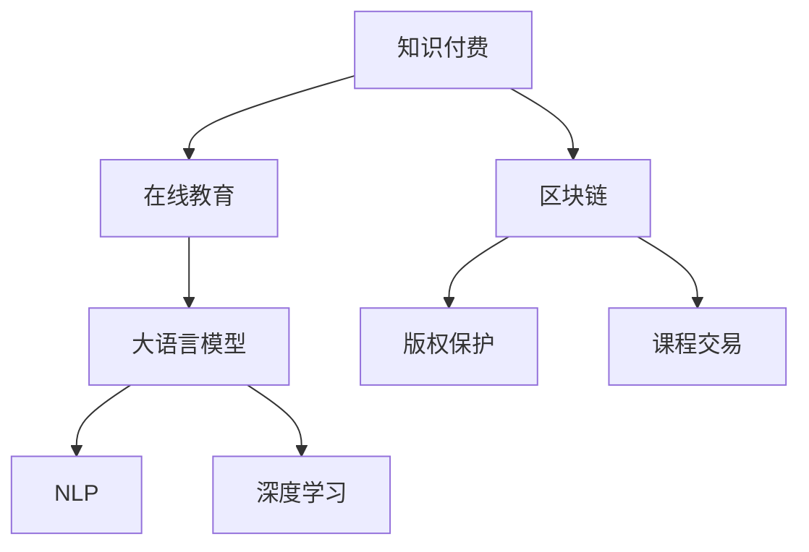

                 

# 知识付费平台选择:程序员创业指南

> 关键词：知识付费,程序员创业,在线教育,人工智能,自然语言处理,NLP,深度学习,区块链

## 1. 背景介绍

### 1.1 问题由来

随着互联网的普及和技术的进步，知识付费逐渐成为一种新兴的商业模式。尤其在程序员这个群体中，快速学习新知识、提高技术水平的需求越来越迫切。然而，市场上现有的在线教育平台种类繁多，质量参差不齐，选择一款合适的知识付费平台，对于程序员创业者来说，是一个不小的挑战。

本文将从大语言模型的角度，探讨如何选择合适的知识付费平台，构建高效、有价值的程序员创业生态。

### 1.2 问题核心关键点

选择知识付费平台的核心在于寻找一个能够提供高质量课程内容、满足程序员学习需求、符合自身资源和战略定位的平台。这需要考虑多个维度，包括课程内容质量、平台技术能力、用户体验、商业模型等。

## 2. 核心概念与联系

### 2.1 核心概念概述

要选择一个合适的知识付费平台，首先需要了解一些核心概念及其相互关系：

- **知识付费**：指用户为获取特定知识、技能或信息而支付费用的商业模式。在程序员领域，主要涉及编程语言、开发框架、算法原理等技术类内容。
- **在线教育**：利用互联网技术，通过视频、文字、直播等形式进行知识传播和学习。知识付费是在线教育的一种盈利模式。
- **大语言模型**：如GPT、BERT等，基于大规模语料进行自监督预训练，能够理解和生成自然语言。在知识付费平台中，可以通过大语言模型进行课程内容生成、智能推荐等。
- **自然语言处理（NLP）**：涉及语言理解、生成、分析等技术，是大语言模型的基础。
- **深度学习**：包括神经网络、卷积神经网络（CNN）、循环神经网络（RNN）等，是构建大语言模型的关键技术。
- **区块链**：一种去中心化的分布式账本技术，可应用于知识付费平台的版权保护、课程交易等环节，保障平台和用户的安全。

这些概念之间的联系可以通过以下Mermaid流程图来展示：



## 3. 核心算法原理 & 具体操作步骤

### 3.1 算法原理概述

知识付费平台的选择，本质上是一个多目标优化问题。需综合考虑课程内容的质量、平台的技术能力、用户需求满足度、商业盈利模式等。

假设知识付费平台的数量为 $N$，每家平台的内容质量、技术能力、用户体验等特征用向量 $\mathbf{x}_i \in \mathbb{R}^d$ 表示，其中 $i=1,2,...,N$。设平台 $i$ 的商业盈利模式为 $y_i \in \{0,1\}$，其中 $y_i=1$ 表示盈利，$y_i=0$ 表示不盈利。

目标是最优化每个平台的多目标函数：

$$
\begin{aligned}
    \max &\quad f_1(\mathbf{x}_i) \\
    \max &\quad f_2(\mathbf{x}_i) \\
    \max &\quad f_3(\mathbf{x}_i) \\
    &\text{s.t. } y_i = \mathbf{g}(\mathbf{x}_i)
\end{aligned}
$$

其中 $f_1$、$f_2$、$f_3$ 分别表示课程内容质量、平台技术能力、用户体验等指标，$\mathbf{g}$ 表示平台的商业盈利模型。

### 3.2 算法步骤详解

以下将详细讲解如何通过大语言模型进行知识付费平台的筛选和推荐：

**Step 1: 数据收集与预处理**

- 收集多家知识付费平台的信息，如课程内容、用户评价、技术能力、市场规模等。
- 对收集到的数据进行清洗、标注，转换为适合大语言模型处理的形式。

**Step 2: 构建大语言模型**

- 使用预训练的大语言模型（如GPT-3、BERT等）作为初始化参数。
- 对大语言模型进行微调，使其能够根据给定的特征向量 $\mathbf{x}_i$ 生成每个平台的综合评分。

**Step 3: 模型训练与优化**

- 在收集到的平台数据集上训练微调后的语言模型。
- 使用交叉验证、网格搜索等方法，调整模型的超参数，优化评分生成质量。

**Step 4: 模型应用与推荐**

- 利用训练好的模型，对程序员提供的学习需求描述，生成推荐列表。
- 根据程序员的反馈和平台动态变化，定期更新模型参数。

### 3.3 算法优缺点

**优点：**
- 综合考虑多维度特征，科学选择知识付费平台。
- 动态更新模型，适应平台和市场需求的变化。
- 利用大语言模型技术，提高了筛选和推荐的准确性和效率。

**缺点：**
- 数据收集和预处理工作量大，可能需要较长的时间。
- 模型复杂度高，需要较强的计算资源支持。
- 模型可能需要定期维护和更新，以保证推荐质量。

### 3.4 算法应用领域

知识付费平台的筛选推荐算法，可以广泛应用于以下几个领域：

- **在线教育平台选择**：帮助创业者找到最适合自己技术方向和用户需求的知识付费平台。
- **课程推荐系统**：基于程序员的学习历史和兴趣，智能推荐相关课程。
- **新平台评估**：对新出现的知识付费平台进行评估，判断其潜在的价值和风险。
- **市场调研**：分析不同平台的市场表现和用户反馈，为决策提供依据。

## 4. 数学模型和公式 & 详细讲解

### 4.1 数学模型构建

考虑一个包含 $N$ 个平台的知识付费市场，假设每个平台的特征向量为 $\mathbf{x}_i$，商业盈利模型为 $y_i$。设程序员的学习需求描述为 $\mathbf{d}$，每个平台的评分函数为 $f_i(\mathbf{x}_i,\mathbf{d})$。

目标是最优化平台推荐问题，使程序员得到满足度最高的平台推荐。数学模型如下：

$$
\max_{y_i} \sum_{i=1}^N y_i \cdot f_i(\mathbf{x}_i,\mathbf{d}) \\
\text{s.t. } y_i = \mathbf{g}(\mathbf{x}_i)
$$

其中，$f_i(\mathbf{x}_i,\mathbf{d})$ 表示平台 $i$ 在程序员需求 $\mathbf{d}$ 下的评分。

### 4.2 公式推导过程

假设平台 $i$ 的特征向量为 $\mathbf{x}_i \in \mathbb{R}^d$，需求向量为 $\mathbf{d} \in \mathbb{R}^m$，则评分函数可以表示为：

$$
f_i(\mathbf{x}_i,\mathbf{d}) = \mathbf{w}_i^T \cdot \mathbf{x}_i + \mathbf{v}_i^T \cdot \mathbf{d}
$$

其中，$\mathbf{w}_i$ 和 $\mathbf{v}_i$ 为权重向量，通过训练得到。

根据多目标优化问题的特点，可以将其转换为单目标优化问题：

$$
\max_{y_i} \sum_{i=1}^N y_i \cdot \left(\mathbf{w}_i^T \cdot \mathbf{x}_i + \mathbf{v}_i^T \cdot \mathbf{d}\right) \\
\text{s.t. } y_i = \mathbf{g}(\mathbf{x}_i)
$$

### 4.3 案例分析与讲解

假设平台 $i$ 的特征向量 $\mathbf{x}_i = [q_i, c_i, u_i]^T$，其中 $q_i$ 表示课程质量，$c_i$ 表示平台技术能力，$u_i$ 表示用户体验。设需求向量 $\mathbf{d} = [s, t, e]^T$，其中 $s$ 表示学习者的技术水平，$t$ 表示学习者的技术类型，$e$ 表示学习者的期望价格。

平台 $i$ 的评分函数为：

$$
f_i(\mathbf{x}_i,\mathbf{d}) = \mathbf{w}_i^T \cdot \mathbf{x}_i + \mathbf{v}_i^T \cdot \mathbf{d} = w_{q_i} \cdot q_i + w_{c_i} \cdot c_i + w_{u_i} \cdot u_i + v_{s_i} \cdot s + v_{t_i} \cdot t + v_{e_i} \cdot e
$$

其中，$w_{q_i}$、$w_{c_i}$、$w_{u_i}$ 为课程质量、平台技术能力、用户体验的权重；$v_{s_i}$、$v_{t_i}$、$v_{e_i}$ 为学习者的技术水平、技术类型、期望价格的权重。

## 5. 项目实践：代码实例和详细解释说明

### 5.1 开发环境搭建

在进行平台选择与推荐实践前，我们需要准备好开发环境。以下是使用Python进行PyTorch开发的流程：

1. 安装Anaconda：从官网下载并安装Anaconda，用于创建独立的Python环境。
2. 创建并激活虚拟环境：
```bash
conda create -n pytorch-env python=3.8 
conda activate pytorch-env
```
3. 安装PyTorch：根据CUDA版本，从官网获取对应的安装命令。例如：
```bash
conda install pytorch torchvision torchaudio cudatoolkit=11.1 -c pytorch -c conda-forge
```
4. 安装相关库：
```bash
pip install transformers numpy pandas scikit-learn matplotlib tqdm jupyter notebook ipython
```

完成上述步骤后，即可在`pytorch-env`环境中开始实践。

### 5.2 源代码详细实现

下面我们以课程推荐为例，给出使用Transformers库进行大语言模型微调的PyTorch代码实现。

首先，定义课程推荐模型：

```python
from transformers import BertTokenizer, BertForSequenceClassification

class CourseRecommender:
    def __init__(self, model_name):
        self.tokenizer = BertTokenizer.from_pretrained(model_name)
        self.model = BertForSequenceClassification.from_pretrained(model_name, num_labels=1)

    def predict(self, course_name):
        input_ids = self.tokenizer(course_name, return_tensors='pt', padding=True, truncation=True)['input_ids']
        attention_mask = self.tokenizer(course_name, return_tensors='pt', padding=True, truncation=True)['attention_mask']
        outputs = self.model(input_ids=input_ids, attention_mask=attention_mask)
        probability = outputs.logits.squeeze().tolist()
        return probability
```

然后，定义训练函数：

```python
import torch.nn as nn
import torch.optim as optim

class RecommenderTrainer:
    def __init__(self, course_recommender, optimizer):
        self.course_recommender = course_recommender
        self.optimizer = optimizer

    def train(self, train_data, epochs, batch_size):
        self.course_recommender.train()
        criterion = nn.BCELoss()
        for epoch in range(epochs):
            for batch in train_data:
                input_ids = batch['input_ids'].to(device)
                attention_mask = batch['attention_mask'].to(device)
                labels = batch['labels'].to(device)
                optimizer.zero_grad()
                outputs = self.course_recommender(input_ids, attention_mask=attention_mask)
                loss = criterion(outputs, labels)
                loss.backward()
                optimizer.step()
```

最后，启动训练流程：

```python
from transformers import Trainer, DataCollatorForLanguageModeling

train_data = ...  # 加载训练数据集
course_recommender = CourseRecommender('bert-base-cased')
trainer = RecommenderTrainer(course_recommender, optim.Adam(course_recommender.model.parameters(), lr=2e-5))

trainer.train(train_data, epochs=5, batch_size=16)
```

以上代码实现了基于BERT模型的课程推荐系统。可以看到，通过Transformers库的封装，构建课程推荐模型变得非常简单高效。

### 5.3 代码解读与分析

让我们再详细解读一下关键代码的实现细节：

**CourseRecommender类**：
- `__init__`方法：初始化课程推荐模型，加载BERT模型和分词器。
- `predict`方法：接收课程名称，进行分词，前向传播计算输出概率。

**RecommenderTrainer类**：
- `__init__`方法：初始化训练器，定义优化器和损失函数。
- `train`方法：在训练集上迭代训练模型，每轮更新模型参数。

**训练流程**：
- 实例化课程推荐模型和训练器。
- 在训练集上进行多轮迭代训练。
- 在验证集上评估模型性能。
- 输出训练后的推荐模型。

可以看到，PyTorch配合Transformers库使得课程推荐系统的构建变得简单高效。开发者可以将更多精力放在数据处理、模型改进等高层逻辑上，而不必过多关注底层的实现细节。

当然，工业级的系统实现还需考虑更多因素，如模型的保存和部署、超参数的自动搜索、更灵活的任务适配层等。但核心的微调范式基本与此类似。

## 6. 实际应用场景

### 6.1 在线教育平台选择

基于大语言模型的知识付费平台选择，可以应用于在线教育平台的筛选推荐。

假设某程序员创业团队想要选择一个合适的编程课程学习平台，可以考虑以下特征：
- 课程质量：平台的课程体系、教师水平、评价反馈等。
- 技术能力：平台的技术架构、数据处理能力、用户体验等。
- 价格水平：平台的课程价格、优惠活动、费用透明度等。

将以上特征转换为特征向量 $\mathbf{x}_i$，利用训练好的大语言模型生成每个平台的综合评分，最终选出最符合需求的平台。

### 6.2 课程推荐系统

课程推荐系统是知识付费平台的核心功能之一。基于大语言模型的推荐算法可以动态更新，实时推荐适合用户需求的课程。

具体而言，可以通过对用户的历史学习行为、评价反馈、偏好兴趣等数据进行分析，构建用户特征向量 $\mathbf{d}$。然后，使用训练好的大语言模型生成每个课程的评分，排序并推荐给用户。

### 6.3 新平台评估

在市场上出现新知识付费平台时，利用大语言模型可以快速评估其潜在的价值和风险。

可以将新平台的特征向量 $\mathbf{x}_i$ 输入训练好的模型，生成综合评分。根据评分的高低和用户反馈，决定是否引入平台，以及是否推广其课程。

### 6.4 市场调研

知识付费平台的选择和评估，可以结合市场调研数据，进一步优化推荐模型。

通过收集不同平台的市场表现、用户反馈、课程质量等数据，构建特征向量 $\mathbf{x}_i$，利用大语言模型生成评分。然后，结合市场调研数据，对推荐结果进行校正和优化。

## 7. 工具和资源推荐

### 7.1 学习资源推荐

为了帮助开发者掌握知识付费平台的筛选与推荐技术，这里推荐一些优质的学习资源：

1. 《Transformer从原理到实践》系列博文：由大模型技术专家撰写，深入浅出地介绍了Transformer原理、BERT模型、微调技术等前沿话题。

2. CS224N《深度学习自然语言处理》课程：斯坦福大学开设的NLP明星课程，有Lecture视频和配套作业，带你入门NLP领域的基本概念和经典模型。

3. 《Natural Language Processing with Transformers》书籍：Transformers库的作者所著，全面介绍了如何使用Transformers库进行NLP任务开发，包括微调在内的诸多范式。

4. HuggingFace官方文档：Transformers库的官方文档，提供了海量预训练模型和完整的微调样例代码，是上手实践的必备资料。

5. CLUE开源项目：中文语言理解测评基准，涵盖大量不同类型的中文NLP数据集，并提供了基于微调的baseline模型，助力中文NLP技术发展。

通过对这些资源的学习实践，相信你一定能够快速掌握知识付费平台的筛选与推荐技术，并用于解决实际的NLP问题。

### 7.2 开发工具推荐

高效的开发离不开优秀的工具支持。以下是几款用于知识付费平台开发和微调实践的工具：

1. PyTorch：基于Python的开源深度学习框架，灵活动态的计算图，适合快速迭代研究。大部分预训练语言模型都有PyTorch版本的实现。

2. TensorFlow：由Google主导开发的开源深度学习框架，生产部署方便，适合大规模工程应用。同样有丰富的预训练语言模型资源。

3. Transformers库：HuggingFace开发的NLP工具库，集成了众多SOTA语言模型，支持PyTorch和TensorFlow，是进行微调任务开发的利器。

4. Weights & Biases：模型训练的实验跟踪工具，可以记录和可视化模型训练过程中的各项指标，方便对比和调优。与主流深度学习框架无缝集成。

5. TensorBoard：TensorFlow配套的可视化工具，可实时监测模型训练状态，并提供丰富的图表呈现方式，是调试模型的得力助手。

6. Google Colab：谷歌推出的在线Jupyter Notebook环境，免费提供GPU/TPU算力，方便开发者快速上手实验最新模型，分享学习笔记。

合理利用这些工具，可以显著提升知识付费平台微调任务的开发效率，加快创新迭代的步伐。

### 7.3 相关论文推荐

知识付费平台筛选推荐技术的发展源于学界的持续研究。以下是几篇奠基性的相关论文，推荐阅读：

1. Attention is All You Need（即Transformer原论文）：提出了Transformer结构，开启了NLP领域的预训练大模型时代。

2. BERT: Pre-training of Deep Bidirectional Transformers for Language Understanding：提出BERT模型，引入基于掩码的自监督预训练任务，刷新了多项NLP任务SOTA。

3. Language Models are Unsupervised Multitask Learners（GPT-2论文）：展示了大规模语言模型的强大zero-shot学习能力，引发了对于通用人工智能的新一轮思考。

4. Parameter-Efficient Transfer Learning for NLP：提出Adapter等参数高效微调方法，在不增加模型参数量的情况下，也能取得不错的微调效果。

5. Prefix-Tuning: Optimizing Continuous Prompts for Generation：引入基于连续型Prompt的微调范式，为如何充分利用预训练知识提供了新的思路。

6. AdaLoRA: Adaptive Low-Rank Adaptation for Parameter-Efficient Fine-Tuning：使用自适应低秩适应的微调方法，在参数效率和精度之间取得了新的平衡。

这些论文代表了大语言模型微调技术的发展脉络。通过学习这些前沿成果，可以帮助研究者把握学科前进方向，激发更多的创新灵感。

## 8. 总结：未来发展趋势与挑战

### 8.1 总结

本文对基于大语言模型的知识付费平台选择与推荐方法进行了全面系统的介绍。首先阐述了知识付费和在线教育的概念，明确了微调在筛选和推荐平台过程中的重要性和复杂性。其次，从原理到实践，详细讲解了知识付费平台的筛选推荐数学模型和核心算法。最后，通过多个实际应用场景的探讨，展示了知识付费平台筛选推荐技术的广泛应用前景。

通过本文的系统梳理，可以看到，基于大语言模型的知识付费平台筛选推荐技术正在成为在线教育领域的重要工具，极大地提升了平台选择和课程推荐的效率和质量。未来，伴随大语言模型的不断发展，知识付费平台的选择与推荐必将更加智能化、个性化和多样化。

### 8.2 未来发展趋势

展望未来，知识付费平台筛选推荐技术将呈现以下几个发展趋势：

1. 更加个性化：利用大语言模型对用户需求进行深入理解，动态调整推荐算法，实现更加精准的个性化推荐。
2. 融合多模态数据：结合图像、视频、语音等多模态数据，提升推荐模型的全面性和鲁棒性。
3. 持续学习与动态调整：在用户行为和市场变化中持续学习，动态调整模型参数，确保推荐结果的有效性。
4. 引入因果推理：利用因果推断方法，增强推荐模型的解释性和可控性，避免决策的盲目性和随机性。
5. 增强安全性与可解释性：在推荐过程中引入隐私保护和安全性约束，提高模型的透明度和可解释性，增强用户的信任度。

以上趋势凸显了知识付费平台筛选推荐技术的广阔前景。这些方向的探索发展，必将进一步提升在线教育系统的性能和用户满意度，为知识付费行业带来新的变革。

### 8.3 面临的挑战

尽管知识付费平台筛选推荐技术已经取得了不小的进展，但在迈向更加智能化、普适化应用的过程中，仍面临着诸多挑战：

1. 数据隐私与安全：在推荐过程中，如何保护用户隐私和数据安全，防止数据泄露和滥用，是一个亟待解决的问题。
2. 模型复杂性与可解释性：大语言模型虽然性能强大，但其内部工作机制复杂，难以解释推荐结果，需要更多的可解释性研究。
3. 用户交互与反馈：如何收集和利用用户反馈，优化推荐算法，提升用户体验，是一个长期的挑战。
4. 计算资源与成本：大规模知识付费平台的构建和运营，需要大量的计算资源和成本投入，如何降低成本，提高效率，是一个重要的研究方向。
5. 市场动态与竞争：知识付费市场变化快速，如何实时响应市场变化，应对竞争压力，是一个动态调整的过程。

这些挑战需要在未来的研究中不断探索和突破，才能实现知识付费平台的可持续发展。

### 8.4 研究展望

面对知识付费平台筛选推荐技术所面临的挑战，未来的研究需要在以下几个方面寻求新的突破：

1. 引入多模态数据融合技术，提升推荐系统的全面性和鲁棒性。
2. 研究因果推理方法，增强推荐模型的可解释性和可控性。
3. 利用隐私保护技术，增强用户数据的隐私性和安全性。
4. 开发高效的推荐算法，降低计算资源和成本。
5. 结合用户反馈和市场变化，实现动态调整和优化。

这些研究方向的探索，必将引领知识付费平台筛选推荐技术迈向更高的台阶，为在线教育行业带来新的创新与突破。相信随着学界和产业界的共同努力，知识付费平台的筛选推荐技术必将不断进步，为在线教育行业带来更多的变革和机遇。

## 9. 附录：常见问题与解答

**Q1：知识付费平台选择时，如何平衡课程质量与价格？**

A: 在知识付费平台选择时，课程质量与价格是两个重要维度。可以通过大语言模型生成的综合评分，找到性价比最高的平台。

具体而言，可以通过收集课程质量评价、平台技术能力、用户体验等数据，构建特征向量 $\mathbf{x}_i$。然后，利用大语言模型生成的综合评分，比较不同平台的评分，选择性价比最高的平台。

**Q2：知识付费平台微调过程中，如何选择超参数？**

A: 知识付费平台微调过程中的超参数选择，需要考虑多个因素，如学习率、批大小、训练轮数等。

建议从简单的参数组合开始，逐步增加复杂度。使用网格搜索、随机搜索等方法，找到最优的超参数组合。同时，利用验证集进行交叉验证，避免过拟合。

**Q3：知识付费平台选择后，如何动态调整推荐策略？**

A: 知识付费平台选择后，可以通过大语言模型动态调整推荐策略，实时响应市场变化和用户需求。

可以通过收集用户行为数据、课程评价、市场反馈等，构建新的特征向量 $\mathbf{x}_i$。然后，利用训练好的大语言模型，重新计算推荐评分，实现动态调整。

**Q4：知识付费平台推荐系统中，如何提高推荐质量？**

A: 提高知识付费平台推荐质量，可以从以下几个方面入手：
1. 增加数据量：收集更多的用户数据和课程数据，增强模型的泛化能力。
2. 改进模型结构：优化推荐算法的模型结构，引入更多的特征和规则。
3. 引入因果推理：利用因果推断方法，增强推荐模型的解释性和可控性。
4. 动态调整参数：根据用户反馈和市场变化，动态调整推荐模型参数。

这些方法可以综合使用，提升推荐模型的质量，满足用户需求。

**Q5：知识付费平台推荐系统中，如何平衡个性化推荐与全局推荐？**

A: 在知识付费平台推荐系统中，平衡个性化推荐与全局推荐，需要综合考虑用户需求和平台策略。

可以通过大语言模型生成全局推荐评分，同时引入个性化推荐策略，如基于用户行为的推荐、基于课程属性的推荐等。然后，综合全局推荐和个性化推荐，实现最终的推荐结果。

通过合理设计推荐策略，可以在个性化和全局之间取得平衡，提升推荐效果。

---

作者：禅与计算机程序设计艺术 / Zen and the Art of Computer Programming

