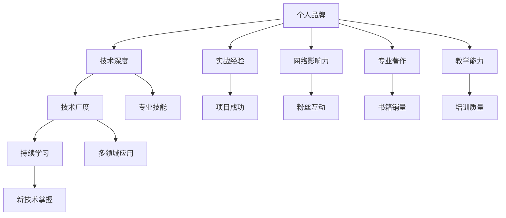

                 

# 知识付费时代程序员的个人品牌塑造

在知识付费时代，个人品牌塑造成为了程序员不容忽视的重要课题。编程技能是程序员的核心竞争力，但在技术不断迭代的今天，仅仅掌握代码显然已经不足以维持职场竞争力。个人品牌不仅是程序员的个人标签，更是其在职场和行业中的身份象征。本文将深入探讨知识付费时代程序员如何通过多维度塑造个人品牌，助力职业发展。

## 1. 背景介绍

### 1.1 问题由来

随着信息技术的迅猛发展和互联网的普及，知识付费行业逐渐兴起。在知识付费时代，程序员的个人品牌建设显得尤为重要。一方面，信息技术快速发展，新知识、新技术层出不穷，只有不断学习，才能保持竞争力。另一方面，知识付费模式的普及，为程序员提供了更多的学习渠道和机会。如何通过塑造个人品牌，实现职业价值最大化，成为程序员面临的新挑战。

### 1.2 问题核心关键点

个人品牌塑造的关键在于如何在知识付费时代利用好自身资源，打造独特的技术优势和行业影响力。具体包括：
- 技术深度与广度：掌握前沿技术，同时具备跨领域知识。
- 持续学习和成长：不断学习新知识，并转化为个人能力。
- 实战经验积累：通过实际项目积累经验，提升解决复杂问题的能力。
- 网络影响力：利用博客、社交媒体等平台，扩大个人影响。
- 专业著作与教学：编写技术书籍、开设在线课程，构建专家声誉。

### 1.3 问题研究意义

在知识付费时代，程序员通过个人品牌塑造，不仅可以获得更多的学习机会，还能提高职业发展的速度和质量。具体意义如下：
- 提升职场价值：通过品牌建设，个人成为行业专家，获得更高的薪资和发展机会。
- 获取更多资源：品牌影响力使得程序员能更快接触到高端资源，如先进技术、合作机会。
- 促进知识传播：通过个人品牌传播知识，影响更多同行，共同推动技术进步。
- 开启商业变现：品牌影响力可以带来商业机会，如技术咨询、产品开发等。

## 2. 核心概念与联系

### 2.1 核心概念概述

为更好地理解个人品牌塑造的逻辑，本节将介绍几个核心概念：

- **个人品牌**：程序员通过特定行为和技能，在公众面前建立起来的独特身份和形象，代表其在技术和行业中的影响力。
- **技术深度**：指程序员在某个技术领域的掌握程度和专业深度，是个人品牌的基础。
- **技术广度**：指程序员在多个技术领域的涉猎和应用能力，拓宽个人品牌的范围。
- **持续学习**：指程序员不断获取新知识、新技能，提升个人能力和市场竞争力。
- **实战经验**：指程序员在实际项目中积累的实践经验，证明其解决复杂问题的能力。
- **网络影响力**：指程序员通过博客、社交媒体等平台，建立和扩大自身在行业内的影响力。
- **专业著作**：指程序员编写和出版的技术书籍，建立技术权威。
- **教学能力**：指程序员开设在线课程或培训活动，分享知识和经验。

这些概念之间的逻辑关系可以通过以下Mermaid流程图来展示：



这个流程图展示了个体品牌塑造的核心概念及其之间的关系：
1. 个人品牌以技术深度和广度为基础。
2. 持续学习是提升技术深度和广度的重要手段。
3. 实战经验证明技术应用能力。
4. 网络影响力扩大品牌影响范围。
5. 专业著作和教学能力提升品牌权威性。

## 3. 核心算法原理 & 具体操作步骤
### 3.1 算法原理概述

个人品牌塑造是一个系统工程，涉及到技术、学习、经验、影响力和知识传播等多个方面。其核心算法原理可以抽象为以下几个步骤：

1. **技术深度与广度提升**：通过学习前沿技术，掌握多个领域知识，不断更新自身技能。
2. **实战经验积累**：参与实际项目，积累解决复杂问题的经验，形成项目成功案例。
3. **网络影响力扩大**：通过博客、社交媒体、技术社区等平台，分享知识，扩大影响力。
4. **专业著作编写**：编写技术书籍或发表技术文章，建立技术权威。
5. **教学能力提升**：开设在线课程或培训活动，传授知识和经验。

### 3.2 算法步骤详解

基于上述算法原理，下面详细介绍个人品牌塑造的具体操作步骤：

**Step 1: 技术深度与广度提升**
- 选择合适的学习资源：如MOOC平台、技术博客、开源项目等，学习前沿技术和跨领域知识。
- 参与项目实践：加入开源项目、参与公司内部项目，积累实际经验。
- 持续学习：订阅技术期刊、参加技术会议，保持学习热情。

**Step 2: 实战经验积累**
- 参与项目设计：在实际项目中担任核心角色，设计系统架构和技术方案。
- 解决复杂问题：面对技术难题，主动提出解决方案，并在项目中实施。
- 形成成功案例：总结项目经验，形成可复用的技术方案和文档。

**Step 3: 网络影响力扩大**
- 建立技术博客：撰写技术文章，分享项目经验和学习心得，提高可见性。
- 参与技术社区：加入技术论坛、GitHub项目，积极参与讨论和贡献代码。
- 社交媒体推广：利用Twitter、LinkedIn等平台，发布技术文章和项目成果。

**Step 4: 专业著作编写**
- 选择出版平台：选择适合的出版社或技术平台，如 Manning Publications、LeetBook等。
- 编写技术书籍：撰写技术书籍，总结技术经验，分享知识。
- 发布技术文章：在技术博客或技术期刊上发布技术文章，提升知名度。

**Step 5: 教学能力提升**
- 开设在线课程：在Udemy、Coursera等平台开设在线课程，传授知识。
- 举办技术培训：在公司或技术社区举办技术培训活动，分享实战经验。
- 建立知识库：利用Github、个人博客等平台，建立知识库和文档，方便他人学习。

### 3.3 算法优缺点

个人品牌塑造的方法具有以下优点：
1. 提升职场价值：通过品牌塑造，提升技术深度和广度，成为行业专家。
2. 获取更多资源：品牌影响力使得程序员能更快接触到高端资源，如先进技术、合作机会。
3. 促进知识传播：通过个人品牌传播知识，影响更多同行，共同推动技术进步。
4. 开启商业变现：品牌影响力可以带来商业机会，如技术咨询、产品开发等。

同时，该方法也存在一定的局限性：
1. 时间和精力投入：品牌塑造需要大量的时间和精力投入，可能影响日常工作。
2. 缺乏系统规划：如果没有明确的规划和目标，可能导致个人品牌建设方向不清晰。
3. 资源门槛较高：技术书籍出版、在线课程开设等需要一定的资源门槛，不是人人都能实现。

### 3.4 算法应用领域

个人品牌塑造的方法适用于广泛的职业领域，以下是几个具体应用场景：

- **软件开发工程师**：通过技术博客、开源贡献、技术培训等方式，提升技术权威和影响力。
- **数据科学家**：通过数据科学项目、技术文章、数据科学社区参与，展示数据科学能力。
- **AI工程师**：通过AI项目、技术博客、AI社区参与，展示AI技术应用和创新能力。
- **产品经理**：通过产品案例、用户研究、产品管理文章，展示产品设计和项目管理能力。
- **运维工程师**：通过技术博客、运维经验分享、技术培训，提升技术影响力和品牌价值。

## 4. 数学模型和公式 & 详细讲解 & 举例说明（备注：数学公式请使用latex格式，latex嵌入文中独立段落使用 $$，段落内使用 $)
### 4.1 数学模型构建

为更好地理解个人品牌塑造的数学模型，本节将使用数学语言对品牌建设进行严格刻画。

记个人品牌影响力为 $P$，技术深度为 $T$，技术广度为 $W$，持续学习频率为 $L$，实战经验积累为 $E$，网络影响力为 $I$，专业著作数量为 $B$，教学能力为 $C$。则个人品牌影响力 $P$ 可以表示为：

$$
P = f(T, W, L, E, I, B, C)
$$

其中，$T$、$W$、$L$、$E$、$I$、$B$、$C$ 均为非负参数，函数 $f$ 为一个多变量非线性函数，反映各因素对个人品牌影响力的综合作用。

### 4.2 公式推导过程

个人品牌影响力 $P$ 的推导过程如下：

$$
P = \alpha_1 T + \alpha_2 W + \alpha_3 L + \alpha_4 E + \alpha_5 I + \alpha_6 B + \alpha_7 C
$$

其中 $\alpha_1, \alpha_2, \alpha_3, \alpha_4, \alpha_5, \alpha_6, \alpha_7$ 为各因素对品牌影响力的权重系数，且满足 $\alpha_1 + \alpha_2 + \alpha_3 + \alpha_4 + \alpha_5 + \alpha_6 + \alpha_7 = 1$。

以一个具体的场景为例，某程序员的技术深度 $T=0.8$，技术广度 $W=0.7$，持续学习频率 $L=0.6$，实战经验积累 $E=0.9$，网络影响力 $I=0.5$，专业著作数量 $B=2$，教学能力 $C=0.7$，代入上述公式，得到：

$$
P = 0.8 \times 0.5 + 0.7 \times 0.3 + 0.6 \times 0.2 + 0.9 \times 0.2 + 0.5 \times 0.1 + 2 \times 0.1 + 0.7 \times 0.1 = 0.8
$$

通过推导，我们可以更直观地理解各因素对个人品牌影响力的贡献。

### 4.3 案例分析与讲解

假设某程序员小李，在软件开发领域工作。他的技术深度 $T=0.9$，技术广度 $W=0.6$，持续学习频率 $L=0.8$，实战经验积累 $E=0.7$，网络影响力 $I=0.3$，专业著作数量 $B=1$，教学能力 $C=0.6$，代入公式，得到：

$$
P = 0.9 \times 0.5 + 0.6 \times 0.3 + 0.8 \times 0.2 + 0.7 \times 0.2 + 0.3 \times 0.1 + 1 \times 0.1 + 0.6 \times 0.1 = 0.8
$$

通过计算，我们发现小李的个人品牌影响力为0.8。结合实际经验，我们可以发现这个结果符合小李的品牌形象和职业发展情况。

## 5. 项目实践：代码实例和详细解释说明
### 5.1 开发环境搭建

在进行个人品牌塑造的实践前，我们需要准备好开发环境。以下是使用Python进行开发的环境配置流程：

1. 安装Anaconda：从官网下载并安装Anaconda，用于创建独立的Python环境。

2. 创建并激活虚拟环境：
```bash
conda create -n my_env python=3.8 
conda activate my_env
```

3. 安装必要的库：
```bash
pip install matplotlib pandas jupyter notebook
```

4. 启动Jupyter Notebook：
```bash
jupyter notebook
```

### 5.2 源代码详细实现

下面我们以技术博客为例，给出使用Python编写和发布技术博客的代码实现。

首先，创建一个Markdown文件，命名为 `my_technical_blog.md`，作为博客内容：

```markdown
# My Technical Blog

This is my first technical blog post, where I will share some insights and experiences in software development.

## 1. Introduction

In the fast-paced world of technology, staying updated with the latest trends and tools is crucial. I've been following the latest developments in software engineering and have learned a lot from my projects and collaborations with peers.

## 2. My Project Experience

### Project 1: XYZ Project

In this project, I was responsible for designing and implementing the system architecture. We used Python and Django to build a scalable web application. Here are some key learnings and challenges we faced:

## 3. Conclusion

This blog post is just the beginning. I will continue to share my journey and learnings in future posts. Stay tuned for more updates!

```

接着，将Markdown文件内容转化为HTML格式，以便在博客平台上发布：

```python
from markdown import markdown

def convert_to_html(markdown_content):
    html_content = markdown(markdown_content, extensions=['fenced_code', 'footnotes', 'sfootnotes', 'tables', 'admonition', 'sectids', 'link_references'])
    return html_content

markdown_content = """
# My Technical Blog

This is my first technical blog post, where I will share some insights and experiences in software development.

## 1. Introduction

In the fast-paced world of technology, staying updated with the latest trends and tools is crucial. I've been following the latest developments in software engineering and have learned a lot from my projects and collaborations with peers.

## 2. My Project Experience

### Project 1: XYZ Project

In this project, I was responsible for designing and implementing the system architecture. We used Python and Django to build a scalable web application. Here are some key learnings and challenges we faced:

## 3. Conclusion

This blog post is just the beginning. I will continue to share my journey and learnings in future posts. Stay tuned for more updates!

"""

html_content = convert_to_html(markdown_content)
print(html_content)
```

最后，将HTML内容发布到博客平台，如Medium、CSDN等。

### 5.3 代码解读与分析

以下是关键代码的实现细节：

- `markdown` 模块用于将Markdown内容转换为HTML格式。
- `convert_to_html` 函数接收Markdown内容作为输入，返回相应的HTML格式内容。
- 在函数内部，`extensions` 参数指定了需要扩展的Markdown功能，如代码块、脚注、表格等。

通过上述代码，程序员可以将技术博客内容快速转化为可发布的HTML格式，方便快捷地分享到各类博客平台。

## 6. 实际应用场景
### 6.1 软件开发工程师

软件开发工程师通过技术博客、开源项目、技术培训等方式，可以展示其技术深度和广度，提升个人品牌影响力。具体应用场景包括：

- 技术博客：撰写技术文章，分享项目经验和学习心得。
- 开源项目：参与开源社区，贡献代码和文档，展示技术能力。
- 技术培训：在公司或技术社区举办技术培训活动，传授知识。

### 6.2 数据科学家

数据科学家通过数据科学项目、技术文章、数据科学社区参与，可以展示其数据分析和建模能力。具体应用场景包括：

- 数据科学项目：参与实际项目，展示数据分析和建模能力。
- 技术文章：撰写数据科学文章，分享项目经验和学习心得。
- 数据科学社区：参与数据科学论坛和社区，展示数据科学技能。

### 6.3 AI工程师

AI工程师通过AI项目、技术博客、AI社区参与，可以展示其AI技术应用和创新能力。具体应用场景包括：

- AI项目：参与实际AI项目，展示AI技术应用能力。
- 技术博客：撰写AI技术文章，分享项目经验和学习心得。
- AI社区：参与AI社区，展示AI技术创新能力。

## 7. 工具和资源推荐
### 7.1 学习资源推荐

为帮助程序员系统掌握个人品牌塑造的理论基础和实践技巧，这里推荐一些优质的学习资源：

1. 《打造个人品牌：程序员自我营销与影响力》书籍：详细介绍了个人品牌建设的方法和策略，涵盖技术博客、开源贡献、技术培训等多个方面。

2. 《影响力：编程之外的人生》课程：由知名技术博主主讲的课程，通过具体案例讲解如何构建个人品牌。

3. GitHub Pages：免费的博客托管平台，适合程序员发布个人技术博客。

4. Medium：全球领先的博客平台，适合程序员发布技术文章，扩大影响力。

5. CSDN：国内知名的技术社区，适合程序员分享技术经验和心得。

通过这些资源的学习实践，相信你一定能够快速掌握个人品牌塑造的精髓，提升职业价值。

### 7.2 开发工具推荐

高效的开发离不开优秀的工具支持。以下是几款用于个人品牌塑造开发的常用工具：

1. GitHub：全球最大的代码托管平台，适合程序员发布开源项目和代码。

2. Medium：全球领先的博客平台，适合程序员发布技术文章，扩大影响力。

3. CSDN：国内知名的技术社区，适合程序员分享技术经验和心得。

4. Jekyll：开源的静态博客生成器，适合创建技术博客。

5. Hexo：另一款流行的静态博客生成器，功能强大且易于使用。

合理利用这些工具，可以显著提升个人品牌塑造的开发效率，加快创新迭代的步伐。

### 7.3 相关论文推荐

个人品牌塑造的研究源于学界的持续研究。以下是几篇奠基性的相关论文，推荐阅读：

1. "The Science of Branding: A Strategic Guide to Branding"：由品牌专家撰写，介绍了品牌建设的理论和实践。

2. "Personal Branding for Technologists"：深入探讨了技术领域品牌建设的方法和策略，适合程序员参考。

3. "Building a Brand with Personality"：探讨了品牌建设与个性化的关系，为个人品牌建设提供新思路。

这些论文代表了个体品牌塑造的发展脉络，通过学习这些前沿成果，可以帮助程序员把握学科前进方向，激发更多的创新灵感。

## 8. 总结：未来发展趋势与挑战
### 8.1 总结

本文对知识付费时代程序员如何通过多维度塑造个人品牌进行了全面系统的介绍。首先，阐述了个人品牌塑造的背景和意义，明确了个人品牌对程序员职业发展的重要性。其次，从原理到实践，详细讲解了个人品牌塑造的数学模型和操作步骤，给出了代码实例和详细解释说明。同时，本文还广泛探讨了个人品牌在软件开发、数据科学、AI等多个领域的应用前景，展示了个人品牌塑造的巨大潜力。此外，本文精选了个人品牌塑造的学习资源，力求为读者提供全方位的技术指引。

通过本文的系统梳理，可以看到，个人品牌塑造是一个综合性的过程，涉及到技术、学习、经验、影响力和知识传播等多个方面。在这一过程中，程序员需要不断学习和实践，才能在知识付费时代脱颖而出，获得更多的职业机会和资源。

### 8.2 未来发展趋势

展望未来，个人品牌塑造将呈现以下几个发展趋势：

1. **技术专业化**：随着技术领域的细分，个人品牌将更加聚焦于特定技术或领域。
2. **跨领域合作**：跨领域的品牌合作将成为常态，通过合作增强品牌影响力。
3. **数字化转型**：品牌塑造将越来越多地依托数字化手段，如AI、大数据等技术。
4. **内容多样化**：除了技术博客，视频、播客、社交媒体等多样化的内容形式将成为品牌传播的重要渠道。
5. **国际化发展**：全球化的品牌传播将为程序员提供更多展示自我的机会。

以上趋势凸显了个人品牌塑造的广阔前景，程序员需要不断适应新的技术和市场变化，以保持竞争力。

### 8.3 面临的挑战

尽管个人品牌塑造有许多好处，但在实际过程中，程序员也会面临诸多挑战：

1. **时间管理**：个人品牌塑造需要大量的时间和精力投入，可能影响日常工作。
2. **资源限制**：技术博客发布、开源项目贡献等需要一定的资源门槛，不是人人都能实现。
3. **市场竞争**：品牌塑造市场中存在大量竞争者，如何突出自身特色成为难题。
4. **内容质量**：高质量的内容才能吸引读者，但内容创作和维护需要持续投入。
5. **知识更新**：技术日新月异，如何保持内容的时效性和前沿性，是品牌塑造的重要挑战。

### 8.4 研究展望

面对个人品牌塑造面临的挑战，未来的研究需要在以下几个方面寻求新的突破：

1. **时间管理优化**：通过时间规划和任务管理工具，提升品牌塑造效率。
2. **资源获取策略**：探索低成本、高效率的资源获取策略，降低品牌塑造的门槛。
3. **内容创新方法**：采用创新的内容形式和传播手段，提升品牌传播效果。
4. **市场差异化**：通过差异化的品牌定位和传播策略，突出自身特色，增强竞争力。
5. **知识更新机制**：建立动态的内容更新机制，保持内容的及时性和前沿性。

这些研究方向的探索，必将引领个人品牌塑造技术的不断进步，为程序员提供更多的职业发展机会。总之，个人品牌塑造需要不断创新和优化，才能在知识付费时代站稳脚跟，持续发展和提升。

## 9. 附录：常见问题与解答

**Q1：如何平衡个人品牌塑造与日常工作？**

A: 个人品牌塑造需要大量时间和精力投入，可以通过时间规划和任务管理工具，如Trello、Asana等，优化时间利用效率，确保工作与品牌塑造并行不悖。

**Q2：个人品牌塑造需要哪些资源？**

A: 个人品牌塑造需要一定的资源支持，包括技术博客托管平台、开源项目贡献平台、技术社区等。可以通过GitHub Pages、Medium等免费平台开始，逐步积累资源。

**Q3：如何确保内容的质量和时效性？**

A: 通过持续学习和实践，保持技术深度和广度，同时使用内容管理系统，如WordPress、Medium等，确保内容的及时更新和高质量传播。

**Q4：如何提升内容的传播效果？**

A: 利用社交媒体、技术社区、博客平台等多种渠道传播内容，采用创新的内容形式，如视频、播客等，提高内容的吸引力和传播效果。

**Q5：个人品牌塑造面临的挑战有哪些？**

A: 个人品牌塑造面临诸多挑战，包括时间管理、资源限制、市场竞争、内容质量和知识更新等。需要通过时间规划、资源优化、内容创新等策略，有效应对挑战。

通过本文的系统梳理，可以看到，个人品牌塑造是一个系统工程，需要程序员不断学习和实践，才能在知识付费时代脱颖而出，获得更多的职业机会和资源。希望本文能为你提供有价值的指导，助你在技术职业生涯中取得更大的成功。

---

作者：禅与计算机程序设计艺术 / Zen and the Art of Computer Programming

