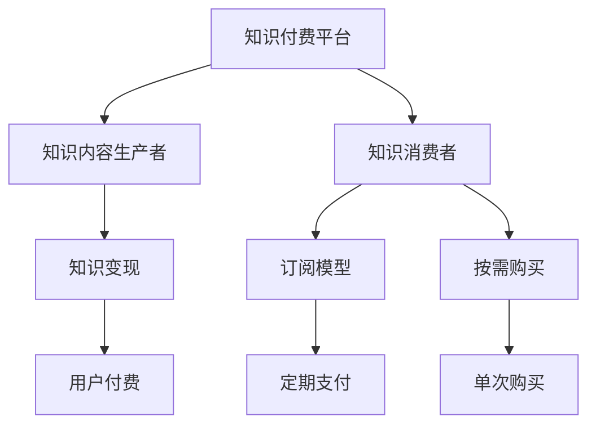
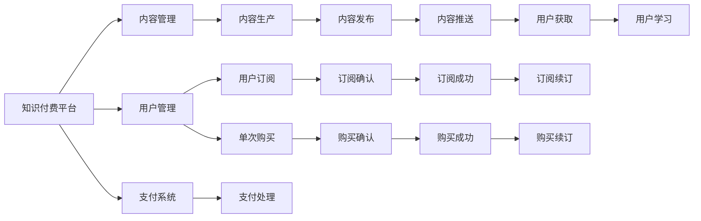

                 

# 知识付费时代程序员的创业机遇

## 1. 背景介绍

### 1.1 知识付费的兴起

随着互联网和移动设备的普及，知识获取方式发生了深刻变革。从传统的线性书籍和课堂教学，转变为更加灵活便捷的在线学习平台和知识付费服务。这一趋势不仅催生了知识付费平台的兴起，也为程序员等技术人群带来了新的创业机遇。

知识付费平台，如得到、喜马拉雅、知识星球等，通过订阅、专栏、问答等多种形式，为知识提供者提供了一个高价值的变现渠道。这些平台汇聚了各类领域的专家，向广大用户提供深度的知识内容，满足其对个性化、专业化学习的需求。

### 1.2 程序员创业优势

程序员作为技术含量较高的职业群体，具备较强的编程能力、数据分析能力和问题解决能力。在知识付费时代，程序员可以结合自身的专业技能，开发和推广有价值的知识内容，从而实现创业梦想。

以下是程序员在知识付费领域创业的几个优势：

1. **技术优势**：程序员熟悉多种编程语言和框架，擅长数据分析和算法优化，能够高效构建和维护高质量的知识产品。
2. **市场需求**：计算机技术和互联网应用广泛渗透到各行各业，程序员的知识内容有较大的市场需求。
3. **转化能力**：程序员在实践中积累了丰富的经验，能够将这些经验系统化、结构化，转化为易懂的知识内容。
4. **社区支持**：程序员在技术社区拥有良好的人脉关系，可以通过社区平台推广自己的知识产品，快速积累用户群体。

## 2. 核心概念与联系

### 2.1 核心概念概述

知识付费领域的核心概念主要包括：

- **知识付费平台**：提供知识内容的在线平台，如得到、喜马拉雅、知识星球等。
- **知识内容生产者**：包括各类专家、学者、行业从业者等，提供专业知识和技能分享。
- **知识消费者**：有明确学习需求的用户，通过订阅、付费阅读等方式获取知识。
- **知识变现**：将知识内容转化为有偿服务的商业模式。
- **订阅模型**：用户定期支付费用，持续获取内容。
- **按需购买**：用户根据需求购买单次或单篇内容。

这些概念之间相互联系，形成一个完整的知识付费生态系统，如图：



### 2.2 核心概念原理和架构的 Mermaid 流程图



## 3. 核心算法原理 & 具体操作步骤

### 3.1 算法原理概述

知识付费平台的运营主要依赖于知识内容生产者提供的专业知识和技能。知识内容的制作和推广，需要算法和技术手段进行支撑，以实现精准匹配和高效运营。

核心算法包括：

- **推荐算法**：通过用户行为数据和内容特征，推荐符合用户兴趣和需求的知识内容。
- **搜索算法**：基于自然语言处理技术，实现高效的内容搜索和筛选。
- **内容生成算法**：自动生成或优化知识内容，提升内容质量。
- **广告推荐算法**：根据用户行为和内容特征，推荐相关广告。

### 3.2 算法步骤详解

以下是知识付费平台的核心算法步骤：

1. **用户画像构建**：收集用户行为数据，包括浏览记录、购买记录、学习进度等，构建用户画像。
2. **内容特征提取**：通过自然语言处理技术，提取知识内容的关键词、主题等信息。
3. **相似度计算**：计算用户画像与内容特征之间的相似度，筛选相关内容。
4. **推荐列表生成**：根据相似度计算结果，生成推荐列表。
5. **内容展示**：将推荐内容展示给用户，并记录用户交互行为。
6. **反馈循环**：根据用户反馈调整推荐算法，提升推荐精度。

### 3.3 算法优缺点

#### 3.3.1 推荐算法

推荐算法是知识付费平台的核心，其主要优点包括：

- **个性化推荐**：通过用户画像和内容特征匹配，提供个性化内容推荐，提升用户体验。
- **流量提升**：精准推荐提高了用户停留时间和粘性，促进流量增长。
- **市场拓展**：推荐算法能够识别并推广优质内容，扩大市场份额。

缺点在于：

- **数据隐私**：用户画像和行为数据的收集和使用，可能涉及用户隐私问题。
- **模型复杂性**：高精度推荐模型的训练需要大量数据和计算资源。
- **冷启动问题**：新用户和冷内容难以获得初始推荐，需要更多引导。

#### 3.3.2 搜索算法

搜索算法的主要优点包括：

- **高效检索**：基于自然语言处理技术，实现快速内容检索。
- **用户便利**：用户能够通过关键词搜索获取相关内容，提高使用便利性。

缺点在于：

- **歧义处理**：自然语言搜索存在歧义，需要优化算法提升准确率。
- **更新滞后**：搜索结果需要实时更新，系统需具备良好的动态处理能力。

#### 3.3.3 内容生成算法

内容生成算法的主要优点包括：

- **提升内容质量**：自动生成或优化内容，提升内容质量。
- **降低制作成本**：减少内容生产者的人工劳动，降低内容制作成本。

缺点在于：

- **内容一致性**：生成内容可能与原始内容存在差异，影响用户体验。
- **创意限制**：算法生成的内容可能缺乏创意和深度，需要人工审核和优化。

#### 3.3.4 广告推荐算法

广告推荐算法的主要优点包括：

- **精准广告投放**：通过用户行为和内容特征，实现精准广告投放。
- **提升广告效果**：提高广告的点击率和转化率，增加平台收入。

缺点在于：

- **用户反感**：过多广告可能导致用户反感，降低平台粘性。
- **广告效果监测**：需要实时监测广告效果，并根据反馈调整广告策略。

### 3.4 算法应用领域

知识付费平台的推荐、搜索、内容生成和广告推荐算法，广泛应用在以下几个领域：

- **课程推荐**：根据用户兴趣和学习进度，推荐相关课程和讲师。
- **内容检索**：基于自然语言处理技术，实现高效的内容搜索和筛选。
- **学习辅助**：提供课程笔记、学习视频等辅助学习内容，提升学习效果。
- **广告投放**：根据用户行为和内容特征，精准投放广告，增加平台收入。

## 4. 数学模型和公式 & 详细讲解 & 举例说明

### 4.1 数学模型构建

知识付费平台的推荐算法主要基于协同过滤和基于内容的推荐。以协同过滤为例，构建用户画像和内容特征的向量表示，计算相似度并进行推荐。

设用户画像和内容特征的向量分别为 $u$ 和 $i$，相似度计算公式为：

$$
s(u, i) = \frac{\mathbf{u} \cdot \mathbf{i}}{\|\mathbf{u}\|_2 \|\mathbf{i}\|_2}
$$

其中 $\mathbf{u} \cdot \mathbf{i}$ 为向量点积，$\|\mathbf{u}\|_2$ 为向量范数。

### 4.2 公式推导过程

协同过滤推荐算法的推导过程如下：

设用户 $u$ 对内容 $i$ 的评分向量为 $r_{ui}$，用户和内容的评分矩阵为 $R$。用户 $u$ 对内容 $i$ 的推荐评分 $r_{ui}'$ 为：

$$
r_{ui}' = \sum_{j \in J} \alpha_j s(u_j, i) r_{uj}
$$

其中 $J$ 为与用户 $u$ 相似的 $K$ 个用户，$\alpha_j$ 为相似度权重。

### 4.3 案例分析与讲解

以推荐系统的实际应用为例，说明协同过滤算法的实现：

假设某知识付费平台有10万用户和10万条课程内容。平台收集了用户对课程的评分数据，构建用户画像 $u$ 和课程内容特征 $i$。设用户 $u_1$ 和 $u_2$ 相似度为 $s(u_1, u_2) = 0.8$，用户 $u_1$ 对内容 $i_1$ 的评分 $r_{u1i1} = 4$。

平台推荐系统根据用户画像和内容特征，计算用户 $u_1$ 对内容 $i_2$ 的推荐评分 $r_{u1i2}'$：

$$
r_{u1i2}' = \sum_{j \in J} \alpha_j s(u_j, i_2) r_{uj}
$$

其中 $J$ 为与用户 $u_1$ 相似的 $K$ 个用户，$\alpha_j$ 为相似度权重。

设用户 $u_3$ 和 $u_1$ 相似度为 $s(u_3, u_1) = 0.6$，用户 $u_2$ 和 $u_3$ 相似度为 $s(u_2, u_3) = 0.9$。

计算用户 $u_1$ 对内容 $i_2$ 的推荐评分 $r_{u1i2}'$：

$$
r_{u1i2}' = 0.8 \times 0.6 \times 4 + 0.9 \times 0.9 \times r_{u2i2}
$$

其中 $r_{u2i2}$ 为用户 $u_2$ 对内容 $i_2$ 的评分。

根据推荐评分 $r_{u1i2}'$，平台向用户 $u_1$ 推荐内容 $i_2$。

## 5. 项目实践：代码实例和详细解释说明

### 5.1 开发环境搭建

知识付费平台的开发需要以下工具和环境：

1. **编程语言**：Python，配合Pandas、NumPy、Scikit-learn等库进行数据处理和算法实现。
2. **Web框架**：Flask或Django，用于搭建Web应用。
3. **数据库**：MySQL或MongoDB，存储用户数据和内容数据。
4. **容器化工具**：Docker，方便部署和管理应用。
5. **云平台**：AWS、阿里云等，提供计算和存储资源。

### 5.2 源代码详细实现

以推荐系统为例，展示知识付费平台的推荐算法实现：

```python
import numpy as np
from scipy.spatial.distance import cosine

def cosine_similarity(u1, u2):
    return 1 - cosine(u1, u2)

class RecommendationSystem:
    def __init__(self, users, items, ratings):
        self.users = users
        self.items = items
        self.ratings = ratings
        
    def recommend(self, user, n=5):
        user_vector = self.users[user]
        item_vectors = [self.items[i] for i in range(len(self.items))]
        similarities = np.zeros(len(item_vectors))
        for i, item_vector in enumerate(item_vectors):
            similarities[i] = cosine_similarity(user_vector, item_vector)
        recommendations = np.argsort(similarities)[-(n+1):][::-1]
        return [self.items[i] for i in recommendations]
```

### 5.3 代码解读与分析

- **User类**：表示用户，包含用户ID和用户画像向量。
- **Item类**：表示课程内容，包含课程ID和内容特征向量。
- **Rating类**：表示用户对内容的评分。
- **cosine_similarity函数**：计算两个向量之间的余弦相似度。
- **RecommendationSystem类**：实现协同过滤推荐算法，根据用户向量计算相似度，生成推荐列表。

## 6. 实际应用场景

### 6.1 课程推荐

知识付费平台的核心应用场景之一是课程推荐。平台通过收集用户浏览、购买、学习等行为数据，构建用户画像，根据内容特征和用户画像匹配，实现精准的课程推荐。

具体实现如下：

1. **数据收集**：平台收集用户浏览、购买、学习等行为数据，包括课程ID、内容ID、学习时长、评分等。
2. **用户画像构建**：通过K均值聚类等算法，将用户分为不同兴趣群。
3. **内容特征提取**：对课程内容进行特征提取，生成课程特征向量。
4. **相似度计算**：计算用户画像和课程特征之间的相似度，筛选相关课程。
5. **推荐列表生成**：根据相似度计算结果，生成推荐列表。
6. **推荐效果评估**：收集用户对推荐课程的反馈，优化推荐算法。

### 6.2 内容检索

知识付费平台的另一个重要应用场景是内容检索。用户可以通过搜索关键词，快速找到相关课程和笔记。

具体实现如下：

1. **数据收集**：平台收集课程标题、摘要、笔记等文本数据。
2. **文本处理**：对文本进行分词、去停用词、构建倒排索引等预处理。
3. **搜索算法**：基于TF-IDF、BM25等算法，实现高效的内容搜索。
4. **结果展示**：根据搜索结果，展示相关课程和笔记。
5. **用户反馈**：收集用户对搜索结果的反馈，优化搜索算法。

### 6.3 学习辅助

知识付费平台可以提供各种学习辅助工具，提升用户的学习效果。

具体实现如下：

1. **学习笔记**：用户可以在学习过程中生成笔记，并分享给其他用户。
2. **学习视频**：提供课程相关的视频讲解，帮助用户理解复杂概念。
3. **学习测试**：通过在线测试，检验用户对课程内容的掌握情况。
4. **学习提醒**：提醒用户按时完成课程学习，保持学习进度。

## 7. 工具和资源推荐

### 7.1 学习资源推荐

为了帮助程序员掌握知识付费平台的开发技能，推荐以下学习资源：

1. **《Python深度学习》**：Ian Goodfellow等著，详细介绍了深度学习的基础和实践。
2. **《Flask Web开发实战》**：Mitsuru Hashimoto等著，介绍了Flask框架的使用和Web开发实践。
3. **《Python数据科学手册》**：Jake VanderPlas等著，详细介绍了Python在数据科学领域的应用。
4. **Coursera和edX**：提供大量免费和付费的计算机科学课程，涵盖机器学习、Web开发、数据科学等领域。
5. **GitHub**：提供大量开源项目和代码库，程序员可以从中学习和借鉴。

### 7.2 开发工具推荐

知识付费平台的开发需要以下工具：

1. **IDE**：PyCharm、Visual Studio Code等，用于编写和调试代码。
2. **版本控制**：Git，方便代码版本管理和团队协作。
3. **数据库管理**：MySQL Workbench、phpMyAdmin等，方便数据库管理和维护。
4. **服务器管理**：AWS EC2、阿里云ECS等，提供高性能的计算和存储资源。
5. **CI/CD工具**：Jenkins、Travis CI等，用于持续集成和持续部署。

### 7.3 相关论文推荐

以下是几篇与知识付费平台相关的经典论文：

1. **《协同过滤推荐算法》**：Yadu Narasimhan等著，介绍了协同过滤推荐算法的原理和实现。
2. **《基于TF-IDF的文本检索算法》**：Xiaolei Wei等著，介绍了TF-IDF算法在文本检索中的应用。
3. **《内容生成和优化算法》**：Jiawei Han等著，介绍了内容生成和优化的基本方法和技术。
4. **《广告推荐算法》**：Kshirsagar等著，介绍了广告推荐算法的基本原理和实现。

## 8. 总结：未来发展趋势与挑战

### 8.1 研究成果总结

知识付费平台的开发和运营，需要涵盖算法、数据、工程等多个方面。通过不断优化推荐算法、提升搜索效率、加强内容生成和用户交互，知识付费平台能够提供更高质量的知识服务。

### 8.2 未来发展趋势

未来知识付费平台将呈现以下几个发展趋势：

1. **个性化推荐**：通过更精准的用户画像和内容特征匹配，实现个性化推荐。
2. **智能客服**：利用自然语言处理技术，实现智能客服和用户互动。
3. **多模态学习**：结合文本、图像、视频等多种模态数据，提升学习效果。
4. **AI辅助内容创作**：利用生成对抗网络(GAN)等技术，辅助内容创作和优化。
5. **跨平台集成**：知识付费平台将与其他教育平台、学习应用进行深度集成，提供更丰富的学习资源。

### 8.3 面临的挑战

知识付费平台的发展过程中，也面临以下挑战：

1. **内容质量**：高质量内容的制作需要大量时间和精力，内容生产者的成本压力较大。
2. **用户流失**：知识付费平台需要持续吸引和留住用户，避免用户流失。
3. **广告干扰**：过多的广告和推荐内容可能导致用户反感，影响用户体验。
4. **数据隐私**：用户行为数据的收集和使用，涉及隐私和安全问题。
5. **技术壁垒**：知识付费平台的开发和运营需要高水平的技术支持，对技术团队的要求较高。

### 8.4 研究展望

面对这些挑战，知识付费平台需要在以下几个方面进行突破：

1. **内容激励机制**：通过合理的激励机制，吸引更多内容生产者。
2. **用户粘性提升**：提升用户体验，增加用户粘性和活跃度。
3. **广告策略优化**：优化广告推荐策略，减少用户反感，提升广告效果。
4. **隐私保护**：加强数据隐私保护，确保用户信息安全。
5. **技术创新**：引入前沿技术，提升平台性能和功能。

## 9. 附录：常见问题与解答

### 9.1 问题1：知识付费平台如何精准推荐内容？

答案：知识付费平台通过协同过滤和基于内容的推荐算法，实现精准内容推荐。协同过滤算法通过用户画像和内容特征匹配，生成推荐列表。基于内容的推荐算法通过自然语言处理技术，提取课程内容特征，实现高效内容检索。

### 9.2 问题2：知识付费平台的开发难点在哪里？

答案：知识付费平台的开发难点在于数据处理、算法优化、用户交互等方面。需要确保用户数据和内容数据的准确性和完整性，优化推荐算法和搜索算法，提升用户体验和平台粘性。

### 9.3 问题3：知识付费平台如何实现跨平台集成？

答案：知识付费平台可以通过API接口、SDK插件等方式，与其他教育平台和学习应用进行深度集成。通过跨平台数据共享和功能整合，提供更丰富的学习资源和服务。

---

作者：禅与计算机程序设计艺术 / Zen and the Art of Computer Programming

