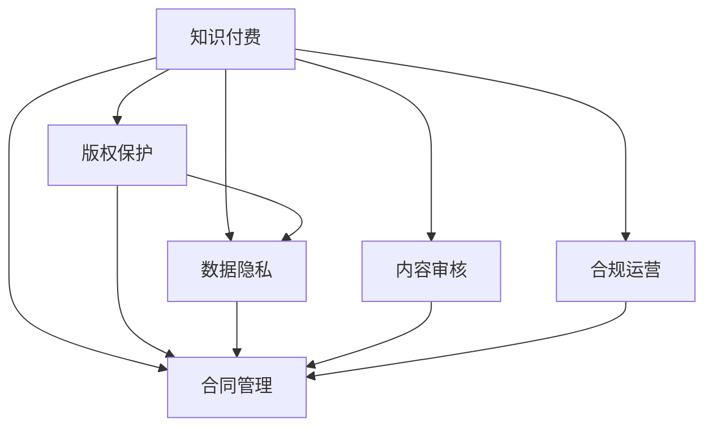

                 

# 知识付费的法律风险及规避

> 关键词：知识付费,法律风险,版权保护,数据隐私,合同管理,风险规避

## 1. 背景介绍

### 1.1 问题由来
随着互联网的快速发展，知识付费模式成为一种重要的信息获取方式。用户通过付费购买优质内容，平台则从高价值内容中获取收益，这是一个双赢的商业模式。然而，在知识付费平台的快速发展过程中，伴随而来的则是各种法律风险，如版权纠纷、数据隐私泄露、虚假宣传、内容侵权等。这些风险不仅会影响平台和用户的合法权益，更可能引发法律诉讼，对平台造成不可挽回的损失。因此，如何规避知识付费模式下的法律风险，保障各方的合法权益，成为平台运营商必须重点关注的问题。

### 1.2 问题核心关键点
知识付费的法律风险主要集中在以下几个方面：
1. 版权保护：平台在提供内容时需确保内容的版权归属清晰，避免侵权行为。
2. 数据隐私：平台需要保护用户隐私，遵守相关隐私保护法规，避免数据泄露。
3. 合同管理：平台需制定合法合规的合同条款，保障用户和内容创作者的合法权益。
4. 内容审核：平台需建立有效的内容审核机制，防止不良内容的传播。
5. 合规运营：平台需持续关注法律法规的变动，确保运营活动的合法合规。

## 2. 核心概念与联系

### 2.1 核心概念概述

为更好地理解知识付费的法律风险及其规避方法，本节将介绍几个密切相关的核心概念：

- 知识付费：通过付费订阅或单次购买的方式，获取优质内容的商业模式。
- 版权保护：保障作品著作权的法律法规，防止他人未经授权使用作品。
- 数据隐私：个人信息、隐私数据的收集、使用、存储和传输过程中，保护数据主体的隐私权。
- 合同管理：通过合法合规的合同条款，明确各方的权利和义务。
- 内容审核：平台通过技术手段或人工审核，确保内容的合法合规性。
- 合规运营：平台运营活动必须符合国家法律法规，确保不违法违规。

这些核心概念之间的逻辑关系可以通过以下Mermaid流程图来展示：



这个流程图展示的知识付费的核心概念及其之间的关系：

1. 知识付费通过版权保护和数据隐私保障，确保内容的合法合规性。
2. 合同管理则从法律角度明确各方的权利和义务。
3. 内容审核和合规运营则从技术和法律两个维度，确保平台的合法合规运营。

## 3. 核心算法原理 & 具体操作步骤
### 3.1 算法原理概述

规避知识付费模式下的法律风险，本质上是一个综合性的多维度优化过程。其核心思想是：通过科学合理的法律策略、合同管理、数据隐私保护和内容审核等手段，最大限度地降低法律风险，保障各方的合法权益。

形式化地，假设知识付费平台为 $P$，平台运营商为 $R$，用户为 $U$，内容创作者为 $C$，版权方为 $A$，则平台需综合考虑版权保护、数据隐私、合同管理、内容审核和合规运营等因素，最小化潜在法律风险，最大化各方利益。

算法目标为：

$$
\theta^* = \mathop{\arg\min}_{\theta} \mathcal{L}(P, R, U, C, A)
$$

其中 $\mathcal{L}$ 为综合评估函数，评估平台 $P$、运营商 $R$、用户 $U$、内容创作者 $C$ 和版权方 $A$ 在知识付费模式下的法律风险。具体的损失函数形式和参数取值需根据实际情况进行设定。

### 3.2 算法步骤详解

规避知识付费模式下的法律风险，一般包括以下几个关键步骤：

**Step 1: 版权审核机制**
- 建立全面的版权审核流程，确保提供内容版权归属清晰。
- 与版权方签订版权授权协议，获取合法的版权资源。
- 引入区块链技术，确保版权交易的透明性和可追溯性。

**Step 2: 数据隐私保护**
- 制定严格的数据隐私保护政策，确保用户数据的安全。
- 使用数据加密、匿名化等技术手段，防止数据泄露。
- 定期进行数据隐私安全审计，及时发现并修补安全漏洞。

**Step 3: 合同条款设计**
- 根据法律法规要求，设计合法合规的合同条款。
- 明确用户和内容创作者的权利义务，保护各方合法权益。
- 定期修订合同条款，确保与法律法规同步更新。

**Step 4: 内容审核机制**
- 使用自动化技术对内容进行初步审核，过滤明显违法违规内容。
- 引入人工审核机制，对可疑内容进行二次审核，提高准确性。
- 建立举报系统，鼓励用户举报违规内容，共同维护平台生态。

**Step 5: 合规运营策略**
- 持续关注法律法规的变动，及时调整运营策略。
- 建立合规运营小组，负责法律咨询和风险管理。
- 进行定期法律培训，提升运营团队的法律意识。

### 3.3 算法优缺点

规避知识付费模式下的法律风险，具有以下优点：
1. 全面性。通过版权保护、数据隐私保护、合同管理、内容审核和合规运营等多方面的优化，最大化降低法律风险。
2. 系统性。通过系统化的方法，确保各个环节的法律合规性，构建安全稳定的知识付费生态。
3. 主动性。通过主动规避潜在法律风险，保护平台和用户的合法权益，构建良好的商业信誉。

同时，该方法也存在一定的局限性：
1. 实施成本高。需要投入大量人力物力，进行全面的法律审核和技术部署。
2. 复杂度高。需综合考虑多方面的法律合规性，存在协调难度。
3. 时效性差。法律法规的变动可能滞后于平台运营，存在一定的合规风险。

尽管存在这些局限性，但就目前而言，全面、系统地规避知识付费模式下的法律风险，仍然是平台运营商的最佳选择。未来相关研究的重点在于如何进一步降低实施成本，提高合规管理的效率和实时性，同时兼顾灵活性和适应性。

### 3.4 算法应用领域

规避知识付费模式下的法律风险方法，在多个领域均有广泛应用，例如：

- 内容创作平台：如知乎、微信公众号、博客园等，需要对用户上传的内容进行严格的版权审核、内容审核和合规管理。
- 在线教育平台：如Coursera、Udemy、网易云课堂等，需要对课程内容进行详细的版权审核和合规管理。
- 版权交易平台：如 Royaltycloud、Musicnotes等，需要对版权交易记录进行透明化和可追溯性管理。
- 直播平台：如Bilibili、抖音等，需要对主播上传的内容进行严格的版权审核和内容审核。

除了上述这些主要应用领域，知识付费模式下的法律风险规避方法，在更多垂直领域也有广泛的应用。

## 4. 数学模型和公式 & 详细讲解 & 举例说明（备注：数学公式请使用latex格式，latex嵌入文中独立段落使用 $$，段落内使用 $)
### 4.1 数学模型构建

本节将使用数学语言对知识付费平台规避法律风险的优化过程进行更加严格的刻画。

记知识付费平台为 $P$，版权方为 $A$，用户为 $U$，内容创作者为 $C$，运营商为 $R$。假设版权审核、数据隐私保护、合同管理、内容审核和合规运营等因素，对平台法律风险的影响为 $\mathcal{L}_P(A, U, C, R)$。

定义平台法律风险最小化问题为：

$$
\theta^* = \mathop{\arg\min}_{\theta} \mathcal{L}_P(A, U, C, R)
$$

其中 $\mathcal{L}_P$ 为平台法律风险的综合评估函数。

### 4.2 公式推导过程

以下我们以版权保护为例，推导版权审核机制的损失函数及其梯度的计算公式。

假设版权审核结果为 $L_A$，版权授权协议的审核结果为 $L_P$，区块链技术的可信度为 $L_B$。则版权审核的总损失函数为：

$$
\ell(A, U, C, R) = \omega_1 L_A + \omega_2 L_P + \omega_3 L_B
$$

其中 $\omega_1, \omega_2, \omega_3$ 为损失函数的权重系数，控制各因素对总风险的影响程度。

为了最小化版权审核的总损失，我们需要对各损失函数进行优化。以版权审核结果 $L_A$ 为例，假设审核结果与真实情况之间存在误差 $\epsilon$，则损失函数为：

$$
L_A = \frac{1}{N}\sum_{i=1}^N [\ell(y_i, \hat{y}_i)]
$$

其中 $y_i$ 为版权审核的真实结果，$\hat{y}_i$ 为模型预测的结果。

在得到损失函数对版权审核结果 $L_A$ 的梯度后，即可带入优化算法中，更新版权审核模型参数，最小化版权审核的总损失函数。

### 4.3 案例分析与讲解

考虑一个在线教育平台，用户在平台购买课程内容，平台需确保内容的版权归属清晰，防止侵权行为。为了规避版权风险，平台可以引入版权审核机制：

1. **版权审核流程**：平台需建立版权审核流程，对每门课程的版权信息进行严格审核，确保版权归属清晰。
2. **版权授权协议**：平台需与版权方签订版权授权协议，获取合法的版权资源。
3. **区块链技术**：平台可以使用区块链技术记录版权交易信息，确保版权交易的透明性和可追溯性。

假设版权审核的误差为 $\epsilon$，版权授权协议的审核结果为 $L_P$，区块链技术的可信度为 $L_B$，则版权审核的总损失函数为：

$$
\ell(A, U, C, R) = \omega_1 L_A + \omega_2 L_P + \omega_3 L_B
$$

其中 $\omega_1, \omega_2, \omega_3$ 为损失函数的权重系数，控制各因素对总风险的影响程度。

通过优化版权审核结果 $L_A$，平台可以有效降低版权风险，确保内容的合法合规性。

## 5. 项目实践：代码实例和详细解释说明
### 5.1 开发环境搭建

在进行知识付费平台法律风险规避实践前，我们需要准备好开发环境。以下是使用Python进行Keras开发的环境配置流程：

1. 安装Anaconda：从官网下载并安装Anaconda，用于创建独立的Python环境。

2. 创建并激活虚拟环境：
```bash
conda create -n pytorch-env python=3.8 
conda activate pytorch-env
```

3. 安装PyTorch：根据CUDA版本，从官网获取对应的安装命令。例如：
```bash
conda install pytorch torchvision torchaudio cudatoolkit=11.1 -c pytorch -c conda-forge
```

4. 安装TensorFlow：
```bash
pip install tensorflow
```

5. 安装各类工具包：
```bash
pip install numpy pandas scikit-learn matplotlib tqdm jupyter notebook ipython
```

完成上述步骤后，即可在`pytorch-env`环境中开始开发实践。

### 5.2 源代码详细实现

这里我们以版权审核机制为例，给出使用Keras框架进行版权审核模型训练的PyTorch代码实现。

首先，定义版权审核模型：

```python
from keras.models import Sequential
from keras.layers import Dense, Dropout, Embedding

model = Sequential([
    Embedding(input_dim=vocabulary_size, output_dim=embedding_dim, input_length=max_sequence_length),
    Dropout(0.5),
    Dense(units=num_classes, activation='softmax')
])
model.compile(loss='categorical_crossentropy', optimizer='adam', metrics=['accuracy'])
```

然后，定义版权审核数据集：

```python
import numpy as np
from keras.utils import to_categorical

# 定义版权审核数据集
train_data = np.random.randint(0, vocabulary_size, size=(num_train_samples, max_sequence_length))
train_labels = np.random.randint(0, num_classes, size=num_train_samples)

# 将数据转换为模型的输入格式
train_x = keras.preprocessing.text.text_to_word_sequence(train_data, max_sequence_length)
train_y = to_categorical(train_labels, num_classes)
```

接着，训练版权审核模型：

```python
model.fit(train_x, train_y, epochs=num_epochs, batch_size=batch_size)
```

最后，对测试集进行版权审核：

```python
test_data = np.random.randint(0, vocabulary_size, size=(num_test_samples, max_sequence_length))
test_labels = np.random.randint(0, num_classes, size=num_test_samples)

# 将数据转换为模型的输入格式
test_x = keras.preprocessing.text.text_to_word_sequence(test_data, max_sequence_length)
test_y = to_categorical(test_labels, num_classes)

# 对测试集进行版权审核
predictions = model.predict(test_x)
```

以上就是使用Keras框架对版权审核模型进行训练的完整代码实现。可以看到，Keras框架提供了便捷易用的接口，使得版权审核模型的训练和评估变得简单高效。

### 5.3 代码解读与分析

让我们再详细解读一下关键代码的实现细节：

**Embedding层**：
- 定义嵌入层，将输入的词向量化，确保模型能够理解输入文本中的语义信息。

**Dropout层**：
- 使用Dropout技术，防止模型过拟合，提高模型的泛化能力。

**Dense层**：
- 定义全连接层，进行分类预测。

**compile方法**：
- 编译模型，指定损失函数、优化器和评估指标。

**fit方法**：
- 训练模型，指定训练轮数和批次大小。

**predict方法**：
- 对测试集进行版权审核，输出预测结果。

代码实现过程中，我们采用随机生成数据进行版权审核模型的训练和测试，这仅用于示例说明，实际应用中需使用真实数据进行训练和测试。

## 6. 实际应用场景
### 6.1 在线教育平台

在线教育平台的知识付费模式，面临着版权保护、数据隐私和内容审核等多方面的法律风险。平台需通过全面的版权审核机制、数据隐私保护和内容审核机制，保障用户的合法权益。

**版权保护**：平台需与版权方签订版权授权协议，确保每门课程的版权归属清晰。平台可以使用区块链技术记录版权交易信息，确保版权交易的透明性和可追溯性。

**数据隐私保护**：平台需制定严格的数据隐私保护政策，确保用户数据的安全。使用数据加密、匿名化等技术手段，防止数据泄露。

**内容审核机制**：平台需建立内容审核机制，使用自动化技术对内容进行初步审核，过滤明显违法违规内容。引入人工审核机制，对可疑内容进行二次审核，提高准确性。

### 6.2 在线图书平台

在线图书平台的知识付费模式，主要涉及版权保护和内容审核两个方面的法律风险。

**版权保护**：平台需与出版社签订版权授权协议，确保每本书的版权归属清晰。平台可以使用区块链技术记录版权交易信息，确保版权交易的透明性和可追溯性。

**内容审核机制**：平台需建立内容审核机制，使用自动化技术对内容进行初步审核，过滤明显违法违规内容。引入人工审核机制，对可疑内容进行二次审核，提高准确性。

### 6.3 视频分享平台

视频分享平台的知识付费模式，主要涉及版权保护、数据隐私和内容审核三个方面的法律风险。

**版权保护**：平台需与视频版权方签订版权授权协议，确保每段视频的版权归属清晰。平台可以使用区块链技术记录版权交易信息，确保版权交易的透明性和可追溯性。

**数据隐私保护**：平台需制定严格的数据隐私保护政策，确保用户数据的安全。使用数据加密、匿名化等技术手段，防止数据泄露。

**内容审核机制**：平台需建立内容审核机制，使用自动化技术对内容进行初步审核，过滤明显违法违规内容。引入人工审核机制，对可疑内容进行二次审核，提高准确性。

## 7. 工具和资源推荐
### 7.1 学习资源推荐

为了帮助开发者系统掌握知识付费模式下的法律风险规避的理论基础和实践技巧，这里推荐一些优质的学习资源：

1. 《知识付费的法律风险及规避》系列博文：由大语言模型技术专家撰写，深入浅出地介绍了知识付费模式下的版权保护、数据隐私、合同管理、内容审核和合规运营等关键问题。

2. 《在线教育法律风险规避》课程：由在线教育领域专家开设的课程，涵盖版权保护、数据隐私、合同管理等方面的法律法规，并提供实际案例分析。

3. 《数据隐私保护》书籍：详细讲解数据隐私保护的技术和法律知识，帮助开发者在知识付费平台中保护用户隐私。

4. 《合同管理实务》书籍：介绍合同管理的理论和方法，帮助开发者设计合法合规的合同条款，保障各方的合法权益。

5. 《在线版权保护》论文：从技术角度探讨如何通过区块链技术记录版权交易信息，保障版权的透明性和可追溯性。

通过对这些资源的学习实践，相信你一定能够快速掌握知识付费模式下的法律风险规避的精髓，并用于解决实际的法律问题。

### 7.2 开发工具推荐

高效的开发离不开优秀的工具支持。以下是几款用于知识付费平台法律风险规避开发的常用工具：

1. Keras：基于Python的开源深度学习框架，便捷易用的接口，适合快速迭代研究。可以用于版权审核模型的训练和部署。

2. TensorFlow：由Google主导开发的开源深度学习框架，生产部署方便，适合大规模工程应用。支持版权审核模型的训练和部署。

3. PyTorch：基于Python的开源深度学习框架，灵活动态的计算图，适合快速迭代研究。可以用于版权审核模型的训练和部署。

4. Weights & Biases：模型训练的实验跟踪工具，可以记录和可视化模型训练过程中的各项指标，方便对比和调优。

5. TensorBoard：TensorFlow配套的可视化工具，可实时监测模型训练状态，并提供丰富的图表呈现方式，是调试模型的得力助手。

合理利用这些工具，可以显著提升知识付费平台法律风险规避任务的开发效率，加快创新迭代的步伐。

### 7.3 相关论文推荐

知识付费模式下的法律风险规避技术的发展源于学界的持续研究。以下是几篇奠基性的相关论文，推荐阅读：

1. 《版权保护的新技术：区块链应用》：提出使用区块链技术记录版权交易信息，保障版权的透明性和可追溯性。

2. 《数据隐私保护的新方法》：提出使用数据加密、匿名化等技术手段，保护用户数据的安全。

3. 《合同管理的法律和实践》：介绍合同管理的理论和方法，帮助开发者设计合法合规的合同条款。

4. 《内容审核的自动化技术》：提出使用自动化技术对内容进行初步审核，过滤明显违法违规内容。

5. 《知识付费的法律合规性分析》：从法律角度分析知识付费模式下的法律风险，提出规避方法。

这些论文代表了大语言模型微调技术的发展脉络。通过学习这些前沿成果，可以帮助研究者把握学科前进方向，激发更多的创新灵感。

## 8. 总结：未来发展趋势与挑战

### 8.1 总结

本文对知识付费模式下的法律风险规避方法进行了全面系统的介绍。首先阐述了知识付费模式下的版权保护、数据隐私、合同管理、内容审核和合规运营等核心概念及其重要性，明确了平台运营商在规避法律风险时需重点关注的问题。其次，从原理到实践，详细讲解了规避知识付费模式下的法律风险的数学模型和优化过程，给出了版权审核机制的代码实现和详细解释。同时，本文还广泛探讨了版权保护、数据隐私保护、合同管理、内容审核和合规运营等方法在在线教育、在线图书、视频分享等实际应用场景中的应用，展示了法律风险规避范式的广泛应用前景。此外，本文精选了版权保护、数据隐私保护、合同管理、内容审核和合规运营等学习的资源，力求为开发者提供全方位的技术指引。

通过本文的系统梳理，可以看到，规避知识付费模式下的法律风险，对于保障平台和用户的合法权益，构建安全稳定的知识付费生态，具有重要意义。知识付费模式下的法律风险规避方法，已在多个领域得到广泛应用，推动了知识付费产业的健康发展。未来，伴随法律法规的持续完善和技术手段的不断进步，知识付费模式下的法律风险规避必将迎来新的突破，为知识付费平台的持续发展提供坚实的法律保障。

### 8.2 未来发展趋势

展望未来，知识付费模式下的法律风险规避技术将呈现以下几个发展趋势：

1. 法规遵循度提升。法律法规的日益完善和细化，将推动平台运营商更好地遵循法规，降低法律风险。
2. 技术手段创新。人工智能、区块链、大数据等技术将进一步应用于版权保护、数据隐私保护、合同管理、内容审核等方面，提升风险管理的精度和效率。
3. 国际合规性增强。知识付费平台将面对更多的国际用户和数据，需考虑不同国家和地区的法律法规，提升国际合规性。
4. 用户隐私保护加强。用户隐私意识的提升和隐私保护法规的严格，将推动平台运营商更加重视用户数据隐私保护。
5. 合同管理自动化。合同管理将借助自然语言处理、区块链等技术手段，实现自动化的审核和管理，提高合同管理的效率和准确性。
6. 内容审核智能化。内容审核将结合人工智能技术，提升自动化程度，减少人工审核的负担。

以上趋势凸显了知识付费模式下的法律风险规避技术的广阔前景。这些方向的探索发展，必将进一步提升知识付费平台的合规性和安全性，保障各方的合法权益，构建更加公平、透明、可信的商业环境。

### 8.3 面临的挑战

尽管知识付费模式下的法律风险规避技术已经取得了显著成果，但在迈向更加智能化、普适化应用的过程中，仍面临诸多挑战：

1. 法规环境复杂。不同国家和地区的法律法规不同，平台需持续关注法规变动，确保运营活动的合法合规。
2. 技术手段落后。一些新兴技术尚未成熟，平台需不断投入研发资源，提升技术水平。
3. 用户隐私保护难度大。用户隐私保护法规严格，平台需投入大量资源，确保数据的安全性和隐私性。
4. 合同管理复杂。合同管理涉及多方的权益保护，需制定详细条款，进行严格审核。
5. 内容审核难度大。内容审核涉及复杂的多样性，需综合考虑多个维度，确保内容的合法合规性。

尽管存在这些挑战，但通过持续的技术创新和法律合规，平台运营商将能够更好地规避知识付费模式下的法律风险，构建安全稳定的知识付费生态。

### 8.4 研究展望

面对知识付费模式下的法律风险规避所面临的挑战，未来的研究需要在以下几个方面寻求新的突破：

1. 法律法规的持续完善。政府和业界需共同努力，制定更加完善、细化的法律法规，为平台运营提供明确指引。
2. 新兴技术的深度应用。人工智能、区块链、大数据等技术，将为知识付费平台提供更强大的技术支持，提升风险管理的效率和精度。
3. 用户隐私保护的增强。通过技术手段和法律法规的结合，增强用户隐私保护，提升用户信任度和平台声誉。
4. 合同管理的自动化。借助自然语言处理、区块链等技术，实现合同管理的自动化，提高合同审核的效率和准确性。
5. 内容审核的智能化。结合人工智能技术，提升内容审核的自动化程度，减少人工审核的负担，提高审核的准确性。

这些研究方向的探索，必将引领知识付费平台法律风险规避技术的不断进步，为知识付费平台的健康发展提供坚实的保障。面向未来，知识付费平台需持续关注法律法规的变化，不断提升技术手段，确保平台运营的合法合规，构建安全稳定的知识付费生态，为知识付费产业的健康发展注入新的动力。

## 9. 附录：常见问题与解答

**Q1：知识付费平台如何保护用户隐私？**

A: 知识付费平台需制定严格的数据隐私保护政策，确保用户数据的安全。具体措施包括：

1. 数据加密：使用数据加密技术，确保用户数据在传输和存储过程中的安全。
2. 匿名化处理：对用户数据进行匿名化处理，防止数据泄露。
3. 访问控制：对用户数据进行严格的访问控制，确保只有授权人员才能访问敏感数据。
4. 安全审计：定期进行数据隐私安全审计，及时发现并修补安全漏洞。

**Q2：如何设计合法合规的合同条款？**

A: 设计合法合规的合同条款需遵循以下步骤：

1. 明确双方权益：合同条款需明确平台和用户的权益，保障各方的合法权益。
2. 遵循法律法规：合同条款需遵循相关法律法规，确保合同的合法合规性。
3. 细化条款内容：合同条款需细化到具体事项，确保条款的明确性和可执行性。
4. 定期修订：根据法律法规变动和平台运营情况，定期修订合同条款，确保其与法律法规同步更新。

**Q3：知识付费平台如何进行版权保护？**

A: 知识付费平台需采取以下措施进行版权保护：

1. 签订版权授权协议：与版权方签订版权授权协议，确保每门课程或每段视频的版权归属清晰。
2. 区块链技术：使用区块链技术记录版权交易信息，确保版权交易的透明性和可追溯性。
3. 内容审核：建立内容审核机制，使用自动化技术对内容进行初步审核，过滤明显违法违规内容。
4. 法律咨询：建立合规运营小组，负责法律咨询和风险管理，确保平台运营的合法合规。

**Q4：知识付费平台如何进行内容审核？**

A: 知识付费平台需采取以下措施进行内容审核：

1. 自动化技术：使用自动化技术对内容进行初步审核，过滤明显违法违规内容。
2. 人工审核：引入人工审核机制，对可疑内容进行二次审核，提高准确性。
3. 举报系统：建立举报系统，鼓励用户举报违规内容，共同维护平台生态。
4. 定期审核：定期进行内容审核，确保内容合法合规。

**Q5：知识付费平台如何进行合同管理？**

A: 知识付费平台需采取以下措施进行合同管理：

1. 签订合法合规的合同：与平台运营商、内容创作者、版权方等签署合法合规的合同，明确各方的权利和义务。
2. 审核合同条款：对合同条款进行审核，确保其合法合规性。
3. 自动化管理：借助自然语言处理等技术手段，实现合同管理的自动化，提高合同审核的效率和准确性。
4. 定期修订：根据法律法规变动和平台运营情况，定期修订合同条款，确保其与法律法规同步更新。

通过本文的系统梳理，可以看到，知识付费平台需采取全面的版权保护、数据隐私保护、合同管理、内容审核和合规运营等措施，规避法律风险，保障各方的合法权益。只有全面、系统地规避法律风险，才能构建安全稳定的知识付费生态，推动知识付费产业的健康发展。

