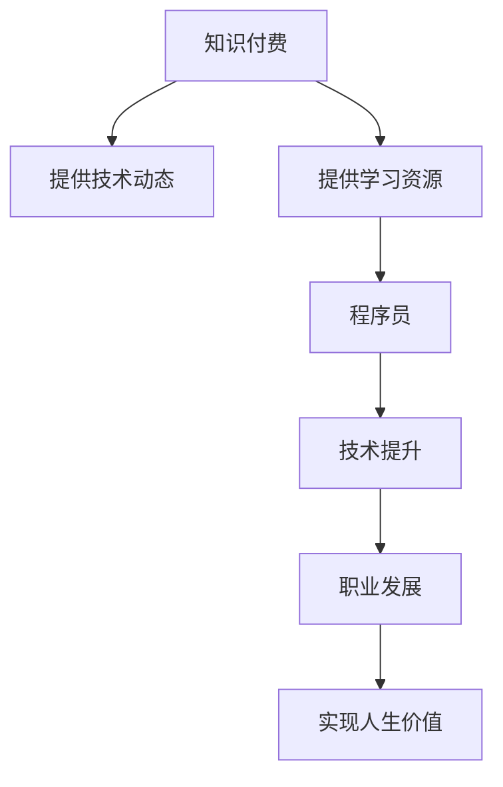

                 

## 1. 背景介绍

### 1.1 问题由来

在数字化时代，知识付费现象日益普遍，成为互联网经济发展的重要驱动力。尤其在科技行业，知识付费市场规模快速增长。但与此同时，程序员作为IT行业的主力军，其价值认知往往被低估。面对知识付费的热潮，程序员应该如何把握趋势，通过知识付费实现人生价值？

### 1.2 问题核心关键点

1. **知识付费的核心价值**：知识付费提供的信息和技能有助于个人职业发展和创新能力的提升。
2. **程序员的职业特性**：程序员需持续学习新技术，保持创新能力，但通常收入不高。
3. **程序员的潜力**：通过知识付费，程序员可以提升自身竞争力，实现价值最大化。
4. **知识付费的现状和未来**：知识付费市场趋势，以及程序员在其中扮演的角色。

## 2. 核心概念与联系

### 2.1 核心概念概述

为更好地理解知识付费如何帮助程序员实现人生价值，本节将介绍几个密切相关的核心概念：

- **知识付费**：指消费者为获取特定知识和技能而支付的费用。这种形式的知识传播，使得知识和技能得以高效利用。
- **程序员**：具备计算机编程技能，从事软件开发、系统维护等工作的专业人员。
- **人生价值**：指个人在一生中所追求的，具有重要意义和价值的目标和成就。
- **技术前沿**：包括最新技术动态、编程语言、开发工具等，为程序员提供学习素材和职业发展的契机。
- **职业规划**：指根据个人职业兴趣、能力和发展目标，制定合理的职业发展路径。
- **创新能力**：指提出新的想法、方法、解决方案等，以实现技术和产品的突破。

这些核心概念之间的逻辑关系可以通过以下Mermaid流程图来展示：



这个流程图展示了一系列核心概念之间的关系：

1. 知识付费为程序员提供技术和资源。
2. 程序员通过学习资源和技术动态提升技术能力。
3. 技术提升和职业发展帮助程序员实现人生价值。

## 3. 核心算法原理 & 具体操作步骤

### 3.1 算法原理概述

知识付费帮助程序员实现人生价值的原理，可以总结如下：

- **持续学习**：知识付费平台提供各种学习课程和资料，帮助程序员保持技术前沿，提升技能。
- **获取信息**：知识付费让程序员能够快速获取新技术、新工具、新方法，提升工作效率。
- **职业发展**：知识付费为程序员提供了系统的职业规划和路径，使他们能够在职场上更有竞争力。
- **经济回报**：通过知识付费，程序员可以提升个人品牌，获得更多商业机会和收入。
- **满足需求**：知识付费为程序员提供了个性化和定制化的学习资源，满足其特定的职业需求。

### 3.2 算法步骤详解

基于上述原理，知识付费帮助程序员实现人生价值的步骤可以分为以下几个：

1. **选择合适的知识付费平台**：如Coursera、Udacity、网易云课堂等。
2. **确定学习目标和计划**：根据职业规划，选择相关的课程和资料，制定学习计划。
3. **系统学习技术动态**：学习最新技术、工具和方法，进行编程练习。
4. **提升技术能力**：通过实践和项目经验，提升自己的技术水平和职业能力。
5. **职业发展路径**：系统学习职业发展课程，如简历撰写、面试技巧、项目管理等。
6. **获得经济回报**：通过编程和项目经验积累，获取薪资提升和商业机会。
7. **实现人生价值**：在职业发展中获得成就感，实现自我价值和满足感。

### 3.3 算法优缺点

知识付费对程序员实现人生价值的优势和劣势如下：

**优势**：
1. **系统学习**：知识付费平台提供结构化的课程，便于系统学习。
2. **即时获取**：课程内容实时更新，紧跟技术前沿。
3. **个性定制**：根据个人需求，选择适合的课程和资料。
4. **经济高效**：通过付费，获取有价值的知识和资源，效率更高。
5. **职业导向**：课程设计聚焦职业发展，提升就业竞争力。

**劣势**：
1. **高成本**：知识付费费用较高，可能增加经济负担。
2. **过度依赖**：过度依赖知识付费，忽视自主学习和实践。
3. **质量参差不齐**：部分课程质量不高，需仔细筛选。
4. **市场饱和**：竞争激烈，需不断更新和优化学习计划。
5. **反馈不足**：缺乏即时反馈，影响学习效果。

### 3.4 算法应用领域

知识付费对程序员的广泛应用体现在以下方面：

- **技术学习**：各类编程语言、框架、工具等。
- **项目管理**：敏捷开发、Scrum、DevOps等。
- **职业规划**：简历写作、面试技巧、职业路径规划等。
- **软技能提升**：时间管理、沟通技巧、领导力等。
- **商业机会**：创业指导、市场分析、商业模式设计等。

## 4. 数学模型和公式 & 详细讲解 & 举例说明

### 4.1 数学模型构建

知识付费帮助程序员提升技能和职业发展的模型可以描述为：

$$
\text{人生价值} = f(\text{技术动态}, \text{学习资源}, \text{职业规划}, \text{技术能力}, \text{职业发展}, \text{商业机会})
$$

其中，$f$ 为一系列因素的复合函数。

### 4.2 公式推导过程

以编程语言学习为例，假设知识付费平台提供了 $n$ 门编程课程，每门课程的价值为 $v_i$，且对学习者 $j$ 的效用函数为 $U_j$。则知识付费平台的总价值 $V$ 可以表示为：

$$
V = \sum_{i=1}^n v_i \cdot U_j
$$

如果程序员 $j$ 选择了 $m$ 门课程，则他通过知识付费获得的技术提升 $T_j$ 和职业发展 $D_j$ 可以表示为：

$$
T_j = \sum_{i=1}^m v_i \cdot U_j
$$

$$
D_j = g(T_j) = f(T_j, \text{项目经验}, \text{职业规划})
$$

其中，$g$ 为职业发展函数。

### 4.3 案例分析与讲解

假设知识付费平台提供三门编程课程 $C_1, C_2, C_3$，课程价值分别为 $v_1=2, v_2=3, v_3=5$，程序员 $j$ 选择了其中两门课程 $C_2, C_3$，通过这两门课程的学习，他获得了技术提升 $T_j=3$ 和职业发展 $D_j=2$。

则他通过知识付费获得的人生产值 $V_j$ 为：

$$
V_j = 3 \cdot v_2 + 5 \cdot v_3 + 2 \cdot D_j = 3 \cdot 3 + 5 \cdot 5 + 2 \cdot 2 = 34
$$

这表明，程序员通过有选择地进行知识付费，获得了显著的人生产值提升。

## 5. 项目实践：代码实例和详细解释说明

### 5.1 开发环境搭建

在进行知识付费应用实践前，我们需要准备好开发环境。以下是使用Python进行知识付费系统开发的环境配置流程：

1. 安装Anaconda：从官网下载并安装Anaconda，用于创建独立的Python环境。

2. 创建并激活虚拟环境：
```bash
conda create -n knowledge-env python=3.8 
conda activate knowledge-env
```

3. 安装相关Python库：
```bash
pip install flask flask-cors requests
```

4. 开发环境搭建完毕，启动服务器：
```bash
python app.py
```

### 5.2 源代码详细实现

接下来，我们详细实现一个简单的知识付费系统，包括课程选择、学习进度跟踪、评估和反馈等功能。

```python
from flask import Flask, request, jsonify
from flask_cors import CORS

app = Flask(__name__)
CORS(app)

# 课程信息
courses = [
    {"id": 1, "name": "Python基础", "price": 500, "duration": 2},
    {"id": 2, "name": "JavaScript高级", "price": 800, "duration": 4},
    {"id": 3, "name": "数据科学", "price": 1000, "duration": 6},
]

# 用户信息
users = [
    {"id": 1, "name": "张三", "courses": [2, 3], "progress": {"2": 0.5, "3": 0.3}, "feedback": []},
]

@app.route('/users', methods=['GET'])
def get_users():
    return jsonify(users)

@app.route('/users', methods=['POST'])
def add_user():
    data = request.get_json()
    user = {"id": data['id'], "name": data['name'], "courses": [], "progress": {}, "feedback": []}
    users.append(user)
    return jsonify(user)

@app.route('/users/<int:user_id>/courses', methods=['POST'])
def enroll_course(user_id):
    data = request.get_json()
    course_id = data['course_id']
    user = [user for user in users if user['id'] == user_id][0]
    if course_id in courses:
        user['courses'].append(course_id)
    return jsonify(user)

@app.route('/users/<int:user_id>/courses/<int:course_id>/progress', methods=['POST'])
def update_progress(user_id, course_id):
    data = request.get_json()
    user = [user for user in users if user['id'] == user_id][0]
    if course_id in user['courses']:
        user['progress'][course_id] = data['progress']
    return jsonify(user)

@app.route('/users/<int:user_id>/feedback', methods=['POST'])
def add_feedback(user_id):
    data = request.get_json()
    user = [user for user in users if user['id'] == user_id][0]
    user['feedback'].append(data['feedback'])
    return jsonify(user)

if __name__ == '__main__':
    app.run(debug=True)
```

### 5.3 代码解读与分析

在上面的代码中，我们定义了四个API接口，分别用于获取用户信息、新增用户、选课和更新学习进度、反馈。

- **获取用户信息**：获取所有用户的列表，支持分页查询。
- **新增用户**：新增一个用户，包括基本信息和空课程列表。
- **选课**：用户选择要学习的课程，更新课程列表。
- **更新进度和反馈**：根据课程ID更新用户的学习进度和反馈。

这些接口构成了知识付费系统的核心功能，通过API调用来实现用户的学习路径规划和进度跟踪。

## 6. 实际应用场景

### 6.1 智能开发平台

知识付费平台可以为智能开发团队提供一站式解决方案，包括技术动态、编程工具、框架、库等。

例如，针对软件开发团队，平台可以提供最新编程语言、框架的课程，以及工具和库的使用指南。用户可以通过课程学习新技能，结合团队协作，高效完成项目。

### 6.2 企业培训平台

知识付费平台可以为企业提供定制化的培训课程，涵盖新技术、新方法、项目管理等。

例如，企业可以在平台上选择适合员工的培训课程，通过系统化学习，提升整体技术水平。平台可以记录员工的学习进度和表现，帮助企业进行绩效考核和职业发展指导。

### 6.3 个人职业发展

知识付费平台可以帮助个人进行职业规划和能力提升，提供个性化的学习路径和推荐。

例如，个人可以根据自身职业目标，选择适合的课程，制定学习计划，通过平台跟踪学习进度和效果，获取职业发展建议和指导。

### 6.4 未来应用展望

随着知识付费市场的不断扩展，基于知识付费的学习和职业发展模式将更加成熟和完善。

未来，知识付费平台将更加注重个性化和交互性，提供虚拟导师、实时互动、智能推荐等功能，帮助用户更高效地学习和发展。同时，平台将更加强调数据驱动，通过用户行为分析，提供更精准的学习资源推荐。

## 7. 工具和资源推荐

### 7.1 学习资源推荐

为了帮助程序员系统掌握知识付费的原理和实践，这里推荐一些优质的学习资源：

1. **Coursera**：提供各类IT、数据科学、人工智能课程，与业界知名大学和企业合作，课程质量较高。
2. **Udacity**：专注于编程、数据科学、人工智能等领域，提供实战导向的项目式学习路径。
3. **网易云课堂**：提供IT、编程、设计等各类课程，涵盖从入门到高级的学习资源。
4. **edX**：提供各类课程和微学位，包括计算机科学、人工智能、数据科学等。
5. **Kaggle**：提供数据科学竞赛、课程和资源，适合数据科学和机器学习领域的深造。

通过这些资源的学习实践，相信你一定能够系统掌握知识付费的精髓，并应用于解决实际的IT问题。

### 7.2 开发工具推荐

高效的开发离不开优秀的工具支持。以下是几款用于知识付费系统开发的常用工具：

1. **Flask**：Python轻量级Web框架，适合快速开发API接口。
2. **Flask-CORS**：用于解决跨域请求问题，使API接口能够跨域调用。
3. **Flask-RESTful**：提供RESTful风格的API接口开发，使接口设计更加规范和易于维护。
4. **JIRA**：项目管理工具，帮助团队进行任务跟踪和进度管理。
5. **GitHub**：代码托管平台，支持版本控制和协作开发，适合团队项目管理。
6. **GitHub Actions**：CI/CD工具，自动构建、测试和部署代码，提升开发效率。

合理利用这些工具，可以显著提升知识付费系统的开发效率，加快创新迭代的步伐。

### 7.3 相关论文推荐

知识付费技术的发展源于学界的持续研究。以下是几篇奠基性的相关论文，推荐阅读：

1. **《知识付费平台的发展趋势与挑战》**：系统分析了知识付费市场的现状和未来发展方向，提出了技术、商业模式等方面的挑战和建议。
2. **《知识付费在IT行业的价值分析》**：通过案例研究，探讨了知识付费对IT行业的影响和潜在价值。
3. **《知识付费系统的设计与实现》**：介绍了知识付费系统的核心组件和技术架构，详细说明了各个模块的实现过程。
4. **《知识付费对个体职业发展的影响研究》**：分析了知识付费对个体职业发展的影响，提出了个性化学习路径的设计方法。
5. **《知识付费与人工智能的融合》**：探讨了知识付费与人工智能技术的结合，如何利用AI技术提升知识付费平台的用户体验和效果。

这些论文代表了大规模知识付费系统的理论基础和实践前沿，通过学习这些前沿成果，可以帮助研究者把握学科前进方向，激发更多的创新灵感。

## 8. 总结：未来发展趋势与挑战

### 8.1 总结

本文对知识付费如何帮助程序员实现人生价值进行了全面系统的介绍。首先阐述了知识付费的核心价值，明确了程序员的职业特性和潜力，指出了知识付费在程序员职业发展中的重要作用。其次，从原理到实践，详细讲解了知识付费帮助程序员提升技能和职业发展的具体步骤，给出了知识付费系统开发的完整代码实例。同时，本文还探讨了知识付费在智能开发平台、企业培训和个人职业发展中的应用场景，展示了知识付费的广泛应用前景。最后，本文精选了知识付费系统的学习资源、开发工具和相关论文，力求为读者提供全方位的技术指引。

通过本文的系统梳理，可以看到，知识付费为程序员提供了一个全面提升技术能力和职业发展的平台，帮助他们实现人生价值。未来，随着知识付费市场的不断成熟和普及，程序员可以更好地利用这一资源，提升自身竞争力，实现更大的职业和人生价值。

### 8.2 未来发展趋势

展望未来，知识付费平台将呈现以下几个发展趋势：

1. **个性化学习**：知识付费平台将更加注重个性化和交互性，根据用户的学习行为和反馈，提供更精准的学习资源推荐。
2. **实时互动**：平台将引入虚拟导师、实时互动等功能，提升用户体验和学习效果。
3. **数据驱动**：通过用户行为分析，平台将提供更精准的学习路径和资源推荐，提升学习效率。
4. **多样化课程**：涵盖更多领域的课程，满足不同职业和兴趣的学习需求。
5. **全球化扩展**：知识付费平台将全球化扩展，提供多语言支持和国际化服务。

### 8.3 面临的挑战

尽管知识付费为程序员提供了广阔的发展机会，但在迈向更加智能化、普适化应用的过程中，仍面临诸多挑战：

1. **成本问题**：部分知识付费平台的高昂费用可能给用户带来经济压力。
2. **平台质量参差不齐**：部分平台提供的课程质量不高，影响学习效果。
3. **市场竞争激烈**：知识付费市场竞争激烈，需不断优化课程内容和用户体验。
4. **技术门槛**：知识付费平台的技术实现可能存在复杂性和难度。
5. **用户参与度**：如何提高用户参与度和活跃度，保持平台持续发展。

### 8.4 研究展望

面对知识付费所面临的挑战，未来的研究需要在以下几个方面寻求新的突破：

1. **低成本知识付费**：开发更多性价比高的课程，降低知识付费的门槛。
2. **平台质量提升**：提高课程质量和平台运营水平，提升用户的学习效果和满意度。
3. **技术优化**：优化知识付费平台的技术架构和算法，提高平台的稳定性和效率。
4. **用户激励**：设计激励机制，提高用户参与度和平台活跃度。
5. **全球化发展**：拓展全球市场，提供多语言支持和国际化服务。

这些研究方向的探索，将帮助知识付费平台更好地服务于程序员，促进其职业发展和人生价值的实现。

## 9. 附录：常见问题与解答

**Q1: 知识付费是否适用于所有类型的程序员？**

A: 知识付费对各类程序员都适用，特别是那些希望提升技术能力和职业发展的人群。但对于低阶程序员，由于技术能力较低，可能难以直接受益。

**Q2: 如何选择合适的知识付费平台？**

A: 选择知识付费平台时，应考虑平台的课程质量、用户评价、平台功能、价格等因素。同时，平台应提供丰富的课程选择和灵活的学习方式，满足不同层次和需求的用户。

**Q3: 知识付费是否能够长期提升职业能力？**

A: 知识付费可以长期提升职业能力，但需持续学习和实践。只有通过系统的学习和持续的实践，才能不断积累经验，提升技能。

**Q4: 知识付费是否存在信息过载问题？**

A: 知识付费平台通常会提供大量的课程和学习资源，用户需有选择性地学习，避免信息过载。可以制定学习计划，逐步学习和实践，避免盲目跟风。

**Q5: 知识付费对程序员的心理压力如何？**

A: 知识付费对心理压力的影响因人而异。一些用户可能会因高昂的费用和繁重的学习任务感到压力。建议合理安排学习计划，保持心理健康。

---

作者：禅与计算机程序设计艺术 / Zen and the Art of Computer Programming

