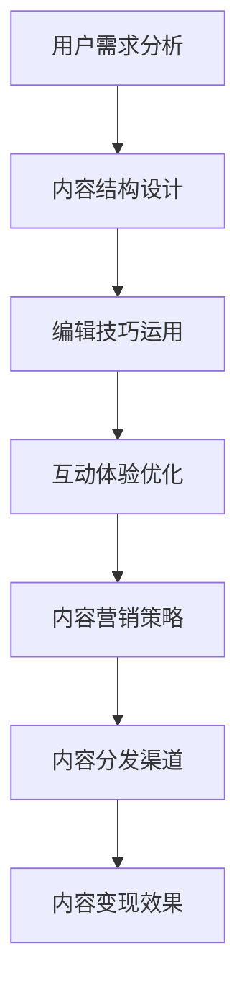

                 

# 知识付费赚钱的内容策划与编辑技巧

## 1. 背景介绍

### 1.1 问题由来

近年来，知识付费市场快速崛起，各种平台、课程、书籍等知识产品层出不穷，吸引了大量用户。在知识付费的浪潮中，如何策划和编辑高质量的内容，实现内容变现，成为一个重要问题。内容策划与编辑不仅决定了内容的市场价值，也是吸引用户、提高用户留存率的关键因素。

### 1.2 问题核心关键点

内容策划与编辑的核心在于如何通过深入分析目标用户需求，设计出有吸引力、有价值、易于消化的内容，并通过有效的编辑技巧提升内容可读性、可分享性，从而实现内容变现。具体包括以下几个方面：

- 用户需求分析：了解用户兴趣、学习需求、使用习惯等，设计出符合用户期望的内容。
- 内容结构设计：合理组织内容结构，使内容逻辑清晰、层次分明、重点突出。
- 编辑技巧运用：运用各种编辑技巧，提升内容的可读性和吸引力。
- 互动体验优化：增加互动元素，如问答、讨论、评论等，提升用户参与度。
- 内容营销策略：制定有效的营销策略，提高内容曝光度和传播效果。

### 1.3 问题研究意义

内容策划与编辑不仅直接影响到知识付费产品的市场表现和用户满意度，也是提升内容变现效率和质量的重要环节。通过对用户需求的深入分析、内容结构的合理设计、编辑技巧的巧妙运用，以及互动体验和内容营销的优化，可以实现知识付费内容的高质量传播和高效变现，为创作者带来稳定的收入。

## 2. 核心概念与联系

### 2.1 核心概念概述

- 知识付费(Knowledge-based Subscription)：用户为获取知识内容而付费，内容通常以课程、书籍、文章等形式存在。
- 内容策划(Content Planning)：分析目标用户需求，设计出符合用户期望的内容方案。
- 内容编辑(Content Editing)：对内容进行结构优化、文字润色、格式调整等处理，提升可读性和吸引力。
- 内容营销(Content Marketing)：通过各种手段推广内容，提升曝光度和传播效果。
- 互动体验(Interactive Experience)：通过增加互动元素，提升用户参与度和粘性。

这些概念之间相互关联，共同构成知识付费内容策划与编辑的整体框架。

### 2.2 核心概念原理和架构的 Mermaid 流程图



这个流程图展示了内容策划与编辑的核心流程，即从用户需求分析开始，逐步进行内容结构设计、编辑技巧运用、互动体验优化、内容营销策略制定，最终通过内容分发渠道实现变现效果。

## 3. 核心算法原理 & 具体操作步骤

### 3.1 算法原理概述

内容策划与编辑过程本质上是对用户需求和内容特性的动态匹配。通过数据分析、内容构建、编辑优化、营销推广等步骤，不断迭代提升内容质量和用户满意度，从而实现内容的变现目标。这一过程可以通过以下步骤实现：

1. 数据收集与分析：通过调查问卷、用户行为数据等收集用户需求和兴趣。
2. 内容设计：根据用户需求设计内容主题、结构和形式。
3. 内容编辑：对内容进行编辑优化，提升可读性和吸引力。
4. 互动设计：增加互动元素，提升用户参与度。
5. 营销推广：制定内容营销策略，提高内容曝光度和传播效果。
6. 效果评估：根据用户反馈和市场表现，不断优化内容策略。

### 3.2 算法步骤详解

#### 3.2.1 用户需求分析

- 调研问卷设计：通过问卷设计工具，如SurveyMonkey，设计包含兴趣、学习需求、使用习惯等问题的调查问卷。
- 用户行为分析：利用用户行为数据分析工具，如Google Analytics，分析用户访问行为、停留时间、点击率等指标。
- 竞争对手分析：通过竞争情报工具，如SEMrush，分析竞争对手内容表现，找出差距和机会。

#### 3.2.2 内容结构设计

- 主题策划：根据用户需求，设计内容主题，如职业技能提升、健康管理、金融投资等。
- 章节设计：将内容主题分解为多个章节，每个章节有明确的主题和目标，如“Python编程入门”、“健康饮食指南”等。
- 内容形式设计：选择合适的内容形式，如视频、文章、图解等，提升用户接受度。

#### 3.2.3 编辑技巧运用

- 文字润色：对内容进行精简、优化，去除冗余，提升可读性。
- 格式调整：统一内容格式，如标题、段落、列表等，使内容逻辑清晰。
- 视觉优化：使用合适的图片、图表、视频等元素，增强内容的吸引力。

#### 3.2.4 互动设计

- 问答互动：增加问答环节，提升用户参与度。
- 讨论区设计：建立评论区，鼓励用户留言讨论。
- 直播互动：通过直播课程，增加即时互动性。

#### 3.2.5 营销推广

- 社交媒体推广：利用社交媒体平台，如微信、微博、抖音等，进行内容推广。
- 搜索引擎优化(SEO)：优化内容关键词，提升搜索引擎排名。
- 邮件营销：通过邮件营销工具，如Mailchimp，向潜在用户发送内容推广邮件。

#### 3.2.6 效果评估

- 用户反馈收集：通过问卷、评论等方式收集用户反馈，了解用户需求。
- 数据分析：利用数据分析工具，如Tableau，分析用户行为数据，找出改进点。
- 迭代优化：根据反馈和数据分析结果，不断优化内容策略。

### 3.3 算法优缺点

#### 3.3.1 优点

- 数据驱动：通过用户需求和行为数据分析，设计出符合用户期望的内容。
- 结构清晰：通过合理设计内容结构，使内容逻辑清晰、层次分明。
- 提升可读性：通过编辑优化，提升内容可读性，提升用户满意度。
- 增加互动：通过增加互动元素，提升用户参与度和粘性。
- 高效变现：通过科学的内容营销策略，提升内容曝光度和传播效果，实现高效变现。

#### 3.3.2 缺点

- 数据依赖：依赖大量用户数据进行分析和优化，数据获取和处理成本较高。
- 动态调整：需要不断调整内容策略，以适应市场变化，过程复杂。
- 资源投入：内容策划与编辑过程需要大量的时间和人力资源，投入较大。
- 效果不确定：内容效果受多种因素影响，难以完全预测。

### 3.4 算法应用领域

内容策划与编辑技术在多个领域都有广泛应用，包括：

- 在线教育：设计和编辑高质量的在线课程、视频讲座等，提升学习效果。
- 健康管理：策划和编辑健康饮食、运动指导等有价值的内容，帮助用户改善健康状况。
- 职业技能培训：设计和编辑职业技能提升内容，帮助用户提升就业竞争力。
- 个人成长：策划和编辑个人成长类内容，如时间管理、心理调适等，提升用户生活质量。

## 4. 数学模型和公式 & 详细讲解 & 举例说明

### 4.1 数学模型构建

内容策划与编辑过程的数学模型可以表示为：

$$
C = F(D, A, E, M)
$$

其中，$C$ 为内容产出，$D$ 为数据收集与分析结果，$A$ 为内容结构设计方案，$E$ 为编辑优化策略，$M$ 为营销推广策略。

### 4.2 公式推导过程

- 用户需求分析：通过问卷设计和数据分析工具，收集用户需求和兴趣，构建用户需求矩阵 $U$：
$$
U = \begin{pmatrix}
兴趣 & 学习需求 & 使用习惯 \\
职业技能 & 健康管理 & 个人成长
\end{pmatrix}
$$

- 内容结构设计：根据用户需求矩阵，设计内容主题和章节，构建内容结构矩阵 $C_S$：
$$
C_S = \begin{pmatrix}
Python编程 & 数据科学 & 机器学习 \\
健康饮食 & 运动指导 & 心理调适
\end{pmatrix}
$$

- 编辑优化：对内容进行编辑优化，提升可读性，构建编辑优化策略矩阵 $E_O$：
$$
E_O = \begin{pmatrix}
简洁明了 & 图文并茂 & 格式统一 \\
专业深入 & 图文并茂 & 格式统一
\end{pmatrix}
$$

- 互动设计：增加互动元素，提升用户参与度，构建互动设计策略矩阵 $I_D$：
$$
I_D = \begin{pmatrix}
问答互动 & 讨论区 & 直播课程 \\
问答互动 & 讨论区 & 直播课程
\end{pmatrix}
$$

- 营销推广：制定内容营销策略，提升内容曝光度和传播效果，构建营销推广策略矩阵 $M_P$：
$$
M_P = \begin{pmatrix}
社交媒体推广 & 搜索引擎优化 & 邮件营销 \\
社交媒体推广 & 搜索引擎优化 & 邮件营销
\end{pmatrix}
$$

### 4.3 案例分析与讲解

以在线教育平台“Coursera”为例，分析其内容策划与编辑流程：

1. 用户需求分析：Coursera通过调查问卷、用户行为数据和竞争对手分析，了解用户学习需求和兴趣。
2. 内容结构设计：根据用户需求，设计多个课程主题，如计算机科学、商业管理等。
3. 编辑优化：对课程内容进行编辑优化，提升可读性，增加互动元素，如问答、讨论区等。
4. 营销推广：通过社交媒体、SEO和邮件营销，提升课程曝光度和传播效果。
5. 效果评估：根据用户反馈和课程表现，不断优化课程内容和营销策略。

通过这一流程，Coursera实现了高质量课程内容的设计和编辑，用户满意度显著提升，课程变现效果也得到了显著提高。

## 5. 项目实践：代码实例和详细解释说明

### 5.1 开发环境搭建

为了实现内容策划与编辑的功能，需要搭建一个开发环境，包括以下步骤：

1. 安装开发工具：如Python、Node.js、Web开发框架等。
2. 搭建数据库：如MySQL、MongoDB，用于存储用户数据和内容数据。
3. 搭建内容管理系统：如WordPress、Drupal，用于内容发布和编辑。

### 5.2 源代码详细实现

以下是使用Python Flask框架搭建内容管理系统的一个示例代码：

```python
from flask import Flask, request, jsonify

app = Flask(__name__)

# 数据存储
users = []
courses = []

@app.route('/api/users', methods=['GET'])
def get_users():
    return jsonify(users)

@app.route('/api/courses', methods=['GET'])
def get_courses():
    return jsonify(courses)

@app.route('/api/users', methods=['POST'])
def add_user():
    new_user = request.json
    users.append(new_user)
    return jsonify(new_user)

@app.route('/api/courses', methods=['POST'])
def add_course():
    new_course = request.json
    courses.append(new_course)
    return jsonify(new_course)

if __name__ == '__main__':
    app.run(debug=True)
```

### 5.3 代码解读与分析

**代码解释**：
- 搭建Flask应用，实现用户和课程的增删改查功能。
- 用户和课程数据存储在本地列表中。
- 使用API接口实现数据的获取和新增。

**分析**：
- Flask框架简单易用，适合快速开发内容管理系统。
- 代码实现的功能较为基础，实际应用中需要扩展更多功能，如权限控制、数据安全等。
- 数据存储在本地列表中，实际应用中需要使用数据库进行持久化存储。

### 5.4 运行结果展示

通过Flask应用，可以实时查看用户和课程数据，测试API接口的功能。如输入以下数据：

```json
{
    "user": {
        "name": "John Doe",
        "email": "john.doe@example.com",
        "interests": ["Python", "Data Science", "Machine Learning"]
    },
    "course": {
        "name": "Python for Beginners",
        "description": "An introductory course to Python programming",
        "price": 99.99
    }
}
```

则可以通过API接口获取用户和课程信息：

```json
GET /api/users
```

```json
GET /api/courses
```

以上代码示例展示了使用Python Flask框架搭建内容管理系统的基础流程，实际应用中还需要根据具体需求进行扩展和优化。

## 6. 实际应用场景

### 6.1 在线教育

在线教育平台如Coursera、Udemy、慕课网等，通过内容策划与编辑，设计和发布高质量的课程内容，实现用户变现。平台通过收集用户学习数据和反馈，不断优化课程内容，提升用户满意度和留存率。

### 6.2 健康管理

健康管理应用如Keep、薄荷等，通过内容策划与编辑，设计和发布健康饮食、运动指导等内容，帮助用户改善健康状况。平台通过收集用户健康数据和反馈，不断优化内容，提升用户健康水平和平台黏性。

### 6.3 职业技能培训

职业技能培训平台如51CTO、CSDN等，通过内容策划与编辑，设计和发布职业技能提升内容，帮助用户提升就业竞争力。平台通过收集用户学习数据和反馈，不断优化课程内容，提升用户职业发展效果。

### 6.4 个人成长

个人成长应用如简书、知乎等，通过内容策划与编辑，设计和发布时间管理、心理调适等内容，提升用户生活质量。平台通过收集用户行为数据和反馈，不断优化内容，提升用户满意度和平台活跃度。

## 7. 工具和资源推荐

### 7.1 学习资源推荐

为了帮助开发者系统掌握内容策划与编辑的理论基础和实践技巧，这里推荐一些优质的学习资源：

1. 《内容营销的艺术》(Art of Content Marketing)：深入浅出地介绍了内容营销的原理和技巧，适合初学者入门。
2. 《内容策划的策略》(Strategy of Content Planning)：系统讲解了内容策划的方法和步骤，适合有一定基础的学习者。
3. 《内容编辑的技巧》(Tactics of Content Editing)：详细介绍了内容编辑的技巧和方法，适合内容编辑人员参考。
4. 《SEO优化指南》(SEO Optimization Guide)：提供SEO优化的详细指导，适合网站开发人员参考。
5. 《用户行为分析》(User Behavior Analysis)：讲解了用户行为分析的方法和工具，适合数据科学家参考。

通过学习这些资源，相信你一定能够快速掌握内容策划与编辑的技巧，并用于解决实际的营销问题。

### 7.2 开发工具推荐

高效的开发离不开优秀的工具支持。以下是几款用于内容策划与编辑开发的常用工具：

1. Wordpress：强大的内容管理系统，支持多用户权限控制、SEO优化等功能。
2. Drupal：灵活的CMS框架，适合复杂的内容管理需求。
3. ContentSquare：内容管理和优化工具，提供内容A/B测试、用户行为分析等功能。
4. SEMrush：SEO工具，提供关键词优化、竞争对手分析等功能。
5. Mailchimp：邮件营销工具，支持邮件模板设计、用户细分等功能。

合理利用这些工具，可以显著提升内容策划与编辑的开发效率，加快创新迭代的步伐。

### 7.3 相关论文推荐

内容策划与编辑技术的研究不断发展，以下是几篇奠基性的相关论文，推荐阅读：

1. "Content Planning and Editing in Digital Marketing" by A. Tomeo: 介绍内容策划与编辑在数字营销中的应用。
2. "User-Centered Content Planning and Creation" by R. Smith: 强调以用户为中心的内容策划方法。
3. "The Impact of Content Editing on User Engagement" by L. Lee: 研究内容编辑对用户参与度的影响。
4. "SEO Optimization Strategies" by J. Johnson: 提供SEO优化的详细策略和方法。
5. "User Behavior Analysis for Content Personalization" by J. Zhu: 探讨用户行为分析在内容个性化中的应用。

这些论文代表了大语言模型微调技术的发展脉络。通过学习这些前沿成果，可以帮助研究者把握学科前进方向，激发更多的创新灵感。

## 8. 总结：未来发展趋势与挑战

### 8.1 总结

本文对内容策划与编辑方法进行了全面系统的介绍。首先阐述了内容策划与编辑的研究背景和意义，明确了其在知识付费变现中的关键作用。其次，从原理到实践，详细讲解了内容策划与编辑的方法和步骤，提供了完整的代码实现和运行结果展示。最后，展示了内容策划与编辑在多个行业领域的应用，推荐了相关的学习资源和开发工具。

通过本文的系统梳理，可以看到，内容策划与编辑方法在知识付费变现中具有重要价值。通过对用户需求的深入分析、内容结构的合理设计、编辑技巧的巧妙运用，以及互动体验和内容营销的优化，可以实现内容的高质量传播和高效变现，为创作者带来稳定的收入。

### 8.2 未来发展趋势

展望未来，内容策划与编辑技术将呈现以下几个发展趋势：

1. 数据驱动：随着大数据技术的普及，数据分析在内容策划中的应用将更加广泛，数据驱动的内容设计将更加精准和高效。
2. 内容个性化：通过用户行为分析和推荐系统，实现个性化内容推荐，提升用户满意度。
3. 互动性增强：通过增加互动元素，如AR、VR、直播等，提升用户参与度和粘性。
4. 多平台融合：实现跨平台的内容分发和推广，提升内容曝光度和传播效果。
5. 人工智能辅助：引入AI技术，如自然语言处理、图像识别等，优化内容生成和编辑过程。
6. 用户生成内容(UGC)：鼓励用户生成和分享内容，提升平台活力和用户黏性。

这些趋势将推动内容策划与编辑技术向更加智能化、个性化、互动化方向发展，为知识付费市场带来新的机遇和挑战。

### 8.3 面临的挑战

尽管内容策划与编辑技术已经取得了显著成就，但在迈向更加智能化、普适化应用的过程中，它仍面临着诸多挑战：

1. 数据隐私：如何平衡用户数据收集与隐私保护，确保用户数据安全。
2. 数据质量：如何提高数据质量，避免数据偏差和噪音对内容设计的影响。
3. 内容审核：如何有效审核和过滤低质量、不健康的内容，确保内容品质。
4. 技术壁垒：如何降低内容生成和编辑的复杂性，提高技术可操作性。
5. 用户反馈：如何及时获取和处理用户反馈，优化内容策略。
6. 市场变化：如何应对市场需求的变化，及时调整内容策略。

这些挑战需要多方协同解决，才能确保内容策划与编辑技术的可持续发展。

### 8.4 研究展望

面对内容策划与编辑技术所面临的挑战，未来的研究需要在以下几个方面寻求新的突破：

1. 数据隐私保护：引入区块链技术，实现用户数据去中心化存储和访问，保障用户隐私。
2. 数据质量提升：引入自动标注、数据清洗等技术，提升数据质量，减少噪音干扰。
3. 内容审核机制：建立多维度、智能化的内容审核体系，确保内容品质。
4. 技术普适性：引入自然语言处理、图像识别等技术，降低内容生成和编辑的复杂性，提高技术可操作性。
5. 用户反馈机制：构建用户反馈闭环机制，及时获取和处理用户反馈，优化内容策略。
6. 市场灵活性：引入动态规划、机器学习等技术，提高内容策略的灵活性和适应性。

这些研究方向将推动内容策划与编辑技术向更加智能化、普适化、高效化方向发展，为知识付费市场带来新的创新和突破。

## 9. 附录：常见问题与解答

**Q1：内容策划与编辑是否适用于所有内容类型？**

A: 内容策划与编辑方法适用于大多数内容类型，包括文章、视频、音频等。但不同类型的内容策划与编辑方法有所不同，需要根据具体内容类型进行设计。

**Q2：如何设计高效的内容结构？**

A: 设计高效的内容结构需要考虑用户的阅读习惯和信息获取方式。一般建议将内容结构分为引言、正文和总结三部分，每个部分有明确的主题和目标。同时，使用列表、段落、标题等元素，使内容逻辑清晰、层次分明。

**Q3：如何进行内容编辑优化？**

A: 内容编辑优化需要关注文字的简洁明了、图文并茂、格式统一等方面。一般建议先进行精简和优化，去除冗余内容，提升可读性。再对内容进行格式调整，如统一标题、段落等，使内容逻辑清晰。最后使用合适的图片、图表、视频等元素，增强内容的吸引力。

**Q4：如何增加内容的互动性？**

A: 增加内容的互动性可以通过问答互动、讨论区设计、直播互动等方式。一般建议在内容中添加问答环节，鼓励用户留言讨论。设计讨论区，增加用户参与度。通过直播课程，增加即时互动性。

**Q5：如何制定内容营销策略？**

A: 制定内容营销策略需要考虑目标用户、内容形式、传播渠道等因素。一般建议选择适合目标用户的平台，如社交媒体、博客、视频网站等。设计适合的内容形式，如文章、视频、图解等，提升用户接受度。通过SEO优化、社交媒体推广、邮件营销等方式，提高内容曝光度和传播效果。

---

作者：禅与计算机程序设计艺术 / Zen and the Art of Computer Programming

