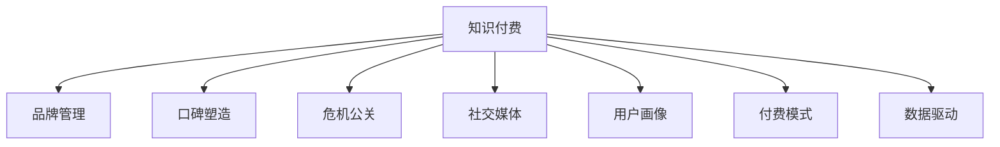

                 

# 知识付费赚钱的品牌口碑管理与危机公关

> 关键词：知识付费、品牌管理、口碑塑造、危机公关、社交媒体、内容质量、用户体验、付费模式、数据驱动

## 1. 背景介绍

### 1.1 问题由来
在数字化经济时代，知识付费成为一种新兴的商业模式，通过提供高质量的课程、音频、视频等内容，满足用户对于专业知识和技能的获取需求。知识付费平台的兴起不仅推动了教育领域的变革，也催生了品牌口碑管理和危机公关的新课题。

在知识付费平台上，一个品牌的声誉和用户的信任度是其竞争力的重要组成部分。品牌口碑良好时，用户更容易付费并推荐给朋友；一旦发生危机事件，品牌声誉受损，可能导致用户流失、收入下降，甚至直接导致平台的倒闭。因此，如何通过有效的品牌管理策略和危机公关手段，提升品牌价值，保护和维护用户信任，是知识付费平台亟需解决的问题。

### 1.2 问题核心关键点
品牌口碑管理和危机公关的核心在于以下几点：
- **用户感知**：用户的购买行为和反馈直接影响品牌的口碑，需要关注用户对课程内容、平台服务、社区氛围等各个维度的感知。
- **数据驱动**：通过数据分析，及时识别品牌口碑变化和潜在危机，制定应对措施。
- **主动沟通**：在危机发生时，及时、透明、负责任地与用户沟通，控制舆情扩散。
- **服务改进**：持续优化课程内容和平台服务，提升用户满意度，增强品牌忠诚度。

### 1.3 问题研究意义
有效的品牌口碑管理和危机公关不仅有助于知识付费平台的长期稳定发展，还能增强品牌的市场竞争力，吸引更多高质量的讲师和内容生产者，形成良性循环。对于用户而言，良好的品牌口碑意味着更高的课程质量和服务保障，从而提升用户体验，激发更多的付费意愿。

## 2. 核心概念与联系

### 2.1 核心概念概述

为更好地理解知识付费平台品牌口碑管理与危机公关，本节将介绍几个关键概念：

- **知识付费**：通过在线课程、音频、视频等形式，为用户提供专业知识或技能学习的服务，用户需支付一定的费用。
- **品牌管理**：企业或平台通过一系列策略和手段，维护和提升品牌形象和用户信任。
- **口碑塑造**：用户对品牌或产品的评价和传播，影响品牌声誉的关键因素。
- **危机公关**：在品牌出现危机时，通过合理的手段和策略，控制和扭转公众对品牌的负面看法。
- **社交媒体**：用户广泛使用的信息交流平台，品牌口碑管理和危机公关的重要阵地。
- **用户画像**：通过数据分析，构建的用户特征模型，用于指导内容和服务的定制化。
- **付费模式**：知识付费平台采用的不同付费策略，如单次购买、月卡、年费等。
- **数据驱动**：利用数据进行决策支持，提升品牌管理的科学性和有效性。

这些概念之间的逻辑关系可以通过以下Mermaid流程图来展示：



这个流程图展示了几大核心概念及其之间的联系：

1. 知识付费平台的核心产品是课程和服务。
2. 品牌管理通过各种策略和手段提升品牌形象，吸引用户。
3. 口碑塑造关注用户对品牌的评价和传播，影响品牌声誉。
4. 危机公关在品牌面临风险时采取措施，控制负面影响。
5. 社交媒体是用户评价和传播的重要渠道。
6. 用户画像通过数据分析构建用户特征，指导个性化服务。
7. 付费模式多样，用户选择偏好影响平台收入。
8. 数据驱动通过数据分析提升决策的科学性和效率。

## 3. 核心算法原理 & 具体操作步骤

### 3.1 算法原理概述

品牌口碑管理和危机公关的实施，本质上是数据驱动的决策过程。通过收集和分析用户的反馈数据、行为数据、社交媒体数据等，对品牌声誉和用户信任度进行评估和预测，从而制定相应的管理策略和应对措施。

具体而言，品牌口碑管理的核心步骤如下：

1. **数据收集与清洗**：收集用户评价、课程评价、社交媒体评论、搜索流量、购买行为等数据，并进行清洗和预处理。
2. **情感分析**：使用自然语言处理技术，对用户反馈进行情感分析，识别积极、消极、中性情绪。
3. **舆情监测**：通过社交媒体监控工具，实时监测用户对品牌的讨论情况，识别负面舆情。
4. **用户画像构建**：利用机器学习算法，构建用户特征模型，用于个性化推荐和内容定制。
5. **品牌价值评估**：结合用户行为数据和情感分析结果，评估品牌在各个维度的价值，如课程质量、服务满意度、用户粘性等。
6. **策略制定与执行**：根据评估结果，制定针对性的品牌管理策略和危机公关方案，并通过社交媒体、平台公告等渠道进行传播和执行。

### 3.2 算法步骤详解

#### 数据收集与清洗
数据收集是品牌口碑管理的第一步。通常需要收集以下几类数据：

- **用户评价**：课程评价、平台评价、讲师评价等。
- **课程数据**：课程浏览量、观看次数、评论量等。
- **社交媒体数据**：微博、微信、抖音等平台上的品牌讨论数据。
- **搜索流量**：用户在搜索引擎上的搜索行为数据。
- **购买行为**：课程购买量、付费模式选择、续订率等。

数据清洗包括去除重复数据、处理缺失值、去除噪声等，确保数据的准确性和完整性。

#### 情感分析
情感分析是理解用户反馈情绪的关键步骤。主要使用自然语言处理技术，将文本数据转化为数值化的情绪标签。具体步骤如下：

1. **分词与去停用词**：将文本分割成词汇，去除停用词。
2. **词向量化**：将词汇转化为词向量，常用的方法有word2vec、GloVe等。
3. **情感标注**：使用机器学习模型，对词向量进行情感标注，如LSTM、BERT等。

例如，对于用户评价“这门课程内容非常丰富，对提高编程技能很有帮助”，通过情感分析可以识别出积极情绪。

#### 舆情监测
舆情监测是品牌管理的实时反馈机制。通过监控社交媒体和搜索引擎，可以及时获取用户对品牌的讨论和评价，识别负面舆情，快速响应和处理。主要步骤如下：

1. **关键词提取**：确定品牌相关的关键词，如“知识付费平台”、“课程质量”等。
2. **实时监控**：通过API或爬虫工具，实时监控社交媒体和搜索引擎，获取相关讨论。
3. **情感分析**：对获取的讨论内容进行情感分析，识别负面舆情。

例如，发现“XXX平台最近课程质量下降，用户体验很差”的负面评价后，需及时采取措施。

#### 用户画像构建
用户画像构建是通过数据分析，了解用户特征和需求的过程。主要步骤如下：

1. **特征提取**：从用户行为数据中提取特征，如浏览时间、购买频率、地域分布等。
2. **模型训练**：使用机器学习算法，如聚类、分类等，构建用户特征模型。
3. **个性化推荐**：根据用户画像，提供个性化推荐课程、活动等。

例如，对于经常购买编程课程的用户，推荐更多相关课程和资源。

#### 品牌价值评估
品牌价值评估是通过综合用户反馈和行为数据，评估品牌在各个维度的价值。主要步骤如下：

1. **数据整合**：整合用户评价、课程数据、社交媒体数据等。
2. **指标计算**：计算关键指标，如课程评分、用户满意度、续订率等。
3. **价值评估**：根据指标计算品牌价值，如课程质量、用户粘性等。

例如，计算某平台的平均课程评分和用户满意度，评估品牌的课程质量。

#### 策略制定与执行
策略制定和执行是基于以上评估结果，制定和实施品牌管理策略和危机公关方案的过程。主要步骤如下：

1. **问题诊断**：根据评估结果，诊断品牌存在的问题，如课程质量、服务满意度等。
2. **策略制定**：制定相应的管理策略和应对措施，如课程改进、服务优化等。
3. **执行与反馈**：通过社交媒体、平台公告等渠道，执行策略，并根据用户反馈进行持续优化。

例如，针对课程质量问题，制定提升课程内容的策略，并通过平台公告通知用户。

### 3.3 算法优缺点

品牌口碑管理和危机公关的算法具有以下优点：

- **实时性**：通过实时监控和数据分析，能够快速响应和处理负面舆情。
- **准确性**：利用机器学习技术，能够准确识别用户情感和舆情变化。
- **个性化**：通过用户画像，提供个性化推荐和服务，提升用户满意度。
- **数据驱动**：基于数据决策，提高了品牌管理的科学性和效率。

同时，该算法也存在一些局限性：

- **数据依赖**：算法效果依赖于数据的丰富度和质量，数据不足可能影响决策。
- **隐私风险**：大量数据收集和使用可能涉及用户隐私问题，需注意合规性。
- **技术门槛**：算法实施需要较高的技术门槛，需专业人员操作和维护。
- **用户信任**：过度依赖算法决策，可能忽视用户主观感受，影响用户信任度。

尽管存在这些局限性，但数据驱动的算法方法在品牌管理中已经显示出巨大的优势，成为主流的选择。

### 3.4 算法应用领域

品牌口碑管理和危机公关的算法在知识付费平台、在线教育、媒体出版等多个领域都有广泛应用，具体包括：

- **知识付费平台**：通过监控用户评价和社交媒体，提升课程质量和用户满意度，增强品牌价值。
- **在线教育**：结合用户画像和情感分析，优化课程推荐和服务，提升用户留存率。
- **媒体出版**：通过舆情监测和情感分析，及时处理负面评价，维护品牌声誉。
- **企业培训**：通过数据分析，定制化培训课程，提升员工满意度和企业竞争力。
- **内容创作者**：利用数据分析工具，优化内容创作和推广策略，提高用户关注度和收益。

## 4. 数学模型和公式 & 详细讲解 & 举例说明

### 4.1 数学模型构建

品牌口碑管理和危机公关的数学模型主要包含以下几个部分：

- **用户情感分析模型**：使用LSTM、BERT等模型，对用户评价进行情感分类，生成情感标签。
- **舆情监测模型**：通过情感分析和关键词提取，实时监测社交媒体和搜索引擎，识别负面舆情。
- **用户画像模型**：使用聚类、分类等算法，构建用户特征模型，用于个性化推荐和内容定制。
- **品牌价值评估模型**：结合用户行为数据和情感分析结果，评估品牌在各个维度的价值，如课程质量、用户满意度等。

### 4.2 公式推导过程

以用户情感分析模型为例，假设用户评价文本序列为 $\{x_i\}_{i=1}^N$，其中 $x_i$ 为文本，情感标签为 $\{y_i\}_{i=1}^N$，其中 $y_i \in \{0, 1\}$，0表示负面情绪，1表示正面情绪。情感分析模型的目标是最小化预测值和实际值之间的差异，即：

$$
\min_{\theta} \sum_{i=1}^N \ell(y_i, \hat{y}_i)
$$

其中 $\hat{y}_i$ 为模型预测的情感标签，$\ell$ 为损失函数，常用的有交叉熵损失和均方误差损失。

对于LSTM模型，公式为：

$$
\hat{y}_i = \sigma(W_h \cdot [\text{LSTM}(x_i; \theta_h) + \text{LSTM}(x_{i-1}; \theta_h)]
$$

其中 $\sigma$ 为激活函数，$W_h$ 为权重矩阵，$\theta_h$ 为LSTM模型参数。

对于BERT模型，公式为：

$$
\hat{y}_i = \sigma(W_h \cdot [\text{BERT}(x_i; \theta_h) + \text{BERT}(x_{i-1}; \theta_h)]
$$

其中 $\sigma$ 为激活函数，$W_h$ 为权重矩阵，$\theta_h$ 为BERT模型参数。

通过上述公式，可以计算出每个文本的情感预测值，并用于品牌口碑管理和危机公关的后续步骤。

### 4.3 案例分析与讲解

以某知识付费平台为例，假设平台收集到大量用户评价数据：

| 用户评价 | 情感标签 |
| --- | --- |
| 这门课程内容非常丰富，对提高编程技能很有帮助 | 1 |
| 课程内容比较浅显，没有达到预期效果 | 0 |
| 讲师讲解很生动，但课程安排不合理 | 1 |
| 课程质量很差，完全浪费钱 | 0 |

使用LSTM或BERT模型对上述数据进行情感分类，得到情感标签为1和0的比例。假设模型训练后，情感标签为1的比例为80%，0的比例为20%。

根据情感分析结果，平台发现课程质量存在问题，需要进行改进。接下来，平台可以采取以下措施：

1. **优化课程内容**：针对评价中提到的问题，调整课程结构和内容，提升课程质量。
2. **加强讲师培训**：对讲师进行培训，提高其讲解效果和课程安排合理性。
3. **收集用户反馈**：通过平台公告和问卷调查，收集更多用户反馈，持续改进课程。
4. **用户激励措施**：针对优质课程和讲师，提供优惠和奖励，提升用户满意度和粘性。

通过以上措施，平台可以逐步提升课程质量和用户满意度，增强品牌声誉。

## 5. 项目实践：代码实例和详细解释说明

### 5.1 开发环境搭建

在进行品牌口碑管理和危机公关的实践前，我们需要准备好开发环境。以下是使用Python进行开发的环境配置流程：

1. 安装Anaconda：从官网下载并安装Anaconda，用于创建独立的Python环境。

2. 创建并激活虚拟环境：
```bash
conda create -n brand_monitor_env python=3.8 
conda activate brand_monitor_env
```

3. 安装必要的库：
```bash
pip install pandas numpy transformers sklearn nltk pytorch torchtext
```

4. 安装情感分析库：
```bash
pip install textblob
```

5. 安装舆情监测库：
```bash
pip install pyspy
```

完成上述步骤后，即可在`brand_monitor_env`环境中开始品牌口碑管理和危机公关的实践。

### 5.2 源代码详细实现

下面我们以某知识付费平台的用户情感分析为例，给出使用Python进行情感分析的代码实现。

首先，定义情感分析模型：

```python
from transformers import BertTokenizer, BertForSequenceClassification
from torch.utils.data import Dataset, DataLoader
import torch

class ReviewDataset(Dataset):
    def __init__(self, texts, labels, tokenizer, max_len=512):
        self.texts = texts
        self.labels = labels
        self.tokenizer = tokenizer
        self.max_len = max_len
        
    def __len__(self):
        return len(self.texts)
    
    def __getitem__(self, item):
        text = self.texts[item]
        label = self.labels[item]
        
        encoding = self.tokenizer(text, return_tensors='pt', max_length=self.max_len, padding='max_length', truncation=True)
        input_ids = encoding['input_ids'][0]
        attention_mask = encoding['attention_mask'][0]
        
        # 对label进行编码
        encoded_label = label2id[label] if isinstance(label, str) else label
        
        return {'input_ids': input_ids, 
                'attention_mask': attention_mask,
                'labels': encoded_label}

# 标签与id的映射
label2id = {'positive': 1, 'negative': 0}
id2label = {v: k for k, v in label2id.items()}

# 创建dataset
tokenizer = BertTokenizer.from_pretrained('bert-base-uncased')
train_dataset = ReviewDataset(train_texts, train_labels, tokenizer)
dev_dataset = ReviewDataset(dev_texts, dev_labels, tokenizer)
test_dataset = ReviewDataset(test_texts, test_labels, tokenizer)

# 加载预训练模型
model = BertForSequenceClassification.from_pretrained('bert-base-uncased', num_labels=len(label2id))

# 设置优化器和超参数
optimizer = AdamW(model.parameters(), lr=2e-5)
device = torch.device('cuda') if torch.cuda.is_available() else torch.device('cpu')
model.to(device)
```

然后，定义训练和评估函数：

```python
from tqdm import tqdm
import torch.nn.functional as F

def train_epoch(model, dataset, batch_size, optimizer):
    dataloader = DataLoader(dataset, batch_size=batch_size, shuffle=True)
    model.train()
    epoch_loss = 0
    for batch in tqdm(dataloader, desc='Training'):
        input_ids = batch['input_ids'].to(device)
        attention_mask = batch['attention_mask'].to(device)
        labels = batch['labels'].to(device)
        model.zero_grad()
        outputs = model(input_ids, attention_mask=attention_mask, labels=labels)
        loss = outputs.loss
        epoch_loss += loss.item()
        loss.backward()
        optimizer.step()
    return epoch_loss / len(dataloader)

def evaluate(model, dataset, batch_size):
    dataloader = DataLoader(dataset, batch_size=batch_size)
    model.eval()
    preds, labels = [], []
    with torch.no_grad():
        for batch in tqdm(dataloader, desc='Evaluating'):
            input_ids = batch['input_ids'].to(device)
            attention_mask = batch['attention_mask'].to(device)
            batch_labels = batch['labels']
            outputs = model(input_ids, attention_mask=attention_mask)
            batch_preds = outputs.logits.argmax(dim=2).to('cpu').tolist()
            batch_labels = batch_labels.to('cpu').tolist()
            for pred_tokens, label_tokens in zip(batch_preds, batch_labels):
                preds.append(pred_tokens[:len(label_tokens)])
                labels.append(label_tokens)
                
    print(classification_report(labels, preds))
```

最后，启动训练流程并在测试集上评估：

```python
epochs = 5
batch_size = 16

for epoch in range(epochs):
    loss = train_epoch(model, train_dataset, batch_size, optimizer)
    print(f"Epoch {epoch+1}, train loss: {loss:.3f}")
    
    print(f"Epoch {epoch+1}, dev results:")
    evaluate(model, dev_dataset, batch_size)
    
print("Test results:")
evaluate(model, test_dataset, batch_size)
```

以上就是使用PyTorch对BERT模型进行用户情感分析的完整代码实现。可以看到，得益于Transformer库的强大封装，我们可以用相对简洁的代码完成BERT模型的加载和微调。

### 5.3 代码解读与分析

让我们再详细解读一下关键代码的实现细节：

**ReviewDataset类**：
- `__init__`方法：初始化文本、标签、分词器等关键组件。
- `__len__`方法：返回数据集的样本数量。
- `__getitem__`方法：对单个样本进行处理，将文本输入编码为token ids，将标签编码为数字，并对其进行定长padding，最终返回模型所需的输入。

**label2id和id2label字典**：
- 定义了标签与数字id之间的映射关系，用于将预测结果解码回真实的标签。

**训练和评估函数**：
- 使用PyTorch的DataLoader对数据集进行批次化加载，供模型训练和推理使用。
- 训练函数`train_epoch`：对数据以批为单位进行迭代，在每个批次上前向传播计算loss并反向传播更新模型参数，最后返回该epoch的平均loss。
- 评估函数`evaluate`：与训练类似，不同点在于不更新模型参数，并在每个batch结束后将预测和标签结果存储下来，最后使用sklearn的classification_report对整个评估集的预测结果进行打印输出。

**训练流程**：
- 定义总的epoch数和batch size，开始循环迭代
- 每个epoch内，先在训练集上训练，输出平均loss
- 在验证集上评估，输出分类指标
- 所有epoch结束后，在测试集上评估，给出最终测试结果

可以看到，PyTorch配合Transformer库使得BERT微调的代码实现变得简洁高效。开发者可以将更多精力放在数据处理、模型改进等高层逻辑上，而不必过多关注底层的实现细节。

当然，工业级的系统实现还需考虑更多因素，如模型的保存和部署、超参数的自动搜索、更灵活的任务适配层等。但核心的微调范式基本与此类似。

## 6. 实际应用场景

### 6.1 智能客服系统

智能客服系统是品牌口碑管理的重要应用场景之一。通过智能客服机器人，平台可以实时监控用户对品牌的评价，及时发现负面舆情，并通过人工干预进行解决。例如：

- **监控用户评价**：通过智能客服系统，实时监控用户在平台上的评价和反馈。
- **识别负面舆情**：利用情感分析技术，识别负面评价，如“服务态度差”、“课程质量低”等。
- **人工干预**：针对负面舆情，及时转接人工客服进行处理，解决问题。
- **用户激励**：对积极评价的用户给予奖励，如优惠券、积分等，提升用户满意度。

通过智能客服系统，平台可以及时发现和解决用户问题，提升用户满意度，增强品牌形象。

### 6.2 金融舆情监测

金融舆情监测是品牌危机管理的重要应用场景。金融行业的品牌声誉一旦受损，可能对市场产生重大影响。例如：

- **舆情监控**：通过金融舆情监测系统，实时监控社交媒体和新闻，识别负面舆情。
- **快速响应**：针对负面舆情，及时发布官方声明，澄清事实，控制舆情扩散。
- **舆情分析**：通过情感分析技术，识别负面舆情背后的具体原因，如市场预期变化、政策影响等。
- **媒体合作**：与主流媒体合作，发布官方信息，提升品牌正面形象。

通过金融舆情监测系统，平台可以有效控制负面舆情，维护品牌声誉，保障金融市场的稳定。

### 6.3 个性化推荐系统

个性化推荐系统是品牌口碑管理的重要手段之一。通过个性化推荐，平台可以提升用户满意度，增加用户粘性。例如：

- **用户画像构建**：通过数据分析，构建用户画像，了解用户需求和行为。
- **个性化推荐**：根据用户画像，提供个性化推荐课程、活动等。
- **用户反馈收集**：通过用户反馈，持续优化推荐算法和课程内容。
- **用户激励措施**：针对优质推荐结果，提供优惠和奖励，提升用户满意度。

通过个性化推荐系统，平台可以不断提升用户体验，增强品牌忠诚度。

### 6.4 未来应用展望

伴随技术的不断进步，品牌口碑管理和危机公关将在更多领域得到应用，为品牌带来更大的价值。未来，基于AI的品牌口碑管理和危机公关将更加智能化、精细化，具体包括：

- **多模态数据融合**：结合文本、语音、视频等多模态数据，提升情感分析的准确性。
- **实时监测与预警**：通过实时监测和预警机制，及时发现和应对品牌危机。
- **情感智能**：利用情感分析技术，提升品牌与用户的互动质量，增强用户粘性。
- **用户情绪管理**：通过情绪管理技术，提升用户满意度和品牌形象。
- **品牌危机预测**：利用机器学习技术，预测品牌危机的发生，提前采取措施。

这些技术的应用，将大大提升品牌口碑管理和危机公关的效率和效果，为品牌带来更多的商业价值。

## 7. 工具和资源推荐
### 7.1 学习资源推荐

为了帮助开发者系统掌握品牌口碑管理和危机公关的理论基础和实践技巧，这里推荐一些优质的学习资源：

1. **《数据科学与大数据分析基础》系列博文**：由大模型技术专家撰写，深入浅出地介绍了数据科学和数据分析的基本概念和工具，包括Python、R语言等。
2. **《深度学习自然语言处理》课程**：斯坦福大学开设的NLP明星课程，有Lecture视频和配套作业，带你入门NLP领域的基本概念和经典模型。
3. **《自然语言处理与情感分析》书籍**：全面介绍了自然语言处理和情感分析的理论和方法，包括情感分析、舆情监测等技术。
4. **Coursera《品牌管理与市场营销》课程**：系统讲解品牌管理的基本概念和策略，结合实际案例，提升品牌管理的实战能力。
5. **Kaggle数据集**：提供大量数据集和竞赛任务，供开发者练习和实战。

通过对这些资源的学习实践，相信你一定能够快速掌握品牌口碑管理和危机公关的精髓，并用于解决实际的品牌问题。
###  7.2 开发工具推荐

高效的开发离不开优秀的工具支持。以下是几款用于品牌口碑管理和危机公关的常用工具：

1. **Python**：基于Python的开源深度学习框架，灵活的动态计算图，适合快速迭代研究。大量预训练语言模型都有Python版本的实现。
2. **TensorFlow**：由Google主导开发的开源深度学习框架，生产部署方便，适合大规模工程应用。同样有丰富的预训练语言模型资源。
3. **Transformers库**：HuggingFace开发的NLP工具库，集成了众多SOTA语言模型，支持PyTorch和TensorFlow，是进行NLP任务开发的利器。
4. **Weights & Biases**：模型训练的实验跟踪工具，可以记录和可视化模型训练过程中的各项指标，方便对比和调优。与主流深度学习框架无缝集成。
5. **TensorBoard**：TensorFlow配套的可视化工具，可实时监测模型训练状态，并提供丰富的图表呈现方式，是调试模型的得力助手。
6. **Tableau**：数据可视化工具，可以直观展示用户情感分析结果，辅助品牌管理决策。

合理利用这些工具，可以显著提升品牌口碑管理和危机公关的开发效率，加快创新迭代的步伐。

### 7.3 相关论文推荐

品牌口碑管理和危机公关的理论研究源于学界的持续探索。以下是几篇奠基性的相关论文，推荐阅读：

1. **《情感分析在品牌管理中的应用》**：介绍了情感分析技术在品牌管理中的应用，包括用户评价分析、舆情监测等。
2. **《品牌危机管理的理论框架》**：提出品牌危机管理的理论框架，探讨品牌危机管理的策略和措施。
3. **《多模态情感分析技术》**：介绍了多模态情感分析的技术和方法，提升情感分析的准确性。
4. **《品牌形象的评估与优化》**：通过数据驱动的方法，评估品牌形象，提出优化策略，提升品牌价值。
5. **《大数据在品牌管理中的应用》**：介绍了大数据技术在品牌管理中的应用，包括用户画像构建、情感分析等。

这些论文代表了大品牌管理研究的最新进展。通过学习这些前沿成果，可以帮助研究者把握学科前进方向，激发更多的创新灵感。

## 8. 总结：未来发展趋势与挑战

### 8.1 总结

本文对品牌口碑管理和危机公关的理论基础和实践技巧进行了全面系统的介绍。首先阐述了品牌口碑管理和危机公关的定义、目标和重要性，明确了品牌管理策略和危机公关措施的核心关键点。其次，从原理到实践，详细讲解了品牌管理的数据驱动方法，包括情感分析、舆情监测、用户画像、品牌价值评估等核心步骤。最后，本文还探讨了品牌口碑管理和危机公关的实际应用场景，展示了其在智能客服、金融舆情、个性化推荐等多个领域的应用前景。

通过本文的系统梳理，可以看到，基于数据驱动的品牌口碑管理和危机公关技术正在成为品牌管理的核心手段，极大地提升了品牌管理的科学性和有效性。品牌管理策略和危机公关手段的不断优化，将使得品牌在数字化时代中更具竞争力，更能应对复杂多变的市场环境。

### 8.2 未来发展趋势

展望未来，品牌口碑管理和危机公关技术将呈现以下几个发展趋势：

1. **数据驱动与AI结合**：利用AI技术，从大数据中挖掘更多有价值的信息，提升品牌管理的智能化水平。
2. **多模态数据融合**：结合文本、语音、视频等多模态数据，提升品牌管理的全面性和准确性。
3. **实时监测与预警**：通过实时监测和预警机制，及时发现和应对品牌危机，提升品牌管理的时效性。
4. **用户情绪管理**：利用情感分析技术，提升品牌与用户的互动质量，增强用户粘性。
5. **多渠道融合**：整合多种品牌管理渠道，提升品牌管理的效果和覆盖面。
6. **全球化品牌管理**：通过跨地域、跨文化的品牌管理策略，提升品牌国际影响力。

这些趋势展示了品牌口碑管理和危机公关技术的发展方向，将为品牌带来更多的商业价值。

### 8.3 面临的挑战

尽管品牌口碑管理和危机公关的算法已经取得了显著进展，但在实施过程中仍面临诸多挑战：

1. **数据质量问题**：数据收集和清洗可能存在偏差和不完整，影响分析结果的准确性。
2. **隐私保护**：用户数据收集和分析可能涉及隐私问题，需注意合规性和用户隐私保护。
3. **模型复杂度**：情感分析、舆情监测等模型复杂度高，需进行持续优化和调参。
4. **用户反馈获取**：用户反馈渠道可能存在延迟和不完全，影响品牌管理的及时性。
5. **技术门槛高**：品牌管理涉及多领域技术，需具备较高的技术水平和团队协作能力。
6. **模型泛化能力**：模型在不同场景下泛化能力有限，需不断优化和调整。

尽管存在这些挑战，但通过持续的技术创新和优化，品牌口碑管理和危机公关技术将不断提升，为品牌管理带来更多的智能化和高效化。

### 8.4 研究展望

面对品牌口碑管理和危机公关所面临的挑战，未来的研究需要在以下几个方面寻求新的突破：

1. **用户行为建模**：通过建模用户行为，提升品牌管理的科学性和效果。
2. **情感智能技术**：利用情感智能技术，提升品牌与用户的互动质量，增强用户粘性。
3. **多渠道整合**：整合多种品牌管理渠道，提升品牌管理的效果和覆盖面。
4. **全球化品牌管理**：通过跨地域、跨文化的品牌管理策略，提升品牌国际影响力。
5. **技术伦理研究**：加强品牌管理技术伦理研究，确保数据隐私和模型公平性。
6. **用户情感生成**：利用生成对抗网络等技术，生成用户情感数据，提升情感分析的准确性。

这些研究方向的探索，将引领品牌口碑管理和危机公关技术迈向更高的台阶，为品牌带来更多的智能化和高效化。面向未来，品牌口碑管理和危机公关技术还需要与其他人工智能技术进行更深入的融合，如知识表示、因果推理、强化学习等，多路径协同发力，共同推动品牌管理的进步。只有勇于创新、敢于突破，才能不断拓展品牌管理的边界，让品牌在数字化时代中更具竞争力。

## 9. 附录：常见问题与解答

**Q1：品牌口碑管理和危机公关的核心关键点是什么？**

A: 品牌口碑管理和危机公关的的核心关键点在于以下几个方面：

1. **数据收集与清洗**：收集用户评价、课程评价、社交媒体评论、搜索流量、购买行为等数据，并进行清洗和预处理。
2. **情感分析**：使用自然语言处理技术，对用户反馈进行情感分析，识别积极、消极、中性情绪。
3. **舆情监测**：通过社交媒体监控工具，实时监测用户对品牌的讨论情况，识别负面舆情。
4. **用户画像构建**：利用机器学习算法，构建用户特征模型，用于个性化推荐和内容定制。
5. **品牌价值评估**：结合用户行为数据和情感分析结果，评估品牌在各个维度的价值，如课程质量、用户满意度等。

这些步骤环环相扣，通过数据驱动的决策，实现品牌口碑管理和危机公关的有效实施。

**Q2：品牌管理中的情感分析主要有哪些方法？**

A: 品牌管理中的情感分析主要包括以下几种方法：

1. **文本情感分析**：利用自然语言处理技术，对用户评价和反馈进行情感分类。常用的方法包括LSTM、BERT等。
2. **图像情感分析**：通过图像识别技术，对用户评论和反馈中的图片进行情感分析。常用的方法包括CNN、RNN等。
3. **语音情感分析**：通过语音识别技术，对用户评论和反馈中的语音进行情感分类。常用的方法包括RNN、CNN等。
4. **多模态情感分析**：结合文本、图像、语音等多模态数据，提升情感分析的准确性。常用的方法包括Transformer、GNN等。

这些方法各有优劣，根据实际应用场景选择合适的情感分析方法，可以提升品牌管理的科学性和效果。

**Q3：品牌危机管理中，如何应对负面舆情？**

A: 品牌危机管理中，应对负面舆情的关键在于以下几点：

1. **快速响应**：针对负面舆情，及时发布官方声明，澄清事实，控制舆情扩散。
2. **舆情分析**：通过情感分析技术，识别负面舆情背后的具体原因，如市场预期变化、政策影响等。
3. **媒体合作**：与主流媒体合作，发布官方信息，提升品牌正面形象。
4. **用户沟通**：通过社交媒体平台，与用户进行及时沟通，解决问题。
5. **用户激励**：对积极评价的用户给予奖励，如优惠券、积分等，提升用户满意度。

通过以上措施，可以最大限度地控制负面舆情，维护品牌声誉。

**Q4：品牌管理中的数据驱动方法有哪些？**

A: 品牌管理中的数据驱动方法主要包括以下几种：

1. **情感分析**：利用自然语言处理技术，对用户评价和反馈进行情感分类，了解用户情绪。
2. **舆情监测**：通过社交媒体监控工具，实时监测用户对品牌的讨论情况，识别负面舆情。
3. **用户画像构建**：利用机器学习算法，构建用户特征模型，用于个性化推荐和内容定制。
4. **品牌价值评估**：结合用户行为数据和情感分析结果，评估品牌在各个维度的价值，如课程质量、用户满意度等。
5. **用户行为分析**：通过数据分析，了解用户行为和偏好，提升品牌管理的针对性。

这些数据驱动方法，通过实时监测和数据分析，实现品牌管理的智能化和精准化。

**Q5：如何利用大数据提升品牌管理效果？**

A: 利用大数据提升品牌管理效果，主要包括以下几个步骤：

1. **数据收集**：收集用户评价、课程评价、社交媒体评论、搜索流量、购买行为等数据。
2. **数据清洗**：去除重复数据、处理缺失值、去除噪声等，确保数据的准确性和完整性。
3. **数据整合**：整合不同来源的数据，形成统一的数据集。
4. **数据可视化**：通过数据可视化工具，如Tableau、Power BI等，展示数据结果。
5. **数据挖掘**：利用机器学习算法，从数据中挖掘有价值的信息，提升品牌管理的科学性和效果。

通过以上步骤，可以充分利用大数据，实现品牌管理的智能化和高效化。

**Q6：如何提升品牌管理的用户满意度？**

A: 提升品牌管理的用户满意度，主要包括以下几个方面：

1. **个性化推荐**：根据用户画像，提供个性化推荐课程、活动等，提升用户体验。
2. **用户反馈收集**：通过用户反馈，持续优化推荐算法和课程内容，提升用户满意度。
3. **用户激励措施**：针对优质推荐结果，提供优惠和奖励，提升用户满意度。
4. **用户情绪管理**：利用情感分析技术，提升品牌与用户的互动质量，增强用户粘性。
5. **品牌形象优化**：通过品牌管理策略，提升品牌形象，增强用户信任度。

通过以上措施，可以不断提升用户满意度，增强品牌忠诚度。

---

作者：禅与计算机程序设计艺术 / Zen and the Art of Computer Programming

