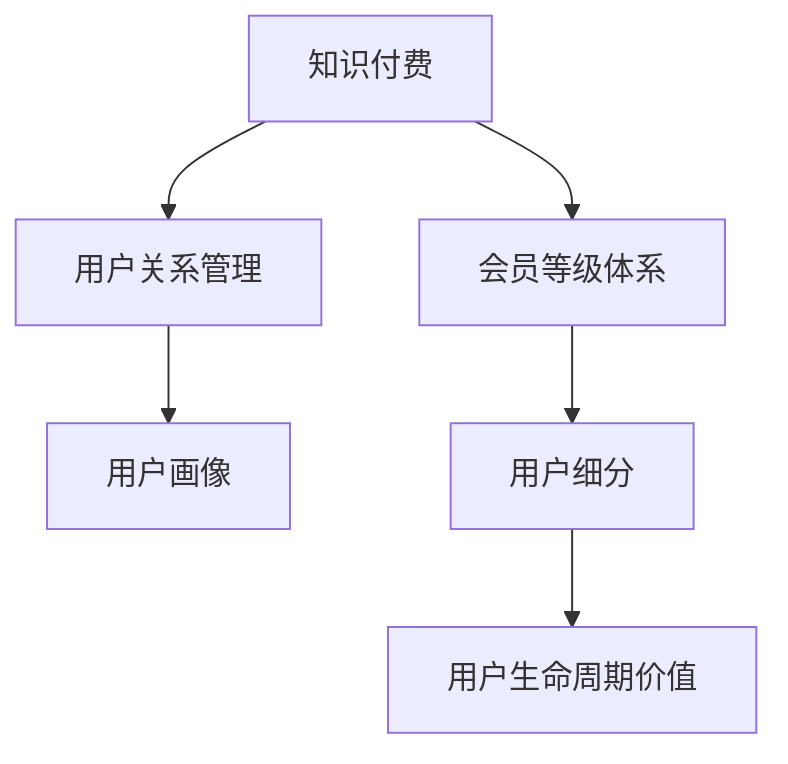

                 

# 知识付费赚钱的用户关系管理与会员等级体系

> 关键词：知识付费, 用户关系管理, 会员等级体系, 数据挖掘, 机器学习

## 1. 背景介绍

### 1.1 问题由来
随着知识付费市场的兴起，越来越多的平台开始提供高质量的在线课程、电子书、音频等内容，满足了用户对知识获取的需求。然而，知识付费市场竞争激烈，平台如何吸引和留住用户，提升用户粘性，成为其生存发展的关键。其中，用户关系管理和会员等级体系是两个重要的手段。

### 1.2 问题核心关键点
用户关系管理指的是平台通过数据挖掘、用户行为分析等手段，对用户进行细分、画像刻画，从而制定相应的运营策略，提高用户满意度和忠诚度。会员等级体系则是指根据用户的付费情况、活跃程度等因素，将用户分为不同的等级，并通过等级奖励、特权活动等方式，引导用户进行持续付费，增加平台的收入。

这两个手段相互配合，能够有效地提升平台的盈利能力。平台通过精准的用户画像，了解用户需求，制定针对性的运营策略；通过会员等级体系，实现用户分级管理，最大化用户生命周期价值。

### 1.3 问题研究意义
研究知识付费平台的用户关系管理与会员等级体系，对于提高平台的运营效率和盈利能力，具有重要意义：

1. 精准用户画像：通过对用户行为和偏好进行分析，平台能够制定精准的运营策略，提升用户满意度。
2. 提升用户粘性：通过会员等级体系，平台能够留住高价值用户，增加用户粘性，延长用户生命周期。
3. 增加平台收入：通过会员费、增值服务等手段，平台能够实现多元化的收入来源，提升整体盈利水平。
4. 竞争优势：有效的用户关系管理和会员等级体系，能够使平台在竞争中脱颖而出，占领市场份额。

## 2. 核心概念与联系

### 2.1 核心概念概述

为更好地理解知识付费平台的用户关系管理和会员等级体系，本节将介绍几个密切相关的核心概念：

- **知识付费**：指用户为获取知识而支付费用的行为。知识付费平台通过提供优质的内容，满足用户的学习需求，实现盈利。
- **用户关系管理**：指平台通过对用户行为数据的收集、分析，制定针对性的运营策略，提高用户满意度和忠诚度。
- **会员等级体系**：指根据用户的付费情况、活跃程度等因素，将用户分为不同的等级，并通过等级奖励、特权活动等方式，引导用户进行持续付费。
- **用户画像**：通过数据挖掘和分析，对用户进行多维度的画像刻画，了解用户的特征和需求。
- **用户生命周期价值**：指用户在平台上的总消费价值，包括每次消费和终身价值。
- **客户细分**：根据用户的特征和行为，将用户分为不同的细分市场，制定差异化的运营策略。

这些核心概念之间的逻辑关系可以通过以下Mermaid流程图来展示：



这个流程图展示了几者之间的逻辑关系：

1. 知识付费是用户关系管理和会员等级体系的基础。
2. 用户关系管理通过对用户画像的刻画，制定针对性的运营策略。
3. 会员等级体系通过对用户进行细分，实现分级管理。
4. 用户细分进一步细化，提升用户生命周期价值。

## 3. 核心算法原理 & 具体操作步骤
### 3.1 算法原理概述

知识付费平台的用户关系管理与会员等级体系，本质上是基于数据的精细化运营过程。其核心思想是：通过数据挖掘和机器学习等手段，对用户行为进行分析，构建用户画像，然后根据画像特征和行为，设计相应的运营策略和会员等级体系，以提高用户满意度和忠诚度，增加平台收入。

具体而言，算法原理包括以下几个方面：

1. **数据采集**：收集用户在平台上的各种行为数据，如购买记录、浏览历史、互动行为等。
2. **用户画像构建**：通过数据挖掘和机器学习等手段，对用户行为进行分析，构建多维度的用户画像。
3. **用户细分**：根据用户画像的特征和行为，将用户分为不同的细分市场。
4. **会员等级设计**：根据用户的行为和价值，设计会员等级体系，设定不同等级的权益和特权。
5. **运营策略制定**：根据用户画像和会员等级体系，制定针对性的运营策略，提高用户满意度和忠诚度。

### 3.2 算法步骤详解

以下是对知识付费平台的用户关系管理和会员等级体系设计的详细步骤：

**Step 1: 数据采集**
- 收集用户在平台上的行为数据，如购买记录、浏览历史、互动行为等。
- 通过API接口、日志文件等方式，将数据导出到中央数据仓库中。

**Step 2: 用户画像构建**
- 对采集到的数据进行清洗和预处理，去除噪声和异常值。
- 使用数据挖掘和机器学习算法，对用户行为进行分析，构建多维度的用户画像。
- 常用的算法包括聚类算法（如K-means）、关联规则算法（如Apriori）等。

**Step 3: 用户细分**
- 根据用户画像的特征和行为，使用聚类算法等手段，将用户分为不同的细分市场。
- 常用的聚类算法包括K-means、层次聚类、DBSCAN等。
- 需要根据具体业务需求，选择合适的聚类算法和参数。

**Step 4: 会员等级设计**
- 根据用户的付费情况、活跃程度等因素，设定不同等级的会员，并设计不同等级的权益和特权。
- 常见的等级包括VIP、SVIP等，不同等级享有不同的内容和特权。
- 设计等级时需要考虑用户的实际需求和平台的盈利能力。

**Step 5: 运营策略制定**
- 根据用户画像和会员等级体系，制定针对性的运营策略，如个性化推荐、专属活动等。
- 使用A/B测试等手段，评估不同策略的效果，不断优化。

**Step 6: 效果评估与反馈**
- 使用指标如用户留存率、购买率等，评估运营策略的效果。
- 根据评估结果，反馈到数据分析和策略优化环节，不断迭代优化。

### 3.3 算法优缺点

知识付费平台的用户关系管理和会员等级体系，具有以下优点：

1. 提高用户满意度：通过精准的用户画像和运营策略，能够提高用户满意度和忠诚度，减少用户流失。
2. 增加平台收入：通过会员等级体系和增值服务，实现多元化的收入来源，提升平台整体盈利水平。
3. 竞争优势：有效的用户关系管理和会员等级体系，能够使平台在竞争中脱颖而出，占领市场份额。

同时，该方法也存在一定的局限性：

1. 数据质量依赖：用户数据的质量和完整性直接影响用户画像和运营策略的准确性。
2. 策略设计复杂：不同用户的行为和需求千差万别，制定针对性的运营策略需要复杂的设计和评估。
3. 用户隐私问题：用户数据的收集和使用需要遵守隐私保护法规，如GDPR等。
4. 运营成本高：数据分析和策略优化的过程中，需要投入大量的人力物力，运营成本较高。

尽管存在这些局限性，但就目前而言，基于数据驱动的用户关系管理和会员等级体系，仍然是大规模知识付费平台的主要运营策略。

### 3.4 算法应用领域

基于知识付费平台的用户关系管理和会员等级体系，已经在许多领域得到了广泛应用，例如：

- 在线教育平台：通过用户画像和会员等级体系，提升课程推荐和购买转化率。
- 在线音乐和视频平台：通过个性化推荐和专属活动，提升用户粘性和消费转化率。
- 数字出版平台：通过会员等级体系和内容订阅服务，增加平台收入和用户留存率。
- 知识社区平台：通过用户画像和运营策略，提升社区活跃度和用户贡献度。

除了上述这些经典应用外，用户关系管理和会员等级体系也被创新性地应用到更多场景中，如智能客服、电子商务、社交网络等，为这些领域带来了新的商业机遇。

## 4. 数学模型和公式 & 详细讲解 & 举例说明

### 4.1 数学模型构建

本节将使用数学语言对知识付费平台的用户关系管理和会员等级体系设计过程进行更加严格的刻画。

设用户在平台上的行为数据为 $D=\{(x_i,y_i)\}_{i=1}^N, x_i \in \mathcal{X}, y_i \in \mathcal{Y}$，其中 $x_i$ 表示用户行为特征，$y_i$ 表示用户实际行为（如购买、浏览等）。

定义用户画像为 $\vec{u}_i=(p_i^1, p_i^2, ..., p_i^n)$，其中 $p_i^k$ 表示用户在第 $k$ 个维度上的特征值。

用户细分的目标是将用户分为 $K$ 个不同的细分市场，即 $G=\{g_1,g_2,...,g_K\}$。

会员等级体系设定的等级数为 $L$，不同等级享有不同的权益和特权，用 $\mathcal{E}=\{e_1,e_2,...,e_L\}$ 表示。

用户画像的构建、用户细分和会员等级设计均依赖于数据分析和机器学习算法，形式化地，可以表示为：

$$
\vec{u}_i = F(x_i; \theta)
$$

$$
G = K-means(\vec{u})
$$

$$
\mathcal{E} = \text{Design}(G)
$$

其中 $F(x_i; \theta)$ 表示用户画像的构建算法，$\theta$ 为算法参数；$K-means(\vec{u})$ 表示用户细分的聚类算法；$\text{Design}(G)$ 表示会员等级体系的设计算法。

### 4.2 公式推导过程

以下我们以用户画像构建为例，推导用户画像的计算公式。

设用户行为数据为 $D=\{(x_i,y_i)\}_{i=1}^N, x_i \in \mathcal{X}, y_i \in \mathcal{Y}$，定义用户画像为 $\vec{u}_i=(p_i^1, p_i^2, ..., p_i^n)$，其中 $p_i^k$ 表示用户在第 $k$ 个维度上的特征值。

设用户画像的构建算法为 $F(x_i; \theta)$，其中 $\theta$ 为算法参数，可以表示为：

$$
p_i^k = F(x_i; \theta) = \sum_{j=1}^M a_{k,j} x_{i,j}
$$

其中 $x_{i,j}$ 表示用户在第 $j$ 个维度上的行为数据，$a_{k,j}$ 为线性组合系数，$\theta = (a_{1,1}, a_{1,2}, ..., a_{n,M})$ 为算法参数。

通过选择不同的线性组合系数，可以设计不同的用户画像构建算法。常用的算法包括线性回归、逻辑回归、决策树等。

### 4.3 案例分析与讲解

**案例一：用户画像构建**

设用户在平台上的行为数据为 $D=\{(x_i,y_i)\}_{i=1}^N, x_i \in \mathcal{X}, y_i \in \mathcal{Y}$，其中 $x_i$ 表示用户行为特征，$y_i$ 表示用户实际行为（如购买、浏览等）。

定义用户画像为 $\vec{u}_i=(p_i^1, p_i^2, ..., p_i^n)$，其中 $p_i^k$ 表示用户在第 $k$ 个维度上的特征值。

用户画像的构建算法可以表示为：

$$
p_i^k = F(x_i; \theta) = \sum_{j=1}^M a_{k,j} x_{i,j}
$$

其中 $x_{i,j}$ 表示用户在第 $j$ 个维度上的行为数据，$a_{k,j}$ 为线性组合系数，$\theta = (a_{1,1}, a_{1,2}, ..., a_{n,M})$ 为算法参数。

**案例二：用户细分**

设用户行为数据为 $D=\{(x_i,y_i)\}_{i=1}^N, x_i \in \mathcal{X}, y_i \in \mathcal{Y}$，定义用户画像为 $\vec{u}_i=(p_i^1, p_i^2, ..., p_i^n)$。

用户细分的目标是将用户分为 $K$ 个不同的细分市场，即 $G=\{g_1,g_2,...,g_K\}$。

常用的聚类算法包括K-means、层次聚类、DBSCAN等。这里以K-means算法为例，其步骤如下：

1. 选择 $K$ 个初始质心 $\vec{c}_k$。
2. 对每个用户画像 $\vec{u}_i$，计算其到每个质心 $\vec{c}_k$ 的距离，将其归入最近的质心所在的细分市场 $g_k$。
3. 重新计算每个细分市场的质心 $\vec{c}_k$。
4. 重复步骤2和3，直到质心不再变化或达到预设的迭代次数。

**案例三：会员等级设计**

设用户行为数据为 $D=\{(x_i,y_i)\}_{i=1}^N, x_i \in \mathcal{X}, y_i \in \mathcal{Y}$，定义用户画像为 $\vec{u}_i=(p_i^1, p_i^2, ..., p_i^n)$。

用户细分的目标是将用户分为 $K$ 个不同的细分市场，即 $G=\{g_1,g_2,...,g_K\}$。

会员等级体系设定的等级数为 $L$，不同等级享有不同的权益和特权，用 $\mathcal{E}=\{e_1,e_2,...,e_L\}$ 表示。

会员等级体系的设计算法需要根据具体的业务需求，设定不同的等级和权益。以K-means算法为例，其步骤如下：

1. 根据用户画像 $\vec{u}_i$ 的特征值，将其分为 $K$ 个不同的细分市场 $G=\{g_1,g_2,...,g_K\}$。
2. 根据用户的行为数据 $y_i$，对每个细分市场 $g_k$，设定不同等级的权益和特权，如折扣、专属活动等。
3. 设计不同等级的会员等级体系 $\mathcal{E}=\{e_1,e_2,...,e_L\}$，不同等级享有不同的权益和特权。

## 5. 项目实践：代码实例和详细解释说明

### 5.1 开发环境搭建

在进行用户关系管理和会员等级体系设计的实践前，我们需要准备好开发环境。以下是使用Python进行PyTorch开发的环境配置流程：

1. 安装Anaconda：从官网下载并安装Anaconda，用于创建独立的Python环境。

2. 创建并激活虚拟环境：
```bash
conda create -n pytorch-env python=3.8 
conda activate pytorch-env
```

3. 安装PyTorch：根据CUDA版本，从官网获取对应的安装命令。例如：
```bash
conda install pytorch torchvision torchaudio cudatoolkit=11.1 -c pytorch -c conda-forge
```

4. 安装各类工具包：
```bash
pip install numpy pandas scikit-learn matplotlib tqdm jupyter notebook ipython
```

完成上述步骤后，即可在`pytorch-env`环境中开始项目实践。

### 5.2 源代码详细实现

下面我们以用户画像构建为例，给出使用PyTorch对用户画像进行构建的PyTorch代码实现。

首先，定义用户行为数据的处理函数：

```python
import pandas as pd
import numpy as np
from sklearn.preprocessing import StandardScaler

def preprocess_data(data_path):
    data = pd.read_csv(data_path)
    features = data.drop(['target'], axis=1)
    targets = data['target']
    features = StandardScaler().fit_transform(features)
    return features, targets
```

然后，定义用户画像的构建函数：

```python
from sklearn.linear_model import LinearRegression
from sklearn.decomposition import PCA

def build_user_profile(features, targets, n_components=2):
    X = features
    Y = targets

    # 使用线性回归构建用户画像
    model = LinearRegression()
    model.fit(X, Y)

    # 使用PCA降维，生成二维用户画像
    X_pca = PCA(n_components=n_components).fit_transform(X)

    # 计算用户画像
    user_profiles = X_pca
    return user_profiles
```

最后，启动用户画像构建流程：

```python
features, targets = preprocess_data('user_data.csv')
user_profiles = build_user_profile(features, targets)
print(user_profiles)
```

以上就是使用PyTorch对用户画像进行构建的完整代码实现。可以看到，得益于Scikit-learn的强大封装，我们可以用相对简洁的代码完成用户画像的构建。

### 5.3 代码解读与分析

让我们再详细解读一下关键代码的实现细节：

**preprocess_data函数**：
- 从CSV文件中加载用户行为数据。
- 使用Pandas库进行数据清洗，删除不需要的特征列。
- 使用Scikit-learn的StandardScaler对特征进行标准化处理。

**build_user_profile函数**：
- 使用Scikit-learn的LinearRegression构建用户画像。
- 使用PCA算法对特征进行降维，生成二维用户画像。
- 返回用户画像，用于后续的分析和处理。

**启动用户画像构建流程**：
- 加载预处理后的用户行为数据。
- 调用build_user_profile函数，构建用户画像。
- 打印用户画像，用于后续的分析和处理。

可以看到，Scikit-learn提供了丰富的机器学习算法，使得用户画像的构建过程变得简洁高效。开发者可以将更多精力放在数据处理、模型改进等高层逻辑上，而不必过多关注底层的实现细节。

当然，工业级的系统实现还需考虑更多因素，如用户数据的存储和管理、用户画像的实时更新、模型的调优和评估等。但核心的用户画像构建方法基本与此类似。

## 6. 实际应用场景

### 6.1 智能客服系统

基于知识付费平台的用户关系管理和会员等级体系，可以应用于智能客服系统的构建。传统客服往往需要配备大量人力，高峰期响应缓慢，且一致性和专业性难以保证。而使用用户画像和会员等级体系，可以7x24小时不间断服务，快速响应客户咨询，用个性化的服务满足用户需求。

在技术实现上，可以收集企业内部的历史客服对话记录，将问题和最佳答复构建成监督数据，在此基础上对预训练模型进行微调。微调后的模型能够自动理解用户意图，匹配最合适的答复。对于客户提出的新问题，还可以接入检索系统实时搜索相关内容，动态组织生成回答。如此构建的智能客服系统，能大幅提升客户咨询体验和问题解决效率。

### 6.2 金融舆情监测

金融机构需要实时监测市场舆论动向，以便及时应对负面信息传播，规避金融风险。传统的人工监测方式成本高、效率低，难以应对网络时代海量信息爆发的挑战。基于用户画像和会员等级体系，可以通过对用户的交易行为、消费习惯等进行分析，构建精准的用户画像，实时监测市场舆论变化，及时预警风险。

具体而言，可以收集金融领域相关的新闻、报道、评论等文本数据，并对其进行主题标注和情感标注。在此基础上对用户画像进行微调，使其能够自动判断用户对市场舆情的反应，实时预警风险，帮助金融机构快速应对潜在风险。

### 6.3 个性化推荐系统

当前的推荐系统往往只依赖用户的历史行为数据进行物品推荐，无法深入理解用户的真实兴趣偏好。基于用户画像和会员等级体系，可以构建精准的用户画像，了解用户的兴趣点和行为习惯。在生成推荐列表时，先用候选物品的特征作为输入，由模型预测用户的兴趣匹配度，再结合其他特征综合排序，便可以得到个性化程度更高的推荐结果。

在实践上，可以通过用户画像和会员等级体系，获取用户的多维特征，如兴趣、行为、消费等，生成精准的用户画像。然后，根据用户画像，推荐系统可以动态调整推荐策略，提升推荐效果。

### 6.4 未来应用展望

随着用户画像和会员等级体系的应用场景不断扩展，未来将有更多的应用场景得到实现：

1. 智慧医疗领域：通过用户画像和会员等级体系，构建精准的患者画像，实时监测健康状况，提供个性化医疗建议。
2. 智能教育领域：通过用户画像和会员等级体系，了解学生的学习习惯和兴趣，个性化推荐学习资源，提升学习效果。
3. 智慧城市治理：通过用户画像和会员等级体系，构建精准的市民画像，实时监测城市事件，提供个性化服务。
4. 智能交通系统：通过用户画像和会员等级体系，了解用户的出行习惯，提供个性化的交通推荐，提升出行效率。

这些应用场景体现了用户画像和会员等级体系的强大生命力，能够更好地服务于各行各业，提升用户体验和业务价值。

## 7. 工具和资源推荐
### 7.1 学习资源推荐

为了帮助开发者系统掌握用户关系管理和会员等级体系的理论基础和实践技巧，这里推荐一些优质的学习资源：

1. 《用户画像：基于数据的精准用户分析与运营策略》系列博文：由大用户画像技术专家撰写，深入浅出地介绍了用户画像的构建、分析和应用。

2. 《会员体系设计：从零开始构建高效的会员制度》课程：由会员体系设计专家主讲，涵盖会员体系的原理、设计和实施全过程。

3. 《用户关系管理：数据驱动的客户细分与运营优化》书籍：全面介绍了用户关系管理的方法、工具和实践案例。

4. 《用户画像的构建与分析》视频教程：通过视频讲解用户画像的构建和分析方法，涵盖数据采集、数据处理、用户画像构建等全过程。

5. 《用户画像的实践案例》博客：分享用户画像在多个行业中的应用案例，提供具体的实践经验和代码实现。

通过对这些资源的学习实践，相信你一定能够快速掌握用户画像和会员等级体系的设计技巧，并用于解决实际的业务问题。

### 7.2 开发工具推荐

高效的开发离不开优秀的工具支持。以下是几款用于用户关系管理和会员等级体系设计的常用工具：

1. PyTorch：基于Python的开源深度学习框架，灵活动态的计算图，适合快速迭代研究。大部分机器学习算法都有PyTorch版本的实现。

2. TensorFlow：由Google主导开发的开源深度学习框架，生产部署方便，适合大规模工程应用。同样有丰富的机器学习算法资源。

3. Scikit-learn：Python科学计算库，提供了丰富的机器学习算法，包括线性回归、PCA等。

4. Weights & Biases：模型训练的实验跟踪工具，可以记录和可视化模型训练过程中的各项指标，方便对比和调优。与主流深度学习框架无缝集成。

5. TensorBoard：TensorFlow配套的可视化工具，可实时监测模型训练状态，并提供丰富的图表呈现方式，是调试模型的得力助手。

6. Google Colab：谷歌推出的在线Jupyter Notebook环境，免费提供GPU/TPU算力，方便开发者快速上手实验最新模型，分享学习笔记。

合理利用这些工具，可以显著提升用户关系管理和会员等级体系的设计效率，加快创新迭代的步伐。

### 7.3 相关论文推荐

用户画像和会员等级体系的发展源于学界的持续研究。以下是几篇奠基性的相关论文，推荐阅读：

1. A Framework for Building User Profiles in Recommendation Systems：介绍了基于用户行为数据的用户画像构建方法。

2. User-Centric Recommender Systems: A Survey and Future Directions：综述了用户画像在推荐系统中的应用。

3. Multi-Level Personality Anonymization Using Latent Dirichlet Allocation：通过LDA算法对用户行为数据进行建模，构建用户画像。

4. The Principles of Systematic Customer Segmentation：系统介绍了客户细分的方法和策略。

5. Multi-Level Customer Segmentation for Business Analytics：通过数据挖掘和机器学习算法，实现客户细分和画像构建。

这些论文代表了大用户画像和会员等级体系的研究进展，对于深入理解其原理和应用具有重要参考价值。

## 8. 总结：未来发展趋势与挑战

### 8.1 总结

本文对基于知识付费平台的用户关系管理和会员等级体系进行了全面系统的介绍。首先阐述了用户关系管理和会员等级体系的研究背景和意义，明确了其对平台运营效率和盈利能力提升的独特价值。其次，从原理到实践，详细讲解了用户画像和会员等级体系的数学原理和关键步骤，给出了用户画像构建的完整代码实例。同时，本文还广泛探讨了用户画像和会员等级体系在多个行业领域的应用前景，展示了其广阔的应用潜力。

通过本文的系统梳理，可以看到，基于数据驱动的用户关系管理和会员等级体系，正在成为知识付费平台的主要运营策略，极大地提升了平台的运营效率和盈利能力。未来，随着数据和算法的不断进步，用户画像和会员等级体系将进一步得到优化和拓展，为平台带来更多的商业价值。

### 8.2 未来发展趋势

展望未来，用户画像和会员等级体系的发展趋势将呈现以下几个方面：

1. 数据来源多样化：未来将不仅仅是用户行为数据，还可能包括用户的社交网络、地理位置、健康数据等，构建更加多维度的用户画像。
2. 模型融合与创新：未来将融合更多先进的数据挖掘和机器学习算法，如深度学习、强化学习、因果推断等，提升用户画像的精准度和实用性。
3. 实时化和动态化：未来将实现用户画像的实时更新和动态调整，根据用户行为的最新变化，快速调整运营策略，提升用户体验。
4. 多模态融合：未来将实现用户画像的多模态融合，将文本、图像、语音等多模态数据进行综合分析，构建更加全面和精准的用户画像。
5. 自动化与智能化：未来将实现用户画像构建和运营策略制定的自动化与智能化，减少人工干预，提升运营效率。

这些趋势将使得用户画像和会员等级体系更加智能、精准，为平台带来更多的商业价值。

### 8.3 面临的挑战

尽管用户画像和会员等级体系已经取得了瞩目成就，但在迈向更加智能化、普适化应用的过程中，它仍面临着诸多挑战：

1. 数据质量和隐私问题：用户数据的质量和隐私保护需要严格控制，以避免数据噪声和用户隐私泄露。
2. 模型复杂度和成本：用户画像的构建和运营策略的制定需要复杂的数据挖掘和机器学习算法，运算成本较高。
3. 策略效果评估：运营策略的效果评估需要综合考虑多维度的指标，如用户留存率、消费转化率等，评估过程复杂。
4. 系统安全性：用户画像和会员等级体系的系统需要具备较高的安全性，防止数据泄露和恶意攻击。
5. 用户接受度：用户画像和会员等级体系的实施需要用户高度信任和接受，否则可能会引发用户反感和抵触。

尽管存在这些挑战，但通过不断的技术创新和实践改进，这些问题有望逐步得到解决，用户画像和会员等级体系必将在未来得到更广泛的应用和推广。

### 8.4 研究展望

面对用户画像和会员等级体系面临的种种挑战，未来的研究需要在以下几个方面寻求新的突破：

1. 数据隐私保护：开发更加安全、高效的数据隐私保护技术，确保用户数据的隐私安全。
2. 多模态数据融合：将多模态数据进行有效融合，提升用户画像的全面性和精准度。
3. 自动化与智能化：实现用户画像构建和运营策略制定的自动化与智能化，减少人工干预，提升运营效率。
4. 系统安全性：开发高安全性的用户画像和会员等级体系系统，防止数据泄露和恶意攻击。
5. 用户体验优化：通过用户画像和会员等级体系，提升用户体验和满意度，增加用户粘性。

这些研究方向的探索，必将引领用户画像和会员等级体系技术迈向更高的台阶，为平台带来更多的商业价值。面向未来，用户画像和会员等级体系还需要与其他人工智能技术进行更深入的融合，如知识表示、因果推理、强化学习等，多路径协同发力，共同推动智能交互系统的进步。只有勇于创新、敢于突破，才能不断拓展用户画像和会员等级体系的应用边界，让智能技术更好地造福人类社会。

## 9. 附录：常见问题与解答

**Q1：如何提高用户画像的精准度？**

A: 提高用户画像的精准度，可以从以下几个方面入手：

1. 数据质量：确保数据的准确性、完整性和一致性，避免数据噪声和异常值。
2. 多维度特征：收集多维度的用户特征，如行为、兴趣、社交网络等，构建多维度的用户画像。
3. 实时更新：根据用户行为的最新变化，实时更新用户画像，避免过时信息的影响。
4. 算法优化：选择合适的数据挖掘和机器学习算法，提升用户画像的精准度。

**Q2：如何设计合理的会员等级体系？**

A: 设计合理的会员等级体系，可以从以下几个方面入手：

1. 用户细分：根据用户的特征和行为，将用户分为不同的细分市场，制定差异化的运营策略。
2. 权益设计：根据用户的价值和需求，设计不同等级的权益和特权，如折扣、专属活动等。
3. 动态调整：根据用户的最新行为，动态调整会员等级，避免因用户行为变化导致的权益失衡。
4. 用户体验：设计合理的会员等级体系，应考虑用户体验，避免过度收费和复杂操作。

**Q3：如何平衡用户隐私和数据分析之间的关系？**

A: 平衡用户隐私和数据分析之间的关系，需要从以下几个方面入手：

1. 数据匿名化：通过数据匿名化处理，去除用户个人敏感信息，保护用户隐私。
2. 合法合规：确保数据收集和使用的合法性和合规性，遵守相关法律法规和隐私保护标准。
3. 用户告知：在数据收集和使用前，明确告知用户，并获得用户同意。
4. 数据保护：采用先进的数据保护技术，如加密、访问控制等，保障用户数据安全。

**Q4：如何实现用户画像的实时更新？**

A: 实现用户画像的实时更新，需要从以下几个方面入手：

1. 数据流处理：采用流式数据处理技术，如Apache Kafka、Apache Flink等，实时处理用户行为数据。
2. 缓存机制：使用缓存机制，存储最近的行为数据，避免实时查询数据库的开销。
3. 增量更新：采用增量更新的策略，只更新最新的行为数据，减少更新成本。
4. 分布式处理：采用分布式处理技术，如Hadoop、Spark等，提升数据处理的效率。

**Q5：如何评估用户画像和会员等级体系的效果？**

A: 评估用户画像和会员等级体系的效果，需要从以下几个方面入手：

1. 用户留存率：衡量用户在使用平台期间的留存情况，评估用户画像和会员等级体系的效果。
2. 消费转化率：衡量用户从浏览到购买的行为转化率，评估会员等级体系的效果。
3. 用户满意度：通过用户调查和反馈，了解用户对平台和运营策略的满意度。
4. A/B测试：通过A/B测试，比较不同策略的效果，选择最优方案。

以上是用户关系管理和会员等级体系的基本问题和解答。通过这些问题的探讨，相信你能够更加深入地理解该技术的原理和应用，并在实际业务中灵活运用。

---

作者：禅与计算机程序设计艺术 / Zen and the Art of Computer Programming

