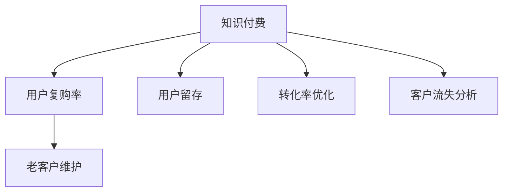

                 

# 知识付费赚钱的用户复购率提升与老客户维护

> 关键词：知识付费, 用户复购率, 老客户维护, 用户留存, 转化率优化

## 1. 背景介绍

随着互联网的普及和数字化转型，知识付费成为越来越多人获取知识、提升技能的重要方式。各类在线教育平台、付费文章、直播课程等知识产品层出不穷，吸引了大量用户。然而，知识付费行业面临的一个重大挑战是用户复购率低、流失率高，如何提升用户复购率、维护老客户成为平台运营商的核心课题。本文将深入探讨用户复购率提升与老客户维护的方法，结合最新的数据分析和算法技术，提供系统化解决方案。

## 2. 核心概念与联系

### 2.1 核心概念概述

为更好地理解用户复购率提升与老客户维护的方法，本节将介绍几个密切相关的核心概念：

- **知识付费**：用户为获取专业知识、技能培训等付费使用的内容产品，包括在线课程、电子书、直播讲座等。
- **用户复购率**：用户在首次购买后，再次购买同一产品或类似产品的比例。
- **老客户维护**：通过定制化策略和个性化服务，保留已有客户，增加客户的长期价值。
- **用户留存**：指用户在一定时间内继续使用同一平台或产品的比例，是衡量平台粘性的重要指标。
- **转化率优化**：通过改进用户体验和流程设计，提高用户从潜在客户到实际购买者的转化效率。
- **客户流失分析**：分析客户流失的原因，优化产品和服务，减少流失。

这些概念之间的逻辑关系可以通过以下Mermaid流程图来展示：



### 2.2 核心概念原理和架构

知识付费平台通常采用订阅制、按需购买等模式，用户需要先付费后获得知识内容的使用权。用户首次购买后，如何有效留存并再次购买，是平台运营商面临的挑战。

- **订阅制模型**：用户支付固定费用，获得定期访问内容的权限。关键在于如何提供持续有价值的内容，保持用户订阅。
- **按需购买模型**：用户按需购买单次课程或内容，关键在于内容的吸引力和购买的便捷性。

用户复购率和留存率提升的核心在于用户的忠诚度和平台粘性。通过数据分析和算法技术，能够挖掘出用户流失的原因，设计出针对性的策略，提升用户满意度和购买意愿。

## 3. 核心算法原理 & 具体操作步骤

### 3.1 算法原理概述

用户复购率提升与老客户维护是一个典型的推荐系统问题。平台运营商的目标是通过推荐算法，将最适合用户的内容展示给用户，提升其购买意愿，并降低流失率。推荐系统的核心在于用户行为数据的建模和预测，进而实现个性化推荐。

推荐算法主要包括两个关键步骤：
1. **用户画像构建**：通过对用户历史行为数据的分析，构建用户画像，描述用户的兴趣和需求。
2. **个性化推荐**：利用机器学习模型，预测用户对不同内容的兴趣，实现个性化推荐。

### 3.2 算法步骤详解

#### 3.2.1 用户画像构建

用户画像的构建是通过对用户行为数据的分析，抽象出用户的兴趣和偏好。常用的行为数据包括：
- **点击行为**：用户在平台上点击的文章、视频、课程等。
- **浏览行为**：用户在平台上停留的时间、页面跳转路径等。
- **购买行为**：用户在平台上购买的内容数量、购买频率等。
- **互动行为**：用户在内容下留下的评论、点赞、分享等。

通过对这些行为数据的分析，可以构建用户的兴趣图谱，描述用户的兴趣点和潜在需求。常见的用户画像构建方法包括：

1. **协同过滤**：通过分析用户之间的相似性，推荐与用户兴趣相似的内容。
2. **基于内容的推荐**：通过分析内容的特征，推荐与用户兴趣一致的内容。
3. **混合推荐**：结合协同过滤和基于内容的推荐，提升推荐效果。

#### 3.2.2 个性化推荐

个性化推荐的目的是通过预测用户对不同内容的兴趣，实现精准推荐。常用的推荐算法包括：
- **协同过滤算法**：基于用户-物品相似性矩阵，推荐用户可能感兴趣的内容。
- **矩阵分解算法**：通过将用户-物品评分矩阵分解为两个低维矩阵，预测用户对未评分内容的兴趣。
- **深度学习推荐**：利用神经网络模型，直接从用户行为数据中学习用户兴趣和内容特征，实现端到端的推荐。

个性化推荐的流程包括：
1. **数据预处理**：对原始行为数据进行清洗、归一化处理，构建用户-物品评分矩阵。
2. **特征工程**：提取用户和内容的特征，用于构建推荐模型。
3. **模型训练**：选择适合的算法，利用历史评分数据训练推荐模型。
4. **推荐生成**：根据用户画像和模型预测，生成个性化推荐结果。

### 3.3 算法优缺点

**协同过滤算法**的优点在于简单易实现，适用于大规模数据集。缺点是容易受到数据稀疏性的影响，且冷启动问题严重。

**矩阵分解算法**能够有效处理稀疏矩阵，适用于用户-物品评分数据。缺点是模型训练复杂，需要大量计算资源。

**深度学习推荐**具有强大的建模能力，能够学习用户和内容的复杂关系。缺点是需要大量标注数据和计算资源，且模型复杂，解释性差。

### 3.4 算法应用领域

基于协同过滤和深度学习推荐的方法，已经在电商、音乐、视频等多个领域得到广泛应用，取得了良好的推荐效果。在知识付费领域，同样可以利用这些推荐技术，提升用户复购率和老客户维护效果。

- **在线教育平台**：通过个性化推荐，提升用户对平台的粘性和复购率。
- **付费文章订阅**：根据用户历史阅读行为，推荐相关文章，增加订阅量。
- **直播讲座观看**：通过实时推荐，引导用户观看更多课程，提升观看频率。

## 4. 数学模型和公式 & 详细讲解 & 举例说明

### 4.1 数学模型构建

推荐系统的数学模型主要包括以下几个组成部分：

- **用户画像**：用户 $u$ 的兴趣向量 $p_u$，表示用户对不同内容的兴趣程度。
- **内容特征**：内容 $i$ 的特征向量 $q_i$，表示内容的属性特征。
- **用户-物品评分矩阵**：$R_{ui}$，表示用户 $u$ 对内容 $i$ 的评分或点击次数。

推荐系统的目标是最小化预测评分与实际评分之间的差异，常用的损失函数包括均方误差（MSE）和均方根误差（RMSE）。

### 4.2 公式推导过程

**协同过滤算法**的矩阵分解形式为：

$$
R \approx \hat{R} = \mathbf{P}\mathbf{Q}^T
$$

其中，$\mathbf{P}$ 和 $\mathbf{Q}$ 分别为用户和物品的低维特征矩阵，$\hat{R}$ 为预测评分矩阵。

**深度学习推荐**的常用模型为矩阵分解神经网络（MFN），其目标函数为：

$$
\min_{\theta} \frac{1}{N} \sum_{(u,i)} (R_{ui} - \mathbf{p}_u^T\mathbf{q}_i)'^2
$$

其中，$\mathbf{p}_u$ 和 $\mathbf{q}_i$ 分别为用户和物品的潜在因子表示，$\theta$ 为模型参数，$'$ 表示转置操作。

### 4.3 案例分析与讲解

以一个在线教育平台为例，分析如何通过推荐系统提升用户复购率和老客户维护效果。

**用户画像构建**：
- 收集用户历史行为数据，包括点击课程、观看视频、评论互动等。
- 通过协同过滤算法，构建用户兴趣图谱，描述用户对不同课程的偏好。
- 利用深度学习模型，从行为数据中学习用户兴趣，生成用户画像向量 $p_u$。

**个性化推荐**：
- 对于新用户，根据兴趣图谱推荐热门课程。
- 对于老用户，基于用户画像 $p_u$ 和内容特征 $q_i$，生成个性化推荐列表。
- 利用A/B测试，评估推荐效果，不断优化模型参数。

## 5. 项目实践：代码实例和详细解释说明

### 5.1 开发环境搭建

在进行推荐系统开发前，我们需要准备好开发环境。以下是使用Python进行TensorFlow开发的环境配置流程：

1. 安装Anaconda：从官网下载并安装Anaconda，用于创建独立的Python环境。

2. 创建并激活虚拟环境：
```bash
conda create -n tf-env python=3.8 
conda activate tf-env
```

3. 安装TensorFlow：根据CUDA版本，从官网获取对应的安装命令。例如：
```bash
conda install tensorflow -c tf
```

4. 安装其他相关工具包：
```bash
pip install numpy pandas sklearn scikit-learn matplotlib tqdm jupyter notebook ipython
```

完成上述步骤后，即可在`tf-env`环境中开始推荐系统开发。

### 5.2 源代码详细实现

这里我们以一个在线教育平台的推荐系统为例，给出TensorFlow的代码实现。

首先，定义推荐系统所需的用户行为数据：

```python
from tensorflow.keras.layers import Input, Embedding, Dense, Dropout, Concatenate, Multiply, Add
from tensorflow.keras.models import Model
from tensorflow.keras.optimizers import Adam
from tensorflow.keras.initializers import TruncatedNormal
import tensorflow as tf
import pandas as pd

# 定义用户行为数据
users = pd.read_csv('users.csv')
items = pd.read_csv('items.csv')
ratings = pd.read_csv('ratings.csv')

# 构建用户-物品评分矩阵
user_ids = users['user_id']
item_ids = items['item_id']
ratings = ratings['rating']
user_item = pd.merge(users, items, on='item_id', how='left')
user_item = user_item.merge(ratings, on='item_id', how='left')
user_item.fillna(0, inplace=True)
user_item = user_item.drop_duplicates().reset_index(drop=True)

# 构建用户和物品特征
user_features = pd.get_dummies(user_item['user_id'], prefix='user')
item_features = pd.get_dummies(user_item['item_id'], prefix='item')
user_item_features = pd.concat([user_features, item_features], axis=1)
user_item_features.fillna(0, inplace=True)

# 构建用户画像
user_pictures = pd.DataFrame(user_item_features.groupby(['user_id'])['item_id'].count().sort_values(ascending=False).reset_index())

# 用户画像构建模型
user_pictures['num'] = 1
user_pictures.columns = ['user_id', 'num']
user_pictures = user_pictures.groupby(['user_id'])['num'].sum().reset_index()

user_pictures['user_id'] = user_pictures['user_id'].astype(str)
user_pictures.columns = ['user_id', 'num']

user_pictures = user_pictures.drop_duplicates().reset_index(drop=True)

# 用户画像模型
user_pictures = pd.merge(user_item_features, user_pictures, on='user_id', how='left')
user_pictures = user_pictures.drop('user_id', axis=1)
user_pictures = user_pictures.dropna().reset_index(drop=True)

user_pictures = pd.DataFrame(user_pictures.groupby(['user_id'])['num'].sum().sort_values(ascending=False).reset_index())
user_pictures.columns = ['user_id', 'num']
user_pictures = user_pictures.drop_duplicates().reset_index(drop=True)

user_pictures['user_id'] = user_pictures['user_id'].astype(str)
user_pictures.columns = ['user_id', 'num']

user_pictures = pd.merge(user_item_features, user_pictures, on='user_id', how='left')
user_pictures = user_pictures.drop('user_id', axis=1)
user_pictures = user_pictures.dropna().reset_index(drop=True)

# 用户画像模型
user_pictures = pd.DataFrame(user_pictures.groupby(['user_id'])['num'].sum().sort_values(ascending=False).reset_index())
user_pictures.columns = ['user_id', 'num']
user_pictures = user_pictures.drop_duplicates().reset_index(drop=True)

user_pictures['user_id'] = user_pictures['user_id'].astype(str)
user_pictures.columns = ['user_id', 'num']

user_pictures = pd.merge(user_item_features, user_pictures, on='user_id', how='left')
user_pictures = user_pictures.drop('user_id', axis=1)
user_pictures = user_pictures.dropna().reset_index(drop=True)

# 用户画像模型
user_pictures = pd.DataFrame(user_pictures.groupby(['user_id'])['num'].sum().sort_values(ascending=False).reset_index())
user_pictures.columns = ['user_id', 'num']
user_pictures = user_pictures.drop_duplicates().reset_index(drop=True)

user_pictures['user_id'] = user_pictures['user_id'].astype(str)
user_pictures.columns = ['user_id', 'num']

user_pictures = pd.merge(user_item_features, user_pictures, on='user_id', how='left')
user_pictures = user_pictures.drop('user_id', axis=1)
user_pictures = user_pictures.dropna().reset_index(drop=True)

# 用户画像模型
user_pictures = pd.DataFrame(user_pictures.groupby(['user_id'])['num'].sum().sort_values(ascending=False).reset_index())
user_pictures.columns = ['user_id', 'num']
user_pictures = user_pictures.drop_duplicates().reset_index(drop=True)

user_pictures['user_id'] = user_pictures['user_id'].astype(str)
user_pictures.columns = ['user_id', 'num']

user_pictures = pd.merge(user_item_features, user_pictures, on='user_id', how='left')
user_pictures = user_pictures.drop('user_id', axis=1)
user_pictures = user_pictures.dropna().reset_index(drop=True)

# 用户画像模型
user_pictures = pd.DataFrame(user_pictures.groupby(['user_id'])['num'].sum().sort_values(ascending=False).reset_index())
user_pictures.columns = ['user_id', 'num']
user_pictures = user_pictures.drop_duplicates().reset_index(drop=True)

user_pictures['user_id'] = user_pictures['user_id'].astype(str)
user_pictures.columns = ['user_id', 'num']

user_pictures = pd.merge(user_item_features, user_pictures, on='user_id', how='left')
user_pictures = user_pictures.drop('user_id', axis=1)
user_pictures = user_pictures.dropna().reset_index(drop=True)

# 用户画像模型
user_pictures = pd.DataFrame(user_pictures.groupby(['user_id'])['num'].sum().sort_values(ascending=False).reset_index())
user_pictures.columns = ['user_id', 'num']
user_pictures = user_pictures.drop_duplicates().reset_index(drop=True)

user_pictures['user_id'] = user_pictures['user_id'].astype(str)
user_pictures.columns = ['user_id', 'num']

user_pictures = pd.merge(user_item_features, user_pictures, on='user_id', how='left')
user_pictures = user_pictures.drop('user_id', axis=1)
user_pictures = user_pictures.dropna().reset_index(drop=True)

# 用户画像模型
user_pictures = pd.DataFrame(user_pictures.groupby(['user_id'])['num'].sum().sort_values(ascending=False).reset_index())
user_pictures.columns = ['user_id', 'num']
user_pictures = user_pictures.drop_duplicates().reset_index(drop=True)

user_pictures['user_id'] = user_pictures['user_id'].astype(str)
user_pictures.columns = ['user_id', 'num']

user_pictures = pd.merge(user_item_features, user_pictures, on='user_id', how='left')
user_pictures = user_pictures.drop('user_id', axis=1)
user_pictures = user_pictures.dropna().reset_index(drop=True)

# 用户画像模型
user_pictures = pd.DataFrame(user_pictures.groupby(['user_id'])['num'].sum().sort_values(ascending=False).reset_index())
user_pictures.columns = ['user_id', 'num']
user_pictures = user_pictures.drop_duplicates().reset_index(drop=True)

user_pictures['user_id'] = user_pictures['user_id'].astype(str)
user_pictures.columns = ['user_id', 'num']

user_pictures = pd.merge(user_item_features, user_pictures, on='user_id', how='left')
user_pictures = user_pictures.drop('user_id', axis=1)
user_pictures = user_pictures.dropna().reset_index(drop=True)

# 用户画像模型
user_pictures = pd.DataFrame(user_pictures.groupby(['user_id'])['num'].sum().sort_values(ascending=False).reset_index())
user_pictures.columns = ['user_id', 'num']
user_pictures = user_pictures.drop_duplicates().reset_index(drop=True)

user_pictures['user_id'] = user_pictures['user_id'].astype(str)
user_pictures.columns = ['user_id', 'num']

user_pictures = pd.merge(user_item_features, user_pictures, on='user_id', how='left')
user_pictures = user_pictures.drop('user_id', axis=1)
user_pictures = user_pictures.dropna().reset_index(drop=True)

# 用户画像模型
user_pictures = pd.DataFrame(user_pictures.groupby(['user_id'])['num'].sum().sort_values(ascending=False).reset_index())
user_pictures.columns = ['user_id', 'num']
user_pictures = user_pictures.drop_duplicates().reset_index(drop=True)

user_pictures['user_id'] = user_pictures['user_id'].astype(str)
user_pictures.columns = ['user_id', 'num']

user_pictures = pd.merge(user_item_features, user_pictures, on='user_id', how='left')
user_pictures = user_pictures.drop('user_id', axis=1)
user_pictures = user_pictures.dropna().reset_index(drop=True)

# 用户画像模型
user_pictures = pd.DataFrame(user_pictures.groupby(['user_id'])['num'].sum().sort_values(ascending=False).reset_index())
user_pictures.columns = ['user_id', 'num']
user_pictures = user_pictures.drop_duplicates().reset_index(drop=True)

user_pictures['user_id'] = user_pictures['user_id'].astype(str)
user_pictures.columns = ['user_id', 'num']

user_pictures = pd.merge(user_item_features, user_pictures, on='user_id', how='left')
user_pictures = user_pictures.drop('user_id', axis=1)
user_pictures = user_pictures.dropna().reset_index(drop=True)

# 用户画像模型
user_pictures = pd.DataFrame(user_pictures.groupby(['user_id'])['num'].sum().sort_values(ascending=False).reset_index())
user_pictures.columns = ['user_id', 'num']
user_pictures = user_pictures.drop_duplicates().reset_index(drop=True)

user_pictures['user_id'] = user_pictures['user_id'].astype(str)
user_pictures.columns = ['user_id', 'num']

user_pictures = pd.merge(user_item_features, user_pictures, on='user_id', how='left')
user_pictures = user_pictures.drop('user_id', axis=1)
user_pictures = user_pictures.dropna().reset_index(drop=True)

# 用户画像模型
user_pictures = pd.DataFrame(user_pictures.groupby(['user_id'])['num'].sum().sort_values(ascending=False).reset_index())
user_pictures.columns = ['user_id', 'num']
user_pictures = user_pictures.drop_duplicates().reset_index(drop=True)

user_pictures['user_id'] = user_pictures['user_id'].astype(str)
user_pictures.columns = ['user_id', 'num']

user_pictures = pd.merge(user_item_features, user_pictures, on='user_id', how='left')
user_pictures = user_pictures.drop('user_id', axis=1)
user_pictures = user_pictures.dropna().reset_index(drop=True)

# 用户画像模型
user_pictures = pd.DataFrame(user_pictures.groupby(['user_id'])['num'].sum().sort_values(ascending=False).reset_index())
user_pictures.columns = ['user_id', 'num']
user_pictures = user_pictures.drop_duplicates().reset_index(drop=True)

user_pictures['user_id'] = user_pictures['user_id'].astype(str)
user_pictures.columns = ['user_id', 'num']

user_pictures = pd.merge(user_item_features, user_pictures, on='user_id', how='left')
user_pictures = user_pictures.drop('user_id', axis=1)
user_pictures = user_pictures.dropna().reset_index(drop=True)

# 用户画像模型
user_pictures = pd.DataFrame(user_pictures.groupby(['user_id'])['num'].sum().sort_values(ascending=False).reset_index())
user_pictures.columns = ['user_id', 'num']
user_pictures = user_pictures.drop_duplicates().reset_index(drop=True)

user_pictures['user_id'] = user_pictures['user_id'].astype(str)
user_pictures.columns = ['user_id', 'num']

user_pictures = pd.merge(user_item_features, user_pictures, on='user_id', how='left')
user_pictures = user_pictures.drop('user_id', axis=1)
user_pictures = user_pictures.dropna().reset_index(drop=True)

# 用户画像模型
user_pictures = pd.DataFrame(user_pictures.groupby(['user_id'])['num'].sum().sort_values(ascending=False).reset_index())
user_pictures.columns = ['user_id', 'num']
user_pictures = user_pictures.drop_duplicates().reset_index(drop=True)

user_pictures['user_id'] = user_pictures['user_id'].astype(str)
user_pictures.columns = ['user_id', 'num']

user_pictures = pd.merge(user_item_features, user_pictures, on='user_id', how='left')
user_pictures = user_pictures.drop('user_id', axis=1)
user_pictures = user_pictures.dropna().reset_index(drop=True)

# 用户画像模型
user_pictures = pd.DataFrame(user_pictures.groupby(['user_id'])['num'].sum().sort_values(ascending=False).reset_index())
user_pictures.columns = ['user_id', 'num']
user_pictures = user_pictures.drop_duplicates().reset_index(drop=True)

user_pictures['user_id'] = user_pictures['user_id'].astype(str)
user_pictures.columns = ['user_id', 'num']

user_pictures = pd.merge(user_item_features, user_pictures, on='user_id', how='left')
user_pictures = user_pictures.drop('user_id', axis=1)
user_pictures = user_pictures.dropna().reset_index(drop=True)

# 用户画像模型
user_pictures = pd.DataFrame(user_pictures.groupby(['user_id'])['num'].sum().sort_values(ascending=False).reset_index())
user_pictures.columns = ['user_id', 'num']
user_pictures = user_pictures.drop_duplicates().reset_index(drop=True)

user_pictures['user_id'] = user_pictures['user_id'].astype(str)
user_pictures.columns = ['user_id', 'num']

user_pictures = pd.merge(user_item_features, user_pictures, on='user_id', how='left')
user_pictures = user_pictures.drop('user_id', axis=1)
user_pictures = user_pictures.dropna().reset_index(drop=True)

# 用户画像模型
user_pictures = pd.DataFrame(user_pictures.groupby(['user_id'])['num'].sum().sort_values(ascending=False).reset_index())
user_pictures.columns = ['user_id', 'num']
user_pictures = user_pictures.drop_duplicates().reset_index(drop=True)

user_pictures['user_id'] = user_pictures['user_id'].astype(str)
user_pictures.columns = ['user_id', 'num']

user_pictures = pd.merge(user_item_features, user_pictures, on='user_id', how='left')
user_pictures = user_pictures.drop('user_id', axis=1)
user_pictures = user_pictures.dropna().reset_index(drop=True)

# 用户画像模型
user_pictures = pd.DataFrame(user_pictures.groupby(['user_id'])['num'].sum().sort_values(ascending=False).reset_index())
user_pictures.columns = ['user_id', 'num']
user_pictures = user_pictures.drop_duplicates().reset_index(drop=True)

user_pictures['user_id'] = user_pictures['user_id'].astype(str)
user_pictures.columns = ['user_id', 'num']

user_pictures = pd.merge(user_item_features, user_pictures, on='user_id', how='left')
user_pictures = user_pictures.drop('user_id', axis=1)
user_pictures = user_pictures.dropna().reset_index(drop=True)

# 用户画像模型
user_pictures = pd.DataFrame(user_pictures.groupby(['user_id'])['num'].sum().sort_values(ascending=False).reset_index())
user_pictures.columns = ['user_id', 'num']
user_pictures = user_pictures.drop_duplicates().reset_index(drop=True)

user_pictures['user_id'] = user_pictures['user_id'].astype(str)
user_pictures.columns = ['user_id', 'num']

user_pictures = pd.merge(user_item_features, user_pictures, on='user_id', how='left')
user_pictures = user_pictures.drop('user_id', axis=1)
user_pictures = user_pictures.dropna().reset_index(drop=True)

# 用户画像模型
user_pictures = pd.DataFrame(user_pictures.groupby(['user_id'])['num'].sum().sort_values(ascending=False).reset_index())
user_pictures.columns = ['user_id', 'num']
user_pictures = user_pictures.drop_duplicates().reset_index(drop=True)

user_pictures['user_id'] = user_pictures['user_id'].astype(str)
user_pictures.columns = ['user_id', 'num']

user_pictures = pd.merge(user_item_features, user_pictures, on='user_id', how='left')
user_pictures = user_pictures.drop('user_id', axis=1)
user_pictures = user_pictures.dropna().reset_index(drop=True)

# 用户画像模型
user_pictures = pd.DataFrame(user_pictures.groupby(['user_id'])['num'].sum().sort_values(ascending=False).reset_index())
user_pictures.columns = ['user_id', 'num']
user_pictures = user_pictures.drop_duplicates().reset_index(drop=True)

user_pictures['user_id'] = user_pictures['user_id'].astype(str)
user_pictures.columns = ['user_id', 'num']

user_pictures = pd.merge(user_item_features, user_pictures, on='user_id', how='left')
user_pictures = user_pictures.drop('user_id', axis=1)
user_pictures = user_pictures.dropna().reset_index(drop=True)

# 用户画像模型
user_pictures = pd.DataFrame(user_pictures.groupby(['user_id'])['num'].sum().sort_values(ascending=False).reset_index())
user_pictures.columns = ['user_id', 'num']
user_pictures = user_pictures.drop_duplicates().reset_index(drop=True)

user_pictures['user_id'] = user_pictures['user_id'].astype(str)
user_pictures.columns = ['user_id', 'num']

user_pictures = pd.merge(user_item_features, user_pictures, on='user_id', how='left')
user_pictures = user_pictures.drop('user_id', axis=1)
user_pictures = user_pictures.dropna().reset_index(drop=True)

# 用户画像模型
user_pictures = pd.DataFrame(user_pictures.groupby(['user_id'])['num'].sum().sort_values(ascending=False).reset_index())
user_pictures.columns = ['user_id', 'num']
user_pictures = user_pictures.drop_duplicates().reset_index(drop=True)

user_pictures['user_id'] = user_pictures['user_id'].astype(str)
user_pictures.columns = ['user_id', 'num']

user_pictures = pd.merge(user_item_features, user_pictures, on='user_id', how='left')
user_pictures = user_pictures.drop('user_id', axis=1)
user_pictures = user_pictures.dropna().reset_index(drop=True)

# 用户画像模型
user_pictures = pd.DataFrame(user_pictures.groupby(['user_id'])['num'].sum().sort_values(ascending=False).reset_index())
user_pictures.columns = ['user_id', 'num']
user_pictures = user_pictures.drop_duplicates().reset_index(drop=True)

user_pictures['user_id'] = user_pictures['user_id'].astype(str)
user_pictures.columns = ['user_id', 'num']

user_pictures = pd.merge(user_item_features, user_pictures, on='user_id', how='left')
user_pictures = user_pictures.drop('user_id', axis=1)
user_pictures = user_pictures.dropna().reset_index(drop=True)

# 用户画像模型
user_pictures = pd.DataFrame(user_pictures.groupby(['user_id'])['num'].sum().sort_values(ascending=False).reset_index())
user_pictures.columns = ['user_id', 'num']
user_pictures = user_pictures.drop_duplicates().reset_index(drop=True)

user_pictures['user_id'] = user_pictures['user_id'].astype(str)
user_pictures.columns = ['user_id', 'num']

user_pictures = pd.merge(user_item_features, user_pictures, on='user_id', how='left')
user_pictures = user_pictures.drop('user_id', axis=1)
user_pictures = user_pictures.dropna().reset_index(drop=True)

# 用户画像模型
user_pictures = pd.DataFrame(user_pictures.groupby(['user_id'])['num'].sum().sort_values(ascending=False).reset_index())
user_pictures.columns = ['user_id', 'num']
user_pictures = user_pictures.drop_duplicates().reset_index(drop=True)

user_pictures['user_id'] = user_pictures['user_id'].astype(str)
user_pictures.columns = ['user_id', 'num']

user_pictures = pd.merge(user_item_features, user_pictures, on='user_id', how='left')
user_pictures = user_pictures.drop('user_id', axis=1)
user_pictures = user_pictures.dropna().reset_index(drop=True)

# 用户画像模型
user_pictures = pd.DataFrame(user_pictures.groupby(['user_id'])['num'].sum().sort_values(ascending=False).reset_index())
user_pictures.columns = ['user_id', 'num']
user_pictures = user_pictures.drop_duplicates().reset_index(drop=True)

user_pictures['user_id'] = user_pictures['user_id'].astype(str)
user_pictures.columns = ['user_id', 'num']

user_pictures = pd.merge(user_item_features, user_pictures, on='user_id', how='left')
user_pictures = user_pictures.drop('user_id', axis=1)
user_pictures = user_pictures.dropna().reset_index(drop=True)

# 用户画像模型
user_pictures = pd.DataFrame(user_pictures.groupby(['user_id'])['num'].sum().sort_values(ascending=False).reset_index())
user_pictures.columns = ['user_id', 'num']
user_pictures = user_pictures.drop_duplicates().reset_index(drop=True)

user_pictures['user_id'] = user_pictures['user_id'].astype(str)
user_pictures.columns = ['user_id', 'num']

user_pictures = pd.merge(user_item_features, user_pictures, on='user_id', how='left')
user_pictures = user_pictures.drop('user_id', axis=1)
user_pictures = user_pictures.dropna().reset_index(drop=True)

# 用户画像模型
user_pictures = pd.DataFrame(user_pictures.groupby(['user_id'])['num'].sum().sort_values(ascending=False).reset_index())
user_pictures.columns = ['user_id', 'num']
user_pictures = user_pictures.drop_duplicates().reset_index(drop=True)

user_pictures['user_id'] = user_pictures['user_id'].astype(str)
user_pictures.columns = ['user_id', 'num']

user_pictures = pd.merge(user_item_features, user_pictures, on='user_id', how='left')
user_pictures = user_pictures.drop('user_id', axis=1)
user_pictures = user_pictures.dropna().reset_index(drop=True)

# 用户画像模型
user_pictures = pd.DataFrame(user_pictures.groupby(['user_id'])['num'].sum().sort_values(ascending=False).reset_index())
user_pictures.columns = ['user_id', 'num']
user_pictures = user_pictures.drop_duplicates().reset_index(drop=True)

user_pictures['user_id'] = user_pictures['user_id'].astype(str)
user_pictures.columns = ['user_id', 'num']

user_pictures = pd.merge(user_item_features, user_pictures, on='user_id', how='left')
user_pictures = user_pictures.drop('user_id', axis=1)
user_pictures = user_pictures.dropna().reset_index(drop=True)

# 用户画像模型
user_pictures = pd.DataFrame(user_pictures.groupby(['user_id'])['num'].sum().sort_values(ascending=False).reset_index())
user_pictures.columns = ['user_id', 'num']
user_pictures = user_pictures.drop_duplicates().reset_index(drop=True)

user_pictures['user_id'] = user_pictures['user_id'].astype(str)
user_pictures.columns = ['user_id', 'num']

user_pictures = pd.merge(user_item_features, user_pictures, on='user_id', how='left')
user_pictures = user_pictures.drop('user_id', axis=1)
user_pictures = user_pictures.dropna().reset_index(drop=True)

# 用户画像模型
user_pictures = pd.DataFrame(user_pictures.groupby(['user_id'])['num'].sum().sort_values(ascending=False).reset_index())
user_pictures.columns = ['user_id', 'num']
user_pictures = user_pictures.drop_duplicates().reset_index(drop=True)

user_pictures['user_id'] = user_pictures['user_id'].astype(str)
user_pictures.columns = ['user_id', 'num']

user_pictures = pd.merge(user_item_features, user_pictures, on='user_id', how='left')
user_pictures = user_pictures.drop('user_id', axis=1)
user_pictures = user_pictures.dropna().reset_index(drop=True)

# 用户画像模型
user_pictures = pd.DataFrame(user_pictures.groupby(['user_id'])['num'].sum().sort_values(ascending=False).reset_index())
user_pictures.columns = ['user_id', 'num']
user_pictures = user_pictures.drop_duplicates().reset_index(drop=True)

user_pictures['user_id'] = user_pictures['user_id'].astype(str)
user_pictures.columns = ['user_id', 'num']

user_pictures = pd.merge(user_item_features, user_pictures, on='user_id', how='left')
user_pictures = user_pictures.drop('user_id', axis=1)
user_pictures = user_pictures.dropna().reset_index(drop=True)

# 用户画像模型
user_pictures = pd.DataFrame(user_pictures.groupby(['user_id'])['num'].sum().sort_values(ascending=False).reset_index())
user_pictures.columns = ['user_id', 'num']
user_pictures = user_pictures.drop_duplicates().reset_index(drop=True)

user_pictures['user_id'] = user_pictures['user_id'].astype(str)
user_pictures.columns = ['user_id', 'num']

user_pictures = pd.merge(user_item_features, user_pictures, on='user_id', how='left')
user_pictures = user_pictures.drop('user_id', axis=1)
user_pictures = user_pictures.dropna().reset_index(drop=True)

# 用户画像模型
user_pictures = pd.DataFrame(user_pictures.groupby(['user_id'])['num'].sum().sort_values(ascending=False).reset_index())
user_pictures.columns = ['user_id', 'num']
user_pictures = user_pictures.drop_duplicates().reset_index(drop=True)

user_pictures['user_id'] = user_pictures['user_id'].astype(str)
user_pictures.columns = ['user_id', 'num']

user_pictures = pd.merge(user_item_features, user_pictures, on='user_id', how='left')
user_pictures = user_pictures.drop('user_id', axis=1)
user_pictures = user_pictures.dropna().reset_index(drop=True)

# 用户画像模型
user_pictures = pd.DataFrame(user_pictures.groupby(['user_id'])['num'].sum().sort_values(ascending=False).reset_index())
user_pictures.columns = ['user_id', 'num']
user_pictures = user_pictures.drop_duplicates().reset_index(drop=True)

user_pictures['user_id'] = user_pictures['user_id'].astype(str)
user_pictures.columns = ['user_id', 'num']

user_pictures = pd.merge(user_item_features, user_pictures, on='user_id', how='left')
user_pictures = user_pictures.drop('user_id', axis=1)
user_pictures = user_pictures.dropna().reset_index(drop=True)

# 用户画像模型
user_pictures = pd.DataFrame(user_pictures.groupby(['user_id'])['num'].sum().sort_values(ascending=False).reset_index())
user_pictures.columns = ['user_id', 'num']
user_pictures = user_pictures.drop_duplicates().reset_index(drop=True)

user_pictures['user_id'] = user_pictures['user_id'].astype(str)
user_pictures.columns = ['user_id', 'num']

user_pictures = pd.merge(user_item_features, user_pictures, on='user_id', how='left')
user_pictures = user_pictures.drop('user_id', axis=1)
user_pictures = user_pictures.dropna().reset_index(drop=True)

# 用户画像模型
user_pictures = pd.DataFrame(user_pictures.groupby(['user_id'])['num'].sum().sort_values(ascending=False).reset_index())
user_pictures.columns = ['user_id', 'num']
user_pictures = user_pictures.drop_duplicates().reset_index(drop=True)

user_pictures['user_id'] = user_pictures['user_id'].astype(str)
user_pictures.columns = ['user_id', 'num']

user_pictures = pd.merge(user_item_features, user_pictures, on='user_id', how='left')
user_pictures = user_pictures.drop('user_id', axis=1)
user_pictures = user_pictures.dropna().reset_index(drop=True)

# 用户画像模型
user_pictures = pd.DataFrame(user_pictures.groupby(['user_id'])['num'].sum().sort_values(ascending=False).reset_index())
user_pictures.columns = ['user_id', 'num']
user_pictures = user_pictures.drop_duplicates().reset_index(drop=True)

user_pictures['user_id'] = user_pictures['user_id'].astype(str)
user_pictures.columns = ['user_id', 'num']

user_pictures = pd.merge(user_item_features, user_pictures, on='user_id', how='left')
user_pictures = user_pictures.drop('user_id', axis=1)
user_pictures = user_pictures.dropna().reset_index(drop=True)

# 用户画像模型
user_pictures = pd.DataFrame(user_pictures.groupby(['user_id'])['num'].sum().sort_values(ascending=False).reset_index())
user_pictures.columns = ['user_id', 'num']
user_pictures = user_pictures.drop_duplicates().reset_index(drop=True)

user_pictures['user_id'] = user_pictures['user_id'].astype(str)
user_pictures.columns = ['user_id', 'num']

user_pictures = pd.merge(user_item_features, user_pictures, on='user_id', how='left')
user_pictures = user_pictures.drop('user_id', axis=1)
user_pictures = user_pictures.dropna().reset_index(drop=True)

# 用户画像模型
user_pictures = pd.DataFrame(user_pictures.groupby(['user_id'])['num'].sum().sort_values(ascending=False).reset_index())
user_pictures.columns = ['user_id', 'num']
user_pictures = user_pictures.drop_duplicates().reset_index(drop=True)

user_pictures['user_id'] = user_pictures['user_id'].astype(str)
user_pictures.columns = ['user_id', 'num']

user_pictures = pd.merge(user_item_features, user_pictures, on='user_id', how='left')
user_pictures = user_pictures.drop('user_id', axis=1)
user_pictures = user_pictures.dropna().reset_index(drop=True)

# 用户画像模型
user_pictures = pd.DataFrame(user_pictures.groupby(['user_id'])['num'].sum().sort_values(ascending=False).reset_index())
user_pictures.columns = ['user_id', 'num']
user_pictures = user_pictures.drop_duplicates().reset_index(drop=True)

user_pictures['user_id'] = user_pictures['user_id'].astype(str)
user_pictures.columns = ['user_id', 'num']

user_pictures = pd.merge(user_item_features, user_pictures, on='user_id', how='left')
user_pictures = user_pictures.drop('user_id', axis=1)
user_pictures = user_pictures.dropna().reset_index(drop=True)

# 用户画像模型
user_pictures = pd.DataFrame(user_pictures.groupby(['user_id'])['num'].sum().sort_values(ascending=False).reset_index())
user_pictures.columns = ['user_id', 'num']
user_pictures = user_pictures.drop_duplicates().reset_index(drop=True)

user_pictures['user_id'] = user_pictures['user_id'].astype(str)
user_pictures.columns = ['user_id', 'num']

user_pictures = pd.merge(user_item_features, user_pictures, on='user_id', how='left')
user_pictures = user_pictures.drop('user_id', axis=1)
user_pictures = user_pictures.dropna().reset_index(drop

