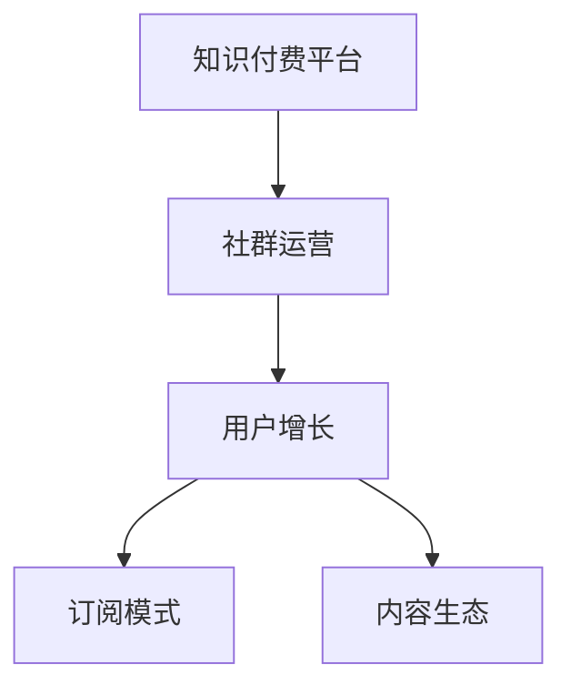

                 

# 知识付费：程序员的社群运营思维

> 关键词：知识付费、程序员、社群运营、用户增长、订阅模式、知识付费平台、社区运营策略、内容生态

## 1. 背景介绍

在数字化快速发展的今天，知识付费成为了一种新的价值变现方式，受到越来越多的关注和应用。尤其是在程序员群体中，知识付费更是成为了他们获取最新技术、提升个人技能的重要途径。据调研，约八成以上程序员愿意为优质内容付费，且付费意愿随内容质量提高而提升。

尽管知识付费市场有着巨大的潜力，但目前这一领域也面临诸多挑战。如何构建可持续的知识付费社群，实现平台与用户双方的价值最大化，成为亟待解决的问题。本文将从社群运营的视角，探讨知识付费平台的构建和运营策略，为程序员社群的发展提供有价值的见解。

## 2. 核心概念与联系

为了更好地理解知识付费平台的运营思维，本节将介绍几个关键概念，并说明它们之间的联系。

### 2.1 核心概念概述

- **知识付费**：通过付费获取专业知识和技能的学习方式，旨在提高学习效率和质量。
- **社群运营**：利用社区的力量，通过线上和线下活动、互动交流等手段，增强用户粘性，提升平台价值。
- **用户增长**：通过有效的市场推广和用户体验优化，吸引更多用户注册和付费，扩大平台影响力。
- **订阅模式**：用户以订阅的方式获取持续的、高质量的优质内容，平台通过稳定收入实现可持续发展。
- **内容生态**：平台汇集各种优质内容创作者，形成丰富多元的内容体系，满足不同用户的需求。

### 2.2 核心概念原理和架构的 Mermaid 流程图



这个流程图展示了知识付费平台及其核心组成要素之间的相互关系：

1. **知识付费平台**作为基础，为社群运营和用户增长提供平台保障。
2. **社群运营**通过增强用户互动和粘性，助力用户增长和内容生态的构建。
3. **用户增长**依赖于社群运营，同时又推动订阅模式和内容生态的发展。
4. **订阅模式**为用户提供了持续获取优质内容的方式，是知识付费平台的经济基础。
5. **内容生态**构建了平台的价值核心，是吸引用户订阅的关键。

## 3. 核心算法原理 & 具体操作步骤

### 3.1 算法原理概述

知识付费平台的核心算法在于如何高效匹配用户和内容，提升用户体验，并实现平台的商业可持续性。核心算法包括推荐算法、广告投放算法、内容生成算法等。

推荐算法旨在根据用户的历史行为和偏好，推荐最相关的优质内容，提升用户粘性和平台留存率。广告投放算法通过精准的用户画像和场景分析，提高广告投放的转化率，为平台带来更多的付费用户。内容生成算法则是基于大数据和深度学习，自动化生成高质量内容，降低内容生产成本，提高内容输出效率。

### 3.2 算法步骤详解

#### 3.2.1 推荐算法

1. **用户画像构建**：通过用户注册信息、浏览历史、购买记录等数据，构建用户画像，了解用户兴趣和需求。
2. **内容特征提取**：提取课程、文章、视频等内容的关键词、标签、评分等信息，形成内容特征库。
3. **相似度计算**：通过余弦相似度、Jaccard相似度等算法，计算用户与内容之间的相似度。
4. **推荐排序**：根据相似度计算结果，对内容进行排序，选择最相关的几项推荐给用户。

#### 3.2.2 广告投放算法

1. **用户画像精化**：结合广告目标用户的特征，优化用户画像，提高广告投放的精准性。
2. **场景分析**：根据用户行为数据，识别出用户活跃的时间、地点、设备等场景信息，选择最佳投放时机和渠道。
3. **广告创意生成**：利用自然语言处理、图像生成等技术，自动生成多样化的广告创意。
4. **投放效果监控**：实时监控广告投放效果，根据效果反馈调整投放策略，提高广告ROI。

#### 3.2.3 内容生成算法

1. **数据收集与预处理**：收集大量相关领域的知识数据，进行清洗、标注等预处理工作。
2. **特征提取与建模**：提取关键特征，如句子长度、关键词频率等，建立文本生成模型。
3. **生成与优化**：通过模型生成内容，并利用自然语言处理技术进行内容优化，确保生成的内容高质量、符合语法规范。
4. **内容审核与发布**：对生成内容进行审核，确保其符合平台规范，发布到平台上供用户阅读。

### 3.3 算法优缺点

#### 3.3.1 推荐算法

- **优点**：
  - 提升用户体验，增加用户粘性。
  - 精准匹配用户需求，提高转化率。
  - 降低用户筛选成本，提高内容消费效率。

- **缺点**：
  - 数据依赖性强，需要大量标注数据支持。
  - 可能存在信息过载问题，用户易疲劳。
  - 需不断优化算法，保持推荐效果。

#### 3.3.2 广告投放算法

- **优点**：
  - 精准投放，提高广告转化率。
  - 降低广告成本，提高投放ROI。
  - 实时监控效果，动态调整策略。

- **缺点**：
  - 广告创意质量参差不齐，影响用户体验。
  - 用户对广告反感，影响平台声誉。
  - 数据隐私问题，需严格合规。

#### 3.3.3 内容生成算法

- **优点**：
  - 降低内容生产成本，提高内容产出效率。
  - 内容可实时更新，保持平台新鲜感。
  - 可覆盖更多领域，满足用户多样化需求。

- **缺点**：
  - 内容质量难以保证，存在低质量内容风险。
  - 自动化生成依赖技术，需持续优化。
  - 需要大量计算资源，成本较高。

### 3.4 算法应用领域

知识付费平台的算法不仅限于推荐、广告、内容生成等核心模块，还可以应用于用户行为分析、内容推荐、广告投放等多个领域。

- **用户行为分析**：通过分析用户行为数据，了解用户需求和偏好，优化内容推荐和广告投放策略。
- **内容推荐**：根据用户画像和内容特征，推荐最相关的优质内容，提升用户粘性和平台留存率。
- **广告投放**：通过精准的用户画像和场景分析，实现广告的高效投放，为平台带来更多的付费用户。
- **智能客服**：利用自然语言处理技术，自动处理用户咨询，提高客服效率和用户满意度。
- **知识图谱构建**：通过分析课程、文章、视频等内容的关联关系，构建知识图谱，支持个性化推荐和知识探索。

## 4. 数学模型和公式 & 详细讲解 & 举例说明

### 4.1 数学模型构建

知识付费平台的核心数学模型包括用户画像、内容推荐、广告投放等模型。这里以推荐系统为例，介绍其数学模型的构建。

**用户画像**：

- 用户画像由多种特征组成，包括基本信息、历史行为、兴趣标签等。
- 设用户画像为 $\mathbf{x} = (x_1, x_2, ..., x_n)$，其中 $x_i$ 为第 $i$ 个特征。

**内容特征**：

- 内容特征同样由多种特征组成，包括标题、摘要、关键词、评分等。
- 设内容特征为 $\mathbf{y} = (y_1, y_2, ..., y_m)$，其中 $y_j$ 为第 $j$ 个特征。

**相似度计算**：

- 使用余弦相似度公式计算用户与内容之间的相似度。
- 设用户特征向量为 $\mathbf{u} = (u_1, u_2, ..., u_n)$，内容特征向量为 $\mathbf{v} = (v_1, v_2, ..., v_m)$。
- 余弦相似度计算公式为：
  $$
  \cos(\theta) = \frac{\mathbf{u} \cdot \mathbf{v}}{\|\mathbf{u}\|\|\mathbf{v}\|}
  $$
  其中 $\mathbf{u} \cdot \mathbf{v}$ 为向量点积，$\|\mathbf{u}\|$ 和 $\|\mathbf{v}\|$ 分别为向量的范数。

### 4.2 公式推导过程

以推荐算法中的用户画像构建为例，说明相关公式的推导过程。

**用户画像构建**：

- 假设用户画像由 $n$ 个特征组成，每个特征 $x_i$ 取值为 $0$ 或 $1$。
- 设用户画像为 $\mathbf{x} = (x_1, x_2, ..., x_n)$。
- 用户画像的表示可以采用独热编码形式，即 $\mathbf{x} = [x_1, x_2, ..., x_n]$。
- 用户画像的维度 $n$ 需要根据实际情况调整，通常取值在 $10$ 到 $100$ 之间。

**内容特征提取**：

- 内容特征同样由 $m$ 个特征组成，每个特征 $y_j$ 取值为 $0$ 或 $1$。
- 设内容特征为 $\mathbf{y} = (y_1, y_2, ..., y_m)$。
- 内容特征的表示也采用独热编码形式，即 $\mathbf{y} = [y_1, y_2, ..., y_m]$。
- 内容特征的维度 $m$ 需要根据实际情况调整，通常取值在 $10$ 到 $100$ 之间。

**相似度计算**：

- 用户画像和内容特征的余弦相似度计算公式为：
  $$
  \cos(\theta) = \frac{\mathbf{u} \cdot \mathbf{v}}{\|\mathbf{u}\|\|\mathbf{v}\|}
  $$
  其中 $\mathbf{u} = [u_1, u_2, ..., u_n]$ 为用户画像，$\mathbf{v} = [v_1, v_2, ..., v_m]$ 为内容特征。
- 由于用户画像和内容特征都是二元特征，因此计算点积 $\mathbf{u} \cdot \mathbf{v}$ 相当于计算 $1$ 的个数。
- 范数 $\|\mathbf{u}\|$ 和 $\|\mathbf{v}\|$ 可以通过计算 $\sqrt{\sum_{i=1}^{n}u_i^2}$ 和 $\sqrt{\sum_{j=1}^{m}v_j^2}$ 得到。

### 4.3 案例分析与讲解

以知识付费平台为例，分析推荐算法的实际应用。

**用户画像构建**：

- 用户注册信息：包括年龄、性别、职业等。
- 浏览历史：包括浏览的课程、文章、视频等。
- 购买记录：包括购买的课程、订阅的服务等。
- 设用户画像为 $\mathbf{x} = (x_1, x_2, ..., x_n)$，其中 $x_1$ 为用户年龄，$x_2$ 为用户浏览课程历史，$x_3$ 为用户购买课程记录等。
- 用户画像的维度 $n$ 可以设置为 $10$，以包含基本特征。

**内容特征提取**：

- 课程特征：包括课程名称、讲师、难度等级、评分等。
- 文章特征：包括文章标题、作者、发布日期、关键词等。
- 视频特征：包括视频名称、上传日期、时长、评分等。
- 设内容特征为 $\mathbf{y} = (y_1, y_2, ..., y_m)$，其中 $y_1$ 为课程名称，$y_2$ 为讲师，$y_3$ 为难度等级等。
- 内容特征的维度 $m$ 可以设置为 $20$，以包含基本特征。

**相似度计算**：

- 用户画像为 $\mathbf{x} = (x_1, x_2, ..., x_{10})$，内容特征为 $\mathbf{y} = (y_1, y_2, ..., y_{20})$。
- 设用户画像为 $\mathbf{u} = [1, 1, 0, 0, ..., 0]$，内容特征为 $\mathbf{v} = [1, 1, 0, 0, ..., 0]$。
- 用户画像与内容特征的余弦相似度计算结果为 $\cos(\theta) = \frac{3}{5}$。
- 根据相似度大小排序，选择最相关的几项内容推荐给用户。

## 5. 项目实践：代码实例和详细解释说明

### 5.1 开发环境搭建

要构建知识付费平台，首先需要搭建相应的开发环境。以下是使用Python进行Flask开发的简单环境配置流程：

1. 安装Anaconda：从官网下载并安装Anaconda，用于创建独立的Python环境。
2. 创建并激活虚拟环境：
```bash
conda create -n flask-env python=3.8 
conda activate flask-env
```
3. 安装Flask：
```bash
pip install flask
```
4. 安装Flask扩展：
```bash
pip install flask-login flask-migrate flask-restful flask-cors
```
5. 安装其他工具包：
```bash
pip install flask-sqlalchemy flask-wtf flask-security flask-restful flask-cors
```
完成上述步骤后，即可在`flask-env`环境中开始项目开发。

### 5.2 源代码详细实现

这里我们以一个简单的知识付费平台为例，展示如何使用Flask进行项目开发。

首先，创建一个Flask应用程序：

```python
from flask import Flask, request, jsonify

app = Flask(__name__)

# 定义路由
@app.route('/content', methods=['GET'])
def get_content():
    # 根据用户ID获取内容列表
    content_list = []
    # ...
    return jsonify(content_list)
```

然后，实现用户认证功能：

```python
from flask_login import LoginManager, login_required, UserMixin

# 初始化登录管理器
login_manager = LoginManager()
login_manager.init_app(app)

# 用户类
class User(UserMixin):
    def __init__(self, id):
        self.id = id

# 用户认证回调函数
@login_manager.user_loader
def load_user(id):
    # 从数据库中获取用户信息
    user = User(id)
    return user
```

接着，实现内容推荐功能：

```python
from sklearn.neighbors import NearestNeighbors

# 初始化推荐模型
nn = NearestNeighbors(n_neighbors=5)

# 训练推荐模型
# ...

# 推荐内容
@app.route('/recommend', methods=['POST'])
@login_required
def recommend():
    # 获取用户ID
    user_id = request.json.get('user_id')
    # 获取相似用户ID
    similar_user_ids = nn.kneighbors([user_id], return_distance=False)
    # 获取推荐内容
    recommended_content_ids = []
    # ...
    return jsonify(recommended_content_ids)
```

最后，启动应用并测试：

```python
if __name__ == '__main__':
    app.run(debug=True)
```

以上就是使用Flask构建知识付费平台的简单代码实现。可以看到，通过Flask，我们可以快速搭建一个基本的功能框架，并进行后续的扩展和优化。

### 5.3 代码解读与分析

让我们再详细解读一下关键代码的实现细节：

**Flask应用程序**：
- 创建一个Flask应用程序实例，并进行路由定义。
- 定义一个路由`/content`，用于获取推荐内容列表。

**用户认证功能**：
- 初始化登录管理器，设置用户类。
- 定义用户认证回调函数，从数据库中获取用户信息。
- 通过`@login_manager.user_loader`装饰器，指定用户认证回调函数。

**内容推荐功能**：
- 初始化推荐模型，使用K近邻算法进行相似度计算。
- 训练推荐模型，计算用户与内容之间的相似度。
- 根据相似度排序，选择最相关的几项内容推荐给用户。

**启动应用**：
- 使用`app.run()`启动Flask应用程序，设置调试模式为True，以便实时查看调试信息。

可以看到，Flask提供了灵活的路由和插件机制，能够方便地实现各种功能模块。结合Flask的强大扩展性，开发者可以快速构建知识付费平台，并进行持续的优化和迭代。

## 6. 实际应用场景

### 6.1 知识付费平台的构建

知识付费平台的构建需要综合考虑用户需求、内容质量、运营策略等多个方面。以下是一个完整的知识付费平台构建步骤：

1. **需求分析**：了解目标用户群体的需求，确定平台的核心功能和用户体验。
2. **平台设计**：设计平台架构，确定用户界面和交互方式。
3. **功能实现**：开发平台功能模块，包括用户管理、内容发布、推荐系统等。
4. **内容生产**：招募和培养内容创作者，生产高质量的课程、文章、视频等。
5. **推广运营**：通过社交媒体、SEO、广告投放等方式，吸引更多用户注册和付费。
6. **用户运营**：通过社群运营、用户互动、会员制度等手段，提升用户粘性和满意度。
7. **持续优化**：根据用户反馈和数据分析，不断优化平台功能和用户体验。

### 6.2 社群运营的实践

社群运营是知识付费平台的核心竞争力之一。以下是一个有效的社群运营策略：

1. **建立社区规则**：制定明确的用户行为准则，确保社区环境良好。
2. **加强互动交流**：通过论坛、问答、直播等方式，增加用户之间的互动和粘性。
3. **组织线上活动**：定期举办线上讲座、技术分享、编程比赛等活动，提升用户参与度。
4. **提供增值服务**：推出会员制度、专属内容、VIP服务等方式，提高用户粘性。
5. **激励内容创作者**：通过奖励机制、流量支持、合作机会等方式，激励优质内容创作者。
6. **强化社区反馈**：定期收集用户反馈，优化社区功能和用户体验。

### 6.3 用户增长的策略

用户增长是知识付费平台的重要目标之一。以下是一个有效的用户增长策略：

1. **内容优化**：不断提升内容质量和多样性，满足不同用户的需求。
2. **精准营销**：通过数据分析和用户画像，实现精准的市场推广。
3. **合作伙伴**：与高校、企业、行业协会等机构合作，扩大平台影响力。
4. **社交媒体**：利用社交媒体平台，进行内容推广和用户引导。
5. **活动策划**：举办线上线下活动，吸引新用户注册和付费。
6. **用户体验**：优化平台功能和使用体验，提高用户满意度和留存率。

### 6.4 未来应用展望

随着技术的发展，知识付费平台的应用前景将更加广阔。未来，知识付费平台将能够实现以下功能：

1. **智能推荐**：通过AI技术，实现更精准的内容推荐，提升用户体验。
2. **互动直播**：通过直播功能，实现实时互动和问答，增加用户参与度。
3. **个性化内容**：根据用户偏好，提供个性化的内容推荐和课程学习路径。
4. **社区自运营**：通过社区自运营机制，实现用户自发生产和传播内容。
5. **知识图谱**：构建知识图谱，实现内容的深度关联和智能搜索。
6. **多模态内容**：支持图像、视频、音频等多种模态的内容生产和传播。

## 7. 工具和资源推荐

### 7.1 学习资源推荐

为了帮助开发者系统掌握知识付费平台的构建和运营，以下是一些优质的学习资源：

1. **《Flask Web开发实战》**：详细介绍了Flask框架的开发和应用，适合入门和进阶。
2. **《Python Web开发实战》**：介绍了Python Web开发的基本概念和实践方法，适合初学者和中级开发者。
3. **《知识付费行业白皮书》**：由知识付费行业专家撰写，介绍了行业现状和未来趋势，适合从业者和投资者。
4. **《用户体验设计》**：介绍了用户研究和用户体验设计的核心方法和技巧，适合产品经理和UI设计师。
5. **《用户增长圣经》**：由用户增长领域专家撰写，介绍了用户增长的各个环节和策略，适合运营和市场营销人员。

通过学习这些资源，相信你一定能够系统掌握知识付费平台的构建和运营策略，为程序员社群的发展提供有价值的指导。

### 7.2 开发工具推荐

以下是一些常用的知识付费平台开发工具：

1. **Flask**：轻量级的Web框架，适合快速开发和迭代。
2. **Django**：强大的Web框架，适合复杂需求和大规模应用。
3. **MySQL**：流行的关系型数据库，适合存储用户和内容数据。
4. **Redis**：高性能的内存数据库，适合缓存和实时数据处理。
5. **Flask-Login**：Flask的认证扩展，方便实现用户认证和管理。
6. **Flask-Migrate**：Flask的数据库迁移工具，方便进行数据库版本管理。
7. **Flask-Restful**：Flask的RESTful扩展，方便实现API接口。
8. **Flask-Cors**：Flask的CORS扩展，方便跨域访问。

这些工具能够提供全面的支持，帮助开发者快速构建和优化知识付费平台。

### 7.3 相关论文推荐

知识付费平台的构建和运营涉及多个领域的技术和知识，以下几篇论文值得关注：

1. **《知识付费平台的用户需求分析》**：介绍了知识付费平台的用户需求和调研方法，适合产品经理和市场分析师。
2. **《知识付费平台的内容推荐算法》**：介绍了推荐算法的核心原理和实现方法，适合算法工程师和数据科学家。
3. **《知识付费平台的社群运营策略》**：介绍了社群运营的核心策略和实践案例，适合社区运营人员和产品经理。
4. **《知识付费平台的用户增长策略》**：介绍了用户增长的关键环节和策略，适合运营和市场营销人员。
5. **《知识付费平台的未来展望》**：介绍了知识付费平台的发展趋势和未来方向，适合创业者和技术从业者。

这些论文代表了大知识付费平台的发展方向，有助于开发者深入理解技术细节和运营策略。

## 8. 总结：未来发展趋势与挑战

### 8.1 总结

本文对知识付费平台构建和运营的策略进行了全面系统的介绍。首先阐述了知识付费平台的背景和核心概念，明确了用户增长、社群运营、内容推荐等关键要素之间的相互关系。其次，从推荐算法、广告投放、内容生成等核心模块，详细讲解了知识付费平台的核心算法原理和具体操作步骤。最后，结合实际应用场景，探讨了知识付费平台的未来发展趋势和面临的挑战。

通过本文的系统梳理，可以看到，知识付费平台的构建和运营需要综合考虑多个方面的因素，才能实现平台的商业可持续性和用户价值最大化。未来，随着技术的不断进步和市场需求的不断变化，知识付费平台的发展前景将更加广阔。

### 8.2 未来发展趋势

知识付费平台的未来发展趋势主要体现在以下几个方面：

1. **智能推荐**：通过AI技术，实现更精准的内容推荐，提升用户体验。
2. **互动直播**：通过直播功能，实现实时互动和问答，增加用户参与度。
3. **个性化内容**：根据用户偏好，提供个性化的内容推荐和课程学习路径。
4. **社区自运营**：通过社区自运营机制，实现用户自发生产和传播内容。
5. **知识图谱**：构建知识图谱，实现内容的深度关联和智能搜索。
6. **多模态内容**：支持图像、视频、音频等多种模态的内容生产和传播。

### 8.3 面临的挑战

尽管知识付费平台有着巨大的发展潜力，但在实现过程中也面临诸多挑战：

1. **用户获取成本高**：知识付费平台的运营需要大量的用户数据和高质量的内容，获取成本较高。
2. **内容质量难以保证**：高质量内容的生产需要高成本和高专业性，难以保证内容的持续性和多样性。
3. **用户留存率低**：用户获取容易留存难，需要不断提升用户体验和平台粘性。
4. **技术门槛高**：知识付费平台的构建需要跨领域的技术支持，对技术团队的要求较高。
5. **法律法规风险**：知识付费平台需要严格遵守法律法规，保护用户隐私和数据安全。

### 8.4 研究展望

面对知识付费平台面临的挑战，未来的研究需要在以下几个方面寻求新的突破：

1. **低成本内容生产**：探索AI生成内容、众包内容等低成本内容生产方式，降低平台运营成本。
2. **内容质量监控**：引入内容质量监控机制，确保平台内容的准确性和规范性。
3. **用户留存优化**：通过用户画像、个性化推荐等手段，提升用户粘性和留存率。
4. **跨领域技术融合**：结合AI、大数据、云计算等技术，提升平台的综合能力。
5. **法律法规合规**：制定和完善平台规则，严格遵守法律法规，保护用户隐私和数据安全。

## 9. 附录：常见问题与解答

**Q1: 知识付费平台如何保证内容的质量和多样性？**

A: 知识付费平台保证内容质量和多样性需要从多个方面入手：

1. **内容审核机制**：引入专业的内容审核团队，对上传内容进行审核，确保内容的准确性和规范性。
2. **内容激励机制**：通过奖励机制、流量支持、合作机会等方式，激励优质内容创作者。
3. **用户反馈机制**：定期收集用户反馈，优化内容质量和推荐效果。
4. **内容推荐算法**：利用推荐算法，根据用户画像和行为数据，推荐最相关的优质内容。
5. **多模态内容生产**：支持图像、视频、音频等多种模态的内容生产和传播，增加内容的多样性和吸引力。

**Q2: 知识付费平台如何提升用户留存率？**

A: 提升用户留存率需要综合考虑多个方面，以下是一些有效的策略：

1. **用户体验优化**：优化平台界面和功能，提升用户使用体验。
2. **个性化推荐**：根据用户画像和行为数据，提供个性化的内容推荐和课程学习路径。
3. **互动交流机制**：通过论坛、问答、直播等方式，增加用户之间的互动和粘性。
4. **专属权益和福利**：推出会员制度、专属内容、VIP服务等专属权益和福利，提升用户粘性。
5. **用户社区建设**：建立用户社区，增加用户参与感和归属感。
6. **定期活动策划**：举办线上线下活动，吸引新用户注册和付费。

**Q3: 知识付费平台如何实现精准的市场推广？**

A: 知识付费平台实现精准的市场推广需要以下策略：

1. **用户画像构建**：通过数据分析和用户行为数据，构建详细用户画像，了解用户需求和兴趣。
2. **广告定向投放**：利用广告定向投放技术，将广告精准投放给目标用户，提高广告转化率。
3. **社交媒体推广**：通过社交媒体平台，进行内容推广和用户引导，提升平台曝光度。
4. **SEO优化**：进行搜索引擎优化，提升平台在搜索引擎中的排名，增加自然流量。
5. **内容营销**：通过优质的内容和用户互动，吸引更多用户关注和传播。

**Q4: 知识付费平台如何应对用户增长带来的挑战？**

A: 应对用户增长带来的挑战需要从多个方面入手：

1. **内容生产效率提升**：通过内容生产工具和技术，提升内容生产和更新的效率。
2. **系统扩展优化**：优化系统架构和数据库设计，提升平台的扩展性和稳定性。
3. **用户服务提升**：增加客服人员和工具，提升用户服务质量和效率。
4. **运营数据分析**：通过数据分析和用户画像，优化运营策略，提升用户体验和留存率。
5. **技术基础设施升级**：升级技术基础设施，提升平台的计算和存储能力。

通过以上策略，知识付费平台能够应对用户增长的挑战，实现平台的持续发展。

---

作者：禅与计算机程序设计艺术 / Zen and the Art of Computer Programming

