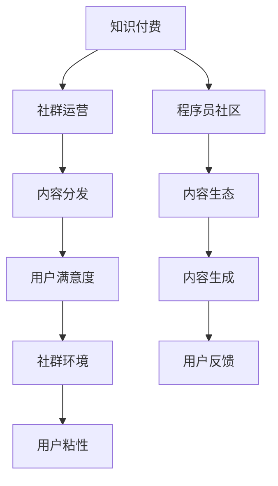

                 

# 知识付费：程序员的社群运营方法

> 关键词：知识付费, 社群运营, 程序员社区, 技术交流, 内容分发

## 1. 背景介绍

### 1.1 问题由来
在互联网时代，信息爆炸带来知识的无限增长和快速传播，然而高质量的学习资源依然稀缺，高质量的学习社群更是凤毛麟角。程序员作为知识密集型群体，有较强的学习需求和知识分享意愿。如何高效地组织、运营和推广程序员社区，成为社区平台的重要任务。

### 1.2 问题核心关键点
本文聚焦于程序员社区的知识付费模式，以及如何通过高效的社群运营，提升社区的活跃度和用户满意度。我们希望探讨：
- 社区内知识付费的商业模式有哪些？
- 如何设计社区知识内容的生态体系？
- 如何通过运营手段，激发用户参与和内容生成？
- 如何利用技术手段，提升内容分发和用户体验？

### 1.3 问题研究意义
研究知识付费和社区运营，对于构建一个活跃、健康、可持续发展的程序员社区具有重要意义：

1. 提升用户粘性：通过知识付费，激发用户贡献高质量内容和积极互动，形成良性循环，提升用户粘性。
2. 增加社区收益：知识付费模式不仅可以提供稳定的社区运营资金，还能激励用户生成优质内容，推动社区发展。
3. 推动内容生态：构建多样的内容生产渠道，丰富社区知识生态，满足不同层次的学习需求。
4. 促进技术交流：搭建知识分享平台，打破信息壁垒，促进技术交流和合作，加速行业技术进步。
5. 扩展社区规模：通过有效的运营和推广，吸引更多优质人才加入社区，扩大社区影响力。

## 2. 核心概念与联系

### 2.1 核心概念概述

为了更好地理解程序员社区的知识付费模式和运营方法，本节将介绍几个核心概念：

- **知识付费(Knowledge-Based Paywall)**：指通过付费获取高质量的学习资源或专家指导，保障内容的深度和专业性，同时也激励内容生产者创造更多优质内容。
- **社群运营(Social Media Management)**：指通过合理的运营策略，提升社群的活跃度和用户满意度，促进内容的生成和传播，营造良好的社群环境。
- **程序员社区(Programmer Community)**：指由程序员群体组成的线上社区，以技术交流、经验分享、资源共享为主要活动内容。
- **内容分发(Content Distribution)**：指通过合适的技术手段，将知识内容有效地推送给用户，确保内容的覆盖和质量。
- **用户满意度(User Satisfaction)**：指用户在使用社区服务过程中获得的整体满意度，直接影响社区的活跃度和用户粘性。

这些核心概念之间的逻辑关系可以通过以下Mermaid流程图来展示：



这个流程图展示了几大核心概念及其之间的关系：

1. 知识付费是社区的商业模式，通过付费激励用户生成内容，丰富内容生态。
2. 社群运营通过运营策略提升用户满意度和社群环境，从而提高用户粘性。
3. 内容分发确保内容的有效覆盖，提升用户获取知识的效率。
4. 用户满意度直接影响社群环境，用户粘性影响社群的长期发展。
5. 内容生态丰富社区知识库，通过内容生成和用户反馈不断优化。

## 3. 核心算法原理 & 具体操作步骤
### 3.1 算法原理概述

程序员社区的知识付费模式主要基于市场化的供需机制，通过构建一个以知识为核心的交易平台，来实现高质量内容与用户需求的对接。社区运营者通过设计合理的定价策略、内容推荐算法和用户行为模型，来优化内容分发和用户体验。

### 3.2 算法步骤详解

基于知识付费的社区运营，一般包括以下几个关键步骤：

**Step 1: 构建内容生态**
- 收集社区内程序员提交的高质量代码、项目实战经验、技术分享等各类知识内容。
- 筛选和审核内容，确保内容的专业性和权威性。
- 对内容进行分类和标签化，便于用户查询和检索。

**Step 2: 设计定价策略**
- 根据内容价值和用户需求，设置合理的知识付费价格。
- 考虑提供不同层级的付费内容，满足不同用户的学习需求。
- 引入订阅模式、按需付费模式、免费试用等灵活的支付方式，方便用户选择。

**Step 3: 优化内容推荐**
- 使用推荐算法，根据用户兴趣和历史行为，个性化推荐内容。
- 引入多维度的内容标签和用户画像，提升推荐的精准度。
- 定期更新推荐算法模型，适应用户需求的变化。

**Step 4: 激励内容生成**
- 建立用户激励机制，如积分、勋章、会员资格等，激励用户积极贡献内容。
- 提供丰富的交互方式，如问答、讨论、投票等，增加内容互动性。
- 引入算法自动生成内容，如代码翻译、功能实现等，提升内容生产效率。

**Step 5: 提高用户满意度**
- 设计友好的用户界面，提升用户体验。
- 提供多样化的内容形式，如视频、文章、代码、案例等，满足不同用户的需求。
- 建立社区反馈机制，及时调整和优化服务。

### 3.3 算法优缺点

知识付费的社区运营模式具有以下优点：
1. 高质量内容保障：通过市场机制筛选优质内容，保障用户获取知识的深度和准确性。
2. 激励内容生成：付费机制激励用户生成更多优质内容，丰富社区知识生态。
3. 提升用户粘性：通过积分、勋章等激励机制，增加用户活跃度和社区归属感。
4. 灵活的支付方式：多种支付方式满足不同用户需求，便于用户选择。
5. 提升内容分发效率：通过个性化推荐算法，提升内容到达目标用户的速度和效果。

同时，该模式也存在一定的局限性：
1. 用户获取门槛高：部分用户可能因价格较高而放弃付费，影响社区活跃度。
2. 用户需求多样：不同用户对内容的需求各异，单一的付费模式可能难以满足所有用户。
3. 运营成本高：高质量内容的采集、审核和维护需要大量人力物力，运营成本较高。
4. 内容分发效率受限：推荐算法模型需不断优化，才能适应用户需求变化。
5. 用户体验单一：以知识付费为主，缺乏多样化的社区活动和互动形式。

尽管存在这些局限性，但就目前而言，知识付费模式依然是程序员社区的重要商业模式。未来相关研究的重点在于如何进一步优化定价策略，降低用户获取门槛，丰富内容形式和分发渠道，提升用户满意度和社区环境。

### 3.4 算法应用领域

知识付费的社区运营模式在多个领域得到了广泛应用，以下是一些典型应用场景：

- **技术培训**：社区内提供各类技术培训课程，如编程语言、框架、算法等，用户通过付费获取高质量培训资源。
- **项目合作**：程序员可以通过社区发布项目需求，寻找合适的合作伙伴，实现技术交流和项目落地。
- **招聘求职**：企业可以通过社区发布招聘信息，程序员也可以发布求职需求，促进人才匹配和就业。
- **知识分享**：程序员可以在社区分享自己的经验、心得和技术栈，实现知识的跨界传播。
- **项目代码托管**：社区提供代码托管平台，方便程序员共享和管理自己的项目代码。
- **技术问答**：社区内设立技术问答板块，用户可以通过付费获取专业的技术支持，解决实际问题。

除了上述这些经典应用外，知识付费模式还被创新性地应用到更多场景中，如智能导师、技术评估、竞答赛等，为程序员社区带来了新的业务模式和用户价值。

## 4. 数学模型和公式 & 详细讲解
### 4.1 数学模型构建

假设程序员社区内有 $N$ 个用户，每个用户有 $M$ 个感兴趣的知识点。社区内容分为 $K$ 个类别，每个用户对不同类别的兴趣程度 $W_i$ 构成兴趣向量 $\mathbf{W}_i \in [0,1]^K$。每个知识点的价值 $V_j$ 构成价值向量 $\mathbf{V}_j \in [0,1]^K$。知识付费价格 $P_k$ 表示用户为获取某一类知识点的支付意愿，定价模型为 $P_k = f(W_i, V_j, C_k)$，其中 $C_k$ 为内容的成本。

社区推荐模型 $R$ 根据用户兴趣和知识点价值，计算推荐得分 $S_{ij}$：

$$
S_{ij} = W_i^\top \mathbf{V}_j + R(\mathbf{W}_i, \mathbf{V}_j, C_k)
$$

其中 $R$ 为推荐函数，可以是加权求和、协同过滤、深度学习等。社区的目标是最大化推荐效果，即最小化推荐误差 $E$：

$$
E = \sum_{i,j} (Y_{ij} - S_{ij})^2
$$

其中 $Y_{ij}$ 为实际推荐结果，1 表示推荐成功，0 表示未推荐成功。

### 4.2 公式推导过程

以协同过滤推荐算法为例，假设用户 $i$ 和用户 $j$ 对同一知识点 $j$ 的兴趣相似度为 $S_{ij} = \frac{\mathbf{W}_i^\top \mathbf{W}_j}{\|\mathbf{W}_i\| \cdot \|\mathbf{W}_j\|}$。计算 $i$ 对 $j$ 的推荐得分 $S_{ij} = \frac{\mathbf{V}_j^\top \mathbf{W}_i}{\|\mathbf{W}_i\|}$，其中 $\mathbf{W}_i$ 为 $i$ 的兴趣向量，$\mathbf{V}_j$ 为 $j$ 的知识点向量。

假设社区内有 $M$ 个知识点，每个知识点价值 $V_j$ 为 $V_j = \frac{\sum_{i=1}^N W_{ij}}{M}$，表示知识点 $j$ 的平均用户兴趣度。根据上述公式计算推荐得分，并按照得分排序推荐给用户 $i$。

### 4.3 案例分析与讲解

以GitHub社区为例，其知识付费模式主要通过GitHub Sponsors和GitHub Patron等机制实现。用户可以通过赞助GitHub用户和项目，获取高质量的技术支持和内容。GitHub社区通过积分、徽章等激励机制，提升用户贡献代码和社区活跃度。

GitHub的推荐算法结合了内容质量和用户行为，通过分析用户的代码提交历史、关注项目、行为数据等，进行个性化的内容推荐。社区内还设立了技术问答板块，用户可以通过付费获取专业的技术支持。

## 5. 项目实践：代码实例和详细解释说明
### 5.1 开发环境搭建

在进行社区运营实践前，我们需要准备好开发环境。以下是使用Python进行PyTorch开发的环境配置流程：

1. 安装Anaconda：从官网下载并安装Anaconda，用于创建独立的Python环境。

2. 创建并激活虚拟环境：
```bash
conda create -n pytorch-env python=3.8 
conda activate pytorch-env
```

3. 安装PyTorch：根据CUDA版本，从官网获取对应的安装命令。例如：
```bash
conda install pytorch torchvision torchaudio cudatoolkit=11.1 -c pytorch -c conda-forge
```

4. 安装各类工具包：
```bash
pip install numpy pandas scikit-learn matplotlib tqdm jupyter notebook ipython
```

完成上述步骤后，即可在`pytorch-env`环境中开始社区运营实践。

### 5.2 源代码详细实现

这里我们以一个虚拟的程序员社区为例，给出使用PyTorch进行知识付费和内容推荐的PyTorch代码实现。

首先，定义知识付费的定价模型：

```python
import numpy as np

class PricingModel:
    def __init__(self, interest_weights, content_values, costs):
        self.interest_weights = interest_weights
        self.content_values = content_values
        self.costs = costs
    
    def calculate_price(self, content_index):
        return self.content_values[content_index] * self.interest_weights
```

然后，定义社区推荐算法：

```python
import torch

class CollaborativeFiltering:
    def __init__(self, interest_weights, content_values):
        self.interest_weights = interest_weights
        self.content_values = content_values
    
    def recommend(self, user_index, user_interest):
        dot_product = torch.dot(user_interest, self.content_values)
        return dot_product / (torch.sqrt(torch.dot(user_interest, user_interest)) * torch.sqrt(torch.dot(self.content_values, self.content_values)))
```

接着，定义社区知识内容库：

```python
class ContentLibrary:
    def __init__(self, contents):
        self.contents = contents
    
    def get_content(self, content_index):
        return self.contents[content_index]
```

最后，启动社区运营流程：

```python
# 创建知识付费定价模型
interest_weights = np.array([0.5, 0.3, 0.2])  # 用户对三类内容的兴趣权重
content_values = np.array([1, 1, 1])  # 三类内容的价值
costs = np.array([1, 2, 3])  # 三类内容的成本
pricing_model = PricingModel(interest_weights, content_values, costs)

# 创建内容推荐算法
content_values = np.array([1, 2, 3])  # 三类内容的价值
collaborative_filtering = CollaborativeFiltering(interest_weights, content_values)

# 创建知识内容库
contents = [
    {'name': 'Python基础', 'value': 1},
    {'name': '数据结构与算法', 'value': 2},
    {'name': '机器学习', 'value': 3},
]
content_library = ContentLibrary(contents)

# 用户对三类内容的兴趣
user_interest = np.array([0.5, 0.3, 0.2])

# 计算用户推荐内容
recommended_contents = []
for content_index in range(len(contents)):
    recommended_content = collaborative_filtering.recommend(1, user_interest)
    recommended_contents.append(recommended_content)

print(recommended_contents)
```

以上就是使用PyTorch进行知识付费和内容推荐的完整代码实现。可以看到，利用PyTorch强大的计算图能力，我们能够高效地构建知识付费定价模型和内容推荐算法，快速迭代和优化社区运营策略。

### 5.3 代码解读与分析

让我们再详细解读一下关键代码的实现细节：

**PricingModel类**：
- `__init__`方法：初始化兴趣权重、内容价值和成本，为定价模型提供基础数据。
- `calculate_price`方法：根据用户的兴趣权重和内容价值，计算知识付费价格。

**CollaborativeFiltering类**：
- `__init__`方法：初始化兴趣权重和内容价值，为协同过滤推荐算法提供基础数据。
- `recommend`方法：根据用户兴趣和内容价值，计算推荐得分，并按照得分排序推荐内容。

**ContentLibrary类**：
- `__init__`方法：初始化知识内容库，为内容推荐提供数据源。
- `get_content`方法：根据内容索引获取具体内容。

**社区运营流程**：
- 创建知识付费定价模型和内容推荐算法，并设置兴趣权重、内容价值和成本。
- 创建知识内容库，并设置具体内容。
- 用户输入对三类内容的兴趣，计算推荐内容。
- 打印推荐内容，分析推荐效果。

可以看出，通过上述代码，我们可以高效地实现知识付费定价和内容推荐，构建一个简单但完整的程序员社区知识付费体系。

## 6. 实际应用场景
### 6.1 智能导师系统

智能导师系统是程序员社区的重要应用之一。用户可以通过付费获取专业的技术指导和问题解答，快速提升自身技术水平。例如，某开源社区提供的"Pull Request Review"功能，允许用户付费获取其他程序员的代码审查和建议，提升代码质量。

### 6.2 项目协作平台

项目协作平台是程序员社区的重要组成部分。用户可以在社区内发布项目需求，吸引其他程序员参与合作，共同推进项目开发。社区内的知识付费机制可以激励用户积极参与项目，分享代码和经验，提升项目协作效率。

### 6.3 招聘和求职

程序员社区为企业的招聘和求职提供了新的平台。企业可以在社区内发布招聘信息，吸引程序员应聘；程序员也可以发布求职需求，寻找合适的就业机会。社区内的知识付费机制可以激励企业提供优质薪酬和福利，吸引优秀人才加入。

### 6.4 未来应用展望

随着知识付费和社区运营模式的不断发展，基于程序员社区的知识付费技术将在更多领域得到应用，为程序员群体带来新的商业机会和职业发展路径：

1. **技术培训和认证**：社区内提供各类技术培训课程和认证考试，用户通过付费获取专业培训，提升技术水平。
2. **项目众包平台**：社区内搭建项目众包平台，用户通过付费发布项目需求，吸引更多程序员参与开发，提升项目完成速度和质量。
3. **知识付费模式创新**：社区内引入会员制、众筹等新的付费模式，激励用户贡献更多优质内容，丰富社区知识生态。
4. **社区商业化**：社区内开展电商、广告等商业活动，利用社区流量和用户资源，实现商业变现。
5. **跨界融合**：社区与教育、咨询、培训等领域的融合，形成综合性知识服务产业链，提升社区价值和服务深度。

## 7. 工具和资源推荐
### 7.1 学习资源推荐

为了帮助开发者系统掌握程序员社区的知识付费模式和运营方法，这里推荐一些优质的学习资源：

1. **《程序员社区运营秘籍》**：一本系统介绍程序员社区运营策略和知识付费模式的书籍，详细讲解了社区运营的各个环节和案例。
2. **CS229《机器学习》课程**：斯坦福大学开设的机器学习课程，涵盖协同过滤等推荐算法，帮助开发者理解推荐模型原理。
3. **《深度学习》课程**：DeepLearning.ai提供的深度学习课程，讲解了各种深度学习模型和优化算法，为开发者提供技术支持。
4. **Kaggle**：数据科学竞赛平台，提供丰富的数据集和社区互动，帮助开发者提升实战能力。
5. **Github社区**：程序员社区的典型代表，提供开源项目、技术问答、代码协作等功能，是社区运营的优秀案例。

通过对这些资源的学习实践，相信你一定能够快速掌握程序员社区的知识付费模式和运营技巧，并用于解决实际的社区运营问题。

### 7.2 开发工具推荐

高效的开发离不开优秀的工具支持。以下是几款用于程序员社区运营开发的常用工具：

1. **GitHub**：代码托管和版本控制工具，提供丰富的社区功能，支持开源项目、技术问答、代码协作等。
2. **GitLab**：代码托管和版本控制工具，提供社区运营和项目管理功能，适合企业级社区建设。
3. **Discord**：社区交流工具，支持文本聊天、语音聊天、视频会议等多种互动形式，适合社区内沟通。
4. **Slack**：社区交流工具，支持消息推送、频道管理、集成第三方应用等功能，适合企业级社区建设。
5. **Trello**：项目管理工具，支持任务分配、进度跟踪、日程安排等功能，适合社区内的任务管理。
6. **JIRA**：项目管理工具，支持问题跟踪、需求管理、团队协作等功能，适合企业级社区建设。

合理利用这些工具，可以显著提升程序员社区的运营效率和管理水平，为社区用户提供更优质的服务体验。

### 7.3 相关论文推荐

程序员社区的知识付费和运营技术源于学界的持续研究。以下是几篇奠基性的相关论文，推荐阅读：

1. **《知识付费市场的研究和展望》**：探讨知识付费市场的现状和未来发展趋势，分析用户需求和支付意愿。
2. **《社区运营策略分析》**：分析程序员社区运营策略，讨论社区规模、用户粘性、内容生成等关键因素。
3. **《知识付费模型的研究》**：研究知识付费模型的定价策略和推荐算法，探讨模型的效果和优化方法。
4. **《社区推荐算法研究》**：研究协同过滤、深度学习等社区推荐算法，讨论算法的精度和效率。
5. **《程序员社区的商业化研究》**：研究程序员社区的商业化模式和创新路径，讨论社区商业化的可行性和前景。

这些论文代表了大语言模型微调技术的发展脉络。通过学习这些前沿成果，可以帮助研究者把握学科前进方向，激发更多的创新灵感。

## 8. 总结：未来发展趋势与挑战
### 8.1 总结

本文对程序员社区的知识付费模式和运营方法进行了全面系统的介绍。首先阐述了知识付费在程序员社区的商业价值和运营目标，明确了运营策略和内容生态体系的设计方向。其次，从原理到实践，详细讲解了知识付费的定价模型和推荐算法，给出了社区运营任务的完整代码实例。同时，本文还广泛探讨了知识付费模式在多个领域的应用场景，展示了知识付费范式的巨大潜力。

通过本文的系统梳理，可以看到，知识付费和社区运营技术为程序员社区带来了新的商业模式和用户价值。利用知识付费激励高质量内容生成，通过协同过滤等推荐算法优化内容分发，提升用户满意度，是社区运营的核心策略。未来，随着知识付费和社区运营技术的不断演进，程序员社区将能够为程序员群体提供更优质、更高效的学习和交流环境，推动行业技术进步和产业升级。

### 8.2 未来发展趋势

展望未来，程序员社区的知识付费和运营技术将呈现以下几个发展趋势：

1. **多层次付费体系**：构建多层次、多维度的付费体系，满足不同用户的学习需求，降低知识获取门槛。
2. **内容生态丰富化**：丰富内容形式和分发渠道，如视频课程、直播互动、虚拟现实等，提升用户沉浸式体验。
3. **跨界融合创新**：社区内与教育、培训、咨询等领域的深度融合，形成综合性知识服务产业链，提升社区价值和服务深度。
4. **智能推荐系统**：引入深度学习、强化学习等技术，提升推荐算法的精度和效率，实现更个性化的内容推荐。
5. **社区治理机制**：建立社区治理机制，激励用户积极参与社区管理，提升社区环境和用户体验。
6. **商业化路径多样化**：探索社区商业化的新路径，如会员制、众筹、广告等，实现社区的可持续发展。

以上趋势凸显了知识付费和社区运营技术的广阔前景。这些方向的探索发展，必将进一步提升程序员社区的用户体验和服务质量，推动社区的长期健康发展。

### 8.3 面临的挑战

尽管知识付费和社区运营技术已经取得了显著成效，但在迈向更加智能化、普适化应用的过程中，仍面临诸多挑战：

1. **用户获取门槛高**：部分用户可能因价格较高而放弃付费，影响社区活跃度。如何降低用户获取门槛，扩大知识付费的覆盖范围，是未来需要解决的重要问题。
2. **推荐算法复杂**：复杂的推荐算法需要大量数据和计算资源，如何在资源受限的情况下提升推荐效果，是社区运营的重要课题。
3. **内容质量控制**：高质量内容生成依赖于社区用户和内容生产者的共同努力，如何激励用户生成优质内容，保持社区内容质量，是运营者需要关注的关键点。
4. **用户满意度提升**：社区运营过程中，用户满意度是关键指标。如何提升用户体验，提供多样化的社区服务，是运营者的核心任务。
5. **社区环境治理**：社区内的言论自由和规范管理是一对矛盾。如何在保障言论自由的同时，避免有害信息的传播，是运营者面临的挑战。
6. **商业化风险控制**：社区商业化过程中，如何平衡商业利益和社会责任，避免过度商业化，影响社区环境和用户体验，是运营者需要慎重考虑的问题。

### 8.4 研究展望

面对知识付费和社区运营面临的诸多挑战，未来的研究需要在以下几个方面寻求新的突破：

1. **推荐算法优化**：研究新的推荐算法模型，引入协同过滤、深度学习、强化学习等技术，提升推荐精度和效率。
2. **付费机制创新**：探索新的付费模式，如订阅制、众筹制、积分制等，降低用户获取门槛，提升用户粘性。
3. **内容生态建设**：建立多样化的内容生产渠道，引入专家讲座、论文发布、项目展示等新形式，丰富社区知识生态。
4. **智能互动系统**：引入智能聊天机器人、虚拟现实等技术，提升社区用户互动体验，促进知识传播和交流。
5. **社区治理创新**：建立社区治理机制，引入用户投票、专家评审等方式，激励用户积极参与社区管理，提升社区环境。
6. **商业化路径探索**：探索社区商业化的新路径，如广告、电商、付费会员等，实现社区的可持续发展。

这些研究方向的探索，必将引领程序员社区的知识付费和运营技术迈向更高的台阶，为程序员群体提供更优质、更高效的学习和交流环境。面向未来，知识付费和社区运营技术还需要与其他人工智能技术进行更深入的融合，如知识表示、因果推理、强化学习等，多路径协同发力，共同推动程序员社区的进步。只有勇于创新、敢于突破，才能不断拓展社区的边界，让知识付费和社区运营技术成为程序员社区发展的重要驱动力。

## 9. 附录：常见问题与解答

**Q1：知识付费是否适用于所有社区类型？**

A: 知识付费模式适用于以技术交流、知识分享为主要活动内容的社区，如程序员社区、学生论坛、知识问答社区等。对于娱乐、社交等类型的社区，付费模式可能并不适合，需要根据社区特点进行选择。

**Q2：如何设计社区内的定价策略？**

A: 社区内的定价策略应根据用户需求和内容价值，设定合理的价格。可以考虑引入订阅制、按需付费制、免费试用制等灵活的支付方式，满足不同用户的需求。定价策略需要定期评估和调整，保持市场竞争力。

**Q3：社区内如何进行内容推荐？**

A: 社区内容推荐可以通过协同过滤、内容标签匹配、深度学习等技术实现。需要收集用户行为数据，建立用户画像和内容标签体系，引入推荐算法模型，根据用户兴趣和历史行为，个性化推荐内容。

**Q4：如何激励用户生成高质量内容？**

A: 社区可以通过积分、勋章、会员资格等激励机制，激励用户积极贡献高质量内容。同时，引入专家评审机制，对优质内容进行奖励，提升内容质量。

**Q5：社区内如何进行用户满意度评估？**

A: 社区可以通过用户调查、行为数据分析、内容互动度等指标，评估用户满意度。需要定期收集用户反馈，分析用户需求，优化社区服务。

---

作者：禅与计算机程序设计艺术 / Zen and the Art of Computer Programming

