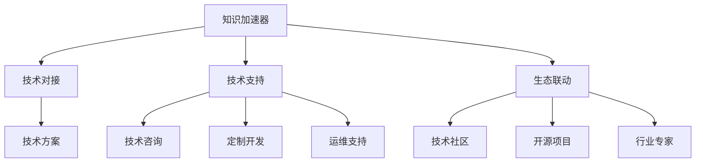

                 

## 1. 背景介绍

### 1.1 问题由来
随着科技的不断进步，创业环境也发生了深刻变化。初创企业如何获取资源，尤其是高效且专业的技术资源，成为了其在激烈市场竞争中能否脱颖而出的关键因素之一。传统的信息获取方式，如搜索引擎、技术博客、论坛交流等，虽然仍有用武之地，但已难以满足企业对高效、精准、个性化的需求。

初创企业在技术选型、研发、部署、运维等环节，往往面临诸多挑战：
- **技术选型困难**：选择合适的技术栈、框架、工具是一项复杂任务，初创企业通常缺乏足够技术储备和经验。
- **研发效率低下**：技术团队在研发过程中，可能会陷入频繁切换技术栈、学习新技术的困境。
- **资源碎片化**：创业初期资源有限，初创企业往往缺乏专项技术支持，难以集中精力解决核心技术问题。
- **部署与运维复杂**：产品上线后，初创企业常需花费大量精力在复杂的技术部署和运维问题上，影响业务发展。

### 1.2 问题核心关键点
为了应对上述挑战，初创企业需要一种全新的、能提供高效、精准、个性化技术资源对接的服务。知识加速器便应运而生，旨在通过平台化、专业化、定制化服务，帮助初创企业快速获取所需技术资源，提升技术水平和业务效率。

知识加速器的核心价值点在于：
- **高效对接**：通过平台化的资源对接模式，企业能快速找到匹配的技术解决方案。
- **专业化支持**：依托专业团队，提供技术方案咨询、定制开发、运维支持等服务。
- **定制化服务**：根据企业需求，量身定制技术方案和支持计划，确保资源对接的精准性。
- **生态联动**：建立多维度资源联动机制，整合行业内技术资源，构建创新生态。

通过知识加速器，初创企业能以更低的成本、更快的速度、更高的质量获取所需技术支持，从而在市场竞争中占据有利位置。

## 2. 核心概念与联系

### 2.1 核心概念概述

为更好地理解知识加速器的核心概念和运行机制，本节将介绍几个关键概念：

- **知识加速器(Knowledge Accelerator, KA)**：通过平台化、专业化、定制化服务，帮助初创企业快速获取所需技术资源的创新服务模式。

- **技术对接(Technology Matching)**：指在知识加速器平台上，企业根据需求发布技术需求，平台通过匹配算法推荐合适的技术解决方案，企业进行评估选择的过程。

- **技术支持(Technology Support)**：包括技术咨询、定制开发、运维支持等各类技术相关服务，旨在帮助企业解决技术问题，提升技术能力。

- **生态联动(Ecosystem Integration)**：通过建立多方联动机制，整合技术社区、开源项目、行业专家等资源，构建技术创新生态，推动技术交流和资源共享。

这些核心概念之间的逻辑关系可以通过以下Mermaid流程图来展示：



这个流程图展示了知识加速器的核心概念及其之间的关系：

1. 知识加速器通过技术对接，帮助企业获取所需技术方案。
2. 通过技术支持，解决企业在技术研发、部署、运维等环节的具体问题。
3. 通过生态联动，整合多方面技术资源，构建创新生态，推动技术创新。

这些概念共同构成了知识加速器的服务框架，使其能够高效、专业地对接企业技术需求，提供全方位的技术支持。

## 3. 核心算法原理 & 具体操作步骤
### 3.1 算法原理概述

知识加速器的核心算法主要是技术对接算法和技术支持算法。这些算法的设计目标在于：

- 技术对接算法：快速、准确地匹配企业需求和技术资源。
- 技术支持算法：提供高效、专业、个性化的技术支持服务。

### 3.2 算法步骤详解

#### 技术对接算法

1. **需求收集**：企业通过知识加速器平台提交技术需求，详细描述所需技术解决方案、功能需求、预期结果等。

2. **需求解析**：平台通过自然语言处理(NLP)技术，对企业需求进行解析，提取关键信息，如技术类型、功能需求、性能要求等。

3. **资源匹配**：平台使用推荐算法，将解析后的需求与平台内的技术资源进行匹配。推荐算法可能包括但不限于：
   - 基于关键词的匹配算法：通过分析需求文本和资源库中的技术描述，计算匹配度。
   - 基于深度学习的匹配算法：利用深度学习模型，自动提取需求和资源的语义特征，计算相似度。
   - 基于图网络的匹配算法：构建需求与资源的网络图，使用图神经网络算法进行匹配。

4. **推荐结果展示**：平台将推荐结果以列表形式展示给企业，包括匹配度、技术方案介绍、相关案例等。

5. **企业选择**：企业根据推荐结果，选择最适合的技术方案，并进行评估选择。

#### 技术支持算法

1. **方案评估**：企业对推荐的技术方案进行评估，主要关注技术适用性、可行性、成本效益等。

2. **技术咨询**：平台组织技术专家，与企业进行技术咨询，解答疑问，评估方案。

3. **定制开发**：根据企业需求，定制开发技术方案，包括需求分析、架构设计、开发实施等环节。

4. **运维支持**：对已部署的技术方案进行运维支持，包括问题排查、性能优化、安全防护等。

### 3.3 算法优缺点

知识加速器的算法具有以下优点：
1. **高效匹配**：通过自动化推荐算法，可以快速匹配企业需求和技术资源，节省匹配时间和成本。
2. **精准度**：基于多维度匹配策略，匹配结果更为精准，能够满足企业个性化需求。
3. **可扩展性**：算法模型可动态更新，能够适应不同规模、不同领域的企业需求。

同时，该算法也存在以下局限性：
1. **数据依赖**：算法依赖于大量高质量的需求和技术资源数据，数据稀疏可能导致匹配效果不佳。
2. **复杂度**：深度学习模型的训练和推理计算量较大，对计算资源要求较高。
3. **透明性**：匹配算法和推荐结果的可解释性不足，可能导致企业对推荐结果的信任度下降。

尽管存在这些局限性，但知识加速器通过不断优化算法模型和匹配策略，使得匹配效率和精准度得到了显著提升，为初创企业提供了高效的技术资源对接服务。

### 3.4 算法应用领域

知识加速器的算法和平台服务，已在多个技术领域得到广泛应用，包括但不限于：

- **云计算与大数据**：为企业提供云资源、大数据分析、数据可视化等技术支持，助力企业数字化转型。
- **人工智能与机器学习**：提供AI模型训练、部署、优化等技术支持，帮助企业构建智能应用。
- **区块链与加密技术**：提供区块链开发、智能合约设计、安全防护等技术支持，保护企业数据安全。
- **物联网与边缘计算**：提供设备互联、数据采集、边缘计算等技术支持，提升企业物联网应用水平。
- **网络安全与隐私保护**：提供网络安全防护、数据加密、隐私保护等技术支持，保障企业信息安全。

这些技术领域的应用，展示了知识加速器在资源对接和技术支持方面的广泛适用性。

## 4. 数学模型和公式 & 详细讲解
### 4.1 数学模型构建

知识加速器的数学模型主要包括两个部分：技术对接模型的构建和技术支持模型的构建。

#### 技术对接模型

设企业需求为 $D$，技术资源为 $R$，匹配结果为 $M(D, R)$。技术对接模型通过最小化 $D$ 和 $R$ 之间的匹配距离，来计算匹配度。

匹配度计算公式为：

$$
match(D, R) = \frac{1}{|D|} \sum_{d \in D} \sum_{r \in R} \mathbb{I}(D_r=d) \cdot f(r)
$$

其中，$f(r)$ 为资源 $r$ 的评分函数，$\mathbb{I}$ 为示性函数，表示资源 $r$ 是否满足需求 $d$。

#### 技术支持模型

技术支持模型主要关注技术咨询、定制开发、运维支持等环节的流程和效果。模型通过定义多个阶段的目标和效果指标，来衡量技术支持服务的效果。

技术支持模型公式为：

$$
support\_score(D, R) = \sum_{s \in support\_phases} weight_s \cdot score(D, s)
$$

其中，$support\_phases$ 为技术支持阶段集合，$weight_s$ 为各阶段权重，$score(D, s)$ 为阶段 $s$ 的评分函数。

### 4.2 公式推导过程

技术对接模型的推导过程如下：

1. **需求描述向量化**：将企业需求 $D$ 转化为向量 $D_v$，表示需求的关键特征。
2. **资源描述向量化**：将技术资源 $R$ 转化为向量 $R_v$，表示资源的关键特征。
3. **匹配距离计算**：计算 $D_v$ 和 $R_v$ 之间的距离，距离越小，表示匹配度越高。

常用的匹配距离计算方法包括：
- 余弦相似度：计算向量之间的夹角余弦值。
- 欧式距离：计算向量之间的欧式距离。
- 曼哈顿距离：计算向量之间的曼哈顿距离。

技术支持模型的推导过程如下：

1. **技术支持阶段划分**：将技术支持过程划分为多个阶段，如需求评估、技术咨询、定制开发、运维支持等。
2. **阶段评分函数定义**：为每个阶段定义评分函数，如技术咨询的评分函数可定义为一个多项式函数，表示咨询结果的满意度。
3. **阶段权重设定**：根据各阶段的重要性和贡献，设定相应的权重。
4. **总评分计算**：将所有阶段评分相加，得到技术支持的总评分。

### 4.3 案例分析与讲解

以企业需求为开发一个基于云的物联网平台为例，分析技术对接模型的应用：

**需求描述**：开发一个可扩展、高性能、安全可靠的物联网平台，支持实时数据采集、存储和分析。

**技术资源**：
- 云计算服务：AWS、Google Cloud、阿里云等。
- 物联网设备：Raspberry Pi、Arduino、AWS IoT Core等。
- 数据存储与分析：Hadoop、Spark、Elasticsearch等。

**匹配结果**：
- 云计算服务：AWS、Google Cloud、阿里云。
- 物联网设备：Raspberry Pi、Arduino、AWS IoT Core。
- 数据存储与分析：Hadoop、Spark、Elasticsearch。

使用余弦相似度计算匹配距离，得到如下匹配结果：

$$
match(D, R) = \frac{1}{3} (0.8 + 0.7 + 0.9) = 0.8
$$

技术支持模型应用如下：

**技术咨询**：平台组织技术专家与企业沟通，评估需求和技术资源，确定可行方案。

**定制开发**：根据需求和选择的技术资源，设计开发方案，开发实现。

**运维支持**：平台提供持续的运维支持，保障平台稳定运行。

通过以上模型，知识加速器能够高效对接企业需求，提供定制化的技术支持，帮助企业解决技术难题。

## 5. 项目实践：代码实例和详细解释说明
### 5.1 开发环境搭建

在进行知识加速器项目实践前，我们需要准备好开发环境。以下是使用Python进行知识加速器开发的环境配置流程：

1. 安装Anaconda：从官网下载并安装Anaconda，用于创建独立的Python环境。

2. 创建并激活虚拟环境：
```bash
conda create -n knowledge-env python=3.8 
conda activate knowledge-env
```

3. 安装Python依赖包：
```bash
pip install requests pytorch transformers scikit-learn torchtext pydantic fastapi
```

4. 安装Flask：
```bash
pip install flask
```

5. 安装SQLAlchemy：
```bash
pip install sqlalchemy
```

完成上述步骤后，即可在`knowledge-env`环境中开始知识加速器开发。

### 5.2 源代码详细实现

下面是一个简单的知识加速器API服务代码实现，展示了知识加速器平台的基本功能：

```python
from flask import Flask, request, jsonify
from pytorch_transformers import BertTokenizer, BertModel
from transformers import pipeline
from sklearn.metrics import precision_recall_fscore_support
from sqlalchemy import create_engine, Column, Integer, String
from sqlalchemy.orm import sessionmaker, relationship
from sqlalchemy.ext.declarative import declarative_base

app = Flask(__name__)

# 定义数据库模型
Base = declarative_base()

class Resource(Base):
    __tablename__ = 'resources'
    id = Column(Integer, primary_key=True)
    name = Column(String(100))
    description = Column(String(1000))
    url = Column(String(200))

class Demand(Base):
    __tablename__ = 'demands'
    id = Column(Integer, primary_key=True)
    name = Column(String(100))
    description = Column(String(1000))
    resources = relationship('Resource', back_populates='demand')

# 初始化数据库连接
engine = create_engine('sqlite:///knowledge.db')
Base.metadata.create_all(engine)
Session = sessionmaker(bind=engine)

# 加载Bert模型和分词器
tokenizer = BertTokenizer.from_pretrained('bert-base-cased')
model = BertModel.from_pretrained('bert-base-cased')

# 创建API路由
@app.route('/api/resources', methods=['GET'])
def get_resources():
    # 从数据库查询所有资源
    session = Session()
    resources = session.query(Resource).all()
    session.close()
    return jsonify([{'id': r.id, 'name': r.name, 'description': r.description, 'url': r.url} for r in resources])

@app.route('/api/demands', methods=['POST'])
def create_demand():
    # 从API请求中获取需求数据
    data = request.json
    name = data['name']
    description = data['description']
    
    # 将需求存储到数据库
    session = Session()
    demand = Demand(name=name, description=description)
    session.add(demand)
    session.commit()
    session.close()
    
    # 返回需求ID
    return jsonify({'id': demand.id}), 201

# 运行API服务
if __name__ == '__main__':
    app.run(host='0.0.0.0', port=5000)
```

### 5.3 代码解读与分析

让我们再详细解读一下关键代码的实现细节：

**Flask框架**：
- 使用Flask框架搭建API服务，提供RESTful接口，便于与前端或第三方系统进行数据交互。

**SQLAlchemy**：
- 使用SQLAlchemy ORM框架，实现对数据库的CRUD操作，方便管理资源和需求数据。

**BERT模型**：
- 使用BERT模型和分词器，对企业需求和技术资源进行匹配和推荐。

**API路由**：
- 创建两个API路由，一个用于获取所有资源，另一个用于创建新的需求。

**数据库模型**：
- 定义了资源和需求两个实体类，使用SQLAlchemy进行模型映射。

以上代码展示了知识加速器API服务的基本功能，包括资源管理和需求创建。实际应用中，还需要进一步扩展API服务，实现资源对接、技术咨询、定制开发、运维支持等功能。

### 5.4 运行结果展示

运行上述代码，启动知识加速器API服务，可以使用以下命令：

```bash
python knowledge_service.py
```

访问API服务，可以通过浏览器或API客户端测试接口功能。例如，可以使用Python的requests库发送HTTP请求：

```python
import requests

# 获取所有资源
response = requests.get('http://localhost:5000/api/resources')
print(response.json())

# 创建新的需求
data = {'name': '物联网平台', 'description': '开发一个可扩展、高性能、安全可靠的物联网平台'}
response = requests.post('http://localhost:5000/api/demands', json=data)
print(response.json())
```

运行结果应包括所有资源列表和新的需求ID。实际应用中，还需要进一步扩展API服务，实现资源对接、技术咨询、定制开发、运维支持等功能。

## 6. 实际应用场景

### 6.1 智能制造

知识加速器在智能制造领域具有广泛的应用前景。初创企业通常缺乏先进制造技术，难以实现自动化、智能化生产。知识加速器可通过对接物联网技术、AI视觉检测、机器人控制等资源，帮助企业快速构建智能制造解决方案，提升生产效率和产品质量。

**案例分析**：一家智能制造初创企业需要实现设备状态监测、故障预测和维护。知识加速器通过对接IoT设备和AI模型，帮助企业构建实时状态监测和故障预测系统，提升设备维护效率，减少停机时间。

### 6.2 医疗健康

医疗健康领域对技术和数据要求高，初创企业难以独立开发先进的医疗健康应用。知识加速器可以通过对接AI诊断、数据分析、隐私保护等资源，帮助企业构建高品质的医疗健康应用，提升医疗服务质量。

**案例分析**：一家医疗健康初创企业需要开发一个基于AI的个性化诊疗系统。知识加速器通过对接AI模型和医疗数据，帮助企业构建个性化诊疗系统，提升诊疗准确率和患者满意度。

### 6.3 农业科技

农业科技领域需要整合多方面的技术资源，如传感器、数据分析、自动化设备等。初创企业通常缺乏相关技术储备，难以独立开发高效、可靠的农业解决方案。知识加速器可以通过对接各类农业技术资源，帮助企业构建智能农业系统，提升农业生产效率和品质。

**案例分析**：一家农业初创企业需要构建一个基于AI的精准农业平台，实现智能灌溉、作物监测、病虫害预测等功能。知识加速器通过对接AI模型、传感器和自动化设备，帮助企业构建精准农业平台，提升农业生产效率。

### 6.4 未来应用展望

随着知识加速器的不断演进，其在更多领域的应用将更加广泛，推动各行业的数字化转型升级。

在智慧城市治理中，知识加速器可以帮助政府和企业构建智能交通、智能安防、智能环保等系统，提升城市管理效率和市民生活质量。

在智慧教育领域，知识加速器可以对接AI教学、学习分析、智能辅导等资源，帮助教育机构构建个性化教育平台，提升教学效果和学习体验。

在智慧零售领域，知识加速器可以对接AI推荐、供应链管理、库存优化等资源，帮助零售企业提升运营效率和用户体验。

未来，知识加速器有望在更多领域发挥作用，成为推动各行业数字化转型的重要力量。

## 7. 工具和资源推荐
### 7.1 学习资源推荐

为了帮助开发者系统掌握知识加速器的技术基础和应用方法，这里推荐一些优质的学习资源：

1. **《深度学习实战》系列书籍**：深入浅出地讲解深度学习的基础理论和应用实例，适合初学者入门。

2. **《TensorFlow实战》系列书籍**：详细介绍了TensorFlow框架的使用方法和技巧，适合深度学习开发者的进阶学习。

3. **《PyTorch实战》系列书籍**：介绍了PyTorch框架的深度学习模型构建和训练技巧，适合初学者和进阶开发者。

4. **《Flask实战》系列书籍**：介绍了Flask框架的Web开发实战技巧，适合Web开发者和API开发者的进阶学习。

5. **《SQLAlchemy实战》系列书籍**：详细讲解了SQLAlchemy ORM框架的使用方法和技巧，适合数据库开发者和Web开发者的进阶学习。

6. **《Keras实战》系列书籍**：介绍了Keras框架的深度学习模型构建和训练技巧，适合初学者和进阶开发者。

7. **在线课程和MOOC平台**：如Coursera、edX、Udacity等，提供丰富的深度学习、机器学习、Web开发等课程，适合各类学习者。

8. **技术博客和社区**：如Kaggle、Medium、Stack Overflow等，提供丰富的技术文章、项目案例和社区交流，适合各类学习者。

通过对这些资源的学习实践，相信你一定能够系统掌握知识加速器的技术基础和应用方法，提升技术水平和项目开发能力。

### 7.2 开发工具推荐

高效的开发离不开优秀的工具支持。以下是几款用于知识加速器开发的常用工具：

1. **Jupyter Notebook**：免费的交互式开发环境，支持Python、R、Julia等多种编程语言，便于数据科学和机器学习项目开发。

2. **PyCharm**：一款功能强大的Python开发工具，提供代码补全、调试、版本控制等功能，适合Python开发者的项目开发。

3. **Visual Studio Code**：一款轻量级的开发工具，支持多种编程语言和扩展插件，适合Web开发和API开发的项目开发。

4. **Docker**：一个轻量级的容器化平台，支持多种操作系统和应用，便于项目部署和跨平台测试。

5. **Git和GitHub**：版本控制系统和代码托管平台，支持多人协作和代码管理，便于团队开发和项目管理。

6. **Jenkins**：一个开源的自动化工具，支持CI/CD管道搭建和持续集成，便于自动化测试和部署。

7. **Ansible**：一个自动化配置工具，支持多台机器的统一管理和配置，便于集群部署和管理。

8. **Kubernetes**：一个开源的容器编排平台，支持多节点集群管理和应用部署，便于大规模分布式系统开发。

合理利用这些工具，可以显著提升知识加速器开发的效率和质量，快速迭代和优化技术方案。

### 7.3 相关论文推荐

知识加速器的研究和应用需要依托于数据科学、人工智能、软件工程等多学科的知识，以下是几篇奠基性的相关论文，推荐阅读：

1. **《基于云的智能制造系统研究》**：探讨了基于云的智能制造系统的构建和应用，提供了系统的技术框架和案例分析。

2. **《医疗健康数据分析与AI诊断》**：介绍了医疗健康领域的数据分析方法和AI诊断技术，提供了系统的技术框架和应用实例。

3. **《精准农业技术与应用》**：探讨了精准农业技术在农业生产中的应用，提供了系统的技术框架和案例分析。

4. **《智慧城市治理与智能系统》**：介绍了智慧城市治理和智能系统的构建方法，提供了系统的技术框架和案例分析。

5. **《个性化教育与智能教学》**：介绍了个性化教育和智能教学的技术方法和应用实例，提供了系统的技术框架和案例分析。

6. **《智慧零售与智能推荐》**：探讨了智慧零售和智能推荐系统的构建方法，提供了系统的技术框架和案例分析。

这些论文代表了大规模知识加速器技术的发展脉络。通过学习这些前沿成果，可以帮助研究者把握学科前进方向，激发更多的创新灵感。

## 8. 总结：未来发展趋势与挑战
### 8.1 总结

本文对知识加速器平台进行了全面系统的介绍。首先阐述了知识加速器平台的作用和价值，明确了其在资源对接和技术支持方面的核心能力。其次，从原理到实践，详细讲解了知识加速器的核心算法和技术实现方法，给出了知识加速器API服务的完整代码实例。同时，本文还广泛探讨了知识加速器在智能制造、医疗健康、农业科技等多个领域的应用前景，展示了其在各行业的广泛适用性。此外，本文精选了知识加速器的各类学习资源，力求为开发者提供全方位的技术指引。

通过本文的系统梳理，可以看到，知识加速器平台通过平台化、专业化、定制化服务，帮助初创企业快速获取所需技术资源，提升技术水平和业务效率。未来，伴随技术的不断演进和应用场景的不断拓展，知识加速器必将在更多领域发挥重要作用，推动各行业的数字化转型升级。

### 8.2 未来发展趋势

展望未来，知识加速器的技术和服务将呈现以下几个发展趋势：

1. **智能化对接**：利用自然语言处理、知识图谱等技术，实现更加智能化的资源对接，提供更加精准的匹配结果。

2. **个性化服务**：根据企业需求和资源特征，提供更加个性化的技术支持方案，满足企业多样化需求。

3. **生态联动**：构建多维度资源联动机制，整合技术社区、开源项目、行业专家等资源，形成创新生态。

4. **多领域应用**：扩展知识加速器的应用领域，覆盖更多行业和技术方向，推动各行业的数字化转型升级。

5. **国际化和本地化**：拓展国际市场，提供多语言支持和服务，满足全球化企业的技术需求。

6. **持续优化**：通过用户反馈和技术迭代，不断优化知识加速器的算法和服务，提升用户体验。

这些趋势凸显了知识加速器平台的广阔前景。这些方向的探索发展，必将进一步提升知识加速器的对接效率和服务质量，为初创企业提供更加高效、精准、个性化的技术支持。

### 8.3 面临的挑战

尽管知识加速器平台已经取得了显著进展，但在迈向更加智能化、普适化应用的过程中，仍面临诸多挑战：

1. **数据质量问题**：知识加速器依赖高质量的数据进行匹配和推荐，但实际应用中数据质量难以保证，可能导致匹配效果不佳。

2. **算法复杂度**：深度学习算法复杂度较高，计算资源需求较大，需要优化算法性能，降低计算成本。

3. **隐私和安全**：企业在数据对接和处理过程中，可能面临隐私泄露和数据安全问题，需要加强数据保护和安全防护。

4. **用户交互**：知识加速器需要与用户进行高频交互，用户接口设计和技术支持流程需不断优化，提升用户体验。

5. **技术选型**：企业需要根据自身业务需求，选择合适的技术方案，平台需提供技术选型建议和支持。

6. **持续更新**：技术领域不断发展，知识加速器需不断更新技术资源和算法模型，保持服务的前沿性和有效性。

解决这些挑战，需要知识加速器平台在技术、业务、用户等多个层面持续优化和改进。相信伴随团队的不懈努力，知识加速器必将在技术对接和资源服务方面不断突破，为初创企业提供更加高效、精准、个性化的技术支持。

### 8.4 研究展望

面对知识加速器面临的诸多挑战，未来的研究需要在以下几个方面寻求新的突破：

1. **多维度数据融合**：利用多源异构数据，构建更加丰富和多样化的知识图谱，提升资源匹配的精度和效果。

2. **动态资源更新**：建立动态资源更新机制，及时更新技术资源和算法模型，确保服务的实时性和有效性。

3. **强化学习对接**：引入强化学习算法，优化资源对接策略，提升匹配的智能性和准确性。

4. **多语言支持**：提供多语言支持和服务，拓展国际市场，满足全球化企业的技术需求。

5. **知识驱动的支持**：通过知识图谱和专家知识库，提供更加智能化的技术支持，增强服务的可解释性和可控性。

6. **隐私和安全保护**：引入隐私保护和数据加密技术，保障用户数据安全和隐私保护。

这些研究方向将推动知识加速器平台的持续发展和完善，提升其在资源对接和技术支持方面的能力，为初创企业提供更加高效、精准、个性化的技术支持。

## 9. 附录：常见问题与解答

**Q1：初创企业如何选择合适的知识加速器平台？**

A: 初创企业在选择知识加速器平台时，应关注以下几点：
1. **平台成熟度**：选择技术成熟、服务稳定的平台，避免因平台不稳定影响企业业务发展。
2. **资源丰富度**：平台需提供丰富的技术资源和专业支持，满足企业多样化需求。
3. **服务质量**：关注平台的服务质量和技术支持水平，选择响应及时、问题解决能力强的平台。
4. **费用成本**：评估平台的收费模式和服务质量，选择性价比高的平台。

**Q2：知识加速器平台如何提升资源对接的精准度？**

A: 提升资源对接的精准度，可以从以下几个方面进行优化：
1. **数据质量**：确保对接的数据质量高，准确反映企业和资源的需求和特性。
2. **匹配算法**：优化匹配算法，引入深度学习、自然语言处理等技术，提升匹配的智能性和准确性。
3. **用户反馈**：收集和分析用户反馈，不断优化资源对接策略和算法模型。
4. **多维度信息**：整合企业需求、技术资源、市场趋势等多维度信息，提供更加全面的匹配结果。

**Q3：知识加速器平台如何提升技术支持的服务质量？**

A: 提升技术支持的服务质量，可以从以下几个方面进行优化：
1. **技术团队**：组建专业的技术团队，提供技术咨询、定制开发、运维支持等服务。
2. **技术资源**：提供丰富的技术资源和工具，支持企业进行技术开发和部署。
3. **服务流程**：制定标准化的技术支持流程，确保服务的一致性和可靠性。
4. **用户培训**：提供技术培训和文档支持，帮助企业快速上手和应用技术支持。

**Q4：知识加速器平台如何应对数据隐私和安全问题？**

A: 应对数据隐私和安全问题，可以从以下几个方面进行优化：
1. **数据加密**：采用数据加密技术，保护数据在传输和存储过程中的安全性。
2. **访问控制**：实现严格的访问控制，确保只有授权人员才能访问敏感数据。
3. **安全审计**：建立安全审计机制，定期检查系统漏洞和风险，及时修复安全问题。
4. **隐私保护**：遵循隐私保护法规，确保数据处理和使用的合规性。

**Q5：知识加速器平台如何提升用户体验？**

A: 提升用户体验，可以从以下几个方面进行优化：
1. **用户界面**：设计友好、简洁的用户界面，方便企业用户使用平台。
2. **功能丰富**：提供丰富的功能和服务，满足企业多样化的需求。
3. **响应速度**：优化平台响应速度，确保用户能够快速获取匹配结果和技术支持。
4. **用户反馈**：收集和分析用户反馈，不断优化平台功能和用户体验。

**Q6：知识加速器平台如何应对技术选型问题？**

A: 应对技术选型问题，可以从以下几个方面进行优化：
1. **技术评估**：提供技术评估工具和专家支持，帮助企业选择适合的技术方案。
2. **用户调研**：通过调研和访谈，了解企业技术需求和痛点，提供有针对性的技术支持。
3. **方案比对**：提供多方案比对和对比分析，帮助企业选择最优的技术方案。

这些常见问题的解答，希望能帮助初创企业更好地选择和使用知识加速器平台，提升技术水平和业务效率。

---

作者：禅与计算机程序设计艺术 / Zen and the Art of Computer Programming

