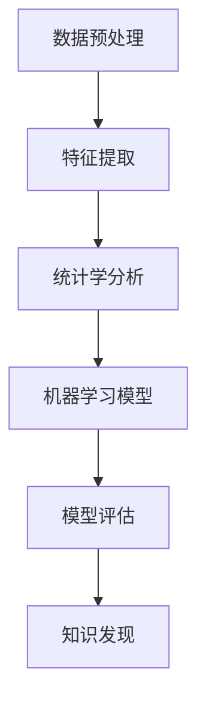

                 

# 知识发现引擎与人类学习方式的革新

## 1. 背景介绍

### 1.1 问题由来
人类学习的方式一直在不断进化。从最早的口耳相传，到文字的发明，再到电子信息时代的崛起，每一次技术变革都极大地改变了人们获取知识和信息的方式。然而，随着信息量的爆炸式增长，如何有效地从海量数据中提取出有用的知识，成为了一个巨大挑战。这一挑战催生了知识发现引擎(Knowledge Discovery Engine, KDE)的诞生，一种旨在自动挖掘数据中知识的技术。

### 1.2 问题核心关键点
知识发现引擎是一种通过分析、处理数据，自动提取出有价值信息的技术。它通常基于统计学、机器学习、数据挖掘等方法，帮助用户从复杂的数据集中找到有用的知识模式和规律。近年来，随着人工智能和大数据技术的快速发展，知识发现引擎在商业、科研、医疗等领域得到了广泛应用，极大地提升了人类获取和利用知识的能力。

### 1.3 问题研究意义
研究知识发现引擎，对于提升人类学习和决策能力，推动知识驱动的经济发展，具有重要意义：

1. 提升学习效率。知识发现引擎可以快速从数据中挖掘出有价值的信息，帮助用户迅速掌握新知识，从而提高学习效率。
2. 辅助决策支持。通过分析大量数据，知识发现引擎可以提供科学、客观的决策依据，帮助企业、政府和社会各界做出更合理的决策。
3. 促进科学研究。在科学研究中，知识发现引擎可以自动挖掘数据中的新知识，为科学家提供更多研究视角和数据支持。
4. 改善医疗保健。在医疗领域，知识发现引擎可以分析病历、基因数据等，发现新的治疗方法和疾病预防策略，提升医疗水平。

## 2. 核心概念与联系

### 2.1 核心概念概述

为更好地理解知识发现引擎，本节将介绍几个密切相关的核心概念：

- 知识发现引擎(Knowledge Discovery Engine, KDE)：通过分析、处理数据，自动提取出有价值信息的技术。
- 数据挖掘(Data Mining)：从大量数据中自动提取有用知识和模式的过程。
- 统计学(Statistics)：通过收集、分析数据，推断总体特征和规律的方法。
- 机器学习(Machine Learning)：通过学习数据规律，自动构建模型，进行预测和决策的技术。
- 数据预处理(Preprocessing)：清洗、转换原始数据，以便于后续的分析和建模。
- 特征提取(Feature Extraction)：从原始数据中提取出有助于模型训练和预测的特征。
- 模型评估(Model Evaluation)：通过指标评估模型性能，如准确率、召回率、F1分数等。

这些核心概念之间的逻辑关系可以通过以下Mermaid流程图来展示：



这个流程图展示了几者之间的关系：

1. 数据预处理是对原始数据进行清洗、转换的过程，为后续分析奠定基础。
2. 特征提取是从预处理后的数据中提取出有用的特征，供模型训练使用。
3. 统计学分析通过计算数据的统计特征，发现数据中的模式和趋势。
4. 机器学习模型基于统计特征和特征提取结果，构建预测模型。
5. 模型评估对训练好的模型进行性能测试，确定其准确性和可靠性。
6. 知识发现是最终的目标，即通过机器学习模型提取出有价值的知识。

这些概念共同构成了知识发现引擎的基本框架，使得其能够自动地从数据中发现知识，辅助人类学习和决策。

## 3. 核心算法原理 & 具体操作步骤

### 3.1 算法原理概述

知识发现引擎的算法原理基于数据挖掘和机器学习技术。其核心思想是：通过分析数据集，提取统计特征，利用机器学习模型自动发现数据中的规律和知识，并以结构化或可视化形式呈现给用户。

通常，知识发现引擎包括以下几个关键步骤：

1. 数据预处理：清洗、转换原始数据，去除噪声和缺失值。
2. 特征提取：从预处理后的数据中提取出有用的特征，供模型训练使用。
3. 模型训练：基于特征提取结果，选择合适的机器学习模型进行训练。
4. 模型评估：使用测试集对训练好的模型进行性能评估，确定其准确性和可靠性。
5. 知识发现：根据模型评估结果，提取和呈现数据中的知识模式和规律。

### 3.2 算法步骤详解

#### 3.2.1 数据预处理

数据预处理是知识发现引擎的第一步，旨在清洗和转换原始数据，以便于后续分析和建模。预处理通常包括以下几个环节：

- 数据清洗：删除重复记录、处理缺失值、去除噪声数据等。
- 数据转换：将数据转换为可供模型训练的格式，如数值化处理、归一化等。
- 数据集成：将多个数据源中的数据合并为一个统一的数据集。

##### 案例分析
假设有一个包含学生成绩的数据集，数据集中有姓名、年龄、性别、数学成绩、语文成绩等多个字段。预处理步骤如下：

1. 删除重复记录，保留每个学生唯一的记录。
2. 处理缺失值，对数学成绩和语文成绩中缺失的值进行填充。
3. 将性别字段转换为数值型特征，将“男”表示为1，“女”表示为0。
4. 对数据进行归一化处理，将成绩转换为标准化的数值。
5. 将不同数据源中的数据进行集成，合并为一个完整的数据集。

#### 3.2.2 特征提取

特征提取是知识发现引擎的第二个关键步骤，旨在从预处理后的数据中提取出有用的特征，供模型训练使用。常用的特征提取方法包括：

- 数值特征：提取数值型特征，如数学成绩、语文成绩等。
- 分类特征：提取分类特征，如性别、班级等。
- 文本特征：提取文本型特征，如姓名、描述等。
- 时间特征：提取时间型特征，如日期、时间等。

##### 案例分析
对于上述学生成绩数据集，可以提取以下特征：

- 数值特征：数学成绩、语文成绩。
- 分类特征：性别、班级。
- 文本特征：姓名、描述。
- 时间特征：入学日期、考试日期。

#### 3.2.3 模型训练

模型训练是知识发现引擎的核心步骤，旨在通过训练机器学习模型，自动发现数据中的规律和知识。常用的机器学习模型包括：

- 回归模型：用于预测连续型变量的模型，如线性回归、决策树回归等。
- 分类模型：用于预测分类变量的模型，如逻辑回归、支持向量机等。
- 聚类模型：用于将数据分为不同类别的模型，如K-means聚类、层次聚类等。
- 关联规则模型：用于发现数据中的关联关系，如Apriori算法、FP-growth算法等。

##### 案例分析
对于上述学生成绩数据集，可以使用以下模型进行训练：

- 回归模型：预测学生的平均成绩。
- 分类模型：预测学生是否通过考试。
- 聚类模型：将学生分为不同学习小组。
- 关联规则模型：发现数学成绩和语文成绩之间的关系。

#### 3.2.4 模型评估

模型评估是知识发现引擎的重要环节，旨在通过测试集对训练好的模型进行性能评估，确定其准确性和可靠性。常用的模型评估指标包括：

- 准确率：模型预测正确的样本数占总样本数的比例。
- 召回率：模型预测为正样本且实际为正样本的样本数占实际正样本数的比例。
- F1分数：准确率和召回率的调和平均数。
- AUC曲线：ROC曲线下的面积，用于评估二分类模型的性能。

##### 案例分析
对于上述学生成绩数据集，可以使用以下模型评估指标：

- 准确率：预测学生是否通过考试。
- 召回率：预测学生是否通过考试的准确率。
- F1分数：评估分类模型的性能。
- AUC曲线：评估分类模型的性能。

#### 3.2.5 知识发现

知识发现是知识发现引擎的最终目标，即通过机器学习模型提取出有价值的知识模式和规律。常用的知识发现方法包括：

- 关联规则：发现数据中的关联关系，如Apriori算法、FP-growth算法等。
- 聚类分析：将数据分为不同类别，如K-means聚类、层次聚类等。
- 时间序列分析：分析时间序列数据中的趋势和周期性，如ARIMA模型等。
- 神经网络模型：用于处理复杂数据，发现更深层次的知识模式，如CNN、RNN等。

##### 案例分析
对于上述学生成绩数据集，可以使用以下知识发现方法：

- 关联规则：发现数学成绩和语文成绩之间的关系。
- 聚类分析：将学生分为不同学习小组。
- 时间序列分析：分析数学成绩和语文成绩的时间趋势。
- 神经网络模型：预测学生的未来成绩。

### 3.3 算法优缺点

知识发现引擎具有以下优点：

1. 高效自动化。通过机器学习算法自动发现数据中的规律和知识，减少了人工干预和计算量。
2. 数据驱动。通过分析大量数据，提取有价值的信息，辅助决策和分析。
3. 动态更新。随着数据量的增加，知识发现引擎可以动态更新模型，不断发现新的知识模式和规律。
4. 可解释性。通过可视化技术，将知识发现结果呈现给用户，便于理解和分析。

同时，知识发现引擎也存在一些缺点：

1. 数据依赖。知识发现引擎的效果很大程度上取决于数据的质量和数量，获取高质量数据往往成本较高。
2. 算法复杂。知识发现引擎涉及多种算法，设计和实现较为复杂。
3. 模型解释性不足。一些复杂的模型，如深度学习模型，难以解释其内部工作机制和决策逻辑。
4. 对数据预处理要求高。数据预处理不当可能导致模型训练失败或结果不准确。

尽管存在这些局限性，但就目前而言，知识发现引擎已成为数据挖掘和机器学习领域的重要工具，极大地提升了人类获取和利用知识的能力。

### 3.4 算法应用领域

知识发现引擎的应用领域非常广泛，涵盖商业、科研、医疗、金融等多个领域。以下是几个典型应用场景：

#### 3.4.1 商业智能

商业智能领域是知识发现引擎的重要应用场景。通过分析企业历史数据，知识发现引擎可以发现市场趋势、客户行为、产品需求等，帮助企业制定更科学、合理的商业策略。

- 客户细分：通过聚类分析，将客户分为不同细分市场，制定针对性的营销策略。
- 销售预测：通过回归模型，预测产品销量和市场趋势，辅助库存管理。
- 客户流失预测：通过分类模型，预测客户流失概率，制定挽留策略。

#### 3.4.2 科学研究

科学研究领域需要大量的数据支持，知识发现引擎可以自动挖掘数据中的新知识，为科学家提供更多研究视角和数据支持。

- 基因数据分析：通过分析基因数据，发现基因与疾病之间的关系，辅助疾病治疗和预防。
- 天文数据分析：通过分析天文数据，发现星体运动规律，辅助天文研究。
- 自然语言处理：通过分析文本数据，发现语言模式和规律，辅助语言学研究。

#### 3.4.3 医疗保健

医疗保健领域需要大量的数据支持，知识发现引擎可以分析病历、基因数据等，发现新的治疗方法和疾病预防策略，提升医疗水平。

- 疾病预测：通过分析历史病历数据，预测疾病发生概率，辅助早期诊断和治疗。
- 基因诊断：通过分析基因数据，发现基因突变与疾病之间的关系，辅助基因治疗。
- 临床试验优化：通过分析临床试验数据，优化试验设计和方案，提高试验成功率。

#### 3.4.4 金融领域

金融领域需要大量的数据支持，知识发现引擎可以分析市场数据，发现金融市场趋势和规律，辅助投资决策。

- 风险管理：通过分析历史交易数据，预测市场风险，制定风险控制策略。
- 投资组合优化：通过分析市场数据，优化投资组合，提高投资收益。
- 欺诈检测：通过分析交易数据，发现异常交易行为，辅助反欺诈决策。

## 4. 数学模型和公式 & 详细讲解  
### 4.1 数学模型构建

本节将使用数学语言对知识发现引擎的数学模型进行详细讲解。

假设数据集为 $D=\{(x_i,y_i)\}_{i=1}^N$，其中 $x_i$ 为输入特征，$y_i$ 为输出标签。知识发现引擎的数学模型可以表示为：

$$
y=\theta f(x)
$$

其中 $\theta$ 为模型参数，$f(x)$ 为模型函数，可以表示为线性模型、多项式模型、神经网络模型等。

知识发现引擎的目标是找到最优的模型参数 $\theta$，使得模型函数 $f(x)$ 最小化损失函数 $\mathcal{L}$：

$$
\mathcal{L}(\theta)=\frac{1}{N}\sum_{i=1}^N\ell(y_i,f(x_i;\theta))
$$

其中 $\ell$ 为损失函数，可以表示为均方误差损失、交叉熵损失等。

知识发现引擎的训练过程可以表示为：

$$
\hat{\theta}=\mathop{\arg\min}_{\theta}\mathcal{L}(\theta)
$$

通常使用梯度下降等优化算法，对模型参数 $\theta$ 进行迭代优化，使得损失函数 $\mathcal{L}$ 最小化。

### 4.2 公式推导过程

以下我们以回归模型为例，推导其训练过程的数学公式。

假设回归模型为线性回归模型：

$$
y=\theta^Tx+\epsilon
$$

其中 $\epsilon$ 为随机误差项。

假设训练集为 $D=\{(x_i,y_i)\}_{i=1}^N$，目标是最小化均方误差损失：

$$
\mathcal{L}(\theta)=\frac{1}{N}\sum_{i=1}^N(y_i-\theta^Tx_i)^2
$$

通过求偏导数，可以得到损失函数对参数 $\theta$ 的梯度：

$$
\frac{\partial \mathcal{L}(\theta)}{\partial \theta}=\frac{2}{N}\sum_{i=1}^N(x_iy_i-x_i\bar{y})
$$

其中 $\bar{y}$ 为样本均值。

通过梯度下降算法，更新模型参数：

$$
\theta \leftarrow \theta-\eta \frac{\partial \mathcal{L}(\theta)}{\partial \theta}
$$

其中 $\eta$ 为学习率。

重复以上过程，直到模型收敛，即可得到最优模型参数 $\hat{\theta}$。

### 4.3 案例分析与讲解

假设有一个学生成绩数据集，包含数学成绩、语文成绩和入学时间。我们想要预测学生的总成绩。

首先，我们将数据预处理为数值型特征，如将入学时间转换为数值型特征。然后，使用线性回归模型进行训练，得到模型参数 $\hat{\theta}$：

$$
\hat{\theta}=(\hat{\beta}_0,\hat{\beta}_1,\hat{\beta}_2)
$$

其中 $\hat{\beta}_0$、$\hat{\beta}_1$、$\hat{\beta}_2$ 分别为截距和两个特征的系数。

训练好的模型可以用于预测新学生总成绩，即：

$$
\hat{y}=\hat{\theta}^T x
$$

其中 $x$ 为输入特征。

通过分析训练好的模型参数 $\hat{\theta}$，我们可以发现数学成绩、语文成绩和入学时间对总成绩的影响大小，并根据此结果优化教学策略。

## 5. 项目实践：代码实例和详细解释说明

### 5.1 开发环境搭建

在进行知识发现引擎的开发实践前，我们需要准备好开发环境。以下是使用Python进行Scikit-Learn开发的环境配置流程：

1. 安装Anaconda：从官网下载并安装Anaconda，用于创建独立的Python环境。

2. 创建并激活虚拟环境：
```bash
conda create -n sklearn-env python=3.8 
conda activate sklearn-env
```

3. 安装Scikit-Learn：
```bash
conda install scikit-learn
```

4. 安装各类工具包：
```bash
pip install numpy pandas scikit-learn matplotlib tqdm jupyter notebook ipython
```

完成上述步骤后，即可在`sklearn-env`环境中开始知识发现引擎的开发实践。

### 5.2 源代码详细实现

这里我们以线性回归模型为例，给出使用Scikit-Learn进行知识发现引擎开发的Python代码实现。

首先，导入必要的库和数据集：

```python
from sklearn.datasets import load_boston
from sklearn.linear_model import LinearRegression
from sklearn.model_selection import train_test_split
import numpy as np

# 加载数据集
boston = load_boston()
X = boston.data
y = boston.target
```

然后，将数据集拆分为训练集和测试集：

```python
X_train, X_test, y_train, y_test = train_test_split(X, y, test_size=0.3, random_state=42)
```

接着，定义模型并进行训练：

```python
# 定义线性回归模型
model = LinearRegression()

# 训练模型
model.fit(X_train, y_train)
```

最后，在测试集上评估模型：

```python
# 在测试集上评估模型
y_pred = model.predict(X_test)
from sklearn.metrics import r2_score, mean_squared_error

print('R^2:', r2_score(y_test, y_pred))
print('MSE:', mean_squared_error(y_test, y_pred))
```

以上就是使用Scikit-Learn进行知识发现引擎开发的完整代码实现。可以看到，Scikit-Learn提供了简单易用的接口，可以快速实现常见的机器学习模型。

### 5.3 代码解读与分析

让我们再详细解读一下关键代码的实现细节：

**数据集加载**：
- `load_boston`：从Scikit-Learn内置数据集中加载波士顿房价数据集。
- `X`、`y`：分别为数据集中的特征和标签。

**数据集拆分**：
- `train_test_split`：将数据集拆分为训练集和测试集，测试集占30%。

**模型定义与训练**：
- `LinearRegression`：定义线性回归模型。
- `model.fit(X_train, y_train)`：在训练集上训练模型。

**模型评估**：
- `r2_score`：计算决定系数，评估模型拟合程度。
- `mean_squared_error`：计算均方误差，评估模型预测精度。

可以看到，Scikit-Learn提供了方便易用的接口，使得知识发现引擎的开发变得更加高效和简单。

当然，工业级的系统实现还需考虑更多因素，如模型裁剪、超参数调优、模型封装等。但核心的知识发现引擎的开发范式基本与此类似。

## 6. 实际应用场景

### 6.1 商业智能

商业智能领域是知识发现引擎的重要应用场景。通过分析企业历史数据，知识发现引擎可以发现市场趋势、客户行为、产品需求等，帮助企业制定更科学、合理的商业策略。

- 客户细分：通过聚类分析，将客户分为不同细分市场，制定针对性的营销策略。
- 销售预测：通过回归模型，预测产品销量和市场趋势，辅助库存管理。
- 客户流失预测：通过分类模型，预测客户流失概率，制定挽留策略。

### 6.2 科学研究

科学研究领域需要大量的数据支持，知识发现引擎可以自动挖掘数据中的新知识，为科学家提供更多研究视角和数据支持。

- 基因数据分析：通过分析基因数据，发现基因与疾病之间的关系，辅助疾病治疗和预防。
- 天文数据分析：通过分析天文数据，发现星体运动规律，辅助天文研究。
- 自然语言处理：通过分析文本数据，发现语言模式和规律，辅助语言学研究。

### 6.3 医疗保健

医疗保健领域需要大量的数据支持，知识发现引擎可以分析病历、基因数据等，发现新的治疗方法和疾病预防策略，提升医疗水平。

- 疾病预测：通过分析历史病历数据，预测疾病发生概率，辅助早期诊断和治疗。
- 基因诊断：通过分析基因数据，发现基因突变与疾病之间的关系，辅助基因治疗。
- 临床试验优化：通过分析临床试验数据，优化试验设计和方案，提高试验成功率。

### 6.4 金融领域

金融领域需要大量的数据支持，知识发现引擎可以分析市场数据，发现金融市场趋势和规律，辅助投资决策。

- 风险管理：通过分析历史交易数据，预测市场风险，制定风险控制策略。
- 投资组合优化：通过分析市场数据，优化投资组合，提高投资收益。
- 欺诈检测：通过分析交易数据，发现异常交易行为，辅助反欺诈决策。

## 7. 工具和资源推荐

### 7.1 学习资源推荐

为了帮助开发者系统掌握知识发现引擎的理论基础和实践技巧，这里推荐一些优质的学习资源：

1. 《机器学习》一书：由斯坦福大学Andrew Ng教授撰写，系统介绍了机器学习的基本概念和算法。

2. 《Python数据科学手册》一书：由Jake VanderPlas撰写，介绍了Python在数据科学中的应用，包括数据预处理、特征提取、模型训练等。

3. 《数据挖掘导论》一书：由Amit Porter撰写，介绍了数据挖掘的基本概念和技术。

4. Coursera的机器学习课程：由斯坦福大学Andrew Ng教授开设，提供了丰富的机器学习课程资源和项目实践。

5. Kaggle数据竞赛：全球知名的数据竞赛平台，提供了大量的数据集和竞赛任务，帮助开发者实践机器学习技能。

通过对这些资源的学习实践，相信你一定能够快速掌握知识发现引擎的理论基础和实践技巧，并用于解决实际的机器学习问题。

### 7.2 开发工具推荐

高效的开发离不开优秀的工具支持。以下是几款用于知识发现引擎开发的常用工具：

1. Jupyter Notebook：开源的交互式开发环境，支持Python、R等编程语言，便于编写和调试代码。

2. Matplotlib：数据可视化工具，支持绘制各种图表，便于分析和展示数据。

3. Pandas：数据处理工具，支持数据清洗、转换、分析等操作。

4. Scikit-Learn：机器学习工具库，提供了丰富的机器学习算法和工具，方便实现知识发现引擎。

5. TensorFlow：由Google主导开发的深度学习框架，支持复杂的模型构建和训练，适用于深度学习任务。

6. PyTorch：由Facebook主导开发的深度学习框架，灵活、高效，适用于深度学习任务。

合理利用这些工具，可以显著提升知识发现引擎的开发效率，加快创新迭代的步伐。

### 7.3 相关论文推荐

知识发现引擎的研究源于学界的持续研究。以下是几篇奠基性的相关论文，推荐阅读：

1. "Foundations of Statistical Learning"（统计学习基础）：由Gareth James、Daniela Witten、Trevor Hastie、Robert Tibshirani撰写，系统介绍了统计学习的基本概念和算法。

2. "The Elements of Statistical Learning"（统计学习要素）：由Trevor Hastie、Robert Tibshirani、Jerome Friedman撰写，提供了丰富的统计学习算法和实现。

3. "Data Mining: Concepts and Techniques"（数据挖掘：概念与技术）：由Jianmo Pan、Hang Li撰写，介绍了数据挖掘的基本概念和应用。

4. "Hands-On Data Science with Scikit-Learn, Keras, and TensorFlow"（使用Scikit-Learn、Keras和TensorFlow进行数据科学实践）：由Stefanie Molin撰写，介绍了Scikit-Learn、Keras和TensorFlow的基本概念和应用。

这些论文代表了大数据和机器学习领域的研究成果，帮助研究者把握学科前进方向，激发更多的创新灵感。

## 8. 总结：未来发展趋势与挑战

### 8.1 研究成果总结

知识发现引擎作为数据挖掘和机器学习的重要工具，已经在多个领域得到了广泛应用，显著提升了人类获取和利用知识的能力。其核心算法包括数据预处理、特征提取、模型训练、模型评估和知识发现等步骤，通过分析大量数据，提取有价值的信息，辅助决策和分析。

### 8.2 未来发展趋势

展望未来，知识发现引擎将呈现以下几个发展趋势：

1. 大数据化：随着数据量的不断增长，知识发现引擎需要处理更大规模的数据，以发现更深层次的知识模式和规律。
2. 深度学习化：深度学习算法在知识发现中的应用将更加广泛，特别是卷积神经网络、循环神经网络等在图像、时间序列等数据上的应用。
3. 实时化：知识发现引擎需要具备实时处理数据的能力，以便及时发现新知识，适应快速变化的环境。
4. 可解释化：知识发现引擎需要具备更高的可解释性，以便用户理解和信任模型的输出结果。
5. 集成化：知识发现引擎需要与其他技术进行更深入的集成，如自然语言处理、计算机视觉、知识图谱等，形成更全面的数据处理能力。

### 8.3 面临的挑战

尽管知识发现引擎已经取得了瞩目成就，但在迈向更加智能化、普适化应用的过程中，它仍面临诸多挑战：

1. 数据依赖：知识发现引擎的效果很大程度上取决于数据的质量和数量，获取高质量数据往往成本较高。如何进一步降低数据依赖，将是一大难题。
2. 算法复杂：知识发现引擎涉及多种算法，设计和实现较为复杂。如何简化算法，提高效率，是一个重要研究方向。
3. 模型解释性不足：一些复杂的模型，如深度学习模型，难以解释其内部工作机制和决策逻辑。如何赋予知识发现引擎更强的可解释性，将是亟待攻克的难题。
4. 对数据预处理要求高：数据预处理不当可能导致模型训练失败或结果不准确。如何提高数据预处理效率和质量，是一个重要研究方向。

### 8.4 研究展望

面对知识发现引擎所面临的挑战，未来的研究需要在以下几个方面寻求新的突破：

1. 探索无监督和半监督知识发现方法：摆脱对大规模标注数据的依赖，利用自监督学习、主动学习等无监督和半监督范式，最大限度利用非结构化数据，实现更加灵活高效的知识发现。
2. 研究参数高效和计算高效的算法：开发更加参数高效的算法，在固定大部分预训练参数的同时，只更新极少量的任务相关参数。同时优化算法计算图，减少前向传播和反向传播的资源消耗，实现更加轻量级、实时性的知识发现。
3. 引入因果分析和博弈论工具：将因果分析方法引入知识发现引擎，识别出模型决策的关键特征，增强输出解释的因果性和逻辑性。借助博弈论工具刻画人机交互过程，主动探索并规避模型的脆弱点，提高系统稳定性。
4. 纳入伦理道德约束：在模型训练目标中引入伦理导向的评估指标，过滤和惩罚有害的输出倾向。同时加强人工干预和审核，建立模型行为的监管机制，确保输出符合人类价值观和伦理道德。

这些研究方向将引领知识发现引擎技术迈向更高的台阶，为构建安全、可靠、可解释、可控的智能系统铺平道路。面向未来，知识发现引擎技术还需要与其他人工智能技术进行更深入的融合，如知识表示、因果推理、强化学习等，多路径协同发力，共同推动自然语言理解和智能交互系统的进步。只有勇于创新、敢于突破，才能不断拓展知识发现引擎的边界，让智能技术更好地造福人类社会。

## 9. 附录：常见问题与解答

**Q1：知识发现引擎是否适用于所有数据类型？**

A: 知识发现引擎主要适用于结构化数据，如表格数据、数值数据等。对于非结构化数据，如文本、图像等，需要结合其他技术，如自然语言处理、计算机视觉等，进行预处理和特征提取。

**Q2：知识发现引擎如何处理缺失值和异常值？**

A: 缺失值和异常值是数据预处理中的常见问题。对于缺失值，可以使用均值填充、插值法等方法进行处理。对于异常值，可以使用离群点检测算法，如孤立森林、DBSCAN等进行识别和处理。

**Q3：知识发现引擎是否适用于小规模数据？**

A: 知识发现引擎在数据规模较小的情况下，仍可进行有效的特征提取和模型训练。但需要注意的是，数据量过少可能导致模型泛化能力不足，需要进行更多的正则化处理和模型选择。

**Q4：知识发现引擎的计算复杂度如何？**

A: 知识发现引擎的计算复杂度主要取决于特征提取和模型训练的复杂度。一些高效的算法，如随机森林、线性回归等，可以较好地处理大规模数据。但一些复杂的模型，如深度学习模型，计算复杂度较高，需要配置高性能计算资源。

**Q5：知识发现引擎在实际应用中需要注意哪些问题？**

A: 知识发现引擎在实际应用中需要注意以下问题：
1. 数据质量：数据质量直接影响知识发现的结果，需要确保数据完整、准确、一致。
2. 数据隐私：知识发现涉及大量敏感数据，需要注意数据隐私保护。
3. 模型可解释性：知识发现模型需要具备较高的可解释性，以便用户理解和信任。
4. 模型鲁棒性：知识发现模型需要具备较高的鲁棒性，避免在噪声数据中产生错误结果。

通过合理选择算法和模型，处理数据和预处理问题，知识发现引擎将在更多领域得到应用，提升人类学习和决策能力。

---

作者：禅与计算机程序设计艺术 / Zen and the Art of Computer Programming

