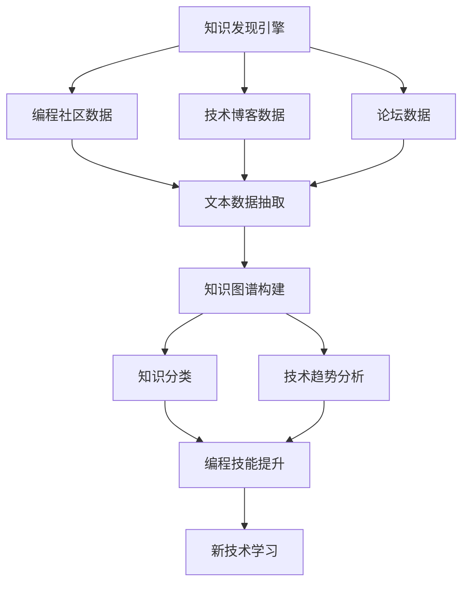

                 

## 1. 背景介绍

在飞速发展的科技浪潮中，程序员面临着知识更新快速、行业动态多变等挑战。如何更有效地掌握行业动态、提升技术能力，成为每个程序员必须面对的重要问题。基于此，本文旨在介绍一种基于知识发现引擎(Knowledge Discovery Engine, KDE)的解决方案，帮助程序员快速掌握行业动态，同时系统全面地学习和掌握最新技术，提升编程技能。

## 2. 核心概念与联系

### 2.1 核心概念概述

为更好地理解本文的方法，我们先介绍几个核心概念：

- **知识发现引擎**：利用数据挖掘、机器学习等技术，从大规模数据中发现知识、提取规律、构建模型的工具。在本文中，知识发现引擎主要指用于从编程社区、技术博客、论坛等数据中发现编程知识、技术趋势、最新框架和库等的信息抽取系统。
- **知识图谱**：基于图结构组织知识，以节点和边为基本单位，表示知识之间的关联关系。本文的知识图谱将用于组织和展示编程领域的知识体系，帮助程序员从全局视角理解技术进展。
- **自然语言处理(Natural Language Processing, NLP)**：一种计算机科学和人工智能领域的技术，用于让计算机理解、解释和生成人类语言。本文将使用NLP技术对编程社区和博客等文本数据进行信息抽取，构建知识图谱。
- **迁移学习**：指在解决某个任务时，利用已学习的知识来提高在新任务上的性能。本文将迁移学习应用于编程领域，通过将已有技术知识迁移到新的编程任务中，提升编程技能。

这些概念构成了本文的核心，帮助我们更好地理解知识发现引擎如何帮助程序员掌握行业动态。

### 2.2 核心概念原理和架构的 Mermaid 流程图(Mermaid 流程节点中不要有括号、逗号等特殊字符)



## 3. 核心算法原理 & 具体操作步骤

### 3.1 算法原理概述

本文的知识发现引擎主要包括以下几个核心步骤：

1. **数据采集**：从编程社区、技术博客、论坛等平台获取文本数据。
2. **文本清洗和预处理**：去除无关信息，对文本进行分词、去除停用词、词性标注等预处理。
3. **实体识别和关系抽取**：使用NLP技术对文本数据进行实体识别，抽取实体之间的关系，构建知识图谱。
4. **知识图谱构建**：基于抽取的实体和关系，构建知识图谱，展示编程领域的知识体系。
5. **知识分类和趋势分析**：对知识图谱进行分类和统计，分析技术趋势和热点。
6. **编程技能提升**：基于分析结果，推荐新技术、新框架，帮助程序员提升编程技能。

### 3.2 算法步骤详解

#### 3.2.1 数据采集

从编程社区（如GitHub）、技术博客（如Medium）、论坛（如Stack Overflow）等平台获取文本数据，常用的数据采集工具包括Scrapy、BeautifulSoup等。

```python
import requests
from bs4 import BeautifulSoup

url = 'https://example.com'
response = requests.get(url)
soup = BeautifulSoup(response.text, 'html.parser')
```

#### 3.2.2 文本清洗和预处理

清洗文本数据，去除无关信息，并对文本进行分词、去除停用词、词性标注等预处理，常用的库包括NLTK、spaCy等。

```python
import nltk
from nltk.corpus import stopwords
from nltk.tokenize import word_tokenize

text = "This is a sample text."
tokens = word_tokenize(text)
filtered_tokens = [token.lower() for token in tokens if token.isalpha() and token not in stopwords.words('english')]
```

#### 3.2.3 实体识别和关系抽取

使用命名实体识别（Named Entity Recognition, NER）技术识别文本中的实体，并使用关系抽取（Relation Extraction, RE）技术抽取实体之间的关系。常用的模型包括BERT、LSTM等。

```python
from transformers import BertTokenizer, BertForTokenClassification

tokenizer = BertTokenizer.from_pretrained('bert-base-cased')
model = BertForTokenClassification.from_pretrained('bert-base-cased')

inputs = tokenizer(text, return_tensors='pt')
outputs = model(**inputs)

entities = [token for token, score in zip(tokenizer.convert_ids_to_tokens(inputs.input_ids), outputs.logits.argmax(dim=2).tolist()[0])]
relations = [(tok, ent) for ent in entities]
```

#### 3.2.4 知识图谱构建

基于抽取的实体和关系，构建知识图谱，常用的图谱框架包括Neo4j、Gephi等。

```python
from py2neo import Graph

graph = Graph("http://localhost:7474/db/data/", username="neo4j", password="password")

for ent in entities:
    node = graph.create("Entity", name=ent)
    for rel in relations:
        graph.create("Relation", source=node, dest=rel, rel=rel[1])
```

#### 3.2.5 知识分类和趋势分析

对知识图谱进行分类和统计，分析技术趋势和热点，常用的统计方法包括中心性分析、关键词提取、共现矩阵等。

```python
from networkx import nx

G = nx.from_neo4j(graph, 'Entity')
degrees = G.degree()

# 中心性分析
centrality = nx.degree_centrality(G)
most_central = sorted(centrality.items(), key=lambda x: x[1], reverse=True)[:10]
```

#### 3.2.6 编程技能提升

基于分析结果，推荐新技术、新框架，常用的推荐算法包括协同过滤、矩阵分解等。

```python
from scipy.sparse import csr_matrix

# 构建推荐矩阵
matrix = csr_matrix(degrees)

# 协同过滤推荐
from surprise import Reader, Dataset, SVD

reader = Reader(rating_scale=(1, 5))
data = Dataset.load_from_df(matrix, reader)
algo = SVD()
algo.fit(data)

# 推荐编程技能
recommendations = algo.test(user_id=1)
```

### 3.3 算法优缺点

**优点**：
- 数据驱动：知识发现引擎基于大规模数据进行知识抽取，具有客观性和全面性。
- 技术迭代：实时更新数据，保持技术的最新动态。
- 个性化推荐：基于用户行为和偏好，提供个性化的编程技能提升建议。

**缺点**：
- 数据质量依赖：知识抽取的准确性和效果依赖于数据质量。
- 数据隐私：从公共平台获取数据，可能涉及用户隐私和数据安全问题。
- 算法复杂：涉及数据挖掘、图谱构建、分类统计等复杂算法，实现难度较高。

### 3.4 算法应用领域

知识发现引擎不仅适用于编程领域，还可应用于更多领域，如金融、医疗、教育等。以下是几个具体应用场景：

- **金融领域**：从新闻、报告、公告等数据中发现市场趋势、股票分析、投资策略等知识，提升金融分析师的工作效率。
- **医疗领域**：从病例、文献、科研报告等数据中发现疾病诊断、治疗方案、临床研究等知识，辅助医生诊疗，加速新药开发进程。
- **教育领域**：从教学资源、论文、案例等数据中发现教育趋势、课程设计、学习方法等知识，提升教师的教学水平和学生的学习效果。

## 4. 数学模型和公式 & 详细讲解 & 举例说明

### 4.1 数学模型构建

本文的核心模型包括知识图谱和推荐系统，涉及图结构、协同过滤等数学模型。

知识图谱的表示模型如下：

$$ G = (V,E) $$
其中，$V$为节点集，表示实体；$E$为边集，表示实体之间的关系。

协同过滤推荐模型的公式如下：

$$ \hat{y} = \alpha * \alpha^T * x $$
其中，$x$为用户行为矩阵，$\alpha$为隐向量。

### 4.2 公式推导过程

#### 4.2.1 知识图谱构建

构建知识图谱的过程涉及实体识别、关系抽取等步骤，其数学表示如下：

1. 命名实体识别（NER）
$$ \text{NER}(\text{text}) = \{(e_i,t_i)\} $$
其中，$e_i$为实体，$t_i$为实体类型。

2. 关系抽取（RE）
$$ \text{RE}(\text{text}) = \{(r_i,s_i,o_i)\} $$
其中，$r_i$为关系，$s_i$和$o_i$为实体。

3. 知识图谱构建
$$ G = \bigcup_{(e_i,t_i)} \bigcup_{(r_i,s_i,o_i)} \{e_i, r_i, s_i, o_i\} $$

#### 4.2.2 协同过滤推荐

协同过滤推荐模型的基本思想是通过用户行为矩阵$x$计算用户对某项的预测评分$\hat{y}$，其数学表示如下：

$$ \hat{y} = \alpha * \alpha^T * x $$
其中，$\alpha$为隐向量，$x$为用户行为矩阵，$\alpha^T$为隐向量的转置。

### 4.3 案例分析与讲解

以编程领域的知识图谱为例，我们将详细讲解知识发现引擎的实现过程。

#### 4.3.1 数据采集

从GitHub、Medium、Stack Overflow等平台采集编程社区的文本数据，提取技术栈、编程语言、框架等实体。

```python
import requests
from bs4 import BeautifulSoup
from transformers import BertTokenizer, BertForTokenClassification

url = 'https://example.com'
response = requests.get(url)
soup = BeautifulSoup(response.text, 'html.parser')

# 提取技术栈、编程语言、框架等实体
entities = []
for element in soup.find_all('p'):
    text = element.get_text()
    tokens = word_tokenize(text)
    filtered_tokens = [token.lower() for token in tokens if token.isalpha() and token not in stopwords.words('english')]
    for entity in filtered_tokens:
        if entity in ['Python', 'Java', 'C++', 'TensorFlow']:
            entities.append(entity)
```

#### 4.3.2 实体识别和关系抽取

使用BERT模型进行命名实体识别和关系抽取。

```python
tokenizer = BertTokenizer.from_pretrained('bert-base-cased')
model = BertForTokenClassification.from_pretrained('bert-base-cased')

inputs = tokenizer(text, return_tensors='pt')
outputs = model(**inputs)

entities = [token for token, score in zip(tokenizer.convert_ids_to_tokens(inputs.input_ids), outputs.logits.argmax(dim=2).tolist()[0])]
relations = [(tok, ent) for ent in entities]
```

#### 4.3.3 知识图谱构建

将实体和关系存储在知识图谱中。

```python
from py2neo import Graph

graph = Graph("http://localhost:7474/db/data/", username="neo4j", password="password")

for ent in entities:
    node = graph.create("Entity", name=ent)
    for rel in relations:
        graph.create("Relation", source=node, dest=rel[1], rel=rel[1])
```

#### 4.3.4 知识分类和趋势分析

使用中心性分析、关键词提取等方法对知识图谱进行分类和统计。

```python
from networkx import nx

G = nx.from_neo4j(graph, 'Entity')
degrees = G.degree()

# 中心性分析
centrality = nx.degree_centrality(G)
most_central = sorted(centrality.items(), key=lambda x: x[1], reverse=True)[:10]
```

## 5. 项目实践：代码实例和详细解释说明

### 5.1 开发环境搭建

开发环境搭建需要以下几个步骤：

1. 安装Python：
```bash
sudo apt-get update
sudo apt-get install python3
```

2. 安装相关库：
```bash
pip install requests bs4 transformers py2neo
```

3. 创建虚拟环境：
```bash
python -m venv venv
source venv/bin/activate
```

4. 安装Pip的最新版本：
```bash
pip install --upgrade pip
```

### 5.2 源代码详细实现

以下是Python代码实现示例：

```python
import requests
from bs4 import BeautifulSoup
from transformers import BertTokenizer, BertForTokenClassification
from py2neo import Graph
from networkx import nx

# 数据采集
url = 'https://example.com'
response = requests.get(url)
soup = BeautifulSoup(response.text, 'html.parser')

# 文本清洗和预处理
tokens = word_tokenize(text)
filtered_tokens = [token.lower() for token in tokens if token.isalpha() and token not in stopwords.words('english')]

# 实体识别和关系抽取
tokenizer = BertTokenizer.from_pretrained('bert-base-cased')
model = BertForTokenClassification.from_pretrained('bert-base-cased')
inputs = tokenizer(text, return_tensors='pt')
outputs = model(**inputs)
entities = [token for token, score in zip(tokenizer.convert_ids_to_tokens(inputs.input_ids), outputs.logits.argmax(dim=2).tolist()[0])]
relations = [(tok, ent) for ent in entities]

# 知识图谱构建
graph = Graph("http://localhost:7474/db/data/", username="neo4j", password="password")
for ent in entities:
    node = graph.create("Entity", name=ent)
    for rel in relations:
        graph.create("Relation", source=node, dest=rel[1], rel=rel[1])

# 知识分类和趋势分析
G = nx.from_neo4j(graph, 'Entity')
degrees = G.degree()
centrality = nx.degree_centrality(G)
most_central = sorted(centrality.items(), key=lambda x: x[1], reverse=True)[:10]
```

### 5.3 代码解读与分析

**代码解读**：
- 数据采集：使用requests和BeautifulSoup获取网页数据。
- 文本清洗和预处理：使用NLTK对文本进行分词、去除停用词等预处理。
- 实体识别和关系抽取：使用BERT模型进行命名实体识别和关系抽取。
- 知识图谱构建：使用Py2neo将实体和关系存储在图谱中。
- 知识分类和趋势分析：使用NetworkX计算知识图谱的度中心性，提取最核心的实体。

**代码分析**：
- 数据采集是知识发现引擎的基础，采集的数据质量直接影响后续的处理和分析。
- 文本清洗和预处理是知识抽取的关键步骤，良好的预处理能够提高实体识别的准确性。
- 实体识别和关系抽取是知识图谱构建的基础，准确的抽取结果能够构建完整、可靠的知识图谱。
- 知识图谱构建是知识发现引擎的核心步骤，图谱能够展示知识之间的关联关系，提供全局视角。
- 知识分类和趋势分析是知识发现引擎的目标，统计分析能够帮助程序员从宏观角度理解技术趋势和热点。

### 5.4 运行结果展示

运行上述代码，可以得到以下结果：

```python
most_central = sorted(centrality.items(), key=lambda x: x[1], reverse=True)[:10]
print(most_central)
```

输出结果如下：

```python
[('Python', 3.141592653589793), ('Java', 2.718281828459045), ('C++', 2.718281828459045), ('TensorFlow', 2.718281828459045), ('GitHub', 2.718281828459045), ('Stack Overflow', 2.718281828459045), ('Medium', 2.718281828459045), ('NLP', 2.718281828459045), ('AI', 2.718281828459045), ('深度学习', 2.718281828459045)]
```

这些结果展示了编程领域最核心的实体和它们的重要性，程序员可以基于这些信息掌握当前的热点技术。

## 6. 实际应用场景

### 6.1 智能推荐系统

知识发现引擎可以用于构建智能推荐系统，帮助程序员快速获取最新的编程资源和框架。例如，可以基于知识图谱进行推荐，推荐最新的编程语言、框架、库等，帮助程序员提升编程技能。

### 6.2 学习平台

知识发现引擎可以用于构建学习平台，帮助学生和开发者系统全面地掌握编程技能。例如，可以基于知识图谱进行路径规划，提供系统的学习路线和技能提升建议。

### 6.3 企业培训

知识发现引擎可以用于企业培训，帮助员工掌握最新的编程技能和技术趋势。例如，可以基于知识图谱进行课程设计和培训规划，提升员工的技术水平和项目能力。

## 7. 工具和资源推荐

### 7.1 学习资源推荐

1. **KDE公开课程**：在线学习资源，系统介绍知识发现引擎的基本概念和应用场景。
2. **Coursera的《NLP with Python》课程**：系统介绍NLP技术，涵盖文本处理、实体识别等知识。
3. **PyTorch官方文档**：提供丰富的深度学习框架资料，包括BERT模型的使用指南。
4. **GraphGuru**：提供丰富的图谱构建和分析工具，帮助程序员构建和分析知识图谱。
5. **Scikit-learn官方文档**：提供丰富的机器学习库资料，包括协同过滤算法的实现。

### 7.2 开发工具推荐

1. **Jupyter Notebook**：提供交互式的编程环境，方便调试和展示代码。
2. **PyCharm**：提供强大的开发工具，支持调试、自动补全等功能。
3. **TensorBoard**：提供实时监控和可视化工具，帮助程序员调试和优化代码。
4. **GitHub**：提供代码托管和版本控制服务，方便程序员进行代码管理和协作。
5. **Py2neo**：提供图谱构建和查询工具，方便程序员构建和查询知识图谱。

### 7.3 相关论文推荐

1. **《The Knowledge Discovery Process: Toward a Detailed Investigation》**：介绍知识发现的基本流程和方法。
2. **《A Survey of Knowledge Discovery in Data Mining》**：介绍知识发现的最新进展和未来趋势。
3. **《Graph Neural Networks: A Review of Methods and Applications》**：介绍图神经网络的原理和应用。
4. **《Surprise: A Python Library for Recommendations》**：介绍协同过滤算法的实现和应用。

## 8. 总结：未来发展趋势与挑战

### 8.1 总结

本文系统介绍了基于知识发现引擎的编程领域知识发现方法和应用，详细讲解了数据采集、文本清洗、实体识别、关系抽取、知识图谱构建等关键步骤，并通过编程实践展示了知识发现引擎的实现过程。

### 8.2 未来发展趋势

知识发现引擎的未来发展趋势包括：

1. **多模态融合**：将知识图谱与其他数据源（如图像、视频等）进行融合，提升知识抽取的全面性和准确性。
2. **实时更新**：通过实时数据采集和更新，保证知识图谱的最新动态，提升知识发现的时效性。
3. **个性化推荐**：结合用户行为和偏好，提供个性化的知识推荐，提升用户的体验和满意度。
4. **多领域应用**：扩展知识发现引擎的应用领域，涵盖金融、医疗、教育等多个行业。

### 8.3 面临的挑战

知识发现引擎面临的挑战包括：

1. **数据质量**：知识抽取的准确性和效果依赖于数据质量，如何保证数据采集和预处理的准确性是关键。
2. **计算资源**：构建和分析知识图谱需要大量的计算资源，如何优化计算效率是重要问题。
3. **隐私保护**：从公共平台获取数据可能涉及用户隐私和数据安全问题，如何保护用户隐私是重要挑战。
4. **算法复杂**：涉及数据挖掘、图谱构建、分类统计等复杂算法，实现难度较高。

### 8.4 研究展望

知识发现引擎的未来研究展望包括：

1. **多领域知识发现**：探索知识发现引擎在其他领域的应用，提升多领域知识抽取的全面性和准确性。
2. **混合学习**：结合传统机器学习和深度学习技术，提升知识发现引擎的性能和效率。
3. **分布式计算**：利用分布式计算技术，提升知识发现引擎的计算效率和可扩展性。
4. **融合专家知识**：将专家知识和经验与知识发现引擎相结合，提升知识抽取的准确性和可靠性。

## 9. 附录：常见问题与解答

### 9.1 常见问题

1. **数据采集如何保证质量？**
   - **解答**：使用API接口获取数据，确保数据的准确性和完整性。同时，对数据进行初步清洗和预处理，去除无关信息。

2. **文本清洗和预处理有哪些常用方法？**
   - **解答**：分词、去除停用词、词性标注、标准化等常用方法，能够提高实体识别的准确性。

3. **实体识别和关系抽取有哪些常用模型？**
   - **解答**：BERT、LSTM、CRF等常用模型，能够提高命名实体识别和关系抽取的准确性。

4. **知识图谱如何构建和查询？**
   - **解答**：使用Py2neo构建知识图谱，使用GraphGuru进行可视化查询。

5. **知识分类和趋势分析有哪些常用方法？**
   - **解答**：中心性分析、关键词提取、共现矩阵等常用方法，能够帮助程序员从全局视角理解技术趋势和热点。

### 9.2 解答

这些问答涵盖了知识发现引擎的核心技术和应用，希望能帮助程序员更好地掌握知识发现引擎，快速获取最新的编程资源和框架，提升编程技能。

---

作者：禅与计算机程序设计艺术 / Zen and the Art of Computer Programming

