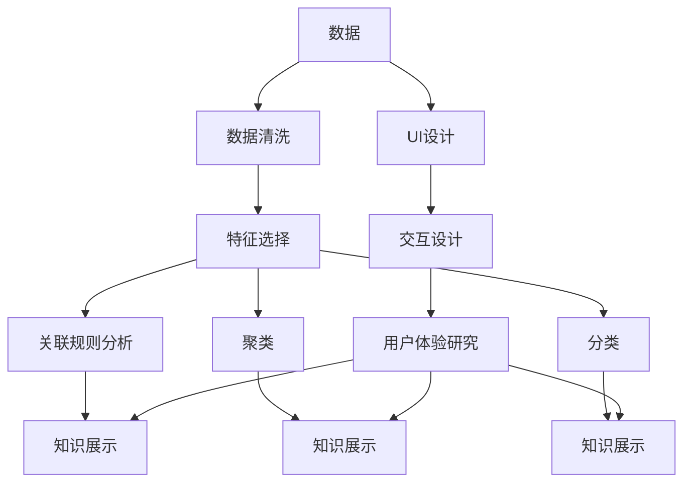

                 

# 知识发现引擎的用户体验设计原则

> 关键词：知识发现引擎, 用户体验设计, 用户界面设计, 交互设计, 用户体验研究

## 1. 背景介绍

### 1.1 问题由来

在信息爆炸的时代，如何高效地从海量数据中发现有用的知识，成为企业决策的关键。知识发现引擎(Knowledge Discovery Engine, KDE)作为人工智能(AI)与数据挖掘领域的热门技术，通过自动化抽取、分析和呈现数据中的知识，为决策者提供了重要支持。

然而，尽管KDE技术日趋成熟，其在用户界面(UI)设计和交互体验(UIX)方面仍存在不足。复杂的操作流程、不直观的展示方式、繁琐的数据输入等，使得用户难以高效地使用KDE系统，导致用户流失和效果不理想。

为解决这一问题，本文深入探讨了知识发现引擎的用户体验设计原则，力求从UI设计、交互设计、用户体验研究等多个维度，提升KDE系统的可用性和用户体验，使其成为企业决策的得力助手。

### 1.2 问题核心关键点

知识发现引擎用户体验设计的核心在于，如何通过界面和交互设计，最大化展现数据洞察，降低用户使用门槛，从而提升数据发现效率和用户满意度。关键点包括：

- UI设计：界面布局、元素摆放、颜色搭配等，以提升用户直观感受和视觉体验。
- 交互设计：用户输入、交互反馈、任务流等，以提升用户操作流畅性和交互深度。
- 用户体验研究：通过用户调查、可用性测试、A/B测试等手段，验证和优化用户体验设计的有效性。

## 2. 核心概念与联系

### 2.1 核心概念概述

知识发现引擎基于数据挖掘、机器学习等技术，从数据中自动抽取、分析和呈现有用的知识。其核心功能包括数据清洗、特征选择、关联规则分析、聚类、分类等。但KDE系统的价值不仅仅在于其强大的数据处理能力，还在于其与用户的交互界面和用户体验。

以下概念与KDE用户体验设计密切相关：

- UI设计：指界面元素和布局的设计，关注用户体验的视觉层面。
- 交互设计：指用户操作界面的方式和反馈，关注用户体验的交互层面。
- 用户体验研究：指通过用户行为、心理和生理反应，评估和优化用户体验，关注用户体验的综合层面。

### 2.2 核心概念原理和架构的 Mermaid 流程图



此流程图展示了知识发现引擎的各个关键功能模块，以及这些模块与用户体验设计的关联。数据清洗和预处理后，通过特征选择、关联规则分析、聚类、分类等技术自动发现数据中的知识。知识展示模块负责将知识以直观、易理解的方式呈现给用户，而UI设计和交互设计则围绕知识展示进行优化。用户体验研究作为闭环反馈，通过用户反馈不断优化UI和交互设计，形成正向循环。

## 3. 核心算法原理 & 具体操作步骤

### 3.1 算法原理概述

知识发现引擎的用户体验设计主要关注以下几个方面：

- **数据可视化**：通过图表、地图、仪表盘等形式，直观地展示数据洞察，提升用户直观感受。
- **交互优化**：通过拖放、滑动、选择等交互方式，简化用户操作，提高用户效率。
- **任务适配**：根据不同任务类型，定制化UI设计，提升用户任务流和认知负荷。

### 3.2 算法步骤详解

知识发现引擎的用户体验设计主要分为以下步骤：

**Step 1: UI设计**

- 界面布局设计：确定信息的重要性和优先级，合理分配界面空间。
- 元素风格设计：定义字体、颜色、图标等视觉元素的风格，确保界面一致性。
- 交互元素设计：如按钮、菜单、滑块等，提升用户操作便捷性。
- 反馈设计：通过提示、动画、状态变化等方式，及时反馈用户操作结果，提升用户安全感。

**Step 2: 交互设计**

- 操作流程设计：优化数据输入、数据查询、数据可视化等操作流程，减少用户操作步骤。
- 任务流设计：根据用户任务的不同阶段，设计适合的交互路径，降低用户认知负荷。
- 交互元素交互方式：定义按钮点击、拖动、输入等交互方式，确保操作的自然流畅。
- 用户反馈设计：通过提示、提示音、动画等方式，增强用户操作反馈，提升用户体验。

**Step 3: 用户体验研究**

- 用户调查：通过问卷、访谈等方式，收集用户需求和偏好。
- 可用性测试：邀请用户进行任务操作，收集用户行为数据，分析操作瓶颈和问题。
- A/B测试：设计不同版本的界面和交互方式，对比用户行为数据，选择最优方案。

### 3.3 算法优缺点

知识发现引擎用户体验设计的优点包括：

- 提高数据发现效率：通过直观的可视化展示和优化的交互方式，用户可以快速获取数据洞察。
- 提升用户满意度：简化操作流程和认知负荷，使用户对系统更有信心和归属感。
- 支持多渠道使用：设计适合移动端和PC端的UI和交互方式，满足不同用户的使用习惯。

缺点则在于：

- 复杂性高：需要综合考虑UI设计、交互设计和用户体验研究，难度较大。
- 成本高：设计、开发和测试的周期较长，需要较多的人力物力投入。
- 依赖技术：依赖数据挖掘和机器学习等技术，技术复杂度较高。

### 3.4 算法应用领域

知识发现引擎的用户体验设计在多个领域有广泛应用：

- **金融行业**：用于数据驱动的决策支持，通过直观的仪表盘展示市场动态，帮助分析师进行投资决策。
- **医疗行业**：用于疾病预测和分析，通过可视化的数据展示和交互分析，辅助医生进行诊断和治疗。
- **零售行业**：用于客户行为分析，通过数据可视化仪表盘展示客户行为数据，帮助企业优化运营策略。
- **电商行业**：用于商品推荐和市场分析，通过交互式的数据仪表盘展示销售数据，帮助商家优化产品和服务。

## 4. 数学模型和公式 & 详细讲解 & 举例说明

### 4.1 数学模型构建

知识发现引擎的用户体验设计涉及多个维度的数学模型，以下是几个核心模型：

- **用户行为模型**：通过收集用户的操作日志、点击数据等，建立用户行为模型，描述用户在界面上的互动行为。
- **用户满意度模型**：通过问卷调查等手段，建立用户满意度模型，量化用户对系统的满意度。
- **任务完成度模型**：通过用户完成的任务数量和质量，建立任务完成度模型，衡量用户的操作效果。

### 4.2 公式推导过程

以用户行为模型为例，假设用户在某界面上的操作序列为 $(x_1,x_2,...,x_n)$，其中 $x_i$ 表示用户在第 $i$ 次点击的按钮，则用户行为模型可以表示为：

$$
\mathcal{M} = \{(x_1,x_2,...,x_n) \mid \forall i, x_i \in \{1,2,...,N\}, N \in \mathbb{N}\}
$$

其中 $N$ 表示界面的元素个数，$x_i$ 表示用户在第 $i$ 次点击的元素编号。

### 4.3 案例分析与讲解

以金融行业的数据可视化仪表盘为例，假设系统界面包含三个关键要素：

- **市场趋势图**：展示股票价格的波动情况。
- **投资组合图**：展示各投资组合的收益情况。
- **风险提示图**：展示各投资组合的风险水平。

用户行为模型可以描述为：

- **趋势图交互**：用户在市场趋势图上进行缩放、移动、点击等操作，触发对市场数据的查询。
- **组合图交互**：用户在投资组合图上进行点击、拖动等操作，查询指定组合的收益数据。
- **提示图交互**：用户在风险提示图上进行鼠标悬停、点击等操作，查看风险提示信息。

通过构建用户行为模型，可以量化用户在仪表盘上的操作行为，优化界面布局和交互方式，提升用户满意度。

## 5. 项目实践：代码实例和详细解释说明

### 5.1 开发环境搭建

在知识发现引擎的开发过程中，需要搭建支持数据挖掘、可视化、交互设计等功能的开发环境。以下是搭建环境的详细步骤：

1. 安装Python：从官网下载安装最新版本的Python，并配置环境变量。
2. 安装数据分析库：使用pip安装pandas、numpy等数据分析库，用于数据预处理和分析。
3. 安装可视化库：安装matplotlib、seaborn等库，用于数据可视化。
4. 安装交互设计库：安装d3.js、react等库，用于交互设计和动态展示。
5. 安装用户体验研究工具：安装Google Analytics等工具，用于收集用户行为数据和分析用户满意度。

### 5.2 源代码详细实现

以下是一个简单的金融行业数据可视化仪表盘代码实现，使用React和D3.js：

```javascript
import React, { Component } from 'react';
import * as d3 from 'd3';

class TrendChart extends Component {
    constructor(props) {
        super(props);
        this.state = { data: [] };
        this.loadData = this.loadData.bind(this);
    }
    
    componentDidMount() {
        this.loadData();
    }
    
    loadData() {
        fetch('https://api.example.com/data')
            .then(response => response.json())
            .then(data => this.setState({ data }));
    }
    
    render() {
        const { data } = this.state;
        const margin = { top: 20, right: 20, bottom: 30, left: 40 };
        const width = 960 - margin.left - margin.right;
        const height = 500 - margin.top - margin.bottom;
        
        const x = d3.scaleLinear()
            .domain([0, d3.max(data, d => d.date)])
            .range([0, width]);
        
        const y = d3.scaleLinear()
            .domain([0, d3.max(data, d => d.value)])
            .range([height, 0]);
        
        const svg = d3.select('svg');
        
        svg.append('rect')
            .attr('width', width + margin.left + margin.right)
            .attr('height', height + margin.top + margin.bottom)
            .attr('fill', '#f0f0f0');
        
        svg.append('g')
            .attr('transform', `translate(${margin.left},${margin.top})`);
        
        svg.append('g')
            .call(d3.axisBottom(x));
        
        svg.append('g')
            .call(d3.axisLeft(y));
        
        svg.append('path')
            .datum(data)
            .attr('fill', 'steelblue')
            .attr('d', d => `M${x(d.date)} ${y(d.value)}L${x(d.date)} ${y(0)}`);
    }
}

export default TrendChart;
```

### 5.3 代码解读与分析

以上代码实现了简单的市场趋势图的绘制。关键点包括：

- **数据加载**：通过fetch函数加载数据，存储在组件状态中。
- **轴线绘制**：使用d3.js绘制x轴和y轴，确保数据可视化展示的准确性。
- **折线绘制**：使用d3.js绘制折线，展示市场趋势。

## 6. 实际应用场景

### 6.1 金融行业

在金融行业，知识发现引擎用于决策支持。用户可以通过直观的仪表盘，快速获取市场动态和投资组合表现，辅助做出投资决策。

### 6.2 医疗行业

在医疗行业，知识发现引擎用于疾病分析和诊断。用户可以通过可视化仪表盘，实时查看患者数据和健康指标，辅助医生进行诊断和治疗决策。

### 6.3 零售行业

在零售行业，知识发现引擎用于客户行为分析。用户可以通过可视化仪表盘，实时查看客户购买行为和偏好，辅助商家优化产品和运营策略。

### 6.4 电商行业

在电商行业，知识发现引擎用于商品推荐和市场分析。用户可以通过可视化仪表盘，实时查看商品销售数据和市场趋势，辅助商家优化商品推荐和营销策略。

## 7. 工具和资源推荐

### 7.1 学习资源推荐

为了帮助开发者掌握知识发现引擎的用户体验设计原则，推荐以下学习资源：

1. **《用户体验设计基础》**：介绍用户体验设计的基本概念、方法和实践，适合初学者入门。
2. **《交互设计模式》**：介绍交互设计中的常见模式和最佳实践，帮助开发者提升交互设计能力。
3. **《数据可视化实战》**：介绍数据可视化的技术和工具，帮助开发者构建直观易用的仪表盘。
4. **《用户研究和分析》**：介绍用户研究和分析的方法和工具，帮助开发者收集和分析用户数据。
5. **《知识发现与数据挖掘》**：介绍数据挖掘和机器学习的基本概念和算法，帮助开发者理解知识发现引擎的技术原理。

### 7.2 开发工具推荐

以下是一些常用的开发工具，帮助开发者提升开发效率和用户体验：

1. **Visual Studio Code**：流行的代码编辑器，支持丰富的插件和扩展，适用于前端开发。
2. **Jupyter Notebook**：支持Python和R等语言的交互式编程环境，适合数据分析和可视化。
3. **GitLab**：代码托管和持续集成平台，支持团队协作和版本控制。
4. **Analog**：交互设计工具，支持原型设计和用户测试。
5. **Sketch**：界面设计工具，支持UI设计元素绘制和布局。

### 7.3 相关论文推荐

为了深入了解知识发现引擎的用户体验设计原则，推荐以下相关论文：

1. **《信息可视化的用户体验设计》**：探讨信息可视化中的用户体验设计原则，适合了解数据可视化的用户体验优化。
2. **《基于用户行为分析的交互设计》**：介绍如何通过用户行为分析优化交互设计，适合了解交互设计的用户体验优化。
3. **《数据挖掘中的可视化分析》**：介绍数据挖掘中可视化分析的应用和挑战，适合了解知识发现引擎的用户体验设计。
4. **《用户研究在数据挖掘中的应用》**：介绍用户研究在数据挖掘中的方法和实践，适合了解用户体验研究的有效应用。

## 8. 总结：未来发展趋势与挑战

### 8.1 研究成果总结

本文从用户体验设计的角度，深入探讨了知识发现引擎的UI设计、交互设计和用户体验研究。研究表明，通过优化用户体验，可以显著提升知识发现引擎的可用性和用户满意度，使其成为企业决策的重要支持工具。

### 8.2 未来发展趋势

未来，知识发现引擎的用户体验设计将呈现以下几个趋势：

1. **个性化体验**：通过用户行为分析，定制化UI设计和交互方式，提供个性化体验。
2. **自适应界面**：根据用户操作习惯和设备类型，动态调整界面布局和交互方式，提升用户适应性。
3. **增强现实**：结合增强现实技术，提供沉浸式的数据可视化体验，增强用户沉浸感和参与感。
4. **自然交互**：通过语音识别、手势识别等自然交互方式，简化用户操作，提升用户体验。

### 8.3 面临的挑战

尽管知识发现引擎的用户体验设计已经取得显著进展，但仍面临以下挑战：

1. **技术复杂性**：用户体验设计需要综合考虑UI设计、交互设计和用户体验研究，技术复杂度较高。
2. **成本高昂**：用户体验设计的开发和测试周期较长，需要较多的人力物力投入。
3. **用户差异化**：不同用户对用户体验的要求存在差异，如何设计出普适性强的UI和交互方式，是一个重要挑战。
4. **数据隐私**：用户体验设计需要大量用户数据，如何保护用户隐私和数据安全，是一个重要挑战。

### 8.4 研究展望

未来的研究需要在以下几个方面进行突破：

1. **用户行为分析**：通过更深入的用户行为分析，挖掘用户需求和偏好，优化用户体验设计。
2. **界面自适应**：开发自适应界面技术，根据用户设备和操作习惯，动态调整UI和交互方式，提升用户体验。
3. **自然交互技术**：引入语音识别、手势识别等自然交互技术，简化用户操作，提升用户体验。
4. **数据隐私保护**：研究数据隐私保护技术，确保用户体验设计的用户数据安全。

这些研究方向的探索，将推动知识发现引擎用户体验设计向更深层次发展，进一步提升系统的可用性和用户满意度。

## 9. 附录：常见问题与解答

**Q1：知识发现引擎的用户体验设计主要关注哪些方面？**

A: 知识发现引擎的用户体验设计主要关注以下几个方面：
- UI设计：界面布局、元素风格、交互元素和反馈设计。
- 交互设计：操作流程、任务流、交互元素交互方式和用户反馈设计。
- 用户体验研究：用户调查、可用性测试和A/B测试。

**Q2：如何优化知识发现引擎的用户体验设计？**

A: 优化知识发现引擎的用户体验设计需要从以下方面入手：
- 通过用户调查、可用性测试和A/B测试，了解用户需求和偏好。
- 优化界面布局和元素风格，提升用户直观感受和视觉体验。
- 简化操作流程和认知负荷，提升用户操作流畅性和交互深度。
- 通过提示、动画、状态变化等方式，增强用户操作反馈，提升用户体验。

**Q3：知识发现引擎的用户体验设计有哪些挑战？**

A: 知识发现引擎的用户体验设计面临以下挑战：
- 技术复杂性：用户体验设计需要综合考虑UI设计、交互设计和用户体验研究，难度较大。
- 成本高昂：用户体验设计的开发和测试周期较长，需要较多的人力物力投入。
- 用户差异化：不同用户对用户体验的要求存在差异，如何设计出普适性强的UI和交互方式，是一个重要挑战。
- 数据隐私：用户体验设计需要大量用户数据，如何保护用户隐私和数据安全，是一个重要挑战。

**Q4：知识发现引擎的用户体验设计未来有哪些发展趋势？**

A: 知识发现引擎的用户体验设计未来有以下发展趋势：
- 个性化体验：通过用户行为分析，定制化UI设计和交互方式，提供个性化体验。
- 自适应界面：根据用户操作习惯和设备类型，动态调整界面布局和交互方式，提升用户适应性。
- 增强现实：结合增强现实技术，提供沉浸式的数据可视化体验，增强用户沉浸感和参与感。
- 自然交互：通过语音识别、手势识别等自然交互方式，简化用户操作，提升用户体验。

**Q5：知识发现引擎的用户体验设计需要哪些技术支持？**

A: 知识发现引擎的用户体验设计需要以下技术支持：
- UI设计技术：如交互设计、界面设计、动画效果等。
- 数据可视化技术：如数据图表、仪表盘、地图等。
- 自然交互技术：如语音识别、手势识别、自然语言处理等。
- 用户体验研究技术：如用户调查、可用性测试、A/B测试等。

通过深入探索知识发现引擎的用户体验设计，可以有效提升系统的可用性和用户满意度，使其成为企业决策的重要支持工具。未来，随着技术的不断进步和用户体验设计的深入研究，知识发现引擎必将为更多行业带来深远影响。

