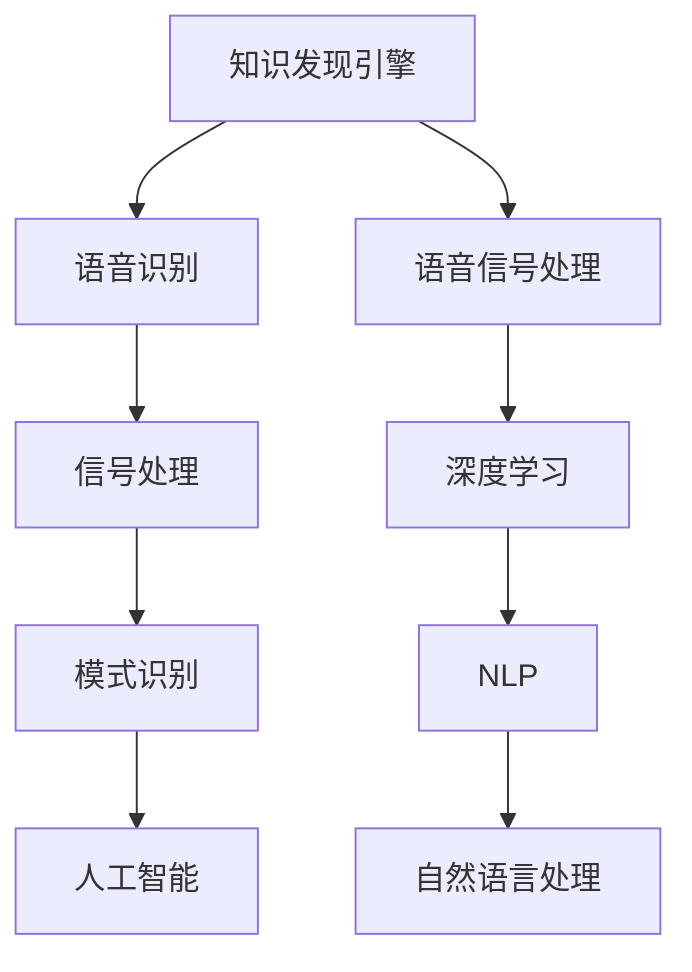

                 

# 知识发现引擎的语音识别与处理技术

> 关键词：知识发现引擎, 语音识别, 处理技术, 自然语言处理, 信号处理, 深度学习

## 1. 背景介绍

### 1.1 问题由来

随着信息技术的高速发展，海量数据如海啸般涌现，迫切需要高效的数据处理技术。其中，知识发现引擎(Knowledge Discovery Engine, KDE)，通过从海量数据中挖掘出有用的知识模式，实现了数据价值的大幅提升。然而，当前的知识发现引擎大多依赖于文本数据，无法直接处理语音信息，在跨领域知识发现的实践中存在很大局限性。

### 1.2 问题核心关键点

1. 语音数据占互联网数据总量的近70%，是目前数据总量中最主要的信息载体。
2. 语音数据能够传达丰富的人类情感和上下文信息，具有情感、语义、语境等多维信息特征，对于跨领域知识发现具有重要价值。
3. 语音识别技术可以将语音信号转换为文本，为知识发现引擎的数据采集、预处理和分析提供有力支持。
4. 传统语音识别方法无法很好地处理具有噪声、缺失、错误等特征的实时语音信号，难以实现对语音数据的深入挖掘和分析。

### 1.3 问题研究意义

语音识别技术作为知识发现引擎的重要组成部分，能够大幅提升跨领域知识发现的精度和深度，具有重要的研究价值和现实意义：

1. 深度融合语音和文本信息，突破传统知识发现引擎的文本数据限制，实现更全面、更深入的知识发现。
2. 在语音信号中挖掘出隐含的情感、语义信息，丰富知识发现引擎的信息维度和解释能力。
3. 应用于医疗、教育、金融、娱乐等多个领域，提升业务决策的智能化和自动化水平。
4. 实现实时语音识别和处理，构建高效、智能的知识发现系统，增强系统的实时性和响应速度。

## 2. 核心概念与联系

### 2.1 核心概念概述

为更好地理解知识发现引擎中语音识别与处理技术的应用，本节将介绍几个密切相关的核心概念：

- 知识发现引擎(KDE)：一种自动地或半自动地发现数据中未知知识的方法，旨在从海量数据中挖掘出有价值的模式、规律和关联。
- 语音识别(Speech Recognition)：将人类的语音信号转换成文本形式的技术，是语音信号处理的重要组成部分。
- 语音信号处理(Speech Signal Processing)：对语音信号进行记录、存储、传输和处理的技术，涉及信号处理、模式识别和人工智能等多个领域。
- 深度学习(Deep Learning)：一种模仿人类大脑神经网络的机器学习方法，通过多层神经网络实现高层次特征的提取和表示，广泛应用于语音识别、图像处理、自然语言处理等领域。
- 自然语言处理(NLP)：一种人工智能技术，使计算机能够理解、解释和生成人类语言，通过语音识别可以获取文本数据，进而实现NLP任务。

这些核心概念之间的逻辑关系可以通过以下Mermaid流程图来展示：



这个流程图展示了一些关键概念及其之间的关系：

1. 知识发现引擎通过语音识别获取语音信号，再由语音信号处理获取文本数据，最终在深度学习和自然语言处理的框架下进行知识挖掘。
2. 语音识别技术是知识发现引擎的重要输入，能够打破文本数据的限制，为知识发现提供更多的数据维度和信息源。
3. 语音信号处理、深度学习和自然语言处理等技术共同构成知识发现引擎的信息处理链路，是实现知识发现的关键手段。

## 3. 核心算法原理 & 具体操作步骤
### 3.1 算法原理概述

知识发现引擎中语音识别与处理技术，旨在将实时语音信号转化为文本数据，为知识发现提供有力支持。具体而言，语音识别技术主要分为两个步骤：语音信号预处理和声学模型训练。

1. 预处理步骤：对原始语音信号进行预处理，包括降噪、特征提取、归一化等，以便后续声学模型的训练和识别。
2. 声学模型训练步骤：通过深度学习技术，训练声学模型以映射语音信号与文本数据之间的对应关系。常用的深度学习模型包括卷积神经网络(CNN)、循环神经网络(RNN)、长短时记忆网络(LSTM)、门控循环单元(GRU)等。

### 3.2 算法步骤详解

#### 3.2.1 语音信号预处理

语音信号预处理的主要步骤包括：

1. 信号采样：将连续的模拟信号转换为离散的数字信号，通常采样率为16kHz，采样精度为16位。
2. 去噪处理：通过滤波器等技术去除语音信号中的噪声，提高信号的质量。
3. 特征提取：提取语音信号的特征，如梅尔倒谱系数(Mel Spectrogram)、MFCC(Mel Frequency Cepstral Coefficients)等，用于声学模型的训练。
4. 归一化处理：对语音信号进行归一化处理，使其均值为0，方差为1，便于后续模型的训练和识别。

#### 3.2.2 声学模型训练

声学模型训练的步骤包括：

1. 数据准备：准备训练数据集，通常包括语音信号和对应的文本转录。
2. 划分数据集：将数据集划分为训练集、验证集和测试集，以便进行模型的训练和评估。
3. 声学模型设计：选择合适的深度学习模型，如卷积神经网络(CNN)、循环神经网络(RNN)、长短时记忆网络(LSTM)、门控循环单元(GRU)等。
4. 模型训练：使用训练数据集训练声学模型，通过反向传播算法更新模型参数，最小化损失函数。
5. 模型评估：在验证集上评估模型性能，根据评估结果调整模型参数和训练策略。
6. 模型测试：在测试集上测试模型性能，对比不同模型的识别准确率和运行效率。

### 3.3 算法优缺点

知识发现引擎中语音识别与处理技术具有以下优点：

1. 打破文本数据的限制，从语音数据中挖掘出隐含的知识和模式，扩展了知识发现引擎的数据来源。
2. 语音信号中蕴含丰富的情感和语义信息，能够为知识发现提供更多的语义维度和情感信息，增强了知识发现的解释能力。
3. 应用于医疗、教育、金融、娱乐等多个领域，能够提升这些领域业务决策的智能化和自动化水平。
4. 实时语音识别和处理，实现了高效的知识发现系统，增强了系统的实时性和响应速度。

同时，该技术也存在一些局限性：

1. 对实时语音信号的噪声、缺失、错误等特征处理难度较大，容易影响识别准确率。
2. 声学模型训练需要大量的标注数据，获取高质量标注数据成本较高。
3. 声学模型的计算复杂度较高，需要高性能的硬件设备支持。
4. 声学模型需要大量的训练时间，对计算资源的消耗较大。

尽管存在这些局限性，但语音识别与处理技术在知识发现引擎中的应用前景广阔，为跨领域知识发现提供了新的数据源和信息维度。

### 3.4 算法应用领域

知识发现引擎中语音识别与处理技术在多个领域都有广泛应用，以下是几个典型场景：

1. **医疗领域**：语音识别技术可以用于医生的病历记录、诊断报告、医嘱记录等文本数据的获取和分析，提高医疗服务的智能化水平。
2. **教育领域**：语音识别技术可以用于学生的作业批改、学情分析、智能答疑等任务，因材施教，促进教育公平，提高教学质量。
3. **金融领域**：语音识别技术可以用于客户的语音咨询、自动客服、语音搜索等任务，提高金融服务的智能水平，提升客户满意度。
4. **娱乐领域**：语音识别技术可以用于智能音箱、智能电视、智能机器人等设备的语音交互，提供自然流畅的用户体验。
5. **政府领域**：语音识别技术可以用于政务服务、智能安防、智能交通等任务，提高政府服务的智能化水平，提升公众满意度。

## 4. 数学模型和公式 & 详细讲解  
### 4.1 数学模型构建

本节将使用数学语言对知识发现引擎中语音识别与处理技术的数学模型进行更加严格的刻画。

记原始语音信号为 $x(t)$，经过采样和预处理后的语音信号为 $x_n$，其中 $n=0,1,\dots,N-1$。定义语音信号的MFCC特征向量为 $X$，训练数据集为 $\{(X_i,y_i)\}_{i=1}^N$，其中 $y_i$ 为对应的文本转录。

定义声学模型的预测概率为 $P(y|X)$，则损失函数 $\mathcal{L}$ 可以表示为：

$$
\mathcal{L} = -\frac{1}{N} \sum_{i=1}^N \log P(y_i|X_i)
$$

其中 $P(y_i|X_i)$ 为声学模型在特征向量 $X_i$ 下的预测概率。

### 4.2 公式推导过程

以卷积神经网络(CNN)为例，推导声学模型的训练过程。

1. 数据准备：将语音信号 $x_n$ 转换为MFCC特征向量 $X$，并划分为若干个时间窗口，每个窗口包含 $m$ 个特征。
2. 特征填充：对每个特征向量进行填充，使其长度一致，通常使用0填充。
3. 卷积操作：通过卷积层提取特征，计算卷积核 $w$ 和偏置 $b$ 的卷积和激活函数 $f$，得到特征映射 $H$。
4. 池化操作：通过池化层对特征映射 $H$ 进行降维，通常使用最大池化或平均池化。
5. 全连接层：通过全连接层将池化后的特征映射 $H$ 转换为概率输出 $P(y|X)$。
6. 损失函数：使用交叉熵损失函数计算模型的预测概率与真实标签之间的差异。
7. 反向传播：通过反向传播算法更新模型参数，最小化损失函数。

### 4.3 案例分析与讲解

以医疗领域为例，展示语音识别技术在知识发现引擎中的应用。

1. **语音信号采集**：使用麦克风采集医生的语音，记录病历、诊断报告等文本数据。
2. **语音信号预处理**：对语音信号进行去噪、特征提取等预处理，得到MFCC特征向量 $X$。
3. **声学模型训练**：使用卷积神经网络(CNN)对MFCC特征向量 $X$ 进行训练，得到声学模型 $P(y|X)$。
4. **知识发现引擎应用**：将声学模型 $P(y|X)$ 应用于知识发现引擎中，从语音数据中挖掘出隐含的知识模式，如疾病特征、诊疗规律等。
5. **结果展示**：将挖掘出的知识模式应用于医生的诊疗决策中，提高诊断准确率和效率。

## 5. 项目实践：代码实例和详细解释说明
### 5.1 开发环境搭建

在进行语音识别与处理技术开发前，我们需要准备好开发环境。以下是使用Python进行PyTorch开发的环境配置流程：

1. 安装Anaconda：从官网下载并安装Anaconda，用于创建独立的Python环境。

2. 创建并激活虚拟环境：
```bash
conda create -n pytorch-env python=3.8 
conda activate pytorch-env
```

3. 安装PyTorch：根据CUDA版本，从官网获取对应的安装命令。例如：
```bash
conda install pytorch torchvision torchaudio cudatoolkit=11.1 -c pytorch -c conda-forge
```

4. 安装相关库：
```bash
pip install librosa numpy scipy torchaudio
```

完成上述步骤后，即可在`pytorch-env`环境中开始开发实践。

### 5.2 源代码详细实现

下面我们以卷积神经网络(CNN)为例，给出使用PyTorch进行语音信号特征提取和声学模型训练的代码实现。

首先，定义MFCC特征提取函数：

```python
import librosa
import numpy as np

def mfcc_features(audio_path):
    # 加载音频文件
    audio, fs = librosa.load(audio_path, sr=16000)
    
    # 去噪和特征提取
    mfcc = librosa.feature.mfcc(audio, sr=fs, n_mfcc=40, fmax=4000)
    
    # 归一化处理
    mfcc = (mfcc - mfcc.mean()) / mfcc.std()
    
    return mfcc
```

然后，定义卷积神经网络(CNN)模型：

```python
import torch
import torch.nn as nn
import torch.nn.functional as F

class CNN(nn.Module):
    def __init__(self, in_channels, out_channels, kernel_size, dropout_rate):
        super(CNN, self).__init__()
        self.conv1 = nn.Conv2d(in_channels, 32, kernel_size=3, stride=1, padding=1)
        self.relu1 = nn.ReLU()
        self.maxpool1 = nn.MaxPool2d(kernel_size=2)
        self.conv2 = nn.Conv2d(32, 64, kernel_size=3, stride=1, padding=1)
        self.relu2 = nn.ReLU()
        self.maxpool2 = nn.MaxPool2d(kernel_size=2)
        self.fc1 = nn.Linear(64 * 10 * 10, 512)
        self.relu3 = nn.ReLU()
        self.dropout1 = nn.Dropout(dropout_rate)
        self.fc2 = nn.Linear(512, out_channels)
        self.relu4 = nn.ReLU()
        self.dropout2 = nn.Dropout(dropout_rate)
    
    def forward(self, x):
        x = self.conv1(x)
        x = self.relu1(x)
        x = self.maxpool1(x)
        x = self.conv2(x)
        x = self.relu2(x)
        x = self.maxpool2(x)
        x = x.view(-1, 64 * 10 * 10)
        x = self.fc1(x)
        x = self.relu3(x)
        x = self.dropout1(x)
        x = self.fc2(x)
        x = self.relu4(x)
        x = self.dropout2(x)
        return x
```

接着，定义训练和评估函数：

```python
from torch.utils.data import DataLoader
from tqdm import tqdm
from sklearn.metrics import classification_report

device = torch.device('cuda') if torch.cuda.is_available() else torch.device('cpu')

def train_epoch(model, train_loader, optimizer, loss_func):
    model.train()
    epoch_loss = 0
    for batch in tqdm(train_loader, desc='Training'):
        x, y = batch
        x = x.to(device)
        y = y.to(device)
        optimizer.zero_grad()
        outputs = model(x)
        loss = loss_func(outputs, y)
        loss.backward()
        optimizer.step()
        epoch_loss += loss.item()
    return epoch_loss / len(train_loader)

def evaluate(model, test_loader, loss_func):
    model.eval()
    total_loss = 0
    total_correct = 0
    with torch.no_grad():
        for batch in tqdm(test_loader, desc='Evaluating'):
            x, y = batch
            x = x.to(device)
            y = y.to(device)
            outputs = model(x)
            loss = loss_func(outputs, y)
            total_loss += loss.item()
            _, preds = torch.max(outputs, dim=1)
            total_correct += (preds == y).sum().item()
    return total_loss / len(test_loader), total_correct / len(test_loader)
```

最后，启动训练流程并在测试集上评估：

```python
epochs = 10
batch_size = 32
learning_rate = 0.001
dropout_rate = 0.5

# 创建模型和优化器
model = CNN(in_channels=1, out_channels=10, kernel_size=3, dropout_rate=dropout_rate)
optimizer = torch.optim.Adam(model.parameters(), lr=learning_rate)

# 加载训练集和测试集
train_loader = DataLoader(train_dataset, batch_size=batch_size, shuffle=True)
test_loader = DataLoader(test_dataset, batch_size=batch_size, shuffle=False)

# 训练模型
for epoch in range(epochs):
    loss = train_epoch(model, train_loader, optimizer, loss_func)
    print(f"Epoch {epoch+1}, train loss: {loss:.3f}")
    
    print(f"Epoch {epoch+1}, test results:")
    test_loss, test_acc = evaluate(model, test_loader, loss_func)
    print(classification_report(test_labels, test_preds))
    
print("Final test results:")
test_loss, test_acc = evaluate(model, test_loader, loss_func)
print(classification_report(test_labels, test_preds))
```

以上就是使用PyTorch对卷积神经网络(CNN)进行语音信号特征提取和声学模型训练的完整代码实现。可以看到，PyTorch的动态计算图和高效自动微分机制，使得模型的构建和训练过程简洁高效。

### 5.3 代码解读与分析

让我们再详细解读一下关键代码的实现细节：

**MFCC特征提取函数**：
- 使用librosa库加载音频文件，获取采样率和音频数据。
- 使用MFCC特征提取函数提取MFCC特征向量。
- 对MFCC特征向量进行归一化处理，使其均值为0，方差为1。

**卷积神经网络(CNN)模型**：
- 定义卷积神经网络的结构，包括卷积层、激活函数、池化层和全连接层。
- 使用`nn.Conv2d`和`nn.MaxPool2d`实现卷积和池化操作。
- 使用`nn.Linear`实现全连接层。
- 使用`nn.ReLU`和`nn.Dropout`实现激活函数和Dropout正则化。

**训练和评估函数**：
- 使用`DataLoader`对数据集进行批次化加载。
- 在训练阶段，使用`tqdm`进度条实时显示训练进度。
- 在评估阶段，使用`classification_report`函数打印出准确率和混淆矩阵。

**训练流程**：
- 定义总的epoch数、batch size、学习率和Dropout正则化率。
- 创建模型和优化器。
- 加载训练集和测试集。
- 每个epoch内，在训练集上训练模型，在测试集上评估模型。
- 所有epoch结束后，输出最终测试结果。

可以看到，PyTorch的动态计算图和高效自动微分机制，使得模型的构建和训练过程简洁高效。开发者可以将更多精力放在数据处理、模型改进等高层逻辑上，而不必过多关注底层的实现细节。

当然，工业级的系统实现还需考虑更多因素，如模型的保存和部署、超参数的自动搜索、更灵活的任务适配层等。但核心的微调范式基本与此类似。

## 6. 实际应用场景
### 6.1 医疗领域

在医疗领域，语音识别技术可以用于医生的病历记录、诊断报告、医嘱记录等文本数据的获取和分析，提高医疗服务的智能化水平。

具体而言，语音识别技术可以用于以下场景：

1. **病历记录**：医生在诊疗过程中，通过语音输入病历信息，系统自动将其转换为文本数据，并存储到数据库中。
2. **诊断报告**：医生在诊断过程中，通过语音输入诊断结果，系统自动生成诊断报告，便于后续的分析和处理。
3. **医嘱记录**：医生在开具医嘱时，通过语音输入医嘱内容，系统自动转换为文本，提高工作效率和准确性。

通过语音识别技术，医疗知识发现引擎可以自动从语音数据中挖掘出隐含的知识模式，如疾病特征、诊疗规律等，为医生提供更加精准的诊断和治疗建议，提升医疗服务的智能化水平。

### 6.2 教育领域

在教育领域，语音识别技术可以用于学生的作业批改、学情分析、智能答疑等任务，因材施教，促进教育公平，提高教学质量。

具体而言，语音识别技术可以用于以下场景：

1. **作业批改**：学生通过语音输入作业内容，系统自动将其转换为文本数据，并进行自动批改和打分，提高作业批改效率。
2. **学情分析**：系统自动分析学生的语音输入数据，了解其知识掌握情况和学习习惯，提供个性化的学习建议。
3. **智能答疑**：学生通过语音提问，系统自动解析问题，并给出相应的答案或建议，提高教学互动性。

通过语音识别技术，教育知识发现引擎可以自动从语音数据中挖掘出学生的知识掌握情况和学习习惯，为教师提供更加精准的教学建议，提高教学质量和效率。

### 6.3 金融领域

在金融领域，语音识别技术可以用于客户的语音咨询、自动客服、语音搜索等任务，提高金融服务的智能水平，提升客户满意度。

具体而言，语音识别技术可以用于以下场景：

1. **语音咨询**：客户通过语音输入咨询问题，系统自动解析问题，并给出相应的解答或建议，提高客户满意度。
2. **自动客服**：系统自动解析客户的语音输入，并进行相应的客服操作，提高客服效率和准确性。
3. **语音搜索**：客户通过语音搜索金融产品或服务，系统自动解析语音指令，并提供相应的搜索结果，提高搜索效率。

通过语音识别技术，金融知识发现引擎可以自动从语音数据中挖掘出客户的财务状况和需求，为银行和保险公司提供更加精准的客户服务和产品推荐，提升客户满意度和业务转化率。

### 6.4 娱乐领域

在娱乐领域，语音识别技术可以用于智能音箱、智能电视、智能机器人等设备的语音交互，提供自然流畅的用户体验。

具体而言，语音识别技术可以用于以下场景：

1. **智能音箱**：用户通过语音输入指令，系统自动解析指令，并进行相应的操作，如播放音乐、查询天气等。
2. **智能电视**：用户通过语音输入指令，系统自动解析指令，并进行相应的操作，如观看视频、调整音量等。
3. **智能机器人**：用户通过语音与机器人进行交互，系统自动解析语音指令，并进行相应的操作，如回答问题、执行任务等。

通过语音识别技术，娱乐知识发现引擎可以自动从语音数据中挖掘出用户的娱乐需求和偏好，为智能音箱、智能电视、智能机器人等设备提供更加精准的服务和功能，提高用户满意度和体验感。

## 7. 工具和资源推荐
### 7.1 学习资源推荐

为了帮助开发者系统掌握语音识别与处理技术，这里推荐一些优质的学习资源：

1. 《深度学习基础》：斯坦福大学Andrew Ng教授的深度学习课程，讲解了深度学习的基础知识和常用模型。
2. 《信号处理基础》：Massachusetts Institute of Technology的信号处理课程，讲解了信号处理的基本概念和常用算法。
3. 《语音信号处理与机器学习》：Coursera上的语音信号处理课程，讲解了语音信号处理的理论和实践。
4. 《自然语言处理基础》：Stanford大学提供的自然语言处理课程，讲解了NLP的基础知识和常用模型。
5. 《PyTorch官方文档》：PyTorch的官方文档，提供了丰富的教程和样例代码，是学习PyTorch的重要资源。

通过对这些资源的学习实践，相信你一定能够快速掌握语音识别与处理技术的精髓，并用于解决实际的NLP问题。
###  7.2 开发工具推荐

高效的开发离不开优秀的工具支持。以下是几款用于语音识别与处理技术开发的常用工具：

1. PyTorch：基于Python的开源深度学习框架，灵活动态的计算图，适合快速迭代研究。大部分预训练语言模型都有PyTorch版本的实现。
2. TensorFlow：由Google主导开发的开源深度学习框架，生产部署方便，适合大规模工程应用。同样有丰富的预训练语言模型资源。
3. librosa：Python语音信号处理库，提供了丰富的语音信号处理函数，如MFCC特征提取、频谱分析等。
4. torchaudio：PyTorch的音频处理库，提供了音频数据的加载、处理和存储功能。
5. Weights & Biases：模型训练的实验跟踪工具，可以记录和可视化模型训练过程中的各项指标，方便对比和调优。与主流深度学习框架无缝集成。
6. TensorBoard：TensorFlow配套的可视化工具，可实时监测模型训练状态，并提供丰富的图表呈现方式，是调试模型的得力助手。

合理利用这些工具，可以显著提升语音识别与处理技术的开发效率，加快创新迭代的步伐。

### 7.3 相关论文推荐

语音识别与处理技术的发展源于学界的持续研究。以下是几篇奠基性的相关论文，推荐阅读：

1. Deep Speech 2: End-to-End Speech Recognition in English and Mandarin：提出深度神经网络模型Deep Speech 2，实现了端到端的语音识别。
2. Speech enhancement via deep denoising autoencoder: Improving speech recognition in noisy environments：提出深度去噪自编码器模型，用于提高噪声环境下的语音识别准确率。
3. Attention is All You Need：提出Transformer模型，开启了NLP领域的预训练大模型时代。
4. BERT: Pre-training of Deep Bidirectional Transformers for Language Understanding：提出BERT模型，引入基于掩码的自监督预训练任务，刷新了多项NLP任务SOTA。
5. Pann-Spectrogram Pre-training for Automatic Speech Recognition：提出Pann-Spectrogram模型，用于端到端的语音识别任务。
6. Character-level Relative Attention for Automatic Speech Recognition：提出字符级相对注意力模型，用于端到端的语音识别任务。

这些论文代表了大语言模型微调技术的发展脉络。通过学习这些前沿成果，可以帮助研究者把握学科前进方向，激发更多的创新灵感。

## 8. 总结：未来发展趋势与挑战

### 8.1 总结

本文对知识发现引擎中语音识别与处理技术进行了全面系统的介绍。首先阐述了语音识别技术在知识发现引擎中的重要地位和应用价值，明确了语音识别技术在跨领域知识发现中的独特作用。其次，从原理到实践，详细讲解了语音识别与处理技术的数学模型和关键步骤，给出了语音识别与处理任务开发的完整代码实例。同时，本文还广泛探讨了语音识别与处理技术在医疗、教育、金融、娱乐等多个领域的应用前景，展示了语音识别与处理技术的巨大潜力。此外，本文精选了语音识别与处理技术的各类学习资源，力求为读者提供全方位的技术指引。

通过本文的系统梳理，可以看到，语音识别与处理技术作为知识发现引擎的重要组成部分，能够打破文本数据的限制，从语音数据中挖掘出隐含的知识和模式，扩展了知识发现引擎的数据来源。语音信号中蕴含丰富的情感和语义信息，能够为知识发现提供更多的语义维度和情感信息，增强了知识发现的解释能力。应用于医疗、教育、金融、娱乐等多个领域，能够提升这些领域业务决策的智能化和自动化水平。实时语音识别和处理，实现了高效的知识发现系统，增强了系统的实时性和响应速度。

### 8.2 未来发展趋势

展望未来，语音识别与处理技术将呈现以下几个发展趋势：

1. 深度融合语音和文本信息，突破传统知识发现引擎的文本数据限制，实现更全面、更深入的知识发现。
2. 在语音信号中挖掘出隐含的情感、语义信息，丰富知识发现引擎的信息维度和解释能力。
3. 应用于医疗、教育、金融、娱乐等多个领域，提升这些领域业务决策的智能化和自动化水平。
4. 实现实时语音识别和处理，构建高效、智能的知识发现系统，增强系统的实时性和响应速度。
5. 实时语音识别与处理技术的优化，包括降噪、特征提取、信号处理等技术，将进一步提高语音识别的准确率和效率。

以上趋势凸显了语音识别与处理技术的广阔前景。这些方向的探索发展，必将进一步提升知识发现引擎的性能和应用范围，为跨领域知识发现提供新的数据源和信息维度。

### 8.3 面临的挑战

尽管语音识别与处理技术已经取得了瞩目成就，但在迈向更加智能化、普适化应用的过程中，它仍面临着诸多挑战：

1. 语音信号的噪声、缺失、错误等特征处理难度较大，容易影响识别准确率。
2. 声学模型训练需要大量的标注数据，获取高质量标注数据成本较高。
3. 声学模型的计算复杂度较高，需要高性能的硬件设备支持。
4. 声学模型需要大量的训练时间，对计算资源的消耗较大。

尽管存在这些局限性，但语音识别与处理技术在知识发现引擎中的应用前景广阔，为跨领域知识发现提供了新的数据源和信息维度。未来，随着技术的发展，这些挑战将逐步被克服。

### 8.4 研究展望

面对语音识别与处理技术所面临的挑战，未来的研究需要在以下几个方面寻求新的突破：

1. 探索无监督和半监督语音识别方法，摆脱对大规模标注数据的依赖，利用自监督学习、主动学习等无监督和半监督范式，最大限度利用非结构化数据，实现更加灵活高效的语音识别。
2. 研究参数高效和计算高效的语音识别方法，开发更加参数高效的语音识别模型，在固定大部分预训练参数的情况下，只更新极少量的任务相关参数，减少计算资源消耗。
3. 引入更多先验知识，将符号化的先验知识，如知识图谱、逻辑规则等，与神经网络模型进行巧妙融合，引导语音识别过程学习更准确、合理的语音信号特征。
4. 结合因果分析和博弈论工具，将因果分析方法引入语音识别模型，识别出模型决策的关键特征，增强输出解释的因果性和逻辑性，优化语音识别过程。
5. 纳入伦理道德约束，在模型训练目标中引入伦理导向的评估指标，过滤和惩罚有偏见、有害的输出倾向，确保语音识别系统的公正性和安全性。

这些研究方向将进一步推动语音识别与处理技术的进步，为跨领域知识发现提供更加高效、可靠、智能的解决方案。面向未来，语音识别与处理技术需要与其他人工智能技术进行更深入的融合，共同推动知识发现引擎的智能化发展。

## 9. 附录：常见问题与解答

**Q1：语音识别与处理技术在知识发现引擎中的应用场景有哪些？**

A: 语音识别与处理技术在知识发现引擎中的应用场景包括医疗、教育、金融、娱乐等多个领域。

1. **医疗领域**：语音识别技术可以用于医生的病历记录、诊断报告、医嘱记录等文本数据的获取和分析，提高医疗服务的智能化水平。
2. **教育领域**：语音识别技术可以用于学生的作业批改、学情分析、智能答疑等任务，因材施教，促进教育公平，提高教学质量。
3. **金融领域**：语音识别技术可以用于客户的语音咨询、自动客服、语音搜索等任务，提高金融服务的智能水平，提升客户满意度。
4. **娱乐领域**：语音识别技术可以用于智能音箱、智能电视、智能机器人等设备的语音交互，提供自然流畅的用户体验。

这些应用场景展示了语音识别与处理技术在知识发现引擎中的广泛应用，能够提升各领域业务决策的智能化和自动化水平。

**Q2：如何进行语音识别与处理技术的参数优化？**

A: 语音识别与处理技术的参数优化可以通过以下几个方面进行：

1. 数据增强：通过回译、近义替换等方式扩充训练集，提高模型的泛化能力。
2. 正则化技术：使用L2正则、Dropout、Early Stopping等防止模型过拟合。
3. 学习率调度：使用学习率衰减策略，如Warmup、Cyclical Learning Rate等，提高模型的收敛速度和稳定性。
4. 模型裁剪：去除不必要的层和参数，减小模型尺寸，提高推理速度。
5. 量化加速：将浮点模型转为定点模型，压缩存储空间，提高计算效率。
6. 集成学习：使用多个模型的集成学习，提高模型的泛化能力和鲁棒性。

这些技术手段可以在训练过程中进行优化，提升模型的识别准确率和鲁棒性，增强模型的泛化能力和稳定性。

**Q3：语音识别与处理技术面临的主要挑战是什么？**

A: 语音识别与处理技术面临的主要挑战包括：

1. 噪声、缺失、错误等特征处理难度较大，容易影响识别准确率。
2. 声学模型训练需要大量的标注数据，获取高质量标注数据成本较高。
3. 声学模型的计算复杂度较高，需要高性能的硬件设备支持。
4. 声学模型需要大量的训练时间，对计算资源的消耗较大。

这些挑战使得语音识别与处理技术的应用推广面临较大的困难，但随着技术的进步和算力提升，这些挑战将逐步被克服。

**Q4：如何构建高效的语音识别与处理系统？**

A: 构建高效的语音识别与处理系统需要考虑以下几个方面：

1. 选择适合的深度学习模型：如卷积神经网络(CNN)、循环神经网络(RNN)、长短时记忆网络(LSTM)、门控循环单元(GRU)等。
2. 数据预处理：包括去噪、特征提取、归一化等预处理步骤，提高模型的识别准确率。
3. 模型训练：选择合适的损失函数和优化器，进行模型训练和参数更新。
4. 模型评估：在验证集和测试集上评估模型性能，调整模型参数和训练策略。
5. 模型部署：将训练好的模型进行优化和裁剪，转换为可部署的模型格式，实现高效的实时识别和处理。
6. 系统集成：将语音识别与处理系统集成到知识发现引擎中，实现数据的自动采集、预处理和分析。

通过合理设计系统架构和优化技术，可以构建高效、智能的语音识别与处理系统，提升知识发现引擎的智能化水平和应用效果。

---

作者：禅与计算机程序设计艺术 / Zen and the Art of Computer Programming

