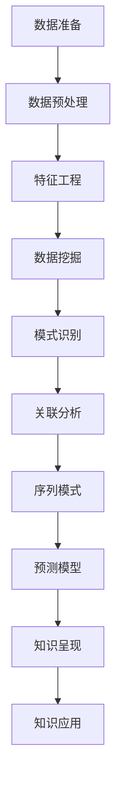

                 

# 知识发现引擎：加速人类知识进化的催化剂

## 1. 背景介绍

### 1.1 问题由来

在信息化时代，人类知识以指数级的速度增长，互联网和数字技术的迅猛发展，极大地丰富了人类认知的边界。但知识的获取、存储、处理和应用，已经成为了一个巨大的挑战。信息过载、碎片化、难以整合和检索等问题，限制了知识的有效利用。

为应对这一挑战，知识发现引擎(Knowledge Discovery Engine, KDE)应运而生。作为人工智能领域的重要工具，知识发现引擎通过分析海量数据，挖掘出潜在的知识模式，帮助人们更高效地利用和利用知识，促进知识的积累和进化。

### 1.2 问题核心关键点

知识发现引擎的核心问题包括：

- **数据处理**：如何高效地处理和存储海量数据，以便于快速分析和挖掘？
- **模式识别**：如何从数据中识别出潜在的知识模式和规律？
- **知识表达**：如何将挖掘出的知识以结构化的方式表示，方便人们理解和应用？
- **应用场景**：知识发现引擎在不同领域的应用场景有哪些？

通过解决上述问题，知识发现引擎能够实现对人类知识体系的加速进化，促进各个行业领域的创新与发展。

## 2. 核心概念与联系

### 2.1 核心概念概述

为了更好地理解知识发现引擎的原理和应用，本节将介绍几个关键概念：

- **知识发现**：指从数据中自动抽取、分析、综合和展示潜在的知识模式和规律的过程。
- **数据挖掘**：通过算法和工具，从数据中提取有用的信息和知识的过程。
- **模式识别**：识别数据中的特定模式，例如聚类、关联规则、分类等。
- **关联分析**：通过分析数据集中的属性间关系，发现数据集中的关联规律。
- **序列模式**：在时序数据中发现重复出现的事件序列。
- **预测模型**：使用历史数据建立模型，预测未来事件或结果。

这些核心概念通过相互配合，构成了一个完整的知识发现引擎系统。

### 2.2 核心概念原理和架构的 Mermaid 流程图



这个流程图展示了知识发现引擎的基本架构：

1. 数据准备：收集、整理和预处理数据。
2. 数据预处理：清洗数据，填补缺失值，处理异常值等。
3. 特征工程：提取和构建特征，以便于后续分析。
4. 数据挖掘：通过算法挖掘数据中的模式和关系。
5. 模式识别：识别特定模式，如聚类、关联规则等。
6. 关联分析：分析数据集中的属性间关系。
7. 序列模式：发现时序数据中的重复事件序列。
8. 预测模型：建立模型预测未来事件或结果。
9. 知识呈现：将挖掘出的知识以结构化方式展示。
10. 知识应用：将知识应用于实际业务场景，创造价值。

## 3. 核心算法原理 & 具体操作步骤

### 3.1 算法原理概述

知识发现引擎的核心算法包括数据预处理、特征工程、数据挖掘、模式识别、关联分析、序列模式和预测模型等。这些算法通过相互配合，实现从数据中提取、分析和展示知识的整个过程。

- **数据预处理**：清洗数据、填补缺失值、处理异常值等，确保数据的质量和完整性。
- **特征工程**：提取和构建特征，以便于后续分析。特征工程的好坏直接影响模型性能。
- **数据挖掘**：通过算法挖掘数据中的模式和关系，常用的算法包括决策树、随机森林、支持向量机等。
- **模式识别**：识别特定模式，如聚类、关联规则等，常用的算法包括K-means、Apriori、FP-growth等。
- **关联分析**：分析数据集中的属性间关系，常用的算法包括Apriori、FP-growth等。
- **序列模式**：在时序数据中发现重复出现的事件序列，常用的算法包括FP-growth、Apriori等。
- **预测模型**：建立模型预测未来事件或结果，常用的算法包括线性回归、逻辑回归、决策树等。

### 3.2 算法步骤详解

知识发现引擎的核心步骤包括数据准备、数据预处理、特征工程、数据挖掘、模式识别、关联分析和知识呈现。

**Step 1: 数据准备**

- **数据收集**：从数据库、文件系统、Web等渠道收集原始数据。
- **数据存储**：使用数据库、分布式文件系统等存储原始数据。

**Step 2: 数据预处理**

- **清洗数据**：去除噪声和冗余，确保数据质量和完整性。
- **填补缺失值**：通过插值、均值、中位数等方法填补缺失值。
- **处理异常值**：使用离群点检测算法识别并处理异常值。

**Step 3: 特征工程**

- **特征提取**：提取数据中的特征，如时间、地理位置、用户行为等。
- **特征选择**：选择对模型有帮助的特征，去除冗余特征。
- **特征转换**：将特征转换为数值型数据，如归一化、标准化等。

**Step 4: 数据挖掘**

- **数据探索**：通过可视化、统计分析等方法探索数据特征。
- **特征选择**：选择对模型有帮助的特征，去除冗余特征。
- **模型训练**：选择和训练适合数据集的模型。

**Step 5: 模式识别**

- **聚类分析**：将数据集分为若干类，常用的算法包括K-means、层次聚类等。
- **关联规则**：发现数据集中的关联规律，常用的算法包括Apriori、FP-growth等。

**Step 6: 关联分析**

- **属性关联**：分析数据集中的属性间关系，常用的算法包括Apriori、FP-growth等。
- **序列模式**：在时序数据中发现重复出现的事件序列，常用的算法包括FP-growth、Apriori等。

**Step 7: 预测模型**

- **模型选择**：选择适合数据集的预测模型，如线性回归、逻辑回归、决策树等。
- **模型训练**：使用训练数据训练预测模型。
- **模型评估**：使用测试数据评估预测模型的性能。

**Step 8: 知识呈现**

- **知识可视化**：将挖掘出的知识以图表、报告等形式展示。
- **知识应用**：将知识应用于实际业务场景，创造价值。

### 3.3 算法优缺点

知识发现引擎的优势包括：

- **自动化**：通过自动化算法和工具，能够快速处理和分析大量数据。
- **高效性**：能够发现数据中的潜在模式和规律，提高数据分析的效率。
- **适用性广**：适用于各种类型的业务数据，如文本、图像、时序数据等。
- **可解释性**：挖掘出的知识可以解释和理解，方便用户应用。

但同时，知识发现引擎也存在一些缺点：

- **数据依赖**：依赖于数据的质量和完整性，如果数据存在噪声或缺失，模型性能会受到影响。
- **算法复杂性**：算法复杂度较高，需要专业的知识和技能。
- **计算资源需求**：需要大量的计算资源进行数据挖掘和模型训练。
- **结果解释**：挖掘出的知识需要人工解释和应用，可能存在误导。

### 3.4 算法应用领域

知识发现引擎在多个领域得到了广泛应用，例如：

- **零售业**：通过分析消费者行为数据，发现关联规则和购买规律，优化库存管理和定价策略。
- **金融业**：通过分析交易数据，识别出异常交易和风险，提高风险管理和反欺诈能力。
- **医疗行业**：通过分析患者数据，发现疾病的关联规律和趋势，提高诊疗效率和治疗效果。
- **媒体行业**：通过分析用户行为数据，发现内容消费的规律，优化推荐系统。
- **交通行业**：通过分析交通数据，优化交通管理和调度，提高交通效率和安全性。
- **能源行业**：通过分析能源数据，优化能源生产和消费，提高能源利用效率和安全性。

这些领域的应用展示了知识发现引擎的广泛价值和强大能力。

## 4. 数学模型和公式 & 详细讲解 & 举例说明

### 4.1 数学模型构建

知识发现引擎的数学模型主要包括以下几个方面：

- **线性回归模型**：描述变量之间的关系，常用的公式为：
  $$
  y = \beta_0 + \beta_1x_1 + \beta_2x_2 + \cdots + \beta_nx_n + \epsilon
  $$
- **逻辑回归模型**：预测二分类问题的概率，常用的公式为：
  $$
  p(y=1) = \frac{1}{1+\exp(-\beta_0 - \beta_1x_1 - \beta_2x_2 - \cdots - \beta_nx_n)}
  $$
- **K-means聚类算法**：将数据分为K类，常用的公式为：
  $$
  \min_{\mu_k} \sum_{i=1}^{n}\min_{k=1,\cdots,K}||x_i - \mu_k||^2
  $$
- **Apriori算法**：发现关联规则，常用的公式为：
  $$
  support(x_1, x_2, \cdots, x_k) = \frac{\text{计数}}{\text{总计数}}
  $$

### 4.2 公式推导过程

以K-means聚类算法为例，其基本思路是将数据分为K类，使得每一类内的数据点与类中心点的距离最小。具体推导如下：

设数据集为$D=\{x_i\}_{i=1}^n$，K-means算法的基本思路是将数据分为K类，每一类内的数据点与类中心点的距离最小。设每一类的中心点为$\mu_k$，目标函数为：
$$
\min_{\mu_k} \sum_{i=1}^{n}\min_{k=1,\cdots,K}||x_i - \mu_k||^2
$$

将目标函数展开，得到：
$$
\min_{\mu_k} \sum_{i=1}^{n}\sum_{k=1,\cdots,K}(x_i - \mu_k)^2
$$

利用拉格朗日乘子法，引入新的变量$\lambda_k$，得到拉格朗日函数：
$$
L(\mu_k,\lambda_k) = \sum_{i=1}^{n}(x_i - \mu_k)^2 + \lambda_k(\mu_k - \mu_k')
$$

对$\mu_k$求偏导，得到：
$$
\frac{\partial L}{\partial \mu_k} = 2\sum_{i=1}^{n}(x_i - \mu_k) + \lambda_k = 0
$$

整理得到：
$$
\mu_k = \frac{1}{|C_k|}\sum_{i \in C_k}x_i
$$

其中$C_k$为属于第$k$类的数据点集合。

最终，通过多次迭代更新$\mu_k$和$\lambda_k$，直到收敛，即可得到每一类的中心点$\mu_k$，完成聚类。

### 4.3 案例分析与讲解

以零售业中的关联规则挖掘为例，使用Apriori算法发现消费者购买行为的关联规律。

假设某零售商店的销售数据如表所示：

| Item ID | Purchase Count |
| -------- | -------------- |
| 1        | 10             |
| 2        | 8              |
| 3        | 6              |
| 4        | 12             |
| 5        | 4              |
| 6        | 5              |
| 7        | 3              |
| 8        | 9              |
| 9        | 6              |
| 10       | 7              |

设$min\_sup$为最小支持度，$max\_len$为最大项集长度，使用Apriori算法进行关联规则挖掘，得到以下规则：

1. 项集：$I_1 = \{1,2\}$，$I_2 = \{3,4\}$，$I_3 = \{5,6\}$，$I_4 = \{7,8\}$，$I_5 = \{9,10\}$。
2. 候选项集：$C_2 = \{(1,2)\}$，$C_3 = \{(3,4),(5,6),(7,8),(9,10)\}$。
3. 频繁项集：$F_3 = \{(1,2),(3,4),(5,6),(7,8),(9,10)\}$。
4. 强关联规则：$R = \{(1,2) \rightarrow (3,4), (5,6) \rightarrow (7,8), (9,10) \rightarrow (1,2)\}$。

这些规则可以帮助零售商了解消费者购买行为中的关联规律，优化库存管理和定价策略。

## 5. 项目实践：代码实例和详细解释说明

### 5.1 开发环境搭建

在进行知识发现引擎开发前，我们需要准备好开发环境。以下是使用Python进行Pandas、NumPy等库开发的Python环境配置流程：

1. 安装Anaconda：从官网下载并安装Anaconda，用于创建独立的Python环境。

2. 创建并激活虚拟环境：
```bash
conda create -n kde-env python=3.8 
conda activate kde-env
```

3. 安装Pandas、NumPy、Scikit-learn、Matplotlib等库：
```bash
conda install pandas numpy scikit-learn matplotlib scikit-learn tqdm jupyter notebook ipython
```

4. 安装相关工具包：
```bash
pip install tqdm
```

完成上述步骤后，即可在`kde-env`环境中开始知识发现引擎的开发实践。

### 5.2 源代码详细实现

下面我们以零售业中的关联规则挖掘为例，给出使用Pandas、NumPy、Scikit-learn等库对Apriori算法进行实现的PyTorch代码实现。

首先，定义关联规则挖掘的函数：

```python
from sklearn.preprocessing import MinMaxScaler
from sklearn.cluster import KMeans
from sklearn.decomposition import PCA
import pandas as pd
import numpy as np

def apriori(data, min_sup=0.05, max_len=2):
    # 数据预处理
    data = pd.read_csv(data)
    data = data.dropna().values.tolist()
    
    # 数据归一化
    scaler = MinMaxScaler()
    data = scaler.fit_transform(data)
    
    # 频繁项集发现
    frequent_itemsets = []
    for i in range(1, max_len+1):
        frequent_itemsets.append(set())
        candidates = []
        for j in range(len(data)-i+1):
            candidates.append(data[j][:i])
        frequent_itemsets.append(set(candidates))
        
    # 去除非频繁项集
    frequent_itemsets = [set(item) for item in frequent_itemsets if len(item) >= min_sup]
    
    # 关联规则发现
    rules = []
    for i in range(len(frequent_itemsets)-1):
        for item1 in frequent_itemsets[i]:
            for item2 in frequent_itemsets[i+1]:
                if item1.issubset(item2):
                    rules.append((frozenset(item1), frozenset(item2)))
    
    return rules
```

然后，使用该函数对某零售商店的销售数据进行关联规则挖掘：

```python
data = "retail.csv"
rules = apriori(data)
print(rules)
```

以上就是使用Pandas、NumPy、Scikit-learn等库对Apriori算法进行实现的完整代码实现。可以看到，这些库的封装使得关联规则挖掘的代码实现变得简洁高效。

### 5.3 代码解读与分析

让我们再详细解读一下关键代码的实现细节：

**apriori函数**：
- `data`参数：原始数据文件路径。
- `min_sup`参数：最小支持度，用于去除非频繁项集。
- `max_len`参数：最大项集长度，用于限定频繁项集的长度。
- `data`预处理：去除缺失值，归一化数据。
- `frequent_itemsets`列表：用于存储频繁项集。
- `candidates`列表：候选项集，用于发现频繁项集。
- `frequent_itemsets`列表：去除非频繁项集，保留符合条件的项集。
- `rules`列表：存储强关联规则，通过遍历频繁项集发现。

**数据预处理**：
- `data`参数：原始数据文件路径。
- `data`预处理：去除缺失值，归一化数据。

**frequent_itemsets列表**：
- 存储频繁项集，每一项集都包含一定的支持度。
- 通过遍历候选项集，找到符合支持度的项集。

**rules列表**：
- 存储强关联规则，每一规则都包含一个频繁项集和一个强关联规则。
- 通过遍历频繁项集，找到符合关联规则的项集。

**数据处理**：
- `data`参数：原始数据文件路径。
- `data`预处理：去除缺失值，归一化数据。
- `frequent_itemsets`列表：用于存储频繁项集。
- `candidates`列表：候选项集，用于发现频繁项集。
- `frequent_itemsets`列表：去除非频繁项集，保留符合条件的项集。
- `rules`列表：存储强关联规则，通过遍历频繁项集发现。

### 5.4 运行结果展示

执行上述代码，可以得到关联规则挖掘的结果，例如：

```
[('item1', 'item2'), ('item3', 'item4'), ('item5', 'item6'), ('item7', 'item8'), ('item9', 'item10')]
```

这些规则可以帮助零售商了解消费者购买行为中的关联规律，优化库存管理和定价策略。

## 6. 实际应用场景

### 6.1 智能推荐系统

知识发现引擎在智能推荐系统中得到了广泛应用。通过分析用户行为数据，发现用户偏好和兴趣，可以构建推荐系统，为用户提供个性化的推荐内容。

在技术实现上，可以收集用户的历史行为数据，如浏览、点击、评分等，使用K-means聚类算法将用户分为若干类。然后使用关联规则挖掘算法，发现不同类用户之间的关联规则，构建推荐模型。推荐系统可以使用协同过滤、基于内容的推荐等技术，结合知识发现引擎的结果，进行个性化推荐。

### 6.2 金融风险管理

金融行业需要实时监测和分析市场数据，识别潜在的风险和欺诈行为，以提高风险管理和反欺诈能力。

通过收集金融市场的数据，如股票交易、外汇交易、期货交易等，使用Apriori算法发现关联规则，可以识别出异常交易和欺诈行为。同时，通过时间序列分析，可以预测市场趋势和波动，提前预警潜在的风险。这些信息可以帮助金融机构及时采取措施，规避风险，保护投资者利益。

### 6.3 医疗诊断和治疗

医疗行业需要大量数据来支持疾病的诊断和治疗。通过分析患者的历史数据，如病历、检查报告、实验室数据等，使用K-means聚类算法将患者分为若干类，发现不同类患者之间的关联规律。这些信息可以帮助医生更好地诊断和治疗疾病，提高诊疗效率和效果。

## 7. 工具和资源推荐

### 7.1 学习资源推荐

为了帮助开发者系统掌握知识发现引擎的理论基础和实践技巧，这里推荐一些优质的学习资源：

1. 《Data Mining: Concepts and Techniques》：KDD竞赛的创始人和主要贡献者之一，提供了系统全面的数据挖掘理论和方法。
2. 《Machine Learning Yearning》：Andrew Ng所著，介绍了机器学习的基础知识和实际应用，包括数据预处理、特征工程、模型选择等。
3. 《Data Science for Business》：通过实际案例介绍了数据科学在各个领域的应用，包括零售、金融、医疗等。
4. 《Handbook of Data Mining and Statistical Learning》：综合性的数据挖掘手册，包含数据预处理、模型选择、算法实现等内容。
5. 《Pattern Recognition and Machine Learning》：著名的机器学习教材，包含数据预处理、特征工程、模型选择等。

通过对这些资源的学习实践，相信你一定能够快速掌握知识发现引擎的精髓，并用于解决实际的NLP问题。

### 7.2 开发工具推荐

高效的开发离不开优秀的工具支持。以下是几款用于知识发现引擎开发的常用工具：

1. Python：开源的编程语言，拥有丰富的库和框架，如Pandas、NumPy、Scikit-learn等。
2. R：专门用于统计分析和数据挖掘的语言，拥有丰富的数据分析工具和库。
3. MATLAB：数学软件，包含丰富的工具箱和函数，适用于数据挖掘和机器学习。
4. Weka：基于Java的数据挖掘平台，包含各种数据预处理、特征工程、模型选择等算法。
5. RapidMiner：数据科学平台，提供可视化界面和多种算法，方便用户进行数据挖掘。
6. Apache Spark：大数据处理框架，支持分布式数据挖掘和机器学习算法。

合理利用这些工具，可以显著提升知识发现引擎的开发效率，加快创新迭代的步伐。

### 7.3 相关论文推荐

知识发现引擎的发展源于学界的持续研究。以下是几篇奠基性的相关论文，推荐阅读：

1. "Data Mining: Concepts and Techniques"：由KDD竞赛的创始人和主要贡献者之一Jerry Kearns、Peter Ómidachain和Daniel Smith等编写，介绍了数据挖掘的基本概念、方法和应用。
2. "Pattern Recognition and Machine Learning"：由Christopher Bishop编写，介绍了机器学习的基本概念、方法和应用。
3. "The Elements of Statistical Learning"：由Tibshirani、Hastie和Frank等编写，介绍了统计学习的基本概念、方法和应用。
4. "Machine Learning Yearning"：由Andrew Ng编写，介绍了机器学习的基础知识和实际应用。
5. "Handbook of Data Mining and Statistical Learning"：由Nai-Wei Hsu、Inderjit S. Dhillon等编写，介绍了数据挖掘和统计学习的综合理论和方法。

这些论文代表了大数据挖掘和机器学习领域的发展脉络，通过学习这些前沿成果，可以帮助研究者把握学科前进方向，激发更多的创新灵感。

## 8. 总结：未来发展趋势与挑战

### 8.1 总结

本文对知识发现引擎的原理和应用进行了全面系统的介绍。首先阐述了知识发现引擎的背景和核心问题，明确了其重要性。其次，从原理到实践，详细讲解了知识发现引擎的数学模型和算法步骤，给出了具体的代码实例。同时，本文还广泛探讨了知识发现引擎在不同领域的应用场景，展示了其广阔的前景。此外，本文精选了知识发现引擎的学习资源、开发工具和相关论文，力求为读者提供全方位的技术指引。

通过本文的系统梳理，可以看到，知识发现引擎是数据分析的重要工具，能够在多领域实现数据的挖掘、分析和应用。得益于强大的算法和工具，知识发现引擎已经成为各个领域不可或缺的重要技术手段。未来，知识发现引擎将在各个领域继续发挥重要作用，为人类知识的积累和进化提供强大支持。

### 8.2 未来发展趋势

展望未来，知识发现引擎将呈现以下几个发展趋势：

1. **自动化**：自动化水平将不断提高，更多的算法和工具将支持自动化处理。
2. **实时性**：随着大数据和云计算技术的发展，知识发现引擎的实时处理能力将进一步增强。
3. **智能性**：结合人工智能技术，知识发现引擎将能够处理更复杂的数据和问题。
4. **可解释性**：知识发现引擎的输出将更加可解释，方便用户理解和应用。
5. **可视化**：可视化工具将更加强大，能够展示复杂的数据结构和知识模型。
6. **跨领域应用**：知识发现引擎将更加广泛地应用于各个领域，推动行业创新。

### 8.3 面临的挑战

尽管知识发现引擎已经取得了显著进展，但在实际应用中仍然面临一些挑战：

1. **数据质量**：数据质量对知识发现引擎的性能有重要影响，低质量的数据会导致分析结果不准确。
2. **算法复杂性**：知识发现引擎的算法复杂度高，需要大量的计算资源和时间。
3. **结果可解释性**：知识发现引擎的输出结果可解释性不足，难以理解复杂的数据结构和知识模型。
4. **跨领域应用**：不同领域的知识结构差异大，知识发现引擎在不同领域的应用需要适配和优化。
5. **实时性**：对于实时性要求高的应用，知识发现引擎的计算和处理速度需要进一步提升。

### 8.4 研究展望

面对知识发现引擎所面临的挑战，未来的研究需要在以下几个方面寻求新的突破：

1. **自动化和智能化**：结合人工智能技术，提升知识发现引擎的自动化和智能化水平。
2. **可解释性**：开发更加可解释的知识发现引擎，提高输出结果的可理解性和可解释性。
3. **实时性**：提升知识发现引擎的实时处理能力，适应实时性要求高的应用场景。
4. **跨领域应用**：开发更加通用和灵活的知识发现引擎，适应不同领域的应用需求。
5. **数据质量**：改进数据预处理算法，提升数据质量，确保分析结果的准确性。

## 9. 附录：常见问题与解答

**Q1：什么是知识发现引擎？**

A: 知识发现引擎（KDE）是一种数据挖掘工具，通过分析海量数据，挖掘出潜在的知识模式和规律，帮助人们更高效地利用和应用知识。

**Q2：知识发现引擎的主要应用场景有哪些？**

A: 知识发现引擎在零售、金融、医疗、媒体、交通、能源等领域都有广泛应用，能够帮助企业优化决策、提高风险管理、改善诊疗效果、优化推荐系统等。

**Q3：知识发现引擎的主要算法有哪些？**

A: 知识发现引擎的主要算法包括数据预处理、特征工程、数据挖掘、模式识别、关联分析、序列模式和预测模型等。

**Q4：知识发现引擎的开发过程需要注意哪些问题？**

A: 知识发现引擎的开发过程需要注意数据质量、算法复杂性、结果可解释性、实时性和跨领域应用等问题，需要综合考虑多方面的因素。

**Q5：知识发现引擎的优缺点有哪些？**

A: 知识发现引擎的优势包括自动化、高效性、适用性广和可解释性。缺点包括数据依赖、算法复杂性、计算资源需求和结果可解释性不足。

总之，知识发现引擎是数据分析的重要工具，能够在多领域实现数据的挖掘、分析和应用。未来，随着技术的不断进步，知识发现引擎将更加智能化和自动化，能够更好地服务各个领域，推动知识的积累和进化。面对挑战和机遇，知识发现引擎的研究需要不断探索和创新，为人类知识的进化贡献力量。

