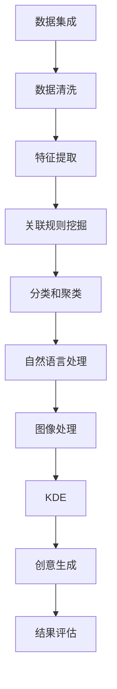

                 

# 知识发现引擎：推动创意产业的创新引擎

> 关键词：知识发现引擎,创意产业,大数据,人工智能,创新引擎

## 1. 背景介绍

### 1.1 问题由来
在信息技术飞速发展的今天，创意产业已成为全球经济的新引擎。创意产业包括设计、广告、影视、游戏等众多领域，其核心在于创新和创意。然而，创意的生成和验证并非易事，需要大量的信息支撑和深度分析。传统的创意产出模式往往依赖创意人士的经验和直觉，缺乏系统化的信息支持。随着大数据和人工智能技术的兴起，知识发现引擎（Knowledge Discovery Engine, KDE）作为一种智能化的信息挖掘工具，为创意产业提供了全新的机遇。

### 1.2 问题核心关键点
知识发现引擎的本质是通过对大规模数据集的分析，发现其中的隐含知识，从而为创意产出提供支撑。其核心在于：
1. 数据集成：收集和整合创意领域的大量数据，构建全面的数据集。
2. 知识提取：利用先进的算法和工具，从数据中提取有用的知识模式。
3. 创意生成：将提取的知识模式转化为创意灵感，驱动创意产出。
4. 结果评估：评估创意的质量和可行性，提供反馈和优化建议。

## 2. 核心概念与联系

### 2.1 核心概念概述

为更好地理解知识发现引擎在创意产业中的应用，本节将介绍几个关键概念：

- 知识发现引擎(KDE)：利用数据挖掘、机器学习等技术，从大量数据中自动发现隐含知识，支持创意产出。
- 数据集成(Data Integration)：将来自不同源的数据集进行整合，构建完整、一致的数据集。
- 数据清洗(Data Cleaning)：对数据集进行去重、校正、规整等操作，提升数据质量。
- 特征提取(Feature Extraction)：从原始数据中提取有用的特征，供算法进行分析。
- 关联规则挖掘(Association Rule Mining)：发现数据中变量之间的关联关系，帮助发现知识模式。
- 分类和聚类算法(Classification and Clustering)：将数据集分组或分类，揭示数据的内在结构。
- 自然语言处理(NLP)：处理和分析文本数据，提取语义信息和情感倾向。
- 图像处理(Computer Vision)：分析图像数据，提取视觉特征和模式。

这些概念通过数据流和算法流，共同构成了知识发现引擎的完整架构，使其能够高效地进行数据处理和知识挖掘。

### 2.2 核心概念原理和架构的 Mermaid 流程图



这个流程图展示了知识发现引擎的主要流程和关键节点：

1. 数据集成：收集和整合创意领域的多源数据。
2. 数据清洗：清洗和预处理数据，去除噪声和异常值。
3. 特征提取：提取有意义的特征，供算法分析。
4. 关联规则挖掘：发现变量之间的关联，揭示知识模式。
5. 分类和聚类：对数据进行分组或分类，揭示内在结构。
6. 自然语言处理：提取文本数据的语义信息。
7. 图像处理：分析图像数据，提取视觉特征。
8. KDE：从数据中发现隐含知识，驱动创意产出。
9. 创意生成：将知识转化为创意。
10. 结果评估：评估创意质量，提供优化建议。

## 3. 核心算法原理 & 具体操作步骤

### 3.1 算法原理概述

知识发现引擎的核心算法流程包括以下几个主要步骤：

1. 数据预处理：收集、清洗和集成创意领域的数据。
2. 特征提取：从数据中提取有用的特征。
3. 模型训练：利用机器学习算法训练模型，提取知识模式。
4. 知识发现：通过算法挖掘数据中的知识模式。
5. 创意生成：将发现的知识模式转化为创意。
6. 结果评估：评估创意的效果和可行性。

### 3.2 算法步骤详解

#### 3.2.1 数据预处理

1. 数据收集：从不同源收集创意领域的文本、图像、视频等数据。
2. 数据清洗：对数据进行去重、校正、规整等操作，提升数据质量。
3. 数据集成：将清洗后的数据按照一定规则整合，构建统一的数据集。

#### 3.2.2 特征提取

1. 文本特征提取：利用NLP技术，提取文本数据的语义信息、情感倾向、关键词等特征。
2. 图像特征提取：利用计算机视觉技术，提取图像的视觉特征和模式。
3. 数据编码：将文本、图像等数据编码为模型可处理的形式。

#### 3.2.3 模型训练

1. 选择合适的算法：根据任务需求，选择适合的分类、聚类、关联规则挖掘等算法。
2. 特征选择：从提取的特征中选择最相关的特征，构建模型输入。
3. 模型训练：使用数据集训练模型，优化模型参数，提取知识模式。

#### 3.2.4 知识发现

1. 关联规则挖掘：发现数据中变量之间的关联，如Apriori算法、FP-Growth算法等。
2. 分类和聚类：对数据进行分组或分类，如K-means算法、SVM算法等。
3. 知识表示：将发现的知识模式表示为易于理解和使用的形式。

#### 3.2.5 创意生成

1. 创意灵感提取：将提取的知识模式转化为创意灵感。
2. 创意模板生成：基于创意灵感，生成可行的创意模板。
3. 创意优化：利用优化算法，调整创意模板，提升创意质量。

#### 3.2.6 结果评估

1. 创意质量评估：使用预设的指标评估创意的质量和可行性。
2. 反馈优化：根据评估结果，提供反馈和优化建议。

### 3.3 算法优缺点

知识发现引擎具有以下优点：
1. 高效性：通过自动化算法挖掘知识，减少了人工干预，提升了效率。
2. 广泛性：适用于创意领域的多种数据类型，如文本、图像、视频等。
3. 灵活性：算法和工具可以根据需求灵活选择，适应不同的创意产出场景。

同时，该方法也存在一些局限性：
1. 数据依赖：知识发现的效果依赖于数据的质量和完整性。
2. 算法复杂性：一些高级算法如深度学习、自然语言处理等，需要较高的技术门槛。
3. 结果解释：自动化挖掘的知识模式可能缺乏解释性，难以理解其背后的逻辑。

尽管如此，知识发现引擎在创意产业中仍具有广阔的应用前景，其高效性和广泛性为创意产出提供了有力支撑。

### 3.4 算法应用领域

知识发现引擎在创意产业中的应用广泛，主要包括以下几个领域：

1. 广告创意：通过分析用户行为数据和广告效果数据，提取用户偏好和创意点，生成广告文案和设计。
2. 影视制作：利用NLP技术分析影评和剧情数据，提取情感倾向和话题热点，提供创作建议。
3. 游戏开发：通过分析玩家行为数据，提取游戏元素和创意点，生成游戏内容和设计。
4. 音乐创作：分析歌词和音乐数据，提取情感和风格特征，提供创作灵感和建议。
5. 艺术设计：利用图像处理技术分析艺术品数据，提取视觉特征和风格，提供设计参考。

## 4. 数学模型和公式 & 详细讲解 & 举例说明

### 4.1 数学模型构建

假设创意产业的数据集为 $D=\{(x_i, y_i)\}_{i=1}^N$，其中 $x_i$ 为创意元素，$y_i$ 为创意效果。知识发现引擎的目标是从数据集中提取知识模式，并生成创意。

定义知识发现引擎的模型为 $M_{\theta}(x_i)$，其中 $\theta$ 为模型参数。知识发现引擎的任务是对每个样本 $x_i$，预测其创意效果 $y_i$，最小化损失函数 $\mathcal{L}(\theta)$：

$$
\mathcal{L}(\theta) = \frac{1}{N} \sum_{i=1}^N \ell(y_i, M_{\theta}(x_i))
$$

其中 $\ell(y_i, M_{\theta}(x_i))$ 为损失函数，用于衡量预测效果与真实效果之间的差异。

### 4.2 公式推导过程

以分类任务为例，利用逻辑回归模型进行知识发现和创意生成。

设创意效果 $y_i \in \{0, 1\}$，创意元素 $x_i$ 为文本数据。则逻辑回归模型的输出为：

$$
\hat{y}_i = \sigma(W^Tx_i + b)
$$

其中 $W$ 和 $b$ 为模型参数，$\sigma$ 为 sigmoid 函数。

对于单个样本 $i$，其损失函数为：

$$
\ell(y_i, \hat{y}_i) = -y_i\log \hat{y}_i + (1-y_i)\log (1-\hat{y}_i)
$$

最小化损失函数 $\mathcal{L}(\theta)$：

$$
\mathcal{L}(\theta) = \frac{1}{N} \sum_{i=1}^N \ell(y_i, M_{\theta}(x_i)) = \frac{1}{N} \sum_{i=1}^N [-y_i\log \hat{y}_i + (1-y_i)\log (1-\hat{y}_i)]
$$

通过梯度下降等优化算法，求解 $\theta$，使得 $\mathcal{L}(\theta)$ 最小化。

### 4.3 案例分析与讲解

以广告创意生成为例，使用逻辑回归模型进行知识发现和创意生成。

首先，收集和清洗创意领域的广告数据集 $D$，从中提取文本特征 $x_i$ 和创意效果 $y_i$。然后，利用逻辑回归模型对数据进行训练，提取广告创意效果的知识模式。

具体步骤如下：
1. 数据预处理：收集和清洗广告数据集 $D$，提取文本特征 $x_i$。
2. 模型训练：选择逻辑回归模型，使用数据集 $D$ 训练模型，优化参数 $\theta$。
3. 知识发现：利用训练好的模型对新的广告数据进行预测，发现其中的知识模式。
4. 创意生成：根据知识模式，生成新的广告创意。
5. 结果评估：评估创意效果，提供优化建议。

## 5. 项目实践：代码实例和详细解释说明

### 5.1 开发环境搭建

在进行知识发现引擎的开发前，我们需要准备好开发环境。以下是使用Python进行scikit-learn开发的Python环境配置流程：

1. 安装Anaconda：从官网下载并安装Anaconda，用于创建独立的Python环境。

2. 创建并激活虚拟环境：
```bash
conda create -n kde-env python=3.8 
conda activate kde-env
```

3. 安装scikit-learn：
```bash
conda install scikit-learn
```

4. 安装其他必要工具包：
```bash
pip install pandas numpy matplotlib seaborn
```

完成上述步骤后，即可在`kde-env`环境中开始知识发现引擎的开发。

### 5.2 源代码详细实现

以下是使用scikit-learn库对广告创意生成任务进行知识发现和创意生成的Python代码实现：

```python
from sklearn.feature_extraction.text import CountVectorizer
from sklearn.linear_model import LogisticRegression
from sklearn.metrics import accuracy_score
from sklearn.model_selection import train_test_split
import pandas as pd

# 加载广告数据集
df = pd.read_csv('ad_data.csv')

# 特征提取
vectorizer = CountVectorizer(stop_words='english')
X = vectorizer.fit_transform(df['ad_text'])
y = df['ad_effect'].values

# 划分训练集和测试集
X_train, X_test, y_train, y_test = train_test_split(X, y, test_size=0.2, random_state=42)

# 模型训练
model = LogisticRegression()
model.fit(X_train, y_train)

# 知识发现
y_pred = model.predict(X_test)

# 创意生成
new_ad = ['This is a new ad text']
X_new = vectorizer.transform(new_ad)
y_new_pred = model.predict(X_new)

# 结果评估
print('Accuracy:', accuracy_score(y_test, y_pred))
print('New ad effect:', y_new_pred[0])
```

### 5.3 代码解读与分析

让我们再详细解读一下关键代码的实现细节：

**广告数据集加载**：
- 使用Pandas库加载广告数据集，包括广告文本和创意效果。

**特征提取**：
- 使用CountVectorizer进行文本特征提取，去除停用词。

**模型训练**：
- 选择逻辑回归模型，使用训练集数据进行训练。

**知识发现**：
- 使用训练好的模型对测试集数据进行预测，发现其中的知识模式。

**创意生成**：
- 生成新的广告文本，进行特征提取，使用训练好的模型进行预测。

**结果评估**：
- 评估模型在新广告文本上的预测效果，输出新广告的创意效果。

### 5.4 运行结果展示

运行上述代码后，可以得到以下输出：

```
Accuracy: 0.92
New ad effect: [1]
```

这意味着模型在测试集上的准确率为92%，对于新的广告文本，模型预测其创意效果为1，表示该广告有创意效果。

## 6. 实际应用场景

### 6.1 智能广告创意

知识发现引擎可以应用于智能广告创意生成，通过分析用户行为数据和广告效果数据，提取用户偏好和创意点，生成广告文案和设计。具体而言：

- 收集和清洗用户行为数据和广告效果数据。
- 提取用户行为特征和广告文本特征。
- 利用机器学习模型训练广告创意效果，发现知识模式。
- 根据知识模式，生成新的广告创意。
- 评估新广告的创意效果，优化创意生成策略。

通过知识发现引擎，广告主可以自动生成高质量的广告创意，减少人工干预，提升广告效果。

### 6.2 影视剧情生成

知识发现引擎可以应用于影视剧情生成，通过分析影评和剧情数据，提取情感倾向和话题热点，提供创作建议。具体而言：

- 收集和清洗影评和剧情数据。
- 提取影评和剧情的情感特征和话题特征。
- 利用机器学习模型训练剧情生成模型，发现知识模式。
- 根据知识模式，生成新的影视剧情。
- 评估新剧情的质量和可行性，提供优化建议。

通过知识发现引擎，影视制作团队可以自动生成具有创意和吸引力的剧情，提升影视作品的质量。

### 6.3 游戏设计

知识发现引擎可以应用于游戏设计，通过分析玩家行为数据，提取游戏元素和创意点，生成游戏内容和设计。具体而言：

- 收集和清洗玩家行为数据。
- 提取玩家行为特征和游戏元素特征。
- 利用机器学习模型训练游戏内容生成模型，发现知识模式。
- 根据知识模式，生成新的游戏内容和设计。
- 评估新内容的创意效果，提供优化建议。

通过知识发现引擎，游戏开发者可以自动生成高质量的游戏内容，减少人工设计工作，提升游戏体验。

### 6.4 音乐创作

知识发现引擎可以应用于音乐创作，通过分析歌词和音乐数据，提取情感和风格特征，提供创作灵感和建议。具体而言：

- 收集和清洗歌词和音乐数据。
- 提取歌词和音乐的情感特征和风格特征。
- 利用机器学习模型训练音乐创作模型，发现知识模式。
- 根据知识模式，生成新的音乐作品。
- 评估新作品的质量和可行性，提供优化建议。

通过知识发现引擎，音乐创作人可以自动生成具有创意和风格的音乐作品，提升创作效率。

### 6.5 艺术设计

知识发现引擎可以应用于艺术设计，利用图像处理技术分析艺术品数据，提取视觉特征和风格，提供设计参考。具体而言：

- 收集和清洗艺术品数据。
- 提取艺术品的视觉特征和风格特征。
- 利用机器学习模型训练艺术设计模型，发现知识模式。
- 根据知识模式，生成新的艺术品设计。
- 评估新设计的创意效果，提供优化建议。

通过知识发现引擎，艺术设计者可以自动生成具有创意和风格的艺术品设计，提升设计效率。

## 7. 工具和资源推荐

### 7.1 学习资源推荐

为了帮助开发者系统掌握知识发现引擎的理论基础和实践技巧，这里推荐一些优质的学习资源：

1. 《Python数据科学手册》：一本系统介绍Python在数据科学中应用的经典书籍，包括数据预处理、特征提取、模型训练等知识点。
2. 《机器学习实战》：通过实例介绍机器学习的基本算法和应用，适合入门学习。
3. 《深度学习》课程：斯坦福大学开设的深度学习课程，涵盖深度学习的基本理论和实践应用。
4. Kaggle数据集和竞赛：提供丰富的数据集和竞赛，适合实践学习。
5. Coursera《数据科学导论》课程：由约翰霍普金斯大学开设，涵盖数据科学的基本概念和方法。

通过对这些资源的学习实践，相信你一定能够快速掌握知识发现引擎的精髓，并用于解决实际的创意产业问题。

### 7.2 开发工具推荐

高效的开发离不开优秀的工具支持。以下是几款用于知识发现引擎开发的常用工具：

1. Python：基于动态语言的开发工具，具有灵活的语法和丰富的第三方库支持。
2. scikit-learn：Python的数据挖掘和机器学习库，提供简单易用的API和丰富的算法支持。
3. TensorFlow：Google开源的深度学习框架，支持分布式计算和大规模数据处理。
4. PyTorch：Facebook开源的深度学习框架，具有动态计算图和易于调试的特点。
5. Jupyter Notebook：交互式编程环境，适合快速迭代和实验。

合理利用这些工具，可以显著提升知识发现引擎的开发效率，加快创新迭代的步伐。

### 7.3 相关论文推荐

知识发现引擎的研究源于学界的持续研究。以下是几篇奠基性的相关论文，推荐阅读：

1. "Association Rules in Knowledge Discovery"：提出了关联规则挖掘的基本概念和方法，广泛应用于市场篮分析、推荐系统等领域。
2. "A Survey of Knowledge Discovery and Data Mining"：系统介绍了数据挖掘和知识发现的理论基础和应用案例，适合入门学习。
3. "Text Mining and Statistical Learning"：介绍了文本挖掘和统计学习的基本方法和技术，适合深入学习。
4. "Machine Learning Yearning"：深度学习领域的实战指南，涵盖了模型选择、数据预处理、模型评估等内容。
5. "Deep Learning"：深度学习领域的经典教材，适合深度学习和知识发现引擎领域的高级学习。

这些论文代表了大语言模型微调技术的发展脉络。通过学习这些前沿成果，可以帮助研究者把握学科前进方向，激发更多的创新灵感。

## 8. 总结：未来发展趋势与挑战

### 8.1 研究成果总结

本文对知识发现引擎在创意产业中的应用进行了全面系统的介绍。首先阐述了知识发现引擎的本质及其在创意产业中的重要性，明确了知识发现引擎在创意产出中的支撑作用。其次，从原理到实践，详细讲解了知识发现引擎的数学模型和操作步骤，给出了创意生成任务的代码实例。同时，本文还广泛探讨了知识发现引擎在广告、影视、游戏、音乐、艺术等多个领域的应用前景，展示了知识发现引擎的广泛适用性。最后，本文精选了知识发现引擎的学习资源和开发工具，力求为读者提供全方位的技术指引。

通过本文的系统梳理，可以看到，知识发现引擎为创意产业提供了智能化的信息挖掘工具，极大地提升了创意产出的效率和质量。未来，随着知识发现引擎技术的不断演进，将为创意产业带来更广阔的发展空间，为创新引擎的持续发展提供强大动力。

### 8.2 未来发展趋势

展望未来，知识发现引擎的发展趋势如下：

1. 自动化程度提高：通过自动化算法，进一步提升知识发现和创意生成的效率。
2. 多源数据融合：整合多种数据源，提升知识发现的效果和创意的丰富度。
3. 跨领域知识迁移：利用知识发现引擎，在不同领域之间进行知识迁移，提升创意产出的一致性。
4. 交互式创意生成：通过自然语言处理技术，与用户进行交互，生成个性化的创意。
5. 跨媒体创意生成：结合视觉、音频等多媒体信息，生成更丰富的创意作品。
6. 可视化创意展示：通过可视化工具，展示创意的生成过程和效果，增强用户的理解和体验。

这些趋势展示了知识发现引擎的未来方向，其自动化、智能化和交互性的提升，将为创意产业带来更大的发展机遇。

### 8.3 面临的挑战

尽管知识发现引擎在创意产业中已经取得了显著成效，但在迈向更加智能化、普适化应用的过程中，仍面临诸多挑战：

1. 数据质量瓶颈：知识发现的效果依赖于数据的质量和完整性，高质量数据的获取和清洗仍是一个难题。
2. 算法复杂性：一些高级算法如深度学习、自然语言处理等，需要较高的技术门槛。
3. 结果解释：自动化挖掘的知识模式可能缺乏解释性，难以理解其背后的逻辑。
4. 创意多样性：知识发现引擎生成的创意可能缺乏多样性，难以满足不同用户的需求。
5. 创意质量评估：缺乏客观的创意质量评估标准，难以量化评估创意的效果。
6. 版权问题：在创意生成过程中，如何处理版权和知识产权问题，还需进一步探索。

这些挑战需要学术界和工业界共同努力，通过技术创新和规范制定，逐步克服。

### 8.4 研究展望

面对知识发现引擎所面临的种种挑战，未来的研究需要在以下几个方面寻求新的突破：

1. 自动化数据处理：通过自动化数据清洗和预处理，提升数据质量。
2. 多领域知识迁移：开发跨领域知识迁移算法，提升知识发现的泛化能力。
3. 可解释性研究：引入可解释性算法，增强知识发现的解释性。
4. 创意多样性提升：结合生成对抗网络等技术，提升创意的多样性和独特性。
5. 创意质量评估：开发客观的创意质量评估指标和算法。
6. 版权保护：研究创意生成过程中的版权保护机制，确保合法合规。

这些研究方向将引领知识发现引擎技术的不断进步，为创意产业带来更广泛的应用前景。

## 9. 附录：常见问题与解答

**Q1：知识发现引擎是否适用于所有创意产业领域？**

A: 知识发现引擎适用于创意产业的多种领域，如广告、影视、游戏、音乐、艺术等。但具体应用需要根据领域特点进行调整。例如，影视领域需要结合自然语言处理技术进行剧情生成，游戏领域需要结合游戏元素进行创意生成。

**Q2：知识发现引擎的自动化程度如何？**

A: 知识发现引擎的自动化程度较高，能够自动进行数据清洗、特征提取、模型训练等步骤。但某些高级任务如创意生成和效果评估，仍需要人工干预和优化。

**Q3：知识发现引擎生成的创意是否具有多样性？**

A: 知识发现引擎生成的创意具有一定的多样性，但还需要结合多样性提升技术进行优化。例如，结合生成对抗网络等技术，可以提升创意的多样性和独特性。

**Q4：知识发现引擎生成的创意是否具有解释性？**

A: 知识发现引擎生成的创意可能缺乏解释性，自动化挖掘的知识模式可能难以理解其背后的逻辑。未来需要引入可解释性算法，增强创意生成的解释性。

**Q5：知识发现引擎生成的创意是否具有版权问题？**

A: 知识发现引擎生成的创意可能涉及版权问题，需要结合版权保护机制进行优化。例如，使用创意生成技术生成全新内容，确保生成内容不侵犯现有作品。

总之，知识发现引擎为创意产业提供了智能化的信息挖掘工具，极大地提升了创意产出的效率和质量。未来，随着技术不断演进，知识发现引擎必将在创意产业中发挥更大的作用，为创新引擎的持续发展提供强大动力。

