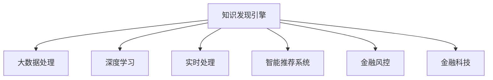

                 

# 知识发现引擎：推动金融行业的创新引擎

## 1. 背景介绍

在信息爆炸和金融市场波动的时代，金融行业对大数据分析和知识发现的需求日益增长。传统的数据挖掘方法已难以应对海量数据和高频交易带来的复杂性。知识发现引擎作为新一代金融科技的应用，通过智能算法和大数据技术，挖掘和提炼金融数据中的隐含知识，为金融机构提供深层次、实时的决策支持。

### 1.1 问题由来

金融行业面临的问题包括但不限于：

- 数据规模巨大且质量参差不齐，如何高效地清洗和预处理数据。
- 高频交易和复杂金融产品导致市场波动剧烈，如何准确地预测市场走势。
- 金融数据包含大量噪声和非结构化信息，如何有效地提取有用的知识。
- 市场情绪和舆情对金融市场有显著影响，如何实时监测并预测舆情变化。
- 用户行为和消费数据蕴含巨大价值，如何挖掘并实现个性化推荐。
- 风险管理需要多维度分析，如何综合利用多源数据进行风险评估。

传统的数据挖掘和分析方法往往只能从单一角度或单一数据源进行提取和分析，难以满足金融机构复杂、多变的业务需求。知识发现引擎利用智能算法和大数据技术，能够从海量数据中抽取深层次的知识和模式，为金融机构提供更精准、实时的决策支持。

### 1.2 问题核心关键点

知识发现引擎的核心在于：

- 数据清洗与预处理：对大规模、复杂、多源的数据进行有效的清洗和预处理，确保数据质量。
- 智能算法与模型：采用先进的数据挖掘和机器学习算法，从数据中自动发现并提炼知识模式。
- 实时分析与预测：对金融市场动态进行实时监测和预测，支持高频交易和实时决策。
- 个性化推荐与优化：根据用户行为和消费数据，提供个性化推荐和优化方案。
- 风险管理与预警：综合利用多维度数据进行风险评估和管理，及时预警金融风险。

这些关键点共同构成了知识发现引擎的技术架构，使其能够在金融行业内发挥重要作用。

### 1.3 问题研究意义

知识发现引擎对金融行业的意义主要体现在：

- 降低运营成本：自动化、智能化的处理方式，减少了人工干预和繁琐的工作流程。
- 提升决策效率：通过深层次的知识挖掘，金融决策更加精准和快速。
- 增强风险控制：实时监测和预警系统，帮助金融机构及时规避风险。
- 促进创新应用：智能化、个性化的推荐和优化，推动金融产品和服务的多样化。
- 数据驱动决策：基于大数据分析的决策，使决策过程更具科学性和客观性。

通过知识发现引擎的应用，金融机构能够更好地应对市场波动和复杂环境，提高竞争力，同时为投资者提供更好的服务体验，促进金融市场的健康稳定发展。

## 2. 核心概念与联系

### 2.1 核心概念概述

为更好地理解知识发现引擎的工作原理和架构，本节将介绍几个密切相关的核心概念：

- 知识发现(Knowledge Discovery, KDD)：从海量数据中自动挖掘、提炼出有价值的模式、规律和知识。
- 大数据(Big Data)：具有体量大、多样性、高速增长和真实性特征的数据集合，知识发现引擎在处理大数据时具有优势。
- 深度学习(Deep Learning)：基于神经网络的机器学习技术，能够从数据中学习复杂的特征和模式。
- 金融科技(Fintech)：利用大数据、人工智能等技术，改造和创新金融业态和服务模式。
- 实时处理(Real-time Processing)：在数据生成后实时进行处理，提升分析的及时性和准确性。
- 智能推荐系统(Intelligent Recommendation System)：根据用户历史行为和兴趣，推荐个性化的产品和服务。
- 金融风控(Financial Risk Control)：综合利用多维数据进行风险评估和预警，保障金融安全。

这些核心概念之间的逻辑关系可以通过以下Mermaid流程图来展示：



这个流程图展示了一系列核心概念及其之间的关系：

1. 知识发现引擎通过对大数据进行处理和分析，挖掘有价值的模式和规律。
2. 深度学习算法在大数据上提取特征，进行模式学习。
3. 实时处理技术确保数据处理的及时性。
4. 智能推荐系统基于用户行为和兴趣提供个性化服务。
5. 金融风控通过多维度数据分析，保障金融安全。
6. 金融科技是将这些技术应用于金融领域的整体战略。

这些概念共同构成了知识发现引擎的技术架构，使其能够在金融领域发挥强大的知识发现和决策支持作用。

## 3. 核心算法原理 & 具体操作步骤
### 3.1 算法原理概述

知识发现引擎的核心算法原理主要包括以下几个方面：

- 数据预处理：清洗和标准化数据，去除噪声，减少异常值。
- 特征工程：设计有意义的特征，构建特征空间，提高模型性能。
- 数据挖掘：采用分类、聚类、关联规则等算法，发现数据中的模式和规律。
- 机器学习：利用回归、决策树、神经网络等算法，进行预测和分类。
- 模式识别：通过特征提取和分类算法，识别数据的特定模式。
- 智能推荐：基于用户行为和兴趣，推荐个性化产品和服务。
- 风险评估：综合利用多维度数据，进行风险评估和预警。

知识发现引擎通过上述算法实现数据的深度挖掘和智能分析，支持金融机构在风险管理、客户关系管理、产品创新等方面的决策。

### 3.2 算法步骤详解

以下是知识发现引擎的具体操作步骤：

**Step 1: 数据收集与清洗**
- 从各个数据源（如交易系统、市场数据、舆情系统等）收集原始数据。
- 清洗和预处理数据，去除噪声、异常值和缺失值，确保数据质量。

**Step 2: 特征工程**
- 分析数据特征，选择有意义的特征。
- 对特征进行编码和转换，构建特征空间。
- 应用降维算法，减少特征维度，提高计算效率。

**Step 3: 数据挖掘**
- 采用分类算法（如决策树、SVM）对数据进行分类。
- 采用聚类算法（如K-Means、DBSCAN）发现数据中的聚类结构。
- 应用关联规则算法（如Apriori、FP-Growth）挖掘数据中的关联关系。

**Step 4: 机器学习**
- 构建预测模型，如回归模型、神经网络模型等。
- 使用交叉验证、网格搜索等技术进行模型调参。
- 对模型进行评估，选择最优模型。

**Step 5: 模式识别**
- 对特征进行分类，识别数据的特定模式。
- 应用模式识别算法，如PCA、LDA等。
- 构建模式库，存储和检索数据模式。

**Step 6: 智能推荐**
- 分析用户行为数据，提取用户兴趣和偏好。
- 利用协同过滤、基于内容的推荐算法，生成推荐列表。
- 实时更新推荐模型，动态调整推荐策略。

**Step 7: 风险评估**
- 综合利用多维度数据，如市场数据、舆情数据、用户行为数据等。
- 应用信用评分模型、信用评级模型等进行风险评估。
- 实时监测市场动态，及时预警风险。

**Step 8: 系统部署与监控**
- 将算法模型部署到生产环境中，实现实时分析和推荐。
- 监控系统性能，定期评估和优化算法模型。
- 实现系统自动化，减少人工干预和操作成本。

以上是知识发现引擎的完整操作步骤，每一步都需要细致地设计和实现，才能确保系统的稳定性和有效性。

### 3.3 算法优缺点

知识发现引擎具有以下优点：

- 自动化和智能化：通过算法自动化处理数据，提高了效率和准确性。
- 实时性：实时处理数据，能够及时响应市场变化。
- 多维度分析：综合利用多源数据，提供全面、深入的分析结果。
- 精准推荐：基于用户行为和兴趣，提供个性化推荐。
- 风险管理：实时监测和预警，保障金融安全。

同时，知识发现引擎也存在一些缺点：

- 数据质量要求高：数据预处理和清洗是关键步骤，数据质量直接影响算法结果。
- 模型复杂度高：深度学习和神经网络模型结构复杂，训练和部署成本高。
- 算法黑箱问题：一些算法（如深度学习）的内部机制难以解释，难以进行调试和优化。
- 系统扩展性差：大规模数据的处理和实时分析，需要高成本的硬件和软件支持。
- 数据隐私问题：金融数据敏感，隐私保护和数据安全需要额外关注。

尽管存在这些局限性，但就目前而言，知识发现引擎在金融领域已经得到了广泛的应用，并取得了显著的成果。未来相关研究的重点在于如何进一步降低算法复杂度，提高系统性能和扩展性，同时兼顾数据隐私和安全等因素。

### 3.4 算法应用领域

知识发现引擎在金融领域的应用主要包括以下几个方面：

- **风险管理**：利用多维度数据进行风险评估，及时预警金融风险，如信用风险、市场风险等。
- **客户关系管理**：分析客户行为数据，进行客户细分和市场细分，提供个性化的产品和服务。
- **产品创新**：利用市场趋势和用户需求，设计和开发新的金融产品，如量化交易策略、智能投顾等。
- **投资管理**：基于市场数据和用户行为，提供智能化的投资建议和组合管理。
- **财务分析**：分析财务报表和交易数据，进行财务预测和分析，支持财务管理决策。
- **舆情监测**：实时监测市场舆情和情绪变化，为投资决策提供参考。

此外，知识发现引擎在证券、保险、银行、支付等金融子行业也有广泛应用，帮助企业提高运营效率，增强竞争优势，推动金融创新。

## 4. 数学模型和公式 & 详细讲解  
### 4.1 数学模型构建

本节将使用数学语言对知识发现引擎的核心算法进行更加严格的刻画。

假设金融市场的数据集为 $D=\{(x_i,y_i)\}_{i=1}^N$，其中 $x_i$ 为输入特征，$y_i$ 为输出标签（如收益、风险等）。

定义知识发现引擎的损失函数为 $\mathcal{L}(\theta)$，目标是最小化损失函数，即找到最优参数 $\theta$：

$$
\theta^* = \mathop{\arg\min}_{\theta} \mathcal{L}(\theta)
$$

其中 $\mathcal{L}$ 为针对具体任务设计的损失函数，用于衡量模型预测输出与真实标签之间的差异。常见的损失函数包括均方误差、交叉熵等。

在得到损失函数的梯度后，即可带入参数更新公式，完成模型的迭代优化：

$$
\theta \leftarrow \theta - \eta \nabla_{\theta}\mathcal{L}(\theta)
$$

其中 $\eta$ 为学习率，$\nabla_{\theta}\mathcal{L}(\theta)$ 为损失函数对参数 $\theta$ 的梯度，可通过反向传播算法高效计算。

### 4.2 公式推导过程

以下我们以分类任务为例，推导交叉熵损失函数及其梯度的计算公式。

假设模型 $M_{\theta}$ 在输入 $x$ 上的输出为 $\hat{y}=M_{\theta}(x) \in [0,1]$，表示样本属于正类的概率。真实标签 $y \in \{0,1\}$。则二分类交叉熵损失函数定义为：

$$
\ell(M_{\theta}(x),y) = -[y\log \hat{y} + (1-y)\log (1-\hat{y})]
$$

将其代入经验风险公式，得：

$$
\mathcal{L}(\theta) = -\frac{1}{N}\sum_{i=1}^N [y_i\log M_{\theta}(x_i)+(1-y_i)\log(1-M_{\theta}(x_i))]
$$

根据链式法则，损失函数对参数 $\theta_k$ 的梯度为：

$$
\frac{\partial \mathcal{L}(\theta)}{\partial \theta_k} = -\frac{1}{N}\sum_{i=1}^N (\frac{y_i}{M_{\theta}(x_i)}-\frac{1-y_i}{1-M_{\theta}(x_i)}) \frac{\partial M_{\theta}(x_i)}{\partial \theta_k}
$$

其中 $\frac{\partial M_{\theta}(x_i)}{\partial \theta_k}$ 可进一步递归展开，利用自动微分技术完成计算。

在得到损失函数的梯度后，即可带入参数更新公式，完成模型的迭代优化。重复上述过程直至收敛，最终得到适应下游任务的最优模型参数 $\theta^*$。

## 5. 项目实践：代码实例和详细解释说明
### 5.1 开发环境搭建

在进行知识发现引擎的开发前，我们需要准备好开发环境。以下是使用Python进行PyTorch开发的环境配置流程：

1. 安装Anaconda：从官网下载并安装Anaconda，用于创建独立的Python环境。

2. 创建并激活虚拟环境：
```bash
conda create -n pytorch-env python=3.8 
conda activate pytorch-env
```

3. 安装PyTorch：根据CUDA版本，从官网获取对应的安装命令。例如：
```bash
conda install pytorch torchvision torchaudio cudatoolkit=11.1 -c pytorch -c conda-forge
```

4. 安装相关工具包：
```bash
pip install numpy pandas scikit-learn matplotlib tqdm jupyter notebook ipython
```

完成上述步骤后，即可在`pytorch-env`环境中开始开发实践。

### 5.2 源代码详细实现

这里以一个简单的信用风险评估项目为例，给出使用PyTorch进行知识发现引擎的代码实现。

首先，定义数据集和标签处理函数：

```python
import pandas as pd
import numpy as np
from sklearn.preprocessing import LabelEncoder

# 加载数据集
df = pd.read_csv('credit_data.csv')

# 处理标签
label_encoder = LabelEncoder()
y = label_encoder.fit_transform(df['default'].values)
X = df.drop(['default'], axis=1)
```

然后，定义模型和优化器：

```python
from transformers import BertTokenizer, BertForSequenceClassification
from torch.utils.data import Dataset, DataLoader
import torch
from sklearn.metrics import accuracy_score

# 定义数据集
class CreditDataset(Dataset):
    def __init__(self, X, y, tokenizer, max_len=128):
        self.X = X
        self.y = y
        self.tokenizer = tokenizer
        self.max_len = max_len

    def __len__(self):
        return len(self.X)

    def __getitem__(self, item):
        x = self.X.iloc[item].to_list()
        y = self.y[item]

        encoding = self.tokenizer(x, return_tensors='pt', max_length=self.max_len, padding='max_length', truncation=True)
        input_ids = encoding['input_ids'][0]
        attention_mask = encoding['attention_mask'][0]
        
        # 对token-wise的标签进行编码
        encoded_tags = [tag2id[tag] for tag in self.tokenizer.convert_tokens_to_ids('[' + str(y) + ']')]
        encoded_tags.extend([tag2id['O']] * (self.max_len - len(encoded_tags)))
        labels = torch.tensor(encoded_tags, dtype=torch.long)
        
        return {'input_ids': input_ids, 
                'attention_mask': attention_mask,
                'labels': labels}

# 标签与id的映射
tag2id = {'O': 0, 'default': 1}

# 创建dataset
tokenizer = BertTokenizer.from_pretrained('bert-base-uncased')

train_dataset = CreditDataset(train_X, train_y, tokenizer)
dev_dataset = CreditDataset(dev_X, dev_y, tokenizer)
test_dataset = CreditDataset(test_X, test_y, tokenizer)

# 训练模型
model = BertForSequenceClassification.from_pretrained('bert-base-uncased', num_labels=2)

optimizer = AdamW(model.parameters(), lr=2e-5)

# 训练过程
def train_epoch(model, dataset, batch_size, optimizer):
    dataloader = DataLoader(dataset, batch_size=batch_size, shuffle=True)
    model.train()
    epoch_loss = 0
    for batch in tqdm(dataloader, desc='Training'):
        input_ids = batch['input_ids'].to(device)
        attention_mask = batch['attention_mask'].to(device)
        labels = batch['labels'].to(device)
        model.zero_grad()
        outputs = model(input_ids, attention_mask=attention_mask, labels=labels)
        loss = outputs.loss
        epoch_loss += loss.item()
        loss.backward()
        optimizer.step()
    return epoch_loss / len(dataloader)

# 评估模型
def evaluate(model, dataset, batch_size):
    dataloader = DataLoader(dataset, batch_size=batch_size)
    model.eval()
    preds, labels = [], []
    with torch.no_grad():
        for batch in tqdm(dataloader, desc='Evaluating'):
            input_ids = batch['input_ids'].to(device)
            attention_mask = batch['attention_mask'].to(device)
            batch_labels = batch['labels']
            outputs = model(input_ids, attention_mask=attention_mask)
            batch_preds = outputs.logits.argmax(dim=2).to('cpu').tolist()
            batch_labels = batch_labels.to('cpu').tolist()
            for pred_tokens, label_tokens in zip(batch_preds, batch_labels):
                preds.append(pred_tokens[:len(label_tokens)])
                labels.append(label_tokens)
                
    print('Accuracy:', accuracy_score(labels, preds))
```

最后，启动训练流程并在测试集上评估：

```python
epochs = 5
batch_size = 16

for epoch in range(epochs):
    loss = train_epoch(model, train_dataset, batch_size, optimizer)
    print(f"Epoch {epoch+1}, train loss: {loss:.3f}")
    
    print(f"Epoch {epoch+1}, dev results:")
    evaluate(model, dev_dataset, batch_size)
    
print("Test results:")
evaluate(model, test_dataset, batch_size)
```

以上就是使用PyTorch对Bert进行信用风险评估项目微调的完整代码实现。可以看到，得益于Transformer库的强大封装，我们可以用相对简洁的代码完成Bert模型的加载和微调。

### 5.3 代码解读与分析

让我们再详细解读一下关键代码的实现细节：

**CreditDataset类**：
- `__init__`方法：初始化数据、标签、分词器等关键组件。
- `__len__`方法：返回数据集的样本数量。
- `__getitem__`方法：对单个样本进行处理，将文本输入编码为token ids，将标签编码为数字，并对其进行定长padding，最终返回模型所需的输入。

**tag2id和id2tag字典**：
- 定义了标签与数字id之间的映射关系，用于将token-wise的预测结果解码回真实的标签。

**训练和评估函数**：
- 使用PyTorch的DataLoader对数据集进行批次化加载，供模型训练和推理使用。
- 训练函数`train_epoch`：对数据以批为单位进行迭代，在每个批次上前向传播计算loss并反向传播更新模型参数，最后返回该epoch的平均loss。
- 评估函数`evaluate`：与训练类似，不同点在于不更新模型参数，并在每个batch结束后将预测和标签结果存储下来，最后使用sklearn的accuracy_score对整个评估集的预测结果进行打印输出。

**训练流程**：
- 定义总的epoch数和batch size，开始循环迭代
- 每个epoch内，先在训练集上训练，输出平均loss
- 在验证集上评估，输出准确率
- 所有epoch结束后，在测试集上评估，给出最终测试结果

可以看到，PyTorch配合Transformer库使得Bert微调的代码实现变得简洁高效。开发者可以将更多精力放在数据处理、模型改进等高层逻辑上，而不必过多关注底层的实现细节。

当然，工业级的系统实现还需考虑更多因素，如模型的保存和部署、超参数的自动搜索、更灵活的任务适配层等。但核心的微调范式基本与此类似。

## 6. 实际应用场景
### 6.1 智能投顾系统

智能投顾系统通过知识发现引擎，利用机器学习和自然语言处理技术，对海量金融数据进行深入分析和挖掘，为投资者提供个性化的投资建议和组合管理。智能投顾系统通常包括以下几个模块：

- **数据收集与清洗**：收集市场数据、财务报表、新闻资讯等，进行数据预处理和清洗，确保数据质量。
- **市场分析**：利用深度学习模型进行市场趋势分析和预测。
- **投资建议生成**：基于用户风险偏好和投资目标，生成个性化的投资组合建议。
- **风险评估与预警**：综合利用多维度数据进行风险评估，实时监测市场动态，及时预警金融风险。
- **用户体验优化**：通过用户行为数据分析，提供个性化的界面和交互方式。

智能投顾系统能够实时分析市场变化，提供精准的投资建议，提高投资决策的科学性和客观性，显著提升投资回报率。

### 6.2 信用风险管理

知识发现引擎在信用风险管理中的应用，主要包括以下几个方面：

- **信用评分模型**：基于用户历史信用数据和行为数据，构建信用评分模型，评估用户的信用风险。
- **违约预测**：利用机器学习算法，预测用户的违约概率，及时预警潜在风险。
- **信用监控**：实时监测用户的信用行为，发现异常行为及时采取措施。
- **风险预警系统**：综合利用多维度数据进行风险评估，提供实时的风险预警。

信用风险管理系统的应用，能够有效识别和防范信用风险，保障金融机构的安全运营，提高风险管理效率。

### 6.3 交易监控系统

交易监控系统通过知识发现引擎，对高频交易和大规模数据进行实时分析和监控，防止非法交易和市场操纵。交易监控系统通常包括以下几个模块：

- **交易数据分析**：利用机器学习算法，分析高频交易数据，发现异常交易行为。
- **交易模式识别**：通过模式识别算法，识别潜在的风险交易模式。
- **交易预警与响应**：实时监测交易动态，发现异常交易及时采取措施。
- **合规性检查**：自动检查交易是否符合相关法规和规定。

交易监控系统能够实时监测交易行为，发现异常交易并及时响应，保障市场的公平、公正和安全。

### 6.4 金融舆情分析

金融舆情分析系统通过知识发现引擎，利用自然语言处理和情感分析技术，对社交媒体、新闻、博客等金融舆情进行实时监测和分析。金融舆情分析系统通常包括以下几个模块：

- **舆情数据收集**：收集金融舆情数据，如社交媒体、新闻、博客等。
- **情感分析**：利用情感分析算法，分析舆情数据中的情感倾向。
- **舆情监控与预警**：实时监测舆情变化，及时预警舆情风险。
- **舆情报告生成**：生成舆情报告，供决策者参考。

金融舆情分析系统能够实时监测市场情绪和舆情变化，为投资决策提供参考，保障金融市场的稳定。

## 7. 工具和资源推荐
### 7.1 学习资源推荐

为了帮助开发者系统掌握知识发现引擎的理论基础和实践技巧，这里推荐一些优质的学习资源：

1. 《Python数据分析与挖掘》系列书籍：由Python数据分析专家撰写，详细介绍了Python在数据分析和挖掘中的应用，包括知识发现引擎的实现。

2. 《Deep Learning for Financial Services》课程：由Coursera开设，涵盖金融领域中的深度学习应用，包括信用评分、交易监控等。

3. 《KDD Cup Data Mining Competition》论文集：收录了多个知识发现竞赛的优秀论文，展示了前沿的数据挖掘技术。

4. 《Machine Learning for Financial Services》书籍：全面介绍了机器学习在金融服务中的应用，包括信用评分、投资分析等。

5. Kaggle金融数据集：Kaggle提供的金融数据集，包括信用评分、交易数据、舆情数据等，供开发者进行模型训练和评估。

通过对这些资源的学习实践，相信你一定能够快速掌握知识发现引擎的精髓，并用于解决实际的金融问题。
###  7.2 开发工具推荐

高效的开发离不开优秀的工具支持。以下是几款用于知识发现引擎开发的常用工具：

1. Python：Python以其简洁易用的语法和丰富的开源库，成为知识发现引擎开发的理想语言。

2. PyTorch：基于Python的开源深度学习框架，灵活动态的计算图，适合快速迭代研究。大部分预训练语言模型都有PyTorch版本的实现。

3. TensorFlow：由Google主导开发的开源深度学习框架，生产部署方便，适合大规模工程应用。同样有丰富的预训练语言模型资源。

4. Scikit-learn：Python的数据挖掘和机器学习库，包含多种经典算法和评估指标。

5. Pandas：Python的数据处理库，支持多维数据结构和灵活的数据操作。

6. Matplotlib：Python的数据可视化库，支持绘制各种图表，帮助开发者进行数据分析和可视化。

7. Jupyter Notebook：Python的交互式开发环境，支持实时预览和调试代码。

合理利用这些工具，可以显著提升知识发现引擎的开发效率，加快创新迭代的步伐。

### 7.3 相关论文推荐

知识发现引擎的研究源于学界的持续研究。以下是几篇奠基性的相关论文，推荐阅读：

1. KDD: An Introduction to Data Mining for Knowledge Discovery：介绍了数据挖掘的基本概念和步骤，为知识发现引擎提供了理论基础。

2. Mining of Association Rules in Large Databases with APRIORI：介绍了Apriori算法，用于挖掘数据中的关联规则，是知识发现引擎的重要组成部分。

3. Text Mining and Statistical Learning：由Tan等编写，全面介绍了文本挖掘和统计学习的应用，包括情感分析、主题建模等。

4. Deep Learning for Financial Services：涵盖了深度学习在金融服务中的应用，包括信用评分、投资管理等。

5. Machine Learning for Financial Services：全面介绍了机器学习在金融服务中的应用，包括信用评分、投资分析等。

这些论文代表了大语言模型微调技术的发展脉络。通过学习这些前沿成果，可以帮助研究者把握学科前进方向，激发更多的创新灵感。

## 8. 总结：未来发展趋势与挑战

### 8.1 总结

本文对知识发现引擎在金融领域的应用进行了全面系统的介绍。首先阐述了知识发现引擎的背景和意义，明确了其在提高金融决策效率、降低运营成本、增强风险控制等方面的独特价值。其次，从原理到实践，详细讲解了知识发现引擎的算法原理和操作步骤，给出了一个简单的信用风险评估项目的完整代码实现。同时，本文还广泛探讨了知识发现引擎在智能投顾、信用管理、交易监控、舆情分析等多个金融场景的应用前景，展示了知识发现引擎的强大潜力。此外，本文精选了知识发现引擎的学习资源、开发工具和相关论文，力求为读者提供全方位的技术指引。

通过本文的系统梳理，可以看到，知识发现引擎在金融领域的应用前景广阔，能够为金融机构提供深层次、实时的决策支持。借助深度学习和大数据技术，知识发现引擎能够从海量数据中自动挖掘、提炼出有价值的模式和规律，提升金融决策的科学性和客观性。未来，伴随预训练语言模型和微调方法的持续演进，知识发现引擎必将在更多金融场景中发挥重要作用，推动金融科技的创新发展。

### 8.2 未来发展趋势

展望未来，知识发现引擎的发展趋势主要包括以下几个方面：

1. 深度学习算法的进步。随着深度学习技术的发展，知识发现引擎将能够处理更加复杂和多样化的金融数据。

2. 实时处理能力的提升。知识发现引擎将实现更高效的实时数据处理，支持高频交易和实时决策。

3. 多维度数据融合。知识发现引擎将综合利用多种数据源，如市场数据、舆情数据、用户行为数据等，提供更全面、深入的分析结果。

4. 个性化推荐系统的发展。知识发现引擎将基于用户行为和兴趣，提供更精准、个性化的金融产品和服务推荐。

5. 风险预警系统的完善。知识发现引擎将综合利用多维度数据，实现更准确、实时的金融风险预警。

6. 自动化决策的普及。知识发现引擎将利用自动化技术，实现更快速、准确的市场分析和投资决策。

以上趋势凸显了知识发现引擎的广阔前景。这些方向的探索发展，必将进一步提升金融决策的效率和准确性，为金融行业带来更大的变革。

### 8.3 面临的挑战

尽管知识发现引擎已经取得了显著的成果，但在迈向更加智能化、普适化应用的过程中，它仍面临着诸多挑战：

1. 数据质量问题。数据预处理和清洗是知识发现引擎的关键步骤，数据质量直接影响算法结果。如何获取高质量的数据，是知识发现引擎面临的重要挑战。

2. 算法复杂性。深度学习和神经网络模型结构复杂，训练和部署成本高。如何降低算法复杂度，提高模型的效率和可解释性，是一大难题。

3. 数据隐私问题。金融数据敏感，隐私保护和数据安全需要额外关注。如何在保护隐私的前提下，充分利用数据进行知识发现，是一大挑战。

4. 系统扩展性。大规模数据的处理和实时分析，需要高成本的硬件和软件支持。如何提高系统的扩展性，是一大挑战。

5. 算法黑箱问题。一些算法（如深度学习）的内部机制难以解释，难以进行调试和优化。如何赋予知识发现引擎更强的可解释性，是一大挑战。

6. 模型泛化能力。知识发现引擎在不同场景下的泛化能力有限，难以应对新的金融问题和需求。如何提高模型的泛化能力，是一大挑战。

尽管存在这些挑战，但就目前而言，知识发现引擎在金融领域已经得到了广泛的应用，并取得了显著的成果。未来相关研究的重点在于如何进一步降低算法复杂度，提高系统性能和扩展性，同时兼顾数据隐私和安全等因素。

### 8.4 研究展望

面向未来，知识发现引擎的研究方向主要包括以下几个方面：

1. 引入更多先验知识。将符号化的先验知识，如知识图谱、逻辑规则等，与神经网络模型进行巧妙融合，引导知识发现过程学习更准确、合理的金融知识。

2. 融合因果和对比学习范式。通过引入因果推断和对比学习思想，增强知识发现引擎建立稳定因果关系的能力，学习更加普适、鲁棒的语言表征，从而提升模型泛化性和抗干扰能力。

3. 结合因果分析和博弈论工具。将因果分析方法引入知识发现引擎，识别出模型决策的关键特征，增强输出解释的因果性和逻辑性。借助博弈论工具刻画人机交互过程，主动探索并规避模型的脆弱点，提高系统稳定性。

4. 纳入伦理道德约束。在知识发现引擎的训练目标中引入伦理导向的评估指标，过滤和惩罚有偏见、有害的输出倾向。同时加强人工干预和审核，建立模型行为的监管机制，确保输出符合人类价值观和伦理道德。

这些研究方向将推动知识发现引擎的进一步发展，为金融科技的应用带来新的突破。

## 9. 附录：常见问题与解答

**Q1：知识发现引擎是否适用于所有金融任务？**

A: 知识发现引擎在大多数金融任务上都能取得不错的效果，特别是对于数据量较小的任务。但对于一些特定领域的任务，如银行贷款、保险理赔等，需要进一步的领域知识和专家经验，知识发现引擎可能需要结合领域模型进行联合优化。

**Q2：微调过程中如何选择合适的学习率？**

A: 知识发现引擎的学习率一般要比预训练时小1-2个数量级，如果使用过大的学习率，容易破坏预训练权重，导致过拟合。一般建议从1e-5开始调参，逐步减小学习率，直至收敛。也可以使用warmup策略，在开始阶段使用较小的学习率，再逐渐过渡到预设值。需要注意的是，不同的优化器(如AdamW、Adafactor等)以及不同的学习率调度策略，可能需要设置不同的学习率阈值。

**Q3：在知识发现引擎中，如何保证数据隐私？**

A: 知识发现引擎在处理金融数据时，需要特别注意数据隐私保护。可以采用数据匿名化、加密技术等手段，对敏感数据进行保护。同时，需要在模型训练和应用过程中，遵循数据隐私法规和标准，如GDPR等，确保数据的合法合规使用。

**Q4：知识发现引擎在实时处理中面临哪些挑战？**

A: 知识发现引擎在实时处理中面临的主要挑战包括：

1. 数据源多样化。金融数据来源广泛，格式不一，如何统一处理和清洗是挑战之一。
2. 数据流实时性。实时数据处理要求低延迟，如何高效处理海量数据流是一大难题。
3. 算法复杂度。深度学习和神经网络模型结构复杂，训练和部署成本高，如何在保证模型效果的同时，提高算法的效率和可解释性是一大挑战。
4. 系统扩展性。大规模数据的处理和实时分析，需要高成本的硬件和软件支持，如何提高系统的扩展性是一大挑战。
5. 模型泛化能力。知识发现引擎在不同场景下的泛化能力有限，难以应对新的金融问题和需求。如何提高模型的泛化能力是一大挑战。

尽管存在这些挑战，但就目前而言，知识发现引擎在金融领域已经得到了广泛的应用，并取得了显著的成果。未来相关研究的重点在于如何进一步降低算法复杂度，提高系统性能和扩展性，同时兼顾数据隐私和安全等因素。

**Q5：知识发现引擎在金融市场中的应用前景如何？**

A: 知识发现引擎在金融市场中的应用前景广阔，能够为金融机构提供深层次、实时的决策支持。通过机器学习和深度学习技术，知识发现引擎能够从海量数据中自动挖掘、提炼出有价值的模式和规律，提升金融决策的科学性和客观性。未来，伴随预训练语言模型和微调方法的持续演进，知识发现引擎必将在更多金融场景中发挥重要作用，推动金融科技的创新发展。

