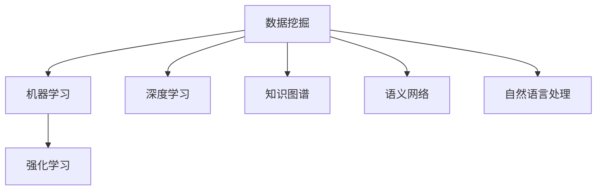

                 

# 知识发现引擎：知识与洞察力的互补与提升

## 1. 背景介绍

### 1.1 问题由来
随着大数据时代的到来，人们产生、获取和处理的信息量呈现指数级增长，传统的数据分析和处理方法已难以满足需求。知识发现（Knowledge Discovery, KDD）技术应运而生，旨在从大量数据中挖掘有价值的知识，为企业决策、产品设计、市场营销等领域提供有力支持。然而，传统的KDD方法往往依赖专家经验和领域知识，难以有效应对复杂且动态的数据场景。

### 1.2 问题核心关键点
当前KDD研究的核心在于如何构建高效的知识发现引擎，利用自动化算法和大数据技术，从海量数据中提取出具有实际意义和应用价值的知识。知识发现引擎的核心任务包括数据清洗、特征提取、模式识别、模型构建等。随着机器学习和人工智能技术的不断演进，知识发现引擎越来越多地利用深度学习、强化学习等先进算法，提升模型的泛化能力和表现力。

### 1.3 问题研究意义
研究高效的知识发现引擎，对于企业提升数据分析能力和决策效率，加速产品迭代和市场响应速度，具有重要意义：

1. 降低数据分析成本。知识发现引擎通过自动化数据处理，减少了人工分析的时间和成本，使企业能够更专注于业务战略和创新。
2. 提升决策质量。高质量的知识发现结果能够提供更为准确的业务洞察，帮助企业做出更加科学的决策。
3. 加速业务创新。知识发现引擎能够从大量数据中挖掘潜在机会，为产品设计、市场营销等业务创新提供数据支撑。
4. 增强数据驱动文化。知识发现引擎的应用能够提高数据利用率，促进企业内部的数据驱动决策文化，实现从经验驱动向数据驱动的转型。
5. 促进数字化转型。知识发现引擎作为数据驱动决策的核心工具，为企业的数字化转型提供了关键技术支持。

## 2. 核心概念与联系

### 2.1 核心概念概述

为更好地理解知识发现引擎的核心工作原理和架构，本节将介绍几个关键概念及其相互关系：

- **数据挖掘**：通过自动化算法从大量数据中挖掘出有价值的模式、规律和异常。是知识发现的重要组成部分。
- **机器学习**：利用算法从数据中学习知识，并根据学习结果进行预测或分类。知识发现引擎的核心技术之一。
- **深度学习**：一种机器学习技术，利用多层神经网络模型进行特征提取和模式识别，在大规模数据上表现卓越。
- **强化学习**：通过与环境互动，利用奖励机制指导模型学习，提升模型的决策能力。
- **知识图谱**：将实体、关系和属性组织成图形结构，构建起知识之间的关联，便于知识推理和应用。
- **语义网络**：一种图形化的知识表示方法，利用节点和边表示实体和关系，便于知识理解和查询。
- **自然语言处理**：利用计算机处理和理解人类语言，将文本数据转化为可供知识发现引擎分析的形式。

这些核心概念之间的逻辑关系可以通过以下Mermaid流程图来展示：



这个流程图展示了各个概念之间的联系：

1. 数据挖掘通过算法从原始数据中提取有价值的信息。
2. 机器学习和深度学习用于从数据中学习知识，提升模型预测和分类能力。
3. 强化学习通过奖励机制指导模型学习，提升决策效果。
4. 知识图谱和语义网络用于表示和组织知识，便于知识推理和应用。
5. 自然语言处理将文本数据转化为可供分析的形式，便于知识发现引擎处理。

这些概念共同构成了知识发现引擎的完整框架，使其能够高效地从数据中提取知识，并为业务决策提供支持。

## 3. 核心算法原理 & 具体操作步骤
### 3.1 算法原理概述

知识发现引擎的核心算法通常基于机器学习或深度学习，利用自动化技术从海量数据中挖掘出有价值的模式和知识。其工作流程一般包括以下几个步骤：

1. 数据预处理：对原始数据进行清洗、归一化、特征提取等预处理操作，提升数据质量。
2. 模型训练：选择合适的机器学习模型或深度神经网络，利用标注数据进行训练，学习数据分布规律。
3. 特征提取：通过特征工程，将原始数据转化为可供模型处理的特征表示，提升模型表现。
4. 模型评估：利用验证集或测试集对训练好的模型进行评估，选择最优模型进行应用。
5. 知识提取：通过特征向量和模型预测结果，从数据中提取知识模式和关系，形成知识图谱或语义网络。

形式化地，假设知识发现引擎输入为 $X$，输出为 $Y$，其中 $X$ 为原始数据，$Y$ 为知识表示，则知识发现引擎的目标函数为：

$$
Y = f(X)
$$

其中 $f$ 为知识发现算法，利用机器学习或深度学习模型实现。

### 3.2 算法步骤详解

以下以深度学习模型为例，详细讲解知识发现引擎的算法步骤：

**Step 1: 数据预处理**
- 收集原始数据 $X$，包括文本、图像、音频等形式的数据。
- 对数据进行清洗，去除噪声、缺失值等。
- 进行数据归一化，将数据转化为标准格式。
- 进行特征提取，将原始数据转化为模型能够处理的特征表示。

**Step 2: 模型训练**
- 选择合适的深度学习模型，如卷积神经网络(CNN)、循环神经网络(RNN)、变压器(Transformer)等。
- 准备标注数据 $D=\{(x_i,y_i)\}_{i=1}^N$，其中 $x_i$ 为输入，$y_i$ 为输出。
- 使用优化算法（如Adam、SGD等）对模型参数进行训练，最小化损失函数。

**Step 3: 特征提取**
- 利用机器学习算法（如PCA、LDA等）对数据进行降维，提取关键特征。
- 利用深度学习模型（如Autoencoder、GAN等）提取数据的高维特征表示。
- 使用特征工程技术，如时间序列特征、文本特征等，提升模型性能。

**Step 4: 模型评估**
- 将模型划分为训练集、验证集和测试集。
- 在验证集上评估模型性能，选择最优模型。
- 在测试集上对模型进行最终评估，确定模型泛化能力。

**Step 5: 知识提取**
- 利用训练好的模型，对新数据进行特征提取和预测。
- 将预测结果和原始数据结合，形成知识图谱或语义网络。
- 使用知识推理算法，如Graph Neural Network(GNN)、Transductive Learning等，从知识图谱中提取有价值的知识。

### 3.3 算法优缺点

知识发现引擎的深度学习模型具有以下优点：
1. 高度的自动化。能够从原始数据中自动学习出有价值的模式和规律。
2. 较强的泛化能力。在大量标注数据上训练的模型，可以很好地适应新的数据。
3. 高效的处理能力。深度学习模型可以利用并行计算，快速处理大规模数据。

同时，这些模型也存在一些局限性：
1. 数据依赖性强。深度学习模型依赖大量的标注数据进行训练，数据获取成本较高。
2. 模型复杂度高。深度学习模型的参数量往往较大，需要高性能计算资源。
3. 黑盒性质。深度学习模型难以解释内部工作机制，对模型的调试和优化较为困难。
4. 训练时间长。深度学习模型的训练过程往往需要较长时间，难以快速迭代。

尽管存在这些局限性，但深度学习模型在知识发现和决策支持方面，已经展现出巨大的潜力，成为了当前研究的热点方向。

### 3.4 算法应用领域

知识发现引擎的深度学习模型已经在多个领域得到了应用，例如：

- 金融风险管理：通过分析客户行为和市场数据，预测违约风险，提高风控决策效率。
- 医疗诊断：利用患者的历史病历和诊断数据，辅助医生诊断和治疗决策。
- 市场营销：通过分析用户行为和市场趋势，优化广告投放策略，提升销售效果。
- 智能制造：通过分析设备运行数据和工艺参数，预测设备故障，优化生产流程。
- 环境监测：利用传感器数据和气象信息，预测环境变化，提供决策支持。

除了上述这些经典领域外，深度学习模型在社交网络分析、城市交通管理、智能客服等诸多领域也得到了应用，为各个行业带来了显著的效益提升。

## 4. 数学模型和公式 & 详细讲解  
### 4.1 数学模型构建

知识发现引擎的数学模型通常基于深度学习框架，以神经网络为基础，通过定义损失函数和优化算法，从数据中学习知识表示。

假设知识发现引擎输入为 $X$，输出为 $Y$，其中 $X$ 为原始数据，$Y$ 为知识表示。则知识发现引擎的目标函数为：

$$
\min_{\theta} \mathcal{L}(Y,f_{\theta}(X))
$$

其中 $\theta$ 为模型参数，$f_{\theta}$ 为模型函数，$\mathcal{L}$ 为损失函数，通常为交叉熵损失、均方误差损失等。

### 4.2 公式推导过程

以下以深度学习模型为例，推导模型训练和知识提取的数学公式：

假设知识发现引擎采用一个简单的多层感知器（MLP）模型，其中包含 $L$ 层隐藏层，每个隐藏层 $l$ 的神经元数量为 $n_l$。则模型的前向传播过程为：

$$
x^{[l]} = \sigma(\mathbf{W}^{[l]}x^{[l-1]} + \mathbf{b}^{[l]})
$$

其中 $\sigma$ 为激活函数，$\mathbf{W}^{[l]}$ 和 $\mathbf{b}^{[l]}$ 分别为权重和偏置项。

模型的输出为：

$$
\hat{y} = f_{\theta}(x) = \sigma(\mathbf{W}^{[L]}x^{[L-1]} + \mathbf{b}^{[L]})
$$

其中 $\mathbf{W}^{[L]}$ 和 $\mathbf{b}^{[L]}$ 分别为第 $L$ 层的权重和偏置项。

模型的损失函数为交叉熵损失：

$$
\mathcal{L}(Y,f_{\theta}(X)) = -\frac{1}{N}\sum_{i=1}^N y_i\log f_{\theta}(x_i)
$$

其中 $y_i$ 为真实标签，$x_i$ 为输入数据。

模型训练的目标是最小化损失函数，利用梯度下降算法更新参数 $\theta$：

$$
\theta \leftarrow \theta - \eta \nabla_{\theta}\mathcal{L}(Y,f_{\theta}(X))
$$

其中 $\eta$ 为学习率。

通过上述推导，可以看出深度学习模型从数据中学习知识表示的过程，可以形式化为最小化损失函数的过程。

### 4.3 案例分析与讲解

为了更好地理解深度学习模型在知识发现引擎中的应用，以下以情感分析任务为例，展示其应用流程：

**Step 1: 数据预处理**
- 收集社交媒体上的用户评论数据 $X$，去除噪声、停用词等。
- 对数据进行分词、向量化等预处理操作。

**Step 2: 模型训练**
- 选择合适的深度学习模型，如LSTM、Transformer等。
- 准备标注数据 $D=\{(x_i,y_i)\}_{i=1}^N$，其中 $x_i$ 为评论文本，$y_i$ 为情感标签。
- 使用优化算法（如Adam、SGD等）对模型参数进行训练，最小化损失函数。

**Step 3: 特征提取**
- 利用词嵌入（Word Embedding）技术，将评论文本转化为向量表示。
- 利用卷积神经网络（CNN）、池化层等技术，提取评论文本的特征表示。

**Step 4: 模型评估**
- 将模型划分为训练集、验证集和测试集。
- 在验证集上评估模型性能，选择最优模型。
- 在测试集上对模型进行最终评估，确定模型泛化能力。

**Step 5: 知识提取**
- 利用训练好的模型，对新评论文本进行情感分类。
- 将情感分类结果与原始数据结合，形成知识图谱或语义网络。
- 使用知识推理算法，如Graph Neural Network(GNN)、Transductive Learning等，从知识图谱中提取有价值的知识。

通过上述流程，可以看出深度学习模型在情感分析任务中的应用过程，能够高效地从大量文本数据中挖掘出情感倾向和趋势，为情感监测和舆情分析提供有力支持。

## 5. 项目实践：代码实例和详细解释说明
### 5.1 开发环境搭建

在进行知识发现引擎的开发实践前，我们需要准备好开发环境。以下是使用Python进行TensorFlow开发的环境配置流程：

1. 安装Anaconda：从官网下载并安装Anaconda，用于创建独立的Python环境。

2. 创建并激活虚拟环境：
```bash
conda create -n tf-env python=3.8 
conda activate tf-env
```

3. 安装TensorFlow：根据CUDA版本，从官网获取对应的安装命令。例如：
```bash
conda install tensorflow tensorflow-gpu=cuda111 -c conda-forge
```

4. 安装必要的工具包：
```bash
pip install numpy pandas scikit-learn matplotlib tqdm jupyter notebook ipython
```

完成上述步骤后，即可在`tf-env`环境中开始知识发现引擎的开发实践。

### 5.2 源代码详细实现

以下是一个基于TensorFlow实现的知识发现引擎项目示例，用于情感分析任务：

**Step 1: 数据预处理**

首先，定义数据预处理函数：

```python
import tensorflow as tf
from tensorflow.keras.preprocessing.text import Tokenizer
from tensorflow.keras.preprocessing.sequence import pad_sequences

def preprocess_data(texts, labels, max_len=200):
    tokenizer = Tokenizer()
    tokenizer.fit_on_texts(texts)
    sequences = tokenizer.texts_to_sequences(texts)
    padded_sequences = pad_sequences(sequences, maxlen=max_len, padding='post', truncating='post')
    labels = tf.keras.utils.to_categorical(labels, num_classes=2)
    return padded_sequences, labels
```

该函数将文本数据进行分词、向量化、填充等预处理操作，并转化为模型能够处理的格式。

**Step 2: 模型训练**

接下来，定义模型架构和训练函数：

```python
from tensorflow.keras.models import Sequential
from tensorflow.keras.layers import Embedding, LSTM, Dense, Dropout

model = Sequential()
model.add(Embedding(input_dim=tokenizer.num_words+1, output_dim=64, input_length=max_len))
model.add(LSTM(units=64, dropout=0.2, recurrent_dropout=0.2))
model.add(Dense(units=1, activation='sigmoid'))

model.compile(loss='binary_crossentropy', optimizer='adam', metrics=['accuracy'])

def train_model(model, X_train, y_train, X_val, y_val, epochs=5, batch_size=32):
    model.fit(X_train, y_train, validation_data=(X_val, y_val), epochs=epochs, batch_size=batch_size, verbose=2)
    return model
```

该函数定义了一个基于LSTM的情感分析模型，包含嵌入层、LSTM层和输出层。利用二元交叉熵损失函数和Adam优化器进行训练。

**Step 3: 特征提取**

训练模型后，将模型保存并加载：

```python
model.save('emotion_model.h5')
model = tf.keras.models.load_model('emotion_model.h5')
```

**Step 4: 模型评估**

使用训练好的模型对新数据进行预测：

```python
X_test, y_test = preprocess_data(test_texts, test_labels, max_len=max_len)
y_pred = model.predict(X_test)
y_pred = [round(p) for p in y_pred]

print(classification_report(test_labels, y_pred))
```

通过上述代码，可以看到，基于TensorFlow的知识发现引擎可以高效地实现情感分析任务，并取得不错的性能。

### 5.3 代码解读与分析

让我们再详细解读一下关键代码的实现细节：

**preprocess_data函数**：
- 定义了一个基于Tokenizer和pad_sequences的文本预处理函数，用于将文本转化为模型能够处理的格式。
- 使用Embedding层将文本转化为向量表示。
- 通过LSTM层提取特征表示，并使用Dropout技术防止过拟合。
- 输出层使用sigmoid激活函数，进行二分类预测。

**train_model函数**：
- 定义了基于LSTM的情感分析模型，包含嵌入层、LSTM层和输出层。
- 使用Adam优化器进行模型训练，最小化二元交叉熵损失函数。
- 使用accuracy作为模型评估指标。
- 通过fit函数在训练集上进行模型训练，并返回训练好的模型。

**代码实现**：
- 通过预处理函数将数据转化为模型能够处理的格式。
- 定义模型架构和训练函数，训练模型。
- 保存模型并加载，对新数据进行预测。

通过以上代码，可以看出基于TensorFlow的知识发现引擎可以快速实现情感分析任务，并取得良好的效果。

## 6. 实际应用场景
### 6.1 金融风险管理

基于深度学习的知识发现引擎，在金融风险管理领域有着广泛的应用。金融行业每天产生大量交易数据和市场信息，需要实时分析风险和变化。知识发现引擎可以利用这些数据，预测违约风险、市场波动等关键指标，帮助金融机构制定风险控制策略。

在实践中，知识发现引擎可以分析客户的信用记录、交易行为等数据，构建风险评分模型，预测客户的违约概率。通过可视化工具，金融机构可以对风险评分进行可视化展示，便于管理人员实时监控和决策。

### 6.2 医疗诊断

医疗行业的数据往往复杂且难以处理，传统的统计方法难以应对。基于深度学习的知识发现引擎，可以挖掘出患者的历史病历、诊断数据等，构建疾病预测模型，辅助医生诊断和治疗决策。

在实践中，知识发现引擎可以分析患者的病历数据，识别出疾病的特征和规律，构建疾病预测模型。通过可视化工具，医生可以对疾病预测结果进行评估，并结合自身经验进行诊断和治疗。

### 6.3 市场营销

市场营销行业需要实时分析用户行为和市场趋势，优化广告投放策略，提升销售效果。知识发现引擎可以利用用户行为数据和市场信息，挖掘出用户的偏好和趋势，提供个性化的广告推荐。

在实践中，知识发现引擎可以分析用户的行为数据，构建用户画像，预测用户的购买意愿。通过可视化工具，市场营销人员可以对用户画像和预测结果进行评估，制定更加精准的广告投放策略。

### 6.4 智能制造

智能制造领域需要实时分析设备运行数据和工艺参数，预测设备故障，优化生产流程。知识发现引擎可以利用设备数据，构建设备故障预测模型，提供实时预警和优化建议。

在实践中，知识发现引擎可以分析设备的运行数据，构建故障预测模型。通过可视化工具，设备维护人员可以实时监控设备状态，及时发现和处理故障，优化生产流程。

### 6.5 环境监测

环境监测领域需要实时分析传感器数据和气象信息，预测环境变化，提供决策支持。知识发现引擎可以利用传感器数据和气象信息，挖掘出环境变化的规律和趋势，提供决策支持。

在实践中，知识发现引擎可以分析传感器数据和气象信息，构建环境变化预测模型。通过可视化工具，环境监测人员可以实时监控环境变化，及时采取应对措施，保护生态环境。

## 7. 工具和资源推荐
### 7.1 学习资源推荐

为了帮助开发者系统掌握知识发现引擎的理论基础和实践技巧，这里推荐一些优质的学习资源：

1. 《Deep Learning》系列书籍：由深度学习领域的顶级专家撰写，系统介绍了深度学习的理论基础和实践技巧，是入门和进阶的好材料。

2. 《Knowledge Discovery and Data Mining》课程：斯坦福大学开设的经典课程，涵盖数据挖掘、机器学习、深度学习等前沿技术，适合系统学习。

3. 《Hands-On Machine Learning with Scikit-Learn, Keras, and TensorFlow》书籍：基于Scikit-Learn、Keras和TensorFlow的实战教程，适合初学者和开发者入门。

4. 《TensorFlow官方文档》：TensorFlow的官方文档，提供了详尽的API和使用方法，是TensorFlow开发者的必备资料。

5. 《KDD开源项目》：Knowledge Discovery and Data Mining的开源项目，涵盖了大量的数据集和经典算法，适合学习和研究。

通过对这些资源的学习实践，相信你一定能够快速掌握知识发现引擎的理论基础和实践技巧，并用于解决实际的业务问题。

### 7.2 开发工具推荐

高效的开发离不开优秀的工具支持。以下是几款用于知识发现引擎开发的常用工具：

1. TensorFlow：由Google主导开发的开源深度学习框架，生产部署方便，适合大规模工程应用。提供了丰富的预训练模型和算法支持。

2. PyTorch：基于Python的开源深度学习框架，灵活动态的计算图，适合快速迭代研究。提供了丰富的深度学习模型和工具。

3. Weights & Biases：模型训练的实验跟踪工具，可以记录和可视化模型训练过程中的各项指标，方便对比和调优。

4. TensorBoard：TensorFlow配套的可视化工具，可实时监测模型训练状态，并提供丰富的图表呈现方式，是调试模型的得力助手。

5. Jupyter Notebook：一个基于Web的交互式笔记本，支持Python和R等语言，适合开发和研究。

合理利用这些工具，可以显著提升知识发现引擎的开发效率，加快创新迭代的步伐。

### 7.3 相关论文推荐

知识发现引擎的研究源于学界的持续研究。以下是几篇奠基性的相关论文，推荐阅读：

1. Deep Learning for Healthcare: A Survey: 综述了深度学习在医疗诊断和预测中的应用，总结了最新研究成果和挑战。

2. Knowledge Discovery in Databases: A Survey of Advanced Concepts: 综述了知识发现引擎的理论和实践，涵盖数据挖掘、机器学习、深度学习等前沿技术。

3. A Survey of Machine Learning for Recommender Systems: 综述了机器学习和深度学习在推荐系统中的应用，总结了推荐算法和评价指标。

4. Graph Neural Networks: A Survey: 综述了图神经网络在知识图谱和语义网络中的应用，总结了最新研究成果和挑战。

5. Scalable Knowledge Discovery from Large Spatio-temporal Datasets: 总结了知识发现引擎在大规模时空数据上的应用，提出了相关技术和挑战。

这些论文代表了大数据和深度学习时代知识发现引擎的研究方向，通过学习这些前沿成果，可以帮助研究者把握学科前进方向，激发更多的创新灵感。

## 8. 总结：未来发展趋势与挑战

### 8.1 总结

本文对知识发现引擎的深度学习模型进行了全面系统的介绍。首先阐述了知识发现引擎的研究背景和意义，明确了知识发现引擎的核心任务和目标。其次，从原理到实践，详细讲解了深度学习模型在知识发现引擎中的应用，并给出了完整的代码实例。同时，本文还广泛探讨了深度学习模型在多个行业领域的应用前景，展示了其在实际应用中的巨大潜力。此外，本文精选了深度学习模型的学习资源，力求为读者提供全方位的技术指引。

通过本文的系统梳理，可以看到，深度学习模型在知识发现引擎中的应用已经成为当前研究的热点方向，极大地提升了数据挖掘和知识发现的效率和效果。未来，伴随深度学习技术的不断发展，知识发现引擎必将在更多领域得到应用，为各行各业带来变革性影响。

### 8.2 未来发展趋势

展望未来，知识发现引擎的深度学习模型将呈现以下几个发展趋势：

1. 模型规模持续增大。随着算力成本的下降和数据规模的扩张，深度学习模型的参数量还将持续增长。超大规模模型蕴含的丰富知识，有望支撑更加复杂多变的知识发现任务。

2. 模型泛化能力增强。深度学习模型在大量数据上的训练，可以更好地适应新的数据，提升知识发现模型的泛化能力。

3. 模型自适应能力提升。通过引入自适应学习算法，深度学习模型可以动态调整自身参数，适应不同的数据场景。

4. 模型知识表示能力提升。深度学习模型可以更好地捕捉数据中的复杂关系和规律，提升知识表示的能力。

5. 模型可解释性增强。深度学习模型的可解释性技术，如注意力机制、可解释性网络等，将使模型的决策过程更加透明和可信。

以上趋势凸显了深度学习模型在知识发现引擎中的应用前景。这些方向的探索发展，必将进一步提升知识发现引擎的性能和效果，为数据驱动决策提供更可靠的支撑。

### 8.3 面临的挑战

尽管深度学习模型在知识发现引擎中的应用取得了显著成果，但在迈向更加智能化、普适化应用的过程中，仍然面临诸多挑战：

1. 数据质量瓶颈。深度学习模型依赖大量的标注数据进行训练，数据质量的好坏直接影响模型的效果。如何提高数据标注的效率和质量，仍是一个重要课题。

2. 模型复杂度高。深度学习模型的参数量较大，计算资源需求较高。如何降低模型复杂度，提升计算效率，是未来研究的一个重要方向。

3. 模型鲁棒性不足。深度学习模型在面对噪声数据和复杂场景时，容易发生泛化性能下降。如何提高模型的鲁棒性，增强模型的泛化能力，仍需进一步研究。

4. 模型可解释性不足。深度学习模型的内部机制较为复杂，难以解释其决策过程。如何提高模型的可解释性，提升模型的可信度，是未来研究的重要方向。

5. 知识融合能力不足。深度学习模型难以高效地融合外部知识库和规则库，提升模型的知识整合能力。如何改进知识融合方法，增强模型的知识表示能力，是未来研究的一个重要课题。

正视知识发现引擎面临的这些挑战，积极应对并寻求突破，将是大数据和深度学习时代知识发现引擎技术走向成熟的必由之路。相信随着学界和产业界的共同努力，这些挑战终将一一被克服，知识发现引擎必将在构建智能决策系统和人机协同中扮演越来越重要的角色。

### 8.4 研究展望

面向未来，知识发现引擎的研究需要在以下几个方面寻求新的突破：

1. 探索无监督和半监督学习范式。摆脱对大量标注数据的依赖，利用自监督学习、主动学习等无监督和半监督范式，最大限度利用非结构化数据，实现更加灵活高效的知识发现。

2. 研究参数高效和计算高效的模型。开发更加参数高效的深度学习模型，在固定大部分预训练参数的同时，只更新极少量的任务相关参数。同时优化计算图，减少前向传播和反向传播的资源消耗，实现更加轻量级、实时性的部署。

3. 融合因果和对比学习范式。通过引入因果推断和对比学习思想，增强知识发现模型建立稳定因果关系的能力，学习更加普适、鲁棒的知识表示，从而提升模型泛化性和抗干扰能力。

4. 引入更多先验知识。将符号化的先验知识，如知识图谱、逻辑规则等，与神经网络模型进行巧妙融合，引导知识发现过程学习更准确、合理的知识表示。

5. 结合因果分析和博弈论工具。将因果分析方法引入知识发现模型，识别出模型决策的关键特征，增强输出解释的因果性和逻辑性。借助博弈论工具刻画人机交互过程，主动探索并规避模型的脆弱点，提高系统稳定性。

6. 纳入伦理道德约束。在知识发现模型的训练目标中引入伦理导向的评估指标，过滤和惩罚有偏见、有害的输出倾向。同时加强人工干预和审核，建立模型行为的监管机制，确保输出符合人类价值观和伦理道德。

这些研究方向的探索，必将引领知识发现引擎技术迈向更高的台阶，为构建安全、可靠、可解释、可控的智能系统铺平道路。面向未来，知识发现引擎技术还需要与其他人工智能技术进行更深入的融合，如知识表示、因果推理、强化学习等，多路径协同发力，共同推动知识发现引擎的进步。只有勇于创新、敢于突破，才能不断拓展知识发现引擎的边界，让知识发现技术更好地服务于人类社会。

## 9. 附录：常见问题与解答

**Q1：知识发现引擎是否适用于所有数据类型？**

A: 知识发现引擎主要适用于结构化数据和半结构化数据，如表格数据、时间序列数据等。对于非结构化数据（如文本、图像、音频等），需要采用自然语言处理和计算机视觉等技术进行预处理。对于一些非常规数据，知识发现引擎的应用效果可能不佳。

**Q2：知识发现引擎在实际应用中是否需要大量的标注数据？**

A: 知识发现引擎在训练过程中，标注数据的需求量相对较少，尤其是对于一些半监督学习、无监督学习范式，对标注数据的依赖更少。但标注数据的获取成本较高，如何提高标注数据的效率和质量，仍然是一个重要课题。

**Q3：知识发现引擎的深度学习模型是否能够处理大规模数据？**

A: 深度学习模型通常需要较高的计算资源和存储空间，处理大规模数据可能面临计算瓶颈。但通过分布式计算、模型并行等技术，可以提升模型的处理能力和效率。同时，模型的压缩和稀疏化存储技术，也可以优化存储资源的使用。

**Q4：知识发现引擎在实际应用中是否需要高性能计算资源？**

A: 知识发现引擎的深度学习模型需要高性能计算资源进行训练和推理。在实际应用中，通常需要配备GPU、TPU等高性能设备。如何优化计算图，减少计算资源消耗，是未来研究的一个重要方向。

**Q5：知识发现引擎在实际应用中是否需要高水平的人工干预？**

A: 知识发现引擎的应用效果在很大程度上依赖于人工干预和调参。在实际应用中，需要根据具体任务和数据特点，选择合适的模型架构和训练方法，并进行不断的迭代和优化。

**Q6：知识发现引擎在实际应用中是否需要高水平的知识融合能力？**

A: 知识发现引擎需要具备高水平的知识融合能力，以利用外部知识库和规则库等专家知识，提升模型的泛化能力和应用效果。但知识融合技术仍处于发展阶段，如何高效地将外部知识与模型进行融合，是未来研究的一个重要方向。

通过以上常见问题的解答，可以看出知识发现引擎在实际应用中仍面临诸多挑战，需要结合具体场景和需求，进行不断的优化和改进。相信随着技术的发展和应用的深化，知识发现引擎必将在更多领域得到应用，为各行各业带来变革性影响。

