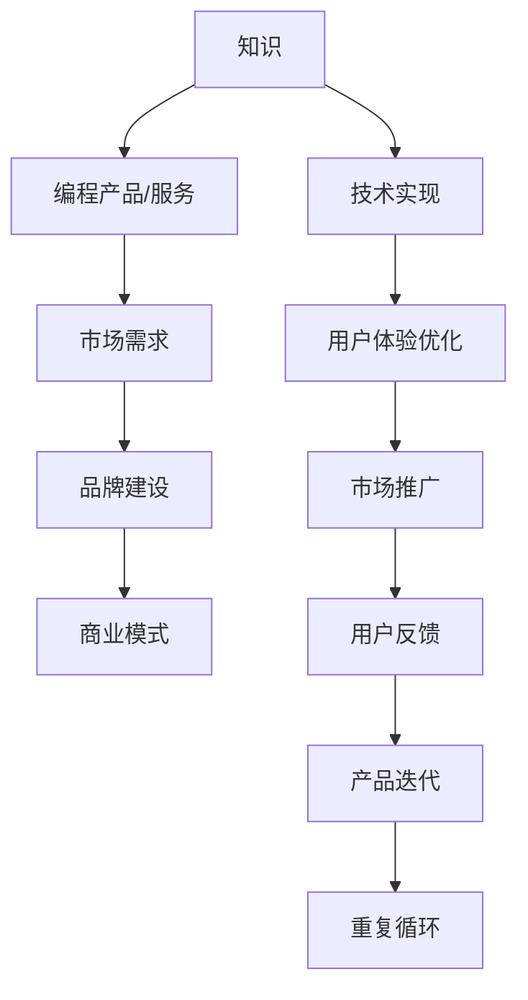

                 

# 知识变现的未来：程序员的机遇与挑战

## 1. 背景介绍

### 1.1 问题由来
在互联网迅猛发展的当下，程序员不仅是代码的编写者，更是知识的创造者。随着知识付费平台的兴起，程序员可以通过编程、教学、咨询等多种方式将专业知识转化为直接经济收益。然而，知识变现的道路并非一帆风顺，它面临着技术、市场、个人能力等多方面的挑战。本文将从程序员的视角出发，探讨知识变现的未来趋势，分析其中的机遇与挑战，并提出实用的建议。

### 1.2 问题核心关键点
知识变现的核心在于如何将专业知识和技能转化为有价值的产品或服务，并获取经济回报。核心问题包括：

- 如何高效获取用户需求，提供符合市场需求的编程产品或服务？
- 如何在众多竞争者中脱颖而出，建立独特的品牌优势？
- 如何兼顾技术实现和市场需求的平衡，实现商业成功？

## 2. 核心概念与联系

### 2.1 核心概念概述

为更好地理解知识变现的本质和实现路径，本节将介绍几个关键概念及其相互联系：

- **知识变现**：将专业知识、技能或编程能力转化为商品或服务，从而实现经济收益。知识变现的形式多种多样，包括在线编程、教学培训、咨询服务、软件开发等。
- **编程产品/服务**：指基于编程技能开发的各种软件、工具、插件、API等，为用户提供便利或解决方案。
- **市场需求**：指用户对编程产品或服务的需求，包括功能需求、性能需求、用户体验需求等。
- **品牌建设**：通过独特的品牌定位和差异化的品牌策略，在市场中建立认知度和信任度。
- **商业模式**：知识变现的盈利模式，包括订阅制、单次付费、广告分成、赞助合作等。

这些核心概念共同构成了知识变现的基础框架，程序员可以围绕这些概念，从技术实现到市场推广，全方位地考虑和规划自己的知识变现策略。

### 2.2 核心概念原理和架构的 Mermaid 流程图



这个流程图展示了知识变现的基本流程：从知识到编程产品或服务，再到市场需求的响应、品牌建设、商业模式设计，最终实现技术实现和用户体验的不断迭代优化。

## 3. 核心算法原理 & 具体操作步骤

### 3.1 算法原理概述

知识变现的核心在于将编程技能与市场需求相结合，通过高效的技术实现和卓越的用户体验，构建可持续发展的商业模式。其算法原理可概括为以下步骤：

1. **用户需求分析**：通过市场调研和用户访谈，收集用户需求，确定产品功能和技术要求。
2. **技术实现**：根据需求，选择合适的技术栈和框架，实现编程产品或服务。
3. **用户体验优化**：通过用户反馈，持续优化产品界面和功能，提升用户体验。
4. **品牌建设**：通过社交媒体、官网、博客等渠道，建立品牌形象和市场认知。
5. **商业模式设计**：选择适当的盈利模式，包括订阅制、单次付费、广告分成等，确保可持续发展。
6. **市场推广**：通过SEO、社交媒体、内容营销等手段，吸引潜在用户，扩大市场份额。

### 3.2 算法步骤详解

#### 步骤1: 用户需求分析

- **市场调研**：使用问卷调查、访谈、竞品分析等方法，了解目标用户的痛点和需求。
- **用户画像**：根据调研结果，构建详细的用户画像，包括年龄、性别、职业、技能水平等。
- **功能优先级**：根据用户需求，确定产品功能的优先级和实现顺序。

#### 步骤2: 技术实现

- **选择合适的技术栈**：根据产品需求和技术趋势，选择适合的编程语言、框架、库等。
- **代码结构设计**：设计清晰、模块化的代码结构，便于维护和扩展。
- **版本控制**：使用Git等版本控制系统，确保代码的协作和迭代更新。

#### 步骤3: 用户体验优化

- **界面设计**：设计简洁、直观的界面，减少用户操作复杂度。
- **性能优化**：通过代码优化、缓存、CDN等手段，提升产品性能。
- **用户反馈收集**：通过用户反馈表、评论区、客服渠道等，收集用户意见。
- **持续迭代**：根据用户反馈，不断迭代优化产品功能。

#### 步骤4: 品牌建设

- **品牌定位**：明确品牌的核心价值和差异化优势。
- **内容营销**：通过博客、视频、社交媒体等内容形式，传播品牌理念和技术优势。
- **社区建设**：建立技术社区，吸引开发者和用户参与讨论和交流。

#### 步骤5: 商业模式设计

- **收入模型**：选择适合的盈利模型，如订阅制、单次付费、广告分成等。
- **定价策略**：根据市场需求和成本，制定合理的定价策略。
- **用户体验**：确保商业模式设计不会损害用户体验。

#### 步骤6: 市场推广

- **SEO优化**：优化网站和产品内容，提升搜索引擎排名。
- **社交媒体**：在各大社交媒体平台进行品牌推广，吸引潜在用户。
- **内容营销**：通过撰写高质量的技术文章、视频教程等，提升品牌知名度。

### 3.3 算法优缺点

知识变现的算法具有以下优点：

- **高效利用专业技能**：通过编程技能直接变现，效率高，回报快。
- **市场需求灵活**：能够根据市场反馈快速调整产品功能和商业模式。
- **品牌价值提升**：通过品牌建设，建立长期用户忠诚度和市场认知。

同时，也存在一些局限性：

- **市场竞争激烈**：编程产品/服务市场竞争激烈，如何脱颖而出需要持续创新。
- **技术更新快速**：编程技术更新速度快，需要不断学习和适应新技术。
- **用户需求多样**：不同用户需求各异，需要灵活应对和定制解决方案。

### 3.4 算法应用领域

知识变现的算法适用于各种编程技能和市场需求，包括但不限于：

- **软件开发**：提供定制化软件开发服务，如企业管理系统、电商系统、移动应用等。
- **技术咨询**：提供技术咨询和方案设计服务，帮助企业解决技术难题。
- **在线编程课程**：提供编程技能培训课程，通过在线教学平台变现。
- **内容创作**：撰写高质量的编程书籍、博客、技术文章等，通过内容变现。
- **工具和插件**：开发和使用率高的编程工具和插件，提供增值服务。

## 4. 数学模型和公式 & 详细讲解 & 举例说明

### 4.1 数学模型构建

本节将使用数学语言对知识变现的算法过程进行严格刻画。

设编程产品或服务为 $P$，市场需求为 $D$，品牌价值为 $B$，商业模式为 $M$。则知识变现的数学模型可表示为：

$$
\text{Total Value} = f(P, D, B, M)
$$

其中，$f$ 表示将编程产品 $P$、市场需求 $D$、品牌价值 $B$ 和商业模式 $M$ 映射到总价值 $\text{Total Value}$ 的函数。

### 4.2 公式推导过程

以在线编程课程为例，推导知识变现的公式：

假设在线课程的订阅用户数为 $U$，每次订阅的费用为 $P_0$，每次点击广告的收益为 $A_0$。则知识变现的总收入为：

$$
\text{Total Revenue} = U \cdot P_0 + A_0 \cdot C
$$

其中 $C$ 为课程点击次数。

设课程的平均制作成本为 $C_0$，课程的平均运营成本为 $O_0$。则总收入减去成本，得到知识变现的总利润为：

$$
\text{Total Profit} = (U \cdot P_0 + A_0 \cdot C) - (C_0 \cdot U + O_0)
$$

### 4.3 案例分析与讲解

假设某在线编程课程初始用户数为 $U_0=1000$，每次订阅费用为 $P_0=10$，每次点击广告收益为 $A_0=0.1$。课程的平均制作成本为 $C_0=100$，平均运营成本为 $O_0=20$。则知识变现的总利润为：

$$
\text{Total Profit} = (1000 \cdot 10 + 0.1 \cdot C) - (100 \cdot 1000 + 20)
$$

## 5. 项目实践：代码实例和详细解释说明

### 5.1 开发环境搭建

要进行知识变现项目的开发，需要搭建一个支持编程技能展示和市场推广的开发环境。以下是一个基本的开发环境搭建流程：

1. **选择开发平台**：根据需求选择适当的开发平台，如Windows、macOS、Linux等。
2. **安装开发工具**：安装必要的开发工具，如IDE、编译器、版本控制工具等。
3. **配置开发环境**：设置开发环境的依赖库和开发环境变量。

### 5.2 源代码详细实现

以开发一个在线编程课程为例，源代码实现可以分为以下几个步骤：

#### 步骤1: 需求分析

- **市场调研**：通过问卷调查、访谈等方式，收集用户需求。
- **用户画像**：构建详细的用户画像。
- **功能优先级**：确定功能优先级和实现顺序。

#### 步骤2: 技术实现

- **选择技术栈**：根据需求选择合适的编程语言、框架、库等。
- **代码结构设计**：设计清晰、模块化的代码结构。
- **版本控制**：使用Git进行版本控制。

#### 步骤3: 用户体验优化

- **界面设计**：设计简洁、直观的界面。
- **性能优化**：通过代码优化、缓存等手段提升性能。
- **用户反馈收集**：通过反馈表、评论区、客服渠道收集用户意见。
- **持续迭代**：根据用户反馈迭代优化产品功能。

#### 步骤4: 品牌建设

- **品牌定位**：明确品牌的核心价值和差异化优势。
- **内容营销**：通过博客、视频、社交媒体等内容形式传播品牌理念。
- **社区建设**：建立技术社区，吸引开发者和用户参与讨论。

#### 步骤5: 商业模式设计

- **选择收入模型**：如订阅制、单次付费、广告分成等。
- **定价策略**：根据市场需求和成本制定合理的定价策略。

#### 步骤6: 市场推广

- **SEO优化**：优化网站和产品内容，提升搜索引擎排名。
- **社交媒体**：在各大社交平台推广品牌。
- **内容营销**：通过撰写高质量的技术文章、视频教程等提升品牌知名度。

### 5.3 代码解读与分析

```python
# 需求分析
user_demand = {
    '市场调研结果': '...',
    '用户画像': '...',
    '功能优先级': '...'
}

# 技术实现
技术栈 = 'Python+Django'
代码结构 = 'MVC'
版本控制 = 'Git'

# 用户体验优化
界面设计 = '简洁直观'
性能优化 = '...'
用户反馈收集 = '...'
持续迭代 = '...'

# 品牌建设
品牌定位 = '...'
内容营销 = '...'
社区建设 = '...'

# 商业模式设计
收入模型 = '订阅制'
定价策略 = '...'

# 市场推广
SEO优化 = '...'
社交媒体推广 = '...'
内容营销策略 = '...'
```

### 5.4 运行结果展示

假设开发完成后，课程订阅用户增长至 $U=5000$，广告点击次数 $C=100000$，制作成本和运营成本与初期相同，则知识变现的总利润为：

$$
\text{Total Profit} = (5000 \cdot 10 + 0.1 \cdot 100000) - (100 \cdot 5000 + 20)
$$

## 6. 实际应用场景

### 6.1 软件开发

软件开发是知识变现的重要应用场景之一。许多企业需要定制化的开发解决方案，如ERP系统、电商平台等。程序员可以通过提供定制化的开发服务，帮助企业解决技术难题，实现知识变现。

### 6.2 技术咨询

技术咨询是另一种有效的知识变现方式。技术专家可以通过提供技术咨询和方案设计服务，帮助企业解决复杂的技术问题。例如，某大型企业需要构建内部数据分析平台，程序员可以通过提供技术咨询和解决方案，帮助企业高效、低成本地完成项目。

### 6.3 在线编程课程

在线编程课程是知识变现的重要形式。通过在线教育平台，程序员可以提供高质量的编程技能培训课程，帮助学生掌握编程技能，获取经济回报。例如，某知名程序员通过其YouTube频道和在线课程平台，成功吸引了大量用户，实现了高收入。

### 6.4 内容创作

技术博客、技术文章、编程书籍等内容的创作和发布，也是知识变现的有效方式。通过高质量的原创内容，程序员可以吸引大量的读者和粉丝，并通过广告分成、赞助合作等方式获取经济回报。例如，某知名程序员通过其技术博客获得了巨额广告收入。

### 6.5 工具和插件

开发和使用率高的编程工具和插件，也是知识变现的重要渠道。程序员可以通过提供优秀的工具和插件，提升开发效率，满足市场需求，从而实现变现。例如，某知名插件通过高质量的开发和推广，成功吸引了大量用户，实现了高收入。

## 7. 工具和资源推荐

### 7.1 学习资源推荐

要深入理解知识变现的算法和实现，以下资源推荐学习：

1. **《程序员如何赚钱》**：一本介绍程序员如何通过编程技能变现的书籍，涵盖各种变现方式和策略。
2. **Coursera《创业与技术》课程**：斯坦福大学开设的创业课程，涵盖创业的各个方面，包括市场需求分析、品牌建设、商业模式设计等。
3. **《商业模式画布》**：一本介绍如何设计和分析商业模式的经典书籍，提供了丰富的商业模式工具和方法。

### 7.2 开发工具推荐

高效的工具是实现知识变现的重要保障。以下是一些常用的开发工具推荐：

1. **Visual Studio Code**：一个轻量级、高性能的代码编辑器，支持多种编程语言和插件。
2. **Git**：一个强大的版本控制系统，支持多人协作和代码版本管理。
3. **JIRA**：一个项目管理工具，支持任务分配、进度跟踪和协作管理。
4. **Docker**：一个容器化平台，支持应用和服务的打包、部署和分发。
5. **AWS**：一个云计算平台，支持高可用性、弹性扩展和快速部署。

### 7.3 相关论文推荐

知识变现的研究涉及多个领域，以下论文推荐深入了解：

1. **《知识变现的经济学》**：分析知识变现的经济模型和市场行为，提供了实用的策略和建议。
2. **《编程教育与知识变现》**：探讨编程教育和知识变现之间的关系，提供了教育产品和服务的变现策略。
3. **《品牌建设与知识变现》**：分析品牌建设对知识变现的影响，提供了品牌策略和营销方法。

## 8. 总结：未来发展趋势与挑战

### 8.1 总结

本文从程序员的视角，深入探讨了知识变现的未来趋势和挑战，详细介绍了知识变现的核心算法和具体操作步骤，并给出了实用的项目实践建议。知识变现的算法和实践流程复杂，涉及技术、市场、品牌等多个方面，程序员需要通过持续学习和实践，不断提升自身能力和市场竞争力。

### 8.2 未来发展趋势

展望未来，知识变现将呈现以下几个发展趋势：

1. **数字化转型加速**：数字化转型成为企业的重要战略，为编程产品和服务的市场需求提供了广阔空间。
2. **技术平台崛起**：随着云服务和DevOps技术的发展，知识变现的平台化趋势将更加明显。
3. **人工智能赋能**：人工智能技术的应用将进一步提升编程产品和服务的智能化水平，提升用户体验和市场竞争力。
4. **跨界合作增多**：不同领域的技术和市场需求将深度融合，跨界合作和联合创新将成为知识变现的重要方式。

### 8.3 面临的挑战

尽管知识变现的前景广阔，但在实施过程中仍面临诸多挑战：

1. **市场竞争激烈**：编程产品和服务市场竞争激烈，如何在众多竞争者中脱颖而出，需要持续创新。
2. **技术更新快速**：编程技术更新速度快，需要不断学习和适应新技术。
3. **用户需求多样**：不同用户需求各异，需要灵活应对和定制解决方案。

### 8.4 研究展望

未来研究需要关注以下几个方向：

1. **用户需求分析**：如何高效获取用户需求，并设计符合市场需求的产品功能。
2. **技术实现与用户体验**：如何在技术实现和用户体验之间找到平衡点，提升产品价值。
3. **品牌建设与市场推广**：如何建立强大的品牌形象和市场认知，吸引和保持用户。
4. **商业模式创新**：如何设计多样化的盈利模式，提升知识变现的可持续性。

## 9. 附录：常见问题与解答

**Q1: 如何高效获取用户需求？**

A: 通过市场调研、访谈、问卷调查等方式，收集用户痛点和需求，构建详细的用户画像，并确定功能优先级。

**Q2: 如何提升用户体验？**

A: 设计简洁、直观的界面，优化性能，收集用户反馈，并持续迭代优化产品功能。

**Q3: 如何选择适合的编程语言和框架？**

A: 根据市场需求和技术趋势，选择合适的编程语言和框架。

**Q4: 如何建立强大的品牌形象？**

A: 通过内容营销、社交媒体推广等方式，提升品牌知名度和用户认知。

**Q5: 如何选择适合的盈利模式？**

A: 根据市场需求和成本，选择适合的盈利模式，如订阅制、单次付费、广告分成等。

---

作者：禅与计算机程序设计艺术 / Zen and the Art of Computer Programming

