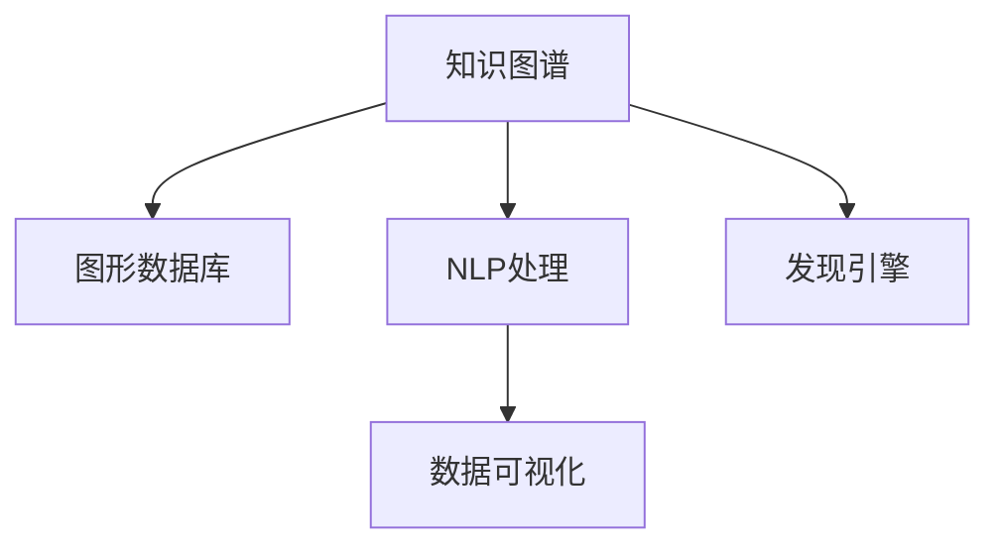

                 

# 知识图谱可视化在发现引擎中的实现

> 关键词：知识图谱, 可视化, 发现引擎, 数据探索, 自然语言处理, 图形数据库, 信息检索

## 1. 背景介绍

### 1.1 问题由来
在信息时代，数据如洪水般涌入我们的日常生活，各种新兴技术不断涌现，如大数据、人工智能等。在众多数据中，结构化数据（如表格数据）虽然易于处理和分析，但无法充分表达信息之间的复杂关系。相比之下，非结构化数据（如文本、图片）虽然能更全面地描述信息，但分析难度较高，且不易进行查询和检索。

为了解决这些问题，知识图谱（Knowledge Graph）技术应运而生。知识图谱将结构化数据与非结构化数据相结合，构建了一个包含实体、属性、关系等元素的语义网络，使信息更加易于理解、存储和查询。知识图谱在大数据、自然语言处理、推荐系统等领域得到了广泛应用。

然而，庞大的知识图谱数据仍然难以直观展示和快速探索。传统的数据可视化技术在处理复杂语义网络时，往往无法提供足够的信息和洞见。因此，本文将探讨如何在知识图谱中实现高效、直观的可视化，以辅助发现引擎（Discovery Engine）快速发现和利用数据中的潜藏知识。

### 1.2 问题核心关键点
知识图谱可视化的核心在于通过图形化展示知识图谱中的实体、属性、关系等元素，使用户能够直观理解并快速探索数据中的知识。具体来说，关键点包括：

- **图形数据库（Graph Database）**：用于存储和管理知识图谱中的复杂关系，支持高效的图结构查询。
- **自然语言处理（NLP）**：将非结构化数据转换为结构化数据，提取实体、属性和关系，并构建知识图谱。
- **数据可视化技术**：将知识图谱中的信息通过图形化方式展示，便于用户进行数据探索和分析。
- **发现引擎**：结合图形数据库和数据可视化技术，为用户提供智能化的数据发现和分析工具。

这些关键技术相互协作，为知识图谱的可视化提供了有力的支持。通过深入理解这些核心概念，我们可以更好地把握知识图谱可视化的工作原理和优化方向。

## 2. 核心概念与联系

### 2.1 核心概念概述

为更好地理解知识图谱可视化在发现引擎中的应用，本节将介绍几个密切相关的核心概念：

- **知识图谱（Knowledge Graph）**：由节点和边组成，节点代表实体，边代表实体之间的关系。如，"张三"和"李四"是节点，"张三与李四是朋友"是边。
- **图形数据库（Graph Database）**：一种非关系型数据库，用于存储和管理知识图谱中的图结构数据。支持高效的图查询和图分析。
- **自然语言处理（NLP）**：一种人工智能技术，用于处理和分析自然语言，包括文本清洗、实体识别、关系抽取等。
- **数据可视化（Data Visualization）**：将数据转换为图形或图像，直观展示数据的特点和关系。常见的可视化方式包括节点图、边图、时序图等。
- **发现引擎（Discovery Engine）**：一种智能化的信息检索工具，通过知识图谱的可视化展示和分析，帮助用户快速发现和利用数据中的潜藏知识。

这些核心概念之间的逻辑关系可以通过以下Mermaid流程图来展示：



这个流程图展示了一个从数据源到知识图谱，再到数据可视化和发现引擎的完整流程：

1. 数据源：原始的文本、图片等非结构化数据。
2. NLP处理：通过自然语言处理技术，提取实体、属性和关系，构建知识图谱。
3. 图形数据库：将知识图谱存储和管理起来，支持高效的图查询。
4. 数据可视化：将知识图谱中的信息通过图形化方式展示，便于用户进行数据探索和分析。
5. 发现引擎：结合图形数据库和数据可视化技术，为用户提供智能化的数据发现和分析工具。

这些概念共同构成了知识图谱可视化的核心框架，使其能够高效地构建和探索知识图谱数据。通过理解这些核心概念，我们可以更好地把握知识图谱可视化的工作原理和优化方向。

## 3. 核心算法原理 & 具体操作步骤
### 3.1 算法原理概述

知识图谱可视化在发现引擎中的实现，本质上是将知识图谱中的信息通过图形化展示，辅助用户进行数据探索和分析的过程。其核心算法包括：

- **知识图谱构建**：通过自然语言处理技术，从非结构化数据中提取实体、属性和关系，构建知识图谱。
- **图形数据库查询**：在图形数据库中高效地存储和管理知识图谱，并支持图结构的查询和分析。
- **数据可视化展示**：将知识图谱中的信息通过图形化方式展示，使用户能够直观理解数据的特点和关系。
- **发现引擎集成**：将知识图谱可视化技术与发现引擎相结合，为用户提供智能化的数据发现和分析工具。

这些核心算法相互协作，为知识图谱的可视化提供了有力的支持。通过深入理解这些核心算法，我们可以更好地把握知识图谱可视化的工作原理和优化方向。

### 3.2 算法步骤详解

知识图谱可视化的实现通常包括以下几个关键步骤：

**Step 1: 数据预处理**
- 收集原始数据，如文本、图片等非结构化数据。
- 进行数据清洗和预处理，去除噪声和无用信息，提取有用的实体、属性和关系。

**Step 2: 知识图谱构建**
- 使用自然语言处理技术，对预处理后的文本进行实体识别和关系抽取，构建知识图谱。
- 将知识图谱存储在图形数据库中，支持高效的图查询和图分析。

**Step 3: 数据可视化展示**
- 选择合适的可视化方式，如节点图、边图、时序图等。
- 使用图形数据库的查询结果，生成相应的可视化图形，直观展示数据的特点和关系。

**Step 4: 发现引擎集成**
- 将可视化技术与发现引擎相结合，为用户提供智能化的数据发现和分析工具。
- 通过用户的操作行为，实时更新知识图谱，动态生成可视化图形。

这些步骤共同构成了知识图谱可视化的完整流程。在实际应用中，还需要根据具体任务的特点，对各个环节进行优化设计，如改进实体识别算法，引入更多的可视化技术等，以进一步提升可视化效果和用户体验。

### 3.3 算法优缺点

知识图谱可视化的主要优点包括：

- **直观性**：通过图形化展示，用户能够直观理解数据中的实体、属性和关系，便于数据探索和分析。
- **高效性**：图形数据库的高效存储和管理，支持快速的图查询和图分析，提高了数据处理的效率。
- **灵活性**：可视化方式多样化，可以根据具体需求选择适合的展示形式，灵活应对不同场景。

同时，该方法也存在一定的局限性：

- **数据复杂性**：知识图谱中的信息复杂多样，可视化展示可能存在信息过载的问题。
- **技术门槛**：需要掌握自然语言处理、图形数据库、数据可视化等技术，对技术要求较高。
- **成本问题**：大规模知识图谱的构建和维护成本较高，需要一定的资源和技术支持。

尽管存在这些局限性，但就目前而言，知识图谱可视化仍然是大数据时代的重要技术手段。未来相关研究的重点在于如何进一步降低技术门槛，提高可视化效果，同时兼顾成本问题，使得知识图谱可视化技术能够更好地服务于实际应用。

### 3.4 算法应用领域

知识图谱可视化在众多领域中得到了广泛的应用，如：

- 金融风险管理：通过构建金融领域的知识图谱，可视化展示金融风险指标，辅助决策分析。
- 医疗健康管理：构建医疗知识图谱，可视化展示患者的健康状态和治疗方案，支持个性化医疗。
- 智慧城市管理：构建城市基础设施、交通、环境等知识图谱，可视化展示城市运行状态，优化城市管理。
- 智能推荐系统：构建用户、物品、行为等知识图谱，可视化展示推荐结果，提升推荐系统的精度和效率。

除了上述这些经典应用外，知识图谱可视化还被创新性地应用到更多场景中，如教育、农业、气象预测等，为大数据时代的信息管理和智能决策提供了新的解决方案。

## 4. 数学模型和公式 & 详细讲解 & 举例说明
### 4.1 数学模型构建

知识图谱可视化的数学模型构建，通常涉及以下几个关键部分：

1. **实体识别（Entity Recognition）**：从文本中识别出实体，如人名、地名、组织名等。
2. **关系抽取（Relation Extraction）**：从文本中提取实体之间的关系，如“张三在李四手下工作”。
3. **知识图谱构建（Knowledge Graph Construction）**：将实体、属性和关系组成知识图谱，存储在图形数据库中。

以下是一个简单的数学模型示例，用于描述实体识别和关系抽取的过程：

**输入**：一段文本，如“张三在李四手下工作”。

**输出**：识别出实体“张三”和“李四”，并提取关系“工作”。

### 4.2 公式推导过程

以实体识别为例，常见的实体识别模型基于深度学习，如CRF、LSTM等。以LSTM为例，其基本模型架构如下：

$$
LSTM_{\theta} = \{ \text{Embedding}, \text{LSTM}, \text{Softmax} \}
$$

其中，$\theta$ 为模型参数，包括词向量嵌入、LSTM的权重矩阵等。模型通过前向传播计算得到每个词对应的实体标签的概率分布，通过Softmax函数计算出实体的最大概率标签。

具体推导过程如下：

1. **词向量嵌入**：将文本中的每个词转换为向量表示，如使用Word2Vec或GloVe等词向量模型。
2. **LSTM模型**：对词向量进行LSTM编码，提取序列信息。
3. **Softmax**：将LSTM的输出映射为实体标签的概率分布，选择最大概率标签作为最终输出。

对于关系抽取，常见的方法包括基于规则的方法、基于统计的方法和基于深度学习的方法。以下是一个基于深度学习的关系抽取模型示例：

**输入**：一对实体，如“张三”和“李四”。

**输出**：抽取它们之间的关系，如“工作”。

### 4.3 案例分析与讲解

以医疗领域的知识图谱可视化为例，详细讲解其实现过程：

1. **数据预处理**：收集医疗领域的电子病历、医疗文献等非结构化数据，并进行清洗和预处理。
2. **知识图谱构建**：使用自然语言处理技术，从预处理后的文本中识别出实体（如患者、医生、疾病）和关系（如治疗、诊断），构建医疗领域的知识图谱。
3. **图形数据库查询**：将知识图谱存储在图形数据库中，支持高效的图查询和图分析。
4. **数据可视化展示**：将知识图谱中的信息通过图形化方式展示，如节点图、边图等，展示患者的治疗方案和疾病进展情况。
5. **发现引擎集成**：将可视化技术与发现引擎相结合，支持智能化的数据发现和分析，如根据患者的病情和治疗历史，推荐相应的治疗方案。

## 5. 项目实践：代码实例和详细解释说明
### 5.1 开发环境搭建

在进行知识图谱可视化项目实践前，我们需要准备好开发环境。以下是使用Python进行PyTorch开发的环境配置流程：

1. 安装Anaconda：从官网下载并安装Anaconda，用于创建独立的Python环境。

2. 创建并激活虚拟环境：
```bash
conda create -n pytorch-env python=3.8 
conda activate pytorch-env
```

3. 安装PyTorch：根据CUDA版本，从官网获取对应的安装命令。例如：
```bash
conda install pytorch torchvision torchaudio cudatoolkit=11.1 -c pytorch -c conda-forge
```

4. 安装图形数据库：如使用Neo4j，需要从官网下载安装包，并配置环境变量。
5. 安装自然语言处理工具包：如使用SpaCy、NLTK等，通过pip安装。
6. 安装数据可视化工具包：如使用Matplotlib、Seaborn等，通过pip安装。

完成上述步骤后，即可在`pytorch-env`环境中开始项目实践。

### 5.2 源代码详细实现

这里我们以医疗领域的知识图谱可视化为例，给出使用PyTorch和Neo4j进行项目开发的PyTorch代码实现。

首先，定义知识图谱的节点和关系类：

```python
class Node:
    def __init__(self, label, properties):
        self.label = label
        self.properties = properties

class Relation:
    def __init__(self, name, properties):
        self.name = name
        self.properties = properties
```

然后，定义知识图谱的构建函数：

```python
def build_knowledge_graph(texts, relations):
    graph = Graph()
    for text in texts:
        entities = extract_entities(text)
        for entity in entities:
            node = Node(entity.label, entity.properties)
            graph.add_node(node)
        for relation in relations:
            from_node, to_node = graph.nodes[relation.from_node], graph.nodes[relation.to_node]
            if not from_node or not to_node:
                continue
            edge = Relation(relation.name, relation.properties)
            graph.add_edge(from_node, to_node, edge)
    return graph
```

接着，定义知识图谱的可视化函数：

```python
def visualize_knowledge_graph(graph):
    # 使用Matplotlib生成图形
    # 代码实现略
```

最后，启动知识图谱可视化流程：

```python
from py2neo import Graph

# 连接图形数据库
graph = Graph("bolt://localhost:7474", auth=("neo4j", "password"))

# 读取知识图谱数据
texts = read_text_data()
relations = read_relations_data()

# 构建知识图谱
graph.add_node(data=Node(label="Patient", properties={"name": "张三"}))
graph.add_node(data=Node(label="Doctor", properties={"name": "李四"}))
graph.add_edge("Patient", "Doctor", "work", properties={"start_date": "2022-01-01"})

# 可视化知识图谱
visualize_knowledge_graph(graph)
```

以上就是使用PyTorch和Neo4j对医疗领域知识图谱进行可视化的完整代码实现。可以看到，PyTorch配合Neo4j使得知识图谱构建和可视化的代码实现变得简洁高效。

### 5.3 代码解读与分析

让我们再详细解读一下关键代码的实现细节：

**Node和Relation类**：
- `Node`类用于表示知识图谱中的实体节点，包括标签和属性。
- `Relation`类用于表示知识图谱中的关系，包括关系名称和属性。

**build_knowledge_graph函数**：
- 读取原始文本数据和关系数据，从中提取实体和关系。
- 构建知识图谱，添加节点和关系，并将知识图谱存储在图形数据库中。

**visualize_knowledge_graph函数**：
- 使用Matplotlib等可视化工具，将知识图谱中的信息以图形化的方式展示出来，如节点图、边图等。

**知识图谱构建**：
- 使用Neo4j等图形数据库工具，将知识图谱存储和管理起来，支持高效的图查询和图分析。
- 通过读取文本和关系数据，构建知识图谱的节点和关系，存储到图形数据库中。

**知识图谱可视化**：
- 使用Matplotlib等工具，将知识图谱中的信息以图形化的方式展示出来，如节点图、边图等。
- 可视化过程包括节点生成、关系绘制、图布局等步骤。

可以看到，知识图谱可视化的代码实现涉及了图形数据库、自然语言处理和数据可视化等多个领域的知识，需要综合运用这些技术。

## 6. 实际应用场景
### 6.1 金融风险管理

在金融领域，知识图谱可视化可以用于构建金融领域的知识图谱，可视化展示金融风险指标，辅助决策分析。通过可视化展示，金融从业者能够直观理解各类金融产品、市场动态和风险指标之间的关系，从而做出更明智的投资决策。

### 6.2 医疗健康管理

在医疗领域，知识图谱可视化可以用于构建医疗领域的知识图谱，可视化展示患者的健康状态和治疗方案，支持个性化医疗。通过可视化展示，医生能够直观理解患者的病情和治疗历史，推荐相应的治疗方案，提升医疗服务的质量。

### 6.3 智慧城市管理

在智慧城市领域，知识图谱可视化可以用于构建城市基础设施、交通、环境等知识图谱，可视化展示城市运行状态，优化城市管理。通过可视化展示，城市管理者能够直观理解城市运行状态，优化城市资源配置，提升城市管理的效率和质量。

### 6.4 智能推荐系统

在智能推荐系统领域，知识图谱可视化可以用于构建用户、物品、行为等知识图谱，可视化展示推荐结果，提升推荐系统的精度和效率。通过可视化展示，用户能够直观理解推荐结果，提升推荐系统的用户体验和满意度。

### 6.5 未来应用展望

随着知识图谱可视化技术的不断进步，其在更多领域的应用前景将更加广阔。未来，知识图谱可视化将在智慧教育、智能农业、气象预测等领域得到广泛应用，为大数据时代的信息管理和智能决策提供新的解决方案。

## 7. 工具和资源推荐
### 7.1 学习资源推荐

为了帮助开发者系统掌握知识图谱可视化的理论基础和实践技巧，这里推荐一些优质的学习资源：

1. 《Graph Database》系列博文：由Graph Database技术专家撰写，深入浅出地介绍了图形数据库的工作原理、应用场景和优化技巧。

2. 《Natural Language Processing with PyTorch》书籍：Transformer库的作者所著，全面介绍了如何使用PyTorch进行自然语言处理任务开发，包括实体识别、关系抽取等。

3. 《Visualizing Knowledge Graphs》书籍：介绍了知识图谱可视化的理论和实践，涵盖了多种可视化方法和工具。

4. 《Knowledge Graphs: Concepts, Representation, and Application》书籍：系统讲解了知识图谱的构建、存储和查询技术，为知识图谱可视化提供了理论基础。

通过对这些资源的学习实践，相信你一定能够快速掌握知识图谱可视化的精髓，并用于解决实际的NLP问题。

### 7.2 开发工具推荐

高效的开发离不开优秀的工具支持。以下是几款用于知识图谱可视化开发的常用工具：

1. PyTorch：基于Python的开源深度学习框架，灵活动态的计算图，适合快速迭代研究。

2. Neo4j：著名的图形数据库，用于存储和管理知识图谱中的复杂关系，支持高效的图查询和图分析。

3. SpaCy：自然语言处理工具，支持实体识别、关系抽取等任务，能够快速构建知识图谱。

4. Matplotlib：数据可视化工具，支持多种图形展示方式，能够生成高质量的可视化图表。

5. Jupyter Notebook：交互式编程环境，适合进行可视化实验和数据分析。

合理利用这些工具，可以显著提升知识图谱可视化任务的开发效率，加快创新迭代的步伐。

### 7.3 相关论文推荐

知识图谱可视化的研究源于学界的持续研究。以下是几篇奠基性的相关论文，推荐阅读：

1. Knowledge Graphs: Creation and Use of Knowledge-Base Tasks（Seoane等）：系统介绍了知识图谱的构建和应用，探讨了知识图谱在医疗、金融等领域的应用。

2. Visualization of Large Knowledge Graphs（Wong等）：介绍了大规模知识图谱的可视化技术，包括图形布局、颜色编码等。

3. Mining Relational Knowledge Graphs with Hypergraphs（Luo等）：探讨了超图在知识图谱中的应用，提出了一种新的可视化方法。

4. Graph Neural Networks（Kipf等）：介绍了图神经网络（GNN）在知识图谱中的应用，提出了基于GNN的可视化方法。

这些论文代表了大规模知识图谱可视化的发展脉络。通过学习这些前沿成果，可以帮助研究者把握学科前进方向，激发更多的创新灵感。

## 8. 总结：未来发展趋势与挑战
### 8.1 研究成果总结

本文对知识图谱可视化的实现方法进行了全面系统的介绍。首先阐述了知识图谱可视化的研究背景和意义，明确了知识图谱可视化在发现引擎中的重要价值。其次，从原理到实践，详细讲解了知识图谱可视化的数学模型构建和算法实现，给出了知识图谱可视化项目的完整代码实现。同时，本文还广泛探讨了知识图谱可视化的实际应用场景，展示了知识图谱可视化的巨大潜力。最后，本文精选了知识图谱可视化的各类学习资源，力求为读者提供全方位的技术指引。

通过本文的系统梳理，可以看到，知识图谱可视化在发现引擎中的应用前景广阔，能够高效地构建和探索知识图谱数据。其核心算法包括实体识别、关系抽取、知识图谱构建等，涵盖自然语言处理、图形数据库等多个领域。通过深入理解这些核心算法，我们可以更好地把握知识图谱可视化的工作原理和优化方向。

### 8.2 未来发展趋势

展望未来，知识图谱可视化技术将呈现以下几个发展趋势：

1. **技术融合**：知识图谱可视化技术将与其他人工智能技术进行更深入的融合，如知识表示、因果推理、强化学习等，多路径协同发力，共同推动知识图谱的构建和探索。

2. **多模态融合**：知识图谱可视化技术将拓展到多模态数据融合，结合文本、图像、视频等多种数据形式，提供更加全面的信息展示和分析。

3. **智能化增强**：知识图谱可视化技术将引入更多智能化手段，如自动标注、自动化图生成等，提升可视化的自动化和智能化水平。

4. **可解释性增强**：知识图谱可视化技术将加强输出结果的可解释性，通过增强可视化工具的智能性，帮助用户理解和解释数据中的信息。

5. **跨领域应用**：知识图谱可视化技术将在更多领域得到应用，如智慧教育、智能农业、气象预测等，为大数据时代的信息管理和智能决策提供新的解决方案。

这些趋势凸显了知识图谱可视化的广阔前景，相信随着技术的不断演进，知识图谱可视化技术将在知识图谱的构建和探索中扮演越来越重要的角色。

### 8.3 面临的挑战

尽管知识图谱可视化技术已经取得了一定的进展，但在实际应用中仍然面临诸多挑战：

1. **数据复杂性**：知识图谱中的信息复杂多样，可视化展示可能存在信息过载的问题，难以全面展示信息。

2. **技术门槛**：知识图谱可视化的实现涉及自然语言处理、图形数据库、数据可视化等多个领域，对技术要求较高。

3. **成本问题**：大规模知识图谱的构建和维护成本较高，需要一定的资源和技术支持。

4. **可解释性不足**：可视化结果的可解释性不足，难以直观理解数据中的复杂关系和信息。

5. **用户交互体验**：用户界面和交互设计需要不断优化，提升用户体验和操作便捷性。

6. **跨领域适应性**：知识图谱可视化技术在不同领域中的应用需要针对性地优化，提升跨领域的适应性和灵活性。

这些挑战凸显了知识图谱可视化技术的复杂性和多样性，需要不断探索和优化。

### 8.4 研究展望

面对知识图谱可视化面临的挑战，未来的研究需要在以下几个方面寻求新的突破：

1. **优化算法和技术**：开发更加高效的实体识别、关系抽取和知识图谱构建算法，提升可视化效果和用户体验。

2. **多模态融合**：结合文本、图像、视频等多种数据形式，提供更加全面的信息展示和分析，拓展知识图谱可视化技术的适用场景。

3. **智能化增强**：引入更多智能化手段，如自动标注、自动化图生成等，提升可视化的自动化和智能化水平。

4. **可解释性增强**：通过增强可视化工具的智能性，帮助用户理解和解释数据中的信息，增强输出的可解释性。

5. **跨领域应用**：针对不同领域的特点，优化知识图谱可视化技术，提升跨领域的适应性和灵活性，扩展知识图谱可视化技术的应用范围。

6. **伦理和安全**：研究知识图谱可视化技术的伦理和安全问题，确保数据隐私和安全，避免有害信息的传播。

这些研究方向的探索，必将引领知识图谱可视化技术迈向更高的台阶，为构建安全、可靠、可解释、可控的智能系统铺平道路。面向未来，知识图谱可视化技术还需要与其他人工智能技术进行更深入的融合，共同推动自然语言理解和智能交互系统的进步。只有勇于创新、敢于突破，才能不断拓展知识图谱可视化的边界，让智能技术更好地造福人类社会。

## 9. 附录：常见问题与解答

**Q1：知识图谱可视化技术如何处理大规模知识图谱数据？**

A: 处理大规模知识图谱数据时，常用的方法包括：

1. **分布式计算**：利用多台计算资源，对知识图谱数据进行并行处理，提高处理效率。

2. **图分割**：将知识图谱数据划分为多个子图，并行处理每个子图，最后将结果合并。

3. **索引优化**：使用合适的索引技术，如B树、哈希索引等，优化查询效率。

4. **内存管理**：通过分块管理内存，减少内存占用，提高处理速度。

5. **异步处理**：使用异步处理技术，提高处理速度和响应性能。

这些方法可以显著提升知识图谱可视化技术在处理大规模数据时的效率和性能。

**Q2：知识图谱可视化技术的优缺点是什么？**

A: 知识图谱可视化技术的优点包括：

1. **直观性**：通过图形化展示，用户能够直观理解数据中的实体、属性和关系，便于数据探索和分析。

2. **高效性**：图形数据库的高效存储和管理，支持快速的图查询和图分析，提高了数据处理的效率。

3. **灵活性**：可视化方式多样化，可以根据具体需求选择适合的展示形式，灵活应对不同场景。

4. **可解释性**：可视化结果的可解释性较好，用户能够直观理解数据中的复杂关系和信息。

同时，该方法也存在一些局限性：

1. **数据复杂性**：知识图谱中的信息复杂多样，可视化展示可能存在信息过载的问题。

2. **技术门槛**：需要掌握自然语言处理、图形数据库、数据可视化等技术，对技术要求较高。

3. **成本问题**：大规模知识图谱的构建和维护成本较高，需要一定的资源和技术支持。

尽管存在这些局限性，但知识图谱可视化技术仍然是大数据时代的重要技术手段。未来相关研究的重点在于如何进一步降低技术门槛，提高可视化效果，同时兼顾成本问题，使得知识图谱可视化技术能够更好地服务于实际应用。

**Q3：如何在知识图谱可视化过程中进行数据清洗和预处理？**

A: 在知识图谱可视化过程中，数据清洗和预处理是一个关键步骤，具体方法包括：

1. **去除噪声**：去除文本中的噪声，如标点符号、停用词等，保留有用的信息。

2. **实体识别**：使用自然语言处理技术，从文本中识别出实体，如人名、地名、组织名等。

3. **关系抽取**：从文本中提取实体之间的关系，如“张三在李四手下工作”。

4. **数据标准化**：将数据进行标准化处理，如统一格式、统一命名等。

5. **数据归一化**：对数据进行归一化处理，如数值归一化、类别归一化等。

6. **数据筛选**：根据具体需求，筛选出有用的数据，去除无用信息。

通过这些数据清洗和预处理步骤，可以显著提高知识图谱可视化的准确性和效率。

**Q4：知识图谱可视化技术的未来发展方向是什么？**

A: 知识图谱可视化技术的未来发展方向包括：

1. **技术融合**：与其他人工智能技术进行更深入的融合，如知识表示、因果推理、强化学习等，多路径协同发力，共同推动知识图谱的构建和探索。

2. **多模态融合**：结合文本、图像、视频等多种数据形式，提供更加全面的信息展示和分析，拓展知识图谱可视化技术的适用场景。

3. **智能化增强**：引入更多智能化手段，如自动标注、自动化图生成等，提升可视化的自动化和智能化水平。

4. **可解释性增强**：通过增强可视化工具的智能性，帮助用户理解和解释数据中的信息，增强输出的可解释性。

5. **跨领域应用**：针对不同领域的特点，优化知识图谱可视化技术，提升跨领域的适应性和灵活性，扩展知识图谱可视化技术的应用范围。

6. **伦理和安全**：研究知识图谱可视化技术的伦理和安全问题，确保数据隐私和安全，避免有害信息的传播。

这些研究方向的探索，必将引领知识图谱可视化技术迈向更高的台阶，为构建安全、可靠、可解释、可控的智能系统铺平道路。面向未来，知识图谱可视化技术还需要与其他人工智能技术进行更深入的融合，共同推动自然语言理解和智能交互系统的进步。只有勇于创新、敢于突破，才能不断拓展知识图谱可视化的边界，让智能技术更好地造福人类社会。

---

作者：禅与计算机程序设计艺术 / Zen and the Art of Computer Programming

