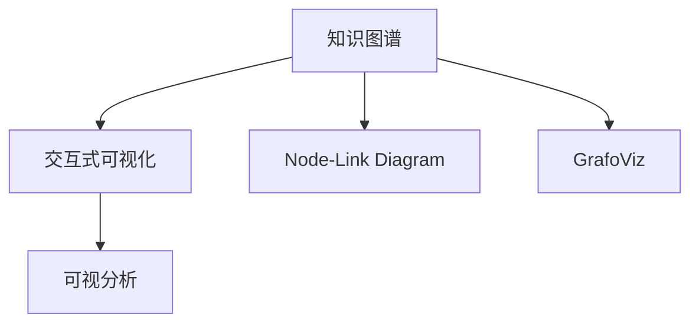

                 

# 知识图谱的可视化设计:交互式可视化和可视分析

## 1. 背景介绍

知识图谱（Knowledge Graph,KG）作为一种将结构化知识（如实体和关系）转换为图形结构的数据模型，在自然语言处理（NLP）、信息检索、知识管理等领域得到广泛应用。然而，由于其高度抽象的语义表示，普通用户难以直观地理解和使用。因此，将知识图谱以可视化形式展现，成为提升用户体验和知识获取效率的重要手段。

### 1.1 问题由来

在知识图谱的构建和应用过程中，信息呈现和交互能力不足是一个主要挑战。传统知识图谱主要基于静态、平面的图表或表格展现，用户难以直观感知数据之间的关系和重要性，也无法通过交互式操作进行深入探索和分析。

### 1.2 问题核心关键点

本文聚焦于知识图谱的可视化设计，特别是交互式可视化和可视分析的实现方法，旨在通过深入探讨核心概念和技术原理，为知识图谱的构建、展示和应用提供新的思路和工具。

## 2. 核心概念与联系

### 2.1 核心概念概述

为更好地理解交互式知识图谱可视化，本节将介绍几个密切相关的核心概念：

- **知识图谱(Knowledge Graph, KG)**：一种语义化的数据模型，通过实体-关系-实体（RDF）三元组描述世界知识结构。
- **交互式可视化(Interactive Visualization)**：指用户能够通过鼠标、键盘等交互设备，动态地探索、筛选、过滤数据，增强用户体验的技术。
- **可视分析(Visual Analytics)**：结合数据可视化与统计分析，通过图形化的方式呈现数据信息，辅助用户进行数据探索和决策。
- **Node-Link Diagram**：一种以节点（实体）和链接（关系）为基本组成元素的知识图谱展示形式。
- **GrafoViz**：一款开源的可视化工具，支持多种图形布局算法和交互特性，适用于知识图谱的可视化。

这些核心概念之间的逻辑关系可以通过以下Mermaid流程图来展示：



这个流程图展示出知识图谱与交互式可视化和可视分析之间的紧密联系：

1. 知识图谱通过Node-Link Diagram的形式，提供基础数据结构。
2. 交互式可视化技术，通过GrafoViz等工具，增强Node-Link Diagram的交互性和可探索性。
3. 可视分析，通过可视化图表和统计分析，辅助用户理解和探索知识图谱数据。

## 3. 核心算法原理 & 具体操作步骤

### 3.1 算法原理概述

知识图谱的交互式可视化主要基于以下两个核心算法：

1. **节点嵌入算法(Node Embedding Algorithm)**：通过将实体和关系映射到低维空间中的向量，捕捉节点之间的关系特征。常见的节点嵌入算法包括TransE、GraRep、Node2Vec等。
2. **图形布局算法(Graph Layout Algorithm)**：通过合理布置节点和链接，使图形结构清晰、美观。常见的图形布局算法包括Fruchterman-Reingold力导向布局、层级布局等。

交互式可视化的关键在于构建一个用户友好的界面，允许用户通过拖拽、缩放、筛选等操作，动态地查看和探索知识图谱数据。而可视分析则通过添加统计图、热力图、时间线等辅助工具，帮助用户发现数据中的规律和趋势。

### 3.2 算法步骤详解

交互式可视化的实现步骤如下：

**Step 1: 数据预处理**
- 从知识图谱中提取实体、关系、属性等信息，进行初步清洗和整理。
- 将节点和关系映射到低维空间中的向量。

**Step 2: 图形布局**
- 选择合适的图形布局算法，计算节点和链接的坐标位置。
- 可视化展示图形结构，支持用户拖动节点、调整链接等操作。

**Step 3: 交互式操作**
- 添加筛选、搜索、过滤等交互式控件。
- 实现动态调整布局、更新数据等功能。

**Step 4: 可视分析**
- 添加统计图、热力图、时间线等分析工具。
- 实现数据分析、趋势发现、模式识别等辅助功能。

**Step 5: 界面设计**
- 设计友好的用户界面，提供清晰的操作指引和提示信息。
- 实现响应式布局，适配不同设备尺寸和屏幕分辨率。

### 3.3 算法优缺点

交互式可视化具有以下优点：
1. 增强用户体验。通过拖拽、缩放、筛选等交互式操作，用户能够更加直观地理解数据结构和关系。
2. 促进数据分析。可视分析工具可以辅助用户发现数据中的模式、趋势，增强数据理解能力。
3. 支持数据探索。交互式可视化使得用户能够深入探索数据，进行可视化数据探索。

同时，交互式可视化也存在以下缺点：
1. 高计算复杂度。可视化过程中需要进行大量计算，特别是在大规模知识图谱上。
2. 可扩展性不足。交互式可视化功能过于复杂，可能会影响系统的性能和可维护性。
3. 交互界面设计困难。设计出既美观又实用的交互界面，需要丰富的UI设计经验和技巧。

### 3.4 算法应用领域

交互式可视化技术在多个领域得到了广泛应用，例如：

- **知识图谱构建与维护**：帮助知识工程师通过交互式界面进行知识图谱的构建和维护。
- **信息检索与推荐系统**：通过可视化展示知识图谱中的关系，提高信息检索和推荐系统的准确性。
- **社交网络分析**：可视化展示社交网络中的关系，辅助分析用户行为和社交结构。
- **科学研究和数据探索**：通过交互式可视化工具，辅助科学家进行数据探索和可视化分析。
- **商业智能与决策支持**：可视化展示商业数据和知识图谱，辅助企业决策和战略制定。

## 4. 数学模型和公式 & 详细讲解 & 举例说明

### 4.1 数学模型构建

本节将使用数学语言对知识图谱的交互式可视化过程进行更加严格的刻画。

记知识图谱为 $\mathcal{G}=(\mathcal{V}, \mathcal{E}, \mathcal{R})$，其中 $\mathcal{V}$ 为节点集合，$\mathcal{E}$ 为链接集合，$\mathcal{R}$ 为关系集合。

定义节点嵌入算法 $\mathcal{F}(\mathcal{V})$，将每个节点映射到一个低维向量 $z_v \in \mathbb{R}^d$，其中 $d$ 为向量维度。

定义图形布局算法 $\mathcal{L}(\mathcal{V}, \mathcal{E})$，计算节点和链接的坐标位置 $(x_v, y_v, \varphi_e)$，其中 $x_v, y_v$ 表示节点 $v$ 的坐标，$\varphi_e$ 表示链接 $e$ 的夹角。

交互式可视化的关键在于：

1. 计算节点嵌入 $\mathcal{F}$：
   $$
   z_v = \mathcal{F}(v) \in \mathbb{R}^d
   $$

2. 计算图形布局 $\mathcal{L}$：
   $$
   (x_v, y_v, \varphi_e) = \mathcal{L}(\mathcal{V}, \mathcal{E})
   $$

3. 实现交互式控件：
   $$
   \text{用户操作} = \text{UI响应}
   $$

4. 添加可视分析工具：
   $$
   \text{统计图} = \text{数据分析}
   $$

### 4.2 公式推导过程

以下我们以Node2Vec算法为例，推导知识图谱的节点嵌入过程。

Node2Vec算法是一种基于随机游走的节点嵌入算法，通过模拟节点之间的随机游走，捕捉节点之间的局部结构信息。具体推导过程如下：

假设节点 $v$ 与其邻居节点 $u_1, u_2, \cdots, u_k$ 之间存在 $k$ 条链接。通过节点 $v$ 到 $u_i$ 的随机游走，记录下节点路径 $P_i$ 和节点访问时间 $t_i$。

定义节点嵌入 $z_v$ 的计算公式为：

$$
z_v = \alpha \sum_{i=1}^{k} \eta_i \left(1 - \frac{t_i}{\sum_{j=1}^{k} t_j}\right) z_{u_i}
$$

其中，$\alpha$ 为节点嵌入强度，$\eta_i$ 为节点 $u_i$ 的访问概率。

通过上述推导，我们可以看到，Node2Vec算法通过模拟节点之间的随机游走，捕捉节点之间的局部结构信息，并将这些信息映射到低维向量中。

### 4.3 案例分析与讲解

以社交网络分析为例，可视化展示社交网络中的关系，辅助分析用户行为和社交结构。

社交网络通常表示为知识图谱 $\mathcal{G}=(\mathcal{V}, \mathcal{E}, \mathcal{R})$，其中 $\mathcal{V}$ 为节点集合，表示用户；$\mathcal{E}$ 为链接集合，表示用户之间的互动关系；$\mathcal{R}$ 为关系集合，表示互动关系的类型。

通过节点嵌入算法，将每个用户 $v$ 映射到一个低维向量 $z_v \in \mathbb{R}^d$，其中 $d$ 为向量维度。

接着，选择合适的图形布局算法，计算用户和互动关系的坐标位置 $(x_v, y_v, \varphi_e)$。通过可视化展示社交网络，用户可以通过拖拽、缩放等操作，查看用户之间的互动关系。

此外，添加统计图、热力图等可视分析工具，帮助用户发现社交网络中的规律和趋势，如用户之间的连接强度、热点话题等。

## 5. 项目实践：代码实例和详细解释说明

### 5.1 开发环境搭建

在进行交互式可视化实践前，我们需要准备好开发环境。以下是使用Python进行D3.js开发的环境配置流程：

1. 安装Node.js：从官网下载并安装Node.js，用于前端开发。
2. 创建并激活虚拟环境：
```bash
conda create -n venv python=3.8 
conda activate venv
```

3. 安装D3.js：从官网下载并安装D3.js库。
4. 安装各类工具包：
```bash
pip install numpy pandas scikit-learn matplotlib tqdm jupyter notebook ipython
```

完成上述步骤后，即可在`venv`环境中开始交互式可视化实践。

### 5.2 源代码详细实现

这里我们以社交网络分析为例，使用D3.js进行交互式可视化实践。

首先，定义社交网络的数据处理函数：

```javascript
function processGraph(graph) {
  var nodes = []
  var links = []
  
  graph.forEach(function(v, k) {
    nodes.push({ name: v })
    if (typeof k === 'object') {
      links.push({ source: v, target: k.name, weight: k.weight })
    }
  })
  
  return { nodes: nodes, links: links }
}
```

然后，定义模型和交互式控件：

```javascript
var width = 960;
var height = 500;
var svg = d3.select('body')
  .append('svg')
  .attr('width', width)
  .attr('height', height);

var node = d3.forceCollide(50)
var link = d3.forceLink()
  .distance(100)
  .id(function(d) { return d.name })

svg.append('g')
  .call(node);

svg.append('g')
  .call(link);

var simulation = d3.forceSimulation()
  .nodes(socialGraph.nodes)
  .force(node)
  .force(link)

svg.append('g')
  .call(simulation.ticks(100))
```

最后，启动交互式可视化流程：

```javascript
function init() {
  var nodes = socialGraph.nodes
  var links = socialGraph.links
  
  // 添加节点
  svg.append('g')
    .selectAll('.node')
    .data(nodes)
    .enter()
    .append('circle')
    .attr('class', 'node')
    .attr('r', 5)
    .attr('cx', function(d) { return d.x })
    .attr('cy', function(d) { return d.y })
    .style('fill', function(d) { return '#3182bd' })
    .style('stroke', 'black')
    .style('stroke-width', 1)
    .on('mouseover', highlight)
    .on('mouseout', removeHighlight);
  
  // 添加链接
  svg.append('g')
    .selectAll('.link')
    .data(links)
    .enter()
    .append('line')
    .attr('class', 'link')
    .attr('stroke', function(d) { return '#333333' })
    .attr('stroke-width', function(d) { return d.weight + 0.5 })
    .style('stroke-opacity', 0.3)
  
  function highlight(d) {
    d3.selectAll('.node')
      .style('fill', function(d) { return d === d3.event.target ? '#e0edf7' : '#3182bd' })
  }
  
  function removeHighlight(d) {
    d3.selectAll('.node')
      .style('fill', function(d) { return d === d3.event.target ? '#e0edf7' : '#3182bd' })
  }
}

init();
```

以上就是使用D3.js进行社交网络分析的交互式可视化代码实现。可以看到，D3.js提供了丰富的交互式控件和图形布局算法，使得知识图谱的可视化变得更加灵活和可操作。

### 5.3 代码解读与分析

让我们再详细解读一下关键代码的实现细节：

**processGraph函数**：
- 遍历社交网络数据，提取节点和链接信息，并返回一个包含节点和链接的JSON对象。

**节点和链接的绘制**：
- 使用D3.js的force布局算法，计算节点和链接的坐标位置，并通过SVG元素绘制到画布上。
- 添加交互式控件，如鼠标悬浮和高亮节点，增强用户体验。

**初始化函数**：
- 使用D3.js的force布局算法，初始化节点和链接的坐标位置。
- 通过draw函数，绘制社交网络图，并添加交互式控件。

**事件处理函数**：
- 添加鼠标悬浮事件，高亮选中节点。
- 添加鼠标移出事件，恢复节点颜色。

可以看到，D3.js通过灵活的JavaScript编程和强大的图形布局算法，实现了知识图谱的交互式可视化，增强了数据探索和用户交互的效率。

当然，工业级的系统实现还需考虑更多因素，如模型的保存和部署、前端性能优化、界面设计等。但核心的可视化范式基本与此类似。

## 6. 实际应用场景

### 6.1 社交网络分析

交互式可视化在社交网络分析中具有重要的应用价值。通过可视化展示社交网络中的关系，辅助用户发现社交网络中的模式和规律，识别关键人物和热点话题，从而支持社交网络的数据挖掘和分析。

具体而言，可以构建社交网络的知识图谱，使用Node2Vec等节点嵌入算法计算用户嵌入，通过力导向布局算法可视化展示用户之间的关系，用户可以通过拖拽、缩放等操作，查看用户之间的互动关系。添加统计图、热力图等可视分析工具，帮助用户发现社交网络中的规律和趋势。

### 6.2 知识图谱构建与维护

交互式可视化在知识图谱构建与维护中，提供了更直观、易用的界面，辅助知识工程师进行知识图谱的构建和维护。

具体而言，知识工程师可以通过交互式界面，输入知识图谱的实体和关系，实时展示图形结构和节点嵌入。通过拖拽、调整链接等操作，快速调整图形布局，辅助知识工程师理解知识图谱的结构和关系。同时，可视化展示节点嵌入，辅助知识工程师进行节点嵌入的选择和优化。

### 6.3 信息检索与推荐系统

交互式可视化在信息检索与推荐系统中，通过可视化展示知识图谱中的关系，提高信息检索和推荐系统的准确性。

具体而言，可以将知识图谱中的实体和关系映射到低维向量空间，通过力导向布局算法可视化展示知识图谱，用户可以通过拖拽、缩放等操作，查看知识图谱中的实体和关系。添加统计图、热力图等可视分析工具，帮助用户发现知识图谱中的模式和趋势，从而提高信息检索和推荐系统的准确性。

### 6.4 未来应用展望

随着交互式可视化技术的不断演进，未来的应用场景将更加丰富和多样。例如：

- **实时数据分析**：通过可视化展示实时数据流，帮助用户进行实时数据分析和决策。
- **虚拟现实与增强现实**：将交互式可视化技术与VR/AR技术结合，提供沉浸式的用户体验。
- **人机交互**：通过交互式可视化界面，实现更自然、高效的人机交互方式。
- **智能推荐系统**：结合知识图谱和推荐系统，通过可视化展示推荐结果，提高用户满意度。

总之，交互式可视化技术将为NLP和知识图谱应用提供更丰富的工具和更广阔的空间，推动NLP技术的发展。

## 7. 工具和资源推荐

### 7.1 学习资源推荐

为了帮助开发者系统掌握交互式可视化的理论基础和实践技巧，这里推荐一些优质的学习资源：

1. **D3.js官方文档**：提供了详细的API和示例代码，是学习D3.js的最佳资源。
2. **《D3.js权威指南》**：一本权威的D3.js入门教程，涵盖D3.js的所有核心概念和编程技巧。
3. **《Node2Vec: Scalable Feature Learning for Networks》**：介绍了Node2Vec算法的原理和应用，是学习知识图谱节点嵌入的必备资源。
4. **CS224W《图形神经网络》课程**：斯坦福大学开设的图形神经网络课程，提供了丰富的图形数据集和实验样例，适合进阶学习。
5. **《Kaggle图形数据集》**：Kaggle平台上提供了丰富的图形数据集，适合进行可视化实践。

通过对这些资源的学习实践，相信你一定能够快速掌握交互式可视化技术的精髓，并用于解决实际的NLP问题。

### 7.2 开发工具推荐

高效的开发离不开优秀的工具支持。以下是几款用于交互式可视化开发的常用工具：

1. **D3.js**：基于JavaScript的可视化库，支持丰富的交互式控件和图形布局算法，适用于数据可视化和知识图谱的展示。
2. **Highcharts**：基于JavaScript的图表库，提供了多种可视化图表和交互式控件，适用于数据可视化和统计分析。
3. **Tableau**：商业化的数据可视化工具，支持复杂的数据处理和可视化展示，适用于大规模数据集的分析。
4. **Gephi**：开源的网络可视化工具，支持多种图形布局算法和交互式控件，适用于社交网络和知识图谱的展示。
5. **Plotly**：基于JavaScript的可视化库，支持丰富的图表类型和交互式控件，适用于数据可视化和科学计算。

合理利用这些工具，可以显著提升交互式可视化任务的开发效率，加快创新迭代的步伐。

### 7.3 相关论文推荐

交互式可视化技术在NLP和知识图谱领域得到了广泛研究。以下是几篇奠基性的相关论文，推荐阅读：

1. **《Gephi: Exploring and Manipulating Large Graphs》**：介绍了Gephi工具的功能和应用，是学习网络可视化技术的经典论文。
2. **《Visualizing Knowledge Graphs》**：讨论了知识图谱可视化技术，展示了多种可视化方法。
3. **《D3.js in Action》**：详细介绍了D3.js的使用方法和最佳实践，是学习D3.js的权威资源。
4. **《Knowledge Graphs in Practice》**：介绍了知识图谱的应用，展示了多种知识图谱的构建和可视化方法。
5. **《Node2Vec: Scalable Feature Learning for Networks》**：介绍了Node2Vec算法的原理和应用，是学习知识图谱节点嵌入的必备资源。

这些论文代表了大数据可视化技术的发展脉络。通过学习这些前沿成果，可以帮助研究者把握学科前进方向，激发更多的创新灵感。

## 8. 总结：未来发展趋势与挑战

### 8.1 总结

本文对交互式知识图谱可视化方法进行了全面系统的介绍。首先阐述了知识图谱可视化的研究背景和意义，明确了交互式可视化在知识图谱构建、展示和应用中的重要作用。其次，从原理到实践，详细讲解了交互式可视化的数学模型和关键步骤，给出了交互式可视化任务开发的完整代码实例。同时，本文还广泛探讨了交互式可视化技术在多个领域的应用前景，展示了其巨大的潜力。

通过本文的系统梳理，可以看到，交互式可视化技术在知识图谱领域具有广泛的应用前景和重要的研究价值。这些方向的探索发展，必将进一步提升知识图谱系统的性能和应用范围，为NLP技术的发展提供新的动力。

### 8.2 未来发展趋势

展望未来，交互式可视化技术将呈现以下几个发展趋势：

1. **数据处理能力的提升**：随着计算机算力的提升和存储技术的进步，交互式可视化技术将能够处理更大规模的数据集，支持更复杂的可视化任务。
2. **交互式体验的改善**：交互式可视化技术将通过引入更多交互控件和更灵活的布局算法，提升用户的交互体验，增强用户的操作便捷性和直观性。
3. **智能分析工具的融合**：交互式可视化技术将与AI、机器学习等技术深度融合，提供更智能的数据分析和可视化功能。
4. **跨平台和跨设备的支持**：交互式可视化技术将支持多种平台和设备，包括移动端、桌面端和Web端，实现更加灵活的展示和应用。
5. **可视化技术的演进**：交互式可视化技术将结合新技术，如VR/AR、增强现实等，提供更加沉浸式的用户体验。

以上趋势凸显了交互式可视化技术的广阔前景。这些方向的探索发展，必将进一步提升交互式可视化系统的性能和用户体验，推动知识图谱和NLP技术的发展。

### 8.3 面临的挑战

尽管交互式可视化技术已经取得了瞩目成就，但在迈向更加智能化、普适化应用的过程中，它仍面临着诸多挑战：

1. **高计算复杂度**：可视化过程中需要进行大量计算，特别是在大规模数据集上。如何优化计算过程，提升系统的响应速度，是一个重要研究方向。
2. **可扩展性不足**：交互式可视化功能过于复杂，可能会影响系统的性能和可维护性。如何设计可扩展的架构，增强系统的灵活性和可维护性，是一个重要课题。
3. **数据隐私和安全**：可视化过程中需要处理大量敏感数据，如何保护数据隐私和安全，是一个重要挑战。
4. **界面设计困难**：设计出既美观又实用的交互界面，需要丰富的UI设计经验和技巧。如何提高界面设计的效率和质量，是一个重要问题。

### 8.4 研究展望

面对交互式可视化面临的这些挑战，未来的研究需要在以下几个方面寻求新的突破：

1. **优化计算过程**：通过引入并行计算、分布式计算等技术，优化可视化过程中的计算过程，提高系统的响应速度和效率。
2. **设计可扩展架构**：设计可扩展的交互式可视化架构，支持多种交互控件和布局算法，增强系统的灵活性和可维护性。
3. **保护数据隐私和安全**：引入数据隐私保护技术，如数据脱敏、加密等，保护数据隐私和安全。
4. **提高界面设计效率**：通过设计工具和模板库，提高界面设计的效率和质量，辅助开发者进行界面设计。
5. **融合智能分析技术**：结合AI、机器学习等技术，提供更智能的数据分析和可视化功能。

这些研究方向的探索，必将引领交互式可视化技术迈向更高的台阶，为知识图谱和NLP技术的发展提供新的动力。

## 9. 附录：常见问题与解答

**Q1：知识图谱的可视化需要哪些技术和工具？**

A: 知识图谱的可视化主要需要以下技术和工具：
1. 节点嵌入算法，如Node2Vec、GraRep等。
2. 图形布局算法，如力导向布局、层级布局等。
3 可视化工具，如D3.js、Gephi等。

**Q2：如何选择合适的网络布局算法？**

A: 选择合适的网络布局算法需要考虑以下几个因素：
1. 数据规模：大数据集适合力导向布局，小数据集适合层级布局。
2. 数据类型：有向图适合力导向布局，无向图适合层级布局。
3. 视觉效果：不同布局算法对视觉效果有不同的影响，如力导向布局可以展示节点间的距离关系，层级布局可以展示树形结构。

**Q3：如何提升交互式可视化系统的性能？**

A: 提升交互式可视化系统的性能需要从以下几个方面入手：
1. 优化计算过程：通过引入并行计算、分布式计算等技术，优化可视化过程中的计算过程，提高系统的响应速度和效率。
2. 设计可扩展架构：设计可扩展的交互式可视化架构，支持多种交互控件和布局算法，增强系统的灵活性和可维护性。
3. 引入缓存机制：通过引入缓存机制，减少重复计算，提高系统效率。
4. 优化数据结构：通过优化数据结构，减少内存占用，提高系统性能。

**Q4：如何保护数据隐私和安全？**

A: 保护数据隐私和安全需要从以下几个方面入手：
1. 数据脱敏：通过数据脱敏技术，保护数据的隐私性。
2. 数据加密：通过数据加密技术，保护数据的安全性。
3. 访问控制：通过访问控制技术，限制数据的访问权限，保护数据安全。

**Q5：如何设计友好的交互界面？**

A: 设计友好的交互界面需要从以下几个方面入手：
1. 界面简洁明了：设计简洁明了的界面，让用户能够快速理解和使用。
2. 交互自然流畅：设计自然流畅的交互界面，让用户能够轻松进行操作。
3. 反馈及时准确：设计及时准确的反馈机制，增强用户体验。

这些问题的解答，可以帮助开发者更好地理解和应用交互式可视化技术，为知识图谱的构建和应用提供有力的支持。

---

作者：禅与计算机程序设计艺术 / Zen and the Art of Computer Programming

