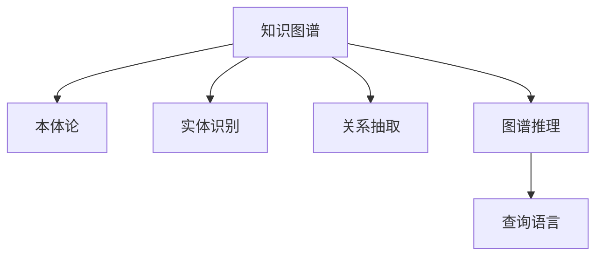

                 

# 知识图谱：构建人类知识的网络

## 1. 背景介绍

### 1.1 问题由来
随着信息技术的高速发展，人类知识总量呈指数级增长，从图书、期刊到电子文档、在线资源，信息无处不在。然而，由于信息的爆炸性增长，传统的信息检索方式——基于关键词的文本搜索，已经难以满足人们日益增长的知识获取需求。因此，如何将海量的知识进行结构化组织，构建起一个可查询、可推理的知识网络，成为了知识工程领域的重要研究课题。

知识图谱（Knowledge Graph）作为构建知识网络的一种形式，通过将实体和实体之间的关系以图的形式呈现，提供了一种全新的信息检索和知识推理手段。知识图谱的应用场景广泛，涵盖医疗、教育、金融、电商等多个领域，对于提升信息检索的准确性和智能性，推动知识的深度整合和应用具有重要意义。

### 1.2 问题核心关键点
知识图谱的核心目标是通过关系型数据将孤立的知识片段有机地整合起来，形成一个可查询、可推理的知识网络。其核心关键点包括：

- 实体抽取与识别：从文本中抽取具有实际意义的实体，并进行分类和标准化。
- 关系抽取与建模：识别实体之间的关系，并通过规则或机器学习模型进行关系抽取和建模。
- 图谱构建与存储：将抽取出的实体和关系构建成知识图谱，并选择合适的存储方式。
- 图谱推理与查询：提供基于图谱的查询和推理服务，支持多种语义查询。

这些关键点构成了知识图谱的构建和应用框架，使其能够有效地将人类知识进行组织和利用。

## 2. 核心概念与联系

### 2.1 核心概念概述

为更好地理解知识图谱的构建方法，本节将介绍几个密切相关的核心概念：

- 知识图谱：通过将实体和关系以图的形式表示，构建起一个描述物理世界和抽象概念的模型。知识图谱通常由节点（实体）和边（关系）构成，是机器学习、自然语言处理等技术的融合应用。
- 本体论（Ontology）：知识图谱的理论基础，通过定义实体和关系的定义、性质和层次结构，为知识图谱提供了一套严格的逻辑体系。
- 实体识别（Named Entity Recognition, NER）：从文本中识别出具有特定意义的实体，如人名、地名、机构名等。
- 关系抽取（Relation Extraction, RE）：从文本中识别出实体之间的关系，如“出生于”、“工作于”等。
- 图谱推理（Graph Reasoning）：通过知识图谱进行推理计算，判断实体的性质、关系等，并支持各种语义查询。
- 查询语言（Query Language）：定义用于知识图谱查询的语法规则，如RDF、SPARQL等。

这些核心概念之间的逻辑关系可以通过以下Mermaid流程图来展示：



这个流程图展示的知识图谱的核心概念及其之间的关系：

1. 知识图谱基于本体论提供的关系和实体定义，通过实体识别和关系抽取构建实体-关系图谱。
2. 图谱推理基于知识图谱进行逻辑推理，判断实体和关系，支持各种语义查询。
3. 查询语言定义了如何对知识图谱进行查询，可以通过编程或自然语言进行交互。

## 3. 核心算法原理 & 具体操作步骤
### 3.1 算法原理概述

知识图谱的构建主要分为实体抽取、关系抽取和图谱推理三个步骤，每个步骤都包含多种算法和技术，下面将逐一介绍：

### 3.2 算法步骤详解

#### 实体抽取

实体抽取是从文本中识别出具有实际意义的实体，并对其进行分类和标准化。其主要算法包括：

1. 基于规则的方法：通过编写正则表达式或定义预定义实体列表，对文本进行匹配和抽取。
2. 基于统计的方法：使用机器学习模型，如条件随机场（CRF）、支持向量机（SVM）等，对文本进行特征提取和分类。
3. 基于深度学习的方法：使用神经网络模型，如BERT、LSTM等，通过上下文语境进行实体识别。

#### 关系抽取

关系抽取是从文本中识别出实体之间的关系，并将其抽取出来。主要算法包括：

1. 基于规则的方法：通过编写正则表达式或定义预定义关系列表，对文本进行匹配和抽取。
2. 基于统计的方法：使用机器学习模型，如逻辑回归、SVM等，对文本进行特征提取和分类。
3. 基于深度学习的方法：使用神经网络模型，如Transformer、CNN等，通过上下文语境进行关系抽取。

#### 图谱构建与存储

知识图谱的构建通常需要将抽取出的实体和关系存储在数据库或图形数据库中。存储方式包括：

1. RDBMS（关系型数据库）：通过SQL语言进行数据管理，适用于小规模的图谱构建。
2. GraphDB：专为存储图谱设计的图形数据库，支持高效的图谱存储和查询。
3. NoSQL数据库：如Neo4j，支持高效的图形存储和处理，适用于大规模图谱构建。

#### 图谱推理与查询

知识图谱的推理与查询是知识图谱应用的核心，主要算法包括：

1. 基于规则的方法：通过编写推理规则，对图谱进行推理计算。
2. 基于统计的方法：使用机器学习模型，如贝叶斯网络、决策树等，对图谱进行推理计算。
3. 基于深度学习的方法：使用神经网络模型，如深度强化学习、图神经网络等，对图谱进行推理计算。

### 3.3 算法优缺点

知识图谱的构建和应用方法具有以下优点：

1. 结构化组织：通过将实体和关系以图的形式表示，能够更直观、准确地表达知识，方便查询和推理。
2. 跨领域融合：知识图谱能够将不同领域、不同来源的知识进行整合，形成一个统一的知识库。
3. 语义查询：基于知识图谱进行语义查询，能够获得更准确、有意义的搜索结果。
4. 可扩展性：知识图谱支持动态更新，能够不断补充新的实体和关系，保持知识的鲜活性。

同时，知识图谱的构建和应用方法也存在以下局限性：

1. 数据获取难度：知识图谱的构建需要大量高质量的数据，获取这些数据的时间和成本较高。
2. 数据质量问题：如果数据来源不统一，或者存在噪声、错误，知识图谱的准确性将受到影响。
3. 计算复杂度：知识图谱的推理和查询通常涉及复杂的图谱计算，对计算资源要求较高。
4. 维护成本高：知识图谱的构建和维护需要大量人工参与，且需要持续更新，成本较高。

尽管存在这些局限性，但知识图谱仍然是一种具有重要价值的知识组织和应用方式，特别是在需要高精度、高性能知识检索和推理的场景中，具有不可替代的作用。

### 3.4 算法应用领域

知识图谱在多个领域得到了广泛应用，涵盖医疗、教育、金融、电商等多个领域，具体包括：

1. 医疗知识图谱：用于构建医学知识图谱，支持疾病诊断、治疗方案推荐、药物研发等。
2. 教育知识图谱：用于构建教育知识图谱，支持课程推荐、学习路径规划等。
3. 金融知识图谱：用于构建金融知识图谱，支持投资建议、风险评估等。
4. 电商知识图谱：用于构建电商知识图谱，支持商品推荐、广告投放等。

除了这些传统应用外，知识图谱还被创新性地应用到更多场景中，如智能问答、智能推荐、智能搜索等，为人工智能技术的发展提供了新的思路和方法。

## 4. 数学模型和公式 & 详细讲解  
### 4.1 数学模型构建

知识图谱的构建和应用通常涉及到大量的实体和关系，可以抽象为一个三元组图谱 $(E,R,L)$，其中 $E$ 表示实体集合，$R$ 表示关系集合，$L$ 表示实体的属性集合。

定义知识图谱上的边 $(u,v,r)$，其中 $u$ 和 $v$ 表示两个实体，$r$ 表示实体之间的某种关系。通常，知识图谱可以用图论中的邻接矩阵表示：

$$
A_{u,v} = \begin{cases}
1, & \text{if } (u,v) \in R \\
0, & \text{otherwise}
\end{cases}
$$

其中 $A$ 为邻接矩阵，$R$ 为关系集合。

### 4.2 公式推导过程

以医疗知识图谱为例，定义实体集合 $E=\{p,\text{disease},\text{symptom},\text{medication}\}$，关系集合 $R=\{\text{hasSymptom},\text{hasTreatment},\text{hasSideEffect}\}$，属性集合 $L=\{\text{type},\text{severity},\text{drugInfo}\}$。

知识图谱的推理可以表示为一系列逻辑推理规则。以疾病诊断为例，假设已知患者 $p$ 有症状 $s$，可以推理出患者 $p$ 可能患有某种疾病 $d$：

$$
\text{hasSymptom}(p,s) \rightarrow \text{hasDisease}(p,d)
$$

这种推理过程可以通过逻辑推理规则进行自动化处理，同时也可以使用机器学习方法进行优化。

### 4.3 案例分析与讲解

以医疗知识图谱为例，我们可以使用知识图谱进行疾病诊断和治疗方法推荐。

1. 疾病诊断：已知患者 $p$ 有症状 $s_1$、$s_2$、$s_3$，可以从知识图谱中推理出患者 $p$ 可能患有某种疾病 $d$，推理过程如下：

$$
\text{hasSymptom}(p,s_1) \land \text{hasSymptom}(p,s_2) \land \text{hasSymptom}(p,s_3) \rightarrow \exists d \in D (d \in D)
$$

其中 $D$ 为所有可能的疾病集合。

2. 治疗方法推荐：已知患者 $p$ 患有某种疾病 $d$，可以推理出可能的治疗方法 $m$，推理过程如下：

$$
\text{hasDisease}(p,d) \rightarrow \exists m \in M (m \in M)
$$

其中 $M$ 为所有可能的治疗方法集合。

通过这些推理过程，知识图谱可以辅助医生进行诊断和治疗决策，提高医疗服务的准确性和效率。

## 5. 项目实践：代码实例和详细解释说明
### 5.1 开发环境搭建

在进行知识图谱项目实践前，我们需要准备好开发环境。以下是使用Python进行PyTorch开发的环境配置流程：

1. 安装Anaconda：从官网下载并安装Anaconda，用于创建独立的Python环境。

2. 创建并激活虚拟环境：
```bash
conda create -n pytorch-env python=3.8 
conda activate pytorch-env
```

3. 安装PyTorch：根据CUDA版本，从官网获取对应的安装命令。例如：
```bash
conda install pytorch torchvision torchaudio cudatoolkit=11.1 -c pytorch -c conda-forge
```

4. 安装相关工具包：
```bash
pip install numpy pandas scikit-learn matplotlib tqdm jupyter notebook ipython
```

完成上述步骤后，即可在`pytorch-env`环境中开始项目实践。

### 5.2 源代码详细实现

下面我们以医疗知识图谱为例，给出使用PyTorch进行知识图谱构建的PyTorch代码实现。

首先，定义知识图谱的实体和关系：

```python
import torch
from torch import nn
from torch.nn import Parameter

class KnowledgeGraph(nn.Module):
    def __init__(self, entities, relations):
        super(KnowledgeGraph, self).__init__()
        self.entities = entities
        self.relations = relations
        self.num_entities = len(entities)
        self.num_relations = len(relations)
        
        # 初始化实体和关系的表示向量
        self.entity_embeddings = nn.Embedding(self.num_entities, 100)
        self.relation_embeddings = nn.Embedding(self.num_relations, 100)
        
    def forward(self, entities, relations):
        # 对实体和关系进行嵌入
        entity_embeddings = self.entity_embeddings(entities)
        relation_embeddings = self.relation_embeddings(relations)
        
        # 计算边向量
        edge_embeddings = entity_embeddings[0] + relation_embeddings[0]
        
        return edge_embeddings
```

然后，定义训练函数：

```python
import torch.optim as optim

# 定义优化器
optimizer = optim.Adam(model.parameters(), lr=0.001)

# 定义损失函数
loss_fn = nn.MSELoss()

# 训练函数
def train_epoch(model, data_loader):
    model.train()
    losses = []
    
    for i, (entities, relations, edge_embeddings) in enumerate(data_loader):
        # 对输入进行前向传播
        outputs = model(entities, relations)
        
        # 计算损失
        loss = loss_fn(outputs, edge_embeddings)
        
        # 反向传播
        optimizer.zero_grad()
        loss.backward()
        optimizer.step()
        
        # 记录损失
        losses.append(loss.item())
    
    return sum(losses) / len(data_loader)
```

最后，启动训练流程：

```python
import torch.utils.data

# 定义数据集
class MedicalDataset(torch.utils.data.Dataset):
    def __init__(self, data):
        self.data = data
        
    def __len__(self):
        return len(self.data)
    
    def __getitem__(self, idx):
        return self.data[idx]

# 加载数据集
entities = ['p', 'disease', 'symptom', 'medication']
relations = ['hasSymptom', 'hasTreatment', 'hasSideEffect']
data = [('p', 'hasSymptom', 's1'), ('disease', 'hasTreatment', 'm1'), ('medication', 'hasSideEffect', 's2')]
dataset = MedicalDataset(data)

# 定义数据加载器
data_loader = torch.utils.data.DataLoader(dataset, batch_size=32)

# 初始化模型
model = KnowledgeGraph(entities, relations)

# 训练模型
for epoch in range(10):
    loss = train_epoch(model, data_loader)
    print(f'Epoch {epoch+1}, loss: {loss:.4f}')
```

以上就是使用PyTorch构建医疗知识图谱的完整代码实现。可以看到，通过简单的神经网络模型，可以很方便地构建起一个基于图谱的知识表示方法，并使用梯度下降进行训练。

### 5.3 代码解读与分析

让我们再详细解读一下关键代码的实现细节：

**MedicalDataset类**：
- `__init__`方法：初始化数据集，将数据集数据存储为列表。
- `__len__`方法：返回数据集的长度。
- `__getitem__`方法：返回数据集中指定位置的样本。

**KnowledgeGraph类**：
- `__init__`方法：初始化知识图谱的实体和关系集合，以及对应的嵌入层。
- `forward`方法：对输入的实体和关系进行嵌入，计算边向量。

**train_epoch函数**：
- 对模型进行前向传播，计算损失，并反向传播更新模型参数。
- 记录每个epoch的平均损失，并返回。

**训练流程**：
- 定义数据集和数据加载器，用于批量化加载数据。
- 初始化模型，并设置优化器和损失函数。
- 循环迭代训练，输出每个epoch的平均损失。

可以看到，通过使用PyTorch，构建和训练知识图谱的过程变得非常简单。开发者可以将更多精力放在模型设计和优化上，而不必过多关注底层的实现细节。

当然，在实际应用中，还需要考虑更多的因素，如数据预处理、超参数调优、模型评估等，但核心的知识图谱构建流程基本与此类似。

## 6. 实际应用场景
### 6.1 智能医疗系统

知识图谱在医疗领域有着广泛的应用。传统的医疗信息检索和诊断通常依赖于人工经验，费时费力且准确性不高。通过构建医疗知识图谱，可以实现智能化的医疗信息检索和诊断，辅助医生进行疾病诊断和治疗方案推荐。

以疾病诊断为例，知识图谱可以整合医学知识，将疾病的症状、病理、治疗等信息有机地关联起来，通过逻辑推理和知识推理，帮助医生更准确地进行诊断。同时，知识图谱还可以根据病人的症状和历史数据，推荐最合适的治疗方案，提高医疗服务的效率和质量。

### 6.2 智能教育系统

在教育领域，知识图谱可以帮助构建知识关联网络，支持智能化的学习路径规划和课程推荐。通过分析学生的学习行为和兴趣，知识图谱可以推荐最适合的学习路径和课程，提高学习效果和兴趣。

此外，知识图谱还可以用于知识点的关联和整合，帮助学生更好地理解复杂概念，提高学习的深度和广度。通过逻辑推理和知识推理，知识图谱可以辅助学生进行问题解答，提高学习效率和效果。

### 6.3 智能金融系统

在金融领域，知识图谱可以用于构建金融知识图谱，支持智能化的投资建议和风险评估。通过分析市场数据和历史交易信息，知识图谱可以推荐最优的投资方案，提高投资收益和风险管理能力。

此外，知识图谱还可以用于欺诈检测和风险预警，通过分析交易行为和历史数据，知识图谱可以识别出异常交易和潜在风险，提前预警和防范金融风险。

### 6.4 未来应用展望

随着知识图谱技术的不断发展，其在更多领域的应用前景也将越来越广阔。未来，知识图谱将在智能制造、智能物流、智能城市等多个领域得到应用，推动各行业的数字化转型和智能化升级。

在智能制造领域，知识图谱可以用于设备和生产流程的优化管理，提高生产效率和质量。在智能物流领域，知识图谱可以用于路径规划和货物跟踪，提高物流效率和准确性。在智能城市治理中，知识图谱可以用于城市事件监测和应急指挥，提高城市管理的智能化水平。

## 7. 工具和资源推荐
### 7.1 学习资源推荐

为了帮助开发者系统掌握知识图谱的理论基础和实践技巧，这里推荐一些优质的学习资源：

1. 《Knowledge Graphs: Concepts, Algorithms, and Applications》书籍：该书系统介绍了知识图谱的基本概念、算法和应用，是知识图谱领域的重要参考资料。
2. GraphQL官方文档：GraphQL是一种用于API构建的查询语言，可以用于构建知识图谱的查询接口。
3. Turtle语言教程：Turtle是知识图谱常用的查询语言之一，用于构建和查询知识图谱。
4. OWL本体语言教程：OWL是语义网领域的重要本体语言，用于定义和描述知识图谱。
5. Stanford Knowledge Base Construction Project（KB-C construction project）：该项目提供了大规模知识图谱的构建方法和工具，值得学习和借鉴。

通过对这些资源的学习实践，相信你一定能够快速掌握知识图谱的精髓，并用于解决实际的NLP问题。

### 7.2 开发工具推荐

高效的开发离不开优秀的工具支持。以下是几款用于知识图谱开发的常用工具：

1. Neo4j：全球领先的图形数据库，支持大规模知识图谱的存储和查询。
2. SPARQL：用于查询知识图谱的标准查询语言，支持语义查询和推理。
3. Gephi：可视化工具，用于展示和分析知识图谱的网络结构。
4. TensorFlow：深度学习框架，支持知识图谱的推理和计算。
5. Jupyter Notebook：交互式编程环境，支持知识图谱的构建和验证。

合理利用这些工具，可以显著提升知识图谱开发和应用的速度和效率。

### 7.3 相关论文推荐

知识图谱的研究始于1990年代，近年来随着深度学习技术的进展，知识图谱的应用和研究也取得了显著进展。以下是几篇奠基性的相关论文，推荐阅读：

1. FRIA: Facet-Relation Induction and Alignment in Knowledge Bases：提出了一种基于用户查询反馈的知识图谱自动构建方法，通过交互式的方式构建知识图谱。
2. KEA: Knowledge Embeddings as Alignment：提出了一种基于向量空间的知识图谱嵌入方法，通过优化实体和关系的向量表示，提升知识图谱的推理性能。
3. TransE: Learning Entity and Relationship Representations with DistMult：提出了一种基于TransE的知识图谱嵌入方法，通过优化实体和关系的向量表示，提升知识图谱的推理性能。
4. PEARL: Probabilistic Entity Alignment for Linkage and Ranking：提出了一种基于概率的知识图谱对齐方法，通过多视角对齐实体，提升知识图谱的融合效果。

这些论文代表了大语言模型微调技术的发展脉络。通过学习这些前沿成果，可以帮助研究者把握学科前进方向，激发更多的创新灵感。

## 8. 总结：未来发展趋势与挑战

### 8.1 总结

本文对知识图谱的构建方法进行了全面系统的介绍。首先阐述了知识图谱的背景和意义，明确了其在构建知识网络方面的重要作用。其次，从原理到实践，详细讲解了知识图谱的实体抽取、关系抽取和图谱推理等核心步骤，给出了知识图谱项目开发的完整代码实例。同时，本文还广泛探讨了知识图谱在医疗、教育、金融等多个领域的应用前景，展示了知识图谱的巨大潜力。

通过本文的系统梳理，可以看到，知识图谱作为构建知识网络的重要工具，其应用范围和影响正在逐步扩大。伴随深度学习技术的进步，知识图谱将为人工智能技术的发展提供新的突破点，推动各行业的智能化升级。

### 8.2 未来发展趋势

展望未来，知识图谱的发展将呈现以下几个趋势：

1. 数据质量提升：随着大数据技术的进步，知识图谱的数据获取和处理能力将进一步提升，数据的准确性和完整性将得到提高。
2. 模型融合技术发展：未来的知识图谱将更多地融合深度学习、自然语言处理等技术，提升推理和查询的准确性。
3. 跨领域知识整合：未来的知识图谱将更多地整合跨领域知识，形成一个统一的、多模态的知识网络。
4. 实时化、动态化更新：未来的知识图谱将更多地支持实时更新，动态地获取和整合新知识。
5. 可解释性和透明性：未来的知识图谱将更多地关注可解释性和透明性，提高系统的可解释性和可信度。

以上趋势凸显了知识图谱技术的广阔前景。这些方向的探索发展，必将进一步提升知识图谱系统的性能和应用范围，为人工智能技术的发展提供新的突破点。

### 8.3 面临的挑战

尽管知识图谱技术已经取得了显著进展，但在向更加智能化、普适化应用的过程中，仍面临诸多挑战：

1. 数据获取难度：构建高质量的知识图谱需要大量的数据，获取这些数据的时间和成本较高。
2. 数据质量问题：如果数据来源不统一，或者存在噪声、错误，知识图谱的准确性将受到影响。
3. 计算复杂度：知识图谱的推理和查询通常涉及复杂的图谱计算，对计算资源要求较高。
4. 维护成本高：知识图谱的构建和维护需要大量人工参与，且需要持续更新，成本较高。
5. 可解释性和透明性：知识图谱的系统缺乏可解释性和透明性，难以解释其内部工作机制和决策逻辑。

尽管存在这些挑战，但知识图谱作为一种重要的知识组织和应用方式，其应用前景仍然非常广阔。

### 8.4 研究展望

面对知识图谱所面临的挑战，未来的研究需要在以下几个方面寻求新的突破：

1. 探索无监督和半监督知识图谱构建方法：摆脱对大规模标注数据的依赖，利用自监督学习、主动学习等无监督和半监督范式，最大限度利用非结构化数据。
2. 研究知识图谱的语义查询优化技术：通过优化查询语言和推理算法，提升知识图谱的查询和推理效率。
3. 融合深度学习和自然语言处理技术：通过引入深度学习和自然语言处理技术，提升知识图谱的推理和查询能力。
4. 开发可解释性和透明性的知识图谱系统：通过引入可解释性技术和透明性机制，提高知识图谱系统的可解释性和可信度。

这些研究方向的探索，必将引领知识图谱技术迈向更高的台阶，为构建智能化的知识服务系统铺平道路。面向未来，知识图谱技术还需要与其他人工智能技术进行更深入的融合，如知识表示、因果推理、强化学习等，多路径协同发力，共同推动人工智能技术的发展。

## 9. 附录：常见问题与解答

**Q1：知识图谱的构建需要哪些步骤？**

A: 知识图谱的构建主要分为实体抽取、关系抽取和图谱推理三个步骤，每个步骤都需要进行详细的处理。

1. 实体抽取：从文本中识别出具有实际意义的实体，并进行分类和标准化。
2. 关系抽取：从文本中识别出实体之间的关系，并将其抽取出来。
3. 图谱构建与存储：将抽取出的实体和关系存储在数据库或图形数据库中。
4. 图谱推理与查询：通过逻辑推理和知识推理，支持各种语义查询。

这些步骤构成了知识图谱的构建和应用框架，使其能够有效地将人类知识进行组织和利用。

**Q2：知识图谱的优势和局限性有哪些？**

A: 知识图谱具有以下优势：

1. 结构化组织：通过将实体和关系以图的形式表示，能够更直观、准确地表达知识，方便查询和推理。
2. 跨领域融合：知识图谱能够将不同领域、不同来源的知识进行整合，形成一个统一的知识库。
3. 语义查询：基于知识图谱进行语义查询，能够获得更准确、有意义的搜索结果。
4. 可扩展性：知识图谱支持动态更新，能够不断补充新的实体和关系，保持知识的鲜活性。

同时，知识图谱也存在以下局限性：

1. 数据获取难度：构建高质量的知识图谱需要大量的数据，获取这些数据的时间和成本较高。
2. 数据质量问题：如果数据来源不统一，或者存在噪声、错误，知识图谱的准确性将受到影响。
3. 计算复杂度：知识图谱的推理和查询通常涉及复杂的图谱计算，对计算资源要求较高。
4. 维护成本高：知识图谱的构建和维护需要大量人工参与，且需要持续更新，成本较高。

尽管存在这些局限性，但知识图谱仍然是一种具有重要价值的知识组织和应用方式，特别是在需要高精度、高性能知识检索和推理的场景中，具有不可替代的作用。

**Q3：知识图谱的推理和查询是如何实现的？**

A: 知识图谱的推理和查询通常涉及到复杂的图谱计算，可以通过以下步骤实现：

1. 定义知识图谱的实体和关系：将知识图谱中的实体和关系表示为向量，构建邻接矩阵。
2. 定义推理规则：通过编写逻辑推理规则，对知识图谱进行推理计算。
3. 定义查询语言：通过定义查询语言，对知识图谱进行查询。

常见的查询语言包括RDF和SPARQL，通过这些查询语言，可以对知识图谱进行复杂的语义查询和推理。

通过这些步骤，知识图谱可以实现对实体和关系的推理和查询，从而支持各种应用场景。

---

作者：禅与计算机程序设计艺术 / Zen and the Art of Computer Programming

