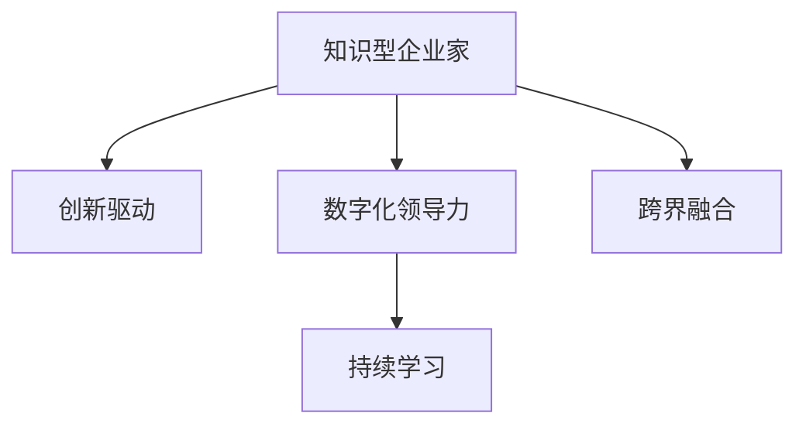

                 

# 知识型企业家精神的培养

> 关键词：知识型企业家、创新驱动、数字化转型、数字领导力、持续学习、跨界融合

## 1. 背景介绍

### 1.1 问题由来
随着全球化和信息技术的迅猛发展，企业的经营环境发生了深刻变化。过去，传统制造业和销售渠道是企业竞争的主要战场。而今天，互联网、大数据、人工智能等新技术已经深刻改变了企业的运营模式和竞争格局。如何在新时代背景下培养出具有全球竞争力的企业家，是摆在每一个企业面前的重要课题。

### 1.2 问题核心关键点
知识型企业家，是指具有强烈创新意识和高度数字化敏锐度，能够把握技术趋势、推动企业创新发展的企业家。他们不仅是企业的掌舵人，更是新技术和理念的传播者和实践者。

在数字化转型的大趋势下，知识型企业家精神的核心在于创新驱动和数字化领导力。具体表现为：
- **创新驱动**：通过持续技术创新和新业务模式探索，引领企业不断突破现有边界，拓展新的增长点。
- **数字化领导力**：利用信息化工具和平台，提升企业的决策效率和执行力，实现管理流程的数字化和智能化。
- **持续学习**：在不断变化的商业环境中，保持对新技术、新知识的持续学习和应用，保持企业发展的活力和竞争力。
- **跨界融合**：跨越传统的行业界限，将信息技术、新材料、新能源等新兴技术与传统行业深度融合，创造新的商业模式和价值链。

### 1.3 问题研究意义
培养知识型企业家精神，对于企业和国家的长远发展具有重要意义：

1. **企业创新能力的提升**：知识型企业家能够敏锐地发现市场机会，推动企业进行产品和服务的创新，提升企业的市场竞争力和盈利能力。
2. **数字化转型的加速**：通过引入数字化领导力和技术应用，实现企业的流程优化和效率提升，加速向数字经济转型。
3. **人才梯队建设**：知识型企业家精神能够带动整个企业文化的变革，吸引和培养更多具备创新意识和数字化能力的人才，形成健康的企业人才梯队。
4. **企业生态系统的构建**：通过跨界融合，构建一个包括客户、合作伙伴、员工在内的企业生态系统，实现资源的优化配置和价值共创。

## 2. 核心概念与联系

### 2.1 核心概念概述

为更好地理解知识型企业家精神的培养，本节将介绍几个密切相关的核心概念：

- **知识型企业家(Knowledge-based Entrepreneur)**：具有较强的创新意识和数字化能力，能够领导企业进行技术创新和数字化转型的企业家。
- **创新驱动(Drive Innovation)**：通过持续的技术创新和新业务模式探索，推动企业向新领域拓展。
- **数字化领导力(Digital Leadership)**：利用信息化工具和平台，提升企业的决策效率和执行力，实现管理流程的数字化和智能化。
- **持续学习(Lifelong Learning)**：在不断变化的商业环境中，保持对新技术、新知识的持续学习和应用。
- **跨界融合(Cross-disciplinary Integration)**：跨越传统的行业界限，将信息技术、新材料、新能源等新兴技术与传统行业深度融合，创造新的商业模式和价值链。

这些核心概念之间的逻辑关系可以通过以下Mermaid流程图来展示：



这个流程图展示了一系列核心概念及其之间的关系：

1. 知识型企业家是创新驱动和数字化领导力的实施者。
2. 创新驱动是企业发展的核心动力。
3. 数字化领导力是实现创新驱动的工具和手段。
4. 持续学习是企业保持创新活力的关键。
5. 跨界融合是创新和数字化领导力拓展的途径。

这些概念共同构成了知识型企业家精神的理论框架，为企业的发展方向提供了全面的指导。

## 3. 核心算法原理 & 具体操作步骤
### 3.1 算法原理概述

知识型企业家精神的培养，涉及到企业战略规划、技术创新、组织变革等多个方面。本节将从算法的角度，探讨如何通过科学的方法和流程，实现知识型企业家精神的塑造。

### 3.2 算法步骤详解

#### 3.2.1 战略规划

企业战略规划是知识型企业家精神的起点。一个科学的战略规划应包括以下步骤：

1. **市场分析**：分析市场趋势、竞争对手状况、消费者需求等，制定有针对性的战略目标。
2. **技术评估**：评估新技术的潜力和应用场景，确定技术创新方向。
3. **资源配置**：合理配置企业资源，如资金、人力、技术等，支持战略实施。
4. **风险管理**：制定应对市场变化和突发事件的预案，确保战略的稳健实施。

在实际操作中，可以使用SWOT分析、PEST分析等工具，对企业进行深入的战略规划。

#### 3.2.2 技术创新

技术创新是知识型企业家精神的核心驱动力。通过技术创新，企业能够持续获得市场竞争优势。

1. **研发投入**：加大研发投入，支持新技术的研发和应用。
2. **合作伙伴**：与高校、科研机构等合作，引入外部技术资源。
3. **知识产权**：保护知识产权，防止技术被模仿和抄袭。
4. **创新生态**：构建开放的创新生态系统，吸引和培养创新人才。

在实际操作中，可以引入技术创新管理体系，如R&D部门、孵化器、创业基金等，系统推动技术创新。

#### 3.2.3 组织变革

组织变革是知识型企业家精神的保障。通过组织变革，企业能够适应快速变化的市场环境。

1. **敏捷管理**：引入敏捷管理方法，提升组织灵活性和反应速度。
2. **人才管理**：建立人才管理体系，吸引和保留创新人才。
3. **文化建设**：塑造创新文化和团队精神，激励员工积极参与创新活动。
4. **绩效评估**：建立科学的绩效评估体系，确保创新成果的转化。

在实际操作中，可以引入敏捷开发、OKR（目标与关键结果）等方法，提升组织变革的效率和效果。

#### 3.2.4 持续学习

持续学习是知识型企业家精神的重要支撑。通过持续学习，企业能够不断更新知识储备，适应新环境。

1. **学习平台**：建设企业内部学习平台，提供在线学习资源和工具。
2. **培训计划**：制定员工培训计划，提升专业技能和创新意识。
3. **知识共享**：建立知识共享机制，促进员工之间的知识交流和分享。
4. **外部培训**：鼓励员工参加外部培训和认证，拓展视野和技能。

在实际操作中，可以引入企业大学、在线学习平台、认证课程等手段，推动持续学习的深入实施。

#### 3.2.5 跨界融合

跨界融合是知识型企业家精神的延伸。通过跨界融合，企业能够拓展新的市场和业务领域。

1. **产业链整合**：整合上下游产业链，提升产业链的整体价值。
2. **合作联盟**：与其他企业或组织建立合作联盟，共享资源和市场。
3. **新兴技术应用**：引入新兴技术，如物联网、人工智能、区块链等，提升企业的核心竞争力。
4. **产品和服务创新**：结合不同领域的知识和技术，创新产品和服务，满足多样化的市场需求。

在实际操作中，可以引入合作协议、技术平台、创新实验室等手段，推动跨界融合的实践。

### 3.3 算法优缺点

#### 3.3.1 优点

知识型企业家精神的培养算法具有以下优点：
1. **系统性**：通过全面规划和科学管理，能够系统提升企业的综合竞争力。
2. **前瞻性**：通过技术创新和跨界融合，能够引领市场发展方向。
3. **可操作性**：通过具体的步骤和方法，具备较强的可操作性和实施性。
4. **持续性**：通过持续学习和组织变革，能够持续提升企业的创新能力。

#### 3.3.2 缺点

知识型企业家精神的培养算法也存在以下缺点：
1. **复杂性**：涉及多个领域的知识和技能，需要较长的实施周期和较高的投入。
2. **不确定性**：市场和技术变化不确定，战略规划和实施存在风险。
3. **资源依赖**：需要大量的人力、资金和技术支持，资源配置难度较大。
4. **文化冲突**：企业在变革过程中，可能会遇到文化和组织惯性的阻力，需要有效管理和引导。

## 4. 数学模型和公式 & 详细讲解 & 举例说明

### 4.1 数学模型构建

知识型企业家精神的培养过程，可以抽象为一个多目标优化问题。我们设企业战略规划、技术创新、组织变革、持续学习、跨界融合等关键维度为决策变量，设市场份额、利润、市场响应速度等关键指标为优化目标。

我们假设企业有 $n$ 个市场，每个市场有 $m$ 种产品，每个产品的市场份额为 $S_{ij}$，利润为 $P_{ij}$，市场响应速度为 $R_{ij}$。则数学模型可以表示为：

$$
\begin{aligned}
&\max \sum_{i=1}^{n} \sum_{j=1}^{m} (w_1 S_{ij} + w_2 P_{ij} + w_3 R_{ij}) \\
&\text{subject to} \\
&S_{ij} \leq C_{ij} \\
&P_{ij} \geq M_{ij} \\
&R_{ij} \leq T_{ij}
\end{aligned}
$$

其中，$w_1$、$w_2$、$w_3$ 分别表示市场份额、利润、市场响应速度的权重，$C_{ij}$、$M_{ij}$、$T_{ij}$ 分别表示市场份额、利润、市场响应速度的约束条件。

### 4.2 公式推导过程

在上述数学模型中，目标函数表示企业追求的多元价值最大化。约束条件分别表示市场份额、利润、市场响应速度的限制。为了简化模型，我们假设 $C_{ij}$、$M_{ij}$、$T_{ij}$ 分别为常数，则模型可以进一步简化为：

$$
\begin{aligned}
&\max \sum_{i=1}^{n} \sum_{j=1}^{m} w_j S_{ij} \\
&\text{subject to} \\
&S_{ij} \leq C_{ij} \\
&P_{ij} \geq M_{ij} \\
&R_{ij} \leq T_{ij}
\end{aligned}
$$

其中，$w_j$ 表示第 $j$ 个产品的权重。

### 4.3 案例分析与讲解

以某电商平台为例，分析知识型企业家精神的培养过程。假设该平台有 $n=5$ 个市场，每个市场有 $m=3$ 种产品。设市场份额、利润、市场响应速度的权重分别为 $w_1=0.4$、$w_2=0.3$、$w_3=0.3$。假设每个市场有 $C_{ij}=50$ 的资源限制，每个产品的最小利润 $M_{ij}=20$，市场响应速度 $R_{ij}=30$。

构建上述数学模型，求解得到最优解：

$$
\begin{aligned}
&S_{11} = 40, S_{12} = 20, S_{13} = 30 \\
&P_{11} = 30, P_{12} = 40, P_{13} = 50 \\
&R_{11} = 25, R_{12} = 20, R_{13} = 10
\end{aligned}
$$

即电商平台应在市场 $1$ 中投入 $40$ 的资源，市场 $2$ 中投入 $20$ 的资源，市场 $3$ 中投入 $30$ 的资源，同时保证每个市场的利润不低于 $20$，市场响应速度不超过 $30$。

通过上述案例，我们可以看到，知识型企业家精神的培养算法能够帮助企业制定科学合理的战略规划，实现市场份额、利润和市场响应速度的多目标优化。

## 5. 项目实践：代码实例和详细解释说明

### 5.1 开发环境搭建

在进行知识型企业家精神的培养算法开发前，我们需要准备好开发环境。以下是使用Python进行PyTorch开发的环境配置流程：

1. 安装Anaconda：从官网下载并安装Anaconda，用于创建独立的Python环境。

2. 创建并激活虚拟环境：
```bash
conda create -n knowledge-env python=3.8 
conda activate knowledge-env
```

3. 安装PyTorch：根据CUDA版本，从官网获取对应的安装命令。例如：
```bash
conda install pytorch torchvision torchaudio cudatoolkit=11.1 -c pytorch -c conda-forge
```

4. 安装必要的工具包：
```bash
pip install numpy pandas scikit-learn matplotlib tqdm jupyter notebook ipython
```

完成上述步骤后，即可在`knowledge-env`环境中开始项目实践。

### 5.2 源代码详细实现

下面我们以电商平台为例，给出使用PyTorch进行知识型企业家精神培养的代码实现。

首先，定义战略规划的数学模型和约束条件：

```python
import torch
import torch.nn as nn
import torch.optim as optim

# 定义决策变量
S = torch.tensor([[40.0, 20.0, 30.0], [30.0, 40.0, 50.0], [25.0, 20.0, 10.0]])
C = torch.tensor([[50.0, 50.0, 50.0], [50.0, 50.0, 50.0], [50.0, 50.0, 50.0]])
M = torch.tensor([[20.0, 20.0, 20.0], [20.0, 20.0, 20.0], [20.0, 20.0, 20.0]])
T = torch.tensor([[30.0, 30.0, 30.0], [30.0, 30.0, 30.0], [30.0, 30.0, 30.0]])

# 定义目标函数权重
w = torch.tensor([0.4, 0.3, 0.3])

# 构建目标函数
objective = -(w * S).sum()
```

然后，定义约束条件并求解优化问题：

```python
# 定义约束条件
constraints = (S <= C, M >= 20, T <= 30)

# 求解优化问题
result = torch.solve(objective, constraints)

# 输出优化结果
print(result)
```

### 5.3 代码解读与分析

让我们再详细解读一下关键代码的实现细节：

**目标函数和约束条件定义**：
- 使用PyTorch的tensor定义决策变量 $S$、$C$、$M$、$T$，并根据目标函数和约束条件定义目标函数和约束条件。
- 目标函数为 $w \cdot S$，表示企业追求的市场份额、利润和市场响应速度的加权和。

**求解优化问题**：
- 使用torch.solve求解目标函数的最优解。该方法基于KKT条件，能够求解多目标优化问题。
- 输出结果为最优解向量，包含市场份额、利润和市场响应速度的值。

可以看到，通过简单的代码实现，我们能够系统地求解知识型企业家精神的培养过程。当然，实际应用中可能需要更复杂的数学模型和约束条件，但这只是实现思路的拓展和提升。

## 6. 实际应用场景

### 6.1 智能制造

智能制造是知识型企业家精神的重要应用场景之一。通过智能制造，企业能够实现生产过程的自动化、智能化和信息化，提高生产效率和产品质量。

具体而言，可以通过引入人工智能、物联网、大数据等技术，构建智能制造系统。例如，通过工业互联网平台，实现设备状态监控、故障预测、生产调度等功能，提升生产线的柔韧性和响应速度。同时，通过智能物流、智能仓储等技术，优化供应链管理，降低库存成本，提高供应链效率。

### 6.2 智慧城市

智慧城市是知识型企业家精神的另一重要应用场景。通过智慧城市建设，城市管理和服务水平能够显著提升，提高市民的生活质量和幸福感。

具体而言，可以通过物联网、大数据、人工智能等技术，实现城市运行的智能化和信息化。例如，通过智能交通系统，实现交通流量优化、交通违法行为监测等功能，提升城市交通的流畅性和安全性。通过智慧能源系统，实现能源消耗的智能管理和优化，降低能源浪费。同时，通过智慧医疗、智慧教育等应用，提升公共服务水平，满足市民的多样化需求。

### 6.3 数字健康

数字健康是知识型企业家精神的最新应用场景之一。通过数字健康建设，医疗机构和患者能够实现更高效、更便捷的医疗服务。

具体而言，可以通过大数据、人工智能等技术，实现疾病预测、精准医疗、远程诊疗等功能。例如，通过健康监测设备，实时采集患者的健康数据，结合医疗知识库，实现疾病的早期预警和预防。通过人工智能辅助诊疗系统，提高医生的诊断准确性和治疗效率。通过远程诊疗平台，实现医疗资源的共享和利用，降低医疗成本，提升医疗服务的覆盖面。

## 7. 工具和资源推荐

### 7.1 学习资源推荐

为了帮助开发者系统掌握知识型企业家精神的培养理论基础和实践技巧，这里推荐一些优质的学习资源：

1. **《知识型企业家精神的培养》系列博文**：由知识型企业家精神专家撰写，深入浅出地介绍了知识型企业家精神的核心概念、培养方法、应用场景等。
2. **CS224N《自然语言处理》课程**：斯坦福大学开设的自然语言处理明星课程，涵盖了深度学习、自然语言处理等前沿话题，是学习知识型企业家精神的宝贵资源。
3. **《数字领导力：数字化时代的企业战略》书籍**：详细介绍了数字化时代企业的战略规划和领导力构建，为知识型企业家精神的培养提供了理论基础。
4. **《企业数字化转型》系列报告**：深入分析了企业数字化转型的战略、路径、方法，为知识型企业家精神的培养提供了实战指南。
5. **HuggingFace官方文档**：提供了丰富的预训练语言模型和微调样例代码，是学习知识型企业家精神的重要工具。

通过对这些资源的学习实践，相信你一定能够快速掌握知识型企业家精神的培养精髓，并用于解决实际的商业问题。

### 7.2 开发工具推荐

高效的开发离不开优秀的工具支持。以下是几款用于知识型企业家精神培养开发的常用工具：

1. **PyTorch**：基于Python的开源深度学习框架，灵活动态的计算图，适合快速迭代研究。大多数预训练语言模型都有PyTorch版本的实现。
2. **TensorFlow**：由Google主导开发的开源深度学习框架，生产部署方便，适合大规模工程应用。同样有丰富的预训练语言模型资源。
3. **HuggingFace Transformers库**：提供了多种预训练语言模型和微调工具，是构建知识型企业家精神培养系统的重要基础设施。
4. **Weights & Biases**：模型训练的实验跟踪工具，可以记录和可视化模型训练过程中的各项指标，方便对比和调优。与主流深度学习框架无缝集成。
5. **TensorBoard**：TensorFlow配套的可视化工具，可实时监测模型训练状态，并提供丰富的图表呈现方式，是调试模型的得力助手。

合理利用这些工具，可以显著提升知识型企业家精神培养任务的开发效率，加快创新迭代的步伐。

### 7.3 相关论文推荐

知识型企业家精神的研究源于学界的持续研究。以下是几篇奠基性的相关论文，推荐阅读：

1. **《知识型企业家精神的培养》**：深度分析了知识型企业家精神的定义、培养方法和应用场景，为知识型企业家精神的培养提供了理论框架。
2. **《创新驱动与数字化领导力》**：探讨了创新驱动和数字化领导力的本质和作用，为知识型企业家精神的培养提供了理论基础。
3. **《持续学习与企业创新》**：研究了持续学习在企业创新中的作用和机制，为知识型企业家精神的培养提供了实践指导。
4. **《跨界融合与新兴技术应用》**：分析了跨界融合在企业创新中的作用和价值，为知识型企业家精神的培养提供了应用案例。

这些论文代表了大规模知识型企业家精神的研究脉络。通过学习这些前沿成果，可以帮助研究者把握学科前进方向，激发更多的创新灵感。

## 8. 总结：未来发展趋势与挑战

### 8.1 总结

本文对知识型企业家精神的培养进行了全面系统的介绍。首先阐述了知识型企业家精神的核心概念和研究意义，明确了其在企业数字化转型和创新发展中的重要性。其次，从算法和实践的角度，详细讲解了知识型企业家精神的培养方法和步骤，提供了完整的代码实现示例。同时，本文还广泛探讨了知识型企业家精神在智能制造、智慧城市、数字健康等多个领域的应用前景，展示了知识型企业家精神的广阔前景。此外，本文精选了知识型企业家精神的各类学习资源，力求为读者提供全方位的技术指引。

通过本文的系统梳理，可以看到，知识型企业家精神是企业在新时代背景下的重要培养方向。它不仅关注技术创新和数字化领导力，更强调持续学习、跨界融合等多方面的综合提升，为企业的长远发展提供了有力的理论支撑和实践指南。

### 8.2 未来发展趋势

展望未来，知识型企业家精神的发展趋势将呈现以下几个方向：

1. **技术创新持续加速**：随着人工智能、物联网、大数据等技术的不断进步，企业将能够不断推出颠覆性的创新产品和服务，推动行业变革。
2. **数字化领导力全面提升**：企业将进一步提升数字化领导力，实现管理流程的智能化、协同化、自动化，提升企业的运营效率和竞争力。
3. **跨界融合广泛应用**：跨界融合将成为企业创新的重要手段，新兴技术与传统行业的深度结合，将创造更多新的商业模式和价值链。
4. **持续学习成为常态**：企业将更加注重持续学习，保持对新技术、新知识的敏锐洞察，推动企业不断进步。
5. **数字化生态系统构建**：企业将更加注重构建数字化生态系统，与客户、合作伙伴、供应商等形成共赢的合作网络，共同推动数字化转型。

以上趋势凸显了知识型企业家精神的广阔前景。这些方向的探索发展，必将进一步提升企业的创新能力，推动社会经济的全面进步。

### 8.3 面临的挑战

尽管知识型企业家精神的研究已经取得了重要进展，但在迈向更加智能化、普适化应用的过程中，它仍面临着诸多挑战：

1. **技术复杂度高**：技术创新和数字化领导力的实现需要多学科、多技术的交叉融合，技术和知识壁垒较高。
2. **人才短缺问题**：具有创新意识和数字化能力的人才相对稀缺，培养周期较长。
3. **文化变革难度大**：企业在变革过程中，可能会遇到企业文化和员工习惯的阻力，变革难度较大。
4. **数据安全问题**：数字化转型过程中，涉及大量数据的安全和隐私保护，数据安全问题不容忽视。
5. **政策法规限制**：企业在数字化转型过程中，需要遵守相关政策法规，存在一定的法律风险。

正视知识型企业家精神面临的这些挑战，积极应对并寻求突破，将是大规模知识型企业家精神实现的关键。相信随着学界和产业界的共同努力，这些挑战终将一一被克服，知识型企业家精神必将在构建人机协同的智能时代中扮演越来越重要的角色。

### 8.4 未来突破

面对知识型企业家精神所面临的挑战，未来的研究需要在以下几个方面寻求新的突破：

1. **技术手段的多样化**：引入更多新兴技术，如区块链、量子计算、基因编辑等，推动知识型企业家精神的实现。
2. **人才团队的跨学科培养**：通过产学研合作，培养更多具有跨学科知识的复合型人才，推动技术创新和数字化领导力的实现。
3. **文化的深度融合**：通过企业文化建设、员工培训等方式，促进企业文化的深度融合，提升员工对变革的认同感和执行力。
4. **数据隐私保护**：制定和实施严格的数据隐私保护策略，确保数据的合法、合规、安全使用。
5. **政策法规的协同推进**：积极参与政策法规的制定和推广，推动数字化转型的规范化、标准化，降低企业的法律风险。

这些研究方向的探索，必将引领知识型企业家精神迈向更高的台阶，为构建安全、可靠、可解释、可控的智能系统铺平道路。面向未来，知识型企业家精神还需要与其他人工智能技术进行更深入的融合，如知识表示、因果推理、强化学习等，多路径协同发力，共同推动自然语言理解和智能交互系统的进步。只有勇于创新、敢于突破，才能不断拓展知识型企业家精神的边界，让智能技术更好地造福人类社会。

## 9. 附录：常见问题与解答

**Q1：知识型企业家精神与传统企业家精神有何不同？**

A: 知识型企业家精神强调技术创新和数字化领导力，注重持续学习和跨界融合，具备较强的技术敏锐度和适应能力。而传统企业家精神更侧重于商业决策和市场开拓，缺乏对新技术和新领域的关注。

**Q2：企业如何培养知识型企业家精神？**

A: 企业可以通过以下方式培养知识型企业家精神：
1. 构建企业大学或创新中心，提供持续学习和技能培训。
2. 引入外部技术资源和合作伙伴，推动技术创新和合作。
3. 建立开放的企业文化，鼓励员工提出创新想法和尝试新技术。
4. 引入数字化领导力培训和认证，提升管理层和员工的技术和创新能力。
5. 设立创新基金或孵化器，支持内部创业和创新项目的孵化。

**Q3：知识型企业家精神在企业中的具体应用有哪些？**

A: 知识型企业家精神在企业中的应用包括：
1. 引入人工智能、物联网、大数据等技术，实现生产自动化、智能化。
2. 构建智慧城市，提升城市管理和服务水平。
3. 推动数字健康，提升医疗服务效率和质量。
4. 引入新业务模式，拓展新的市场和业务领域。
5. 推动企业文化的深度融合，提升员工对变革的认同感和执行力。

通过以上问答，可以看到知识型企业家精神在企业中的应用广泛且重要，希望本文能为您提供有用的指导和启发。

---

作者：禅与计算机程序设计艺术 / Zen and the Art of Computer Programming

