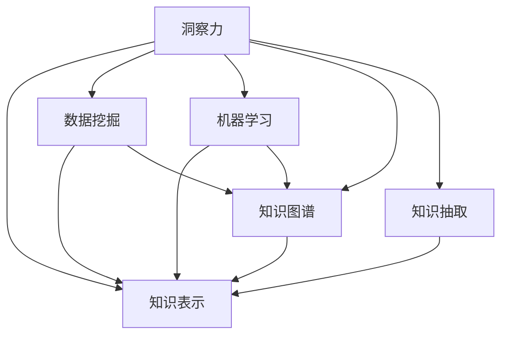

                 

# 知识的价值评估：洞察力的独特视角

在当今数据驱动的时代，知识的价值评估成为信息管理和决策支持的关键环节。如何在海量的信息中提取有用的知识，并进行有效的价值评估，不仅关系到企业竞争力的提升，也影响着社会的进步和发展。本文将从洞察力的独特视角，探讨知识的价值评估方法，以期为相关领域的研究和实践提供参考。

## 1. 背景介绍

### 1.1 问题由来

随着信息技术的飞速发展，数据量呈指数级增长。据统计，全球每天产生的数据量超过25PB，数据来源和类型日益多样化，既有结构化数据，又有半结构化和非结构化数据。面对如此庞大数据，如何从中提炼有价值的知识，变得愈发重要。

传统的数据分析方法，如统计分析、分类聚类等，已经难以满足现代数据分析的需求。近年来，人工智能（AI）和机器学习（ML）技术逐步兴起，成为新一代数据分析和知识挖掘的重要手段。例如，大数据分析、深度学习、自然语言处理（NLP）等技术，通过算法模型对数据进行深度学习和特征提取，有效识别数据中的潜在模式和知识。

### 1.2 问题核心关键点

知识价值评估的本质，在于理解数据的深层含义，并从中提炼出对决策有指导意义的信息。其核心关键点包括：

- **数据质量评估**：如何评估数据的质量，包括数据的完整性、准确性、一致性、时效性等。
- **知识关联性评估**：如何评估知识之间的关联性，包括知识的因果关系、相互依赖性等。
- **知识重要性评估**：如何评估知识对决策的重要性，包括关键性和相关性等。
- **知识应用成本评估**：如何评估知识应用所需的成本，包括开发成本、运维成本等。

这些关键点不仅决定了知识的价值，还影响着知识在实际应用中的效果。因此，有效的知识价值评估方法，对于数据驱动决策至关重要。

## 2. 核心概念与联系

### 2.1 核心概念概述

为了更好地理解知识价值评估的方法，本节将介绍几个核心概念：

- **洞察力（Insight）**：洞察力指的是从数据中提炼出的有价值的知识或洞见。它通常表现为对某一现象、问题或趋势的深刻理解。
- **知识表示（Knowledge Representation）**：知识表示是将知识形式化存储的过程。常用的知识表示方法包括谓词逻辑、语义网络、框架等。
- **数据挖掘（Data Mining）**：数据挖掘是从数据集中发现模式、关联、异常等知识的过程。包括分类、聚类、关联规则挖掘等技术。
- **机器学习（Machine Learning）**：机器学习是通过算法模型，从数据中学习知识的过程。常用的算法包括决策树、支持向量机、神经网络等。
- **知识图谱（Knowledge Graph）**：知识图谱是一种基于图结构的语义表示方法，用于描述实体间的关系和语义网络。
- **知识抽取（Knowledge Extraction）**：知识抽取是从非结构化文本中提取结构化知识的过程。常用的技术包括命名实体识别、关系抽取、事件抽取等。

这些核心概念之间的逻辑关系可以通过以下Mermaid流程图来展示：



这个流程图展示了洞察力与其他核心概念的联系：

1. **洞察力**由知识表示、数据挖掘、机器学习、知识图谱和知识抽取共同支撑。
2. **知识表示**、**数据挖掘**、**机器学习**和**知识抽取**是洞察力的基础，通过提取和表示知识，进而获得洞察力。
3. **知识图谱**是洞察力的高级形式，通过对知识网络的结构化表示，提升洞察力的质量和应用效果。

这些概念共同构成了知识价值评估的理论框架，为洞察力的获取提供了方法和工具。

## 3. 核心算法原理 & 具体操作步骤

### 3.1 算法原理概述

知识价值评估的原理，在于从数据中提炼出有价值的洞察力，并对其重要性进行量化。常见的评估方法包括：

- **统计方法**：通过统计分析，量化数据的集中趋势、离散程度、相关性等，评估知识的价值。
- **机器学习方法**：通过算法模型，提取数据的潜在模式和关系，评估知识的价值。
- **深度学习方法**：通过神经网络等深度模型，深入学习数据的深层特征，评估知识的价值。
- **自然语言处理（NLP）**：通过NLP技术，从文本中抽取结构化知识，评估知识的价值。

这些方法各有优缺点，适用于不同的数据类型和应用场景。以下将详细介绍这些评估方法的具体操作步骤。

### 3.2 算法步骤详解

#### 3.2.1 统计方法

**步骤1：数据预处理**  
- 对数据进行清洗，去除噪音和异常值。  
- 对缺失数据进行处理，填补或删除缺失值。

**步骤2：特征提取**  
- 选择合适的统计指标，如均值、方差、标准差、相关系数等。  
- 对数据进行特征选择，去除冗余特征。

**步骤3：统计分析**  
- 使用统计方法，如回归分析、假设检验、相关分析等，量化数据的特征和关系。  
- 评估统计结果的显著性，判断其对决策的重要性。

#### 3.2.2 机器学习方法

**步骤1：数据预处理**  
- 对数据进行清洗和归一化处理，确保数据的质量。

**步骤2：模型训练**  
- 选择合适的机器学习算法，如决策树、随机森林、支持向量机等。  
- 使用训练数据集，训练机器学习模型。

**步骤3：模型评估**  
- 使用测试数据集，评估模型性能，如准确率、召回率、F1值等。  
- 分析模型的过拟合和欠拟合情况，优化模型参数。

#### 3.2.3 深度学习方法

**步骤1：数据预处理**  
- 对数据进行清洗、归一化和分词处理。

**步骤2：模型构建**  
- 选择合适的深度学习模型，如卷积神经网络（CNN）、循环神经网络（RNN）、Transformer等。  
- 使用预训练模型，进行微调或迁移学习。

**步骤3：模型评估**  
- 使用测试数据集，评估模型性能，如精度、召回率、ROC曲线等。  
- 优化模型参数和超参数，提升模型效果。

#### 3.2.4 自然语言处理（NLP）

**步骤1：数据预处理**  
- 对文本进行分词、去停用词、词干提取等预处理。  
- 使用词向量模型，将文本转换为向量表示。

**步骤2：知识抽取**  
- 使用命名实体识别、关系抽取、事件抽取等技术，从文本中提取结构化知识。  
- 将抽取的知识，存储为语义网络或关系图谱。

**步骤3：知识评估**  
- 使用语义相似度、知识图谱推理等方法，评估知识的重要性。  
- 通过知识图谱，可视化知识之间的关系，发现潜在的洞察力。

### 3.3 算法优缺点

#### 3.3.1 统计方法

**优点**：
- 简单易用，不需要复杂的模型和工具。
- 适用于数据量较小、特征明显的情况。

**缺点**：
- 对数据的分布和结构敏感，可能存在偏差。
- 难以处理非结构化数据和复杂关系。

#### 3.3.2 机器学习方法

**优点**：
- 能够处理复杂的关系和非结构化数据。
- 通过算法优化，提升模型性能和泛化能力。

**缺点**：
- 模型复杂度高，需要较多的计算资源。
- 对数据量和特征选择依赖较大。

#### 3.3.3 深度学习方法

**优点**：
- 能够深度学习数据的复杂特征和关系。
- 模型性能较好，适用于大规模数据和高维特征。

**缺点**：
- 模型训练时间长，需要大量的计算资源。
- 模型复杂度高，不易理解和解释。

#### 3.3.4 自然语言处理（NLP）

**优点**：
- 能够从文本中提取丰富的结构化知识。
- 适用于大规模非结构化数据的处理。

**缺点**：
- 对文本预处理和标注依赖较大。
- 难以处理语义模糊和歧义的文本。

### 3.4 算法应用领域

#### 3.4.1 商业智能（BI）

商业智能是企业决策支持的重要手段，通过数据分析和知识挖掘，提供业务洞察和决策支持。统计方法、机器学习和深度学习等技术，广泛应用于数据清洗、特征选择、模型训练和评估等环节，帮助企业从海量数据中提取有价值的洞察力。

#### 3.4.2 医疗健康

医疗健康领域的数据量庞大，种类繁多，包括电子健康记录（EHR）、医学影像、基因组数据等。通过统计方法、机器学习和深度学习，可以从这些数据中提取疾病的潜在风险因素、治疗效果等知识，为医疗决策提供支持。

#### 3.4.3 金融风控

金融风控需要处理大量的金融数据，如交易数据、信用数据等。通过机器学习和深度学习，可以提取潜在的风险因素、交易模式等知识，提升金融机构的决策效果和风险管理能力。

#### 3.4.4 智能推荐

智能推荐系统需要处理大量的用户行为数据，通过自然语言处理（NLP）技术，可以从文本数据中提取用户兴趣和行为模式，提供个性化的推荐服务。

#### 3.4.5 舆情分析

舆情分析需要处理大量的社交媒体数据，通过自然语言处理（NLP）技术，可以从文本中提取舆情信息，分析公众情绪和热点事件，为社会治理和公共政策提供支持。

## 4. 数学模型和公式 & 详细讲解 & 举例说明

### 4.1 数学模型构建

在知识价值评估中，常用的数学模型包括统计模型、机器学习模型和深度学习模型。以下以回归模型为例，介绍知识价值评估的数学模型构建。

设输入数据为 $X=(x_1, x_2, ..., x_n)$，输出变量为 $Y$，回归模型的目标是最小化预测值与真实值之间的差距，即：

$$
\min_{\theta} \sum_{i=1}^{n} (y_i - \theta^T x_i)^2
$$

其中，$\theta$ 为模型参数，$y_i$ 为真实值，$x_i$ 为输入特征。通过求解上述优化问题，得到模型的最优参数 $\hat{\theta}$。

### 4.2 公式推导过程

**回归模型的梯度下降优化**：

设损失函数为 $L(\theta) = \frac{1}{2n} \sum_{i=1}^{n} (y_i - \theta^T x_i)^2$，则其梯度为：

$$
\nabla_{\theta} L(\theta) = \frac{1}{n} \sum_{i=1}^{n} -2(y_i - \theta^T x_i) x_i
$$

通过梯度下降算法，不断更新模型参数 $\theta$，直到损失函数达到最小值。

**线性回归的公式推导**：

设 $y_i = \beta_0 + \beta_1 x_{i1} + \beta_2 x_{i2} + ... + \beta_p x_{ip}$，其中 $\beta_j$ 为回归系数，$x_{ij}$ 为输入特征。则回归模型的参数向量为 $\theta = (\beta_0, \beta_1, ..., \beta_p)$。

通过最小二乘法求解，得到回归系数：

$$
\beta = (X^T X)^{-1} X^T y
$$

其中，$X = [x_{11}, x_{12}, ..., x_{1p}, x_{21}, x_{22}, ..., x_{2p}, ..., x_{n1}, x_{n2}, ..., x_{np}]$。

### 4.3 案例分析与讲解

**案例：医疗风险评估**

假设有一个医疗风险评估系统，需要从患者的电子健康记录（EHR）中提取风险因素，评估其患某种疾病的概率。通过收集患者的EHR数据，包括年龄、性别、血压、血糖、家族史等信息，构建回归模型。

**步骤1：数据预处理**  
- 清洗和填补缺失数据。  
- 归一化和标准化处理，确保数据的一致性。

**步骤2：特征选择**  
- 选择与疾病相关的特征，如年龄、血压、血糖等。  
- 使用统计方法，如卡方检验、信息增益等，评估特征的重要性。

**步骤3：模型训练**  
- 构建线性回归模型，使用EHR数据训练模型。  
- 使用交叉验证，评估模型的泛化能力。

**步骤4：模型评估**  
- 使用测试数据集，评估模型的预测效果。  
- 分析模型的误诊率和漏诊率，优化模型参数。

**步骤5：结果应用**  
- 将模型应用于新患者的EHR数据，评估其患病的风险。  
- 根据风险评估结果，调整治疗方案和预防措施。

## 5. 项目实践：代码实例和详细解释说明

### 5.1 开发环境搭建

在进行知识价值评估的项目实践前，我们需要准备好开发环境。以下是使用Python进行项目实践的环境配置流程：

1. 安装Anaconda：从官网下载并安装Anaconda，用于创建独立的Python环境。

2. 创建并激活虚拟环境：
```bash
conda create -n project-env python=3.8 
conda activate project-env
```

3. 安装必要的Python包：
```bash
pip install pandas numpy scikit-learn seaborn matplotlib statsmodels
```

4. 安装R语言：
```bash
conda install rpy
```

5. 安装R依赖包：
```bash
install.packages(c("tidyverse", "randomForest"))
```

完成上述步骤后，即可在`project-env`环境中开始项目实践。

### 5.2 源代码详细实现

**案例：股票市场趋势预测**

本案例基于股市数据，使用线性回归模型预测股市趋势。具体步骤如下：

**步骤1：数据预处理**

```python
import pandas as pd
from sklearn.model_selection import train_test_split
from sklearn.linear_model import LinearRegression

# 读取数据
data = pd.read_csv('stock_data.csv')

# 清洗数据
data = data.dropna()

# 划分训练集和测试集
train_data, test_data = train_test_split(data, test_size=0.2)

# 特征选择
features = ['open', 'high', 'low', 'volume']
X_train = train_data[features]
y_train = train_data['close']
X_test = test_data[features]
y_test = test_data['close']
```

**步骤2：模型训练**

```python
# 构建线性回归模型
model = LinearRegression()

# 训练模型
model.fit(X_train, y_train)
```

**步骤3：模型评估**

```python
# 评估模型
y_pred = model.predict(X_test)
score = model.score(X_test, y_test)
print('R^2:', score)
```

**步骤4：结果展示**

```python
# 可视化结果
import matplotlib.pyplot as plt

plt.scatter(y_test, y_pred)
plt.xlabel('True Values')
plt.ylabel('Predictions')
plt.title('Stock Market Prediction')
plt.show()
```

### 5.3 代码解读与分析

在上述代码中，我们使用了Python的Pandas库进行数据处理，Scikit-learn库进行线性回归模型的训练和评估。代码简洁高效，易于理解和维护。

**步骤1：数据预处理**

首先，通过Pandas库读取数据文件，并进行数据清洗和划分。使用`dropna()`方法去掉缺失值，确保数据的一致性和完整性。接着，使用`train_test_split()`方法划分训练集和测试集，以便于模型的训练和评估。

**步骤2：模型训练**

使用Scikit-learn库的`LinearRegression()`方法，构建线性回归模型。通过`fit()`方法，训练模型，使其学习输入特征和输出目标之间的关系。

**步骤3：模型评估**

使用模型的`score()`方法，评估模型的预测效果。R^2（决定系数）越接近1，表示模型拟合效果越好。最后，使用Matplotlib库可视化模型预测结果，直观展示预测值和真实值之间的关系。

**步骤4：结果展示**

通过绘制散点图，可以直观地看到模型预测值和真实值之间的差异。如果大部分点集中在对角线上，说明模型预测准确；如果点分布分散，则表示模型预测误差较大。

## 6. 实际应用场景

### 6.1 商业智能（BI）

商业智能系统通常需要处理大量的业务数据，通过统计方法、机器学习和深度学习等技术，提取业务洞察和趋势。例如，可以通过回归模型，预测销售额、市场份额等关键指标，为决策提供支持。

### 6.2 医疗健康

医疗健康领域的数据量庞大，种类繁多。通过统计方法、机器学习和深度学习，可以从这些数据中提取疾病的潜在风险因素、治疗效果等知识，为医疗决策提供支持。例如，通过回归模型，预测患者的病情发展和康复情况。

### 6.3 金融风控

金融风控需要处理大量的金融数据，如交易数据、信用数据等。通过机器学习和深度学习，可以提取潜在的风险因素、交易模式等知识，提升金融机构的决策效果和风险管理能力。例如，通过分类模型，评估贷款申请的信用风险。

### 6.4 智能推荐

智能推荐系统需要处理大量的用户行为数据，通过自然语言处理（NLP）技术，从文本数据中提取用户兴趣和行为模式，提供个性化的推荐服务。例如，通过协同过滤算法，推荐用户可能感兴趣的商品或内容。

### 6.5 舆情分析

舆情分析需要处理大量的社交媒体数据，通过自然语言处理（NLP）技术，可以从文本中提取舆情信息，分析公众情绪和热点事件，为社会治理和公共政策提供支持。例如，通过情感分析模型，识别公众对某一事件的情感倾向。

## 7. 工具和资源推荐

### 7.1 学习资源推荐

为了帮助开发者系统掌握知识价值评估的理论基础和实践技巧，这里推荐一些优质的学习资源：

1. 《机器学习》（周志华著）：介绍机器学习的基本概念、算法和应用，是学习知识价值评估的重要参考资料。
2. 《深度学习》（Ian Goodfellow著）：全面介绍深度学习的基本理论和实践技术，适用于对深度学习有深入需求的读者。
3. 《自然语言处理综论》（Daniel Jurafsky和James H. Martin著）：介绍NLP的基本概念、技术和应用，是学习知识抽取和语义分析的重要资源。
4. Kaggle平台：提供丰富的数据集和比赛，帮助开发者实践知识价值评估的技术。
5. Coursera平台：提供多门数据科学和机器学习课程，包括统计分析、深度学习、自然语言处理等内容。

通过这些资源的学习实践，相信你一定能够快速掌握知识价值评估的精髓，并用于解决实际的业务问题。

### 7.2 开发工具推荐

高效的工具是知识价值评估实践的重要保障。以下是几款常用的开发工具：

1. Python：Python是数据分析和机器学习的主流语言，具有丰富的库和工具支持。
2. R语言：R语言是统计分析和数据可视化的常用工具，具有强大的数据分析能力。
3. Scikit-learn：Scikit-learn是Python中最流行的机器学习库，包含丰富的算法和工具。
4. TensorFlow：TensorFlow是深度学习的主流框架，提供高效的数据处理和模型训练功能。
5. PyTorch：PyTorch是深度学习的另一个主流框架，具有灵活的动态图结构和易于使用的API。
6. Apache Spark：Apache Spark是数据处理和机器学习的分布式计算框架，适用于大数据量分析。

合理利用这些工具，可以显著提升知识价值评估的开发效率，加快创新迭代的步伐。

### 7.3 相关论文推荐

知识价值评估的研究源于学界的持续探索。以下是几篇奠基性的相关论文，推荐阅读：

1. "Introduction to Statistical Learning"（Gareth James, Daniela Witten, Trevor Hastie, Robert Tibshirani著）：介绍统计学习的基本理论和算法，适用于对统计方法有深入需求的读者。
2. "Pattern Recognition and Machine Learning"（Christopher Bishop著）：介绍模式识别和机器学习的基本概念和算法，涵盖深度学习、图像处理等内容。
3. "Foundations of Statistical Natural Language Processing"（Christopher D. Manning和Hinrich Schütze著）：介绍自然语言处理的理论基础和技术方法，是学习知识抽取和语义分析的重要资源。
4. "Knowledge Discovery in Databases"（Jörg Säuberlich和Nils Grabow和Bernd Fgen和Wolfgang Winkler著）：介绍数据挖掘和知识发现的基本理论和算法，涵盖数据预处理、特征选择、模式挖掘等内容。

这些论文代表了大数据、机器学习和NLP等领域的最新进展，为知识价值评估提供了丰富的理论和实践基础。

## 8. 总结：未来发展趋势与挑战

### 8.1 总结

本文对知识价值评估的方法进行了全面系统的介绍。首先阐述了知识价值评估的背景和意义，明确了从数据中提炼有价值的洞察力的重要性。其次，从洞察力的独特视角，详细讲解了统计方法、机器学习、深度学习和NLP等技术在知识价值评估中的应用。最后，通过实例展示了知识价值评估的实际操作过程，给出了项目实践的代码实例和详细解释说明。

通过本文的系统梳理，可以看到，知识价值评估不仅是一门理论学科，更是一项实践技能。它通过数据分析和模型训练，帮助人们从海量数据中提炼出有价值的洞察力，为决策提供支持。未来，随着技术的不断进步，知识价值评估将更加高效、智能和自动化，为各行各业带来新的变革。

### 8.2 未来发展趋势

展望未来，知识价值评估将呈现以下几个发展趋势：

1. 自动化和智能化：随着人工智能和机器学习技术的发展，知识价值评估将逐渐自动化和智能化，减少人工干预和误差。
2. 多模态融合：知识价值评估将更加注重多模态数据的融合，结合文本、图像、语音等多种信息，提升分析效果。
3. 大数据处理：知识价值评估将处理更大规模的数据集，通过分布式计算和大数据技术，提升处理效率和效果。
4. 模型优化：知识价值评估将更加注重模型的优化，如特征选择、超参数调优、模型融合等，提升模型的性能和泛化能力。
5. 可解释性：知识价值评估将更加注重模型的可解释性，通过可视化工具和解释性方法，提升对模型决策的理解和信任。

这些趋势将推动知识价值评估技术的不断进步，为决策提供更精准、可靠的洞察力。

### 8.3 面临的挑战

尽管知识价值评估技术在不断进步，但在实践中仍面临诸多挑战：

1. 数据质量和噪声：数据质量不高、噪声较大，可能影响模型的准确性和可靠性。
2. 模型复杂性：模型复杂度高，难以解释和理解，可能影响决策的透明度和可信度。
3. 计算资源限制：处理大规模数据集需要高性能计算资源，可能存在资源瓶颈。
4. 隐私和安全：数据隐私和安全问题，可能影响模型的应用和推广。

这些挑战需要学界和业界共同努力，通过技术创新和管理改进，逐步解决。

### 8.4 研究展望

面对知识价值评估所面临的挑战，未来的研究需要在以下几个方面寻求新的突破：

1. 数据清洗和预处理：开发更高效的数据清洗和预处理技术，提升数据的质量和一致性。
2. 模型简化和可解释性：开发更简单的模型，提升模型的可解释性和透明度。
3. 计算资源优化：开发更高效的算法和工具，优化计算资源的使用，提升知识价值评估的效率。
4. 隐私保护和安全：研究数据隐私和安全保护技术，确保数据使用的合法性和安全性。

这些研究方向将为知识价值评估技术的进一步发展提供方向，推动其在更广泛的应用场景中发挥作用。

## 9. 附录：常见问题与解答

**Q1：知识价值评估中如何处理数据噪声？**

A: 数据噪声是知识价值评估中的一个常见问题。可以通过以下方法处理：

1. 数据清洗：通过统计方法和算法，识别和处理缺失值、异常值和重复值。
2. 数据平滑：使用平滑算法，如中值平滑、移动平均等，降低数据噪声的影响。
3. 特征选择：通过特征选择算法，如卡方检验、信息增益等，选择质量较高的特征。

这些方法可以有效降低数据噪声，提升模型的准确性和可靠性。

**Q2：知识价值评估中如何提升模型泛化能力？**

A: 模型泛化能力是知识价值评估中的关键问题。可以通过以下方法提升模型泛化能力：

1. 数据增强：使用数据增强技术，如数据扩充、数据合成等，增加数据多样性。
2. 正则化：使用正则化技术，如L2正则、Dropout等，防止模型过拟合。
3. 模型融合：使用模型融合技术，如Bagging、Boosting等，提升模型的稳定性和泛化能力。
4. 超参数调优：使用超参数调优技术，如网格搜索、贝叶斯优化等，优化模型参数。

这些方法可以有效提升模型的泛化能力，确保其在新的数据集上表现良好。

**Q3：知识价值评估中如何选择特征？**

A: 特征选择是知识价值评估中的重要环节。可以通过以下方法选择特征：

1. 统计方法：使用统计方法，如卡方检验、相关系数等，评估特征的重要性。
2. 机器学习方法：使用机器学习算法，如随机森林、支持向量机等，选择特征子集。
3. 深度学习方法：使用深度学习模型，如卷积神经网络、循环神经网络等，提取特征。

这些方法可以有效选择质量较高的特征，提升模型的性能和效果。

**Q4：知识价值评估中如何处理数据不平衡问题？**

A: 数据不平衡是知识价值评估中的常见问题。可以通过以下方法处理：

1. 重采样：使用重采样技术，如欠采样、过采样等，平衡数据集。
2. 加权学习：使用加权学习技术，如加权分类器、加权回归等，提升模型的效果。
3. 数据增强：使用数据增强技术，如SMOTE等，生成更多平衡数据。

这些方法可以有效处理数据不平衡问题，提升模型的公平性和准确性。

**Q5：知识价值评估中如何评估模型性能？**

A: 模型性能是知识价值评估中的关键指标。可以通过以下方法评估模型性能：

1. 训练误差和测试误差：使用训练误差和测试误差评估模型的拟合效果。
2. 准确率、召回率和F1值：使用分类指标，如准确率、召回率和F1值，评估模型的分类效果。
3. R^2和决定系数：使用回归指标，如R^2和决定系数，评估模型的回归效果。

这些方法可以有效评估模型的性能，确保其在实际应用中表现良好。

---

作者：禅与计算机程序设计艺术 / Zen and the Art of Computer Programming

