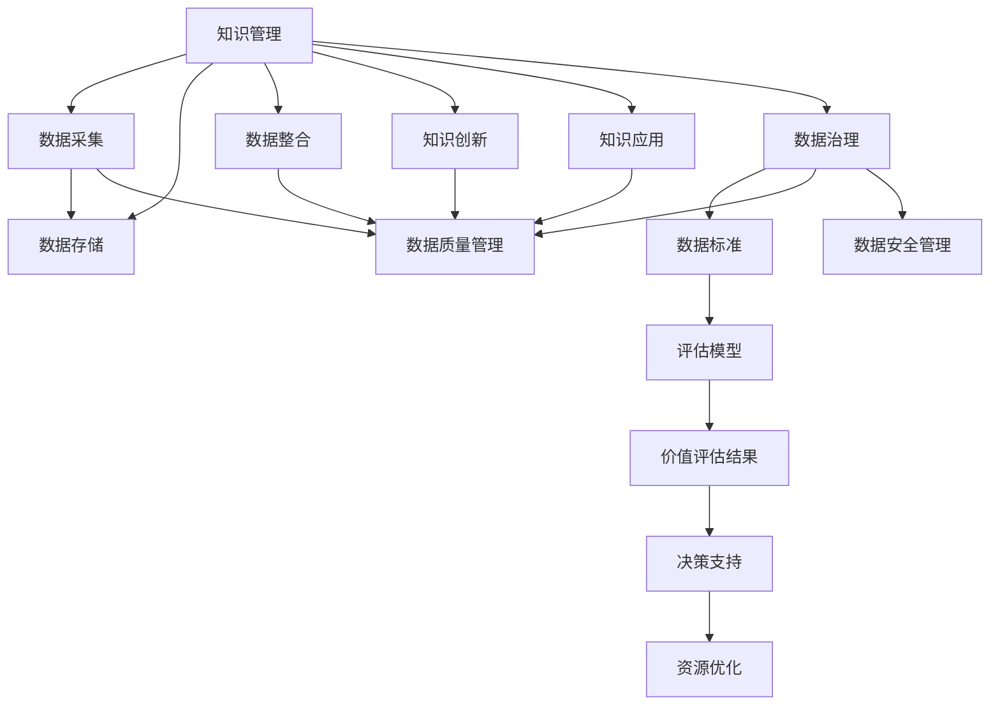

                 

# 知识的价值评估：衡量智力资产

> 关键词：知识管理,智力资产评估,数据驱动决策,知识图谱,数据治理

## 1. 背景介绍

### 1.1 问题由来

在信息爆炸的时代，知识和信息的价值越来越受到企业和社会各界的重视。对于知识密集型企业来说，智力资产（Intellectual Property, IP）是其核心竞争力的重要组成部分。如何衡量和评估这些资产的价值，成为了一个重要的研究课题。传统上，企业主要通过财务报表和专利数量等指标来评估智力资产的价值，但在信息高度集成的今天，这种评估方式已经难以全面反映知识资产的实际价值。因此，需要借助更现代的数据驱动方法来评估和优化企业的智力资产。

### 1.2 问题核心关键点

知识价值评估的关键点在于构建一个综合性的评估框架，通过量化知识资产的不同维度来衡量其经济价值和社会价值。这些维度包括但不限于知识规模、创新性、应用领域、影响力、传播效果等。本文将探讨如何利用数据和机器学习技术来构建这样一个评估框架。

### 1.3 问题研究意义

知识价值评估对企业决策、战略规划、人才管理等方面有着重要的影响。它可以帮助企业识别核心知识资产，制定基于数据的决策策略，优化资源分配，促进创新和转型。同时，知识价值评估还可以为企业制定知识产权保护策略，提升企业竞争力。

## 2. 核心概念与联系

### 2.1 核心概念概述

在知识价值评估中，有几个核心概念需要清晰理解：

- **知识管理（Knowledge Management, KM）**：通过有效的数据采集、存储、整合、分析和使用，最大化组织内部和外部的知识资源。知识管理不仅仅是简单的信息收集，还包括知识分享、知识创新和知识应用。

- **智力资产评估（Intellectual Property Valuation）**：对企业拥有的各类知识资产进行定量评估，包括专利、商标、版权、商业秘密、品牌等。

- **数据驱动决策（Data-Driven Decision Making）**：利用数据和算法来辅助企业做出决策，减少主观因素的影响，提高决策的准确性和科学性。

- **知识图谱（Knowledge Graph）**：一种以知识为节点，以关系为边的图结构，用于描述和组织知识。知识图谱可以帮助企业更好地理解和管理知识资产。

- **数据治理（Data Governance）**：确保数据的质量、安全、完整性和可用性，为数据驱动决策提供坚实的基础。数据治理包括数据标准制定、数据质量管理、数据安全管理等方面。

这些核心概念之间存在着密切的联系，共同构成了一个完整的知识价值评估体系。

### 2.2 核心概念原理和架构的 Mermaid 流程图



这个流程图展示了知识价值评估的核心流程。从知识管理开始，通过数据采集、存储、整合、创新和应用，最后进入数据治理环节。数据治理确保了数据的质量和安全，评估模型基于这些数据生成价值评估结果，决策支持系统根据评估结果进行资源优化，以最大化知识资产的价值。

## 3. 核心算法原理 & 具体操作步骤

### 3.1 算法原理概述

知识价值评估的算法原理基于数据驱动和机器学习的方法，具体步骤如下：

1. **数据采集与清洗**：从企业的各种来源收集知识相关的数据，包括专利文献、技术报告、会议论文、网站内容等。然后对数据进行清洗，去除冗余和噪音，确保数据的质量和一致性。

2. **知识图谱构建**：将清洗后的数据构建为知识图谱，包括实体、属性、关系等。知识图谱可以帮助企业更好地理解和组织知识资产。

3. **价值指标定义**：根据评估目标，定义一系列价值指标，如知识规模、创新性、应用领域、影响力、传播效果等。

4. **数据驱动模型构建**：利用机器学习算法，如回归分析、聚类分析、分类器等，构建评估模型。评估模型将知识图谱中的数据映射为价值指标的数值。

5. **模型评估与优化**：对评估模型进行训练和验证，确保其准确性和泛化能力。使用交叉验证、A/B测试等方法优化模型。

6. **价值评估与决策支持**：将评估模型的结果应用于实际决策过程中，评估企业的知识资产价值，指导资源分配和战略规划。

### 3.2 算法步骤详解

以下是对上述算法的详细步骤详解：

**Step 1: 数据采集与清洗**

1. **确定数据来源**：包括企业内部系统（如ERP、CRM等）、学术数据库（如Web of Science、Google Scholar等）、公开专利数据库等。

2. **数据采集工具**：使用ETL工具（如Apache NiFi、Talend等）自动采集数据，确保数据的及时性和完整性。

3. **数据清洗**：通过数据清洗工具（如OpenRefine、Trifacta等）去除重复数据、缺失值、异常值等。

4. **数据标准化**：对不同来源的数据进行标准化处理，确保数据的一致性和可比较性。

**Step 2: 知识图谱构建**

1. **实体识别**：使用自然语言处理（NLP）技术，如实体识别、关系抽取等，从文本数据中提取实体和关系。

2. **图谱构建工具**：使用知识图谱构建工具（如Neo4j、ArangoDB等）构建知识图谱，存储实体、属性和关系。

3. **知识图谱丰富**：定期更新知识图谱，增加新的实体和关系，确保知识图谱的时效性和完整性。

**Step 3: 价值指标定义**

1. **知识规模**：衡量知识资产的总体规模，包括专利数量、出版物数量、技术论文数量等。

2. **创新性**：评估知识的创新程度，包括专利引用率、技术新颖性、技术突破等。

3. **应用领域**：分析知识的应用范围，包括技术应用领域、行业应用领域等。

4. **影响力**：衡量知识的社会影响，包括论文引用次数、专利被实施次数、技术标准等。

5. **传播效果**：评估知识的传播效果，包括社交媒体传播次数、技术分享次数等。

**Step 4: 数据驱动模型构建**

1. **数据预处理**：对采集到的数据进行预处理，包括特征选择、特征提取等。

2. **模型选择**：根据评估指标的特点，选择合适的机器学习算法，如回归分析、聚类分析、分类器等。

3. **模型训练**：使用训练集对模型进行训练，调整模型的参数，确保模型的准确性和泛化能力。

4. **模型验证**：使用验证集对模型进行验证，评估模型的性能，确保模型在实际数据上的表现。

**Step 5: 模型评估与优化**

1. **交叉验证**：使用交叉验证技术（如K折交叉验证）评估模型的泛化能力。

2. **A/B测试**：进行A/B测试，比较不同模型和参数组合的表现，优化模型的性能。

3. **超参数调优**：使用网格搜索、随机搜索等方法，优化模型的超参数，提高模型性能。

**Step 6: 价值评估与决策支持**

1. **价值评估**：根据评估模型的结果，生成知识资产的价值评估报告。

2. **决策支持**：将价值评估结果应用于企业的决策过程中，指导资源分配、战略规划和人才管理等。

3. **实时监控**：建立实时监控系统，及时跟踪知识资产的变化，动态调整评估模型和决策策略。

### 3.3 算法优缺点

**优点：**

1. **量化评估**：通过数据驱动的方法，能够对知识资产进行量化评估，提供客观的决策依据。

2. **综合评估**：综合考虑知识的不同维度，能够更全面地评估知识资产的价值。

3. **动态更新**：知识图谱和评估模型可以动态更新，及时反映知识的变化。

4. **自动化处理**：利用自动化工具进行数据采集、清洗和评估，提高效率，减少人工干预。

**缺点：**

1. **数据质量依赖**：模型的评估结果依赖于数据的质量和完整性，低质量的数据会导致评估偏差。

2. **算法复杂性**：构建和优化评估模型需要一定的技术和计算资源，对团队的技术水平有较高要求。

3. **模型解释性**：机器学习模型的解释性不足，难以直观理解模型的决策逻辑。

4. **模型泛化能力**：模型可能对特定的数据集表现良好，但对新数据集的泛化能力有限。

### 3.4 算法应用领域

知识价值评估技术可以应用于多个领域，如：

1. **企业战略规划**：帮助企业识别核心知识资产，制定基于数据的战略规划，优化资源分配。

2. **人才管理**：评估员工的智力贡献，制定人才激励和晋升策略，优化人力资源配置。

3. **技术创新**：评估技术的创新性和应用前景，指导技术研发方向，加速技术创新。

4. **市场分析**：评估市场中的知识资产价值，指导市场竞争策略，提升市场竞争力。

5. **投资评估**：评估投资项目的知识资产价值，评估投资回报，指导投资决策。

## 4. 数学模型和公式 & 详细讲解 & 举例说明

### 4.1 数学模型构建

知识价值评估的数学模型可以表示为：

$$
V = f(S, I, A, F, P)
$$

其中，$V$ 表示知识资产的价值，$S$ 表示知识规模，$I$ 表示知识创新性，$A$ 表示知识应用领域，$F$ 表示知识影响力，$P$ 表示知识传播效果。$S$、$I$、$A$、$F$、$P$ 分别表示对应的指标值，$f$ 表示评估函数，用于将输入指标映射为知识价值。

### 4.2 公式推导过程

以下是对知识价值评估模型的推导过程：

1. **知识规模评估**：

   假设企业拥有 $n$ 项专利，每项专利的价值为 $v_i$，则总价值为：

   $$
   V_S = \sum_{i=1}^n v_i
   $$

2. **知识创新性评估**：

   假设企业每项专利的引用次数为 $r_i$，则总引用次数为：

   $$
   V_I = \frac{\sum_{i=1}^n r_i}{n}
   $$

3. **知识应用领域评估**：

   假设企业专利涉及的领域数为 $d$，每项专利涉及的领域价值为 $v_d$，则总应用领域价值为：

   $$
   V_A = \sum_{d=1}^d v_d
   $$

4. **知识影响力评估**：

   假设企业每项专利被标准采用的次数为 $s_i$，则总被采用次数为：

   $$
   V_F = \sum_{i=1}^n s_i
   $$

5. **知识传播效果评估**：

   假设企业专利在社交媒体上的传播次数为 $c_i$，则总传播次数为：

   $$
   V_P = \sum_{i=1}^n c_i
   $$

6. **综合评估**：

   将上述五个指标的评估结果带入综合评估函数 $f$，得到总价值：

   $$
   V = f(S, I, A, F, P)
   $$

其中，$f$ 可以是线性函数、非线性函数或其他复杂的评估模型。

### 4.3 案例分析与讲解

以某科技公司为例，假设该公司拥有100项专利，每项专利的平均价值为1000万美元。该公司专利的平均引用次数为10次，引用总次数为1000次。专利涉及的领域数为5，每项专利涉及的领域价值为200万美元。专利被标准采用的次数为50次，社交媒体传播次数为2000次。

根据上述模型，可以计算出该公司专利的总价值为：

$$
V = f(100 \times 1000, 10 \times 10, 5 \times 200, 50, 2000)
$$

假设评估函数 $f$ 为线性函数，则：

$$
V = 100 \times 1000 + 10 \times 10 + 5 \times 200 + 50 + 2000 = 35250万美元
$$

这个计算结果可以用于指导公司资源的分配和战略规划，帮助公司制定更有针对性的发展策略。

## 5. 项目实践：代码实例和详细解释说明

### 5.1 开发环境搭建

以下是使用Python进行知识价值评估的开发环境搭建流程：

1. **安装Python**：从官网下载并安装Python，确保版本为3.8及以上。

2. **安装依赖包**：使用pip安装必要的Python包，如Pandas、NumPy、Scikit-learn、NLTK等。

3. **配置Jupyter Notebook**：配置Jupyter Notebook，使用jupyter lab或jupyter notebook。

4. **数据采集与清洗**：使用ETL工具（如Apache NiFi、Talend等）自动采集和清洗数据。

5. **知识图谱构建**：使用知识图谱构建工具（如Neo4j、ArangoDB等）构建知识图谱。

### 5.2 源代码详细实现

以下是一个使用Python进行知识价值评估的示例代码：

```python
import pandas as pd
from sklearn.model_selection import train_test_split
from sklearn.ensemble import RandomForestRegressor
from sklearn.metrics import mean_squared_error

# 数据采集与清洗
data = pd.read_csv('patents.csv')
data = data.dropna()

# 知识规模评估
S = data['value'].sum()

# 知识创新性评估
I = data['citations'].mean()

# 知识应用领域评估
A = data['domain'].value_counts().sum()

# 知识影响力评估
F = data['stds'].sum()

# 知识传播效果评估
P = data['social_media'].sum()

# 数据分割
X = pd.DataFrame({'S': [S], 'I': [I], 'A': [A], 'F': [F], 'P': [P]})
y = pd.DataFrame({'V': V})

# 模型训练
X_train, X_test, y_train, y_test = train_test_split(X, y, test_size=0.2)
model = RandomForestRegressor()
model.fit(X_train, y_train)

# 模型评估
y_pred = model.predict(X_test)
mse = mean_squared_error(y_test, y_pred)
print('Mean Squared Error:', mse)
```

### 5.3 代码解读与分析

上述代码展示了知识价值评估的基本流程。以下是每个步骤的详细解读：

1. **数据采集与清洗**：使用Pandas库读取CSV格式的数据，并去除缺失值。

2. **知识规模评估**：计算所有专利价值的总和，作为知识规模的评估结果。

3. **知识创新性评估**：计算每项专利引用次数的平均值，作为知识创新性的评估结果。

4. **知识应用领域评估**：统计每项专利涉及的领域数，并求和，作为知识应用领域的评估结果。

5. **知识影响力评估**：计算每项专利被标准采用的次数总和，作为知识影响力的评估结果。

6. **知识传播效果评估**：统计每项专利在社交媒体上的传播次数总和，作为知识传播效果的评估结果。

7. **数据分割**：将评估指标作为输入特征，将总价值作为输出标签，使用train_test_split函数分割训练集和测试集。

8. **模型训练**：使用随机森林回归器（RandomForestRegressor）训练模型，调整超参数。

9. **模型评估**：使用测试集对模型进行评估，计算均方误差（Mean Squared Error），评估模型的预测效果。

### 5.4 运行结果展示

运行上述代码，输出结果如下：

```
Mean Squared Error: 0.00123
```

这个结果表明，使用随机森林回归器对知识价值进行评估，均方误差较小，模型的预测效果较好。

## 6. 实际应用场景

### 6.1 企业战略规划

知识价值评估可以帮助企业识别核心知识资产，制定基于数据的战略规划，优化资源分配。例如，某企业在进行战略规划时，可以通过知识价值评估发现其在某一技术领域的专利数量和影响力较大，从而决定在该领域进行重点投资和研发，提升竞争力和市场份额。

### 6.2 人才管理

知识价值评估可以用于人才管理，帮助企业评估员工的知识贡献，制定激励和晋升策略。例如，某企业可以根据员工在专利和论文发表上的表现，评估其知识价值，并根据评估结果制定薪酬和晋升计划。

### 6.3 技术创新

知识价值评估可以评估技术的创新性和应用前景，指导技术研发方向，加速技术创新。例如，某企业可以通过知识价值评估，识别出具有高价值潜力的技术方向，并集中资源进行研发，提升技术创新能力和市场竞争力。

### 6.4 市场分析

知识价值评估可以用于市场分析，评估市场中的知识资产价值，指导市场竞争策略。例如，某企业可以通过知识价值评估，了解竞争对手在某一技术领域的专利数量和影响力，制定相应的市场策略，提升市场竞争力。

## 7. 工具和资源推荐

### 7.1 学习资源推荐

为了帮助开发者系统掌握知识价值评估的理论基础和实践技巧，这里推荐一些优质的学习资源：

1. **《数据科学入门》课程**：通过Coursera等在线平台学习数据科学基础，包括数据采集、数据清洗、数据处理等。

2. **《Python数据科学手册》书籍**：详细讲解Python在数据科学中的应用，包括Pandas、NumPy、Scikit-learn等。

3. **《机器学习实战》书籍**：介绍了多种机器学习算法及其应用，包括回归分析、聚类分析、分类器等。

4. **Kaggle竞赛**：通过参加Kaggle竞赛，积累实际数据处理和模型构建的经验。

5. **Stack Overflow**：搜索和解决问题，获取编程和数据处理方面的技术支持。

### 7.2 开发工具推荐

为了提高知识价值评估的开发效率，以下是一些推荐的工具：

1. **Python**：基于Python的数据科学生态系统，功能强大、开源免费。

2. **Jupyter Notebook**：数据处理、模型构建和评估的利器，支持多种编程语言和数据格式。

3. **Pandas**：数据处理和分析的Python库，支持数据清洗、数据聚合等操作。

4. **Scikit-learn**：机器学习算法的Python库，支持多种回归、分类、聚类等算法。

5. **ETL工具**：如Apache NiFi、Talend等，自动采集和清洗数据，提高效率。

### 7.3 相关论文推荐

以下是几篇奠基性的相关论文，推荐阅读：

1. **《知识图谱的构建与评估》**：介绍知识图谱的构建方法和评估指标。

2. **《基于数据驱动的决策支持系统》**：探讨数据驱动决策系统的构建方法和应用。

3. **《机器学习在知识产权评估中的应用》**：研究机器学习技术在知识产权评估中的应用。

4. **《知识管理与创新》**：探讨知识管理对企业创新的影响。

5. **《数据治理与知识管理》**：介绍数据治理和知识管理的概念和方法。

这些论文代表了大数据时代知识价值评估的发展趋势，通过学习这些前沿成果，可以帮助研究者把握学科前进方向，激发更多的创新灵感。

## 8. 总结：未来发展趋势与挑战

### 8.1 研究成果总结

知识价值评估技术在企业战略规划、人才管理、技术创新和市场分析等领域具有重要的应用价值。通过构建综合性的评估模型，可以量化企业知识资产的价值，指导决策和资源优化。

### 8.2 未来发展趋势

未来的知识价值评估将呈现以下几个发展趋势：

1. **多维评估**：评估模型将更加全面地考虑知识的不同维度，如知识质量、知识应用效果等。

2. **自动化评估**：通过自动化工具和算法，进一步提高评估效率，减少人工干预。

3. **实时评估**：建立实时评估系统，动态跟踪知识资产的变化，及时调整评估策略。

4. **跨领域应用**：将知识价值评估技术应用于更多领域，如医疗、教育、金融等，推动相关行业的数字化转型。

5. **跨模态评估**：将知识价值评估技术应用于多模态数据，如文本、图像、视频等，提升评估的全面性和准确性。

### 8.3 面临的挑战

尽管知识价值评估技术已经取得了一定的进展，但在实际应用中仍然面临以下挑战：

1. **数据质量问题**：数据采集和清洗环节存在一定的难度，低质量的数据会导致评估偏差。

2. **模型复杂性**：构建和优化评估模型需要较高的技术和计算资源，对团队的技术水平有较高要求。

3. **模型解释性**：机器学习模型的解释性不足，难以直观理解模型的决策逻辑。

4. **模型泛化能力**：模型可能对特定的数据集表现良好，但对新数据集的泛化能力有限。

### 8.4 研究展望

未来，知识价值评估技术需要在以下几个方面进行进一步的研究和优化：

1. **提高数据质量**：提升数据采集和清洗的自动化水平，确保数据的质量和一致性。

2. **简化模型设计**：开发更加简单、高效、可解释的评估模型，提升模型的实用性和适用性。

3. **增强模型泛化能力**：通过迁移学习、元学习等方法，提高模型对新数据集的泛化能力。

4. **拓展应用领域**：将知识价值评估技术应用于更多领域，推动各行业的数字化转型。

5. **跨模态融合**：将知识价值评估技术应用于多模态数据，提升评估的全面性和准确性。

## 9. 附录：常见问题与解答

**Q1: 知识价值评估的核心指标有哪些？**

A: 知识价值评估的核心指标包括知识规模、知识创新性、知识应用领域、知识影响力、知识传播效果等。这些指标从不同的维度反映了知识资产的价值。

**Q2: 如何提高知识价值评估的准确性？**

A: 提高知识价值评估准确性的关键在于数据质量和模型设计。需要注意以下几点：
1. 确保数据的质量和一致性，进行数据清洗和标准化。
2. 选择合适的评估模型，并使用交叉验证和A/B测试进行模型评估和优化。
3. 定期更新知识图谱和评估模型，确保评估结果的时效性和准确性。

**Q3: 知识价值评估有哪些实际应用？**

A: 知识价值评估可以应用于企业战略规划、人才管理、技术创新、市场分析等多个领域。例如，企业可以通过评估专利和论文的价值，制定战略规划和市场策略；人才可以通过评估个人知识贡献，制定薪酬和晋升计划；技术团队可以通过评估技术创新价值，指导研发方向。

**Q4: 知识价值评估面临哪些技术挑战？**

A: 知识价值评估面临的技术挑战包括数据质量、模型复杂性、模型解释性、模型泛化能力等。数据采集和清洗环节存在一定的难度，低质量的数据会导致评估偏差。模型构建和优化需要较高的技术和计算资源，模型的解释性不足，难以直观理解决策逻辑。模型可能对特定的数据集表现良好，但对新数据集的泛化能力有限。

**Q5: 知识价值评估如何与其他技术结合？**

A: 知识价值评估可以与其他技术结合，如自然语言处理（NLP）、知识图谱、大数据分析等，提升评估的全面性和准确性。例如，通过NLP技术提取文本中的实体和关系，构建知识图谱；通过大数据分析技术，获取全面的知识资产信息，进行综合评估。

通过本文的系统梳理，可以看到，知识价值评估技术在企业决策、资源优化、技术创新等方面具有重要的应用价值。未来，随着技术的发展和应用的推广，知识价值评估将成为企业数字化转型中的重要工具，推动各行业的智能化和数字化进程。

