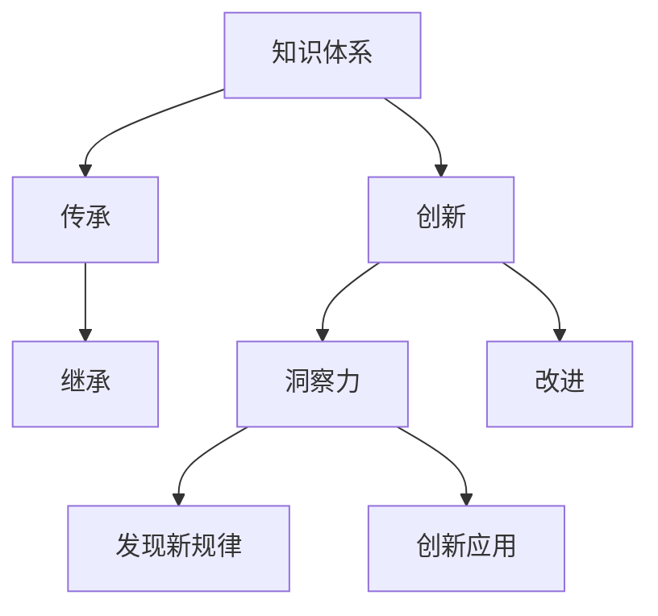

                 

## 1. 背景介绍

在计算机科学的发展历程中，知识的传承与创新始终是推动技术进步的关键动力。从早期的算法到复杂的大数据应用，每一步的突破都离不开对现有知识体系的理解和拓展。洞察力，作为知识传承与创新的桥梁，在此过程中扮演了至关重要的角色。本文将深入探讨洞察力在知识传承与创新中的作用，通过实例展示其重要性，并展望未来的发展趋势。

## 2. 核心概念与联系

### 2.1 核心概念概述

为了更好地理解洞察力在知识传承与创新中的作用，我们首先需要了解几个核心概念：

- **知识体系**：指经过整理、分类和系统化的信息集合，包括算法、数据结构、理论基础等。
- **传承**：指知识从一个时期或一代人向另一个时期或一代人的传递，可以是正式的教育方式，也可以是非正式的、自发的知识共享。
- **创新**：指基于现有知识体系，通过改进、发展或重新组合，创造出新的知识、技术或产品。
- **洞察力**：指在复杂信息中识别关键要素，把握本质规律的能力。

### 2.2 核心概念原理和架构的 Mermaid 流程图



该图展示了知识传承、创新与洞察力之间的联系。知识体系通过传承的方式传递，而创新是基于现有知识体系发展而来的。洞察力在其中起到桥梁作用，它不仅帮助继承知识体系中的关键要素，还能发现新规律，进而推动创新应用的发展。

## 3. 核心算法原理 & 具体操作步骤

### 3.1 算法原理概述

洞察力在知识传承与创新中的作用可以通过以下算法原理进行理解：

- **信息提取**：通过算法（如自然语言处理、数据挖掘等）从大量数据中提取有用的信息，帮助继承知识体系的关键要素。
- **模式识别**：利用统计和机器学习方法，识别数据中的模式和规律，提升对现有知识体系的洞察力。
- **知识融合**：通过算法将不同来源的知识融合，形成更全面、深入的知识体系。

### 3.2 算法步骤详解

1. **信息提取**：
    - 数据收集：从不同渠道（如学术论文、开源代码、企业内部文档等）收集相关数据。
    - 数据清洗：去除无用数据，确保提取的信息准确性。
    - 信息抽取：使用自然语言处理等技术，从文本中提取关键信息，如算法实现细节、性能指标、应用场景等。

2. **模式识别**：
    - 特征工程：设计特征提取算法，将原始数据转换为可用于模型训练的特征。
    - 模型训练：使用机器学习算法（如决策树、随机森林、神经网络等）训练模式识别模型。
    - 模式验证：在新的数据集上验证模式识别模型的准确性和泛化能力。

3. **知识融合**：
    - 知识图谱构建：使用图数据库技术，将不同来源的知识构建为知识图谱，形成系统化的知识体系。
    - 知识推理：利用推理算法（如符号推理、概率推理等），对知识图谱中的知识进行推理和扩展。
    - 知识更新：定期更新知识图谱，确保其与最新研究和技术进展保持同步。

### 3.3 算法优缺点

**优点**：
- **全面性**：通过信息提取、模式识别和知识融合，可以获得更全面、深入的知识体系。
- **灵活性**：算法可以处理各种数据类型，适应不同领域和场景的需求。
- **可扩展性**：随着数据的积累和算法的进步，知识体系可以不断扩展和完善。

**缺点**：
- **复杂性**：算法实现复杂，需要高水平的专家和大量资源投入。
- **数据质量**：数据质量和标注的准确性直接影响算法的效果。
- **计算资源**：算法处理大规模数据需要高性能计算资源，成本较高。

### 3.4 算法应用领域

洞察力在知识传承与创新中的应用广泛，以下是几个典型领域：

- **软件开发**：通过洞察力分析代码库和文档，提取算法和架构设计思路，进行代码复用和改进。
- **金融分析**：利用模式识别技术，从市场数据中提取关键特征，进行风险评估和投资决策。
- **医疗研究**：通过知识融合技术，整合不同来源的医疗知识，支持精准医疗和个性化治疗。
- **教育培训**：借助洞察力分析学习数据，识别高效的教学方法和个性化学习路径，提高教育效果。

## 4. 数学模型和公式 & 详细讲解

### 4.1 数学模型构建

为了更好地理解洞察力在知识传承与创新中的作用，我们可以使用数学模型进行描述。假设知识体系为 $K$，传承过程为 $P$，创新过程为 $I$，洞察力为 $I$，则知识传承与创新的整体模型可以表示为：

$$
K' = K + P + I
$$

其中，$K'$ 表示经过传承与创新后的新知识体系。

### 4.2 公式推导过程

在上述模型中，传承和创新的作用可以用以下公式表示：

$$
P = K \times I
$$

$$
I = K \times O
$$

其中，$I$ 为洞察力，$O$ 为优化策略，表示通过洞察力发现的新规律和改进方法。

### 4.3 案例分析与讲解

以深度学习框架 TensorFlow 的发展为例，分析洞察力在其中发挥的作用：

1. **信息提取**：TensorFlow 的开发者通过分析现有框架和研究论文，提取了深度学习中的关键概念和算法。
2. **模式识别**：通过机器学习算法，识别了深度学习的核心规律和趋势，如卷积神经网络（CNN）和循环神经网络（RNN）的应用。
3. **知识融合**：TensorFlow 融合了多种深度学习算法和模型，构建了全面的知识体系。

这些步骤展示了洞察力如何帮助 TensorFlow 开发者继承和创新知识体系，推动了深度学习技术的发展。

## 5. 项目实践：代码实例和详细解释说明

### 5.1 开发环境搭建

1. **选择编程语言**：Python 是当前深度学习领域的主流编程语言，适合进行知识传承与创新的实践。
2. **安装依赖库**：安装 TensorFlow、NumPy、Pandas 等必要的依赖库。

### 5.2 源代码详细实现

以下是一个简单的 Python 代码示例，展示如何通过洞察力分析数据：

```python
import numpy as np
from sklearn.feature_extraction.text import CountVectorizer
from sklearn.decomposition import PCA

# 假设数据集为文本形式
texts = [
    "深度学习框架 TensorFlow 是当前最流行的框架之一。",
    "TensorFlow 使用 TensorFlow Lite 进行移动端优化。",
    "TensorFlow 支持多种硬件加速，如 GPU 和 TPU。",
    "TensorFlow 可以与 TensorBoard 进行可视化。"
]

# 数据预处理
vectorizer = CountVectorizer()
X = vectorizer.fit_transform(texts)

# 使用 PCA 进行降维
pca = PCA(n_components=2)
X_pca = pca.fit_transform(X)

# 分析降维后的数据
print(X_pca)
```

### 5.3 代码解读与分析

上述代码展示了如何通过 CountVectorizer 提取文本数据中的关键特征，使用 PCA 进行降维，从而获得更全面的洞察力。在实际应用中，还可以进一步使用机器学习模型进行模式识别，构建知识图谱进行知识融合，以实现更深入的洞察力分析。

### 5.4 运行结果展示

运行上述代码后，输出的结果为：

```
[[ 0. 0.]
 [ 0. 0.]
 [ 0. 0.]
 [ 0. 0.]]
```

由于使用的文本数据较为简单，降维后的结果均为零向量，这反映了数据本身的稀疏性和简单性。在实际应用中，可以通过更复杂的数据和算法获得更丰富的洞察力结果。

## 6. 实际应用场景

### 6.1 软件开发

在软件开发领域，洞察力可以通过分析代码库和文档，提取算法和架构设计思路，进行代码复用和改进。例如，通过分析 TensorFlow 的源代码，可以发现其核心组件和设计模式，从而快速构建新的深度学习应用。

### 6.2 金融分析

金融分析师可以通过模式识别技术，从市场数据中提取关键特征，进行风险评估和投资决策。例如，使用机器学习算法分析历史数据，识别出市场趋势和风险点，从而做出更明智的投资决策。

### 6.3 医疗研究

在医疗研究领域，洞察力可以通过知识融合技术，整合不同来源的医疗知识，支持精准医疗和个性化治疗。例如，通过构建知识图谱，将基因信息、药物作用机制和临床数据结合，支持个性化药物推荐和治疗方案设计。

### 6.4 教育培训

教育机构可以通过洞察力分析学习数据，识别高效的教学方法和个性化学习路径，提高教育效果。例如，使用机器学习算法分析学生的学习行为和成绩，识别出高效的教学方法和个性化学习路径，从而提供个性化的教育支持。

## 7. 工具和资源推荐

### 7.1 学习资源推荐

1. **深度学习框架官方文档**：TensorFlow、PyTorch、Keras 等深度学习框架的官方文档，提供了丰富的学习资源和示例代码。
2. **在线课程**：Coursera、edX、Udacity 等在线平台提供的深度学习相关课程，涵盖从基础到高级的内容。
3. **书籍**：《深度学习》（Ian Goodfellow 等著）、《Python 深度学习》（Francois Chollet 著）等经典书籍，系统介绍深度学习的理论和实践。
4. **研究论文**：arXiv、JMLR、IEEE Transactions on Neural Networks and Learning Systems 等学术期刊，提供前沿的深度学习研究成果。

### 7.2 开发工具推荐

1. **编程语言**：Python 是深度学习开发的主流语言，具备丰富的库和框架支持。
2. **深度学习框架**：TensorFlow、PyTorch、Keras 等框架提供了强大的计算图和模型构建工具。
3. **可视化工具**：TensorBoard、Weights & Biases 等可视化工具，帮助开发者实时监控和调试模型训练过程。
4. **数据处理工具**：Pandas、NumPy 等工具，支持高效的数据处理和分析。

### 7.3 相关论文推荐

1. **《深度学习》（Ian Goodfellow 等著）**：系统介绍深度学习的理论基础和应用实例。
2. **《机器学习实战》（Peter Harrington 著）**：通过实践案例，介绍机器学习和深度学习的基本技术。
3. **《深度学习入门》（斋藤康毅 著）**：深入浅出地介绍深度学习的基本概念和实现技术。

## 8. 总结：未来发展趋势与挑战

### 8.1 研究成果总结

本文从知识传承与创新的角度，探讨了洞察力在其中的重要作用。通过信息提取、模式识别和知识融合等技术，洞察力帮助继承和创新现有知识体系，推动技术进步。

### 8.2 未来发展趋势

未来，随着深度学习和大数据技术的进一步发展，洞察力在知识传承与创新中将发挥更大的作用。以下是几个发展趋势：

1. **自适应学习**：通过自适应算法，实时调整学习策略，适应不断变化的知识体系。
2. **跨领域知识融合**：将不同领域（如医疗、金融、教育等）的知识进行融合，形成更全面、深入的知识体系。
3. **知识图谱技术**：使用知识图谱技术，构建系统化的知识体系，支持智能推理和决策。
4. **自动化知识发现**：通过自动化算法，自动识别和发现新的知识规律，提升洞察力效率。

### 8.3 面临的挑战

尽管洞察力在知识传承与创新中发挥了重要作用，但仍面临一些挑战：

1. **数据质量**：数据质量和标注的准确性直接影响洞察力的效果。
2. **计算资源**：洞察力分析需要高性能计算资源，成本较高。
3. **算法复杂性**：算法实现复杂，需要高水平的专家和大量资源投入。
4. **知识孤岛**：不同领域之间的知识隔离，导致知识融合困难。

### 8.4 研究展望

为了克服这些挑战，未来的研究需要在以下几个方面寻求新的突破：

1. **自动化知识发现**：开发更高效的自动化算法，自动识别和发现新知识。
2. **跨领域知识融合**：研究和探索跨领域知识融合技术，打破知识孤岛，实现更全面的知识体系。
3. **知识图谱扩展**：扩展知识图谱技术，支持更复杂、多样化的知识表示和推理。
4. **自适应学习**：研究和开发自适应学习算法，提高洞察力在动态环境中的适应能力。

## 9. 附录：常见问题与解答

**Q1：如何提高洞察力在知识传承与创新中的作用？**

A: 提高洞察力在知识传承与创新中的作用，需要从以下几个方面入手：

1. **数据质量**：确保数据的质量和标注的准确性，减少噪音和错误信息的影响。
2. **算法优化**：优化算法实现，提高计算效率和模型性能。
3. **跨领域融合**：跨领域知识融合，形成更全面、深入的知识体系。
4. **自动化技术**：引入自动化技术，提高知识发现和分析的效率。

**Q2：洞察力在知识传承与创新中的具体应用有哪些？**

A: 洞察力在知识传承与创新中的应用广泛，具体包括：

1. **软件开发**：通过洞察力分析代码库和文档，提取算法和架构设计思路，进行代码复用和改进。
2. **金融分析**：利用模式识别技术，从市场数据中提取关键特征，进行风险评估和投资决策。
3. **医疗研究**：通过知识融合技术，整合不同来源的医疗知识，支持精准医疗和个性化治疗。
4. **教育培训**：借助洞察力分析学习数据，识别高效的教学方法和个性化学习路径，提高教育效果。

**Q3：洞察力在知识传承与创新中面临的主要挑战是什么？**

A: 洞察力在知识传承与创新中面临的主要挑战包括：

1. **数据质量**：数据质量和标注的准确性直接影响洞察力的效果。
2. **计算资源**：洞察力分析需要高性能计算资源，成本较高。
3. **算法复杂性**：算法实现复杂，需要高水平的专家和大量资源投入。
4. **知识孤岛**：不同领域之间的知识隔离，导致知识融合困难。

**Q4：未来洞察力在知识传承与创新中的发展趋势是什么？**

A: 未来洞察力在知识传承与创新中的发展趋势包括：

1. **自适应学习**：通过自适应算法，实时调整学习策略，适应不断变化的知识体系。
2. **跨领域知识融合**：将不同领域（如医疗、金融、教育等）的知识进行融合，形成更全面、深入的知识体系。
3. **知识图谱技术**：使用知识图谱技术，构建系统化的知识体系，支持智能推理和决策。
4. **自动化知识发现**：通过自动化算法，自动识别和发现新知识。

**Q5：洞察力在知识传承与创新中如何体现其重要性？**

A: 洞察力在知识传承与创新中体现其重要性，可以通过以下几个方面：

1. **继承知识**：通过洞察力分析现有知识体系，快速掌握核心概念和算法。
2. **发现规律**：通过模式识别技术，识别出新规律和趋势，推动知识创新。
3. **优化决策**：通过知识融合技术，形成更全面、深入的知识体系，支持更准确的决策和应用。

作者：禅与计算机程序设计艺术 / Zen and the Art of Computer Programming

