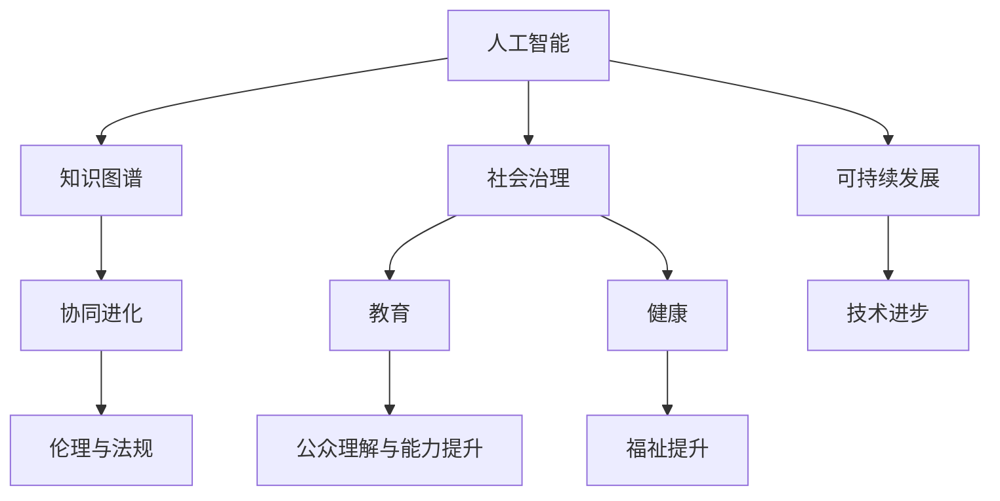

                 

# 知识的协同进化：技术与社会的互动

> 关键词：协同进化,技术,社会,知识,人工智能,社会治理,教育,健康,可持续发展,伦理

## 1. 背景介绍

### 1.1 问题由来

随着人工智能(AI)技术的飞速发展，人类社会的各个领域正逐渐被智能技术所变革。无论是工业生产、商业运作，还是医疗卫生、教育培训，AI技术都在不断地渗透和影响。这些技术的发展既带来了巨大的经济和社会效益，也带来了诸多挑战。

AI技术的进步，离不开大量高质量的数据和算力的支撑，而这些资源主要由社会提供。反过来，AI技术的广泛应用，也带来更多的社会需求，促进了数据和算力的不断积累与提升。这种技术与社会的双向互动，形成了一种协同进化的关系。

然而，如何有效地促进技术的发展，同时保证社会的健康演进，是一个复杂而棘手的问题。技术在为社会带来便利的同时，也可能引发新的问题。例如，自动化可能取代部分低技能工作，数据隐私和安全问题等。因此，我们需要深入思考技术与社会的关系，并制定合理的策略来引导技术的健康发展，使之真正造福人类社会。

### 1.2 问题核心关键点

实现技术与社会的协同进化，需要把握以下几个核心关键点：

1. **数据治理与隐私保护**：数据是AI技术的基石，如何在数据利用和隐私保护之间找到平衡，是技术发展的重要考量。
2. **伦理与法规约束**：技术进步过程中，需要遵循伦理原则和法规要求，确保技术的安全和公正。
3. **技术与教育结合**：提升公众对AI技术的理解和应用能力，有助于技术的普及和社会的包容性。
4. **可持续发展**：技术应助力环境和社会的长远发展，避免对资源的过度消耗。
5. **社会治理与自治**：利用技术提升社会治理的效率和效果，同时保障公民的自治权利。

这些关键点共同构成了技术社会协同进化的主要挑战和研究方向，需要技术界和学术界的共同努力。

### 1.3 问题研究意义

深入研究技术与社会的协同进化，对于推动AI技术的负责任应用，具有重要意义：

1. **促进技术发展**：明确社会需求，引导技术研发方向，加速AI技术的成熟和应用。
2. **提升社会福祉**：通过合理利用技术，解决社会问题，提升生活质量。
3. **保障公平正义**：避免技术带来的不平等，确保技术成果为社会公平共享。
4. **增强社会自治**：利用技术提升社会治理能力，保障公民的决策权和知情权。
5. **推动可持续发展**：技术应助力实现环境和社会的长远目标，为未来世代留下可持续发展的机会。

## 2. 核心概念与联系

### 2.1 核心概念概述

为更好地理解技术与社会的互动，本节将介绍几个关键概念：

- **人工智能(AI)**：基于算法和数据的技术，能够自动执行复杂任务，如图像识别、自然语言处理、决策制定等。
- **知识图谱(Knowledge Graph)**：以图的形式表示知识，通过节点和边的关系，描述实体与概念之间的关系，帮助机器理解和推理。
- **协同进化(Co-Evolution)**：指技术进步与社会发展之间的双向互动关系，两者相互影响，共同进步。
- **可持续发展(Sustainable Development)**：追求经济、社会、环境三位一体的长远发展目标。
- **社会治理(Social Governance)**：通过政策、法律、技术等手段，管理社会事务，促进社会和谐稳定。
- **教育(Education)**：培养人才，提升公众素质，促进社会进步。
- **健康(Health)**：保障人民生命安全和身体健康，提升生活质量。

这些核心概念之间的逻辑关系可以通过以下Mermaid流程图来展示：



这个流程图展示了大语言模型的核心概念及其之间的关系：

1. 人工智能通过知识图谱与知识库进行融合，提升了对现实世界的理解和推理能力。
2. 人工智能与社会治理、可持续发展等领域相结合，推动社会进步和福祉提升。
3. 人工智能与教育结合，提升了公众对技术的理解和应用能力。
4. 人工智能在健康领域的应用，提高了医疗服务的质量和效率。
5. 协同进化强调了技术与社会的双向互动关系，需要技术发展与社会发展相互促进。
6. 伦理与法规约束了技术的应用，保障了社会的公平和安全。

这些概念共同构成了人工智能技术与社会发展相互影响的基本框架。通过理解这些核心概念，我们可以更好地把握技术与社会的互动关系。

## 3. 核心算法原理 & 具体操作步骤
### 3.1 算法原理概述

技术与社会的协同进化，主要体现在以下几个方面：

1. **技术发展与社会需求**：社会的需求推动技术发展，技术的发展又反过来满足社会的各种需求。
2. **技术创新与社会治理**：技术创新为社会治理带来新的手段，提升治理效率。
3. **知识共享与社会教育**：技术的普及和应用，需要公众的知识共享与教育提升。
4. **伦理建设与社会自治**：技术应用中出现的伦理问题，需要通过社会自治来解决。

这些方面可以通过以下算法框架来具体实现：

1. **需求识别与技术研发**：通过社会调研和数据分析，识别社会需求，指导技术研发方向。
2. **技术应用与社会治理**：将技术应用于社会治理中，提升治理效率和效果。
3. **知识普及与教育培训**：通过线上线下平台，普及AI技术知识，提升公众素养。
4. **伦理构建与法规制定**：建立伦理指导原则，制定相关法规，规范技术应用。

### 3.2 算法步骤详解

基于技术与社会的协同进化，可以设计以下步骤来实施：

**Step 1: 社会需求调研**
- 通过问卷调查、深度访谈等方式，收集公众对AI技术的需求和期望。
- 分析数据，识别出社会中的热点问题和需求，为技术研发提供方向。

**Step 2: 技术研发与测试**
- 根据需求调研结果，选择适合的技术方案进行研发。
- 进行技术测试和验证，确保技术在实际应用中的稳定性和可靠性。

**Step 3: 技术应用与反馈**
- 将技术应用到实际场景中，收集用户反馈。
- 根据反馈结果进行优化，持续改进技术性能。

**Step 4: 知识普及与教育**
- 开发教育课程和培训项目，提升公众对技术的理解。
- 通过线上平台和社区活动，广泛传播AI知识，提升公众素养。

**Step 5: 伦理建设与法规制定**
- 建立伦理指导原则，明确技术应用中的责任和义务。
- 制定相关法规和标准，规范技术应用，保障社会公平。

### 3.3 算法优缺点

协同进化范式具有以下优点：

1. **响应快速**：能够快速响应社会需求，推动技术进步。
2. **应用广泛**：技术可以应用于社会各个领域，带来广泛的社会效益。
3. **持续改进**：通过不断收集反馈和优化，技术性能不断提升。

同时，该方法也存在一定的局限性：

1. **依赖数据质量**：技术的发展依赖于高质量的数据，数据质量差可能影响效果。
2. **伦理问题复杂**：技术应用中出现的伦理问题需要综合考虑多方面因素，解决复杂。
3. **法规制定滞后**：技术发展迅速，法规制定可能滞后于技术应用。
4. **公众接受度低**：技术普及过程中，公众的接受度可能较低，需要更多的宣传和引导。

尽管存在这些局限性，但协同进化的范式仍然是当前推动技术和社会发展的有效方法。未来需要进一步优化数据治理、伦理建设、法规制定等方面的措施，提升技术的社会适应性。

### 3.4 算法应用领域

协同进化方法在多个领域中已经得到了广泛的应用，例如：

1. **医疗健康**：利用AI技术进行疾病预测、诊断和治疗方案优化，提升医疗服务质量。
2. **智慧城市**：通过智能监控、数据分析，提升城市管理效率，改善市民生活质量。
3. **教育培训**：利用AI技术进行个性化教学、智能评估，提升教育质量和效率。
4. **金融科技**：应用AI技术进行风险评估、欺诈检测，提升金融服务的质量和安全性。
5. **环境保护**：利用AI技术进行环境监测、污染治理，助力环境保护和可持续发展。

这些领域的应用展示了协同进化范式在推动技术和社会发展中的重要作用。

## 4. 数学模型和公式 & 详细讲解 & 举例说明

### 4.1 数学模型构建

协同进化可以视为一个多智能体系统，各智能体之间的交互和影响可以通过数学模型来描述。以下是一个简单的多智能体协同进化模型：

假设系统中有 $n$ 个智能体（如技术发展、社会需求、教育水平等），智能体的状态可以用向量 $\mathbf{x}_t = (x_{1,t}, x_{2,t}, ..., x_{n,t})$ 来表示，其中 $t$ 表示时间步。智能体的状态变化可以通过以下差分方程来描述：

$$
\mathbf{x}_{t+1} = f(\mathbf{x}_t, \mathbf{u}_t)
$$

其中 $\mathbf{u}_t$ 为智能体的输入（如政策、技术进步、市场需求等），$f$ 为系统的状态转移函数。

### 4.2 公式推导过程

以智慧城市为例，我们可以建立一个简单的智慧城市协同进化模型：

假设智慧城市包含 $n=3$ 个智能体：技术发展（$\mathbf{x}_1$）、城市管理（$\mathbf{x}_2$）、市民满意度（$\mathbf{x}_3$）。智能体的状态变化如下：

- 技术发展：$\Delta x_{1,t} = f_{1}(\mathbf{x}_{1,t-1}, \mathbf{x}_{2,t-1}, \mathbf{u}_{t})$
- 城市管理：$\Delta x_{2,t} = f_{2}(\mathbf{x}_{1,t-1}, \mathbf{x}_{2,t-1}, \mathbf{u}_{t})$
- 市民满意度：$\Delta x_{3,t} = f_{3}(\mathbf{x}_{1,t-1}, \mathbf{x}_{2,t-1}, \mathbf{x}_{3,t-1}, \mathbf{u}_{t})$

其中 $f_1, f_2, f_3$ 为具体的函数形式，需要根据实际情况进行设计。假设城市管理水平直接影响市民满意度，则有 $f_{3} = \mathrm{satur}(2 \times f_{2} - 1)$，其中 $\mathrm{satur}$ 为饱和函数，限制满意度在 $[0, 1]$ 之间。

### 4.3 案例分析与讲解

以智慧城市为例，分析智能体之间的相互作用：

1. **技术发展与城市管理**：技术进步可以提升城市管理水平，进而提升市民满意度。假设技术发展的速度 $x_{1,t}$ 直接影响城市管理水平 $x_{2,t}$，则有 $f_2 = g_2(x_{1,t})$，其中 $g_2$ 为线性增长函数。
2. **城市管理与市民满意度**：城市管理水平直接影响市民满意度，即 $f_3 = g_3(x_{2,t})$，其中 $g_3$ 为二次函数。
3. **市民满意度与反馈**：市民满意度高时，市民通过各种渠道（如社交媒体、市民调查）对城市管理提出建议，进而影响城市管理水平。假设市民满意度 $x_{3,t}$ 对城市管理水平 $x_{2,t}$ 的影响为二次函数 $f_{2} = g_{2}(x_{3,t})$。

通过这些函数，我们可以描述智慧城市中技术、城市管理、市民满意度之间的相互作用，并模拟其动态演化过程。

## 5. 项目实践：代码实例和详细解释说明
### 5.1 开发环境搭建

在进行协同进化项目实践前，我们需要准备好开发环境。以下是使用Python进行多智能体仿真环境的环境配置流程：

1. 安装Anaconda：从官网下载并安装Anaconda，用于创建独立的Python环境。

2. 创建并激活虚拟环境：
```bash
conda create -n coevolution-env python=3.8 
conda activate coevolution-env
```

3. 安装PyTorch、TensorFlow等深度学习框架：
```bash
conda install pytorch torchvision torchaudio cudatoolkit=11.1 -c pytorch -c conda-forge
conda install tensorflow
```

4. 安装相关工具包：
```bash
pip install numpy pandas matplotlib scipy jupyter notebook ipython
```

完成上述步骤后，即可在`coevolution-env`环境中开始协同进化实践。

### 5.2 源代码详细实现

下面以智慧城市为例，给出使用Sympy和Python进行多智能体仿真的代码实现。

首先，定义智能体的状态向量和时间步：

```python
from sympy import symbols, Function, Eq, solve

# 定义智能体状态变量
x1, x2, x3 = symbols('x1 x2 x3')
u1, u2, u3 = symbols('u1 u2 u3')

# 定义状态转移函数
f1 = Function('f1')(x1, x2, u1)
f2 = Function('f2')(x1, x2, u2)
f3 = Function('f3')(x1, x2, x3, u3)

# 定义状态方程
eq1 = Eq(x1, f1(x1, x2, u1))
eq2 = Eq(x2, f2(x1, x2, u2))
eq3 = Eq(x3, f3(x1, x2, x3, u3))

# 求解状态转移函数
sol = solve((eq1, eq2, eq3), (x1, x2, x3))
print(sol)
```

然后，定义智能体的输入向量：

```python
# 定义输入向量
u1 = 0.1  # 技术发展速度
u2 = 0.2  # 城市管理水平
u3 = 0.3  # 市民满意度反馈

# 求解状态向量
sol = solve((eq1, eq2, eq3), (x1, x2, x3))
print(sol)
```

接着，定义智能体之间的相互作用函数：

```python
from sympy import symbols, Function, Eq, solve, Rational

# 定义智能体状态变量
x1, x2, x3 = symbols('x1 x2 x3')
u1, u2, u3 = symbols('u1 u2 u3')

# 定义状态转移函数
f1 = Function('f1')(x1, x2, u1)
f2 = Function('f2')(x1, x2, u2)
f3 = Function('f3')(x1, x2, x3, u3)

# 定义状态方程
eq1 = Eq(x1, f1(x1, x2, u1))
eq2 = Eq(x2, f2(x1, x2, u2))
eq3 = Eq(x3, f3(x1, x2, x3, u3))

# 求解状态转移函数
sol = solve((eq1, eq2, eq3), (x1, x2, x3))
print(sol)

# 定义智能体之间的相互作用函数
def interaction_f1(x1, x2):
    return x1 + x2

def interaction_f2(x2, x3):
    return x2 - x3

def interaction_f3(x1, x2, x3):
    return x1 + x2 - 3 * x3

# 求解状态向量
sol = solve((eq1.subs(f1, interaction_f1), eq2.subs(f2, interaction_f2), eq3.subs(f3, interaction_f3)), (x1, x2, x3))
print(sol)
```

最后，启动仿真流程并在结果中分析智能体之间的动态变化：

```python
from sympy import symbols, Function, Eq, solve, Rational

# 定义智能体状态变量
x1, x2, x3 = symbols('x1 x2 x3')
u1, u2, u3 = symbols('u1 u2 u3')

# 定义状态转移函数
f1 = Function('f1')(x1, x2, u1)
f2 = Function('f2')(x1, x2, u2)
f3 = Function('f3')(x1, x2, x3, u3)

# 定义状态方程
eq1 = Eq(x1, f1(x1, x2, u1))
eq2 = Eq(x2, f2(x1, x2, u2))
eq3 = Eq(x3, f3(x1, x2, x3, u3))

# 求解状态转移函数
sol = solve((eq1, eq2, eq3), (x1, x2, x3))
print(sol)

# 定义智能体之间的相互作用函数
def interaction_f1(x1, x2):
    return x1 + x2

def interaction_f2(x2, x3):
    return x2 - x3

def interaction_f3(x1, x2, x3):
    return x1 + x2 - 3 * x3

# 求解状态向量
sol = solve((eq1.subs(f1, interaction_f1), eq2.subs(f2, interaction_f2), eq3.subs(f3, interaction_f3)), (x1, x2, x3))
print(sol)

# 启动仿真
import matplotlib.pyplot as plt
import numpy as np

N = 100  # 仿真时间步
x1 = np.zeros(N)
x2 = np.zeros(N)
x3 = np.zeros(N)
u1 = 0.1  # 技术发展速度
u2 = 0.2  # 城市管理水平
u3 = 0.3  # 市民满意度反馈

for t in range(N):
    x1[t+1] = x1[t] + u1 + interaction_f1(x1[t], x2[t])
    x2[t+1] = x2[t] + u2 + interaction_f2(x2[t], x3[t])
    x3[t+1] = x3[t] + u3 + interaction_f3(x1[t], x2[t], x3[t])

plt.plot(x1, label='技术发展')
plt.plot(x2, label='城市管理')
plt.plot(x3, label='市民满意度')
plt.legend()
plt.show()
```

以上就是使用Sympy和Python进行智慧城市协同进化的代码实现。可以看到，通过Sympy和Python的组合，可以方便地建立智能体之间的动态关系，并进行仿真分析。

### 5.3 代码解读与分析

让我们再详细解读一下关键代码的实现细节：

**智能体状态定义**：
- 使用Sympy的符号变量定义智能体的状态和输入变量。
- 通过状态转移函数描述智能体之间的相互作用。

**智能体相互作用函数**：
- 通过定义具体的状态转移函数，模拟智能体之间的动态变化。
- 使用Sympy的solve函数求解状态向量。

**仿真流程**：
- 通过for循环进行仿真，记录每个时间步智能体的状态变化。
- 使用Matplotlib绘制状态变化曲线，直观展示智能体之间的动态关系。

## 6. 实际应用场景

### 6.1 智慧城市治理

智慧城市治理是协同进化技术的重要应用场景。通过智能监控、数据分析、决策支持等手段，智慧城市能够提升城市管理效率，改善市民生活质量。

具体而言，智慧城市可以包括以下几个方面：

1. **智能监控与分析**：利用摄像头、传感器等设备，实时监控城市状况，通过数据分析识别异常情况。例如，交通流量监测、环境污染检测、公共安全监控等。
2. **决策支持系统**：通过大数据分析、预测建模等技术，辅助城市管理者做出科学决策。例如，交通流量预测、环境污染治理、应急响应管理等。
3. **公共服务优化**：通过AI技术提升公共服务质量，例如智能交通、智慧能源、智能医疗等。

智慧城市的建设需要多学科协同，需要技术、经济、环境、社会等多方面的综合考虑。通过协同进化模型，可以模拟智慧城市中各智能体之间的动态关系，优化政策制定和资源配置。

### 6.2 教育培训

教育培训是协同进化的另一个重要应用场景。通过技术手段，教育培训可以更加个性化、高效化，提升教学效果和教育公平性。

具体而言，教育培训可以包括以下几个方面：

1. **个性化学习**：利用AI技术对学生的学习情况进行分析和评估，制定个性化的学习计划和资源推荐。例如，基于学习行为分析的智能推荐系统、基于语音识别的自动评估系统等。
2. **智能评估**：利用AI技术进行自动化的考试和评估，减少教师的工作负担，提升评估的准确性和公正性。例如，基于自然语言处理(NLP)的自动作文评分系统、基于图像识别技术的考试批改系统等。
3. **远程教育**：通过AI技术提供高质量的远程教育资源，缩小城乡教育差距，提升教育公平性。例如，基于视频流的智能辅导系统、基于虚拟现实(VR)的互动教学系统等。

教育培训的协同进化需要考虑教师、学生、课程、资源等多个因素，通过模型模拟和数据分析，优化教学资源配置和教学策略。

### 6.3 健康医疗

健康医疗是协同进化的关键应用领域之一。通过AI技术，健康医疗可以实现精准医疗、智能诊断、治疗方案优化等，提升医疗服务的质量和效率。

具体而言，健康医疗可以包括以下几个方面：

1. **精准医疗**：利用AI技术进行基因组分析、影像识别等，提供个性化的治疗方案。例如，基于深度学习的影像识别系统、基于机器学习的疾病预测系统等。
2. **智能诊断**：利用AI技术进行症状分析、诊断决策等，提高诊断的准确性和效率。例如，基于自然语言处理的医嘱解析系统、基于图像识别的病变检测系统等。
3. **治疗方案优化**：利用AI技术进行药物组合、剂量优化等，提升治疗效果和安全性。例如，基于强化学习的药物组合优化系统、基于深度学习的剂量调整系统等。

健康医疗的协同进化需要考虑患者、医生、医院、药品等多个因素，通过模型模拟和数据分析，优化医疗资源配置和治疗策略。

### 6.4 未来应用展望

随着技术的不断发展，协同进化的应用场景将不断拓展，未来的技术发展方向包括：

1. **多模态协同**：结合语音、图像、文本等多模态信息，提升智能系统的综合感知能力。
2. **联邦学习**：通过分布式计算，保护数据隐私，提升模型的泛化能力。
3. **元学习**：通过少样本学习和迁移学习，提升模型的适应能力，加速新任务的开发。
4. **人机协同**：利用增强现实、虚拟现实等技术，提升人机交互的自然性和智能化水平。
5. **智能辅助决策**：结合因果推断和伦理指导，提升智能决策的透明性和可解释性。

这些技术方向将进一步推动协同进化的应用场景，为技术和社会的发展带来新的机遇和挑战。

## 7. 工具和资源推荐
### 7.1 学习资源推荐

为了帮助开发者系统掌握协同进化的理论和实践，这里推荐一些优质的学习资源：

1. **《协同进化：技术与社会》系列博文**：由协同进化专家撰写，深入浅出地介绍了协同进化的原理和应用案例。

2. **Coursera《人工智能与社会》课程**：斯坦福大学开设的跨学科课程，涵盖人工智能、伦理、政策等多个领域，帮助你全面理解技术与社会的关系。

3. **《人工智能与可持续发展》书籍**：介绍人工智能技术在可持续发展中的应用，探讨技术如何助力环境和社会的长远发展。

4. **Kaggle竞赛平台**：提供大量真实的协同进化问题，通过实际项目提升实践能力。

5. **GitHub开源项目**：如OpenAI的GPT-3、DeepMind的AlphaGo等，通过开源代码学习和应用最新技术。

通过这些资源的学习实践，相信你一定能够快速掌握协同进化的精髓，并用于解决实际的协同进化问题。

### 7.2 开发工具推荐

高效的协同进化开发离不开优秀的工具支持。以下是几款用于协同进化开发的常用工具：

1. **SimPy**：Python编写的多智能体仿真库，支持大规模的仿真模拟。
2. **AnyLogic**：商业仿真软件，支持多智能体仿真、优化建模等。
3. **MATLAB**：强大的科学计算工具，支持多智能体仿真、数据分析等。
4. **Blender**：开源的3D建模和渲染工具，支持虚拟现实和增强现实的仿真。
5. **Jupyter Notebook**：支持Python、R等语言的在线编程环境，方便协同进化模型的开发和调试。

合理利用这些工具，可以显著提升协同进化任务的开发效率，加快创新迭代的步伐。

### 7.3 相关论文推荐

协同进化技术的发展源于学界的持续研究。以下是几篇奠基性的相关论文，推荐阅读：

1. **《协同进化算法》论文**：由Holland教授提出，开创了协同进化算法的先河。
2. **《复杂适应系统：智能中的集体适应》书籍**：由霍兰德教授撰写，深入阐述了复杂适应系统(CAS)的理论和实践。
3. **《多智能体系统》书籍**：由Rosenschein教授等撰写，系统介绍了多智能体系统的理论基础和应用实例。

这些论文代表了大规模系统协同进化的发展脉络。通过学习这些前沿成果，可以帮助研究者把握学科前进方向，激发更多的创新灵感。

## 8. 总结：未来发展趋势与挑战

### 8.1 总结

本文对技术与社会的协同进化进行了全面系统的介绍。首先阐述了协同进化的背景和意义，明确了技术发展与社会需求之间的双向互动关系。其次，从原理到实践，详细讲解了协同进化的数学模型和算法步骤，给出了协同进化任务开发的完整代码实例。同时，本文还广泛探讨了协同进化在智慧城市、教育培训、健康医疗等多个领域的应用前景，展示了协同进化的巨大潜力。此外，本文精选了协同进化的各类学习资源，力求为读者提供全方位的技术指引。

通过本文的系统梳理，可以看到，协同进化技术正在成为推动技术和社会发展的有效方法，为智能社会的构建提供了重要的理论基础和实践指导。技术进步与社会需求相互促进，共同驱动社会向更加智能化、可持续化方向发展。

### 8.2 未来发展趋势

展望未来，协同进化技术将呈现以下几个发展趋势：

1. **多模态协同**：结合语音、图像、文本等多模态信息，提升智能系统的综合感知能力。
2. **联邦学习**：通过分布式计算，保护数据隐私，提升模型的泛化能力。
3. **元学习**：通过少样本学习和迁移学习，提升模型的适应能力，加速新任务的开发。
4. **人机协同**：利用增强现实、虚拟现实等技术，提升人机交互的自然性和智能化水平。
5. **智能辅助决策**：结合因果推断和伦理指导，提升智能决策的透明性和可解释性。

这些趋势凸显了协同进化的广阔前景。这些方向的探索发展，必将进一步提升协同进化的应用效果，为技术和社会的发展带来新的机遇和挑战。

### 8.3 面临的挑战

尽管协同进化技术已经取得了一定的进展，但在迈向更加智能化、普适化应用的过程中，它仍面临着诸多挑战：

1. **数据质量与隐私**：协同进化依赖高质量的数据，数据质量差可能导致模型性能下降。同时，数据隐私和安全问题也需要得到充分重视。
2. **伦理与法规**：协同进化技术的应用可能引发伦理问题，需要建立相应的伦理指导原则和法规约束。
3. **系统复杂性**：协同进化模型涉及多智能体之间的复杂交互，模型设计和优化需要更多工程实践。
4. **资源消耗**：大规模协同进化模型的计算和存储需求较高，需要更多高性能计算资源的支持。
5. **公众接受度**：协同进化技术的应用可能带来工作岗位的变化，需要更多的公众教育和宣传。

尽管存在这些挑战，但协同进化技术仍具有巨大的应用潜力，需要在实践中不断优化和完善，以更好地推动技术和社会的发展。

### 8.4 研究展望

未来，协同进化技术需要在以下几个方面寻求新的突破：

1. **数据治理与隐私保护**：提升数据质量，保护数据隐私，确保模型训练的安全性和有效性。
2. **伦理与法规建设**：建立明确的伦理指导原则和法规约束，确保协同进化技术的应用合法、公正。
3. **系统复杂性优化**：简化协同进化模型的设计和优化，降低工程实现难度，提升应用效率。
4. **资源优化**：优化计算和存储资源的分配，提升大规模协同进化模型的处理能力。
5. **公众教育与接受**：提升公众对协同进化技术的理解，推动技术的普及和应用。

这些方向的探索发展，必将进一步推动协同进化技术的发展，为技术和社会的发展带来新的机遇和挑战。

## 9. 附录：常见问题与解答

**Q1：协同进化与传统的优化算法有什么区别？**

A: 协同进化算法是基于生物进化理论的多智能体优化算法，与传统的优化算法（如梯度下降、粒子群优化等）相比，有以下区别：

1. **多智能体协作**：协同进化算法将问题视为多个智能体的协作过程，每个智能体独立演化，通过合作和竞争达到全局最优。
2. **适应度计算**：协同进化算法通过适应度函数评估智能体的优劣，适应度高的个体更可能被保留，适应度低的个体则被淘汰。
3. **交叉与变异**：协同进化算法通过交叉和变异操作促进智能体的多样性，避免早熟和局部最优。
4. **种群动态变化**：协同进化算法模拟种群动态变化，种群大小、分布和演化过程都是动态变化的。

这些特点使得协同进化算法在处理复杂、高维度优化问题时具有优势。

**Q2：协同进化如何应用于社会治理？**

A: 协同进化在社会治理中的应用主要体现在以下几个方面：

1. **智能决策支持**：利用AI技术进行数据分析和预测，辅助政府决策。例如，通过协同进化模型优化资源配置，提升公共服务的效率。
2. **应急响应管理**：通过多智能体仿真，模拟应急响应过程，优化救援方案。例如，通过协同进化模型模拟自然灾害影响，预测灾害发展趋势。
3. **公共参与与反馈**：利用协同进化模型模拟公众参与过程，收集和分析公众意见，优化政策制定。例如，通过协同进化模型模拟公众对环境政策的反应，评估政策效果。

通过协同进化模型，社会治理可以更加科学、高效地应对各种挑战，提升治理效果。

**Q3：协同进化如何保障数据隐私与安全？**

A: 协同进化在数据隐私和安全方面主要通过以下措施来保障：

1. **数据匿名化**：将数据中的敏感信息进行匿名化处理，防止数据泄露。
2. **联邦学习**：通过分布式计算，数据只在本地处理，不进行集中存储，保障数据隐私。
3. **差分隐私**：在数据收集和分析过程中加入噪声，保护个体隐私。
4. **访问控制**：设置严格的数据访问权限，确保只有授权用户可以访问数据。
5. **加密技术**：采用加密技术保护数据传输和存储过程中的安全。

通过这些措施，协同进化技术可以更好地保护数据隐私，确保数据使用的合法性和安全性。

**Q4：协同进化如何应用于教育培训？**

A: 协同进化在教育培训中的应用主要体现在以下几个方面：

1. **个性化学习推荐**：通过协同进化模型分析学生的学习行为和偏好，推荐个性化的学习资源。例如，通过协同进化模型推荐适合的课程、教材和习题。
2. **智能评估与反馈**：利用AI技术进行自动化的考试和评估，提升评估的准确性和公正性。例如，通过协同进化模型分析学生的答题情况，生成个性化的反馈报告。
3. **在线教育平台**：利用协同进化技术构建智能化的在线教育平台，提供高质量的远程教育资源。例如，通过协同进化模型模拟在线教育平台的用户行为，优化学习体验。

通过协同进化技术，教育培训可以更加个性化、高效化，提升教学效果和教育公平性。

**Q5：协同进化如何应用于健康医疗？**

A: 协同进化在健康医疗中的应用主要体现在以下几个方面：

1. **精准医疗**：通过协同进化模型分析患者基因组数据和临床数据，制定个性化的治疗方案。例如，通过协同进化模型预测患者对不同药物的反应。
2. **智能诊断**：利用AI技术进行症状分析、诊断决策等，提高诊断的准确性和效率。例如，通过协同进化模型分析医学影像数据，识别病变区域。
3. **治疗方案优化**：利用AI技术进行药物组合、剂量优化等，提升治疗效果和安全性。例如，通过协同进化模型优化癌症治疗方案，减少副作用。

通过协同进化技术，健康医疗可以实现精准医疗、智能诊断和优化治疗方案，提升医疗服务的质量和效率。

---

作者：禅与计算机程序设计艺术 / Zen and the Art of Computer Programming

