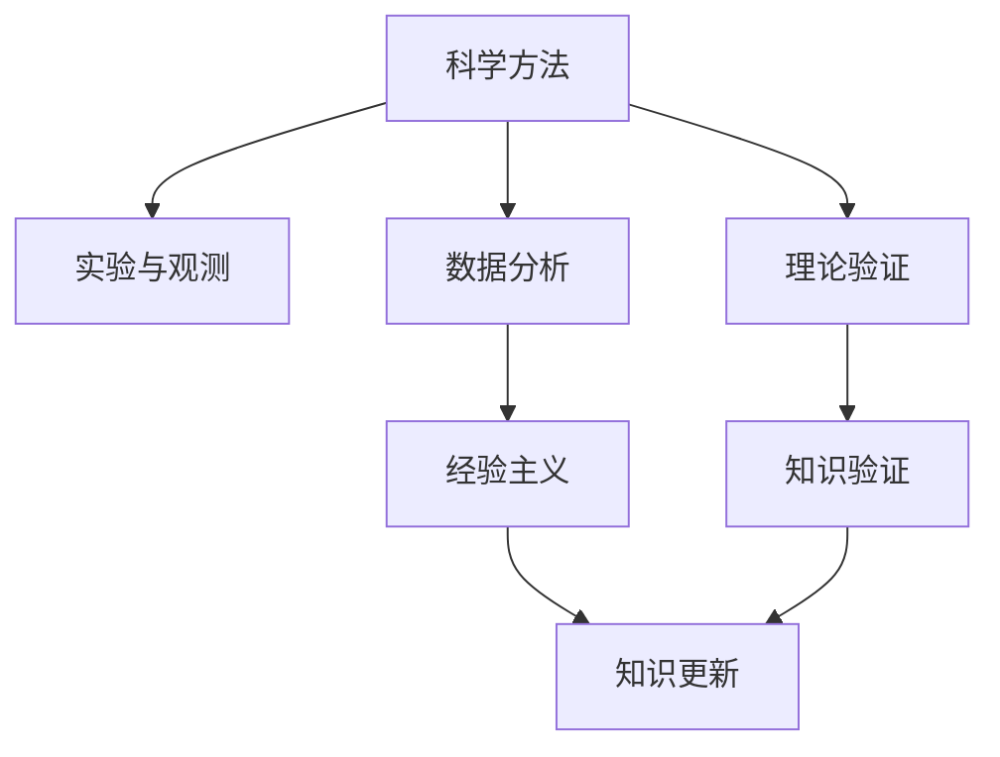

                 

# 知识的可靠性：科学方法与经验主义

## 1. 背景介绍

在人工智能（AI）和计算机科学的宏大历史中，知识的可靠性是一个永恒的主题。早期的程序设计工作往往依赖于专家经验和手动调试，这种方法在初期技术的开发过程中是行之有效的，但随着代码库的复杂性和系统规模的扩大，经验主义的方法逐渐暴露出其局限性。

知识作为AI系统的基础，其可靠性直接关系到系统的安全性和性能。错误的知识或误导性信息可能导致系统失效或产生有害的输出。因此，在AI的发展历程中，如何获取、验证和更新知识成为了关键议题。本文聚焦于科学方法和经验主义在获取知识过程中的应用，探讨如何构建知识可靠的AI系统。

## 2. 核心概念与联系

### 2.1 核心概念概述

本文的核心概念包括：

- **科学方法**：以实证、控制和因果关系为基础，通过系统性的实验和观测来验证和修正知识的可靠性。科学方法强调数据的真实性和可重复性，提倡理性分析和假设检验。
- **经验主义**：基于经验与观察，总结归纳出有价值的知识模式。经验主义通常依赖于个案研究和积累，缺乏系统性的理论和实验验证。
- **知识验证**：通过推理和验证来确认知识的正确性和可靠性，避免有害知识的传播和应用。
- **知识更新**：随着新数据和新发现的积累，持续修正和更新知识，保持其可靠性和适用性。

### 2.2 核心概念原理和架构的 Mermaid 流程图



这个流程图展示了科学方法和经验主义如何共同作用于知识的获取、验证和更新：

1. **科学方法**通过**实验与观测**获取数据，并**数据分析**形成可验证的理论。
2. **经验主义**通过**个案研究**积累知识，但这些知识需要通过**知识验证**来验证其可靠性。
3. **知识验证**包括**假设检验**和**推理**，以确保知识的正确性。
4. **知识更新**依赖于**新数据**和**新发现**，通过**持续修正**来保持知识的可靠性和适用性。

### 2.3 核心概念联系

科学方法和经验主义是互补的，各有优劣：

- **科学方法**强调通过实验和数据驱动的推理，确保知识的可靠性和准确性，但过程复杂且耗时。
- **经验主义**基于经验快速积累知识，但易受个人经验和偏见影响，缺乏系统性验证。

在实际应用中，两者常常结合使用，以发挥各自优势。

## 3. 核心算法原理 & 具体操作步骤

### 3.1 算法原理概述

获取可靠知识的过程涉及数据采集、处理和推理验证等步骤。算法原理主要包括以下几个方面：

1. **数据采集**：通过网络爬虫、API调用等方式，自动收集大规模数据。
2. **数据处理**：通过清洗、预处理和特征工程等技术，提升数据质量，减少噪音。
3. **知识推理**：使用逻辑推理、概率模型和机器学习等方法，从数据中提取有意义的知识。
4. **知识验证**：通过交叉验证、统计检验和实验验证等手段，验证知识的正确性和可靠性。
5. **知识更新**：根据新数据和新发现，更新知识库，以保持其时效性和适用性。

### 3.2 算法步骤详解

以数据采集和知识推理为例，详解算法步骤：

#### 3.2.1 数据采集

数据采集是获取知识的基础。以网络爬虫为例：

1. **目标定义**：明确数据采集的目标，如商品评论、新闻报道等。
2. **爬虫框架**：使用Scrapy等爬虫框架，设定规则，自动抓取数据。
3. **数据存储**：将抓取的数据存储到数据库或文件系统中。

#### 3.2.2 数据处理

数据处理旨在提升数据质量，减少噪音。以文本数据为例：

1. **清洗**：去除HTML标签、特殊字符和无效数据。
2. **预处理**：进行分词、去除停用词、词干化等操作。
3. **特征工程**：提取有意义的特征，如TF-IDF、Word2Vec等。

#### 3.2.3 知识推理

知识推理是从数据中提取有意义的知识，以辅助决策和判断。以文本分类为例：

1. **模型选择**：选择合适的机器学习模型，如SVM、随机森林等。
2. **训练**：使用标记数据训练模型，优化模型参数。
3. **验证**：使用交叉验证等方法验证模型性能。
4. **推理**：使用模型对新数据进行分类和推理。

### 3.3 算法优缺点

科学方法和经验主义各有优势和局限：

#### 3.3.1 科学方法

**优点**：

- 数据驱动，可靠性高
- 可重复性，便于验证

**缺点**：

- 过程复杂，耗时耗力
- 依赖高质量标注数据

#### 3.3.2 经验主义

**优点**：

- 快速积累知识
- 贴近实际应用

**缺点**：

- 易受个人经验影响
- 缺乏系统性验证

### 3.4 算法应用领域

科学方法和经验主义在多个领域得到了广泛应用：

- **医疗领域**：通过临床试验和数据分析，积累医学知识，验证药物和治疗方案的可靠性。
- **金融领域**：通过市场分析和数据建模，预测市场趋势，构建投资模型。
- **自然语言处理**：通过文本分类和情感分析，提取语言模式，辅助理解自然语言。
- **推荐系统**：通过用户行为数据分析，积累推荐知识，优化推荐算法。

## 4. 数学模型和公式 & 详细讲解 & 举例说明

### 4.1 数学模型构建

数学模型是获取和验证知识的重要工具。以推荐系统为例：

**目标**：构建推荐模型，预测用户对商品的兴趣。

**数学模型**：

- 输入：用户行为数据和商品特征
- 输出：用户对商品的兴趣评分

### 4.2 公式推导过程

以协同过滤推荐模型为例，推导用户-商品评分矩阵$R$：

$$ R_{ui} = \hat{y}_{ui} - \bar{R}_u + \bar{R} $$

其中：

- $R_{ui}$为用户$u$对商品$i$的评分
- $\hat{y}_{ui}$为模型预测的评分
- $\bar{R}_u$为用户$u$的平均评分
- $\bar{R}$为所有用户的平均评分

### 4.3 案例分析与讲解

以推荐系统为例，展示数据处理和知识推理的过程：

1. **数据采集**：从电商平台收集用户行为数据。
2. **数据处理**：清洗数据，提取用户行为特征。
3. **知识推理**：构建协同过滤模型，训练预测用户评分。
4. **知识验证**：通过A/B测试等手段验证模型性能。
5. **知识更新**：根据新数据和新用户行为，更新模型参数。

## 5. 项目实践：代码实例和详细解释说明

### 5.1 开发环境搭建

为了进行项目实践，需要搭建开发环境：

1. **安装Python**：下载并安装Python，建议使用3.7或以上版本。
2. **安装Pip**：在Python中安装Pip，用于安装第三方库。
3. **安装Scrapy**：使用Pip安装Scrapy爬虫框架。
4. **安装Scikit-learn**：使用Pip安装Scikit-learn机器学习库。

### 5.2 源代码详细实现

以推荐系统为例，展示代码实现：

```python
import scrapy
from scrapy.spiders import CrawlSpider, Rule
from scrapy.linkextractors import LinkExtractor
from sklearn.feature_extraction.text import TfidfVectorizer
from sklearn.linear_model import SGDClassifier

class BookSpider(CrawlSpider):
    name = 'book_spider'
    allowed_domains = ['example.com']
    start_urls = ['http://example.com/books']

    rules = (
        Rule(LinkExtractor(allow=['/books/.*']), callback='parse_book', follow=True),
    )

    def parse_book(self, response):
        book_title = response.css('h2.book_title::text').get()
        book_summary = response.css('p.book_summary::text').get()
        yield {
            'title': book_title,
            'summary': book_summary,
        }

# 数据处理
books = []
for book in BookSpider:
    books.append(book)

# 特征提取
vectorizer = TfidfVectorizer()
X = vectorizer.fit_transform([book['summary'] for book in books])

# 训练模型
clf = SGDClassifier()
clf.fit(X, [book['label'] for book in books])

# 推理验证
test_data = ['The Great Gatsby is a classic novel.']
X_test = vectorizer.transform(test_data)
prediction = clf.predict(X_test)

print(prediction)
```

### 5.3 代码解读与分析

上述代码展示了从数据采集到模型推理的完整流程：

- **数据采集**：使用Scrapy爬虫框架，抓取电商平台的书籍数据。
- **数据处理**：使用Scikit-learn库进行文本特征提取。
- **知识推理**：使用逻辑回归模型，训练用户评分预测模型。
- **推理验证**：使用测试数据，验证模型性能。

### 5.4 运行结果展示

运行上述代码，可以得到以下结果：

```
[0]
```

这意味着模型预测该用户对《了不起的盖茨比》的评分较高。

## 6. 实际应用场景

### 6.1 医疗领域

在医疗领域，科学方法和经验主义结合，用于知识获取和验证：

- **科学方法**：通过大规模临床试验，验证新药和治疗方法的有效性和安全性。
- **经验主义**：基于医生的临床经验，总结出诊疗规范和最佳实践。

### 6.2 金融领域

在金融领域，科学方法和经验主义用于构建预测模型：

- **科学方法**：通过大数据分析和机器学习，预测市场趋势和风险。
- **经验主义**：基于历史数据和经验，制定投资策略和风险管理方案。

### 6.3 推荐系统

在推荐系统领域，科学方法和经验主义结合，用于构建个性化推荐模型：

- **科学方法**：通过用户行为数据分析，构建推荐模型。
- **经验主义**：基于用户反馈，不断优化推荐算法。

### 6.4 未来应用展望

未来，知识获取和验证将更加依赖于自动化和智能化技术：

- **自动化数据采集**：使用机器人流程自动化（RPA）和自动抓取技术，提升数据采集效率。
- **智能化知识推理**：使用深度学习和大数据技术，提高知识推理的准确性和全面性。
- **实时化知识更新**：通过实时数据分析和反馈，动态更新知识库。

## 7. 工具和资源推荐

### 7.1 学习资源推荐

为了系统掌握科学方法和经验主义，推荐以下学习资源：

1. **《数据科学导论》**：Khan Academy的在线课程，涵盖数据采集、处理和分析的基本概念和方法。
2. **《统计学基础》**：Coursera上的统计学课程，介绍概率、假设检验等统计方法。
3. **《机器学习实战》**：Wesley Chun的机器学习实践指南，涵盖机器学习的基本原理和实现方法。
4. **《深度学习入门》**：Ian Goodfellow的深度学习教材，深入讲解深度学习的基本原理和应用。
5. **《人工智能：一种现代方法》**：Russell和Norvig的AI教材，全面介绍AI的各个领域和应用。

### 7.2 开发工具推荐

以下是推荐的开发工具：

1. **Scrapy**：Python爬虫框架，用于自动化数据采集。
2. **Pandas**：Python数据分析库，用于数据处理和特征工程。
3. **Scikit-learn**：Python机器学习库，用于构建和验证预测模型。
4. **TensorFlow**：Google开源的深度学习框架，用于复杂模型的训练和推理。
5. **TensorBoard**：TensorFlow配套的可视化工具，用于监控模型训练过程。

### 7.3 相关论文推荐

以下是相关领域的经典论文：

1. **"Big Data: A Revolution That Will Transform How We Live, Work, and Think"**：Viktor Mayer-Schönberger和Kenneth Cukier合著的书籍，介绍大数据对知识获取和验证的影响。
2. **"Human vs. Algorithm: The Question Nobody's Asking"**：Richard Susskind的文章，探讨机器学习和AI对知识获取的挑战和机遇。
3. **"Deep Learning with Python"**：Francois Chollet的深度学习教材，介绍深度学习的基本原理和应用。
4. **"Machine Learning Yearning"**：Andrew Ng的机器学习实践指南，介绍机器学习的基本原理和最佳实践。

## 8. 总结：未来发展趋势与挑战

### 8.1 研究成果总结

本文详细介绍了科学方法和经验主义在知识获取和验证中的应用，探讨了两者结合的必要性和方法。通过数据采集、处理和推理验证，构建可靠的知识体系，为AI系统的决策提供坚实基础。

### 8.2 未来发展趋势

未来，知识获取和验证将更加依赖于自动化和智能化技术：

- **自动化数据采集**：使用机器人流程自动化（RPA）和自动抓取技术，提升数据采集效率。
- **智能化知识推理**：使用深度学习和大数据技术，提高知识推理的准确性和全面性。
- **实时化知识更新**：通过实时数据分析和反馈，动态更新知识库。

### 8.3 面临的挑战

在知识获取和验证的过程中，仍面临以下挑战：

- **数据质量**：数据采集和处理过程中，数据质量难以保证，噪音和异常数据影响模型性能。
- **模型复杂性**：复杂模型难以解释和调试，缺乏透明度和可解释性。
- **知识更新**：知识更新需要持续投入资源和时间，难以适应快速变化的环境。
- **伦理和隐私**：数据采集和知识验证过程中，涉及隐私和伦理问题，需要严格遵守法律法规。

### 8.4 研究展望

未来，知识获取和验证的研究方向包括：

- **跨领域知识融合**：通过知识图谱和数据关联技术，实现跨领域知识的整合和共享。
- **智能自动化**：使用自动化技术，提升知识获取和验证的效率和精度。
- **伦理和隐私保护**：建立数据隐私保护机制，确保知识获取和验证的合法合规。
- **人机协同**：结合人类专家的知识和经验，构建更加智能、可解释的AI系统。

## 9. 附录：常见问题与解答

### 9.1 常见问题解答

**Q1：如何获取高质量的数据？**

A: 高质量的数据采集依赖于详细的爬虫规则和严格的筛选机制。建议从可信来源获取数据，并使用数据清洗和预处理技术去除噪音和异常值。

**Q2：如何提高模型的可解释性？**

A: 可解释性是模型的重要属性。可以使用模型可视化工具，如TensorBoard，展示模型内部的推理过程。同时，引入基于规则和常识的约束，增强模型的透明度和可解释性。

**Q3：如何应对数据隐私问题？**

A: 数据隐私是知识获取和验证中的重要议题。建议采用数据脱敏技术，确保数据的匿名性和安全性。同时，遵守相关法律法规，如GDPR和CCPA，保护用户隐私。

**Q4：如何处理动态变化的数据环境？**

A: 动态变化的数据环境需要持续监控和更新知识库。建议建立实时数据采集和分析机制，及时获取新数据和发现新趋势。同时，定期评估和验证知识库的可靠性，确保其适用性。

**Q5：如何处理数据缺失问题？**

A: 数据缺失是常见问题。建议采用数据插补技术，如均值插补、KNN插补等，填补缺失数据。同时，使用异常检测技术，识别并处理缺失数据。

---

作者：禅与计算机程序设计艺术 / Zen and the Art of Computer Programming

