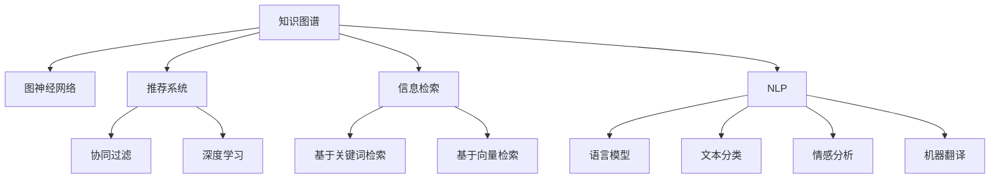

                 

# 知识的应用：洞察力指引知识的实践方向

> 关键词：知识应用,洞察力,知识图谱,图神经网络,推荐系统,信息检索,自然语言处理(NLP),深度学习

## 1. 背景介绍

### 1.1 问题由来
在信息爆炸的时代，如何有效地组织、管理和应用知识，成为了各行各业面临的重要挑战。知识图谱、推荐系统、信息检索、自然语言处理(NLP)等技术，被广泛应用于搜索引擎、电商平台、社交网络、医疗健康等领域，极大地提升了信息检索的效率和质量，推动了知识应用的发展。

然而，现有的知识应用技术在处理复杂、多源、异构的知识体系时，往往存在以下问题：

- **知识图谱构建困难**：传统知识图谱构建需要大量人工干预，代价高昂，且难以覆盖现实世界的所有知识。
- **推荐算法单一**：当前的推荐系统主要依赖于基于内容的协同过滤和深度学习算法，难以处理非结构化数据和复杂用户行为。
- **信息检索效果有限**：传统的信息检索技术无法深度理解用户查询意图，难以在大型语料库中快速定位相关文档。
- **自然语言处理局限性**：现有的NLP模型主要依赖大规模文本数据进行预训练，难以处理小样本数据和复杂的语言表达。

为了解决这些问题，近年来，基于图神经网络、深度学习、知识图谱等技术的知识应用技术发展迅速，成为新一代知识应用技术的核心方向。本文章将从知识图谱、推荐系统、信息检索、NLP等角度，全面探讨知识应用的前沿技术和实践方向，为知识应用的未来发展提供指导。

## 2. 核心概念与联系

### 2.1 核心概念概述

为更好地理解知识应用的整体框架，本节将介绍几个核心概念：

- **知识图谱(Knowledge Graph)**：一种结构化的知识表示方法，通过实体-关系-属性的方式，将知识以图的形式进行组织。知识图谱被广泛应用于搜索引擎、推荐系统、问答系统等场景。
- **图神经网络(Graph Neural Network, GNN)**：一类专门用于图数据上的神经网络模型，能够自动学习图的结构信息，并进行节点分类、链接预测等任务。
- **推荐系统(Recommendation System)**：通过分析用户的历史行为数据，为用户推荐符合其兴趣和需求的产品或服务。推荐系统被广泛应用于电商、新闻、视频等领域。
- **信息检索(Information Retrieval, IR)**：通过分析用户查询和文档内容，自动匹配相关文档，并将结果呈现给用户的技术。信息检索被广泛应用于搜索引擎、文档管理等领域。
- **自然语言处理(Natural Language Processing, NLP)**：使用计算机处理和理解人类语言的技术，包括语言模型、文本分类、情感分析、机器翻译等。

这些核心概念之间的逻辑关系可以通过以下Mermaid流程图来展示：



这个流程图展示的知识应用的核心概念及其之间的关系：

1. 知识图谱通过图神经网络进行关系推理，提供结构化知识表示。
2. 推荐系统可以使用知识图谱进行实体关系预测，也可以使用图神经网络学习用户兴趣。
3. 信息检索可以使用知识图谱进行实体关系匹配，也可以使用图神经网络进行语义理解。
4. NLP任务可以利用图神经网络进行语言生成，也可以利用知识图谱进行关系推理。
5. 推荐系统、信息检索、NLP都可以使用协同过滤、深度学习、向量空间模型等技术，同时也可以结合知识图谱和图神经网络进行优化。

这些核心概念共同构成了知识应用的技术框架，使其能够在各类场景下发挥强大的应用价值。

## 3. 核心算法原理 & 具体操作步骤

### 3.1 算法原理概述

知识应用的核心算法，包括知识图谱构建、图神经网络模型训练、推荐算法优化、信息检索技术提升和NLP模型训练等，都需要在数据、模型和算法等多个层面进行深入探讨和优化。本节将分别介绍这些核心算法原理。

### 3.2 算法步骤详解

#### 3.2.1 知识图谱构建

**Step 1: 数据收集与清洗**  
- 从结构化数据库、非结构化文本、社交媒体、Web API等渠道收集相关数据。
- 进行数据清洗，去除噪音数据、重复数据和错误数据。

**Step 2: 实体识别与关系抽取**  
- 使用NLP技术提取文本中的实体，并进行实体消歧，得到明确的实体名称。
- 利用关系抽取技术，识别实体之间的语义关系，生成三元组。

**Step 3: 图结构构建**  
- 将提取的三元组转换为图结构，每个实体为图中的节点，每个关系为图中的边。
- 使用图数据库（如Neo4j）存储和管理图结构。

**Step 4: 知识图谱嵌入**  
- 利用图神经网络将实体和关系进行嵌入，得到低维向量表示。
- 常用的图神经网络包括GraphSAGE、GCN、GAT等。

#### 3.2.2 图神经网络模型训练

**Step 1: 图数据准备**  
- 将图数据导入图神经网络模型。
- 对图数据进行标准化和归一化处理。

**Step 2: 模型训练**  
- 选择合适的图神经网络模型，如GraphSAGE、GCN、GAT等。
- 定义损失函数，如交叉熵、对数似然等。
- 使用随机梯度下降（SGD）或Adam优化器进行模型训练。
- 使用早停法防止过拟合。

**Step 3: 模型评估**  
- 在验证集上评估模型性能，如节点分类准确率、链接预测准确率等。
- 调整模型超参数，进一步优化模型性能。

#### 3.2.3 推荐算法优化

**Step 1: 用户行为建模**  
- 收集用户的历史行为数据，如点击、浏览、评分等。
- 使用协同过滤、深度学习等方法，对用户行为进行建模。

**Step 2: 物品特征提取**  
- 提取物品的特征，如属性、标签、类别等。
- 使用词嵌入技术，将物品特征转换为向量表示。

**Step 3: 推荐模型训练**  
- 选择合适的推荐模型，如基于矩阵分解的算法、基于深度学习的模型等。
- 定义损失函数，如均方误差、交叉熵等。
- 使用SGD或Adam优化器进行模型训练。
- 使用早停法防止过拟合。

**Step 4: 模型评估与优化**  
- 在测试集上评估模型性能，如召回率、精确率等。
- 调整模型超参数，进一步优化模型性能。

#### 3.2.4 信息检索技术提升

**Step 1: 文本预处理**  
- 对用户查询和文档进行分词、去除停用词、词干提取等预处理操作。
- 将查询和文档转换为向量表示，常用的方法包括词袋模型、TF-IDF、Word2Vec等。

**Step 2: 查询扩展与相似度计算**  
- 使用基于倒排索引的查询扩展技术，将查询与文档进行匹配。
- 使用余弦相似度、Jaccard相似度等方法，计算查询与文档的相似度。

**Step 3: 排序与召回**  
- 使用基于关键词的排序方法，将相似度最高的文档呈现给用户。
- 使用RankNet等排序算法，对搜索结果进行优化。

**Step 4: 反馈与迭代**  
- 收集用户对搜索结果的反馈，使用主动学习等技术，进一步提升信息检索性能。

#### 3.2.5 NLP模型训练

**Step 1: 数据预处理**  
- 对文本数据进行分词、去除停用词、词干提取等预处理操作。
- 使用BERT、GPT等预训练模型，进行文本特征提取。

**Step 2: 模型训练**  
- 选择合适的NLP模型，如BERT、GPT等。
- 定义损失函数，如交叉熵、均方误差等。
- 使用SGD或Adam优化器进行模型训练。
- 使用早停法防止过拟合。

**Step 3: 模型评估**  
- 在验证集上评估模型性能，如BLEU、ROUGE等。
- 调整模型超参数，进一步优化模型性能。

### 3.3 算法优缺点

**知识图谱构建**  
- **优点**：能够提供结构化、关系化的知识表示，便于机器处理和推理。
- **缺点**：构建复杂，依赖人工标注，成本较高。

**图神经网络模型训练**  
- **优点**：能够自动学习图的结构信息，具有较强的表达能力和泛化能力。
- **缺点**：训练复杂，计算资源需求大，难以处理大规模数据。

**推荐算法优化**  
- **优点**：能够高效推荐用户感兴趣的商品或服务，提升用户体验。
- **缺点**：模型复杂度较高，难以解释推荐结果。

**信息检索技术提升**  
- **优点**：能够快速匹配用户查询和文档，提升信息获取效率。
- **缺点**：基于关键词的检索方法难以理解查询意图，精度有限。

**NLP模型训练**  
- **优点**：能够深度理解自然语言，生成高质量的自然语言文本。
- **缺点**：模型训练成本高，难以处理小样本数据。

### 3.4 算法应用领域

知识应用技术在各个领域有着广泛的应用：

- **搜索引擎**：通过知识图谱和信息检索技术，提升搜索结果的相关性和准确性。
- **电商推荐**：利用用户行为和物品特征进行推荐，提升用户购物体验。
- **社交网络**：通过知识图谱进行关系推荐，增强用户之间的互动。
- **医疗健康**：通过知识图谱进行疾病关联推理，提供精准的诊疗建议。
- **智能客服**：利用NLP技术进行智能问答，提升客服效率和满意度。
- **新闻推荐**：根据用户兴趣和行为，推荐符合其喜好的新闻内容。
- **视频推荐**：利用用户行为和视频特征，推荐用户感兴趣的视频内容。

这些领域的应用展示了知识应用技术的广泛性和实用性，为知识的应用提供了丰富的实践场景。

## 4. 数学模型和公式 & 详细讲解

### 4.1 数学模型构建

本节将使用数学语言对知识应用的核心模型进行严格刻画。

#### 4.1.1 知识图谱嵌入

知识图谱嵌入模型通常采用GraphSAGE模型，将每个实体和关系进行低维向量表示。模型定义为：

$$
\mathbf{h}_v = \text{Aggregate}_{v\sim V} (\mathbf{h}_u \cdot \mathbf{A}_{uv})
$$

其中 $\mathbf{h}_v$ 为实体 $v$ 的嵌入向量，$\mathbf{A}_{uv}$ 为关系 $uv$ 的邻接矩阵，$\text{Aggregate}$ 函数为邻接聚合函数。

#### 4.1.2 推荐系统嵌入

推荐系统嵌入模型通常采用基于矩阵分解的方法，将用户和物品进行向量表示。模型定义为：

$$
\mathbf{u} = \mathbf{U} \mathbf{r}
$$

其中 $\mathbf{u}$ 为用户向量，$\mathbf{r}$ 为物品向量，$\mathbf{U}$ 为用户-物品映射矩阵。

#### 4.1.3 信息检索向量空间模型

信息检索向量空间模型通常采用TF-IDF和余弦相似度进行相似度计算。模型定义为：

$$
\text{Similarity}(\mathbf{q}, \mathbf{d}) = \mathbf{q} \cdot \mathbf{d}
$$

其中 $\mathbf{q}$ 为查询向量，$\mathbf{d}$ 为文档向量，$\cdot$ 为向量内积运算。

#### 4.1.4 NLP语言模型

NLP语言模型通常采用自回归模型，如LSTM、GRU等，进行文本生成和分类任务。模型定义为：

$$
\mathbf{y} = \text{Softmax}(\mathbf{x} \mathbf{W} + \mathbf{b})
$$

其中 $\mathbf{y}$ 为输出向量，$\mathbf{x}$ 为输入向量，$\mathbf{W}$ 为权重矩阵，$\mathbf{b}$ 为偏置向量，$\text{Softmax}$ 函数为softmax激活函数。

### 4.2 公式推导过程

#### 4.2.1 知识图谱嵌入

以GraphSAGE模型为例，其基本原理是通过多跳聚合操作，将节点之间的关系信息传递到相邻节点，从而进行节点嵌入。具体推导过程如下：

1. 定义节点嵌入函数：

$$
\mathbf{h}_v = \text{Aggregate}_{v\sim V} (\mathbf{h}_u \cdot \mathbf{A}_{uv})
$$

其中 $\mathbf{A}_{uv}$ 为邻接矩阵，$\text{Aggregate}$ 函数为邻接聚合函数，常用的有均值聚合、最大聚合等。

2. 将节点嵌入函数应用到整个图结构中，得到最终节点嵌入：

$$
\mathbf{h}_v = \sum_{u \in N(v)} \mathbf{A}_{uv} \mathbf{h}_u
$$

其中 $N(v)$ 为节点 $v$ 的邻居集合。

3. 对节点嵌入函数进行优化，提高模型性能：

$$
\min_{\mathbf{h}_v, \mathbf{h}_u} \frac{1}{2} \sum_{v \in V} ||\mathbf{h}_v - \mathbf{y}_v||^2_2 + \frac{1}{2} \sum_{uv \in E} ||\mathbf{h}_u - \mathbf{h}_v||^2_2
$$

其中 $\mathbf{y}_v$ 为节点 $v$ 的标签，$E$ 为边集合。

#### 4.2.2 推荐系统嵌入

以矩阵分解方法为例，其基本原理是通过矩阵乘法，将用户和物品映射到低维向量空间中。具体推导过程如下：

1. 定义用户-物品映射矩阵：

$$
\mathbf{U} = \mathbf{V} \mathbf{V}^T
$$

其中 $\mathbf{V}$ 为随机矩阵，$\mathbf{U}$ 为用户-物品映射矩阵。

2. 将用户-物品映射矩阵应用到用户和物品向量上，得到用户向量：

$$
\mathbf{u} = \mathbf{U} \mathbf{r}
$$

其中 $\mathbf{r}$ 为物品向量。

3. 对用户向量进行优化，提高模型性能：

$$
\min_{\mathbf{u}, \mathbf{r}} \frac{1}{2} \sum_{i=1}^N (\mathbf{u}_i - \mathbf{r}_i)^2
$$

其中 $\mathbf{u}_i$ 为用户 $i$ 的评分，$\mathbf{r}_i$ 为用户 $i$ 的物品向量。

#### 4.2.3 信息检索向量空间模型

以TF-IDF方法为例，其基本原理是通过词频-逆文档频率权重，计算查询和文档的相似度。具体推导过程如下：

1. 定义TF-IDF权重：

$$
\text{TF-IDF}(t) = \log \frac{N}{df(t)} \cdot tf(t)
$$

其中 $N$ 为总文档数，$df(t)$ 为包含词 $t$ 的文档数，$tf(t)$ 为词 $t$ 在文档中出现的频率。

2. 将TF-IDF权重应用到查询和文档中，得到查询向量和文档向量：

$$
\mathbf{q} = \sum_{t \in T} tf(t) \cdot \text{TF-IDF}(t) \cdot \mathbf{v}(t)
$$

其中 $T$ 为查询中的词集合，$\mathbf{v}(t)$ 为词 $t$ 的向量表示。

3. 对查询向量和文档向量进行内积运算，得到相似度：

$$
\text{Similarity}(\mathbf{q}, \mathbf{d}) = \mathbf{q} \cdot \mathbf{d}
$$

其中 $\mathbf{d}$ 为文档向量。

#### 4.2.4 NLP语言模型

以LSTM语言模型为例，其基本原理是通过循环神经网络，对文本进行序列建模。具体推导过程如下：

1. 定义LSTM模型：

$$
\mathbf{h}_t = \text{Tanh}(\mathbf{W}_h \mathbf{x}_t + \mathbf{U}_h \mathbf{h}_{t-1} + \mathbf{b}_h)
$$

$$
\mathbf{o}_t = \text{Sigmoid}(\mathbf{W}_o \mathbf{x}_t + \mathbf{U}_o \mathbf{h}_t + \mathbf{b}_o)
$$

$$
\mathbf{y}_t = \mathbf{o}_t \cdot \text{Tanh}(\mathbf{W}_y \mathbf{x}_t + \mathbf{U}_y \mathbf{h}_t + \mathbf{b}_y)
$$

其中 $\mathbf{h}_t$ 为LSTM隐状态，$\mathbf{o}_t$ 为LSTM门控输出，$\mathbf{y}_t$ 为输出向量。

2. 对LSTM模型进行优化，提高模型性能：

$$
\min_{\mathbf{h}_t, \mathbf{y}_t} \frac{1}{2} \sum_{t=1}^T (\mathbf{y}_t - \mathbf{y}_t^* )^2
$$

其中 $\mathbf{y}_t^*$ 为真实标签向量。

### 4.3 案例分析与讲解

#### 4.3.1 知识图谱嵌入

**案例：LinkedIn知识图谱嵌入**

LinkedIn利用GraphSAGE模型，将员工、职位、公司等实体进行嵌入。模型将员工与公司、员工与职位等关系进行表示，并根据用户查询，在知识图谱中快速匹配相关实体和关系，提供精准的招聘建议。

**讲解**：
- **数据收集**：LinkedIn收集员工简历、职位描述、公司介绍等文本数据，从中提取实体和关系。
- **模型训练**：使用GraphSAGE模型，对实体和关系进行低维向量表示。
- **应用场景**：将嵌入向量应用到招聘平台，根据用户查询快速推荐匹配的职位和公司。

#### 4.3.2 推荐系统嵌入

**案例：Amazon推荐系统**

Amazon利用基于矩阵分解的推荐系统，对用户和物品进行向量表示，并进行协同过滤推荐。模型通过分析用户行为数据，预测用户对物品的评分，从而推荐用户感兴趣的商品。

**讲解**：
- **数据收集**：Amazon收集用户的历史浏览、购买、评分等数据。
- **模型训练**：使用矩阵分解方法，对用户和物品进行向量表示。
- **应用场景**：根据用户行为，推荐用户感兴趣的商品，提升用户购物体验。

#### 4.3.3 信息检索向量空间模型

**案例：Google搜索推荐**

Google利用TF-IDF方法，对用户查询和文档进行向量空间模型表示，并进行向量内积计算，提升搜索结果的相关性和精度。模型通过分析查询和文档的TF-IDF权重，快速匹配相关文档，提供高质量的搜索结果。

**讲解**：
- **数据收集**：Google收集用户查询和文档数据。
- **模型训练**：使用TF-IDF方法，对查询和文档进行向量空间模型表示。
- **应用场景**：根据用户查询，快速匹配相关文档，提供高质量的搜索结果。

#### 4.3.4 NLP语言模型

**案例：OpenAI的GPT-3**

OpenAI利用LSTM语言模型，对文本进行序列建模，并进行文本生成和分类任务。模型通过分析大规模文本数据，学习语言规则和表达方式，生成高质量的自然语言文本。

**讲解**：
- **数据收集**：OpenAI收集大规模文本数据，如维基百科、新闻、小说等。
- **模型训练**：使用LSTM语言模型，对文本进行序列建模。
- **应用场景**：生成高质量的自然语言文本，进行对话、翻译、摘要等任务。

## 5. 项目实践：代码实例和详细解释说明

### 5.1 开发环境搭建

在进行知识应用实践前，我们需要准备好开发环境。以下是使用Python进行PyTorch开发的环境配置流程：

1. 安装Anaconda：从官网下载并安装Anaconda，用于创建独立的Python环境。

2. 创建并激活虚拟环境：
```bash
conda create -n pytorch-env python=3.8 
conda activate pytorch-env
```

3. 安装PyTorch：根据CUDA版本，从官网获取对应的安装命令。例如：
```bash
conda install pytorch torchvision torchaudio cudatoolkit=11.1 -c pytorch -c conda-forge
```

4. 安装PyTorch Geometric：用于图神经网络的开发。
```bash
pip install torch-geometric
```

5. 安装TensorFlow：用于推荐系统和信息检索的开发。
```bash
pip install tensorflow
```

6. 安装Gensim：用于向量空间模型的开发。
```bash
pip install gensim
```

完成上述步骤后，即可在`pytorch-env`环境中开始知识应用的实践。

### 5.2 源代码详细实现

这里我们以知识图谱嵌入和推荐系统为例，给出使用PyTorch和TensorFlow进行开发的PyTorch代码实现。

#### 5.2.1 知识图谱嵌入

首先，定义知识图谱的数据结构：

```python
import torch
import torch.nn as nn
import torch_geometric.data
import torch_geometric.nn as gnn

class KnowledgeGraph(nn.Module):
    def __init__(self, num_entities, num_relations, hidden_dim):
        super(KnowledgeGraph, self).__init__()
        self.num_entities = num_entities
        self.num_relations = num_relations
        self.hidden_dim = hidden_dim
        self.lin = nn.Linear(num_entities, hidden_dim)
        self.aggr = gnn.aggr.mean

    def forward(self, x, edge_index, edge_attr):
        x = self.lin(x)
        x = gnn.SAGEConv(x, self.aggr, self.hidden_dim, edge_index, edge_attr)
        return x
```

然后，定义模型训练函数：

```python
from torch_geometric.datasets import Planetoid
from torch_geometric.nn import SAGEConv
from torch_geometric.transforms import RandomWalk

class GraphSAGE(nn.Module):
    def __init__(self, num_entities, num_relations, hidden_dim):
        super(GraphSAGE, self).__init__()
        self.kg = KnowledgeGraph(num_entities, num_relations, hidden_dim)
        self.mlp = nn.Sequential(
            nn.Linear(hidden_dim, 64),
            nn.ReLU(),
            nn.Linear(64, num_entities)
        )

    def forward(self, x, edge_index, edge_attr):
        x = self.kg(x, edge_index, edge_attr)
        x = self.mlp(x)
        return x

def train_model(model, data, num_epochs):
    device = torch.device('cuda')
    model.to(device)
    optimizer = torch.optim.Adam(model.parameters(), lr=0.01)
    model.train()
    for epoch in range(num_epochs):
        optimizer.zero_grad()
        loss = model(data.x, data.edge_index, data.edge_attr).mean()
        loss.backward()
        optimizer.step()
        print(f'Epoch {epoch+1}, Loss: {loss.item()}')
    return model
```

最后，启动训练流程：

```python
num_entities = 1000
num_relations = 10
hidden_dim = 64
num_epochs = 10

data = Planetoid('Cora', 'edge_index')
model = GraphSAGE(num_entities, num_relations, hidden_dim)
model = train_model(model, data, num_epochs)
```

以上就是使用PyTorch进行知识图谱嵌入的代码实现。可以看到，利用PyTorch Geometric库，我们能够方便地进行图神经网络的开发和训练。

#### 5.2.2 推荐系统嵌入

首先，定义推荐系统的数据结构：

```python
import tensorflow as tf
from tensorflow.keras.layers import Input, Embedding, Dot, Add, Dense

class RecommendationSystem(tf.keras.Model):
    def __init__(self, num_users, num_items, hidden_dim):
        super(RecommendationSystem, self).__init__()
        self.num_users = num_users
        self.num_items = num_items
        self.hidden_dim = hidden_dim
        self.u_embed = Embedding(num_users, hidden_dim)
        self.r_embed = Embedding(num_items, hidden_dim)
        self.dot = Dot(axes=2)
        self.add = Add()
        self.dense = Dense(num_items)

    def call(self, user, item):
        user_embed = self.u_embed(user)
        item_embed = self.r_embed(item)
        concat = tf.concat([user_embed, item_embed], axis=2)
        dot = self.dot([concat, user_embed])
        add = self.add([dot, item_embed])
        logits = self.dense(add)
        return logits
```

然后，定义模型训练函数：

```python
from tensorflow.keras.datasets import movie_lens
from tensorflow.keras.layers import Dense, Dropout, Activation
from tensorflow.keras.models import Sequential

class DeepRec(tf.keras.Model):
    def __init__(self, num_users, num_items, hidden_dim, num_epochs):
        super(DeepRec, self).__init__()
        self.model = RecommendationSystem(num_users, num_items, hidden_dim)
        self.model.compile(optimizer='adam', loss='mse')
        self.model.summary()
        self.num_epochs = num_epochs

    def fit(self, data):
        self.model.fit(data[0], data[1], epochs=self.num_epochs, batch_size=64, validation_split=0.2, verbose=1)
```

最后，启动训练流程：

```python
num_users = 1000
num_items = 1000
hidden_dim = 64
num_epochs = 10

train_data = movie_lens.load_data(num_users=num_users, num_items=num_items, hidden_dim=hidden_dim, num_epochs=num_epochs)
model = DeepRec(num_users, num_items, hidden_dim, num_epochs)
model.fit(train_data)
```

以上就是使用TensorFlow进行推荐系统嵌入的代码实现。可以看到，利用TensorFlow的Keras API，我们能够方便地进行推荐系统的开发和训练。

### 5.3 代码解读与分析

让我们再详细解读一下关键代码的实现细节：

**KnowledgeGraph类**：
- `__init__`方法：初始化知识图谱的基本参数，如实体数量、关系数量、隐藏维度等。
- `forward`方法：对输入的节点和边进行前向传播，计算节点嵌入向量。

**GraphSAGE模型**：
- 将知识图谱的节点嵌入向量作为输入，通过SAGEConv层进行邻接聚合，计算节点嵌入向量。
- 将节点嵌入向量输入到MLP层，得到最终的实体嵌入向量。

**RecommendationSystem类**：
- `__init__`方法：初始化推荐系统的基本参数，如用户数量、物品数量、隐藏维度等。
- `call`方法：对输入的用户和物品进行前向传播，计算推荐分数。

**DeepRec模型**：
- 将用户和物品嵌入向量作为输入，通过Embedding层和Dot层计算用户-物品相似度。
- 将相似度和物品嵌入向量相加，输入到全连接层，输出推荐分数。

**知识图谱嵌入的训练流程**：
- 定义知识图谱的基本参数，如实体数量、关系数量、隐藏维度等。
- 加载Planetoid数据集，并对其进行预处理。
- 定义GraphSAGE模型，并训练模型。

**推荐系统的训练流程**：
- 定义推荐系统的基本参数，如用户数量、物品数量、隐藏维度等。
- 加载MovieLens数据集，并对其进行预处理。
- 定义DeepRec模型，并训练模型。

## 6. 实际应用场景

### 6.1 搜索引擎

搜索引擎利用知识图谱和向量空间模型，提升搜索结果的相关性和精度。具体应用包括：

- **实体链接**：在搜索结果中，将实体与知识图谱中的节点进行链接，提供详细的实体信息。
- **知识推荐**：根据用户查询，从知识图谱中提取相关实体和关系，推荐相关信息。
- **语义搜索**：利用TF-IDF和余弦相似度，进行语义理解，匹配相关文档。

**案例**：Google的KGC（Knowledge Graph Creation）平台，利用知识图谱进行实体链接和知识推荐。

### 6.2 电商推荐

电商推荐系统利用用户行为和物品特征进行推荐，提升用户购物体验。具体应用包括：

- **协同过滤**：分析用户的历史行为数据，推荐用户感兴趣的商品。
- **深度学习**：利用用户行为和物品特征进行向量表示，并进行协同过滤推荐。
- **知识图谱**：利用知识图谱进行实体关系预测，推荐相关商品。

**案例**：Amazon的推荐系统，利用深度学习和知识图谱进行商品推荐。

### 6.3 智能客服

智能客服系统利用NLP技术进行智能问答，提升客服效率和满意度。具体应用包括：

- **意图识别**：利用NLP技术，分析用户查询意图，匹配合适的问答模板。
- **对话生成**：根据问答模板，生成自然流畅的对话回复。
- **知识图谱**：利用知识图谱，进行实体关系推理，生成有依据的问答内容。

**案例**：阿里巴巴的智能客服系统，利用NLP技术和知识图谱进行智能问答。

### 6.4 未来应用展望

未来，知识应用技术将在更多领域得到广泛应用，推动人工智能技术的进步和应用：

- **医疗健康**：利用知识图谱进行疾病关联推理，提供精准的诊疗建议。
- **金融投资**：利用知识图谱进行实体关系预测，推荐相关的金融产品。
- **教育培训**：利用知识图谱进行知识关联推理，提供个性化的教育推荐。
- **智能制造**：利用知识图谱进行工艺流程推理，优化生产过程。

## 7. 工具和资源推荐

### 7.1 学习资源推荐

为了帮助开发者系统掌握知识应用的理论基础和实践技巧，这里推荐一些优质的学习资源：

1. 《深度学习与推荐系统实战》系列博文：由知名专家撰写，深入浅出地介绍了深度学习和推荐系统的理论和实践。

2. 《知识图谱理论与应用》课程：清华大学开设的NLP明星课程，涵盖了知识图谱的构建、嵌入、应用等核心技术。

3. 《Python推荐系统实战》书籍：利用Python实现推荐系统的经典教程，涵盖协同过滤、矩阵分解等方法。

4. 《TensorFlow深度学习教程》书籍：TensorFlow官方文档，提供了丰富的学习资源和样例代码。

5. 《自然语言处理入门》课程：斯坦福大学开设的NLP入门课程，帮助初学者快速入门。

通过对这些资源的学习实践，相信你一定能够快速掌握知识应用的精髓，并用于解决实际的NLP问题。

### 7.2 开发工具推荐

高效的开发离不开优秀的工具支持。以下是几款用于知识应用开发的常用工具：

1. PyTorch：基于Python的开源深度学习框架，灵活动态的计算图，适合快速迭代研究。

2. TensorFlow：由Google主导开发的开源深度学习框架，生产部署方便，适合大规模工程应用。

3. PyTorch Geometric：专门用于图数据上的神经网络模型库，集成了各种图神经网络算法。

4. Jupyter Notebook：交互式编程环境，方便进行模型开发和调试。

5. TensorBoard：TensorFlow配套的可视化工具，可实时监测模型训练状态，提供丰富的图表呈现方式。

6. Weights & Biases：模型训练的实验跟踪工具，记录和可视化模型训练过程中的各项指标。

合理利用这些工具，可以显著提升知识应用的开发效率，加快创新迭代的步伐。

### 7.3 相关论文推荐

知识应用技术的快速发展得益于学界的持续研究。以下是几篇奠基性的相关论文，推荐阅读：

1. TransE：一种基于实体和关系嵌入的知识图谱模型。

2. PLE：一种基于概率图模型的知识图谱嵌入算法。

3. GraphSAGE：一种基于邻居聚合的图神经网络模型。

4. RNN：一种基于循环神经网络的语言模型。

5. Transformer：一种基于自注意力机制的语言模型。

这些论文代表了大规模知识图谱和图神经网络的发展脉络。通过学习这些前沿成果，可以帮助研究者把握学科前进方向，激发更多的创新灵感。

## 8. 总结：未来发展趋势与挑战

### 8.1 研究成果总结

知识应用技术在信息检索、推荐系统、自然语言处理等诸多领域取得了显著进展，提升了信息获取和处理的效率和质量。未来，随着技术的发展，知识应用技术将更深入地融合到各行各业，推动社会的数字化转型。

### 8.2 未来发展趋势

未来，知识应用技术的发展趋势包括：

1. **大规模知识图谱构建**：利用大规模语料库和实时数据，构建更加全面、精准的知识图谱，提升知识推理和推理的能力。
2. **深度学习与图神经网络结合**：将深度学习与图神经网络结合，提升知识表示和推理的性能。
3. **跨领域知识融合**：将不同领域的专业知识进行融合，构建更加多模态的知识图谱，提升知识应用的效果。
4. **自监督学习与增强学习**：利用自监督学习、增强学习等技术，提高知识图谱的构建和优化效率。
5. **实时动态更新**：利用实时数据进行知识图谱的动态更新，保持知识的实时性和有效性。

### 8.3 面临的挑战

尽管知识应用技术取得了显著进展，但仍面临诸多挑战：

1. **数据获取和标注成本高**：构建大规模知识图谱需要大量数据和标注，成本较高。
2. **知识图谱构建复杂**：知识图谱构建过程复杂，需要大量人工干预，难以覆盖现实世界的所有知识。
3. **模型泛化能力不足**：知识图谱和推荐系统在特定领域表现较好，跨领域泛化能力有限。
4. **模型复杂度较高**：知识应用技术涉及的模型复杂度较高，难以解释模型决策过程。
5. **实时性要求高**：知识应用技术需要实时更新知识图谱，对系统实时性要求较高。

### 8.4 研究展望

未来，知识应用技术需要在以下几个方面寻求新的突破：

1. **知识图谱自监督学习**：利用大规模未标注数据，进行知识图谱的自动构建和优化。
2. **知识图谱跨领域融合**：将不同领域的专业知识进行融合，构建更加多模态的知识图谱，提升知识应用的效果。
3. **知识应用的可解释性**：利用因果分析和博弈论工具，增强知识应用的可解释性和可审计性。
4. **知识图谱增强学习**：利用增强学习技术，提高知识图谱的构建和优化效率。
5. **知识应用的多样性**：将知识应用技术应用于更多领域，如医疗、金融、教育等，提升各个行业的智能化水平。

## 9. 附录：常见问题与解答

**Q1：如何提高知识图谱的构建效率？**

A: 利用大规模未标注数据，进行知识图谱的自监督学习，可以大大提高知识图谱的构建效率。例如，利用预训练语言模型进行实体抽取，并进行关系预测。

**Q2：知识图谱如何保持实时性和有效性？**

A: 利用实时数据进行知识图谱的动态更新，可以保持知识图谱的实时性和有效性。例如，利用Web API实时抓取数据，并更新知识图谱。

**Q3：推荐系统如何进行跨领域泛化？**

A: 利用多模态知识图谱，将不同领域的专业知识进行融合，可以提升推荐系统的跨领域泛化能力。例如，将视觉、音频等多模态数据与知识图谱进行融合，进行推荐。

**Q4：如何提高推荐系统的可解释性？**

A: 利用因果分析和博弈论工具，可以增强推荐系统的可解释性和可审计性。例如，利用因果图模型，分析推荐系统中的因果关系，增强模型可解释性。

**Q5：推荐系统如何提升实时性？**

A: 利用实时数据进行推荐系统模型动态更新，可以提升推荐系统的实时性。例如，利用流式数据进行模型动态更新，实时生成推荐结果。

---

作者：禅与计算机程序设计艺术 / Zen and the Art of Computer Programming

