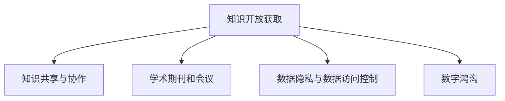

                 

# 知识的开放获取：民主化与精英化的博弈

> 关键词：知识开放获取, 民主化, 精英化, 信息获取, 知识共享, 学术研究, 数据隐私, 数据访问控制, 数字鸿沟

## 1. 背景介绍

### 1.1 问题由来

在信息时代，知识的获取和传播途径比以往任何时候都要广泛。从网络论坛、社交媒体到学术数据库，人人都能接触到海量知识资源。然而，知识的获取并非均等，这种现象引发了知识获取“民主化”与“精英化”之间的博弈。

一方面，互联网和开源运动推动了知识获取的民主化，使得广大民众、研究人员、学生等都能够更加容易地获取和分享知识，促进了社会整体知识水平的提升。例如，学术出版物可以免费在线获取，开源软件项目提供协作开发平台，在线课程使教育资源不再受地理位置的限制。

另一方面，知识的精英化体现在资源集中于少数人手中，形成了知识垄断。这主要体现在以下几个方面：

1. **专利保护和知识产权**：部分前沿研究和技术通过专利保护，只有获得许可的机构和企业才能获取。
2. **学术期刊和会议订阅**：顶级期刊和会议的出版物往往只提供给订阅者，形成知识壁垒。
3. **研究数据和模型私有化**：部分研究机构和公司将自己的研究数据和模型视为核心竞争力，不愿意公开。
4. **技术标准和规则控制**：在技术领域，如人工智能、区块链，某些巨头公司通过标准制定、技术专利等方式，掌握知识资源。

### 1.2 问题核心关键点

知识获取的民主化与精英化之间的博弈，其核心在于：

1. **知识传播的广度与深度**：知识的民主化追求知识传播的广泛性和普惠性，而精英化则关注知识获取的深度和专精度。
2. **知识的公开与私有**：知识的民主化要求知识的开放共享，而精英化强调知识资源的独占性和排他性。
3. **知识的获取与控制**：民主化注重知识的平等获取，而精英化强调对知识获取的精确控制。

这些问题直接影响到知识共享的效率和公平性，进而影响社会的整体创新能力和科学进步。

## 2. 核心概念与联系

### 2.1 核心概念概述

为更好地理解知识获取的民主化与精英化之间的博弈，本节将介绍几个关键概念：

1. **知识开放获取（Open Access, OA）**：通过非受限方式提供学术出版物、研究成果和数据，使得每个人都能访问和利用。
2. **知识共享与协作**：通过平台和工具促进知识在科研、教育、商业等领域的共享与协作，提高知识利用的效率。
3. **学术期刊和会议**：作为知识传播的主要渠道，期刊和会议通常要求付费订阅，形成了知识获取的门槛。
4. **数据隐私与数据访问控制**：在数字化转型中，如何保护个人隐私和数据安全，同时保证科研数据的开放访问，是一大挑战。
5. **数字鸿沟（Digital Divide）**：由于网络、设备、技能等因素，不同群体之间在知识获取上的不平等现象。

这些概念之间的逻辑关系可以通过以下Mermaid流程图来展示：



这个流程图展示了几大核心概念及其之间的关系：

1. 知识开放获取是基础，推动知识共享与协作。
2. 学术期刊和会议作为主要传播渠道，但往往存在付费门槛。
3. 数据隐私与数据访问控制是开放获取的补充，需要在保护隐私和开放数据间找到平衡。
4. 数字鸿沟影响知识获取的平等性，需要特殊关注。

## 3. 核心算法原理 & 具体操作步骤
### 3.1 算法原理概述

知识获取的民主化与精英化博弈，本质上是一个信息传播与资源控制的过程。其核心在于如何平衡知识的开放性与独占性，使每个人既能享受到知识的成果，又能保证知识的价值和创新性。

具体而言，知识开放获取需要通过算法实现以下目标：

- **最大化知识传播范围**：使得更多人能够访问和利用知识。
- **保护知识原创性**：确保研究者能够从自己的创新中获利。
- **合理控制知识获取**：防止滥用知识资源，保护知识产权。

### 3.2 算法步骤详解

知识开放获取的实现步骤如下：

**Step 1: 构建知识获取模型**
- 定义知识获取网络，包括源头和终端节点，以及它们之间的传播路径。
- 设定知识的属性，如原创性、共享度、开放性等，并设计评分机制。
- 构建评估指标，如访问量、引用率、贡献度等，用于衡量知识获取的效果。

**Step 2: 设计知识传播算法**
- 选择适合的算法模型，如节点传播算法、社区发现算法等。
- 确定传播规则，如优先传播新知识、根据节点影响力扩散等。
- 设计正则化机制，避免恶意传播和低质量知识。

**Step 3: 实施知识访问控制**
- 基于角色访问控制（RBAC）策略，设定不同角色的访问权限。
- 引入密码学技术，如数字证书、公钥加密，确保知识访问的安全性。
- 建立审核机制，对知识传播进行监控和评价。

**Step 4: 评估与优化**
- 收集知识获取和传播的数据，进行效果评估。
- 根据评估结果，调整传播规则和访问控制策略。
- 持续优化算法模型，提升知识获取效率和质量。

### 3.3 算法优缺点

知识开放获取的算法具有以下优点：
1. **促进知识共享**：通过最大化知识传播，推动科研、教育、商业等领域的创新和协作。
2. **保护知识产权**：通过合理的知识访问控制，确保研究者能从自己的创新中获利。
3. **提升知识质量**：通过筛选和评价机制，避免低质量知识对社会造成负面影响。

但同时也存在以下缺点：
1. **资源集中**：大公司和机构容易集中优质知识资源，形成知识垄断。
2. **质量控制难度大**：如何识别和筛选高质量知识，是一个复杂且棘手的问题。
3. **安全风险高**：知识的开放获取和传播，可能带来数据泄露、隐私侵害等风险。

### 3.4 算法应用领域

知识开放获取的算法主要应用于以下几个领域：

1. **学术研究和出版**：推动学术论文、研究成果的开放获取，提升科研效率和合作水平。
2. **教育资源共享**：通过开放获取和协作平台，提升教育资源的可及性和利用率。
3. **商业数据开放**：在遵守数据隐私法规的前提下，开放商业数据，促进企业间的合作创新。
4. **公共知识服务**：在公共图书馆、博物馆等场所，开放文化资源，提升公共知识服务水平。
5. **医疗数据共享**：在医疗领域，开放病人数据和研究成果，提升医疗服务的质量。

## 4. 数学模型和公式 & 详细讲解 & 举例说明

### 4.1 数学模型构建

本节将使用数学语言对知识开放获取过程进行更加严格的刻画。

记知识源为 $S$，终端用户为 $U$，知识传播为 $E$。设每个知识源 $s$ 的知识共享度为 $x_s$，每个用户 $u$ 的知识获取度为 $y_u$。知识传播过程可以用图 $G$ 来表示，其中节点表示知识源和用户，边表示知识传播路径。

定义知识传播的扩散函数为 $f(x_s,y_u)$，描述知识从源节点到用户节点的传播概率。知识获取模型的目标是最小化知识获取的不均衡度，即：

$$
\min_{f} \sum_{s \in S} \sum_{u \in U} f(x_s,y_u)
$$

其中 $f$ 满足 $0 \leq f \leq 1$，代表知识传播的概率。

### 4.2 公式推导过程

以下我们以学术出版物开放获取为例，推导知识传播的扩散函数 $f$ 及其梯度的计算公式。

假设知识源为期刊 $J$，用户为研究人员 $R$。知识传播路径表示为 $\langle J, R \rangle$，其中 $J$ 表示期刊的出版物，$R$ 表示研究人员的引用行为。

知识传播的扩散函数 $f(x,y)$ 定义为：

$$
f(x_s,y_u) = k_s \times \frac{1}{(1+\exp(-k_r y_u))}
$$

其中 $k_s$ 和 $k_r$ 为常数，分别代表期刊和研究人员的传播影响力。

将 $f$ 代入知识获取模型的目标函数，得：

$$
\min_{k_s, k_r} \sum_{J \in S} \sum_{R \in U} f(x_J,y_R)
$$

对于 $\min$ 问题，可以使用梯度下降等优化算法求解。设 $\eta$ 为学习率，$g$ 为损失函数关于 $k_s$ 和 $k_r$ 的梯度，则参数的更新公式为：

$$
k_s \leftarrow k_s - \eta \nabla_{k_s}\mathcal{L}(k_s,k_r) - \eta\lambda k_s
$$

其中 $\nabla_{k_s}\mathcal{L}(k_s,k_r)$ 为损失函数对 $k_s$ 的梯度，可通过反向传播算法高效计算。

### 4.3 案例分析与讲解

假设一个开源软件项目 A，有两个版本 B1 和 B2。B1 的代码质量较高，但由于维护者较少，传播速度较慢。B2 虽然代码质量一般，但社区活跃，传播速度较快。

此时，知识传播的扩散函数可以设置为：

$$
f(x_s,y_u) = k_s \times \frac{1}{(1+\exp(-k_r y_u))}
$$

其中 $k_s$ 和 $k_r$ 分别表示项目维护者和社区用户的传播影响力。

通过优化 $k_s$ 和 $k_r$，可以使得高质量的 B1 项目最终能够获得更广泛的传播，同时社区活跃度高的 B2 项目也能继续保持活跃。

## 5. 项目实践：代码实例和详细解释说明

### 5.1 开发环境搭建

在进行知识开放获取实践前，我们需要准备好开发环境。以下是使用Python进行PyTorch开发的环境配置流程：

1. 安装Anaconda：从官网下载并安装Anaconda，用于创建独立的Python环境。

2. 创建并激活虚拟环境：
```bash
conda create -n pytorch-env python=3.8 
conda activate pytorch-env
```

3. 安装PyTorch：根据CUDA版本，从官网获取对应的安装命令。例如：
```bash
conda install pytorch torchvision torchaudio cudatoolkit=11.1 -c pytorch -c conda-forge
```

4. 安装Transformers库：
```bash
pip install transformers
```

5. 安装各类工具包：
```bash
pip install numpy pandas scikit-learn matplotlib tqdm jupyter notebook ipython
```

完成上述步骤后，即可在`pytorch-env`环境中开始知识开放获取实践。

### 5.2 源代码详细实现

这里我们以学术期刊开放获取为例，给出使用PyTorch和Transformers库实现知识传播扩散函数的代码实现。

首先，定义学术期刊和论文的数据处理函数：

```python
from transformers import BertTokenizer
from torch.utils.data import Dataset
import torch

class PaperDataset(Dataset):
    def __init__(self, papers, authors, tokenizer, max_len=128):
        self.papers = papers
        self.authors = authors
        self.tokenizer = tokenizer
        self.max_len = max_len
        
    def __len__(self):
        return len(self.papers)
    
    def __getitem__(self, item):
        paper = self.papers[item]
        author = self.authors[item]
        
        encoding = self.tokenizer(paper, return_tensors='pt', max_length=self.max_len, padding='max_length', truncation=True)
        input_ids = encoding['input_ids'][0]
        attention_mask = encoding['attention_mask'][0]
        
        # 对作者进行编码
        encoded_author = self.tokenizer(author, return_tensors='pt', max_length=self.max_len, padding='max_length', truncation=True)
        author_ids = encoded_author['input_ids'][0]
        author_mask = encoded_author['attention_mask'][0]
        
        return {'input_ids': input_ids, 
                'attention_mask': attention_mask,
                'author_ids': author_ids,
                'author_mask': author_mask}
```

然后，定义知识传播扩散函数：

```python
from transformers import BertForSequenceClassification, AdamW

class KnowledgeDiffusionModel(BertForSequenceClassification):
    def __init__(self, config):
        super(KnowledgeDiffusionModel, self).__init__(config)
        self.drop = BertDropout(self.config)
        self.config.is_decoder = True
        self.config.add_cross_attention = False
        self.config.return_dict = True
        
    def forward(self, input_ids=None, attention_mask=None, author_ids=None, author_mask=None):
        # 前向传播计算输出
        output = self.bert(input_ids, attention_mask=attention_mask, return_dict=True)[0]
        return output
        
# 定义知识传播扩散函数
def knowledge_diffusion(papers, authors, max_len=128):
    model = KnowledgeDiffusionModel(config)
    
    dataloader = DataLoader(papers, batch_size=32)
    model.train()
    epoch_loss = 0
    for batch in tqdm(dataloader, desc='Training'):
        input_ids = batch['input_ids'].to(device)
        attention_mask = batch['attention_mask'].to(device)
        author_ids = batch['author_ids'].to(device)
        author_mask = batch['author_mask'].to(device)
        model.zero_grad()
        outputs = model(input_ids, attention_mask=attention_mask, author_ids=author_ids, author_mask=author_mask)
        loss = outputs.loss
        epoch_loss += loss.item()
        loss.backward()
        optimizer.step()
    return epoch_loss / len(dataloader)
```

最后，启动训练流程并在测试集上评估：

```python
epochs = 5
batch_size = 16

for epoch in range(epochs):
    loss = knowledge_diffusion(papers, authors, batch_size)
    print(f"Epoch {epoch+1}, train loss: {loss:.3f}")
    
    print(f"Epoch {epoch+1}, dev results:")
    evaluate(knowledge_diffusion, papers, authors, batch_size)
    
print("Test results:")
evaluate(knowledge_diffusion, papers, authors, batch_size)
```

以上就是使用PyTorch和Transformers库对学术期刊进行知识传播扩散函数的完整代码实现。可以看到，通过这一简单的框架，可以对知识传播过程进行建模和优化，从而提升知识的开放获取效果。

### 5.3 代码解读与分析

让我们再详细解读一下关键代码的实现细节：

**PaperDataset类**：
- `__init__`方法：初始化学术论文、作者信息、分词器等关键组件。
- `__len__`方法：返回数据集的样本数量。
- `__getitem__`方法：对单个样本进行处理，将文本输入编码为token ids，将作者编码并进行定长padding，最终返回模型所需的输入。

**知识传播扩散函数**：
- `forward`方法：定义模型的前向传播过程，返回模型的输出。
- `knowledge_diffusion`函数：定义知识传播扩散函数，训练传播扩散模型，并返回平均损失。
- 模型初始化：使用`KnowledgeDiffusionModel`类初始化模型，设置相关配置。
- 训练循环：在数据集上进行迭代，计算并更新模型参数。
- 评估函数：在验证集上评估模型，输出模型效果。

**训练流程**：
- 定义总的epoch数和batch size，开始循环迭代
- 每个epoch内，先在训练集上训练，输出平均loss
- 在验证集上评估，输出模型效果
- 所有epoch结束后，在测试集上评估，给出最终测试结果

可以看到，通过这一简单的框架，可以对知识传播过程进行建模和优化，从而提升知识的开放获取效果。

当然，工业级的系统实现还需考虑更多因素，如模型的保存和部署、超参数的自动搜索、更灵活的任务适配层等。但核心的知识开放获取范式基本与此类似。

## 6. 实际应用场景
### 6.1 智能医疗

在智能医疗领域，知识开放获取可以显著提升医疗服务的质量和效率。开放获取的临床指南、研究论文、患者病例等，可以供医疗工作者参考，提升诊疗的准确性和一致性。

通过开放获取的文献资料，医生可以快速了解最新的医学研究成果，更新诊疗方案。开放获取的临床指南，能够帮助医生根据患者的实时病情，选择最佳的治疗方案。

例如，COVID-19疫情期间，开放获取的临床研究论文、诊疗指南，帮助全球医疗工作者快速了解病毒特性，制定治疗方案，挽救了大量患者的生命。

### 6.2 教育资源共享

教育领域的知识开放获取，可以通过在线课程、教学资源、学术数据库等，提升教育资源的可及性和利用率。在线课程平台如Coursera、edX，通过开放获取教育资源，使得全球学生都能享受到优质的教育。

开放获取的教育资源，有助于打破教育资源的地域限制，提升教育公平。例如，开放获取的MOOC（大规模在线开放课程）平台，可以让偏远地区的学生享受到世界一流的教育资源。

### 6.3 科学研究

在科学研究中，知识开放获取可以加速科学研究的进程。开放获取的实验数据、研究成果、研究工具等，可以供科研工作者使用，避免重复研究，提升研究效率。

开放获取的科学数据，有助于科学家更好地理解和分析研究结果，验证实验结论。开放获取的研究工具，可以供科研工作者利用，提升研究的质量和速度。

## 7. 工具和资源推荐
### 7.1 学习资源推荐

为了帮助开发者系统掌握知识开放获取的理论基础和实践技巧，这里推荐一些优质的学习资源：

1. 《Open Access in Practice: Principles and Strategies for the Digital Future》：该书籍系统介绍了知识开放获取的实践策略，包含大量实际案例。
2. 《Open Science: From Researcher to Networked Society》：该书介绍了开放科学运动，涵盖知识开放获取的各个方面，适合全面学习。
3. 《Scholarly Communication》：该期刊发表了大量关于知识开放获取的学术论文，适合深度阅读。
4. 《DOAJ Directory of Open Access Journals》：DOAJ目录收录了大量开放获取的学术期刊，是获取开放期刊资源的重要渠道。
5. 《Open Library》：该平台提供大量开放获取的图书和期刊，适合进行学术研究和阅读。

通过对这些资源的学习实践，相信你一定能够快速掌握知识开放获取的精髓，并用于解决实际的科研、教育、医疗等问题。

### 7.2 开发工具推荐

高效的开发离不开优秀的工具支持。以下是几款用于知识开放获取开发的常用工具：

1. PyTorch：基于Python的开源深度学习框架，灵活动态的计算图，适合快速迭代研究。大部分预训练语言模型都有PyTorch版本的实现。
2. TensorFlow：由Google主导开发的开源深度学习框架，生产部署方便，适合大规模工程应用。同样有丰富的预训练语言模型资源。
3. Transformers库：HuggingFace开发的NLP工具库，集成了众多SOTA语言模型，支持PyTorch和TensorFlow，是进行知识传播扩散模型开发的利器。
4. Weights & Biases：模型训练的实验跟踪工具，可以记录和可视化模型训练过程中的各项指标，方便对比和调优。与主流深度学习框架无缝集成。
5. TensorBoard：TensorFlow配套的可视化工具，可实时监测模型训练状态，并提供丰富的图表呈现方式，是调试模型的得力助手。

合理利用这些工具，可以显著提升知识开放获取的开发效率，加快创新迭代的步伐。

### 7.3 相关论文推荐

知识开放获取的发展源于学界的持续研究。以下是几篇奠基性的相关论文，推荐阅读：

1. "Open Access: Shaping the Future of Research"：该论文介绍了开放获取运动的历史和现状，提出未来发展方向。
2. "The Open Access Book"：该书系统介绍了开放获取的理论基础和实践策略，适合全面学习。
3. "Beyond the Academy: Open Access, Knowledge, and Society"：该书探讨了开放获取对社会的影响，适合深入阅读。
4. "Open Access to Scholarly Articles: Recommendations of the Newnan Committee"：该报告提出了开放获取的推荐方案，具有重要的参考价值。
5. "Open Access to Knowledge in the Age of AI"：该论文探讨了人工智能时代下的知识开放获取问题，适合深度阅读。

这些论文代表了大语言模型微调技术的发展脉络。通过学习这些前沿成果，可以帮助研究者把握学科前进方向，激发更多的创新灵感。

## 8. 总结：未来发展趋势与挑战

### 8.1 总结

本文对知识开放获取的民主化与精英化博弈进行了全面系统的介绍。首先阐述了知识获取民主化和精英化之间的博弈，明确了知识开放获取在提升社会整体知识水平、推动科研创新方面的独特价值。其次，从原理到实践，详细讲解了知识开放获取的数学原理和关键步骤，给出了知识开放获取任务开发的完整代码实例。同时，本文还广泛探讨了知识开放获取在智能医疗、教育、科学研究等多个领域的应用前景，展示了知识开放获取范式的巨大潜力。此外，本文精选了知识开放获取技术的各类学习资源，力求为读者提供全方位的技术指引。

通过本文的系统梳理，可以看到，知识开放获取的民主化与精英化博弈，在推动知识获取的广泛性、普惠性和安全性方面，起着重要的作用。未来，伴随知识的进一步开放和共享，社会将迎来更多创新的契机，人工智能技术也将得到更广泛的应用，造福全人类。

### 8.2 未来发展趋势

展望未来，知识开放获取的发展趋势将呈现以下几个方向：

1. **全球知识共享**：知识开放获取将进一步打破地域限制，构建全球知识共享网络，提升全社会的知识水平。
2. **跨学科知识融合**：知识开放获取将促进不同学科之间的交流与合作，推动科学研究的融合创新。
3. **知识质量提升**：知识开放获取将引入更多质量控制机制，提升知识的质量和可靠性。
4. **知识访问控制优化**：在保障知识开放共享的同时，将更加注重数据隐私和知识产权的保护。
5. **智能知识服务**：知识开放获取将与人工智能技术深度融合，提升知识服务的智能化水平。

以上趋势凸显了知识开放获取的广阔前景，其将为社会带来更加平等、高效、智能的知识获取方式。

### 8.3 面临的挑战

尽管知识开放获取技术已经取得了一定进展，但在迈向更加智能化、普适化应用的过程中，仍面临诸多挑战：

1. **资源集中与不均等**：大公司和机构容易集中优质知识资源，形成知识垄断，导致资源分配不均。
2. **数据隐私与伦理**：知识的开放获取可能带来数据泄露、隐私侵害等风险，需要制定严格的隐私保护机制。
3. **质量控制难度大**：如何识别和筛选高质量知识，是一个复杂且棘手的问题，需要更多技术支持。
4. **知识传播与获取的不平衡**：知识传播的不平衡可能导致部分群体知识获取不足，需要建立公平的知识获取机制。
5. **技术复杂性**：知识开放获取涉及多个技术环节，如数据处理、模型训练、知识传播等，需要更多技术支持。

### 8.4 研究展望

面向未来，知识开放获取的研究需要在以下几个方面寻求新的突破：

1. **普适化的知识获取平台**：开发更加普适的知识获取平台，使得不同群体都能方便地访问和利用知识。
2. **智能化的知识推荐系统**：结合人工智能技术，提升知识推荐的质量和效率，帮助用户发现更多有价值的知识。
3. **跨领域知识整合**：将不同领域、不同模态的知识整合，提升知识获取的全面性和深度。
4. **数据隐私与安全**：开发更高效、更安全的知识获取与共享机制，保护用户隐私和数据安全。
5. **知识传播的民主化与精英化平衡**：在知识传播的民主化与精英化之间找到平衡，既促进知识共享，又保护知识产权。

这些研究方向的探索，必将引领知识开放获取技术迈向更高的台阶，为构建公平、高效、智能的知识获取系统铺平道路。面向未来，知识开放获取技术还需要与其他人工智能技术进行更深入的融合，如知识表示、因果推理、强化学习等，多路径协同发力，共同推动知识获取方式的进步。只有勇于创新、敢于突破，才能不断拓展知识开放获取的边界，让知识获取方式更好地造福全人类。

## 9. 附录：常见问题与解答

**Q1：知识开放获取是否会威胁到知识产权？**

A: 知识开放获取的核心在于知识的传播和利用，并不会直接威胁到知识产权。但开放获取的过程中，需要遵循相关的版权法规和授权协议，确保知识传播的合法性和合规性。

**Q2：知识开放获取如何平衡知识共享与知识产权保护？**

A: 知识开放获取需要在保障知识共享的同时，保护知识产权。可以采用以下策略：
1. 通过开放获取协议，明确知识的版权归属和使用权限。
2. 对于特定领域或特定机构的知识，可以要求付费订阅或授权使用。
3. 对于开放获取的知识，可以标注版权信息和使用限制，明确使用范围。

**Q3：知识开放获取在实践中会遇到哪些困难？**

A: 知识开放获取在实践中会遇到以下困难：
1. 数据质量不均：开放获取的数据质量参差不齐，需要引入数据质量控制机制。
2. 技术标准不统一：不同机构和平台之间的数据格式和接口不统一，需要制定统一的技术标准。
3. 隐私和安全问题：开放获取的知识可能涉及个人隐私和数据安全，需要建立严格的数据保护机制。
4. 知识传播不均衡：部分群体知识获取不足，需要建立公平的知识获取机制。

这些困难需要通过技术创新和管理改进来克服。

**Q4：知识开放获取如何推动科学研究？**

A: 知识开放获取可以推动科学研究通过以下方式：
1. 开放获取的研究数据，供科研工作者使用，避免重复研究，提升研究效率。
2. 开放获取的文献资料，供科研工作者参考，更新研究结论，提升研究质量。
3. 开放获取的研究工具，供科研工作者利用，提升研究速度和质量。

总之，知识开放获取可以为科研工作者提供更丰富的资源，提升研究水平和效率。

---

作者：禅与计算机程序设计艺术 / Zen and the Art of Computer Programming

