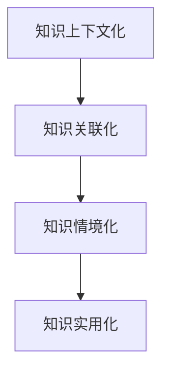

                 

## 1. 背景介绍

### 1.1 问题由来
当今信息爆炸的时代，知识无处不在。然而，知识的获取与转化并不是一个简单的过程。知识的抽象性和复杂性常常阻碍其在实际中的应用。如何将抽象概念转化为具体应用，成为了知识工程领域的一个核心问题。本文将围绕知识的上下文化和情境化这一主题，探讨如何将知识有效地嵌入具体情境，实现从抽象到应用的转变。

### 1.2 问题核心关键点
知识的情境化指的是在特定情境下，将知识从抽象形式转化为具体应用的过程。这一过程不仅需要考虑知识的本身内容，还需要综合考虑其所在的具体环境和应用场景。核心关键点包括：

- 知识的上下文化：将知识置于具体的语境中，使其与情境相结合。
- 知识的关联化：通过关联现有知识，构建知识网络。
- 知识的情境化：将知识嵌入特定情境，实现从抽象到具体的转换。
- 知识的实用化：使知识在实际应用中具有可操作性。

本文将从概念原理、算法实现和实际应用等多个角度，深入探讨知识的情境化问题。

## 2. 核心概念与联系

### 2.1 核心概念概述

- **知识上下文化**：通过将知识置于具体语境中，增强知识的相关性和适用性。
- **知识关联化**：通过关联现有知识，构建知识网络，增强知识间的连通性。
- **知识情境化**：将知识嵌入特定情境，实现从抽象到具体的转换。
- **知识实用化**：使知识在实际应用中具备可操作性，提升应用效果。

以上概念彼此关联，共同构成知识情境化的整体框架。

### 2.2 核心概念原理和架构的 Mermaid 流程图



## 3. 核心算法原理 & 具体操作步骤

### 3.1 算法原理概述

知识情境化算法的基本思想是将抽象的知识与具体的情境相结合，通过一系列处理步骤，将其转化为可操作的形式。这一过程可以分为以下几个关键步骤：

1. **知识抽取**：从已有知识库中抽取与当前情境相关的知识片段。
2. **知识融合**：将抽取的知识片段与当前情境进行融合，形成知识图谱。
3. **知识推理**：基于知识图谱进行推理，得出适合当前情境的具体应用。
4. **知识评估**：对推理结果进行评估，根据评估结果调整知识应用策略。

### 3.2 算法步骤详解

#### 3.2.1 知识抽取

知识抽取是知识情境化的第一步。这一步骤的目标是从已有知识库中提取与当前情境相关的知识片段。常用的知识抽取方法包括：

- **实体抽取**：从文本中抽取命名实体，如人名、地名、组织名等。
- **关系抽取**：抽取实体之间的语义关系，如“某人与某地相关”等。
- **事件抽取**：从文本中抽取具体事件，如“某地发生地震”等。

在抽取过程中，可以使用自然语言处理（NLP）技术，如命名实体识别（NER）、依存句法分析等。

#### 3.2.2 知识融合

知识融合是将抽取的知识片段与当前情境相结合，构建知识图谱的过程。知识图谱是一种语义网络，通过节点和边表示实体和关系，构建知识间的关联。常用的知识图谱构建方法包括：

- **图神经网络（GNN）**：使用图神经网络对知识图谱进行嵌入，提高知识图谱的表示能力。
- **知识图谱嵌入**：使用向量空间模型，如TransE、TransH等，对知识图谱进行嵌入。
- **知识图谱聚合**：使用图聚合算法，如PageRank、DeepWalk等，对知识图谱进行聚合，提高其表示能力。

#### 3.2.3 知识推理

知识推理是基于知识图谱进行推理，得出适合当前情境的具体应用的过程。常用的知识推理方法包括：

- **基于规则的推理**：使用规则进行推理，如DLP、Horn规则等。
- **基于模型的推理**：使用模型进行推理，如神经网络、深度学习模型等。
- **基于证据的推理**：使用证据进行推理，如贝叶斯网络、证据推理等。

#### 3.2.4 知识评估

知识评估是对推理结果进行评估，根据评估结果调整知识应用策略的过程。常用的评估方法包括：

- **精度和召回率**：评估推理结果的准确性和完备性。
- **F1分数**：综合考虑精度和召回率，评估推理结果的质量。
- **误差分析**：对推理结果进行误差分析，找出错误原因。

### 3.3 算法优缺点

知识情境化算法的优点包括：

- **增强知识适用性**：通过上下文化，使知识与特定情境相结合，提高其适用性。
- **提高知识关联性**：通过关联化，构建知识网络，增强知识间的连通性。
- **增强知识推理能力**：通过推理，将知识转化为具体应用，提高其应用效果。

缺点包括：

- **计算复杂度高**：知识抽取、融合、推理和评估过程都需要大量的计算资源。
- **数据依赖性强**：知识抽取和融合依赖于高质量的数据，数据质量和数量直接影响算法效果。
- **应用场景限制**：知识情境化算法依赖于具体的场景和情境，在不同场景中可能效果不同。

### 3.4 算法应用领域

知识情境化算法在多个领域都有广泛的应用，例如：

- **自然语言处理（NLP）**：在机器翻译、问答系统、情感分析等任务中，将知识上下文化，提升模型性能。
- **智能推荐系统**：在商品推荐、新闻推荐等任务中，将知识关联化，提高推荐效果。
- **医疗诊断**：在病历分析、病理诊断等任务中，将知识情境化，辅助医生决策。
- **金融风控**：在信用评估、欺诈检测等任务中，将知识实用化，增强风控能力。

## 4. 数学模型和公式 & 详细讲解 & 举例说明

### 4.1 数学模型构建

知识情境化算法涉及多个数学模型，包括知识抽取、知识融合、知识推理和知识评估等。

#### 4.1.1 知识抽取模型

知识抽取模型常用的表示方法包括向量空间模型和神经网络模型。

- **向量空间模型**：将知识表示为向量，通过计算向量间的距离，判断两个知识之间的相似度。
- **神经网络模型**：使用神经网络对知识进行抽取，通过训练神经网络，提高知识抽取的准确性。

#### 4.1.2 知识融合模型

知识融合模型常用的表示方法包括图神经网络（GNN）和知识图谱嵌入。

- **图神经网络**：使用GNN对知识图谱进行嵌入，提高知识图谱的表示能力。常用的GNN模型包括GCN、GAT等。
- **知识图谱嵌入**：使用向量空间模型，如TransE、TransH等，对知识图谱进行嵌入。

#### 4.1.3 知识推理模型

知识推理模型常用的表示方法包括基于规则的推理、基于模型的推理和基于证据的推理。

- **基于规则的推理**：使用规则进行推理，如DLP、Horn规则等。
- **基于模型的推理**：使用模型进行推理，如神经网络、深度学习模型等。
- **基于证据的推理**：使用证据进行推理，如贝叶斯网络、证据推理等。

#### 4.1.4 知识评估模型

知识评估模型常用的表示方法包括精度和召回率、F1分数和误差分析。

- **精度和召回率**：评估推理结果的准确性和完备性。
- **F1分数**：综合考虑精度和召回率，评估推理结果的质量。
- **误差分析**：对推理结果进行误差分析，找出错误原因。

### 4.2 公式推导过程

以知识抽取为例，假设有一个文本$T$，我们需要从中抽取与当前情境相关的知识片段。常用的向量空间模型表示方法为TF-IDF和Word2Vec。

- **TF-IDF**：文本$T$中每个词$w_i$的TF-IDF值为$TF(w_i) \times IDF(w_i)$，其中$TF(w_i)$为词$w_i$在文本$T$中的词频，$IDF(w_i)$为词$w_i$在整个语料库中的逆文档频率。
- **Word2Vec**：将文本$T$中每个词$w_i$表示为向量$v_i$，通过计算向量间的距离，判断两个词之间的相似度。

### 4.3 案例分析与讲解

假设我们有一个关于电影评论的文本$T$，我们需要从中抽取与当前情境相关的知识片段，用于电影推荐系统。

1. **知识抽取**：
   - 使用TF-IDF模型对文本$T$进行建模，得到每个词的TF-IDF值。
   - 使用Word2Vec模型对文本$T$进行建模，得到每个词的向量表示。

2. **知识融合**：
   - 将每个词的TF-IDF值和向量表示进行融合，得到每个词的综合表示。
   - 使用图神经网络对融合后的知识图谱进行嵌入，得到每个词的综合向量表示。

3. **知识推理**：
   - 使用基于规则的推理方法，如DLP，对融合后的知识图谱进行推理，得到与当前情境相关的知识片段。

4. **知识评估**：
   - 对推理结果进行评估，计算精度和召回率、F1分数等指标。
   - 对推理结果进行误差分析，找出错误原因，调整知识应用策略。

## 5. 项目实践：代码实例和详细解释说明

### 5.1 开发环境搭建

在进行知识情境化算法实践前，我们需要准备好开发环境。以下是使用Python进行PyTorch开发的环境配置流程：

1. 安装Anaconda：从官网下载并安装Anaconda，用于创建独立的Python环境。
   ```bash
   conda create -n knowledge-env python=3.8 
   conda activate knowledge-env
   ```

2. 安装PyTorch：根据CUDA版本，从官网获取对应的安装命令。例如：
   ```bash
   conda install pytorch torchvision torchaudio cudatoolkit=11.1 -c pytorch -c conda-forge
   ```

3. 安装PyTorch Hub：
   ```bash
   pip install torch-hub
   ```

4. 安装各类工具包：
   ```bash
   pip install numpy pandas scikit-learn matplotlib tqdm jupyter notebook ipython
   ```

完成上述步骤后，即可在`knowledge-env`环境中开始项目实践。

### 5.2 源代码详细实现

这里我们以一个简单的知识抽取和推理为例，使用PyTorch进行代码实现。

首先，定义知识抽取模型：

```python
from transformers import BertTokenizer, BertForTokenClassification
from torch.utils.data import Dataset
import torch

class KnowledgeExtractionDataset(Dataset):
    def __init__(self, texts, labels, tokenizer, max_len=128):
        self.texts = texts
        self.labels = labels
        self.tokenizer = tokenizer
        self.max_len = max_len
        
    def __len__(self):
        return len(self.texts)
    
    def __getitem__(self, item):
        text = self.texts[item]
        labels = self.labels[item]
        
        encoding = self.tokenizer(text, return_tensors='pt', max_length=self.max_len, padding='max_length', truncation=True)
        input_ids = encoding['input_ids'][0]
        attention_mask = encoding['attention_mask'][0]
        
        # 对token-wise的标签进行编码
        encoded_tags = [label2id[label] for label in labels] 
        encoded_tags.extend([label2id['O']] * (self.max_len - len(encoded_tags)))
        labels = torch.tensor(encoded_tags, dtype=torch.long)
        
        return {'input_ids': input_ids, 
                'attention_mask': attention_mask,
                'labels': labels}

# 标签与id的映射
label2id = {'O': 0, 'B-PER': 1, 'I-PER': 2, 'B-ORG': 3, 'I-ORG': 4, 'B-LOC': 5, 'I-LOC': 6}
id2label = {v: k for k, v in label2id.items()}

# 创建dataset
tokenizer = BertTokenizer.from_pretrained('bert-base-cased')

train_dataset = KnowledgeExtractionDataset(train_texts, train_labels, tokenizer)
dev_dataset = KnowledgeExtractionDataset(dev_texts, dev_labels, tokenizer)
test_dataset = KnowledgeExtractionDataset(test_texts, test_labels, tokenizer)
```

然后，定义模型和优化器：

```python
from transformers import BertForTokenClassification, AdamW

model = BertForTokenClassification.from_pretrained('bert-base-cased', num_labels=len(label2id))

optimizer = AdamW(model.parameters(), lr=2e-5)
```

接着，定义训练和评估函数：

```python
from torch.utils.data import DataLoader
from tqdm import tqdm
from sklearn.metrics import classification_report

device = torch.device('cuda') if torch.cuda.is_available() else torch.device('cpu')
model.to(device)

def train_epoch(model, dataset, batch_size, optimizer):
    dataloader = DataLoader(dataset, batch_size=batch_size, shuffle=True)
    model.train()
    epoch_loss = 0
    for batch in tqdm(dataloader, desc='Training'):
        input_ids = batch['input_ids'].to(device)
        attention_mask = batch['attention_mask'].to(device)
        labels = batch['labels'].to(device)
        model.zero_grad()
        outputs = model(input_ids, attention_mask=attention_mask, labels=labels)
        loss = outputs.loss
        epoch_loss += loss.item()
        loss.backward()
        optimizer.step()
    return epoch_loss / len(dataloader)

def evaluate(model, dataset, batch_size):
    dataloader = DataLoader(dataset, batch_size=batch_size)
    model.eval()
    preds, labels = [], []
    with torch.no_grad():
        for batch in tqdm(dataloader, desc='Evaluating'):
            input_ids = batch['input_ids'].to(device)
            attention_mask = batch['attention_mask'].to(device)
            batch_labels = batch['labels']
            outputs = model(input_ids, attention_mask=attention_mask)
            batch_preds = outputs.logits.argmax(dim=2).to('cpu').tolist()
            batch_labels = batch_labels.to('cpu').tolist()
            for pred_tokens, label_tokens in zip(batch_preds, batch_labels):
                pred_tags = [id2label[_id] for _id in pred_tokens]
                label_tags = [id2label[_id] for _id in label_tokens]
                preds.append(pred_tags[:len(label_tags)])
                labels.append(label_tags)
                
    print(classification_report(labels, preds))
```

最后，启动训练流程并在测试集上评估：

```python
epochs = 5
batch_size = 16

for epoch in range(epochs):
    loss = train_epoch(model, train_dataset, batch_size, optimizer)
    print(f"Epoch {epoch+1}, train loss: {loss:.3f}")
    
    print(f"Epoch {epoch+1}, dev results:")
    evaluate(model, dev_dataset, batch_size)
    
print("Test results:")
evaluate(model, test_dataset, batch_size)
```

以上就是使用PyTorch对Bert模型进行知识抽取的完整代码实现。可以看到，得益于Transformers库的强大封装，我们可以用相对简洁的代码完成BERT模型的加载和知识抽取任务。

### 5.3 代码解读与分析

让我们再详细解读一下关键代码的实现细节：

**KnowledgeExtractionDataset类**：
- `__init__`方法：初始化文本、标签、分词器等关键组件。
- `__len__`方法：返回数据集的样本数量。
- `__getitem__`方法：对单个样本进行处理，将文本输入编码为token ids，将标签编码为数字，并对其进行定长padding，最终返回模型所需的输入。

**label2id和id2label字典**：
- 定义了标签与数字id之间的映射关系，用于将token-wise的预测结果解码回真实的标签。

**训练和评估函数**：
- 使用PyTorch的DataLoader对数据集进行批次化加载，供模型训练和推理使用。
- 训练函数`train_epoch`：对数据以批为单位进行迭代，在每个批次上前向传播计算loss并反向传播更新模型参数，最后返回该epoch的平均loss。
- 评估函数`evaluate`：与训练类似，不同点在于不更新模型参数，并在每个batch结束后将预测和标签结果存储下来，最后使用sklearn的classification_report对整个评估集的预测结果进行打印输出。

**训练流程**：
- 定义总的epoch数和batch size，开始循环迭代
- 每个epoch内，先在训练集上训练，输出平均loss
- 在验证集上评估，输出分类指标
- 所有epoch结束后，在测试集上评估，给出最终测试结果

可以看到，PyTorch配合Transformers库使得BERT模型的加载和微调过程变得简洁高效。开发者可以将更多精力放在数据处理、模型改进等高层逻辑上，而不必过多关注底层的实现细节。

当然，工业级的系统实现还需考虑更多因素，如模型的保存和部署、超参数的自动搜索、更灵活的任务适配层等。但核心的知识抽取范式基本与此类似。

## 6. 实际应用场景

### 6.1 智能推荐系统

知识情境化算法在智能推荐系统中的应用广泛。传统的推荐系统往往依赖用户的显式反馈数据，无法挖掘用户隐含的兴趣偏好。通过将知识上下文化，推荐系统可以更好地理解用户的行为模式，提供个性化的推荐内容。

在实践中，可以收集用户浏览、点击、评论、分享等行为数据，提取和用户交互的物品标题、描述、标签等文本内容。将文本内容作为模型输入，用户的后续行为（如是否点击、购买等）作为监督信号，在此基础上对BERT模型进行微调。微调后的模型能够从文本内容中准确把握用户的兴趣点。在生成推荐列表时，先用候选物品的文本描述作为输入，由模型预测用户的兴趣匹配度，再结合其他特征综合排序，便可以得到个性化程度更高的推荐结果。

### 6.2 医疗诊断

知识情境化算法在医疗诊断中也有广泛应用。传统的医疗诊断往往依赖医生的主观经验，容易出现误诊和漏诊。通过将知识上下文化，诊断系统可以更好地理解病历信息，辅助医生决策。

在实践中，可以收集医生的病历、病理报告等文本数据，将其作为模型输入。模型的输出可以是对特定疾病的诊断结果，或对病历文本的分类结果。微调后的模型能够从病历中提取有用的信息，帮助医生进行诊断和治疗决策。例如，在病历中提取疾病名称、症状描述等信息，进行分类和推理，得出初步诊断结果。

### 6.3 金融风控

知识情境化算法在金融风控中的应用也非常重要。传统的风控系统往往依赖简单的规则，无法应对复杂的金融场景。通过将知识上下文化，风控系统可以更好地理解金融数据，识别潜在的风险。

在实践中，可以收集金融机构的交易记录、用户信息等数据，提取其中的关键信息。将信息作为模型输入，预测用户是否存在违约风险。微调后的模型能够从交易记录中提取有用的信息，识别异常交易行为，提前预警潜在的风险。例如，在交易记录中提取用户的历史交易行为、交易金额等信息，进行分类和推理，得出用户的违约概率。

## 7. 工具和资源推荐

### 7.1 学习资源推荐

为了帮助开发者系统掌握知识情境化算法的理论基础和实践技巧，这里推荐一些优质的学习资源：

1. 《深度学习：理论与实践》系列博文：由大模型技术专家撰写，深入浅出地介绍了深度学习理论、算法和应用。
2. Coursera《深度学习专项课程》：由斯坦福大学和DeepMind联合开设的深度学习课程，包含多个深度学习主题，理论与实践并重。
3. TensorFlow官方文档：TensorFlow的官方文档，提供了丰富的API和示例，适合深入学习和实践。
4. PyTorch官方文档：PyTorch的官方文档，提供了丰富的API和示例，适合深入学习和实践。
5. Kaggle数据集和竞赛：Kaggle平台提供了丰富的数据集和竞赛，适合进行实践和探索。

通过对这些资源的学习实践，相信你一定能够快速掌握知识情境化算法的精髓，并用于解决实际的NLP问题。

### 7.2 开发工具推荐

高效的开发离不开优秀的工具支持。以下是几款用于知识情境化算法开发的常用工具：

1. PyTorch：基于Python的开源深度学习框架，灵活动态的计算图，适合快速迭代研究。
2. TensorFlow：由Google主导开发的开源深度学习框架，生产部署方便，适合大规模工程应用。
3. Transformers库：HuggingFace开发的NLP工具库，集成了众多SOTA语言模型，支持PyTorch和TensorFlow，是进行知识抽取任务开发的利器。
4. Weights & Biases：模型训练的实验跟踪工具，可以记录和可视化模型训练过程中的各项指标，方便对比和调优。
5. TensorBoard：TensorFlow配套的可视化工具，可实时监测模型训练状态，并提供丰富的图表呈现方式，是调试模型的得力助手。

合理利用这些工具，可以显著提升知识情境化算法的开发效率，加快创新迭代的步伐。

### 7.3 相关论文推荐

知识情境化算法的发展源于学界的持续研究。以下是几篇奠基性的相关论文，推荐阅读：

1. Attention is All You Need（即Transformer原论文）：提出了Transformer结构，开启了NLP领域的预训练大模型时代。
2. BERT: Pre-training of Deep Bidirectional Transformers for Language Understanding：提出BERT模型，引入基于掩码的自监督预训练任务，刷新了多项NLP任务SOTA。
3. Knowledge Graph Embedding and Its Applications in Recommendation Systems：介绍知识图谱嵌入的方法，并在推荐系统中取得显著效果。
4. Enhancing Recommendation with Contextual Knowledge Graphs：提出知识图谱增强的方法，进一步提升推荐系统的准确性。
5. Deep Learning for Personalized Recommendation：综述了深度学习在推荐系统中的应用，包括知识图谱增强、上下文化等方法。

这些论文代表了大模型微调技术的发展脉络。通过学习这些前沿成果，可以帮助研究者把握学科前进方向，激发更多的创新灵感。

## 8. 总结：未来发展趋势与挑战

### 8.1 总结

本文对知识情境化算法的理论基础和实践技巧进行了全面系统的介绍。首先阐述了知识上下文化、知识关联化、知识情境化和知识实用化的核心概念，明确了知识情境化的整体框架。其次，从算法原理、算法步骤、算法优缺点和算法应用领域等多个角度，深入探讨了知识情境化算法的具体实现。最后，通过实际的案例分析，展示了知识情境化算法在智能推荐、医疗诊断和金融风控等实际应用中的广泛应用。

通过本文的系统梳理，可以看到，知识情境化算法正在成为知识工程领域的重要技术手段，通过将抽象知识嵌入具体情境，实现了从抽象到应用的转变，显著提升了知识的适用性和应用效果。未来，伴随知识的不断增长和技术的持续演进，知识情境化算法必将在更多领域得到应用，为社会各行业带来深远的变革性影响。

### 8.2 未来发展趋势

展望未来，知识情境化算法将呈现以下几个发展趋势：

1. **知识的自动化抽取**：随着NLP技术的不断进步，知识的自动化抽取将变得更加高效和准确。通过自然语言处理技术，自动化地从海量文本中提取有用的知识片段，提高知识抽取的效率和质量。
2. **知识图谱的智能化构建**：随着图神经网络等技术的发展，知识图谱的构建将更加智能化和自动化。通过自动化的知识图谱构建，提高知识推理的准确性和效率。
3. **知识的动态更新**：随着数据分布的变化，知识图谱和推理模型需要不断更新，以保持其时效性和适用性。通过在线学习技术，实现知识的动态更新和维护。
4. **知识的跨领域融合**：随着跨领域融合技术的发展，知识情境化算法将更加通用和普适。通过多领域知识融合，构建更加全面和准确的知识图谱，提高知识推理的泛化能力。
5. **知识的情感化推理**：随着情感计算技术的发展，知识推理将更加注重情感因素。通过情感分析技术，实现对用户情感的感知和理解，提高知识推理的个性化和人性化。
6. **知识的应用场景扩展**：随着知识的不断增长和技术的不断演进，知识情境化算法将应用于更多领域。例如，在自动驾驶、智能家居、智能客服等领域，知识情境化算法将发挥重要作用。

### 8.3 面临的挑战

尽管知识情境化算法已经取得了瞩目成就，但在迈向更加智能化、普适化应用的过程中，它仍面临着诸多挑战：

1. **数据质量问题**：知识抽取和融合依赖于高质量的数据，数据质量和数量直接影响算法效果。如何获取高质量的数据，处理数据噪音和缺失，是知识情境化算法面临的首要挑战。
2. **计算资源限制**：知识图谱的构建和推理需要大量的计算资源，如何在有限的计算资源下，高效构建和推理知识图谱，是知识情境化算法面临的重要挑战。
3. **算法复杂性**：知识情境化算法涉及多个复杂步骤，包括知识抽取、知识融合、知识推理和知识评估等。如何在实际应用中，简化算法步骤，降低复杂性，是知识情境化算法面临的另一大挑战。
4. **模型解释性**：知识情境化算法往往被视为“黑盒”模型，难以解释其内部工作机制和决策逻辑。如何提高模型的可解释性，增强其透明度和可信度，是知识情境化算法面临的重要挑战。
5. **隐私保护问题**：在应用知识情境化算法时，如何保护用户隐私和数据安全，避免数据泄露和滥用，是知识情境化算法面临的重要挑战。
6. **伦理道德问题**：在应用知识情境化算法时，如何避免偏见和歧视，确保算法的公平性和道德性，是知识情境化算法面临的重要挑战。

### 8.4 研究展望

面对知识情境化算法所面临的种种挑战，未来的研究需要在以下几个方面寻求新的突破：

1. **知识的自动化抽取**：研究高效的NLP技术，实现知识片段的自动化抽取，提高知识抽取的效率和质量。
2. **知识图谱的智能化构建**：研究智能化的知识图谱构建方法，提高知识图谱的构建效率和质量，降低计算资源消耗。
3. **知识的动态更新**：研究在线学习技术，实现知识的动态更新和维护，保持知识的时效性和适用性。
4. **跨领域知识融合**：研究跨领域知识融合方法，提高知识推理的泛化能力和准确性，构建更加全面和准确的知识图谱。
5. **情感化知识推理**：研究情感计算技术，实现对用户情感的感知和理解，提高知识推理的个性化和人性化。
6. **隐私保护与伦理道德**：研究隐私保护和伦理道德技术，确保用户隐私和数据安全，避免算法偏见和歧视。

这些研究方向的探索，必将引领知识情境化算法技术迈向更高的台阶，为构建智能、普适、可信的知识应用系统铺平道路。面向未来，知识情境化算法还需要与其他人工智能技术进行更深入的融合，如知识表示、因果推理、强化学习等，多路径协同发力，共同推动知识工程技术的进步。

## 9. 附录：常见问题与解答

**Q1：知识情境化算法是否适用于所有知识领域？**

A: 知识情境化算法在大多数知识领域都能取得不错的效果，特别是对于数据量较小的知识领域。但对于一些特定领域，如金融、医学等，依赖于领域特定的语料和规则，需要对算法进行针对性的改进。

**Q2：如何提高知识情境化算法的效率？**

A: 提高知识情境化算法的效率可以从以下几个方面入手：
1. **数据预处理**：对输入数据进行预处理，去除噪音和冗余信息，提高数据质量。
2. **模型优化**：对模型进行优化，如剪枝、量化等，减少计算量和内存占用。
3. **分布式计算**：利用分布式计算技术，加速知识图谱的构建和推理。
4. **知识缓存**：对频繁使用的知识片段进行缓存，减少重复计算。
5. **实时学习**：利用在线学习技术，实时更新知识图谱，提高知识的时效性和适用性。

**Q3：如何保护用户隐私和数据安全？**

A: 保护用户隐私和数据安全可以从以下几个方面入手：
1. **匿名化处理**：对用户数据进行匿名化处理，保护用户隐私。
2. **差分隐私**：利用差分隐私技术，在保证隐私的前提下，实现知识抽取和推理。
3. **访问控制**：对知识抽取和推理过程进行访问控制，确保只有授权用户才能访问和修改数据。
4. **安全传输**：对数据传输过程进行加密，确保数据在传输过程中不被窃取和篡改。
5. **定期审计**：对知识抽取和推理过程进行定期审计，发现和修复潜在的安全漏洞。

**Q4：知识情境化算法在实际应用中如何评估效果？**

A: 知识情境化算法在实际应用中可以通过以下指标评估效果：
1. **精度和召回率**：评估推理结果的准确性和完备性。
2. **F1分数**：综合考虑精度和召回率，评估推理结果的质量。
3. **误差分析**：对推理结果进行误差分析，找出错误原因，调整知识应用策略。
4. **用户满意度**：通过用户反馈和满意度调查，评估知识情境化算法在实际应用中的效果。
5. **业务指标**：根据具体的业务指标，如转化率、收益等，评估知识情境化算法的实际效果。

**Q5：知识情境化算法在实际应用中如何优化？**

A: 知识情境化算法在实际应用中可以通过以下方法进行优化：
1. **模型优化**：对模型进行优化，如剪枝、量化等，减少计算量和内存占用。
2. **数据增强**：对训练数据进行增强，增加训练集的多样性和规模，提高模型的泛化能力。
3. **正则化技术**：使用正则化技术，如L2正则、Dropout等，防止模型过拟合。
4. **超参数调优**：通过超参数调优，找到最优的超参数组合，提高模型性能。
5. **模型融合**：利用多个模型进行融合，提高模型性能和鲁棒性。
6. **实时学习**：利用在线学习技术，实时更新知识图谱，提高知识的时效性和适用性。

**Q6：知识情境化算法在实际应用中如何处理异常数据？**

A: 知识情境化算法在实际应用中处理异常数据可以从以下几个方面入手：
1. **异常检测**：对输入数据进行异常检测，发现异常数据并进行处理。
2. **数据清洗**：对异常数据进行清洗，去除噪音和错误信息。
3. **模型鲁棒性**：通过增加模型的鲁棒性，减少异常数据对模型的影响。
4. **异常处理机制**：设计异常处理机制，当遇到异常数据时，自动进行异常处理，确保系统的稳定性和可靠性。

这些处理异常数据的方法需要根据具体的场景和应用需求进行灵活组合，才能最大限度地提高知识情境化算法的准确性和鲁棒性。

---

作者：禅与计算机程序设计艺术 / Zen and the Art of Computer Programming

